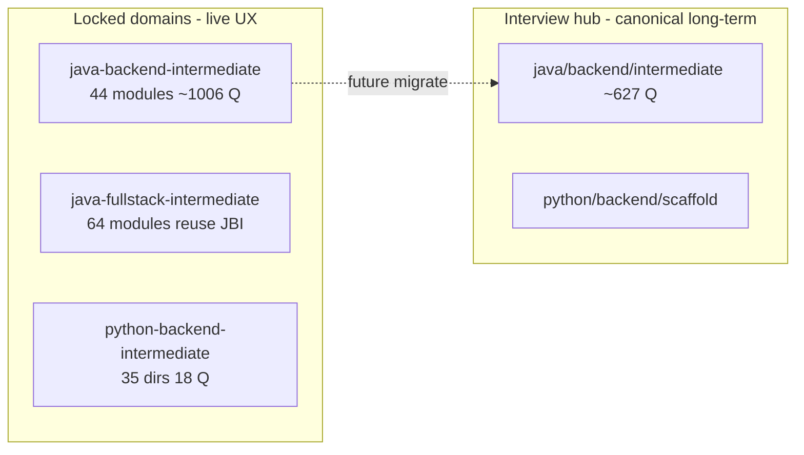

# Expansion Plan: 50-File Master Playbook

## Goal

Add `[expansion-plan/](expansion-plan/)` at the repository root containing **51 markdown files**:

- `**00-INDEX.md`** — master table of contents, execution waves, cross-links
- `**01` through `50`** — one focused playbook per expansion area

Each playbook uses the **same template** so you can execute them one-by-one without re-reading the whole project. Writing targets **plain English**, **search phrases people actually type** (e.g. "spring boot interview questions", "python backend interview questions"), and **repo-specific paths** already in use.

## Relationship to existing docs


| Existing doc                                                     | Role                                         | Expansion-plan role                                                       |
| ---------------------------------------------------------------- | -------------------------------------------- | ------------------------------------------------------------------------- |
| [MASTER_PLAN.md](MASTER_PLAN.md)                                 | Architecture law (hubs, URL matrix, schemas) | Playbooks cite sections; do not duplicate full matrix                     |
| [ROADMAP.md](ROADMAP.md)                                         | What is live vs hidden (`launch-config.ts`)  | Each launch playbook ends with "flip flag + smoke checklist" from ROADMAP |
| [docs/CONTENT-PLAN.md](docs/CONTENT-PLAN.md)                     | SEO competitor buckets (Java/DSA focus)      | SEO keyword tables per track in relevant playbooks                        |
| [docs/SPEAKABLE-PLAN.md](docs/SPEAKABLE-PLAN.md)                 | Speakable quality system                     | Files 09–10, 46 own speakable rollout                                     |
| [docs/speakable/PHASE-STATUS.md](docs/speakable/PHASE-STATUS.md) | Current speakable phase                      | File 10 references Phase 3b gate                                          |


**Do not replace** those files—`expansion-plan/` is the **sequential operator manual**.

## Standard template (every file 01–50)

Each playbook includes these sections (consistent headings):

1. **Why this matters** — 2–3 sentences, interview + SEO angle
2. **Search phrases to own** — 5–10 real Google-style queries (easy language)
3. **Current state** — what exists on disk / in UI today (paths + counts)
4. **Target state** — measurable exit criteria (question counts, modules, flags)
5. **Depends on** — links to other `expansion-plan/NN-*.md` files
6. **Step-by-step tasks** — numbered checklist (implementation order)
7. **Files and code to touch** — exact paths (`content/`, `frontend/lib/`, APIs)
8. **Content rules** — atomic questions, interview voice, schema pointers
9. **SEO and URLs** — canonical app URL, SEO slug, sitemap note
10. **QA before done** — build, one E2E question, `hasContent` on `/domains`
11. **Estimated effort** — S / M / L / XL

## Content reality to embed in playbooks

Two trees (called out in file **03**):




**Flagship today:** [content/java-backend-intermediate/](content/java-backend-intermediate/) + [frontend/lib/course-lms.ts](frontend/lib/course-lms.ts) (`PREMIUM_COURSE_SLUGS`).

**Locked-domain wiring today:** only JBI + JFI in [frontend/lib/content-reader.ts](frontend/lib/content-reader.ts) and [frontend/app/api/content/stack-structure/route.ts](frontend/app/api/content/stack-structure/route.ts)—Python playbooks must add `python-backend-intermediate` to `LOCKED_DOMAINS`.

**MVP visibility:** [frontend/lib/launch-config.ts](frontend/lib/launch-config.ts) — `ENABLED_LANGUAGES`, `ENABLED_HUBS`, `LAUNCH_QUICK_PATHS`.

---

## Directory layout

```
expansion-plan/
├── 00-INDEX.md
├── 01-vision-and-competitive-position.md
├── 02-current-content-inventory.md
├── …
└── 50-operations-governance-and-maintenance.md
```

---

## All 50 playbooks (title + purpose)

### Wave A — Foundation (read first, no content generation)


| #   | File                                    | Purpose                                                                                |
| --- | --------------------------------------- | -------------------------------------------------------------------------------------- |
| 01  | `01-vision-and-competitive-position.md` | Beat LeetCode/GfG/Baeldung; six differentiation levers from CONTENT-PLAN               |
| 02  | `02-current-content-inventory.md`       | Snapshot: JBI 44 modules, JFI reuse, PBI 18 Q, interview matrix, hub stubs             |
| 03  | `03-dual-content-architecture.md`       | Locked domain vs `content/interview/`; when to use which; migration principle          |
| 04  | `04-master-url-and-seo-strategy.md`     | App URL vs SEO slug vs `/interview/` canonical; [frontend/proxy.ts](frontend/proxy.ts) |
| 05  | `05-launch-config-and-feature-flags.md` | Single switch for public UI; map every quick path to a live page                       |
| 06  | `06-content-schema-and-qa-format.md`    | `complete-qa.json` shape, sections, difficulty, speakable fields                       |
| 07  | `07-locked-domain-pattern.md`           | `_index.json`, module/topic folders, `contentSource` reuse (JFI model)                 |
| 08  | `08-module-registry-and-pillar-nav.md`  | Pillars P01–P12, SEO intros, [frontend/lib/seo-slugs.ts](frontend/lib/seo-slugs.ts)    |


### Wave B — Java Backend Intermediate (anchor quality)


| #   | File                                     | Purpose                                                                    |
| --- | ---------------------------------------- | -------------------------------------------------------------------------- |
| 09  | `09-speakable-program-overview.md`       | Archetypes, lint, codex; link docs/SPEAKABLE-PLAN.md                       |
| 10  | `10-jbi-speakable-phase-3b-rollout.md`   | 12 pillar parallel agents; human review gate; scripts in `scripts/`        |
| 11  | `11-jbi-pillar-quality-audit.md`         | Per-pillar question density vs blueprint; fix thin modules                 |
| 12  | `12-jbi-java-language-and-core.md`       | P01: core-java, OOP, collections, streams, concurrency, JVM                |
| 13  | `13-jbi-spring-ecosystem.md`             | P02: spring-core through spring-batch                                      |
| 14  | `14-jbi-data-persistence.md`             | P03: SQL, PostgreSQL, MongoDB, Redis                                       |
| 15  | `15-jbi-apis-messaging-microservices.md` | P04–P05: REST, GraphQL, gRPC, Kafka, RabbitMQ; fix duplicate pillar labels |


### Wave C — Java levels + fullstack


| #   | File                                           | Purpose                                                                          |
| --- | ---------------------------------------------- | -------------------------------------------------------------------------------- |
| 16  | `16-jbi-system-design-security-testing.md`     | P06–P08 depth targets                                                            |
| 17  | `17-jbi-devops-cloud-production.md`            | P09–P11: Docker, K8s, AWS/GCP/Azure, observability                               |
| 18  | `18-jbi-behavioral-and-interview-readiness.md` | P12: behavioral, engineering practices, LLD                                      |
| 19  | `19-java-backend-beginner-scaffold.md`         | Locked tree or interview-only; ~145 Q today in `interview/java/backend/beginner` |
| 20  | `20-java-backend-beginner-content-and-seo.md`  | Target 300+ Q; keywords: "java interview questions for freshers"                 |
| 21  | `21-java-backend-beginner-frontend-launch.md`  | `PREMIUM_COURSE_SLUGS`, `SLUG_TO_PATH`, home quick path                          |
| 22  | `22-java-backend-advanced-scaffold.md`         | 19 stacks empty; senior/ architect focus                                         |
| 23  | `23-java-backend-advanced-content-and-seo.md`  | 400+ Q; "java system design interview", architecture                             |
| 24  | `24-java-fullstack-backend-reuse.md`           | Verify all 43 `contentSource` → JBI modules                                      |
| 25  | `25-java-fullstack-react-modules.md`           | Native FE: react-core, state, routing, performance, testing                      |
| 26  | `26-java-fullstack-angular-and-typescript.md`  | Angular + TS modules; fullstack SEO slugs                                        |
| 27  | `27-java-fullstack-javascript-css-browser.md`  | JS core, CSS, performance, auth flows                                            |
| 28  | `28-java-fullstack-launch-checklist.md`        | 500+ native FE Q + full BE reuse; E2E fullstack loop                             |


### Wave D — Python family


| #   | File                                               | Purpose                                                            |
| --- | -------------------------------------------------- | ------------------------------------------------------------------ |
| 29  | `29-python-backend-intermediate-scaffold-audit.md` | 35 modules in `_index.json`; gap vs JBI parity                     |
| 30  | `30-python-core-oop-and-builtin-types.md`          | Finish 7 started topics (18 Q → 80+); "python interview questions" |
| 31  | `31-python-frameworks-django-fastapi-flask.md`     | Web frameworks module batch                                        |
| 32  | `32-python-data-async-celery-redis.md`             | asyncio, Celery, caching                                           |
| 33  | `33-python-databases-and-orm.md`                   | SQLAlchemy, PostgreSQL, MongoDB                                    |
| 34  | `34-python-devops-docker-cicd-cloud.md`            | docker-python, cicd, aws-python                                    |
| 35  | `35-python-security-testing-production.md`         | application-security, engineering-practices                        |
| 36  | `36-python-backend-lock-domain-and-launch.md`      | Add to `LOCKED_DOMAINS`; 400+ Q gate; `/domains` card              |
| 37  | `37-python-backend-beginner-track.md`              | Beginner scaffold + 250 Q; launch-config path                      |
| 38  | `38-python-data-engineering-track.md`              | Airflow, Spark, Kafka; quick path already on home                  |
| 39  | `39-python-ml-ai-track.md`                         | MLOps, serving, LLMs                                               |
| 40  | `40-python-fullstack-track.md`                     | Python BE + React/Vue pattern (optional reuse)                     |


### Wave E — Hubs and other languages


| #   | File                                               | Purpose                                                                            |
| --- | -------------------------------------------------- | ---------------------------------------------------------------------------------- |
| 41  | `41-dsa-hub-architecture-and-schema.md`            | [content/dsa/_index.json](content/dsa/_index.json) 18 modules; problem JSON schema |
| 42  | `42-dsa-content-wave-one-and-walkthroughs.md`      | 50 problems; line-by-line; enable `ENABLED_HUBS.dsa`                               |
| 43  | `43-dsa-seo-patterns-and-company-tags.md`          | "blind 75", "neetcode", pattern pages                                              |
| 44  | `44-system-design-hub.md`                          | `/system-design`; case studies; link from JBI P06                                  |
| 45  | `45-behavioral-and-star-method-hub.md`             | STAR; 70+ Q; enable `behavioral` hub                                               |
| 46  | `46-company-prep-pages.md`                         | [content/companies/](content/companies/); FAANG templates                          |
| 47  | `47-roadmaps-and-study-plans.md`                   | 4/8-week plans linking into JBI/PBI module URLs                                    |
| 48  | `48-tools-topics-compare-hubs.md`                  | Guru99-style `/tools/`; X vs Y `/compare/`                                         |
| 49  | `49-javascript-go-ruby-language-tracks.md`         | Hidden scaffolds → 300 Q/track before `ENABLED_LANGUAGES`                          |
| 50  | `50-interview-migration-seo-sitemap-operations.md` | Canonical `content/interview/` migration; sitemap; ongoing governance              |


---

## `00-INDEX.md` contents

- Ordered execution table (Wave A → E)
- Dependency graph (mermaid)
- Links to [ROADMAP.md](ROADMAP.md) smoke checklist
- Status column template: `NOT_STARTED | IN_PROGRESS | DONE`
- Pointer: "Start at 01, then 02; do not skip 05 before any launch playbook"

---

## Implementation approach (after plan approval)

1. Create `expansion-plan/` directory.
2. Write `**00-INDEX.md**` first with full 50-row table.
3. Generate files **01–50** using a one-time script `[scripts/generate_expansion_plan_docs.py](scripts/generate_expansion_plan_docs.py)` (optional but recommended for consistency)—each file ~80–120 lines of real project-specific guidance, not placeholders.
4. Add one line to [ROADMAP.md](ROADMAP.md): "Sequential expansion playbooks: `expansion-plan/00-INDEX.md`".
5. **Do not** duplicate MASTER_PLAN or SPEAKABLE-PLAN bodies—only link them.

**Estimated write size:** ~5,000–6,000 lines total across 51 files.

---

## Execution order for you (human)

1. Read **01–08** (half day)
2. Complete **09–18** while JBI is flagship (speakable + pillar depth)
3. **19–28** Java family breadth
4. **29–40** Python parity (MVP promise on home page)
5. **41–48** hubs (flip `launch-config` one hub at a time)
6. **49–50** languages + long-term migration

---

## Out of scope for the 50 files

- Changing speakable schema/codex (locked per PHASE-STATUS)
- Force-pushing git / production deploy runbooks
- Backend Java API feature work unless noted in file 50

---

## Success criteria for this deliverable

- All 51 files exist under `expansion-plan/`
- Every file 01–50 follows the standard template
- `00-INDEX.md` lists dependencies and waves
- ROADMAP cross-link added
- No broken internal links between playbooks

