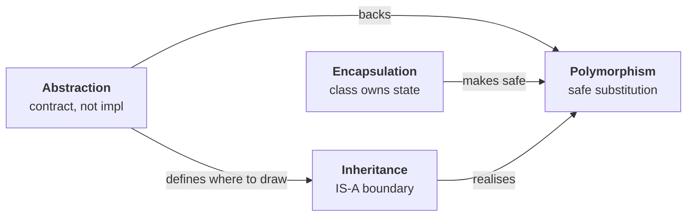
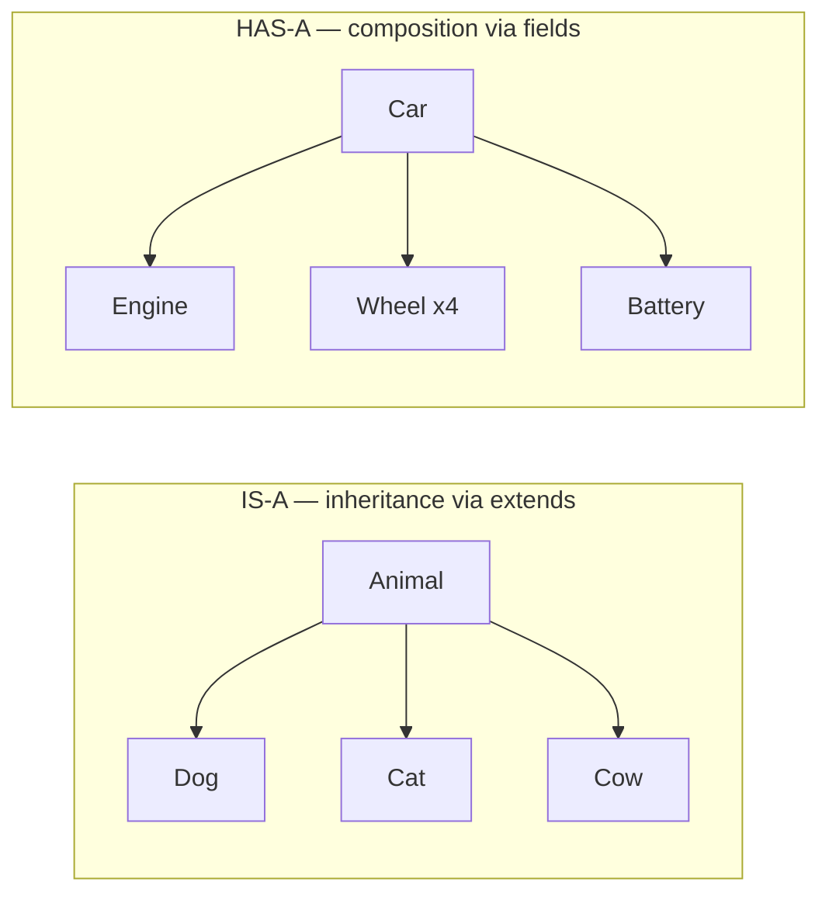
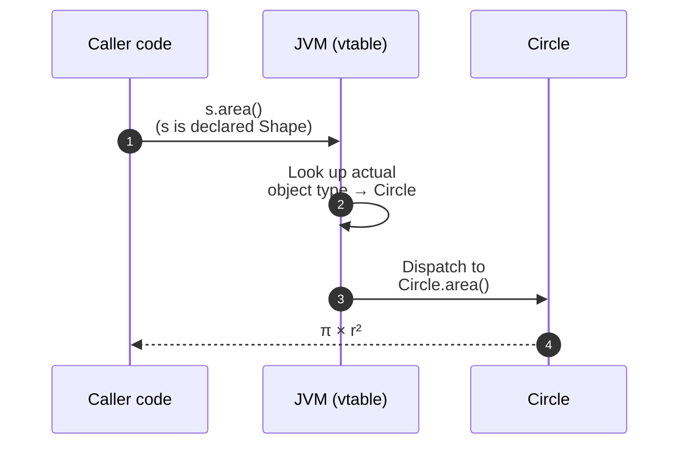

## Quick

- An **object** is a self-contained unit holding its own data plus the methods that work on that data; a **class** is the blueprint, an **object** is an instance of it.
- **Encapsulation** — the class owns its state. Fields stay `private`; expose **behaviour** (`account.withdraw(100)`), not raw setters.
- **Inheritance** — IS-A via `extends`. Java allows single inheritance through classes; multiple via interfaces. Always pass the IS-A test before reaching for it.
- **Polymorphism** — same call, different behaviour by object. **Overloading** is compile-time (compiler picks); **overriding** is runtime (JVM picks by actual object type).
- **Abstraction** — depend on the contract, not the implementation. `interface` = 100% abstraction, `abstract class` = partial. It's a *design principle*, not the `abstract` keyword.
- All four converge in one line: `List<String> names = new ArrayList<>()` — abstraction (`List`), encapsulation (private internal array), polymorphism (any List substitutes), inheritance (`ArrayList implements List`).

## Speakable

Object-Oriented Programming is just a way of organising code around objects — and an object is a self-contained unit that holds its own data along with the behaviour that works on that data. In Java, a class is the blueprint, and an object is what you get when you create — or instantiate — that class. So if I have a `Dog` class with `name` and `breed` as fields and `bark()` and `eat()` as methods, every dog object I create from it has the same shape but its own values.

The four pillars — Encapsulation, Inheritance, Polymorphism, and Abstraction — are the design principles that govern how you build those objects so the system stays maintainable as it grows.

**Encapsulation** is about giving the class control over its own state. The fields stay `private`, and the only way to change them is through the methods the class exposes. So instead of letting the caller do `setBalance(getBalance() - 100)`, the `BankAccount` class offers `account.withdraw(100)` — and inside that method it validates the amount, checks for overdraft, logs the transaction, and updates the balance. The caller doesn't know how the balance is stored. If I change `balance` from `double` to `BigDecimal` later for precision, no caller breaks, because they never touched the field directly. That's what encapsulation buys you — it isolates change.

**Inheritance** is the IS-A relationship between classes, expressed through the `extends` keyword. `Dog extends Animal` means a `Dog` is an `Animal` — it inherits the parent's fields and methods, can override behaviour, and can add its own. Before reaching for it, I run the IS-A test: a dog is an animal, so inheritance fits; but a car has an engine, so that's composition, not inheritance. Java only allows single inheritance through classes — you can't `extends` two parents — and the reason is the diamond problem, where two parents could provide conflicting versions of the same method. For multiple inheritance, you use interfaces.

**Polymorphism** literally means 'many forms' — the same method call behaves differently depending on the actual object. There are two kinds. Compile-time polymorphism is method overloading — same method name, different parameters, and the compiler picks the right version at build time. Runtime polymorphism is method overriding — `Shape s = new Circle(); s.area()` runs `Circle.area()`, because the JVM looks at the actual object type at runtime, not at the type of the variable. Without polymorphism, adding a new payment method means editing every `if-else` chain; with it, you just add a new class.

**Abstraction** is hiding the implementation details and exposing only what the caller needs. An `interface` is full abstraction — pure contract, no implementation detail. An `abstract class` is partial — it can mix abstract methods with concrete ones. The everyday version of abstraction is writing `List<String> names = new ArrayList<>()` instead of `ArrayList<String> names = new ArrayList<>()`. By depending on the `List` contract, you can swap to `LinkedList` tomorrow and zero callers change.

The four work as a system, not a checklist. Encapsulation is what makes polymorphism safe — because the class controls its own invariants, you can substitute one implementation for another without breaking callers. Abstraction is what tells you where inheritance boundaries should be. And that one line, `List<String> names = new ArrayList<>()`, actually uses all four at once: `List` is the abstraction, `ArrayList`'s internal array is encapsulated, any `List` implementation can substitute via polymorphism, and `ArrayList` satisfies the `List` contract through inheritance.

## Deep dive

### What OOP actually is

Object-Oriented Programming organises code around **objects** — self-contained units that combine data (fields) and behaviour (methods). A **class** is the blueprint; an **object** is an instance of that class. Define a `Dog` class with `name` and `breed` fields and `bark()` and `eat()` methods, and every dog object you create from it gets the same structure with its own values.

```java
class Dog {
    private String name;
    private String breed;

    public Dog(String name, String breed) {
        this.name  = name;
        this.breed = breed;
    }

    public void bark() { System.out.println(name + " says woof!"); }
    public void eat()  { System.out.println(name + " is eating."); }
}

Dog buddy = new Dog("Buddy", "Labrador");
buddy.bark();   // Buddy says woof!
```

Java's OOP is built on four principles: **Encapsulation**, **Inheritance**, **Polymorphism**, and **Abstraction**. Each one solves a specific design problem — they're the rules for how objects protect their data, relate to each other, and hide complexity from callers. The rest of this page walks through each, then shows how they interact in real code.

### The four pillars at a glance

| Pillar | Core idea | Java mechanism | The mistake to avoid |
|---|---|---|---|
| **Encapsulation** | Bundle data + methods; class owns its state | `private` fields, public behaviour methods | Treating getters/setters as encapsulation |
| **Inheritance** | Child acquires parent's properties via IS-A | `extends`, `@Override`, `super` | Using inheritance for HAS-A relationships |
| **Polymorphism** | One call, many forms by object type | Overloading (compile-time), overriding (runtime) | Confusing the two; using `if-else` for type dispatch |
| **Abstraction** | Hide the *how*, show the *what* | `interface`, `abstract` class | Conflating the *principle* with the `abstract` keyword |

The pillars don't operate in isolation — they reinforce each other. **Encapsulation** keeps state safe, which lets **polymorphism** substitute implementations without breaking invariants. **Abstraction** defines the contract, which guides where **inheritance** boundaries belong. The diagram below shows the relationships:



### Encapsulation — the class controls its own state

Encapsulation means bundling data and the methods that work on that data inside a class, then restricting how the outside world reaches in. Think of a medicine capsule — the active ingredients are sealed; you interact with the tablet as a whole. A `BankAccount` works the same way: callers don't reach in and modify `balance`; they call `withdraw()`.

The rule that matters most: **expose behaviour, not state.**

```java
// ❌ Theatre — caller drives every decision, class protects nothing
class BankAccount {
    private double balance;
    public double getBalance()         { return balance; }
    public void   setBalance(double b) { this.balance = b; }
}

account.setBalance(account.getBalance() - 100);
// no validation, no audit log, no overdraft check — every caller reimplements them
```

```java
// ✅ Real encapsulation — class owns its invariants
class BankAccount {
    private double balance;

    public void withdraw(double amount) {
        if (amount > balance) throw new InsufficientFundsException();
        balance -= amount;
        auditLog.record("WITHDRAW", amount);   // caller never sees this
    }
}

account.withdraw(100);   // intent only — validation lives in one place
```

Six months later, the `balance` field changes from `double` to `BigDecimal` for precision, or moves to a transaction-ledger lookup. **No caller breaks** — they only ever called `withdraw()`. That refactor safety is what encapsulation actually buys you.

> [!warning] The getter/setter trap
>
> A `private` field with a `getBalance()` and `setBalance()` is *not* encapsulation. The state is effectively public — you've just added a method-shaped layer between callers and the field. Use accessors only when external code genuinely needs to read the value, and almost never expose blanket setters.

### Inheritance — the IS-A relationship

Inheritance lets a child class acquire fields and methods of a parent through the `extends` keyword. `Dog extends Animal` means a `Dog` **is** an `Animal` — it gets `name`, `age`, `eat()`, `sleep()` for free, can override behaviour, and can add `bark()`.

The decision rule is the **IS-A test** — and the visual is the easiest way to remember it:



```java
// ✅ IS-A — inheritance fits
class Animal { void eat() { /* … */ } }
class Dog extends Animal { void bark() { /* … */ } }

// ✅ HAS-A — composition, not inheritance
class Engine { void run() { /* … */ } }
class Car { private Engine engine; }
```

Java supports **single, multilevel, and hierarchical** inheritance through classes — but **not multiple inheritance through classes**. You can't `extends` two parents. The reason is the diamond problem: two parents could supply conflicting versions of the same method, and there's no good rule for which one wins.

```java
// ❌ The diamond problem — multi-inheritance collapses
class Vehicle { /* … */ }
class Car  extends Vehicle { /* … */ }
class Boat extends Vehicle { /* … */ }

class AmphibiousVehicle extends Car  { /* … */ }   // not a Boat
class AmphibiousVehicle extends Boat { /* … */ }   // not a Car
// no correct answer exists — Java disallows it for this reason
```

```java
// ✅ Composition — behaviours assembled, not inherited
class AmphibiousVehicle {
    private CarDrive  carDrive  = new CarDrive();
    private BoatDrive boatDrive = new BoatDrive();

    public void drive() { carDrive.drive(); }
    public void sail()  { boatDrive.sail();  }
}
```

For multiple inheritance of *type* (capabilities), Java uses **interfaces** — a class can implement many of them, and Java 8+ default methods solve the diamond problem deterministically when conflicts arise (the compiler forces you to override and choose).

> [!tip] Favour composition over inheritance
>
> Reach for `extends` only when the relationship is permanent and IS-A is genuinely true. Otherwise hold collaborators as fields (HAS-A). It keeps hierarchies flat and lets you swap implementations independently.

### Polymorphism — one call, many forms

Polymorphism literally means "many forms" — the same method call behaves differently depending on the actual object. A `Shape` reference can hold a `Circle`, a `Rectangle`, or a `Triangle`. Call `shape.area()` and you get the right calculation without knowing which shape it is.

There are two flavours, and interviewers expect you to distinguish both:

| | Compile-time polymorphism | Runtime polymorphism |
|---|---|---|
| **Mechanism** | Method overloading | Method overriding |
| **Resolved by** | Compiler — at build time | JVM — at runtime |
| **What varies** | Method signature (parameters) | The actual object behind the reference |
| **Example** | `add(int, int)` vs `add(double, double)` | `Shape s = new Circle(); s.area()` |

The runtime case is where most candidates trip up. The variable type is just for the compiler — the actual call goes to the real object's method. Here's the dispatch flow:



The win in production code is removing growing `if-else` chains:

```java
// ❌ Without polymorphism — every new payment method edits this method
void processPayment(Order order, PaymentType type) {
    if      (type == CREDIT_CARD) chargeCard(order);
    else if (type == PAYPAL)      chargePayPal(order);
    else if (type == APPLEPAY)    chargeApplePay(order);
    // adding a new type → edit here, retest every existing path
}
```

```java
// ✅ With polymorphism — new type = new class, zero existing code touched
interface PaymentMethod { void process(Order order); }

class CreditCard implements PaymentMethod { public void process(Order o) { /* … */ } }
class PayPal     implements PaymentMethod { public void process(Order o) { /* … */ } }
class ApplePay   implements PaymentMethod { public void process(Order o) { /* … */ } }

void processPayment(Order order, PaymentMethod method) {
    method.process(order);   // runtime dispatch to actual type
}
```

Adding a fourth payment method — `class GooglePay implements PaymentMethod` — touches *zero* existing code. That's the Open/Closed Principle in action: open for extension, closed for modification. Polymorphism is the mechanism that makes it possible.

### Abstraction — depend on contracts, not implementations

Abstraction means hiding implementation details and exposing only what the caller needs to know. The "how" stays hidden; only the "what" is visible. You use it every day without thinking — a TV remote's "volume up" button hides the circuit board; an ATM hides the banking system; a car's accelerator pedal hides the engine.

Java has two mechanisms for it, and the choice between them is itself a common interview question.

| | `interface` | `abstract class` |
|---|---|---|
| **Abstraction level** | 100% — pure contract, no implementation | Partial — can mix abstract and concrete methods |
| **State** | No instance fields (constants only) | Can hold instance fields and constructors |
| **Multiple inheritance** | Yes — implement many | No — extend one |
| **Use when** | Defining a *capability* (`Flyable`, `Comparable`) | Sharing partial implementation across closely related types |

The everyday version of abstraction is one line you write hundreds of times:

```java
// ❌ Coupled — every caller depends on ArrayList specifically
ArrayList<String> names = new ArrayList<>();
```

```java
// ✅ Abstracted — callers depend on the List contract only
List<String> names = new ArrayList<>();
List<String> names = new LinkedList<>();                // swap: zero callers change
List<String> names = Collections.unmodifiableList(src); // or this
```

The same principle in your own code: define `UserRepository` as an interface, not a class. `UserService` doesn't change when you swap `PostgresUserRepository` for `FakeUserRepository` in tests, or for `RedisCachedUserRepository` in production.

> [!note] `abstract` the keyword vs abstraction the principle
>
> They're related but not the same. The `abstract` keyword in Java marks a class or method as needing implementation. **Abstraction** is the design *principle* of hiding the *how*. An `interface` achieves full abstraction without using the `abstract` keyword on its methods at all.

### What each pillar protects you against

Each pillar is a hedge against a specific failure mode in long-lived code.

| Pillar | The problem it solves | What breaks without it |
|---|---|---|
| **Encapsulation** | External code depends on internal structure | An `int` → `long` field change cascades through every direct accessor |
| **Inheritance** | Shared behaviour copy-pasted across classes | Logging-format change requires editing 15 classes instead of one parent |
| **Polymorphism** | New variant requires editing existing dispatch code | Adding `ApplePay` forces editing `processPayment()` and retesting all paths |
| **Abstraction** | Callers coupled to implementation libraries | Swapping MySQL → PostgreSQL rewrites every service that called it |

They reinforce each other: **encapsulation makes polymorphism safe** (because the class controls its invariants, substituting implementations doesn't violate them); **abstraction guides where inheritance boundaries should be** (the contract, not the implementation, defines the hierarchy).

### Where all four converge — the everyday line

```java
List<String> names = new ArrayList<>();   // all four pillars, one line
```

| Pillar | What it does in this line |
|---|---|
| **Abstraction** | `List` is the contract — implementation hidden from every caller |
| **Encapsulation** | `ArrayList`'s internal array is inaccessible from outside the class |
| **Polymorphism** | Any `List` implementation substitutes here without changing callers |
| **Inheritance** | `ArrayList` fulfils the `List` contract via `implements` |

Compare it to `ArrayList<String> names = new ArrayList<>()` — that one-word change to the declared type couples every caller to that specific class, breaking all four pillars at once.

### Common pitfalls

> [!warning] Confusing abstraction with the `abstract` keyword
>
> Candidates often answer "abstraction is when you use `abstract class`". That's a Java mechanism, not the principle. Abstraction is *hiding the how* — interfaces achieve it more completely than abstract classes do.

> [!warning] Treating `private` field + getter/setter as encapsulation
>
> If callers can read and write the field through accessors, the field is effectively public. Real encapsulation exposes behaviour (`withdraw`, `deposit`), not state.

> [!warning] Deep inheritance hierarchies
>
> Past 3–4 levels, a hierarchy is a smell. Tracing where a method is overridden, where a field is shadowed, what `super.x()` resolves to — all become harder. Flatten with composition or interface delegation.

> [!warning] Over-relying on overloading
>
> Overloading is convenient but it's resolved at compile time on the *declared* parameter types — not the runtime type. `add(Object o)` will be picked over `add(String s)` if the variable is declared `Object`. When in doubt, prefer overriding.

### When to reach for what

- **`extends` (inheritance):** the IS-A test passes and the parent's behaviour is permanently appropriate. Otherwise prefer composition.
- **Composition (HAS-A):** behaviour can vary independently of identity. The default choice for assembling objects.
- **`interface`:** defining a *capability* that may apply across unrelated types (`Flyable`, `Comparable`, `Closeable`).
- **`abstract class`:** sharing partial implementation across genuinely related types (`AbstractList`, `AbstractMap` in the JDK).
- **Polymorphism via overriding:** branching behaviour by *type*. If you find yourself writing `if (x instanceof X)` chains, switch to overriding.
- **Polymorphism via overloading:** branching behaviour by *parameter shape*. Useful for ergonomics — keep arities consistent so callers aren't surprised.
