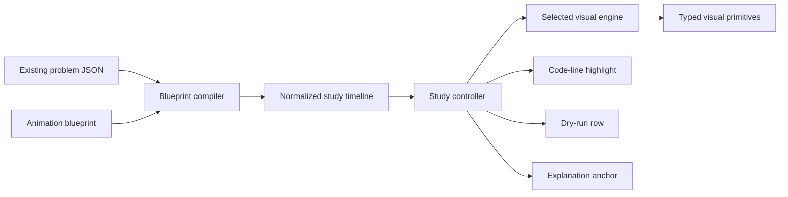

# DSA animation and explanation plan

## Decision

Build one state-driven Study Engine, a catalog of 64 composable visual engines, and one small animation blueprint per problem. The current inventory uses all 64 engines. Do not build 407 unrelated videos and do not force every algorithm into the same array animation.

The repository currently contains **407 canonical DSA problems**, not 500. It also contains 100 basics entries plus learning and sheet files, which should not be counted as full algorithm problem pages. The architecture must remain ready for 500+ problems without changing its contract.

## What the repository already gives us

The existing content is much closer to animation-ready than the earlier master specification suggests:

- 407/407 canonical problems have at least one authored approach.
- 407/407 have structured dry-run steps.
- 407/407 have diagrams.
- 407/407 have Java and Python solutions.
- 407/407 have line-by-line teaching annotations.
- The current UI already renders Mermaid, array-state, hash-map-state, dry-run, and annotated-code components.
- Framer Motion is already available in the application.

This means the first version should transform existing authored state into interactive frames instead of rewriting the whole content corpus.

## The learning experience on every problem page

Every problem uses the same seven learning moments, while its central visual world changes by algorithm:

1. **Understand** - restate the task and animate the input contract, not the solution.
2. **Predict** - ask the learner what should happen next before revealing it.
3. **See the invariant** - keep the rule that makes the algorithm correct pinned above the visual.
4. **Watch one causal step** - animate only the state changed by the current decision.
5. **Connect to code** - highlight the exact Java or Python line that caused the frame.
6. **Dry run and challenge** - synchronize the visual with the current dry-run row, then replay an edge case or common mistake.
7. **Recall** - hide the answer and ask the learner to reconstruct the pattern, state, and complexity.

The page controls should be Step back, Step forward, Play/Pause, speed, reset, language, reduced motion, and a draggable timeline. Autoplay is optional; learner control is primary.

## Ideas added beyond the supplied document

- **Prediction gates:** pause before a pointer move, relaxation, pop, DP commit, or prune and let the learner choose.
- **Invariant ribbon:** a short always-visible rule such as `window contains no duplicates` or `heap roots are the next valid candidates`.
- **Mistake replay:** show the wrong move from `commonMistakesDetailed`, let the state visibly break, then repair it.
- **Approach morphing:** replay the same input under brute force and the optimal approach, then visualize the work removed.
- **Complexity meter:** count comparisons, pushes, relaxations, or states visited during the animation instead of showing Big-O as an isolated badge.
- **Memory spotlight:** reveal exactly what the extra data structure remembers and what future work that memory saves.
- **Edge-case switcher:** duplicates, empty/single input, negative values, overflow, disconnected graphs, cycles, and impossible states use authored edge cases rather than invented demos.
- **Recall mode:** after one guided run, remove labels and ask the learner to perform the next three steps.
- **Interview mode:** the learner explains aloud or in text before seeing the next frame; the UI provides a concise rubric, not an AI-generated replacement solution.
- **Compare mode:** synchronize two valid approaches on the same input to make time/space trade-offs visible.

## Technical shape



### 1. Separate authored content from runtime state

Keep the existing problem files as the content source. Add animation blueprints under:

```text
content/dsa-animation/<category>/<slug>.json
```

The blueprint references existing approaches, dry-run rows, diagrams, code lines, examples, mistakes, and edge cases. It should not duplicate long prose or source code.

### 2. Normalize all animations into one timeline

```ts
type StudyFrame = {
  id: string;
  phase: "understand" | "predict" | "transition" | "commit" | "mistake" | "review";
  narration: string;
  invariant: string;
  state: Record<string, unknown>;
  visual: Record<string, unknown>;
  codeAnchors: { language: "java" | "python"; lineKeys: string[] }[];
  dryRunStep?: number;
  explanationAnchor?: string;
  learnerPrompt?: { kind: "choose" | "predict" | "calculate"; prompt: string; options?: string[] };
};
```

The visual is a projection of `state`; it must not own hidden algorithm state. Step forward, step backward, language switching, reduced motion, and replay must all read the same immutable frames.

### 3. Use engines made from typed primitives

The [engine catalog](./ENGINE_CATALOG.md) defines 64 primary grammars found in the real corpus. Each engine composes smaller accessible primitives such as ArrayTrack, Pointer, Window, KeyValueLedger, Stack, Queue, Tree, Graph, Grid, Matrix, HeapTree, Timeline, BitLane, EquationRibbon, ChoiceFork, and InvariantRibbon.

The master specification covered the common families. The expanded catalog adds the advanced problems actually present here: KMP, Z, rolling hash, Manacher, suffix array/LCP, Fenwick tree, segment tree, heavy-light decomposition, binary lifting, rerooting, digit/bitmask DP, Floyd-Warshall, state-space search, and FFT.

### 4. Compile what is already authored

The first compiler should generate draft frames from:

- `approaches[].dryRun.steps` for timeline order and state summaries;
- `approaches[].diagrams` for initial visual data;
- `approaches[].lineByLine` for stable code anchors;
- `approaches[].edgeCases` and problem mistakes for challenge frames;
- `examples[0]` as the default demonstration input;
- the final approach in `approaches[]` as the authored optimal approach.

Generated drafts still require human review. Animation timing, invariants, and prediction prompts are teaching decisions and must not be accepted only because a schema validator passes.

## Per-problem plan

The machine-readable plan is [problem-animation-matrix.json](./problem-animation-matrix.json). It contains all 407 problems with:

- primary and optional supporting engine;
- authored optimal approach;
- persistent visual world;
- concrete explanation direction;
- learner interaction;
- six-step storyboard;
- existing-content readiness;
- rollout wave.

Human-readable category plans:

- [Arrays](./problems/arrays.md)
- [Strings](./problems/strings.md)
- [Binary search](./problems/binary-search.md)
- [Stack and queue](./problems/stack-queue.md)
- [Linked lists](./problems/linked-lists.md)
- [Trees](./problems/trees.md)
- [Heap](./problems/heap.md)
- [Graphs](./problems/graphs.md)
- [Tries](./problems/tries.md)
- [Dynamic programming](./problems/dynamic-programming.md)
- [Greedy](./problems/greedy.md)
- [Intervals](./problems/intervals.md)
- [Backtracking](./problems/backtracking.md)
- [Bit manipulation](./problems/bit-manipulation.md)
- [Math and geometry](./problems/math-geometry.md)

Regenerate the catalog after the DSA inventory changes:

```bash
node scripts/generate_dsa_animation_plan.mjs
```

## Rollout plan

### Phase 0 - foundation

- Add blueprint and timeline schemas with runtime validation.
- Add a `StudyController` with deterministic next/previous/seek/reset behavior.
- Add code-anchor extraction that survives language switching and formatting.
- Build shared controls, invariant ribbon, prediction gate, complexity meter, and reduced-motion fallback.
- Add event instrumentation for start, step, prediction, replay, completion, and recall.

### Wave 1 - 28 golden problems

Implement a deliberately diverse set that proves the architecture: Two Sum, Minimum Window Substring, Search in Rotated Sorted Array, Valid Parentheses, Daily Temperatures, Reverse Linked List, LRU Cache, tree traversal, Top K Frequent Elements, streaming median, Trie, Number of Islands, Rotting Oranges, Course Schedule, Union Find, Bellman-Ford, 1D/2D/knapsack/LIS DP, N-Queens, Word Search, intervals, merge sort, bit operations, and sieve.

Exit criteria: every major primitive and at least one problem from every major family works with next/previous, seek, Java/Python sync, dry-run sync, keyboard control, screen-reader summary, and reduced motion.

### Wave 2 - 340 standard problems

- Batch by engine, not by repository folder.
- Finish one engine and all of its problem blueprints before switching families.
- Reuse existing diagrams and dry runs as compiler inputs.
- Review each blueprint for its invariant, decisive moment, and edge-case replay.
- Release by engine behind a per-problem capability flag; the current static page remains the fallback.

### Wave 3 - 39 advanced problems

Ship specialized engines and additional performance testing for FFT, suffix array, Manacher, HLD, segment/Fenwick trees, binary lifting, rerooting, advanced number theory, state-space search, digit DP, and the hardest multi-structure problems.

## Quality gates

Every animated problem must pass all of these:

- The exact same state drives visual, narration, code highlight, and dry-run row.
- Back/forward/seek are deterministic; replaying a frame never changes the result.
- The invariant is understandable before motion begins.
- Motion communicates a state change; no decorative looping or attention-stealing entrances.
- The animation remains understandable with motion disabled.
- Keyboard-only operation covers every control and prediction prompt.
- Screen readers receive a concise textual state change for each frame.
- Color is never the only state signal.
- Mobile uses a focused single-panel sequence; desktop may show synchronized panels.
- Typical frames stay DOM/SVG based; canvas is reserved for measured high-node-count cases.
- The first contentful page does not wait for the animation runtime.
- A wrong-answer or edge-case replay is included where the existing content names a common trap.
- A golden screenshot/state snapshot covers at least one representative per engine.
- Each blueprint is reviewed by someone who can dry-run the algorithm independently.

## Definition of done

The project is complete when all 407 canonical problems have validated blueprints; every used engine has visual, state, accessibility, and reduced-motion tests; Java/Python code anchors remain synchronized; no problem silently falls back to an unrelated visual family; and the static explanation remains fully readable when animation fails or is disabled.
