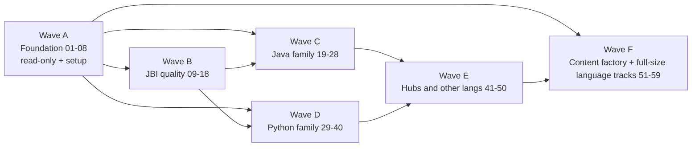

# Expansion Plan — Master Index (00)

> **Executor:** AI coding agent operating autonomously.
> **Repo root (working directory for every command):** `/Users/ravi.r_flx/IEProject/InterviewExplainer/`.
> **Frontend directory:** `frontend/` (Next.js app; this is where `npm run build` is run).
> **Session-start protocol every time you open this folder:**
>
> 1. Read this file end-to-end.
> 2. Find the next playbook with `Status: NOT_STARTED` in the table below.
> 3. Open that playbook. Do **not** skip ahead.
> 4. Follow the playbook from top to bottom; obey "Hard prerequisites".
> 5. On completion: edit this file to flip the playbook's Status; commit.

## Quality bar (every playbook 01–50 conforms — 18-section, 1,000-line standard)

Every playbook `01–50` is rewritten to the canonical **18-section,
~1,000-line skeleton** locked in
[`_TEMPLATE-1000.md`](_TEMPLATE-1000.md). The skeleton bakes in the
Java-Backend-Intermediate (JBI) corpus quality bar (depth, real anchors,
named bugs, version-stamped claims, diagrams inside the Q&A content).

| §  | Section                          | Purpose                                                                           |
| -- | -------------------------------- | --------------------------------------------------------------------------------- |
| 0  | Front-matter                     | Executor, working dir, type, pillar/wave, depends-on                              |
| 1  | TL;DR                            | Input / Action / Output in 3 bullets                                              |
| 2  | Why this matters                 | Interview + SEO angle, business consequence                                       |
| 3  | **Easy-language glossary**       | Every domain term used in §9–§14 defined inline (≥ 25 rows)                        |
| 4  | Hard prerequisites               | Shell-verifiable checklist                                                        |
| 5  | Current state                    | Snapshot commands, existing UI surface, known gaps                                |
| 6  | Target state (measurable)        | Numbers + flags only (≥ 5 rows)                                                    |
| 7  | Search phrases → URL map         | 10–24 real Google-style phrases mapped to target URL + diagram type               |
| 8  | Dependency & wave context        | Optional mermaid + mandatory bullet list of upstream / downstream                  |
| 9  | **Step-by-step execution**       | 8–14 numbered steps, each with goal, shell block, verify line, named-bug warning  |
| 10 | **Reference Q in archetype shape** | Valid JSON example schema-validates against `content/_schemas/complete-qa.schema.json` |
| 11 | **Diagram catalogue**            | Names which produced Q gets which diagram type (the diagrams live in the Q&A content, not the playbook itself) |
| 12 | Easy-language voice rules        | Quotes `_VOICE-RULES.md` + 2–3 playbook-specific examples                          |
| 13 | **Quality gates**                | ≥ 8 rows, each with threshold + verify command                                    |
| 14 | Anti-patterns                    | ≥ 4 named ways this playbook goes wrong, with fix                                  |
| 15 | Failure modes & rollback         | Table of failure → detection → rollback                                            |
| 16 | Definition of Done               | ≥ 12 checkbox items, every box shell-verifiable                                    |
| 17 | Estimated effort                 | Ideal + hard stop, with split rule                                                |
| 18 | Appendix                         | Cross-references, commits / PRs produced, traceability                            |

**Lint gate.** The script
[`scripts/lint_playbook.py`](../scripts/lint_playbook.py) enforces:

- Total line count in `[950, 1050]`.
- All 18 section headers present, in order.
- §3 glossary ≥ 25 rows; §6 ≥ 5 rows; §7 has 10–24 rows; §9 ≥ 8 steps
  (each with a Verify cue and a fenced block); §10 contains a valid JSON
  block with the required keys; §11 ≥ 5 rows covering ≥ 3 distinct
  allowed diagram types; §13 ≥ 8 rows with threshold + verify command
  each; §14 ≥ 4 entries; §16 ≥ 12 checkbox items.
- The banned-word list in
  [`_VOICE-RULES.md`](_VOICE-RULES.md) returns zero matches.

**Framework files** (read before opening any playbook):

- [`_TEMPLATE-1000.md`](_TEMPLATE-1000.md) — the literal 18-section skeleton.
- [`_GLOSSARY.md`](_GLOSSARY.md) — the global easy-language definitions
  every §3 inherits from.
- [`_VOICE-RULES.md`](_VOICE-RULES.md) — banned words, lead-with-tradeoff,
  define-before-use, name-the-bug, real-anchor rules.

Playbooks 01–50 collectively land at **~50,000 lines** of
project-specific guidance — 1,000 lines per file ± 5 %, lint-enforced.
Wave F (51–59) inherits the same skeleton when its turn comes.

## What this folder is

`expansion-plan/` is the **sequential operator manual** for growing
InterviewExplainer from today's Java-Backend-Intermediate flagship into a
multi-language, multi-hub interview platform.

- 1 index file (this one)
- 59 numbered playbooks (`01-…` through `59-…`)
  - `01–50`: original five-wave plan (A–E)
  - `51–59`: Wave F — content factory + full-size language tracks
- Every playbook is a **completable unit of work** (S/M/L/XL effort)
- Every playbook is independent enough that an AI agent with zero prior
  session memory can execute it cold, given only this folder + the repo

## What this folder is NOT

- It is NOT a wiki. Don't dump information here that lives elsewhere.
- It does NOT duplicate [`MASTER_PLAN.md`](../MASTER_PLAN.md),
  [`docs/SPEAKABLE-PLAN.md`](../docs/SPEAKABLE-PLAN.md),
  [`docs/CONTENT-PLAN.md`](../docs/CONTENT-PLAN.md), or
  [`ROADMAP.md`](../ROADMAP.md). It links them.

## Universal rules (apply to every playbook)

These rules are non-negotiable. Every playbook assumes them.

1. **Working directory** is always the repo root unless a step says
   otherwise. Frontend commands (`npm run build`, etc.) are run inside
   `frontend/`.
2. **Never** flip a flag in
   [`frontend/lib/launch-config.ts`](../frontend/lib/launch-config.ts)
   without running the smoke checklist in
   [`ROADMAP.md`](../ROADMAP.md) > "Smoke-test checklist".
3. **Never** delete content files. If a file looks wrong, open an issue or
   move to `.archive/`. Do not `rm`.
4. **Never** edit the git config. **Never** force-push. **Never** push
   without an explicit instruction in the playbook.
5. **Every commit** uses conventional-commit format:
   `<type>: <subject>` (e.g. `content: write JBI core-java exception-handling Q's`,
   `launch: enable systemDesign hub`, `infra: register PBI in LOCKED_DOMAINS`).
6. **One PR per playbook.** Don't bundle.
7. If a playbook's "Hard prerequisites" are not all `true`, STOP and run the
   referenced upstream playbook first.
8. If you spend more than the playbook's **hard-stop time**, surface a
   blocker in the PR and exit. Do not improvise.
9. **Read the UI Contract** at
   [`.cursor/content-factory/UI_CONTRACT.md`](../.cursor/content-factory/UI_CONTRACT.md)
   before starting any content-writing playbook (53–58). Adding new
   `layout_type` values, new section types, or new schema fields is
   **forbidden** without an explicit schema-version playbook. The frozen
   enums and frontend-path rules in that file are non-negotiable.
10. **Read the Taxonomy Registry** at
    [`.cursor/content-factory/taxonomy.yaml`](../.cursor/content-factory/taxonomy.yaml)
    before starting any language-track playbook. Pillar shape, level
    Q-targets, and language version pins all live there.

## Standard tools you can assume are installed

```bash
node --version    # >= 20
npm --version     # >= 10
python3 --version # >= 3.11
git --version
rg --version      # ripgrep
jq --version      # JSON CLI
```

If any are missing, install before starting and note in PR.

## Execution waves



Cross-wave parallelism only works for items with no dependency arrows in
each playbook's "Depends on" / "Hard prerequisites" section.

## Status table — single source of truth

| #  | File                                                                                                                       | Wave | Depends on   | Effort | Hard stop | Status      |
| -- | -------------------------------------------------------------------------------------------------------------------------- | ---- | ------------ | ------ | --------- | ----------- |
| 00 | [00-INDEX.md](00-INDEX.md)                                                                                                 | —    | —            | —      | —         | DONE        |
| 01 | [01-vision-and-competitive-position.md](01-vision-and-competitive-position.md)                                             | A    | —            | S      | 4 h       | NOT_STARTED |
| 02 | [02-current-content-inventory.md](02-current-content-inventory.md)                                                         | A    | 01           | S      | 4 h       | NOT_STARTED |
| 03 | [03-dual-content-architecture.md](03-dual-content-architecture.md)                                                         | A    | 02           | M      | 8 h       | NOT_STARTED |
| 04 | [04-master-url-and-seo-strategy.md](04-master-url-and-seo-strategy.md)                                                     | A    | 03           | M      | 8 h       | NOT_STARTED |
| 05 | [05-launch-config-and-feature-flags.md](05-launch-config-and-feature-flags.md)                                             | A    | 04           | S      | 4 h       | NOT_STARTED |
| 06 | [06-content-schema-and-qa-format.md](06-content-schema-and-qa-format.md)                                                   | A    | 03           | M      | 12 h      | NOT_STARTED |
| 07 | [07-locked-domain-pattern.md](07-locked-domain-pattern.md)                                                                 | A    | 03,06        | M      | 12 h      | NOT_STARTED |
| 08 | [08-module-registry-and-pillar-nav.md](08-module-registry-and-pillar-nav.md)                                               | A    | 07           | M      | 8 h       | NOT_STARTED |
| 09 | [09-speakable-program-overview.md](09-speakable-program-overview.md)                                                       | B    | 06           | M      | 8 h       | NOT_STARTED |
| 10 | [10-jbi-speakable-phase-3b-rollout.md](10-jbi-speakable-phase-3b-rollout.md)                                               | B    | 09           | XL     | 120 h     | NOT_STARTED |
| 11 | [11-jbi-pillar-quality-audit.md](11-jbi-pillar-quality-audit.md)                                                           | B    | 08,10        | L      | 40 h      | NOT_STARTED |
| 12 | [12-jbi-java-language-and-core.md](12-jbi-java-language-and-core.md)                                                       | B    | 11           | L      | 60 h      | NOT_STARTED |
| 13 | [13-jbi-spring-ecosystem.md](13-jbi-spring-ecosystem.md)                                                                   | B    | 11           | L      | 80 h      | NOT_STARTED |
| 14 | [14-jbi-data-persistence.md](14-jbi-data-persistence.md)                                                                   | B    | 11           | M      | 40 h      | NOT_STARTED |
| 15 | [15-jbi-apis-messaging-microservices.md](15-jbi-apis-messaging-microservices.md)                                           | B    | 11           | L      | 60 h      | NOT_STARTED |
| 16 | [16-jbi-system-design-security-testing.md](16-jbi-system-design-security-testing.md)                                       | C    | 11           | L      | 80 h      | NOT_STARTED |
| 17 | [17-jbi-devops-cloud-production.md](17-jbi-devops-cloud-production.md)                                                     | C    | 11           | L      | 100 h     | NOT_STARTED |
| 18 | [18-jbi-behavioral-and-interview-readiness.md](18-jbi-behavioral-and-interview-readiness.md)                               | C    | 11           | M      | 40 h      | NOT_STARTED |
| 19 | [19-new-domain-java-backend-beginner-spec.md](19-new-domain-java-backend-beginner-spec.md)                                 | C    | 07,08        | S      | 8 h       | NOT_STARTED |
| 20 | [20-jbb-domain-scaffold-and-wiring.md](20-jbb-domain-scaffold-and-wiring.md)                                               | C    | 19           | M      | 16 h      | NOT_STARTED |
| 21 | [21-jbb-content-and-launch.md](21-jbb-content-and-launch.md)                                                               | C    | 20,05        | XL     | 120 h     | NOT_STARTED |
| 22 | [22-new-domain-java-backend-advanced-spec.md](22-new-domain-java-backend-advanced-spec.md)                                 | C    | 19           | S      | 8 h       | NOT_STARTED |
| 23 | [23-jba-scaffold-content-and-launch.md](23-jba-scaffold-content-and-launch.md)                                             | C    | 22           | XL     | 180 h     | NOT_STARTED |
| 24 | [24-jfi-frontend-modules-react.md](24-jfi-frontend-modules-react.md)                                                       | C    | 07,12-18     | L      | 36 h      | NOT_STARTED |
| 25 | [25-jfi-frontend-modules-angular.md](25-jfi-frontend-modules-angular.md)                                                   | C    | 24           | M      | 30 h      | NOT_STARTED |
| 26 | [26-jfi-frontend-modules-typescript-tailwind.md](26-jfi-frontend-modules-typescript-tailwind.md)                           | C    | 24           | M      | 30 h      | NOT_STARTED |
| 27 | [27-jfi-fullstack-integration-modules.md](27-jfi-fullstack-integration-modules.md)                                         | C    | 24,25        | L      | 45 h      | NOT_STARTED |
| 28 | [28-jfi-launch-and-cross-link.md](28-jfi-launch-and-cross-link.md)                                                         | C    | 24,25,26,27  | S      | 16 h      | NOT_STARTED |
| 29 | [29-python-family-strategy.md](29-python-family-strategy.md)                                                               | D    | 05           | S      | 8 h       | NOT_STARTED |
| 30 | [30-new-domain-python-backend-intermediate-spec.md](30-new-domain-python-backend-intermediate-spec.md)                     | D    | 29           | S      | 16 h      | NOT_STARTED |
| 31 | [31-pbi-scaffold-and-wiring.md](31-pbi-scaffold-and-wiring.md)                                                             | D    | 30           | M      | 16 h      | NOT_STARTED |
| 32 | [32-pbi-content-language-and-frameworks.md](32-pbi-content-language-and-frameworks.md)                                     | D    | 31           | XL     | 140 h     | NOT_STARTED |
| 33 | [33-pbi-content-data-and-messaging.md](33-pbi-content-data-and-messaging.md)                                               | D    | 31           | L      | 90 h      | NOT_STARTED |
| 34 | [34-pbi-content-security-testing-devops-behavioral.md](34-pbi-content-security-testing-devops-behavioral.md)               | D    | 31           | L      | 90 h      | NOT_STARTED |
| 35 | [35-pbi-launch.md](35-pbi-launch.md)                                                                                       | D    | 32,33,34,05  | S      | 12 h      | NOT_STARTED |
| 36 | [36-new-domain-python-backend-beginner.md](36-new-domain-python-backend-beginner.md)                                       | D    | 35           | L      | 90 h      | NOT_STARTED |
| 37 | [37-new-domain-python-advanced-staff.md](37-new-domain-python-advanced-staff.md)                                           | D    | 35           | XL     | 200 h     | NOT_STARTED |
| 38 | [38-new-domain-python-data-engineering.md](38-new-domain-python-data-engineering.md)                                       | D    | 35           | XL     | 180 h     | NOT_STARTED |
| 39 | [39-new-domain-python-ml-ai.md](39-new-domain-python-ml-ai.md)                                                             | D    | 35           | XL     | 240 h     | NOT_STARTED |
| 40 | [40-new-domain-python-fullstack.md](40-new-domain-python-fullstack.md)                                                     | D    | 35,27        | XL     | 160 h     | NOT_STARTED |
| 41 | [41-interview-qa-hub-rollout.md](41-interview-qa-hub-rollout.md)                                                           | E    | 21,28,35     | M      | 50 h      | NOT_STARTED |
| 42 | [42-prep-categories-hub.md](42-prep-categories-hub.md)                                                                     | E    | 41           | M      | 30 h      | NOT_STARTED |
| 43 | [43-dsa-hub-and-content.md](43-dsa-hub-and-content.md)                                                                     | E    | 06           | XL     | 120 h     | NOT_STARTED |
| 44 | [44-system-design-hub.md](44-system-design-hub.md)                                                                         | E    | 16,23,38,39  | M      | 30 h      | NOT_STARTED |
| 45 | [45-behavioral-hub.md](45-behavioral-hub.md)                                                                               | E    | 18,21,23     | S      | 24 h      | NOT_STARTED |
| 46 | [46-roadmaps-cheatsheets-tools-hubs.md](46-roadmaps-cheatsheets-tools-hubs.md)                                             | E    | 28,35        | L      | 80 h      | NOT_STARTED |
| 47 | [47-companies-and-career-hubs.md](47-companies-and-career-hubs.md)                                                         | E    | 21,28,35     | L      | 80 h      | NOT_STARTED |
| 48 | [48-mock-interviews-and-dashboard.md](48-mock-interviews-and-dashboard.md)                                                 | E    | 41           | XL     | 120 h     | NOT_STARTED |
| 49 | [49-javascript-go-ruby-language-tracks.md](49-javascript-go-ruby-language-tracks.md)                                       | E    | 05,07,35     | XL     | 450 h     | NOT_STARTED |
| 50 | [50-interview-migration-seo-sitemap-operations.md](50-interview-migration-seo-sitemap-operations.md)                       | E    | 03,04,all    | M      | 40 h      | NOT_STARTED |

## Wave F — Content Factory and full-size language tracks (51–59)

Wave F is the **bulk-content engine**. Wave E's playbook 49 sized the
non-Java languages too small (~2k Q total) and lacked the infrastructure
to generate them at quality. Wave F fixes both: it builds a
schema-validated content factory, codifies a taxonomy + UI contract that
all bulk runs honor, generates per-language exemplars, then fills five
language tracks (JS, TS, Go, Ruby, plus C#/PHP/Rust/Kotlin) at
Java-grade depth (target ~12k–14k additional Q), all under an
orchestrator with explicit human-approval review gates.

Wave F honors the same Universal Rules as 01–50, plus rules 9 and 10
above (UI Contract + Taxonomy Registry).

| #  | File                                                                                                          | Wave | Depends on             | Effort | Hard stop | Status      |
| -- | ------------------------------------------------------------------------------------------------------------- | ---- | ---------------------- | ------ | --------- | ----------- |
| 51 | [51-content-factory-pilot.md](51-content-factory-pilot.md)                                                    | F    | 06,07                  | M      | 12 h      | NOT_STARTED |
| 52 | [52-taxonomy-and-ui-contract.md](52-taxonomy-and-ui-contract.md)                                              | F    | 51                     | M      | 8 h       | NOT_STARTED |
| 53 | [53-per-language-exemplar-program.md](53-per-language-exemplar-program.md)                                    | F    | 51,52                  | L      | 28 h      | NOT_STARTED |
| 54 | [54-javascript-tracks-fullsize.md](54-javascript-tracks-fullsize.md)                                          | F    | 51,52,53               | XL     | 90 h      | NOT_STARTED |
| 55 | [55-typescript-track.md](55-typescript-track.md)                                                              | F    | 51,52,53               | XL     | 60 h      | NOT_STARTED |
| 56 | [56-go-track-fullsize.md](56-go-track-fullsize.md)                                                            | F    | 51,52,53               | XL     | 55 h      | NOT_STARTED |
| 57 | [57-ruby-track-fullsize.md](57-ruby-track-fullsize.md)                                                        | F    | 51,52,53               | XL     | 50 h      | NOT_STARTED |
| 58 | [58-long-tail-language-tracks.md](58-long-tail-language-tracks.md)                                            | F    | 51,52,53               | XL     | 180 h     | NOT_STARTED |
| 59 | [59-bulk-run-orchestration-and-review-gates.md](59-bulk-run-orchestration-and-review-gates.md)                | F    | 51,52,53,54-58 partial | M      | 24 h      | NOT_STARTED |

**Recommended Wave F order:** 51 → 52 → 53 (independent of 54–58 setup) → 59 (orchestrator can be built once exemplars exist) → 54/55/56/57/58 in any order under the orchestrator with parallel sessions, governed by `wave_plan.yaml` prerequisites.

Wave F supersedes the original Q-count targets of playbook **49** for the JS/Go/Ruby tracks specifically. File 49 stays in the index for traceability and its non-Q-count guidance (SEO slugs, hub linking) still applies.

## How to mark a playbook DONE

After every gate in a playbook passes:

```bash
# 1. Edit this file: flip Status to DONE for the playbook you just finished.
# 2. Commit with conventional message.
git add expansion-plan/00-INDEX.md
git commit -m "docs(expansion-plan): mark NN-<slug> DONE"
```

Do NOT mark DONE if any quality gate in the playbook failed. Mark
`BLOCKED` instead and open an issue with the gate name.

## Where to put new work that doesn't fit

If you discover work that doesn't fit into 01–59:

- **Content depth** → fold into the matching pillar playbook (12–18 for JBI,
  30–35 for PBI, 54–58 for non-Java languages).
- **New language or level** → add an entry to
  [`.cursor/content-factory/taxonomy.yaml`](../.cursor/content-factory/taxonomy.yaml)
  AND create a new playbook (60+, e.g. `60-elixir-track.md`). Never add a
  language by editing existing playbooks.
- **Schema or layout-type change** → STOP. Open a schema-version playbook
  (e.g. `90-schema-version-bump-add-X-section.md`). Bulk-generation
  playbooks (53–58) are forbidden from doing this — UI Contract rule.
- **New hub** → add a new file (`70+-<slug>.md`); link from this index.
- **Infra (analytics, A/B, redirect map)** → add as appendix sub-sections to
  [`50-interview-migration-seo-sitemap-operations.md`](50-interview-migration-seo-sitemap-operations.md).

Never add a new file without also updating the status table above.

## Cross-cutting smoke checklist (every launch playbook)

Every playbook that flips a flag in `launch-config.ts` ends with this gate.
Don't skip:

1. `cd frontend && npm run build` — exit code 0, no TypeScript errors.
2. Open `/domains` — every card with `hasContent: true` opens a real page
   (no 404, no empty content).
3. Open one Java + one Python question end-to-end. Verify: prev/next sidebar
   nav works, code blocks render, mermaid renders, no console errors.
4. Header + footer + mobile drawer — no link 404s.
5. ROADMAP.md updated to reflect new launch state in the same PR.
