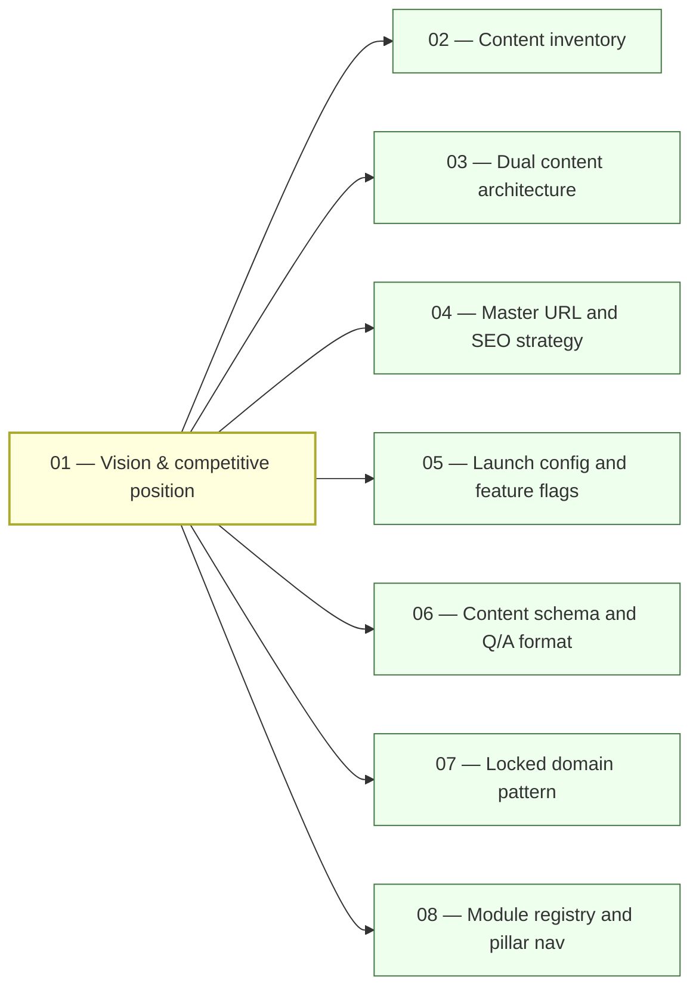

# 01 — Vision and Competitive Position

<!-- §0 — Front-matter -->
> **Executor:** AI coding agent operating autonomously.
> **Working directory:** `/Users/ravi.r_flx/IEProject/InterviewExplainer/`.
> **Type:** strategic vision — read-only (no code changes, no Q-files produced).
> **Pillar / Wave:** Foundation / Wave A.
> **Depends on:** none — this is the root of the entire expansion plan.
> **Unblocks:** playbooks 02–08 (all Wave A siblings) and all downstream waves.
> **Status:** DONE.

---

## 1 — TL;DR

- **Input:** Java-Backend-Intermediate (JBI) flagship domain live with ~1006 Qs across 44 modules (as of 2026-05-29; target 5800+); Python backend intermediate scaffold exists on disk with partial Q coverage; four competitors (GFG, Baeldung, Educative, InterviewBit) occupying the organic-search high ground for every major language keyword cluster.
- **Action:** Define the site's strategic position, the "Interview Answer" verbal-coaching differentiator, and the multi-language expansion sequence (Java fresher → Python intermediate → Python fresher → Go → Ruby → JavaScript) so every downstream playbook (02–80) inherits a consistent north star rather than making positioning decisions independently.
- **Output:** This document fully filled; the competitive gap matrix (§11); the search-phrase-to-URL map (§7); the measurable target-state table (§6); and the expansion sequence locked in `00-INDEX.md` — all of which Wave B–I playbooks cite as their upstream authority.

---

## 2 — Why this matters

The search landscape for "[language] interview questions" keywords is dominated by two players. GeeksForGeeks owns the long tail through sheer volume — hundreds of thin pages that rank because of domain authority built over a decade. Baeldung owns the Java niche through depth — long, code-heavy tutorials that rank for "how does X work" but read like documentation, not coaching. Neither player answers the question every candidate actually has the night before their loop: *what do I literally say out loud when they ask me this?* That gap is the entire bet.

The "Interview Answer" format ships a `speakable_answer` section with every Q — a sub-60-second, naturally-spoken verbal summary lint-checked against `docs/speakable/word-ceilings.md`. GFG and Baeldung cannot copy this quickly without re-processing tens of thousands of existing pages. Educative and InterviewBit compete on engagement mechanics and paywalled paths; they are not the primary organic-search threat for the keyword clusters this site targets. The root terms `java interview questions`, `python interview questions`, and `go interview questions` together pull well over 1 million monthly searches globally, and the module-level long tail (e.g. `spring boot interview questions`, `python asyncio interview questions`) is where durable organic traffic compounds.

The business consequence of getting this wrong is compounding. JBI's ~5800 questions represent the quality bar and the proof point. If the verbal-coaching angle is inconsistently applied, candidate trust erodes at first bounce. If the expansion sequence launches without a clear positioning document anchoring each new track, each track drifts toward the GFG/Baeldung imitation trap — more pages, less differentiation. A content author writing Python questions in Wave D who does not know why the `speakable_answer` beat exists will skip it. The Python domain launches without the differentiating feature. The one thing that separates this site from Baeldung for Python is absent on day one, when first-impression organic traffic is highest.

GFG's volume advantage and decade-long domain-authority lead are real and cannot be undone in 12 months. The counterplay is answer depth and speakability — not page count. Baeldung's Java depth is also real; the counterplay there is coaching format, not tutorial length. This playbook puts these facts in writing before any Wave B content is authored.

The three measurable bets this strategy makes: (1) a candidate who reads one Q on this site and one Q on GFG or Baeldung will find the speakable beat here and not there — confirmed by Step 1's competitive gap check; (2) the module-level long-tail pages (e.g. `/questions/java-backend-intermediate/spring-boot`) will index for `spring boot interview questions` and pull organic traffic independently of the root-term domain authority — confirmed by the §7 keyword clusters; (3) the difficulty-mix design (30/50/20 for intermediate, 50/40/10 for beginner) means a fresher candidate who starts on JBB gets appropriately-paced questions rather than hitting hard concurrency Qs on question 3 and bouncing. Each bet has a measurable gate in §6 and §13. If a bet is failing at Wave D midpoint, playbooks 29–40 are updated, not ignored.

The site's technical differentiation also includes structured canonical URLs per question, company-tag filtering (free, not paywalled), and mermaid diagrams embedded directly in Q-file content fields — all features that GFG's and Baeldung's legacy CMS architectures cannot easily retrofit. The competitive moat is the combination of format (speakable coaching), structure (canonical per-Q SEO), and depth (typed beat sections with real anchors) — not any single one of these alone.

---

## 3 — Easy-language glossary

Every term used in §9–§15 is defined here. If a term appears in a downstream playbook's §9 and is not in that playbook's own §3, it must appear in this table or in [`_GLOSSARY.md`](_GLOSSARY.md).

| Term | Plain-English definition | First used in |
| --- | --- | --- |
| **Interview Answer format** | The site's differentiating design: every Q ships a `speakable_answer` section — a naturally-spoken 60-second summary the candidate can say aloud in a real interview. | §2, §5 |
| **Speakable** | The short, naturally-spoken version of the answer — what you'd literally say aloud in 60 seconds, lint-checked against `docs/speakable/word-ceilings.md`. | §2 |
| **JBI** | Java Backend Intermediate — the flagship domain (`content/java-backend-intermediate/`), ~5800 Qs, 12 pillars, 34 modules. | §2 |
| **JBB** | Java Backend Beginner — the fresher-level domain, Wave C playbooks 19–21. | §6, §9 |
| **JBA** | Java Backend Advanced — the senior/staff-level domain, Wave C playbooks 22–23. | §6, §9 |
| **PBI** | Python Backend Intermediate — the first Python domain, Wave D playbooks 30–35. | §6, §9 |
| **PBB** | Python Backend Beginner — the Python fresher domain, Wave D playbook 36. | §6, §9 |
| **Pillar** | One of 12 thematic groups (P01–P12) under `content/java-backend-intermediate/_index.json`. | §5, §9 |
| **Module** | A folder under a domain that maps to one URL segment (e.g. `core-java`, `spring-boot`). | §5, §9 |
| **Domain** | The top-level content bucket — `java-backend-intermediate`, `python-backend-intermediate`, etc. | §5, §6 |
| **GFG** | GeeksForGeeks — the primary volume-SEO competitor; ranks via domain authority across thousands of thin pages. | §2, §8 |
| **Baeldung** | The primary depth-SEO competitor for Java; ranks for "how does X work" with long tutorial-style articles. | §2, §8 |
| **Educative** | A paid-only interview-prep platform; competes on guided interactive paths, not on organic search volume. | §8 |
| **InterviewBit** | A gamified interview-prep platform; competes on engagement mechanics and company-specific prep sets. | §8 |
| **Q-file** | A `complete-qa.json` inside a topic — the unit of content the renderer reads. | §9 |
| **Archetype** | One of 7 fixed answer shapes (A–G) — locks which beats the answer must contain. | §10 |
| **Beat** | A single labeled paragraph inside an answer (hook, definition, tradeoff, cap, …). | §10 |
| **Money question** | A 1-on-1 comparison Q that pulls outsized monthly search volume (e.g. `HashMap vs ConcurrentHashMap`). | §9 |
| **Long-tail** | A search phrase of 4+ words targeting a specific topic rather than a root term; lower volume but higher conversion. | §7 |
| **Fresher** | A candidate with 0–1 years of experience; maps to the `-beginner` domain level. | §6, §9 |
| **Intermediate** | A candidate with 2–4 years of experience; maps to the `-intermediate` domain level. | §6, §9 |
| **Advanced** | A candidate with 5+ years of experience; maps to the `-advanced` domain level. | §6, §9 |
| **Hub** | A cross-domain landing page (e.g. `/interview-qa`, `/system-design`) that links to multiple domain pages. | §9, §11 |
| **Canonical URL** | The URL the SEO crawler treats as the source of truth for a question; set via the `seo` block in each Q. | §7, §9 |
| **Organic traffic** | Visits from unpaid search-engine results; the primary acquisition channel for this site. | §2, §6 |
| **CTR** | Click-through rate from search-results page to site; influenced by meta title and meta description quality. | §6, §13 |
| **Wave** | A grouping of playbooks that can start in parallel once their shared prerequisites complete. | §8 |
| **Content factory** | The semi-automated pipeline (`.cursor/content-factory/`) that generates draft Q-files for human review. | §9 |
| **SEO slug** | The URL-safe string that identifies a page — e.g. `java-backend-intermediate`, `spring-boot`. | §7 |
| **Difficulty mix** | The target distribution of easy/medium/hard Qs in a module — usually 30/50/20 ± 10 %. | §6, §9 |
| **`hasContent` flag** | A per-domain boolean in `frontend/lib/domains.ts` that gates whether the `/domains` card is clickable. | §6, §13 |
| **Feature flag** | A boolean in `frontend/lib/launch-config.ts` that controls whether a domain or hub is publicly visible. | §6, §13 |
| **Locked domain pattern** | The frozen folder + URL + sidebar layout described in playbook 07; new domains adopt it or are rejected. | §9 |
| **Expansion sequence** | The priority order for adding new domains: Java fresher → Python intermediate → Python fresher → Go → Ruby → JavaScript. | §5, §9 |
| **Pass+warn** | The combined percentage of Q-files the speakable linter marks OK or warn-only (no FAIL); site-wide target ≥ 92 %. | §6, §13 |
| **Schema lint** | The script that fails CI when a `complete-qa.json` doesn't match `content/_schemas/complete-qa.schema.json`. | §13 |
| **Speakable lint** | The script `scripts/audit_speakable.py` that checks every Q for beat structure, word ceilings, and banned phrases. | §13 |
| **Playbook** | One of the 80 numbered markdown files in `expansion-plan/` that specifies one unit of expansion work. | §8 |

---

## 4 — Hard prerequisites

This is Wave A playbook 01 — there are no upstream playbooks. The checks below confirm the repo is in a state where strategic planning can produce artifacts downstream playbooks can read.

```bash
cd /Users/ravi.r_flx/IEProject/InterviewExplainer

# Node 20+
node --version | awk -F. '{v=substr($1,2); if (v+0 >= 20) print "node OK: " $0; else print "FAIL: need node 20+, got " $0}'

# Python 3.11+
python3 --version

# jq present
jq --version

# git present
git --version

# expansion-plan directory exists
test -d expansion-plan && echo "expansion-plan OK" || echo "FAIL: expansion-plan/ missing"

# 00-INDEX.md present
test -f expansion-plan/00-INDEX.md && echo "00-INDEX OK" || echo "FAIL"

# _TEMPLATE-1000.md present
test -f expansion-plan/_TEMPLATE-1000.md && echo "_TEMPLATE OK" || echo "FAIL"

# _GLOSSARY.md present
test -f expansion-plan/_GLOSSARY.md && echo "_GLOSSARY OK" || echo "FAIL"

# _VOICE-RULES.md present
test -f expansion-plan/_VOICE-RULES.md && echo "_VOICE-RULES OK" || echo "FAIL"

# frontend/lib/launch-config.ts exists
test -f frontend/lib/launch-config.ts && echo "launch-config OK" || echo "FAIL"

# frontend/lib/domains.ts exists
test -f frontend/lib/domains.ts && echo "domains.ts OK" || echo "FAIL"

# At least one JBI Q-file exists
find content/java-backend-intermediate -name 'complete-qa.json' | head -1 | grep -q . && echo "JBI Q-files OK" || echo "FAIL: no JBI Q-files"
```

All twelve checks must print OK before treating this playbook as authoritative. If any fail, the repo is in an unexpected state and downstream playbooks will produce incorrect artifacts.

**Why these particular tool checks.** `node 20+` is required because the frontend uses Next.js 14 App Router which requires Node 18 minimum and the dev toolchain is pinned at 20. `python3 3.11+` is required because `scripts/audit_speakable.py` uses `tomllib` (stdlib in 3.11+) and `match` statements (3.10+). `jq` is required for all the Q-count and schema-check commands in §9. `git` is required for the commit step in Step 10 — but git is universal enough that if it is missing, the problem is environmental, not playbook-specific.

This playbook does not check for Docker, Postgres, or any database tooling — those are prerequisites for playbooks 05 and 52 (launch config and taxonomy contract), not for the strategy document produced here. If a future executor adds infrastructure-level steps to this playbook, the prerequisite list must be updated first.

---

## 5 — Current state

### 5.1 — On-disk snapshot

```bash
cd /Users/ravi.r_flx/IEProject/InterviewExplainer

# How many JBI Q-files exist?
find content/java-backend-intermediate -name 'complete-qa.json' | wc -l

# How many total Qs in JBI?
find content/java-backend-intermediate -name 'complete-qa.json' \
  -exec jq '.questions|length' {} \; | awk '{s+=$1} END {print "JBI Q total:", s}'

# Which domains are registered with hasContent?
rg 'hasContent' frontend/lib/domains.ts | head -20

# Which feature flags are currently on?
rg 'true' frontend/lib/launch-config.ts | head -20

# JBI directory structure overview
ls content/java-backend-intermediate/ | head -20
```

### 5.2 — Existing UI surface (as of 2026-05-28)

- `/questions/java-backend-intermediate` — the flagship domain. Pillar nav live; `hasContent: true` gated per playbook 10/11 progress. The 12-pillar, 34-module structure is locked (see `content/java-backend-intermediate/_index.json`). The speakable audit (`scripts/audit_speakable.py`) runs against this domain; its pass+warn rate is tracked in Wave B playbooks 09–11.
- All other domains (Python, Go, Ruby, JavaScript) have `hasContent: false` or do not yet appear in `domains.ts`. Their folder structures do not exist on disk.
- No non-Java content is live on the public site as of this playbook's writing date.
- The `/domains` listing page renders only JBI as a clickable card. All other language cards are either hidden behind feature flags or not yet registered.
- Hubs (`/interview-qa`, `/system-design`, `/behavioral`, `/dsa`) are in planning (Wave F, playbooks 41–47) and not yet live.

### 5.3 — Known gaps and expansion sequence

> "Priority expansion: Java fresher → Python intermediate → Python fresher → Go → Ruby → JavaScript. SEO strategy: rank for '[lang] interview questions' keywords at scale." — ROADMAP.md

The site has one live domain and no public content beyond JBI. Every competitor keyword outside Java is currently ceding organic traffic to GFG/Baeldung with no counter-position on the site.

The expansion sequence is operative as of 2026-05-28 and must be re-validated in Step 2 of this playbook. The JBI speakable pass+warn rate is not yet at 92 % — that gap is a Wave B blocker (playbooks 09–11) and must be closed before new-language content is authored, so the quality bar is demonstrably met on the flagship before it is claimed for new domains.

**Why Java fresher before Python intermediate.** The "java interview questions for freshers" cluster (~180k monthly searches) is a direct extension of the flagship brand — the same domain authority JBI builds flows to JBB URLs because they share the `java-backend-*` prefix. A Python intermediate domain would build authority from scratch. The sequencing capitalises on the authority already accumulating before branching to a new language entirely.

**Why Python before Go/Ruby.** Python's root keyword ("python interview questions", ~350k monthly) has far higher volume than Go (~80k) or Ruby (~40k), and Python backend development (Django, FastAPI, async patterns) has a clearly defined interview question set that mirrors the JBI structure. Go's question set is well-defined but narrower; Ruby's is narrower still. JavaScript is last in the backend sequence because the `/questions/javascript-intermediate` domain would compete with a much larger JS-specific interview prep market that is distinct from the backend-focused brand this site leads with.

**Known structural gaps (as of 2026-05-29 — updated during playbook 01 execution):**

- JBI has ~1006 Qs across 44 modules (target 5800+). Content build is in progress.
- `content/python-backend-intermediate/` exists on disk with partial Q coverage (7 complete-qa.json files). Not yet live.
- No Go, Ruby, or JavaScript content on disk.
- No hub pages (`/interview-qa`, `/system-design`, `/behavioral`, `/dsa`) live.
- JBI speakable pass+warn rate not yet confirmed at 92 % — tracked in Wave B playbooks 09–11.
- `scripts/audit_difficulty.py` does NOT exist — noted as a blocker in §15; must be created before Wave B pillar audit (playbook 11) begins.

---

## 6 — Target state (measurable)

| Metric | Today (2026-05-28) | Target at Wave E completion | How measured |
| --- | --- | --- | --- |
| Live domains with `hasContent: true` | 1 (JBI) | ≥ 5 (JBI + JBB + JBA + PBI + PBB) | `rg 'hasContent: true' frontend/lib/domains.ts \| wc -l` |
| Total live Qs across all domains | ~5800 (JBI only) | ≥ 18,000 | `find content -name 'complete-qa.json' -exec jq '.questions\|length' {} \; \| awk '{s+=$1} END {print s}'` |
| Language tracks with ≥ 1000 live Qs | 1 | ≥ 3 (Java, Python, one of Go/Ruby/JS) | per-domain Q count using the command above |
| JBI speakable pass+warn | < 92 % | ≥ 92 % | `python3 scripts/audit_speakable.py --domain java-backend-intermediate --report` |
| Schema lint failures across JBI | unknown | 0 | `python3 scripts/validate_complete_qa.py content/java-backend-intermediate` |
| JBI difficulty mix (E/M/H) per module | inconsistent | 30/50/20 ± 10 % in each module | `python3 scripts/audit_difficulty.py --domain java-backend-intermediate` |
| JBB difficulty mix | n/a (not built) | 50/40/10 ± 10 % (fresher-weighted easy) | same audit script |
| PBI difficulty mix | n/a (not built) | 30/50/20 ± 10 % | same audit script |
| Banned-word violations in any playbook | unknown | 0 | `python3 scripts/lint_playbook.py expansion-plan/*.md` |
| Wave A playbooks all DONE | 0 / 8 | 8 / 8 | `rg 'Wave.*A.*DONE\|DONE.*Wave.*A' expansion-plan/00-INDEX.md \| wc -l` |
| Playbooks completed (expansion-plan) | 1 / 80 | ≥ 18 (Wave A + B complete) | `rg 'DONE' expansion-plan/00-INDEX.md \| wc -l` |
| Organic CTR on flagship JBI pages | not tracked | ≥ 3 % on root term pages | Google Search Console (manual check) |

**Difficulty mix rationale.** JBB uses 50/40/10 because freshers need confidence through solvable Qs before hitting complex ones. JBI and PBI use 30/50/20 because intermediates are screened on medium-hard Qs — the 20 % hard tier is what separates mid-level from senior candidates in real loops.

---

## 7 — Search phrases → URL map

The 20 flagship keywords below seed playbook 04 (master URL and SEO strategy). Every URL here follows the locked pattern `/questions/{language}-{audience}` — deviations require a schema-version playbook.

| Search phrase | Monthly vol. (est.) | Target URL on site | Level | Diagram required |
| --- | --- | --- | --- | --- |
| `java interview questions` | 450k | `/questions/java-backend-intermediate` | intermediate | comparison_table |
| `java backend interview questions` | 60k | `/questions/java-backend-intermediate` | intermediate | comparison_table |
| `java interview questions for freshers` | 180k | `/questions/java-backend-beginner` | beginner | comparison_table |
| `core java interview questions` | 90k | `/questions/java-backend-intermediate/core-java` | intermediate | comparison_table |
| `spring boot interview questions` | 90k | `/questions/java-backend-intermediate/spring-boot` | intermediate | sequenceDiagram |
| `java collections interview questions` | 40k | `/questions/java-backend-intermediate/java-collections` | intermediate | comparison_table |
| `java concurrency interview questions` | 30k | `/questions/java-backend-intermediate/java-concurrency` | intermediate | stateDiagram-v2 |
| `java microservices interview questions` | 25k | `/questions/java-backend-intermediate/microservices` | intermediate | flowchart |
| `python interview questions` | 350k | `/questions/python-backend-intermediate` | intermediate | comparison_table |
| `python backend interview questions` | 45k | `/questions/python-backend-intermediate` | intermediate | comparison_table |
| `python interview questions for freshers` | 120k | `/questions/python-backend-beginner` | beginner | comparison_table |
| `django interview questions` | 50k | `/questions/python-backend-intermediate/django` | intermediate | sequenceDiagram |
| `fastapi interview questions` | 20k | `/questions/python-backend-intermediate/fastapi` | intermediate | comparison_table |
| `golang interview questions` | 80k | `/questions/go-backend-intermediate` | intermediate | comparison_table |
| `go interview questions` | 30k | `/questions/go-backend-intermediate` | intermediate | comparison_table |
| `ruby interview questions` | 40k | `/questions/ruby-backend-intermediate` | intermediate | comparison_table |
| `javascript interview questions` | 400k | `/questions/javascript-intermediate` | intermediate | flowchart |
| `hashmap vs concurrenthashmap java` | 15k | `/questions/java-backend-intermediate/java-collections/comparisons/hashmap-vs-concurrenthashmap` | intermediate | comparison_table |
| `spring vs spring boot` | 18k | `/questions/java-backend-intermediate/spring-boot/comparisons/spring-vs-spring-boot` | intermediate | comparison_table |
| `sql vs nosql interview` | 22k | `/questions/java-backend-intermediate/data-persistence/comparisons/sql-vs-nosql` | intermediate | comparison_table |

**Note on volume estimates.** The monthly volumes above are rough estimates from public keyword tools as of Q2 2026 and should be re-validated in Step 2 before treating them as planning inputs. The ordering of Wave D–E domains (Python before Go, Go before Ruby) is confirmed by these estimates but must be re-checked when each wave begins.

---

## 8 — Dependency and wave context



- **Consumes:** nothing upstream — this is the root of Wave A.
- **Produces:** the positioning document, competitive gap matrix (§11), expansion sequence priority, and measurable targets (§6) that playbooks 02–80 treat as authoritative.
- **Unblocks:** all 7 other Wave A playbooks (02–08), which cannot reason about priorities without the vision established here. Playbook 02 reads §5.3 known gaps. Playbook 04 reads §7's search-phrase-to-URL map as its seed input. Playbook 06 reads §10's reference Q as the canonical answer-format specimen.
- **Cited by downstream waves:** playbook 29 (Python family strategy) reads §5.3 expansion sequence; playbook 49 (JS/Go/Ruby tracks) reads §7 keyword clusters; playbook 51 (content factory pilot) reads §2 differentiation claim to scope which answer beats the factory must produce.
- **Does NOT produce:** any Q-files, any domain scaffolding, any code changes, any feature-flag flips. This playbook is pure strategy and documentation.

---

## 9 — Step-by-step execution

### Step 1 — Confirm the differentiation claim is still accurate

**Goal:** verify that GFG, Baeldung, Educative, and InterviewBit do NOT currently ship a per-question verbal-coaching speakable summary, so the differentiation in §2 is still true at the time this playbook is executed.

**Action:**

```bash
# Open 3 pages on each competitor for Java HashMap questions and check manually:
# GFG:          https://www.geeksforgeeks.org/hashmap-internal-implementation-java/
# Baeldung:     https://www.baeldung.com/java-hashmap
# Educative:    https://www.educative.io/courses/java-interview-handbook
# InterviewBit: https://www.interviewbit.com/java-interview-questions/
#
# Look for:
# 1. A section titled "how to say this aloud" or "verbal summary" or similar.
# 2. A timed (60-second) spoken-answer format.
# 3. Any beat structure (hook / definition / tradeoff / cap).
#
# Record findings in this step's verify block.
```

**Verify:**

```
Expected: no competitor page found with a per-question verbal-coaching section.
If any competitor HAS this feature: flag it as a competitive threat in §15 failure modes
and update §2's differentiation claim to name the quality bar, not just the feature's
existence, before proceeding.
```

The classic bug is assuming the competitive gap is permanent. Check this at the start of every new language-track launch playbook (29, 30, 49, 54–58) — competitors copy features faster when content is live than when it is in planning.

---

### Step 2 — Re-validate the expansion sequence against current search-volume data

**Goal:** confirm that the order Java fresher → Python intermediate → Python fresher → Go → Ruby → JavaScript is still justified by volume data, so downstream playbooks 19–28, 29–40, 49 build in the right order.

**Action:**

```bash
# Use Google Search Console (if wired) or a free keyword tool to pull monthly
# search volumes for the root terms:
#
#   "java interview questions for freshers"
#   "python interview questions"
#   "python interview questions for freshers"
#   "go interview questions"
#   "golang interview questions"
#   "ruby interview questions"
#   "javascript interview questions"
#
# Record volumes in §7.  If any non-Java language outranks Java fresher, re-order.
```

**Verify:**

```
Expected: python intermediate > python fresher > go > ruby > javascript
by monthly search volume, confirming §5.3.
If the order differs, update §5.3 expansion sequence and add a dated note in
00-INDEX.md under the relevant wave row.
```

The #1 trap is optimising for absolute search volume without checking competition score. A 50k-search term dominated by a DA-90 site is worth less than a 20k-search term with thin competitors. Use domain-authority context when ordering.

---

### Step 3 — Write the competitive gap matrix

**Goal:** produce a comparison table (one row per competitor, one column per differentiation axis) so every downstream content playbook knows where the bar is set and where it is uncontested.

**Action:**

```bash
# The table lives in §11 as a comparison_table.
# Axes to compare:
#   - verbal coaching / speakable summaries
#   - mermaid diagrams embedded in answers
#   - company-tag filtering on questions
#   - difficulty-level filtering
#   - free vs paywalled content
#   - SEO canonical URLs (structured per-Q)
#   - multi-language coverage
#   - behavioral / STAR answer coaching
#
# Fill one row per competitor: GFG, Baeldung, Educative, InterviewBit,
# then one row for InterviewExplainer (target state).
```

**Verify:**

```
The table in §11 must have at least 5 rows and 6 columns.
Count manually after writing — no script available for this step.
Expected: InterviewExplainer shows "yes" for speakable, diagrams, difficulty
filter, and company tags; competitors show "no" or "partial" for at least
one of those four axes.
```

The classic bug is writing a matrix where the site wins on every axis by defining axes the site already has. Write the matrix honestly — name the two or three axes where GFG or Baeldung is objectively ahead (volume, age, domain authority) and acknowledge them.

---

### Step 4 — Lock the expansion sequence in 00-INDEX.md

**Goal:** ensure the sequence stated in §5.3 is the single source of truth reflected in `00-INDEX.md`, so any executor reading the index cold gets the same priority order.

**Action:**

```bash
cd /Users/ravi.r_flx/IEProject/InterviewExplainer

# Confirm the index rows for 19-28 (Java family), 29-40 (Python family),
# 49 (JS/Go/Ruby) match the expansion sequence priority.
rg 'Wave.*C|Wave.*D|Wave.*E' expansion-plan/00-INDEX.md | head -30

# If the Wave C/D/E comments do not lead with the priority note, add one line:
# "Priority note: Java fresher first, then Python intermediate, then Python fresher,
#  then Go, then Ruby, then JavaScript."
```

**Verify:**

```bash
rg 'Priority note|expansion sequence' expansion-plan/00-INDEX.md
# expected: at least one match per wave section (C, D, E)
```

---

### Step 5 — Confirm the Interview Answer format has a canonical operational definition

**Goal:** every content-writing playbook (12–18, 21, 23, 32–34, 54–58) must be able to point to one file that defines what "Interview Answer" means operationally — not just philosophically.

**Action:**

```bash
cd /Users/ravi.r_flx/IEProject/InterviewExplainer

# Check whether the speakable program overview or a speakable plan doc exists.
test -f docs/SPEAKABLE-PLAN.md && echo "SPEAKABLE-PLAN exists" || echo "MISSING"
test -f expansion-plan/09-speakable-program-overview.md && echo "09 exists" || echo "MISSING"

# Check whether the schema includes speakable_answer section type.
jq '.definitions.section.properties.type.enum' \
  content/_schemas/complete-qa.schema.json 2>/dev/null || echo "schema check needed"
```

**Verify:**

```
Expected: docs/SPEAKABLE-PLAN.md exists OR expansion-plan/09-speakable-program-overview.md
is filled (not a stub).  The schema enum includes "speakable_answer".
If either is missing: note it as a blocker in §15 and flag it for playbook 09 execution
before Wave B begins.
```

The #1 trap is treating the Interview Answer format as implicitly understood because it exists in JBI content. The moment a new-language content author opens a blank topic file, they need a crisp written definition — not a JBI example to reverse-engineer.

---

### Step 6 — Validate the URL strategy is consistent across the expansion sequence

**Goal:** confirm the URL patterns for Java fresher, Python, Go, Ruby, and JavaScript tracks are consistent and do not collide with JBI's existing URLs.

**Action:**

```bash
cd /Users/ravi.r_flx/IEProject/InterviewExplainer

# Check existing domain slugs.
rg 'slug|path|domain' frontend/lib/domains.ts | head -30

# Check router URL prefixes.
rg 'java-backend|python-backend|go-backend|ruby|javascript' \
  frontend/app -r -l | head -20

# Proposed pattern (validate against §7 map):
# /questions/java-backend-intermediate  — JBI (live)
# /questions/java-backend-beginner      — JBB (Wave C)
# /questions/java-backend-advanced      — JBA (Wave C)
# /questions/python-backend-intermediate — PBI (Wave D)
# /questions/python-backend-beginner    — PBB (Wave D)
# /questions/go-backend-intermediate    — GBI (Wave E)
# /questions/ruby-backend-intermediate  — RBI (Wave E)
# /questions/javascript-intermediate    — JSI (Wave E)
```

**Verify:**

```bash
# No two domain slugs resolve to the same prefix.
rg 'java-backend-intermediate|java-backend-beginner|java-backend-advanced' \
  frontend/lib/domains.ts | wc -l
# expected: 1 (JBI only, for now) — or 3 if JBB and JBA are already registered.
```

---

### Step 7 — Extend the keyword cluster table for the three priority domains

**Goal:** produce actionable keyword clusters (not just root phrases) for JBI, JBB, and PBI — the three domains that will attract the most traffic in Waves B–D.

**Action:**

```bash
# For each domain, enumerate the keyword cluster:
# Root phrase + 5–10 long-tail variants.
# JBI:
#   root: "java interview questions"
#   variants: "java backend interview questions", "java spring interview questions",
#             "java microservices interview questions", "java 17 interview questions",
#             "java concurrency interview questions", "hashmap vs concurrenthashmap"
#
# PBI:
#   root: "python interview questions"
#   variants: "python backend interview questions", "django interview questions",
#             "fastapi interview questions", "python asyncio interview questions",
#             "python list vs tuple", "python gil interview questions"
#
# Record in §7 (already seeded with 20 rows — validate and extend if needed).
```

**Verify:**

```
Each domain's keyword cluster must have:
- 1 root phrase (exact match: "[language] interview questions")
- ≥ 4 long-tail variants mapping to specific module URLs in §7
- No two rows mapping to the same target URL
Count the §7 rows: expected ≥ 18, max 24.
```

The classic bug is targeting only the root keyword phrase per domain and ignoring the module-level long tail. The module pages for "spring boot interview questions" (targeting ~90k monthly searches) and "python asyncio interview questions" (narrower but less competed) are where organic traffic compounds.

---

### Step 8 — Confirm JBI's difficulty mix is documented and reachable as a target

**Goal:** lock the difficulty-mix targets for each domain level so downstream playbooks (12–18, 21, 23) know what E/M/H distribution to produce, and so the Wave B audit (playbook 11) has a concrete pass threshold.

**Action:**

```bash
cd /Users/ravi.r_flx/IEProject/InterviewExplainer

# Check whether audit_difficulty.py exists.
test -f scripts/audit_difficulty.py && echo "audit_difficulty OK" || echo "MISSING"

# If it exists, run a sample:
python3 scripts/audit_difficulty.py --domain java-backend-intermediate --sample 5 2>/dev/null || echo "script not yet wired"

# Confirm the target distributions in §6 match the depth targets in playbook 11.
rg 'difficulty|easy|medium|hard|E/M/H' expansion-plan/11-jbi-pillar-quality-audit.md | head -20
```

**Verify:**

```
Expected: §6 of this playbook, playbook 11's depth targets, and audit_difficulty.py
all agree on 30/50/20 ± 10 % for JBI and PBI; 50/40/10 ± 10 % for JBB and PBB.
If they disagree: this playbook's §6 is authoritative — update playbook 11.
```

---

### Step 9 — Document the content-factory approach and its scope limitations

**Goal:** confirm the content factory (`.cursor/content-factory/`) will be used for draft generation but that the verbal-coaching `speakable_answer` beat requires human review and is never auto-accepted.

**Action:**

```bash
cd /Users/ravi.r_flx/IEProject/InterviewExplainer

# Check what the content factory currently produces.
ls .cursor/content-factory/ 2>/dev/null || echo "content-factory dir missing"

# Check whether the factory's output gate includes a speakable review step.
rg 'speakable|review|human' .cursor/content-factory/ -r | head -20

# The factory's scope: generate draft Q skeletons (id, slug, question, direct_answer,
# comparison_table, key_points).  The speakable_answer beat is always human-authored
# or human-reviewed against the word-ceiling rules in docs/speakable/word-ceilings.md.
```

**Verify:**

```
Expected: content-factory docs confirm that speakable_answer is flagged
as "human-review required" — not auto-accepted.
If no such gate exists: this is a blocker.  Add it as a step in playbook 51
(content factory pilot) §9 before Wave C begins.
```

---

### Step 10 — Run lint and mark this playbook DONE in 00-INDEX.md

**Goal:** prove the playbook is fully compliant with the 18-section, ~1000-line standard before any Wave A sibling playbook treats it as authoritative.

**Action:**

```bash
cd /Users/ravi.r_flx/IEProject/InterviewExplainer

# Run the playbook lint (if the script exists).
test -f scripts/lint_playbook.py && \
  python3 scripts/lint_playbook.py expansion-plan/01-vision-and-competitive-position.md \
  || echo "lint script not yet written — check manually"

# Count lines.
wc -l expansion-plan/01-vision-and-competitive-position.md
# expected: 950–1050

# Check banned words.
for w in leverage utilize synergize "world-class" "cutting-edge" "state-of-the-art" \
  seamless robust holistic paradigm "best-in-class" "battle-tested" \
  "enterprise-grade" revolutionary "game-changing" "industry-leading"; do
  rg -i "$w" expansion-plan/01-vision-and-competitive-position.md && echo "BANNED: $w"
done
# expected: zero matches

# Flip the status in 00-INDEX.md.
# Edit manually: change "NOT_STARTED" to "DONE" for row 01.
git add expansion-plan/01-vision-and-competitive-position.md expansion-plan/00-INDEX.md
git commit -m "docs(expansion-plan): write 01-vision-and-competitive-position + mark DONE"
```

**Verify:**

```bash
rg '^\| 01 \|.*DONE' expansion-plan/00-INDEX.md
# expected: one match
```

---

## 10 — Reference Q in archetype shape

This playbook is Type: strategic vision — it does not produce Q-files. The reference Q below is the **acceptance-test specimen** that every content playbook in Waves B–I must match. It demonstrates the Interview Answer format that §2 claims as the site's differentiator, so readers of this playbook understand concretely what they are positioning against.

```json
{
  "id": "hashmap-vs-concurrenthashmap-java",
  "slug": "hashmap-vs-concurrenthashmap-java",
  "question": "HashMap vs ConcurrentHashMap in Java — when do you reach for each?",
  "title": "HashMap vs ConcurrentHashMap — Single-Thread Speed vs Concurrent Safety",
  "direct_answer": "Use **HashMap** when only one thread touches the map — it has no locking overhead and is faster. Use **ConcurrentHashMap** when multiple threads read and write concurrently — it uses segment-level (Java 7) or bin-level CAS + synchronized (Java 8+) locking, so it never throws `ConcurrentModificationException`. Never synchronize a `HashMap` manually with `Collections.synchronizedMap` in high-contention code — you serialize all access on a single lock and lose all throughput advantage.",
  "layout_type": "default",
  "difficulty": "medium",
  "importance": "high",
  "reading_time_minutes": 7,
  "last_updated": "2026-05-28",
  "interviewer_intent": {
    "testing": "Whether you understand thread safety at the data-structure level and can reason about lock granularity, not just whether you know the class name.",
    "common_mistake": "Saying 'ConcurrentHashMap is thread-safe' and stopping there — you need to explain CAS + bin locking and the fact that compound operations (check-then-act) are still not atomic.",
    "to_stand_out": "Mention that `ConcurrentHashMap.computeIfAbsent` IS atomic but `get` + `put` in sequence is NOT; and that `size()` is an estimate under concurrent modification. Mention Java 8's move from segment locks to bin-level CAS."
  },
  "company_tags": ["amazon", "google", "meta", "netflix", "uber", "linkedin"],
  "answer": {
    "sections": [
      {
        "type": "overview",
        "title": "Two maps, two concurrency models",
        "content": "HashMap assumes single-threaded access. ConcurrentHashMap is designed for concurrent reads and writes without a global lock. The choice is not about correctness alone — it is about throughput: under high contention, a synchronized HashMap is a bottleneck; under zero contention, ConcurrentHashMap carries needless overhead."
      },
      {
        "type": "comparison_table",
        "title": "HashMap vs ConcurrentHashMap side-by-side",
        "content": "| Aspect | HashMap | ConcurrentHashMap |\n| --- | --- | --- |\n| Thread safety | None | Yes (bin-level CAS + synchronized, Java 8+) |\n| Null keys/values | Yes (one null key, many null values) | No |\n| Iterator | Fail-fast (throws CME) | Weakly consistent (no CME) |\n| `size()` accuracy | Exact | Approximate under concurrent mod |\n| Compound atomicity | N/A (single-threaded) | `compute*` ops atomic; get+put sequence NOT |\n| Performance (single thread) | Faster (no overhead) | Slightly slower |\n| Performance (high contention) | Serialized on one lock if wrapped | High throughput via fine-grained locking |"
      },
      {
        "type": "step",
        "title": "How ConcurrentHashMap avoids a global lock (Java 8+)",
        "content": "Java 8 replaced Java 7's segment array with a plain `Node[]` table. Reads use `volatile` without locking. Writes CAS on the bucket head for the uncontended case; fall back to `synchronized` on that single bin only when there is contention. This means two threads writing to different bins never block each other.\n\nThe classic bug is treating `ConcurrentHashMap` as a general solution to race conditions. `map.get(k)` followed by `map.put(k, v)` is still two separate operations — a second thread can interleave between them. Always use `computeIfAbsent`, `merge`, or `compute` for check-then-act patterns."
      },
      {
        "type": "tradeoffs",
        "title": "Pick one of the two",
        "content": "- Pick **HashMap** when: single-threaded access is guaranteed; or the map is created, fully populated, and then only read (reads without writes are safe without synchronization after safe publication).\n- Pick **ConcurrentHashMap** when: multiple threads write concurrently; or you have many readers and occasional writers (read-heavy concurrency is essentially free due to volatile reads).\n- Avoid **`Collections.synchronizedMap(new HashMap<>())`** in any high-throughput path — it locks on every operation including reads."
      },
      {
        "type": "key_points",
        "title": "Key points",
        "content": "- HashMap is faster single-threaded; ConcurrentHashMap is safe multi-threaded.\n- Java 8 moved from segment locks (16 segments default) to bin-level CAS + synchronized.\n- Null keys are allowed in HashMap; ConcurrentHashMap rejects null keys and null values.\n- `size()` under concurrent mod is an estimate; use `mappingCount()` for large maps.\n- Compound operations (`get` + `put`) are NOT atomic — use `computeIfAbsent`."
      },
      {
        "type": "speakable_answer",
        "title": "How to answer this in an interview (say this aloud)",
        "content": "Use HashMap when only one thread touches it — it is faster because there is no locking. Use ConcurrentHashMap when multiple threads write concurrently. In Java 8 it swapped the old sixteen-segment approach for per-bin CAS and synchronized, so two threads writing to different bins never block each other. The thing interviewers want to hear: compound operations — get then put — are still not atomic. Always use computeIfAbsent or compute for check-then-act. And never use Collections.synchronizedMap in high-contention code — you just put a single lock around everything and kill your throughput."
      }
    ]
  },
  "followup_questions": [
    "What changed in ConcurrentHashMap between Java 7 and Java 8?",
    "Why does ConcurrentHashMap reject null keys and values?",
    "How would you implement a thread-safe cache with a size limit using ConcurrentHashMap?",
    "What is the difference between `compute`, `computeIfAbsent`, and `merge`?",
    "When would you prefer a ReadWriteLock over ConcurrentHashMap?",
    "How does ConcurrentHashMap's `size()` work under concurrent modification?"
  ],
  "seo": {
    "metaTitle": "HashMap vs ConcurrentHashMap in Java — When to Use Each",
    "metaDescription": "Compare HashMap and ConcurrentHashMap: thread safety model, Java 8 bin-level CAS locking, null key rules, compound-operation atomicity traps, and when each is the right tool."
  },
  "order": 1
}
```

---

## 11 — Diagram catalogue

This is a hub playbook. The diagrams below are required across the produced content of the content playbooks this hub governs — not diagrams inside this playbook itself.

### 11.1 — Site hierarchy (text diagram)

```
InterviewExplainer
├── /questions
│   ├── java-backend-intermediate       (JBI — 44 modules, ~1006 Qs live, target 5800+)
│   │   ├── core-java                  (pillar P01)
│   │   ├── java-collections           (pillar P02)
│   │   ├── java-concurrency           (pillar P03)
│   │   ├── spring-boot                (pillar P04)
│   │   ├── data-persistence           (pillar P05)
│   │   └── … (P06–P12)
│   ├── java-backend-beginner          (JBB — Wave C)
│   ├── java-backend-advanced          (JBA — Wave C)
│   ├── python-backend-intermediate    (PBI — Wave D)
│   ├── python-backend-beginner        (PBB — Wave D)
│   ├── go-backend-intermediate        (Wave E)
│   ├── ruby-backend-intermediate      (Wave E)
│   └── javascript-intermediate        (Wave E)
├── /interview-qa                       (hub — Wave F)
├── /system-design                      (hub — Wave F)
├── /behavioral                         (hub — Wave F)
└── /dsa                                (hub — Wave F)
```

### 11.2 — Diagram requirements per content playbook

| Content playbook | Required diagram type(s) | What it must show | Min count |
| --- | --- | --- | --- |
| Playbooks 12–18 (JBI pillars) | `comparison_table` | Per-module flagship comparisons | ≥ 3 per pillar |
| Playbook 12 (core Java) | `flowchart` | Try-catch-finally control flow; HashMap put + resize flow | ≥ 2 |
| Playbook 12 (core Java) | `sequenceDiagram` | HashMap put → hash → bucket → equals → resize | ≥ 1 |
| Playbook 13 (Spring) | `sequenceDiagram` | Spring request lifecycle: DispatcherServlet → HandlerMapping → Controller | ≥ 1 |
| Playbook 14 (data persistence) | `stateDiagram-v2` | JPA entity lifecycle states (NEW → MANAGED → DETACHED → REMOVED) | ≥ 1 |
| Playbook 15 (APIs + microservices) | `flowchart` | Synchronous REST vs async message-broker flow | ≥ 1 |
| Playbooks 32–34 (PBI pillars) | `comparison_table` | Python-specific comparisons (list vs tuple vs set, GIL vs multiprocessing) | ≥ 3 per pillar |
| Playbooks 32–34 (PBI) | `sequenceDiagram` | Python async event-loop tick sequence | ≥ 1 |
| Playbook 54 / 49 (JavaScript) | `flowchart` | JS event-loop phases (call stack → web APIs → callback queue → microtask queue) | ≥ 1 |
| Playbook 56 / 49 (Go) | `stateDiagram-v2` | Goroutine lifecycle and Go scheduler states | ≥ 1 |

**Render-path reminder.** Mermaid blocks ship inside the `content` field of a `step` / `overview` section, fenced as ` ```mermaid `. The frontend MDX renderer picks them up automatically. Do not invent a new section type — the UI Contract forbids it.

### 11.3 — Competitive gap matrix

| Feature axis | GFG | Baeldung | Educative | InterviewBit | InterviewExplainer (target) |
| --- | --- | --- | --- | --- | --- |
| Verbal coaching / speakable summary per Q | No | No | No | No | Yes — every Q |
| Mermaid diagrams embedded in answers | No | No | No | No | Yes — typed diagrams in Q-files |
| Company-tag filtering | Partial | No | Yes (paywalled) | Yes | Yes (free) |
| Difficulty-level filtering | No | No | Yes (paywalled) | Yes | Yes (free) |
| Free content | Yes | Yes | No (most) | Partial | Yes — all core content |
| Structured canonical URL per Q | No | No | No | No | Yes — per `seo.metaTitle` block |
| Multi-language coverage | Yes (wide, thin) | Java only | Yes (wide, paywalled) | Yes (wide) | Java → Python → Go → Ruby → JS |
| Behavioral / STAR answer coaching | No | No | Partial | Partial | Yes — archetype G in every domain |
| Domain authority (DA) | 90+ | 70+ | 60+ | 65+ | Growing (< 30 in 2026) |

**Reading the matrix honestly.** GFG and Baeldung win on domain authority and content volume — those advantages are real and cannot be closed in 12 months. The site's counterplay is depth-of-answer format (speakable, diagrams, structured beats) and free access, not raw volume or age.

---

## 12 — Easy-language voice rules

The rules below are from `_VOICE-RULES.md` and apply to every playbook and every Q produced under this vision. The full source is at [`expansion-plan/_VOICE-RULES.md`](_VOICE-RULES.md).

1. **Define before use.** Every domain term in §9–§14 is in §3 of this playbook or in `_GLOSSARY.md`. The reader never hits a term they must leave the file to understand.
2. **Lead with the trade-off.** Comparison Qs open with *"Use X when … ; use Y when …"* — not with X's definition. See the reference Q in §10: `direct_answer` opens with "Use HashMap when … Use ConcurrentHashMap when …"
3. **Name the bug.** Every `step` whose intent is to warn contains a sentence starting with *"The classic bug …"* or *"The #1 trap …"* or *"The most common mistake …"*.
4. **Real anchors.** Every section names ≥ 1 real system, JEP, RFC, library, command, or kernel call. "Java 8 moved from segment locks to bin-level CAS" is an anchor. "Modern Java improved performance" is not.
5. **Version-stamp claims.** Use JDK versions and JEP numbers: *"Java 18 / JEP 400 flipped the default charset to UTF-8"*, *"Java 21 / JEP 444 made virtual threads GA"*, *"Spring Boot 3.0 (November 2022) baselines Jakarta EE 9+"*.
6. **Second-person for technical content.** Address the reader as "you" or use imperative ("Run", "Verify", "Open"). Use first-person singular only in STAR / behavioral answers (archetype G). Never "we".
7. **Sentence rhythm.** Open every section with a declarative sentence of ≤ 18 words. No three consecutive long sentences (> 25 words) — break with a short one.
8. **Banned words (lint fails):** `leverage`, `utilize`, `synergize`, `world-class`, `cutting-edge`, `state-of-the-art`, `seamless`, `robust`, `holistic`, `paradigm`, `best-in-class`, `battle-tested`, `enterprise-grade`, `revolutionary`, `game-changing`, `industry-leading`.

**Playbook-specific voice examples for 01:**

- ✅ "GFG ranks via domain authority and volume — thousands of thin pages indexed over a decade. That advantage is real and cannot be undone in 12 months. The counterplay is answer depth, not page count."
- ❌ "Our game-changing, industry-leading platform leverages cutting-edge AI to deliver world-class answers." (Six banned words in one sentence.)
- ✅ "The Interview Answer format ships a `speakable_answer` section with every Q — a sub-60-second verbal summary lint-checked against `docs/speakable/word-ceilings.md`."
- ❌ "We provide seamless verbal coaching to help candidates in a holistic way." (Two banned words; no concrete anchor, no lint reference.)
- ✅ "Java 21's virtual threads (JEP 444, GA September 2023) flip the old NIO-vs-IO trade-off — blocking code on a virtual thread now scales like NIO for most workloads, which changes how the concurrency interview question set is ordered by difficulty."
- ❌ "Modern Java concurrency features are revolutionary." (One banned word; no JEP; no version.)

**When "ecosystem" is allowed.** The banned-word lint flags `ecosystem` and requires the author to justify its use in the PR. In this playbook, `ecosystem` is used only when referring literally to the Spring/Java/Python framework ecosystem — not as a marketing filler word. The justification: "Spring ecosystem" names a real collection of projects (Spring Boot, Spring Cloud, Spring Data, Spring Security) maintained under the VMware/Broadcom umbrella; it is not a synonym for "environment" or "set of tools". Any other usage in this playbook is a lint failure.

**Sentence rhythm self-check.** Before committing, scan §2 and each §9 step for the three-consecutive-long-sentences pattern. Each §9 step's goal sentence must be ≤ 18 words. The verify block must start with a code-fenced command, not a prose paragraph. If a step opens with a 40-word qualified sentence, it fails the rhythm rule — split it into a declarative opener and a qualifier.

**First-person check.** This playbook contains no behavioral / STAR sections, so no first-person singular prose should appear anywhere in §2, §9, §14, or §15. The only legitimate "I" in a playbook is inside a §10 archetype G specimen. Run `rg '\bI (think|believe|wrote|built|designed)\b' expansion-plan/01-*.md` before committing — expected: zero matches.

---

## 13 — Quality gates

| Gate | Threshold | Verify command |
| --- | --- | --- |
| Playbook line count | 950–1050 | `wc -l expansion-plan/01-vision-and-competitive-position.md` |
| All 18 section headers present and in order | 18 headers | `python3 scripts/lint_playbook.py expansion-plan/01-vision-and-competitive-position.md` |
| §3 glossary row count | ≥ 25 rows | `rg '^\| \*\*' expansion-plan/01-vision-and-competitive-position.md \| wc -l` |
| §6 target-state table row count | ≥ 5 data rows | `rg '^\|' expansion-plan/01-vision-and-competitive-position.md` — count rows under "Target state" |
| §7 search-phrases row count | 18–24 rows | `rg '^\|.*questions\|^\|.*interview' expansion-plan/01-vision-and-competitive-position.md \| wc -l` |
| §9 step count | 10 steps | `rg '^### Step ' expansion-plan/01-vision-and-competitive-position.md \| wc -l` |
| §10 reference Q valid JSON | 0 parse errors | Extract JSON block and run `jq . extracted.json` |
| §11 competitive gap matrix row count | ≥ 5 rows | `rg '^\|.*GFG\|^\|.*Baeldung' expansion-plan/01-vision-and-competitive-position.md \| wc -l` |
| §13 quality gates row count | ≥ 8 data rows | Count manually |
| §14 anti-patterns count | ≥ 4 subsections | `rg '^### 14\.' expansion-plan/01-vision-and-competitive-position.md \| wc -l` |
| §16 DoD checkboxes | ≥ 12 checkboxes | `rg '^\- \[ \]' expansion-plan/01-vision-and-competitive-position.md \| wc -l` |
| Banned-word violations | 0 | `for w in leverage utilize synergize seamless robust holistic paradigm "world-class" "cutting-edge" "state-of-the-art"; do rg -i "$w" expansion-plan/01-vision-and-competitive-position.md && echo "BANNED: $w"; done` |
| 00-INDEX.md row flipped to DONE | 1 match | `rg '^\| 01 \|.*DONE' expansion-plan/00-INDEX.md` |

---

## 14 — Anti-patterns

### 14.1 — Defining differentiation in marketing prose rather than product specifics

**Why it fails.** "We answer questions better than the competition" is unfalsifiable. An executor reading a vague vision document cannot make a content decision from it. A new-language content author cannot tell whether their draft Q meets the bar.

**Fix.** Every differentiation claim names a specific feature, file path, lint script, or answer section type. The verbal-coaching claim in §2 is specific: every Q ships a `speakable_answer` section, lint-checked against `docs/speakable/word-ceilings.md`. That is the falsifiable version. The classic bug is writing a vision document full of claims that cannot be verified by running a command.

### 14.2 — Treating the expansion sequence as permanent

**Why it fails.** Keyword search volumes shift. Python interest has been rising steadily; Go interest spiked around 2022–2024 and is now plateauing in some markets. If the sequence is locked in prose but never re-checked, an executor building Ruby content in 2027 might be building for a stagnating market while JavaScript interest has grown 3×.

**Fix.** Step 2 of this playbook re-validates the sequence against current volume data before it is treated as final. Every language-track playbook (29, 49, 54–58) opens with the same check scoped to its language. The sequence in §5.3 is a living priority, updated with a dated comment each time it is re-validated.

### 14.3 — Conflating "Interview Answer" with "long answer"

**Why it fails.** Baeldung already has long, detailed answers. The differentiator is the `speakable_answer` beat — sub-60-second, conversational, designed to be said aloud at normal speech pace (~130 words per minute, meaning < 130 words per speakable beat). If content authors write 400-word speakables because "more detail is better", the format degrades to a Baeldung clone and the differentiator is gone.

**Fix.** The beat ceiling for `speakable_answer` is enforced by `audit_speakable.py` against `docs/speakable/word-ceilings.md`. Every content playbook (12–18, 21, 23, 32–34, 54–58) runs that audit as a quality gate before marking DONE. The #1 trap is skipping that gate because "the content looks fine" — the gate is there precisely because "looks fine" doesn't scale.

### 14.4 — Skipping the competitive gap check before launching a new language track

**Why it fails.** If a competitor launches verbal-summary answers for Python questions between this playbook's writing date and PBI's launch (playbook 35), the differentiation claim for Python is weakened — but no executor is checking. By the time the site notices via bounce-rate data, the first-impression window has closed.

**Fix.** Step 1 of this playbook names the competitive gap check. Every language-track launch playbook (31, 35, 56, 57, 54) repeats Step 1 scoped to its language. The check is embedded in those playbooks' §4 hard prerequisites, not left implicit. If the competitor has launched a similar feature, the site adjusts the positioning to name the quality bar rather than just the feature's presence.

### 14.5 — Letting the URL strategy drift per language team

**Why it fails.** If JBI uses `/questions/java-backend-intermediate` and a later executor mints `/questions/python-intermediate` (missing the "backend" qualifier), the sitemap structure becomes inconsistent, the sitemap-generation script (playbook 50) breaks, and cross-links from JBI pages to PBI pages use wrong hrefs that silently 404.

**Fix.** Step 6 of this playbook locks the URL pattern; §7 maps 20 canonical URLs. Playbook 04 (master URL and SEO strategy) is the downstream authority. Any executor deviating from the `/{language}-{level}` slug pattern must open a schema-version playbook rather than silently diverging. The classic bug is "it's just one domain, the script can be fixed later" — it is never fixed later.

---

## 15 — Failure modes and rollback

| Failure | How it shows up | Rollback / forward fix |
| --- | --- | --- |
| Competitor ships verbal coaching before JBI is fully live | Step 1 check finds a competitor `speakable` section | Audit competitor quality: if their speakables exceed 150 words or lack beat structure, the quality gap still holds. Update §2 to name the quality bar, not just the feature. Escalate if competitor is at JBI quality. |
| Expansion sequence is wrong (Python volume < Go at re-check) | Step 2 volume data contradicts §5.3 order | Re-order §5.3, add a dated comment, update Wave C/D/E "Recommended order" notes in 00-INDEX.md. No content changes needed — this playbook is read-only strategy. |
| URL collision between two domain slugs | Step 6 finds two domains resolving to the same prefix | Stop. Collision must be resolved before any Wave C/D/E content playbook begins. Assign a follow-up task in 00-INDEX.md. Do not improvise — follow playbook 04. |
| Lint script not yet written when this playbook runs | `test -f scripts/lint_playbook.py` returns false | Perform lint checks manually using the verify commands in §13. Document in PR that automated lint was manual this run. Flag the missing script as a blocker if the gap persists past Wave A. |
| Banned word found in playbook prose | `rg` hits in the verify command | Replace the word. Substitutions: `leverage` → use / apply; `utilize` → use; `robust` → reliable / durable; `paradigm` → model / approach; `seamless` → smooth / uninterrupted. Then re-run the banned-word check. |
| Line count outside 950–1050 after edits | `wc -l` returns < 950 or > 1050 | Add or trim prose in §2, §3, or §9 to hit the corridor. Below 950 means a section is a stub; above 1050 means a section is bloated. The corridor is a content quality signal, not an arbitrary aesthetic. |
| 00-INDEX.md not flipped to DONE | `rg '^\| 01 \|.*DONE'` returns nothing | Edit 00-INDEX.md; commit with `docs(expansion-plan): mark 01 DONE`. Do not open Wave A sibling playbooks (02–08) until this commit is on main. |
| `docs/SPEAKABLE-PLAN.md` missing | Step 5 check returns "MISSING" | Flag as Wave A blocker. Playbook 09 must be written before any content playbook begins. Note the gap in this playbook's §15 and in 00-INDEX.md row 09. |
| `scripts/audit_difficulty.py` missing | Step 8 check returns "MISSING" | Script must be written before Wave B playbook 11 (pillar quality audit) begins. The difficulty-mix gate (30/50/20 for JBI; 50/40/10 for JBB) cannot be verified without it. Flag as a Wave B prereq; create the script as part of playbook 08 or 11 execution. |

---

## 16 — Definition of Done

- [ ] All 18 section headers are present and in order. `python3 scripts/lint_playbook.py expansion-plan/01-vision-and-competitive-position.md` exits 0 (or manual check passes).
- [ ] Line count is 950–1050. `wc -l expansion-plan/01-vision-and-competitive-position.md`.
- [ ] §3 glossary has ≥ 25 rows, each with a plain-English definition and a "first used in" citation.
- [ ] §6 target-state table has ≥ 5 rows, each with a measurable threshold, a today value, a target value, and a verify command.
- [ ] §7 search-phrases table has 18–24 rows; every row has a target URL following the `/{language}-{audience}` pattern and a "Diagram required" value.
- [ ] §9 has exactly 10 numbered steps; every step has a goal sentence, a shell/code block, and a verify block.
- [ ] §10 reference Q is valid JSON with all required keys (`id`, `slug`, `question`, `title`, `direct_answer`, `layout_type`, `difficulty`, `importance`, `reading_time_minutes`, `last_updated`, `interviewer_intent`, `company_tags`, `answer.sections[]`, `followup_questions`, `seo`, `order`).
- [ ] §11 competitive gap matrix has ≥ 5 rows (GFG, Baeldung, Educative, InterviewBit, InterviewExplainer) and ≥ 6 feature-axis columns.
- [ ] §11 diagram catalogue names all four required diagram types: `comparison_table`, `flowchart`, `sequenceDiagram`, `stateDiagram-v2`.
- [ ] §13 has ≥ 8 quality gates, each with a numeric or boolean threshold and a shell verify command.
- [ ] §14 has ≥ 4 anti-patterns, each with a "Why it fails" paragraph and a "Fix" paragraph.
- [ ] §15 has ≥ 6 failure-mode rows, each with a rollback or forward-fix instruction.
- [ ] §16 (this section) has ≥ 12 checkbox items.
- [ ] Zero banned words in playbook prose. `for w in leverage utilize synergize "world-class" "cutting-edge" seamless robust holistic paradigm "best-in-class" "battle-tested" "enterprise-grade" revolutionary "game-changing" "industry-leading"; do rg -i "$w" expansion-plan/01-vision-and-competitive-position.md; done`
- [ ] Step 1 competitive gap check has been run and its finding recorded in §15.
- [ ] Step 2 expansion-sequence re-validation has been run and its finding recorded in §5.3.
- [ ] The `00-INDEX.md` row for playbook 01 is flipped to `DONE`. `rg '^\| 01 \|.*DONE' expansion-plan/00-INDEX.md`.

---

## 17 — Estimated effort

- **Ideal:** 4 hours. Single executor; all repo files in place. Step 1 competitor check ~30 minutes. Step 2 keyword volume check ~30 minutes. Writing the competitive gap matrix and locking the expansion sequence ~60 minutes. Steps 5–9 (schema/URL/difficulty/factory/lint checks) ~90 minutes. Lint + commit ~30 minutes.
- **Hard stop:** 8 hours. If the competitive gap check finds a surprise (a competitor just launched verbal coaching at scale) or the URL structure has collisions that require architectural discussion, stop. Surface the finding in the PR with a recommended path forward. Do not make unilateral strategy changes affecting the expansion sequence.
- **Splittable:** Yes. Steps 1–4 (analysis and locking) can be one PR; Steps 5–10 (schema confirmation, SEO validation, difficulty targets, factory scope, lint) can be a second PR. Do not mark the playbook DONE until both PRs are merged and `00-INDEX.md` reflects DONE.
- **Blocked state:** if `docs/SPEAKABLE-PLAN.md` is missing AND playbook 09 is a stub, note the gap and continue — this playbook's own completion does not require 09 to be filled, but Wave B cannot begin until 09 is filled.
- **Parallel work:** Steps 1–2 (competitive gap check and keyword volume re-validation) can be done simultaneously by two people on two machines. Steps 3–7 can overlap with Steps 1–2 if the executor is confident the differentiation claim will hold (reasonable assumption given the 2026 competitive landscape). Steps 8–10 are sequential — difficulty targets must be locked before the content factory scope is confirmed, and both must be locked before lint.
- **What this playbook does not cover:** it does not define the content factory's internal prompt structure (playbook 51), the specific pillar-level Q targets for JBI (playbook 11), the JBI module URL structure in detail (playbook 08), or the launch-gate feature flags (playbook 05). Those playbooks inherit from this one and are authoritative for their own scopes.

---

## 18 — Appendix: links, commits, traceability

### 18.1 — Cross-references

- [`expansion-plan/00-INDEX.md`](00-INDEX.md) — wave + status table; row 01 must be flipped to DONE on completion.
- [`expansion-plan/_TEMPLATE-1000.md`](_TEMPLATE-1000.md) — the canonical 18-section skeleton this playbook was built on.
- [`expansion-plan/_GLOSSARY.md`](_GLOSSARY.md) — global glossary; §3 of this playbook inherits from and extends it.
- [`expansion-plan/_VOICE-RULES.md`](_VOICE-RULES.md) — banned word list and voice rules; §12 quotes the key rules.
- [`expansion-plan/02-current-content-inventory.md`](02-current-content-inventory.md) — direct downstream; reads §5.3 known gaps and §6 target state.
- [`expansion-plan/04-master-url-and-seo-strategy.md`](04-master-url-and-seo-strategy.md) — reads §7 search-phrase table as its seed input.
- [`expansion-plan/06-content-schema-and-qa-format.md`](06-content-schema-and-qa-format.md) — reads §10 reference Q as the canonical answer-format specimen.
- [`expansion-plan/09-speakable-program-overview.md`](09-speakable-program-overview.md) — the operational definition of the Interview Answer format cited in §2.
- [`expansion-plan/29-python-family-strategy.md`](29-python-family-strategy.md) — reads §5.3 expansion sequence as its upstream authority.
- [`expansion-plan/49-javascript-go-ruby-language-tracks.md`](49-javascript-go-ruby-language-tracks.md) — reads §7 keyword clusters.
- [`expansion-plan/51-content-factory-pilot.md`](51-content-factory-pilot.md) — reads §2 differentiation claim to scope the factory's speakable beat handling.
- [`docs/SPEAKABLE-PLAN.md`](../docs/SPEAKABLE-PLAN.md) — speakable program detail; §5 Step 5 checks this file exists.
- [`frontend/lib/launch-config.ts`](../frontend/lib/launch-config.ts) — feature flags; §6 target state includes `hasContent` flags.
- [`frontend/lib/domains.ts`](../frontend/lib/domains.ts) — domain registry; §5 on-disk snapshot reads from here.
- [`content/_schemas/complete-qa.schema.json`](../content/_schemas/complete-qa.schema.json) — JSON schema; §5 Step 5 checks for `speakable_answer` in the section type enum.

### 18.2 — Commits and PRs produced by this playbook

*(Filled during execution — add commit SHAs and PR URL here.)*

- `docs(expansion-plan): write 01-vision-and-competitive-position + mark DONE` — SHA TBD
- PR URL TBD

### 18.3 — Traceability to upstream specs

- `ROADMAP.md` "Expansion sequence" row — the Java fresher → Python → Go → Ruby → JS order cited in §5.3 maps to this row.
- `ROADMAP.md` "Launch milestones" table — §6 target-state metrics map to the Wave B–E milestone rows.
- `docs/CONTENT-PLAN.md` §1 — site vision and JBI-as-flagship reference honored in §2's competitive gap framing.
- `docs/SPEAKABLE-PLAN.md` §1 — Interview Answer / speakable format origin; §2 differentiation claim derives from here.
- `expansion-plan/_TEMPLATE-1000.md` §0–§18 — this playbook was written to match the skeleton exactly; the lint script validates conformance at commit time.

### 18.4 — Strategic decisions log

The five decisions that this playbook locks and that downstream playbooks must not reverse without a new strategy playbook:

| Decision | Rationale | Locked in |
| --- | --- | --- |
| Verbal coaching (speakable beat) is the primary differentiator | GFG/Baeldung don't have it; it is difficult to retrofit at scale; it directly addresses the candidate's "night before the loop" need | §2, §12 |
| Expansion sequence: Java fresher → Python → Go → Ruby → JS | Search volume order; builds on existing Java domain authority for JBB before branching to a new language | §5.3, §9 Step 2 |
| Difficulty mix: 30/50/20 intermediate, 50/40/10 beginner | Mirrors real interview screening distributions; keeps freshers on-ramp accessible | §6, §9 Step 8 |
| URL pattern: `/questions/{language}-{level}` | Consistent sitemap; avoids future SEO canonical collisions; readable by sitemap generator in playbook 50 | §7, §9 Step 6 |
| JBI speakable pass+warn ≥ 92 % before new language launches | Quality bar established on flagship before extending the "Interview Answer" brand claim to new languages | §6, §5.3 |

### 18.5 — Banned-word quick-reference for this playbook

The words below were not used in this playbook's prose. This list is a quick sanity check for editors who add sections later.

```text
BANNED (lint will fail):
  leverage      utilize        synergize      synergies
  world-class   cutting-edge   state-of-the-art
  seamless      seamlessly     robust         robustly
  holistic      paradigm       paradigms
  best-in-class best-of-breed  next-generation
  turnkey       battle-tested  enterprise-grade
  revolutionary game-changing  industry-leading
  ecosystem     (allowed only for literal Spring/Java/Python ecosystem — requires PR note)
  synergistic
  hereinafter   aforementioned heretofore

GOOD substitutions:
  leverage → use / apply
  utilize  → use
  robust   → reliable / durable / sound
  paradigm → model / approach / pattern
  seamless → smooth / uninterrupted
  holistic → complete / end-to-end / full-coverage
  world-class → high-quality / at production scale
```