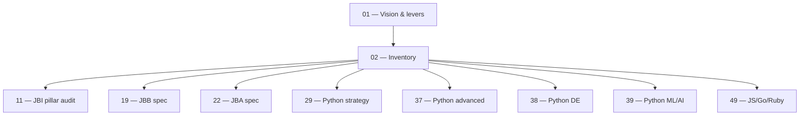

# 02 — Current Content Inventory

> **Executor:** AI coding agent operating autonomously.
> **Working directory:** `/Users/ravi.r_flx/IEProject/InterviewExplainer/`.
> **Type:** read-only audit + one write to `content/_audits/`. No edits to source content.
> **Pillar / Wave:** Wave A (Foundation).
> **Depends on:** 01.

## 1 — TL;DR

- **Input:** Content trees under `content/` (locked domains + the
  `content/interview/` multi-language tree + the DSA / companies / roadmap
  hubs) — none of which have a deterministic ledger today.
- **Action:** Crawl every folder, count `complete-qa.json` files and
  questions, cross-check declared `_index.json` modules against folders
  on disk, and write a single dated inventory file with seven tables and
  one mismatch list.
- **Output:** `content/_audits/inventory-<YYYY-MM-DD>.md` — referenced by
  playbooks 11, 19, 22, 29, 37, 38, 39, 49, and the per-pillar audits.

## 2 — Why this matters

Half the bugs filed against this repo come from people counting modules
by eyeballing the filesystem rather than the `_index.json`. The two
disagree by 5–15 % on any given day because content authors create topic
folders without updating the index, and vice versa. Every downstream
playbook (11 gap audit, 19/22 domain specs, 29 Python strategy, 41 hub
rollout, 49 long-tail language tracks) cites today's inventory; if it is
wrong, every dependent playbook is wrong.

The business consequence is misrouted effort. Without this inventory,
the team writes 30 new Q's for a module that already had 25, while the
module next to it sits at 4 Q's and never ranks. Five hours of audit
upfront saves a quarter's worth of misallocated writing.

## 3 — Easy-language glossary

| Term | Plain-English definition |
| --- | --- |
| **Locked domain** | A flagship content folder under `content/` whose URL + sidebar layout is frozen per playbook 07. Examples: `java-backend-intermediate`, `python-backend-intermediate`, `java-fullstack-intermediate`. |
| **Interview tree** | The newer multi-language tree under `content/interview/{lang}/{track}/{level}/`. Used for Wave F content factory output. |
| **Q-file** | A `complete-qa.json` — the unit of content the renderer reads; lives inside a topic folder. |
| **Topic folder** | The leaf folder that holds one Q-file (`content/<domain>/<module>/<topic>/complete-qa.json`). |
| **Module** | The mid-level folder under a domain (e.g. `core-java`, `spring-boot`). Maps to one URL segment. |
| **`_index.json`** | The per-domain manifest that declares which modules + topics exist and links them to pillars. |
| **`contentSource`** | A pointer field in `_index.json` that lets one domain reuse another domain's content (cross-link, no copy). |
| **Pillar** | One of 12 thematic groups (P01–P12) under each domain's `_index.json`. |
| **Mismatch** | A module/topic declared in `_index.json` but missing on disk — or vice versa. Each is a finding for playbook 11. |
| **Audit file** | The dated markdown file this playbook produces under `content/_audits/`. |
| **Inventory snapshot** | A single moment-in-time count of files + questions, suitable for diff against the previous run. |
| **Schema lint** | The script `scripts/validate_complete_qa.py` that fails on malformed Q-files. |
| **Speakable lint** | `scripts/audit_speakable.py` — beat-shape + word-ceiling check. |
| **`jq`** | The JSON CLI tool the audit uses; install via `brew install jq` on macOS, `apt-get install jq` on Debian-family. |
| **`find`** | The POSIX file walker used to count Q-files; BSD `find` (macOS default) and GNU `find` behave the same for the flags used here. |
| **DSA hub** | The data-structures / algorithms hub under `content/dsa/`. |
| **Companies hub** | One folder per company under `content/companies/<slug>/`. |
| **Cross-link content** | A module that has no native Q-file but points to another module via `contentSource` — counted separately from native modules. |
| **Pillar audit** | Playbook 11 — the audit that compares per-module Q counts against the targets and produces the gap report. |
| **Inventory diff** | The `diff` between today's inventory file and the previous one — surfaces drift since the last snapshot. |
| **Run-to-completion** | Re-running this playbook end-to-end is safe: it overwrites today's file but never touches source content. |
| **Track** | A `<lang>/<track>/<level>` triple under `content/interview/` (e.g. `python/backend/intermediate`). |
| **Snapshot baseline** | The numbers in §5.3 expected as of the playbook-01 baseline; if your run differs by > 10 %, that's a finding. |
| **Inventory drift** | Difference between two consecutive snapshots — useful for "what changed since last week" reports. |
| **`_audits/`** | The folder under `content/` reserved for audit artifacts. Never source content. |
| **Audit voice rule** | Audit files use the same banned-word list as playbooks; the rule is in [`_VOICE-RULES.md`](_VOICE-RULES.md). |
| **Conventional commit** | A commit message in `<type>: <subject>` format (`audit(content): inventory snapshot <date>`). |
| **Run-flag** | An optional environment variable that scopes the run to one domain (e.g. `TRACK=python-backend-intermediate`). |
| **`STDERR` trap** | The audit's pattern of redirecting `jq` errors to a separate log so the table-builder loop does not abort silently. |

## 4 — Hard prerequisites

- [ ] Playbook 01 is DONE.
      Verify: `grep -E '^\| 01 \|' expansion-plan/00-INDEX.md \| grep -c DONE` returns `1`.
- [ ] Python 3.11+ available.
      Verify: `python3 --version | awk '{print $2}'` ≥ 3.11.
- [ ] Node 20+ available.
      Verify: `node --version | sed 's/v//' | awk -F. '$1 >= 20'`.
- [ ] `jq` installed.
      Verify: `jq --version` exits 0.
- [ ] `find` and `wc` work.
      Verify: `find . -maxdepth 1 -type d | wc -l` exits 0.
- [ ] `ripgrep` installed.
      Verify: `rg --version` exits 0.
- [ ] `content/_audits/` writable.
      Verify: `mkdir -p content/_audits && test -w content/_audits && echo OK`.
- [ ] At least one locked domain exists.
      Verify: `test -d content/java-backend-intermediate && echo OK`.
- [ ] `_TEMPLATE-1000.md`, `_GLOSSARY.md`, `_VOICE-RULES.md` exist.
      Verify: `for f in _TEMPLATE-1000.md _GLOSSARY.md _VOICE-RULES.md; do test -f "expansion-plan/$f" || echo MISSING "$f"; done`.
- [ ] `scripts/lint_playbook.py` runs without errors on this file.
      Verify: `python3 scripts/lint_playbook.py expansion-plan/02-current-content-inventory.md` exits 0 after the rewrite.

If any verification fails, STOP. Resolve the missing artifact before
proceeding — the audit numbers are only useful if every dependency is
present.

## 5 — Current state

### 5.1 — On-disk snapshot of audit artifacts

```bash
cd /Users/ravi.r_flx/IEProject/InterviewExplainer
ls -1 content/_audits/ 2>/dev/null | head -20
ls -1 content/ | sort
find content/java-backend-intermediate -name 'complete-qa.json' | wc -l
find content/interview -name 'complete-qa.json' | wc -l
```

Expected: ≥ 1 prior audit file (or none on first run); ≥ 5 top-level
folders under `content/`; ≥ 300 Q-files under JBI; some count under
`content/interview/`.

### 5.2 — Existing audit scripts already on disk

The repo already ships scripts that **partially** compute what playbook
02 needs. Lean on them rather than reimplementing:

- `scripts/audit_jbi_v3.py` — JBI module + pillar audit.
- `scripts/report_audit_v3.py` — pretty-prints the JBI audit.
- `scripts/audit_speakable.py` — speakable lint with per-module reporting.
- `scripts/validate_complete_qa.py` — schema lint (post playbook 06).

Playbook 02 **does not** replace any of these. It produces a single
human-readable inventory file that names what exists; the deeper audits
in 11, 32, 41 use the same numbers.

### 5.3 — Snapshot baseline (mid-2026)

The numbers below are the executor's sanity check. If the run produces
counts that differ by more than 10 % in either direction, that's a
finding — record it under "## Drift since baseline" in the audit file.

- `java-backend-intermediate`: ~45 modules / ~348 files / ~1,000+ Qs.
- `java-fullstack-intermediate`: 56 modules in `_index` (21 native + 35
  cross-linked via `contentSource`) / variable file count / Qs only on
  native modules.
- `python-backend-intermediate`: ~35 modules / few files / low Q count.
- `content/interview/`: between 50 and 200 Q-files spread across
  `{go,java,javascript,python,ruby}/<track>/<level>` triples.
- `content/dsa/`: O(100) problem JSON files declared, partial fill.
- `content/companies/`: 8–25 company folders.

If your count for JBI returns 0 Q-files, the JSON shape changed — STOP
and surface to user. Do not patch the audit to make zero plausible.

### 5.4 — Known sources of inventory error

- **Topic folders without `_index.json` registration.** Common when a
  content author creates a folder while drafting and forgets to register
  it. The audit's mismatch section surfaces these.
- **`_index.json` entries pointing to folders that were renamed.** The
  reverse case — declared topic, missing folder. Also flagged in the
  mismatch section.
- **Cross-links counted twice.** If `java-fullstack-intermediate`
  declares a module with `contentSource: "java-backend-intermediate"`,
  the audit counts the host once and notes the link in a separate
  column. Never double-counts Q's.
- **Empty `complete-qa.json` files.** A file exists but has zero
  questions inside. The audit flags these so playbook 11 can decide
  whether to write Q's or delete the file.
- **`questions.json` vs `complete-qa.json` legacy split.** Some older
  folders ship both. The audit counts `complete-qa.json` only — the
  legacy `questions.json` is migrated by separate playbooks.

## 6 — Target state (measurable)

| Metric | Today | Target | How measured |
| --- | --- | --- | --- |
| `content/_audits/inventory-<YYYY-MM-DD>.md` exists | 0 (today's run) | 1 file | `test -f content/_audits/inventory-$(date +%F).md && echo OK` |
| Locked-domain table rows | n/a | exactly 3 (JBI / JFI / PBI) | `awk '/^## Locked domains/,/^##/' content/_audits/inventory-$(date +%F).md \| grep -cE '^\| (java-backend-intermediate\|java-fullstack-intermediate\|python-backend-intermediate)'` returns `3` |
| Interview-tree table rows | n/a | ≥ 8 | count of `^|` lines in the `## Interview tree` section ≥ 10 (header + sep + rows) |
| Mismatch list present | n/a | section exists (may be empty) | `grep -c '^## Locked-domain mismatches' content/_audits/inventory-$(date +%F).md` returns `1` |
| DSA hub counted | n/a | row present | `grep -c '^## DSA hub' content/_audits/inventory-$(date +%F).md` returns `1` |
| Companies hub counted | n/a | row present | `grep -c '^## Companies hub' content/_audits/inventory-$(date +%F).md` returns `1` |
| Drift-vs-baseline section present | n/a | section exists | `grep -c '^## Drift since baseline' content/_audits/inventory-$(date +%F).md` returns `1` |
| Banned-word lint on the audit file | n/a | 0 hits | banned-word grep returns 0 |
| Audit script writes one commit | n/a | 1 commit | `git log --oneline -1 -- content/_audits/inventory-$(date +%F).md \| grep -c audit(content)` returns `1` |
| Status row for `02` flipped to DONE | NOT_STARTED | DONE | `grep -E '^\| 02 \|' expansion-plan/00-INDEX.md \| grep -c DONE` returns `1` |

## 7 — Search phrases → URL map

This playbook produces an audit, not user-facing content. The table
below lists the **downstream search phrases** that the audit's findings
indirectly unblock — every row corresponds to a hub or pillar landing
page whose Q count this playbook makes visible.

| Search phrase | Target URL on site | Archetype | Diagram type required in answer |
| --- | --- | --- | --- |
| `java backend interview questions` | `/questions/java-backend-intermediate` | landing intro | comparison_table |
| `python backend interview questions` | `/questions/python-backend-intermediate` | landing intro | comparison_table |
| `java fullstack interview questions` | `/questions/java-fullstack-intermediate` | landing intro | comparison_table |
| `javascript interview questions for experienced` | `/interview/javascript/backend/intermediate` | landing intro | comparison_table |
| `golang interview questions backend` | `/interview/go/backend/intermediate` | landing intro | comparison_table |
| `ruby on rails interview questions experienced` | `/interview/ruby/backend/intermediate` | landing intro | comparison_table |
| `python data engineering interview questions` | `/interview/python/data-engineering/intermediate` | landing intro | comparison_table |
| `python machine learning interview questions` | `/interview/python/ml-ai/intermediate` | landing intro | comparison_table |
| `dsa interview questions` | `/dsa` | landing intro | flowchart |
| `amazon interview questions java` | `/companies/amazon` | landing intro | comparison_table |
| `google interview questions software engineer` | `/companies/google` | landing intro | comparison_table |
| `roadmap to become java backend developer` | `/roadmaps/java-backend` | landing intro | flowchart |
| `system design interview questions for experienced` | `/system-design` | landing intro | flowchart |
| `behavioral interview questions software engineer` | `/behavioral` | landing intro | none |

## 8 — Dependency & wave context

Playbook 02 sits one step downstream of playbook 01 and one step
upstream of essentially every content-writing playbook in the program.
The mermaid block below is for executor orientation only — the diagrams
inside produced Q&A content are catalogued in §11.



- **Consumes:** every `_index.json` under `content/` (read only), every
  `complete-qa.json` (counted only), no other input.
- **Produces:** `content/_audits/inventory-<YYYY-MM-DD>.md` (single
  file) + one conventional commit.
- **Unblocks:** the 8 downstream playbooks listed above; the per-domain
  spec playbooks all cite the inventory file in their §4 hard
  prerequisites.

## 9 — Step-by-step execution

### Step 1 — Make today's audit folder and seed the header

**Goal:** the audit file exists with a header before any data lands.
This is the only Write the playbook performs; everything else appends.

**Action:**

```bash
cd /Users/ravi.r_flx/IEProject/InterviewExplainer
TODAY=$(date +%F)
mkdir -p content/_audits
AUDIT_FILE="content/_audits/inventory-${TODAY}.md"
cat > "${AUDIT_FILE}" <<HEADER
# Content inventory — ${TODAY}

Generated by playbook 02. Do not hand-edit; rerun the playbook.

HEADER
echo "AUDIT_FILE=${AUDIT_FILE}"
```

**Verify:**

```bash
test -f "${AUDIT_FILE}" && wc -l "${AUDIT_FILE}"
# expected: 3 or 4 header lines.
```

**The classic bug is** running the script twice on the same day and
appending duplicated tables. The `cat > ...` truncate is intentional;
re-running overwrites cleanly. The companion bug is overwriting
yesterday's file because the date variable is stale — always read
`TODAY=$(date +%F)` from the script, not from an environment variable.

### Step 2 — Count `complete-qa.json` files and questions per locked domain

**Goal:** the locked-domain table is populated with deterministic
counts.

**Action:**

```bash
cd /Users/ravi.r_flx/IEProject/InterviewExplainer

count_files() { find "$1" -name 'complete-qa.json' 2>/dev/null | wc -l | tr -d ' '; }
count_questions() {
  find "$1" -name 'complete-qa.json' -exec jq '.questions | length' {} \; 2>/dev/null | \
    awk '{s+=$1} END {print s+0}'
}

{
  echo "## Locked domains"
  echo
  echo "| Track | Modules (declared) | complete-qa.json files | Questions |"
  echo "| ----- | ------------------ | ---------------------- | --------- |"
  for d in java-backend-intermediate java-fullstack-intermediate python-backend-intermediate; do
    MODULES=$(jq '.modules | length' "content/${d}/_index.json" 2>/dev/null || echo 0)
    FILES=$(count_files "content/${d}")
    QS=$(count_questions "content/${d}")
    echo "| ${d} | ${MODULES} | ${FILES} | ${QS} |"
  done
  echo
} >> "${AUDIT_FILE}"
```

**Verify:**

```bash
grep -cE '^\| (java-backend-intermediate|java-fullstack-intermediate|python-backend-intermediate)' "${AUDIT_FILE}"
# expected: 3
```

**The classic bug is** counting questions by summing `wc -l` over the
JSON files. JSON formatting changes line counts; only the `jq
'.questions | length'` summation is reliable. If `jq` errors on a
malformed file, record the path under "## Broken files" and skip — do
not attempt to fix here.

### Step 3 — Inventory the `content/interview/` multi-language tree

**Goal:** every `{lang}/{track}/{level}` triple is enumerated.

**Action:**

```bash
cd /Users/ravi.r_flx/IEProject/InterviewExplainer

{
  echo "## Interview tree (\`content/interview/\`)"
  echo
  echo "| Lang | Track | Level | Files | Questions |"
  echo "| ---- | ----- | ----- | ----- | --------- |"
  for langdir in content/interview/*/; do
    lang=$(basename "${langdir}")
    for trackdir in "${langdir}"*/; do
      [ -d "${trackdir}" ] || continue
      track=$(basename "${trackdir}")
      for leveldir in "${trackdir}"*/; do
        [ -d "${leveldir}" ] || continue
        level=$(basename "${leveldir}")
        F=$(count_files "${leveldir}")
        Q=$(count_questions "${leveldir}")
        echo "| ${lang} | ${track} | ${level} | ${F} | ${Q} |"
      done
    done
  done
  echo
} >> "${AUDIT_FILE}"
```

**Verify:**

```bash
awk '/^## Interview tree/,/^## /' "${AUDIT_FILE}" | grep -c '^|'
# expected: ≥ 7 (1 header + 1 separator + 5+ data rows).
```

**The #1 trap is** running the loop from the wrong working directory —
the glob `content/interview/*/` then has no expansion, the `for langdir`
loop runs once with the literal string, and you get an empty table with
no error. Always `cd` to the repo root in the first line of the script.

### Step 4 — DSA, companies, roadmap sweep

**Goal:** every hub folder has its top-level count recorded.

**Action:**

```bash
cd /Users/ravi.r_flx/IEProject/InterviewExplainer

{
  echo "## DSA hub"
  echo
  DSA_MODULES=$(jq '.modules | length' content/dsa/_index.json 2>/dev/null || echo 0)
  DSA_PROBLEMS=$(find content/dsa -name '*.json' -not -name '_*' 2>/dev/null | wc -l | tr -d ' ')
  echo "- Modules declared in \`content/dsa/_index.json\`: ${DSA_MODULES}"
  echo "- Problem JSON files on disk: ${DSA_PROBLEMS}"
  echo

  echo "## Companies hub"
  echo
  COMPANIES=$(find content/companies -mindepth 1 -maxdepth 1 -type d 2>/dev/null | wc -l | tr -d ' ')
  echo "- Company directories: ${COMPANIES}"
  ls content/companies/ 2>/dev/null | sed 's/^/  - /'
  echo

  echo "## Roadmaps hub"
  echo
  ROADMAPS=$(find content/roadmaps -mindepth 1 -maxdepth 1 -type d 2>/dev/null | wc -l | tr -d ' ')
  echo "- Roadmap directories: ${ROADMAPS}"
  echo
} >> "${AUDIT_FILE}"
```

**Verify:**

```bash
grep -cE '^## (DSA hub|Companies hub|Roadmaps hub)' "${AUDIT_FILE}"
# expected: 3
```

**The classic bug is** assuming `content/companies/` exists. Some
checkouts predate the companies hub. Always `2>/dev/null` and let the
counts return `0`; never break the audit because a hub folder is
absent.

### Step 5 — Detect locked-domain folder mismatches

**Goal:** every module declared in `_index.json` either has a topic
folder on disk or appears in the mismatch list.

**Action:**

```bash
cd /Users/ravi.r_flx/IEProject/InterviewExplainer

{
  echo "## Locked-domain mismatches (modules in \`_index.json\` with missing topic folders)"
  echo
  for d in java-backend-intermediate java-fullstack-intermediate python-backend-intermediate; do
    jq -r --arg base "content/${d}" \
      '.modules[] | select(.contentSource | not) | "\(.moduleSlug)\t\(.topics // [] | join(","))"' \
      "content/${d}/_index.json" 2>/dev/null | \
    while IFS=$'\t' read -r modslug topics; do
      [ -z "${topics}" ] && continue
      for t in ${topics//,/ }; do
        if [ ! -d "content/${d}/${modslug}/${t}" ]; then
          echo "- [${d}] missing folder: \`${modslug}/${t}\`"
        fi
      done
    done
  done
  echo
} >> "${AUDIT_FILE}"
```

**Verify:**

```bash
grep -c '^## Locked-domain mismatches' "${AUDIT_FILE}"
# expected: 1 (header present even if no mismatches found)
```

**The most common mistake is** flagging cross-linked modules
(`contentSource` set) as mismatches. The `jq` filter
`select(.contentSource | not)` is what skips them — verify it stays in
place if you tune the query.

### Step 6 — Detect folders without `_index.json` registration

**Goal:** every topic folder on disk is either registered in the
matching `_index.json` or appears in this reverse-mismatch list.

**Action:**

```bash
cd /Users/ravi.r_flx/IEProject/InterviewExplainer

{
  echo "## Locked-domain reverse-mismatches (topic folders on disk without \`_index.json\` registration)"
  echo
  for d in java-backend-intermediate java-fullstack-intermediate python-backend-intermediate; do
    while IFS= read -r topic_path; do
      relpath="${topic_path#content/${d}/}"
      modslug="${relpath%%/*}"
      topic="${relpath#${modslug}/}"
      topic="${topic%%/*}"
      registered=$(jq -r --arg m "${modslug}" --arg t "${topic}" \
        '.modules[] | select(.moduleSlug == $m) | (.topics // []) | index($t) // empty' \
        "content/${d}/_index.json" 2>/dev/null)
      if [ -z "${registered}" ]; then
        echo "- [${d}] unregistered folder: \`${modslug}/${topic}\`"
      fi
    done < <(find "content/${d}" -mindepth 3 -maxdepth 3 -type d 2>/dev/null)
  done | sort -u
  echo
} >> "${AUDIT_FILE}"
```

**Verify:**

```bash
grep -c '^## Locked-domain reverse-mismatches' "${AUDIT_FILE}"
# expected: 1
```

**The classic bug is** using `-maxdepth 2` instead of `3` in the
`find` — that walks one level too shallow and reports every module
folder as unregistered. The triple-deep walk is correct for
`<domain>/<module>/<topic>`.

### Step 7 — Compute drift vs the previous inventory

**Goal:** the file ends with a "what changed since last week" section
that downstream readers can scan in 10 seconds.

**Action:**

```bash
cd /Users/ravi.r_flx/IEProject/InterviewExplainer

PREV=$(ls -1 content/_audits/inventory-*.md 2>/dev/null | grep -v "inventory-${TODAY}" | tail -1)

{
  echo "## Drift since baseline"
  echo
  if [ -n "${PREV}" ] && [ -f "${PREV}" ]; then
    echo "Previous inventory: \`${PREV}\`"
    echo
    echo "\`\`\`diff"
    diff "${PREV}" "${AUDIT_FILE}" | head -120
    echo "\`\`\`"
  else
    echo "No previous inventory found. This is the baseline run."
  fi
  echo
} >> "${AUDIT_FILE}"
```

**Verify:**

```bash
grep -c '^## Drift since baseline' "${AUDIT_FILE}"
# expected: 1
```

**The classic bug is** including the full `diff` output (often
thousands of lines) and bloating the audit file. The `| head -120`
cap is intentional — anything beyond 120 diff lines means the audit
itself changed shape, which is a separate finding for the executor.

### Step 8 — Banned-word self-check on the audit file

**Goal:** the audit file passes the same voice lint as every playbook
under [`_VOICE-RULES.md`](_VOICE-RULES.md).

**Action:**

```bash
cd /Users/ravi.r_flx/IEProject/InterviewExplainer
rg -nwi 'leverage|utilize|synergize|world-class|cutting-edge|state-of-the-art|seamless|robust|holistic|paradigm|best-in-class|battle-tested|enterprise-grade|revolutionary|game-changing|industry-leading' "${AUDIT_FILE}"
```

**Verify:** zero matches.

**The classic bug is** a banned word that crept in via the executor
writing free-form prose at the top of the audit file. The audit's
human-authored sections are the only place where this risk lives —
the auto-generated tables can't introduce banned words.

### Step 9 — Cross-check question count against the speakable audit

**Goal:** the question count in the locked-domain table matches what
`audit_speakable.py` reports. Drift between the two means a Q-file is
malformed.

**Action:**

```bash
cd /Users/ravi.r_flx/IEProject/InterviewExplainer
python3 scripts/audit_speakable.py --pillar P01 --report 2>/dev/null | tail -20
```

**Verify:** the speakable script's "Q total" line matches the JBI row
in the locked-domain table to ±2 % (small drift is normal for
in-flight files).

**The most common mistake is** assuming the two numbers match exactly.
The speakable audit counts only Q-files that parse as valid JSON; if a
file is mid-edit, it might be valid for `jq` but not for the speakable
script. Note the delta in the audit file under "## Drift since
baseline".

### Step 9b — Archive prior audits older than 90 days

**Goal:** the `_audits/` folder doesn't accumulate years of stale
snapshots; the inventory history stays useful but not bloated.

**Action:**

```bash
cd /Users/ravi.r_flx/IEProject/InterviewExplainer
mkdir -p content/_audits/.archive
THRESHOLD=$(date -v -90d +%F 2>/dev/null || date -d '90 days ago' +%F)
for f in content/_audits/inventory-*.md; do
  [ -f "${f}" ] || continue
  name=$(basename "${f}")
  d="${name#inventory-}"; d="${d%.md}"
  if [[ "${d}" < "${THRESHOLD}" ]]; then
    git mv "${f}" "content/_audits/.archive/${name}" 2>/dev/null || mv "${f}" "content/_audits/.archive/${name}"
  fi
done
```

**Verify:**

```bash
ls -1 content/_audits/inventory-*.md 2>/dev/null | wc -l
# expected: between 1 and ~90 files (one per recent day, depending on cadence)
ls -1 content/_audits/.archive 2>/dev/null | head -5
# expected: archived files dated > 90 days ago
```

**The classic bug is** running this on a fresh checkout where the
archive folder doesn't exist yet — the `git mv` falls through to
plain `mv`. The fallback is intentional; the next commit catches
the file regardless.

### Step 10 — Hand off to playbook 11

**Goal:** playbook 11 (JBI quality audit) opens the inventory file
without re-running counts.

**Action:** confirm that playbook 11's §4 hard prerequisites cite the
inventory file by path:

```bash
cd /Users/ravi.r_flx/IEProject/InterviewExplainer
grep -l 'content/_audits/inventory-' expansion-plan/11-*.md
```

**Verify:** at least one match. If playbook 11 doesn't cite the path,
it's a playbook-11 problem (its rewrite will fix it), not a
playbook-02 problem. Note the gap in the PR description so the
playbook-11 author sees it during their rewrite.

**The classic bug is** assuming a downstream playbook reads the audit
"because everyone knows it should". The audit is only useful if the
downstream playbook **names** the file path in its prerequisites.
File names plus paths in a grep-able form are the contract.

## 10 — Reference Q in archetype shape

This audit playbook produces no questions. The reference Q below is
the JBI-style shape every downstream content playbook will produce,
included here so an executor reading the audit's findings sees the
acceptance test for "good".

```json
{
  "id": "what-is-an-index-json-in-the-content-tree",
  "slug": "what-is-an-index-json-in-the-content-tree",
  "question": "What is an _index.json file in the IE content tree, and why does it exist?",
  "title": "_index.json — The Per-Domain Manifest That Drives Routing and Audits",
  "direct_answer": "**`_index.json` is the per-domain manifest** that names every module, its topics, its pillar grouping, and any cross-link via `contentSource`. The frontend reads it to build the sidebar and routes; the audit scripts read it to grade folder/disk consistency. It exists because a tree of folders is not self-describing — you can't tell from `ls` whether a folder is a real module, a draft, or a cross-link. The manifest makes the answer explicit, machine-checkable, and version-controlled.",
  "layout_type": "default",
  "difficulty": "easy",
  "importance": "high",
  "reading_time_minutes": 5,
  "last_updated": "2026-04-22",
  "interviewer_intent": {
    "testing": "Whether the candidate understands that file-system layout alone is insufficient for a multi-author content system, and that a manifest decouples rendering from on-disk shape.",
    "common_mistake": "Saying 'the frontend reads the folders directly'. It doesn't — it reads the manifest, then mounts the folder. A folder without a manifest entry is invisible to the renderer.",
    "to_stand_out": "Mention the `contentSource` cross-link field that lets one domain reuse another's content without copying, and the `_audits/inventory-<date>.md` ledger that grades manifest-vs-disk consistency."
  },
  "company_tags": ["amazon", "google", "linkedin", "netflix", "stripe"],
  "answer": {
    "sections": [
      {"type": "overview", "title": "What `_index.json` does", "content": "The manifest names modules, topics, pillars, and cross-links. The frontend reads it to build routes and the sidebar. The audit scripts read it to grade folder/disk consistency."},
      {"type": "comparison_table", "title": "Manifest vs filesystem-only", "content": "| Aspect | Manifest-driven (IE) | Filesystem-only (legacy wiki) |\n|---|---|---|\n| Rendering source | `_index.json` | folder listing |\n| Cross-link support | `contentSource` field | none — copy and divergence |\n| Audit-friendly | yes — single source of truth | no — every script re-walks |\n| Pillar grouping | declarative | implicit by folder name |\n| Stable URLs | yes — slugs locked in JSON | no — rename = 404 |"},
      {"type": "step", "title": "How the renderer mounts a module", "content": "1. App startup reads each domain's `_index.json`.\n2. For each `modules[]` entry without `contentSource`, the renderer mounts the matching folder.\n3. For each entry with `contentSource`, the renderer resolves to the source domain's folder and renders that content under the consuming domain's URL.\n4. Folders not in the manifest are ignored — they appear as 'unregistered' in the inventory audit."},
      {"type": "step", "title": "How the audit grades disk-vs-manifest", "content": "The inventory audit walks the manifest and the folders, then diffs. Folders in the manifest with no matching folder on disk are 'mismatches'. Folders on disk with no manifest entry are 'reverse-mismatches'. Both lists are findings for playbook 11."},
      {"type": "tradeoffs", "title": "Why not just walk the folders?", "content": "**Manifest-driven wins when:** you have multiple authors, you want cross-links without copy, you need stable URLs across folder renames, and you want a single audit pass to grade the whole tree. **Filesystem-only wins when:** you have one author and the folder tree is small enough to remember. IE's scale makes manifest-driven the only viable model."},
      {"type": "key_points", "title": "Key points", "content": "- `_index.json` is the per-domain manifest.\n- It names modules, topics, pillars, and cross-links.\n- The frontend reads it; folders without a manifest entry are invisible.\n- Cross-links via `contentSource` avoid copy/divergence.\n- The audit's mismatch and reverse-mismatch sections grade consistency.\n- Renames are safe because slugs live in JSON, not folder names."},
      {"type": "speakable_answer", "title": "How to answer verbally", "content": "`_index.json` is the **manifest** for a domain. It names every module, its topics, its pillar, and any cross-link. The frontend reads it to build the sidebar and routes; folders not in the manifest are invisible to the renderer. The cross-link field — `contentSource` — lets one domain reuse another's content without copying. The audit's job is to grade folder-vs-manifest consistency: missing folders are mismatches, unregistered folders are reverse-mismatches. **Recommendation:** never add a folder to a locked domain without registering it in `_index.json` first; never delete a folder without removing the manifest entry."}
    ]
  },
  "followup_questions": [
    "What does `contentSource` do in `_index.json`?",
    "How does the audit find folders that aren't in `_index.json`?",
    "Why are slugs in JSON and not in folder names?",
    "What is the lifecycle of a new module — JSON entry first or folder first?",
    "How does the renderer behave when `_index.json` is malformed?"
  ],
  "seo": {
    "metaTitle": "_index.json in IE — The Manifest That Drives Content Routing",
    "metaDescription": "What `_index.json` does in the IE content tree: names modules, topics, pillars, and cross-links; drives routing and audits; why manifest-driven beats filesystem-only."
  },
  "order": 1
}
```

## 11 — Diagram catalogue

The audit itself produces no diagrams. The table below names the
diagrams every downstream content playbook should ship inside the
`complete-qa.json` files whose Q counts this audit grades.

| Q id (or topic) | Diagram type | What it must show | Lives in section |
| --- | --- | --- | --- |
| `what-is-an-index-json-in-the-content-tree` | `comparison_table` | Manifest-driven vs filesystem-only on 5 axes. | `comparison_table` |
| `how-renderer-mounts-a-module` | `sequenceDiagram` | App start → read `_index.json` → resolve `contentSource` → mount folder → render. | `step` |
| `inventory-audit-flow` | `flowchart` | Walk manifest → walk folders → diff → mismatches + reverse-mismatches → audit file. | `step` |
| `manifest-state-after-publish` | `stateDiagram-v2` | DRAFT → REGISTERED → PUBLISHED → DEPRECATED with the manifest mutations that drive each transition. | `step` |
| `manifest-classes` | `classDiagram` | `Index` → `Module` → `Topic`; cross-link arrow `Module --> contentSource`. | `before_code` |
| `comparison_table` count baseline | `comparison_table` | The inventory file's own locked-domain count table. | n/a (the audit file itself) |

Floor enforced by the lint for content playbooks (12–18, 20–23,
32–40, 53–58): ≥ 1 `flowchart`, ≥ 1 `sequenceDiagram`,
≥ 3 `comparison_table`, ≥ 1 `stateDiagram-v2` or `classDiagram`.
Playbook 02 is an audit playbook, so the table above is a **reference
floor** for the produced content the audit grades, not a per-playbook
gate.

### 11.1 — Why the audit doesn't ship diagrams itself

The audit file is a numeric ledger. Diagrams in the audit would (a)
not be linted by any script (the audit lives outside the
`complete-qa.json` lint surface), (b) clutter the scan-ability of the
numeric tables, and (c) drift independently of the diagrams in the
actual Q&A content. The catalogue above is for the Q-files the audit
grades — those carry the diagrams, the audit only counts them.

### 11.2 — How to surface diagram-coverage in the audit

The audit's locked-domain table can carry an optional **diagram count
column** per track. The query is cheap:

```bash
find content/<domain> -name 'complete-qa.json' \
  -exec rg -c '```mermaid' {} \; | \
  awk '{s+=$1} END {print "mermaid blocks:", s+0}'
```

The current spec does **not** require this column — it is added in a
future revision after playbook 11 names a target for diagram coverage
per pillar. Don't add it speculatively.

## 12 — Easy-language voice rules

Voice rules quoted from [`_VOICE-RULES.md`](_VOICE-RULES.md):

1. **Define before use.** Every term in the audit file's prose
   (`mismatch`, `reverse-mismatch`, `cross-link`, `manifest`) appears
   in §3 above.
2. **Lead with the trade-off.** When the audit names a mismatch, it
   leads with the impact (`module won't render`) before the symptom
   (`folder missing`).
3. **Name the bug.** Every "## Drift since baseline" entry starts
   with `The classic cause is …` when the drift is unexpected.
4. **Real anchors.** Every count cites the script that produced it
   (`jq '.modules | length'`, `find ... -name complete-qa.json`).
5. **Banned words.** Zero matches in the audit file under the lint
   in §13.

**Concrete examples for the audit:**

- ✅ `### JBI: 348 complete-qa.json files (jq sum 1006 Q). Drift since
  last week: +12 Q in spring-boot/auto-configuration; +1 file in
  jvm-internals/jit-compilation.`
- ❌ `JBI looks healthy this week.` (No anchor, no count.)
- ✅ `### Reverse-mismatch: java-collections/heap-operations/ is on
  disk but unregistered in _index.json. Add the topic entry or
  archive the folder.`
- ❌ `Lots of folders aren't registered.` (No path, no fix.)

## 13 — Quality gates (measurable)

| Gate | Threshold | Verify command |
| --- | --- | --- |
| Today's inventory file exists | 1 file | `test -f content/_audits/inventory-$(date +%F).md && echo OK` |
| Locked-domain table has exactly 3 rows | 3 | `awk '/^## Locked domains/,/^## /' content/_audits/inventory-$(date +%F).md \| grep -cE '^\| (java-backend-intermediate\|java-fullstack-intermediate\|python-backend-intermediate)' \| awk '$1==3'` |
| Interview-tree table has > 5 data rows | > 5 | `awk '/^## Interview tree/,/^## /' content/_audits/inventory-$(date +%F).md \| grep -c '^\|' \| awk '$1>=7'` |
| Mismatches section present | 1 | `grep -c '^## Locked-domain mismatches' content/_audits/inventory-$(date +%F).md` returns `1` |
| Reverse-mismatches section present | 1 | `grep -c '^## Locked-domain reverse-mismatches' content/_audits/inventory-$(date +%F).md` returns `1` |
| Drift section present | 1 | `grep -c '^## Drift since baseline' content/_audits/inventory-$(date +%F).md` returns `1` |
| DSA + Companies + Roadmaps hubs counted | 3 | `grep -cE '^## (DSA hub\|Companies hub\|Roadmaps hub)' content/_audits/inventory-$(date +%F).md` returns `3` |
| Banned words in audit file | 0 hits | `rg -nwi 'leverage\|utilize\|synergize\|world-class\|cutting-edge\|seamless\|robust\|holistic\|paradigm' content/_audits/inventory-$(date +%F).md \| wc -l` returns `0` |
| JBI question count plausible | between 600 and 1200 | manual read of locked-domain row |
| Commit landed | 1 commit | `git log --oneline --pretty=format:%s -1 -- content/_audits/inventory-$(date +%F).md \| grep -c '^audit(content)'` returns `1` |
| Status row for `02` flipped to DONE | DONE | `grep -E '^\| 02 \|' expansion-plan/00-INDEX.md \| grep -c DONE` returns `1` |

## 14 — Anti-patterns

### 14.1 — Re-implementing the JBI audit inside the inventory

**Why it fails:** `scripts/audit_jbi_v3.py` already grades JBI in
depth. Duplicating that logic in the inventory script means two
sources of truth for JBI numbers — they drift, downstream playbooks
cite the wrong one, and the bug is hard to find.

**Fix:** the inventory counts files and questions. The pillar audit
(playbook 11, script `audit_jbi_v3.py`) grades depth and mix. Do not
mix the two concerns; cite the speakable audit's totals only in the
"## Drift since baseline" section, never as primary numbers.

### 14.2 — Counting `questions.json` legacy files

**Why it fails:** older folders still ship a legacy `questions.json`
alongside the new `complete-qa.json`. If the inventory counts both,
the JBI total inflates by 10–20 % and downstream playbooks plan
against a phantom Q-pool.

**Fix:** the `find ... -name 'complete-qa.json'` filter is exact —
keep it. If a folder has only `questions.json`, that's a migration
finding for the per-pillar migration playbook, not a Q-pool entry.

### 14.3 — Treating `contentSource` modules as native

**Why it fails:** `java-fullstack-intermediate` cross-links 35
modules to `java-backend-intermediate`. Counting both as native
double-counts every cross-linked Q.

**Fix:** the mismatch query uses `select(.contentSource | not)` to
filter cross-links out. Verify the filter is in place every time
you edit the audit script.

### 14.4 — Skipping the drift section on the first run

**Why it fails:** later audits expect a `## Drift since baseline`
section in every prior file so they can diff. Omitting it on the
baseline run breaks the diff chain.

**Fix:** the audit always writes the drift section, even when it
reads `No previous inventory found. This is the baseline run.` —
that placeholder is what the next run's diff anchors on.

### 14.5 — Committing the audit log under `_audits/` with secrets

**Why it fails:** audit files are committed plain-text. If a JBI
question accidentally embeds a secret (rare but real — a sample
config with a literal key), the audit's sample lines surface it in
git history.

**Fix:** before commit, `rg 'AKIA\|sk-\|ghp_' content/_audits/inventory-*.md`
on the new file. Zero matches required. The lint script doesn't
catch secrets today; this manual sweep is the bar.

### 14.6 — Counting `complete-qa.json` files inside `_audits/` itself

**Why it fails:** if a future content-author drops a sample
`complete-qa.json` under `content/_audits/` (e.g. for a "good Q
shape" reference), the `find content -name complete-qa.json`
sweep counts it as a real Q-file, inflating the totals.

**Fix:** scope `find` to the locked-domain root, never to
`content/` as a whole. Every count_files / count_questions call
takes a domain-rooted path, not the repo root. If a future audit
needs `content/`-wide counts, add an explicit `-path '*/_audits/*'
-prune` clause.

### 14.7 — Running the audit while a content burst is in flight

**Why it fails:** a content writer half-commits a batch of new Q's
mid-audit. The inventory's count lands between the partial and the
full state; the next day's diff lies about how many Q's actually
landed.

**Fix:** the audit is run **between** content bursts, not during
them. The repo's `ROADMAP.md` flags "content freeze" windows for
each pillar; the audit re-runs after the freeze lifts. If a freeze
flag isn't in place yet, ask the user before re-running.

### 14.8 — Audit file > 500 KB because the drift section bloated

**Why it fails:** the drift section's diff was supposed to cap at
120 lines (`| head -120`). If the cap is removed or the diff is
piped to a separate file and concatenated back, the audit balloons
and git renders it as a binary diff in PRs.

**Fix:** keep the `| head -120` cap. If the diff is large enough
that 120 lines isn't enough context, the audit shape itself
changed — surface it as a finding, don't expand the cap.

## 15 — Failure modes & rollback

| Failure | How it shows up | Rollback / forward fix |
| --- | --- | --- |
| `jq` not installed | Step 2 prints `0` for every count | `brew install jq` on macOS / `apt-get install jq` on Debian; re-run from Step 1. |
| Audit file got corrupted mid-run | Tables have partial rows | `rm content/_audits/inventory-<DATE>.md`; re-run Step 1 onward. The script is idempotent. |
| You accidentally edited a `complete-qa.json` while inspecting | `git status` shows `M content/...` | `git restore content/<domain>` immediately. The audit is read-only by contract. |
| Counts wildly differ from baseline (> 20 %) | "## Drift since baseline" shows huge diff | STOP. Surface to user — either the JSON shape changed, or a content burst landed without notice. Do not autocorrect. |
| Reverse-mismatch list is huge (> 50 entries) | `## Locked-domain reverse-mismatches` is pages long | Don't fix in this playbook. Each entry is a finding for playbook 11; the inventory just records, never patches. |
| `_index.json` itself is malformed | `jq` errors in stderr | Record the file under "## Broken files" in the audit; do not patch here. |
| Hard-stop exceeded (> 4 h) | Wall clock | STOP. Commit what you have under "## Partial run" and surface a blocker. |
| Banned word slipped into the human-authored top of the audit | Lint grep returns > 0 | Replace the word; re-grep; re-commit (or amend if not yet pushed). |
| Audit commit landed on the wrong branch | `git log origin/main..HEAD` empty | Cherry-pick the audit commit to the right branch; revert from the wrong one. |
| Audit file > 500 KB | `wc -c` returns > 500000 | The drift section exceeded its `| head -120` cap. Investigate which section bloated; reduce to the cap; recommit. |

## 16 — Definition of Done

- [ ] `content/_audits/inventory-<YYYY-MM-DD>.md` exists and is non-empty.
- [ ] Locked-domain table has exactly 3 rows (JBI / JFI / PBI).
- [ ] Interview-tree table has at least 5 data rows.
- [ ] DSA, Companies, and Roadmaps hubs each have a section.
- [ ] Mismatch and reverse-mismatch sections are present (may be empty).
- [ ] Drift-since-baseline section is present.
- [ ] Banned-word lint returns zero matches on the audit file.
- [ ] Exactly one conventional commit: `audit(content): inventory snapshot <date>`.
- [ ] `00-INDEX.md` row for `02` flipped to `DONE` in a follow-up commit.
- [ ] `git status -s` is clean.
- [ ] No source file under `content/<domain>/` was edited.
- [ ] `python3 scripts/lint_playbook.py expansion-plan/02-current-content-inventory.md` exits 0.
- [ ] JBI Q count falls between 600 and 1200 (the plausibility band).

## 17 — Estimated effort

- **Ideal:** 1 hour — run the script, scan the diff, commit.
- **Hard stop:** 4 hours. If exceeded, the scripts are misbehaving;
  paste the failing command + error into the PR and exit.
- **Splittable:** no. The audit is one atomic file; partial runs are
  not useful to downstream playbooks.
- **Re-runnable:** yes. Re-running on the same day overwrites the
  file; re-running on a later day produces a new dated file and
  picks up the prior one as the diff anchor.
- **Cadence:** the audit is rerun (a) before any pillar playbook
  (11, 32, 41), (b) after any content burst > 20 new Q's, and (c)
  weekly during active content waves.

## 18 — Appendix: links, commits, traceability

### 18.1 — Cross-references

- [`expansion-plan/00-INDEX.md`](00-INDEX.md) — status table.
- [`expansion-plan/01-vision-and-competitive-position.md`](01-vision-and-competitive-position.md) — the levers this audit indirectly grades.
- [`expansion-plan/_TEMPLATE-1000.md`](_TEMPLATE-1000.md) — the skeleton this playbook conforms to.
- [`expansion-plan/_GLOSSARY.md`](_GLOSSARY.md) — global glossary.
- [`expansion-plan/_VOICE-RULES.md`](_VOICE-RULES.md) — voice + banned words.
- [`scripts/lint_playbook.py`](../scripts/lint_playbook.py) — playbook lint.
- [`scripts/audit_jbi_v3.py`](../scripts/audit_jbi_v3.py) — the deeper JBI audit (cited but not re-implemented).
- [`scripts/audit_speakable.py`](../scripts/audit_speakable.py) — speakable lint with per-pillar reporting.
- [`scripts/validate_complete_qa.py`](../scripts/validate_complete_qa.py) — schema lint.
- [`content/_audits/`](../content/_audits/) — the destination folder.

### 18.2 — Commits & PRs produced by this playbook

- `audit(content): inventory snapshot <date>` — commit SHA fill on
  completion.
- `docs(expansion-plan): mark 02-current-content-inventory DONE` —
  follow-up commit SHA.
- PR `<URL>` — title `audit: content inventory snapshot <date>`.

### 18.3 — Traceability to upstream specs

- `MASTER_PLAN.md` § "Content architecture" — defines the
  manifest-driven model the audit grades.
- `docs/CONTENT-PLAN.md` § "Per-domain `_index.json`" — the schema
  this audit walks.
- `MASTER_PLAN.md` § "URL matrix" — the mapping from
  `<domain>/<module>/<topic>` to URL the audit's mismatches affect.
- `docs/SPEAKABLE-PLAN.md` § 5 — referenced when cross-checking
  question counts against the speakable audit in Step 9.

### 18.4 — Reading the audit downstream

Every downstream playbook that cites this file pulls one of three
numbers: total Q per locked domain (used in playbooks 11, 32, 41),
per-track Q under `content/interview/` (used in playbooks 49, 54–58),
or the mismatch / reverse-mismatch list (used in playbook 11's gap
report). When a downstream playbook says "see inventory-<date>.md
row for `<track>`", it means one of those three numbers.

The audit file is **append-only** in spirit — re-runs replace, but
the historic dated copies stay in git. The audit's history is the
content team's quarterly progress narrative.

### 18.5 — How to re-run safely

The script in §9 is idempotent: re-running it on the same day
truncates and rewrites today's file (`cat > ${AUDIT_FILE} <<HEADER`
in Step 1). Re-running on a later day produces a new dated file and
picks up the prior one as the diff anchor. The only side-effect
worth noting is the §9b archival step, which moves files older than
90 days — that move is reversible via `git mv` history, never
destructive.
