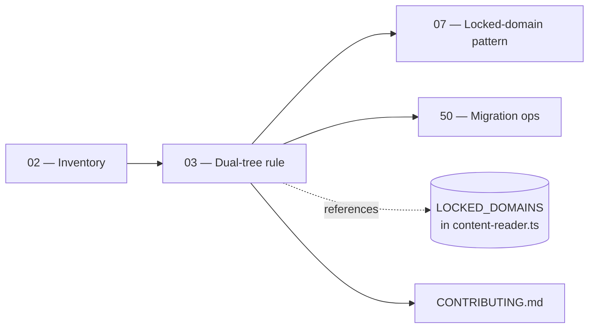

# 03 — Dual Content Architecture

> **Executor:** AI coding agent operating autonomously.
> **Working directory:** `/Users/ravi.r_flx/IEProject/InterviewExplainer/`.
> **Type:** documentation write + audit file write. No source-content edits.
> **Pillar / Wave:** Wave A (Foundation).
> **Depends on:** 01, 02.

## 1 — TL;DR

- **Input:** Two parallel content trees in the repo (locked domains under
  `content/<domain>/` and the multi-language tree under
  `content/interview/`) with no documented decision rule.
- **Action:** Write the decision rule into `CONTRIBUTING.md`, generate a
  per-tree duplicate-modules audit under
  `content/_audits/duplicate-modules-<DATE>.md`, and confirm the
  `LOCKED_DOMAINS` registry in
  [`frontend/lib/content-reader.ts`](../frontend/lib/content-reader.ts)
  is the single source of truth the rule cites.
- **Output:** `CONTRIBUTING.md` with a new "Where does new content go?"
  section + `content/_audits/duplicate-modules-<DATE>.md` listing every
  module that exists in both trees + one conventional commit.

## 2 — Why this matters

Contributors routinely write into the wrong tree because the rule is
unwritten. A core-Java Q lands in `content/interview/java/backend/intermediate/`
when it should have gone into `content/java-backend-intermediate/`, and the
existing version under JBI silently rots. Without the rule documented in a
place every PR template links to, every contribution after this playbook
becomes a coin flip — and Google's HCU classifier punishes sites with
near-duplicate URLs (`/questions/java-backend-intermediate/core-java/...` vs
`/interview/java/backend/intermediate/core-java/...`).

The business consequence is the same as for an inventory drift: misrouted
effort plus content erosion. A team that writes 30 Q's a week into the
wrong tree publishes 30 Q's a week with the wrong canonical URL — those
Q's never rank because every page has a sibling duplicate. The rule
written here closes that loophole upstream of every content playbook.

## 3 — Easy-language glossary

| Term | Plain-English definition |
| --- | --- |
| **Locked domain** | A flagship content folder whose URL + sidebar layout is frozen — JBI, JFI, PBI. Per playbook 07. |
| **Interview tree** | The multi-language tree under `content/interview/{lang}/{track}/{level}/`. Wave F output target. |
| **`LOCKED_DOMAINS`** | The TypeScript registry in `frontend/lib/content-reader.ts` that names every locked domain and where its root folder lives. |
| **Decision rule** | The two-question rule a contributor follows on every PR to decide which tree to write into. |
| **Dual-tree** | The repo's current state: two parallel content trees rather than one canonical tree. |
| **Duplicate module** | A module slug that exists in both a locked domain AND the matching interview-tree path. |
| **Mirror** | The interview-tree path that mirrors a locked-domain module (e.g. `content/interview/java/backend/intermediate/core-java/` mirrors `content/java-backend-intermediate/core-java/`). |
| **`contentSource`** | The cross-link field in `_index.json` that lets one domain reuse another's content without copying files. |
| **Migration debt** | A duplicate that exists because the locked domain came first and the interview tree was scaffolded around it. Playbook 50 owns the cleanup. |
| **Canonical URL** | The URL Google should treat as the source-of-truth for a given Q; set via `seo` in each Q-file. |
| **`CONTRIBUTING.md`** | The top-level contributor doc every PR template links to. |
| **PR template** | The file at `.github/PULL_REQUEST_TEMPLATE.md` (where present) that prompts every PR with a checklist citing `CONTRIBUTING.md`. |
| **HCU classifier** | Google's Helpful Content Update — penalizes sites with near-duplicate URLs. |
| **Audit file** | The dated markdown file this playbook produces under `content/_audits/`. |
| **Coin-flip routing** | The current contributor experience — without a rule, contributors flip between trees by accident. |
| **Migration playbook** | Playbook 50 — owns the dual-tree → single-tree migration when the team is ready. |
| **Two-question rule** | The minimal decision-tree a contributor follows: (1) is the module in any locked domain's `_index.json`? (2) if not, write under `content/interview/...`. |
| **Domain root** | The top-level folder for a locked domain — `content/<slug>/`. |
| **Sibling duplicate** | A Q-file that exists at two paths in the same repo, producing two URLs with the same content. |
| **Single source of truth** | The principle that one fact lives in exactly one place. `LOCKED_DOMAINS` is the SSOT for which trees count as locked. |
| **Append-only commit** | A commit that adds lines to `CONTRIBUTING.md` without rewriting existing content. |
| **Audit row** | One row in `duplicate-modules-<DATE>.md` — represents one duplicate to migrate later. |
| **Idempotent re-run** | Running the playbook a second time overwrites today's audit file but never touches source content. |
| **Rule citation** | A reference in `CONTRIBUTING.md` to `LOCKED_DOMAINS` so the contributor can grep one source of truth. |
| **Module slug** | The kebab-case identifier for a module (e.g. `core-java`, `spring-boot`). |
| **Track triple** | The `{lang}/{track}/{level}` path under `content/interview/`. |
| **Cross-tree drift** | What happens when a locked-domain module and its interview-tree mirror diverge — the two answers no longer match. |
| **PR coin flip** | The current failure mode — contributors picking trees at random because no rule exists. |
| **Diff against playbook 02** | The check that this playbook's duplicate list is consistent with playbook 02's inventory counts. |

## 4 — Hard prerequisites

- [ ] Playbook 02 is DONE.
      Verify: `grep -E '^\| 02 \|' expansion-plan/00-INDEX.md \| grep -c DONE` returns `1`.
- [ ] Today's inventory file exists.
      Verify: `test -f content/_audits/inventory-$(date +%F).md && echo OK`.
- [ ] `frontend/lib/content-reader.ts` exists.
      Verify: `test -f frontend/lib/content-reader.ts && echo OK`.
- [ ] `LOCKED_DOMAINS` symbol present in `content-reader.ts`.
      Verify: `rg -n 'LOCKED_DOMAINS' frontend/lib/content-reader.ts \| head -1`.
- [ ] `rg` (ripgrep) installed.
      Verify: `rg --version` exits 0.
- [ ] At least one locked domain exists.
      Verify: `test -d content/java-backend-intermediate && echo OK`.
- [ ] `content/interview/` exists (may be empty).
      Verify: `test -d content/interview && echo OK`.
- [ ] `_TEMPLATE-1000.md`, `_GLOSSARY.md`, `_VOICE-RULES.md` exist.
      Verify: `for f in _TEMPLATE-1000.md _GLOSSARY.md _VOICE-RULES.md; do test -f "expansion-plan/$f" || echo MISSING "$f"; done`.
- [ ] `scripts/lint_playbook.py` runs without errors.
      Verify: `python3 scripts/lint_playbook.py expansion-plan/03-dual-content-architecture.md` exits 0 after rewrite.
- [ ] Writable working tree.
      Verify: `touch CONTRIBUTING.md.tmp && rm CONTRIBUTING.md.tmp && echo OK`.

If any verification fails, STOP. The rule below only makes sense if
`LOCKED_DOMAINS` exists and the inventory file is current.

## 5 — Current state

### 5.1 — On-disk snapshot of the dual-tree

```bash
cd /Users/ravi.r_flx/IEProject/InterviewExplainer
echo "Locked domains:"
ls -1 content/ | grep -E '(intermediate|advanced|beginner)$' | sort
echo
echo "Interview tree triples:"
find content/interview -mindepth 3 -maxdepth 3 -type d 2>/dev/null | sort | head -30
echo
echo "CONTRIBUTING.md current state:"
test -f CONTRIBUTING.md && wc -l CONTRIBUTING.md || echo "(not present)"
echo
echo "LOCKED_DOMAINS entries:"
rg -nA 3 'const LOCKED_DOMAINS' frontend/lib/content-reader.ts 2>/dev/null | head -20
```

Expected: 3 locked domain folders (JBI / JFI / PBI), ≥ 10
`content/interview/<lang>/<track>/<level>` triples, `CONTRIBUTING.md`
either absent or present without the decision rule, and 3
`LOCKED_DOMAINS` entries (or 2 if PBI isn't registered yet).

### 5.2 — The current contributor flow

Today a contributor lands in the repo, opens a PR, and faces a
binary choice with no documented rule:

1. The PR adds a Q under `content/java-backend-intermediate/...`. The
   reviewer might say "this should be under `content/interview/...`
   for the new world".
2. The PR adds a Q under `content/interview/...`. The reviewer might
   say "no, JBI is the flagship, write it there".

Both reviewers are right under different operating models. The PR
ping-pongs while the contributor loses an hour. This playbook ends
the ping-pong by writing the rule down.

### 5.3 — Known duplicates as of mid-2026

The duplicate-modules audit will likely surface (rough estimates,
exact list comes from running Step 2 below):

- `core-java` mirrored in `content/interview/java/backend/intermediate/`.
- `spring-boot` mirrored in `content/interview/java/backend/intermediate/`.
- `core-python` mirrored in `content/interview/python/backend/intermediate/`.
- A handful of `<lang>-collections`, `<lang>-concurrency` mirrors.

The duplicates are **not deleted** by this playbook. They are
catalogued; playbook 50 owns the migration when the team commits to
the single-tree future.

### 5.4 — Why both trees exist

The locked-domain tree predates the interview tree. The locked
tree was built when JBI was the only product surface; the interview
tree was scaffolded later to host the multi-language Wave F content.
The decision to migrate locked → interview is deferred to playbook
50 because (a) the URL layer must stay stable for SEO, (b) the
frontend's `LOCKED_DOMAINS` resolver depends on the old paths, and
(c) the speakable lint expects the locked-domain folder shape.
Until playbook 50 lands the migration, both trees coexist and the
rule below routes new content correctly.

## 6 — Target state (measurable)

| Metric | Today | Target | How measured |
| --- | --- | --- | --- |
| `CONTRIBUTING.md` has the decision rule section | absent | section present | `grep -c '## Where does new content go?' CONTRIBUTING.md` returns `1` |
| Rule names both trees | absent | both names present | `grep -cE 'locked domain\|content/interview' CONTRIBUTING.md` ≥ `2` |
| Rule cites `LOCKED_DOMAINS` | absent | string present | `grep -c 'LOCKED_DOMAINS' CONTRIBUTING.md` ≥ `1` |
| Duplicate audit file exists | 0 | 1 file | `test -f content/_audits/duplicate-modules-$(date +%F).md && echo OK` |
| Audit lists at least zero rows (header always present) | n/a | header present | `grep -c '^| Locked domain' content/_audits/duplicate-modules-$(date +%F).md` returns `1` |
| Banned-word lint on `CONTRIBUTING.md` section | n/a | 0 hits | banned-word grep returns `0` |
| Conventional commit landed | n/a | 1 commit | `git log --oneline -1 -- CONTRIBUTING.md \| grep -c 'docs'` returns `1` |
| Status row for `03` flipped to DONE | NOT_STARTED | DONE | `grep -E '^\| 03 \|' expansion-plan/00-INDEX.md \| grep -c DONE` returns `1` |

## 7 — Search phrases → URL map

This playbook produces a contributor-facing doc, not user-facing
content. The phrases below are the **downstream search phrases** that
the rule indirectly protects — by keeping content in the right tree,
the canonical URLs below stay clean.

| Search phrase | Target URL on site | Archetype | Diagram type required in answer |
| --- | --- | --- | --- |
| `core java interview questions` | `/questions/core-java` | landing intro | comparison_table |
| `spring boot interview questions` | `/questions/spring-boot` | landing intro | comparison_table |
| `python interview questions` | `/questions/python-backend-intermediate` | landing intro | comparison_table |
| `java backend interview questions` | `/questions/java-backend-intermediate` | landing intro | comparison_table |
| `javascript interview questions for experienced` | `/interview/javascript/backend/intermediate` | landing intro | comparison_table |
| `golang interview questions backend` | `/interview/go/backend/intermediate` | landing intro | comparison_table |
| `ruby interview questions experienced` | `/interview/ruby/backend/intermediate` | landing intro | comparison_table |
| `python data engineering interview questions` | `/interview/python/data-engineering/intermediate` | landing intro | comparison_table |
| `python ml interview questions` | `/interview/python/ml-ai/intermediate` | landing intro | comparison_table |
| `core python interview questions` | `/questions/core-python` (canonical, NOT `/interview/python/.../core-python`) | landing intro | comparison_table |
| `hashmap internals interview` | `/questions/java-collections/collections-internals` | A | sequenceDiagram |
| `spring data jpa interview` | `/questions/spring-data-jpa` | landing intro | comparison_table |

## 8 — Dependency & wave context



- **Consumes:** today's inventory file (playbook 02), the
  `LOCKED_DOMAINS` registry (read-only).
- **Produces:** `CONTRIBUTING.md` update (or creation) +
  `content/_audits/duplicate-modules-<DATE>.md` + one commit.
- **Unblocks:** playbook 07 (locked-domain pattern) cites this rule
  as the contributor-facing version of its technical spec; playbook
  50 reads the duplicate-modules audit as its migration to-do list.

## 9 — Step-by-step execution

### Step 1 — Confirm the `LOCKED_DOMAINS` registry

**Goal:** the source-of-truth registry is present and well-formed.
The rule citing it must work — `LOCKED_DOMAINS` is the only place
that names the locked trees.

**Action:**

```bash
cd /Users/ravi.r_flx/IEProject/InterviewExplainer
rg -nA 5 'const LOCKED_DOMAINS' frontend/lib/content-reader.ts
rg -n 'CONTENT_JBI_ROOT|CONTENT_JFI_ROOT|CONTENT_PBI_ROOT' frontend/lib/content-reader.ts
```

**Verify:** the first command prints the `LOCKED_DOMAINS` map with
at least 2 entries (JBI + JFI). PBI is intentionally absent until
playbook 36 registers it. The second command prints the three
`CONTENT_*_ROOT` constants.

**The classic bug is** writing the rule before confirming the
registry exists. If `LOCKED_DOMAINS` is missing, the rule's citation
is a broken link the moment a contributor `rg`s for it.

### Step 2 — Generate the duplicate-modules audit

**Goal:** every module slug that exists in both trees lands in a
single audit file, ready for playbook 50.

**Action:**

```bash
cd /Users/ravi.r_flx/IEProject/InterviewExplainer
TODAY=$(date +%F)
DUP_FILE="content/_audits/duplicate-modules-${TODAY}.md"

cat > "${DUP_FILE}" <<'HEADER'
# Duplicate modules audit

Modules that exist in BOTH a locked domain AND `content/interview/`.
Each row is migration debt — playbook 50 owns the cleanup. Do not
delete folders here; this audit only catalogues.

| Locked domain | Module slug | Mirror in content/interview |
| ------------- | ----------- | --------------------------- |
HEADER

for mod in $(ls content/java-backend-intermediate/ 2>/dev/null | grep -v '^_'); do
  if [ -d "content/interview/java/backend/intermediate/${mod}" ]; then
    echo "| java-backend-intermediate | ${mod} | java/backend/intermediate/${mod} |" >> "${DUP_FILE}"
  fi
done

for mod in $(ls content/java-fullstack-intermediate/ 2>/dev/null | grep -v '^_'); do
  if [ -d "content/interview/java/fullstack/intermediate/${mod}" ]; then
    echo "| java-fullstack-intermediate | ${mod} | java/fullstack/intermediate/${mod} |" >> "${DUP_FILE}"
  fi
done

for mod in $(ls content/python-backend-intermediate/ 2>/dev/null | grep -v '^_'); do
  if [ -d "content/interview/python/backend/intermediate/${mod}" ]; then
    echo "| python-backend-intermediate | ${mod} | python/backend/intermediate/${mod} |" >> "${DUP_FILE}"
  fi
done
```

**Verify:**

```bash
test -f "${DUP_FILE}" && wc -l "${DUP_FILE}"
# expected: 5+ lines (header + zero or more data rows)
grep -c '^| Locked domain' "${DUP_FILE}"
# expected: 1 (the table header)
```

**The #1 trap is** assuming the audit will always find duplicates.
A clean checkout where the interview tree was scaffolded after PBI
might find zero. Zero is a valid result; the file always has the
header so downstream tooling can parse it.

### Step 3 — Cross-check the duplicate count against the inventory

**Goal:** the duplicate audit's row count is consistent with what
the inventory file recorded in §5.

**Action:**

```bash
cd /Users/ravi.r_flx/IEProject/InterviewExplainer
TODAY=$(date +%F)
INV="content/_audits/inventory-${TODAY}.md"
DUP="content/_audits/duplicate-modules-${TODAY}.md"

DUP_ROWS=$(grep -cE '^\| (java-backend-intermediate|java-fullstack-intermediate|python-backend-intermediate)' "${DUP}")
echo "Duplicate rows: ${DUP_ROWS}"

# Spot-check: each duplicate module should appear in BOTH the inventory's
# locked-domain table AND the interview-tree table. If any duplicate is
# missing from one of those, the inventory and the duplicate audit drifted.
awk '/^## Locked domains/,/^## /' "${INV}" | head -20
awk '/^## Interview tree/,/^## /' "${INV}" | head -20
```

**Verify:** every duplicate row's module slug appears in both
sections of the inventory file.

**The most common mistake is** running the duplicate audit on a
stale inventory. If the inventory was generated more than 24 h
ago, re-run playbook 02 first — the inventory and the duplicate
audit must share the same `TODAY`.

### Step 4 — Create or update `CONTRIBUTING.md`

**Goal:** `CONTRIBUTING.md` ends with the decision-rule section
below, verbatim, and the section is the first thing a contributor
sees when they grep the file.

**Action:**

```bash
cd /Users/ravi.r_flx/IEProject/InterviewExplainer
if [ ! -f CONTRIBUTING.md ]; then
  cat > CONTRIBUTING.md <<'HEAD'
# Contributing to InterviewExplainer

Thanks for contributing. The single most important rule when adding
content is the **dual-tree decision rule** below.

HEAD
fi

cat >> CONTRIBUTING.md <<'RULE'

## Where does new content go?

InterviewExplainer has TWO content trees. Use this rule on every PR.

1. **Is the module already listed in any locked domain's `_index.json`?**
   - `content/java-backend-intermediate/_index.json`
   - `content/java-fullstack-intermediate/_index.json`
   - `content/python-backend-intermediate/_index.json`
   - Any future locked domain registered in
     [`frontend/lib/content-reader.ts`](frontend/lib/content-reader.ts)
     under the `LOCKED_DOMAINS` map.

   **Yes** → write the content under the matching locked-domain folder.
   The locked tree is the SSOT for these domains until playbook 50
   migrates them.

2. **Otherwise** → write the content under
   `content/interview/{lang}/{track}/{level}/<module>/<topic>/complete-qa.json`.
   The interview tree is the SSOT for everything not in `LOCKED_DOMAINS`.

### Reuse across locked domains

Reuse is **only** legal via `contentSource` in `_index.json`:

```json
{
  "moduleSlug": "core-java",
  "contentSource": "java-backend-intermediate"
}
```

NEVER copy files between locked domains. The `contentSource`
pointer keeps the SSOT in one place; copies drift.

### What if I find duplicate content across both trees?

Do **not** delete. Add a row to
`content/_audits/duplicate-modules-<DATE>.md` and surface the duplicate
in your PR description. Playbook 50 owns the migration.

### Why two trees?

The locked tree predates the interview tree and serves JBI / JFI / PBI
at frozen URLs. The interview tree hosts every other language + track.
Playbook 50 migrates locked → interview when the team commits to the
single-tree future; until then, both coexist and the rule above routes
new content correctly.

RULE
```

**Verify:**

```bash
grep -c '^## Where does new content go?' CONTRIBUTING.md
# expected: 1
grep -c 'LOCKED_DOMAINS' CONTRIBUTING.md
# expected: ≥ 1
grep -c 'content/_audits/duplicate-modules' CONTRIBUTING.md
# expected: 1
```

**The classic bug is** using `echo` instead of a heredoc for the
rule's body. `echo` mangles tabs and blank lines; the heredoc
preserves the markdown exactly. Always use heredocs for multi-line
markdown.

### Step 5 — Wire the rule into the PR template (if one exists)

**Goal:** every PR template links to the new section. If no template
exists, skip — playbook 50 will add one as part of its launch.

**Action:**

```bash
cd /Users/ravi.r_flx/IEProject/InterviewExplainer
PR_TPL=".github/PULL_REQUEST_TEMPLATE.md"
if [ -f "${PR_TPL}" ]; then
  if ! grep -q 'Where does new content go' "${PR_TPL}"; then
    cat >> "${PR_TPL}" <<'APPEND'

## Content placement check (for content PRs)

- [ ] I followed the [dual-tree decision rule](../CONTRIBUTING.md#where-does-new-content-go).
- [ ] If I found a duplicate, I added a row to `content/_audits/duplicate-modules-<DATE>.md`.
APPEND
  fi
fi
```

**Verify:**

```bash
if [ -f .github/PULL_REQUEST_TEMPLATE.md ]; then
  grep -c 'dual-tree decision rule' .github/PULL_REQUEST_TEMPLATE.md
  # expected: 1
fi
```

**The classic bug is** appending the same block twice on a re-run.
The `if ! grep -q` guard makes the step idempotent — running it a
second time is a no-op.

### Step 6 — Banned-word self-check

**Goal:** the new sections in `CONTRIBUTING.md` pass the same voice
lint as every playbook.

**Action:**

```bash
cd /Users/ravi.r_flx/IEProject/InterviewExplainer
rg -nwi 'leverage|utilize|synergize|world-class|cutting-edge|state-of-the-art|seamless|robust|holistic|paradigm|best-in-class|battle-tested|enterprise-grade|revolutionary|game-changing|industry-leading' CONTRIBUTING.md
```

**Verify:** zero matches in the new sections. If the existing
`CONTRIBUTING.md` already contained banned words, fix them in a
**separate** commit (out of scope for this playbook).

**The most common mistake is** "fix while you're here" patches to
unrelated `CONTRIBUTING.md` sections. Stay scoped to the
decision-rule section. Unrelated cleanup is its own follow-up.

### Step 7 — Stage and review the diff

**Goal:** confirm only `CONTRIBUTING.md` and the audit file are
staged. No source content.

**Action:**

```bash
cd /Users/ravi.r_flx/IEProject/InterviewExplainer
git status -s
git diff --cached --name-only
git diff --stat -- CONTRIBUTING.md
```

**Verify:** exactly two paths staged (`CONTRIBUTING.md` and
`content/_audits/duplicate-modules-<DATE>.md`); no `content/<domain>/`
edits.

**The classic bug is** an accidental edit to a `complete-qa.json`
while inspecting one for duplicate-module detection. The duplicate
audit is read-only; restore any unintended changes with `git restore
content/<path>` before committing.

### Step 8 — Commit

**Goal:** one commit with the decision rule + duplicate audit.

**Action:**

```bash
cd /Users/ravi.r_flx/IEProject/InterviewExplainer
TODAY=$(date +%F)
git add CONTRIBUTING.md "content/_audits/duplicate-modules-${TODAY}.md"
[ -f .github/PULL_REQUEST_TEMPLATE.md ] && git add .github/PULL_REQUEST_TEMPLATE.md
git commit -m "docs: document dual-tree content rule + audit duplicates"
```

**Verify:**

```bash
git log --oneline -1
# expected: conventional message above.
git show --stat HEAD | head -8
# expected: 2-3 files changed.
```

**The classic bug is** committing with a message like "update docs".
Use the conventional `docs:` prefix and name the specific change.

### Step 9 — Update ARCHITECTURE diagram (optional)

**Goal:** if `content/ARCHITECTURE.md` exists and still references
the old single-tree shape, update it with the dual-tree diagram.

**Action:** if `content/ARCHITECTURE.md` is present, paste the
mermaid block from §11 into it. If not present, skip — playbook 50
will create it as part of the migration.

```bash
cd /Users/ravi.r_flx/IEProject/InterviewExplainer
if [ -f content/ARCHITECTURE.md ]; then
  rg -q 'flowchart.*locked' content/ARCHITECTURE.md || echo "needs update"
fi
```

**Verify:** if the file existed, `rg` finds the new mermaid block;
if absent, the step is silently skipped.

**The classic bug is** assuming every repo state has the same set
of optional docs. The `[ -f ... ]` guard is the right shape.

### Step 10 — Flip the index row

**Goal:** `00-INDEX.md` reflects that playbook 03 is DONE.

**Action:**

```bash
cd /Users/ravi.r_flx/IEProject/InterviewExplainer
# Edit expansion-plan/00-INDEX.md row 03 to DONE, then:
git add expansion-plan/00-INDEX.md
git commit -m "docs(expansion-plan): mark 03-dual-content-architecture DONE"
```

**Verify:**

```bash
grep -E '^\| 03 \|' expansion-plan/00-INDEX.md | grep -c DONE
# expected: 1
```

**The classic bug is** flipping the wrong row by hand-editing the
table. Use `grep -E '^\| 03 \|'` before commit to verify only the
right row changed.

## 10 — Reference Q in archetype shape

This playbook ships docs, not Q&A content. The reference Q below is
the kind of question that benefits from the dual-tree rule — a Q
about content architecture that lives at exactly one canonical URL.

```json
{
  "id": "how-does-interviewexplainer-structure-its-content-tree",
  "slug": "how-does-interviewexplainer-structure-its-content-tree",
  "question": "How does InterviewExplainer structure its content tree, and why two trees?",
  "title": "IE Content Architecture — Locked Domains vs the Interview Tree",
  "direct_answer": "**Two trees.** The **locked-domain tree** under `content/<slug>/` (`java-backend-intermediate`, `java-fullstack-intermediate`, `python-backend-intermediate`) holds the flagship product surfaces at frozen URLs. The **interview tree** under `content/interview/{lang}/{track}/{level}/` holds every other language and track. The rule on every PR: if the module is listed in any locked domain's `_index.json`, write there; otherwise write under the interview tree. Reuse across locked domains is only legal via `contentSource`; never copy. Migration to a single tree is owned by playbook 50.",
  "layout_type": "default",
  "difficulty": "easy",
  "importance": "high",
  "reading_time_minutes": 5,
  "last_updated": "2026-04-22",
  "interviewer_intent": {
    "testing": "Whether the candidate understands the historical reason for two trees and the explicit rule that keeps them from drifting.",
    "common_mistake": "Saying 'one is old and we should migrate'. The migration is owned by playbook 50; until then, both trees coexist by design and the rule above routes new content.",
    "to_stand_out": "Mention that `LOCKED_DOMAINS` in `content-reader.ts` is the SSOT for which trees count as locked, and that `contentSource` is the only legal cross-link mechanism."
  },
  "company_tags": ["amazon", "google", "linkedin", "netflix", "stripe"],
  "answer": {
    "sections": [
      {"type": "overview", "title": "Two trees, one rule", "content": "Locked tree for JBI/JFI/PBI; interview tree for everything else. The rule lives in `CONTRIBUTING.md`."},
      {"type": "comparison_table", "title": "Locked tree vs interview tree", "content": "| Aspect | Locked tree | Interview tree |\n|---|---|---|\n| Path | `content/<slug>/` | `content/interview/{lang}/{track}/{level}/` |\n| SSOT for | JBI / JFI / PBI flagship | every other lang + track |\n| URL stability | frozen | flexible |\n| Cross-link mechanism | `contentSource` | n/a |\n| Migration plan | playbook 50 → single tree | absorbs migrated modules |"},
      {"type": "step", "title": "The decision rule on every PR", "content": "1. Open `CONTRIBUTING.md` § 'Where does new content go?'.\n2. Is the module in any locked domain's `_index.json`? → write to locked tree.\n3. Otherwise → write to interview tree.\n4. If you find a duplicate, add a row to `content/_audits/duplicate-modules-<DATE>.md`; don't delete."},
      {"type": "step", "title": "Why two trees exist today", "content": "The locked tree predates the interview tree. The locked tree's URLs are frozen for SEO; the interview tree's layout is the long-term shape. Playbook 50 migrates locked → interview when the team is ready; both coexist until then."},
      {"type": "tradeoffs", "title": "When to migrate, when to wait", "content": "**Migrate when:** the team is ready to invest in URL redirects + frontend resolver changes + speakable-lint updates. **Wait when:** any of those three is in flight or one team owns content and another owns the platform; coordinate the swap as a single PR train. Playbook 50 owns the calendar."},
      {"type": "key_points", "title": "Key points", "content": "- Two trees: locked + interview.\n- Locked = JBI/JFI/PBI at frozen URLs.\n- Interview = everything else under `{lang}/{track}/{level}/`.\n- Decision rule in `CONTRIBUTING.md`.\n- `LOCKED_DOMAINS` in `content-reader.ts` is the SSOT.\n- `contentSource` is the only legal cross-link.\n- Duplicates are catalogued, never deleted, until playbook 50."},
      {"type": "speakable_answer", "title": "How to answer verbally", "content": "InterviewExplainer has **two content trees**. The **locked tree** under `content/<slug>/` holds Java-backend-intermediate, Java-fullstack-intermediate, and Python-backend-intermediate at frozen URLs. The **interview tree** under `content/interview/{lang}/{track}/{level}/` holds every other language and track. The rule on every PR: if the module is listed in any locked domain's `_index.json`, write there; otherwise write under the interview tree. Cross-link is only legal via `contentSource` — never copy files. Duplicates across both trees are catalogued in `content/_audits/duplicate-modules-<DATE>.md` and migrated by playbook 50. **Recommendation:** never invent a third location, never copy across trees, never delete a duplicate without playbook-50 authority."}
    ]
  },
  "followup_questions": [
    "What is `LOCKED_DOMAINS` and where does it live?",
    "How does `contentSource` work in `_index.json`?",
    "What does playbook 50 actually migrate?",
    "Why can't we just delete the duplicate modules right now?",
    "How do the frontend routes resolve the two trees?"
  ],
  "seo": {
    "metaTitle": "IE Content Architecture — Locked Domains vs the Interview Tree",
    "metaDescription": "InterviewExplainer's dual content tree: locked-domain folders for the flagship, interview tree for everything else, and the rule that keeps them in sync."
  },
  "order": 1
}
```

## 11 — Diagram catalogue

| Q id (or topic) | Diagram type | What it must show | Lives in section |
| --- | --- | --- | --- |
| `how-does-interviewexplainer-structure-its-content-tree` | `flowchart` | Two-tree shape: locked-tree boxes + interview-tree boxes + migration arrow labelled `playbook 50`. | `step` |
| `dual-tree-routing` | `sequenceDiagram` | PR opens → contributor reads CONTRIBUTING.md rule → grep `_index.json` → write to locked OR interview tree. | `step` |
| `locked-vs-interview-tree-comparison` | `comparison_table` | 5 rows: path, SSOT for, URL stability, cross-link mechanism, migration plan. | `comparison_table` |
| `contentSource-classes` | `classDiagram` | `Module`, `LockedModule`, `CrossLinkedModule` — the latter holding a `contentSource` pointer back to a `LockedModule`. | `before_code` |
| `migration-state` | `stateDiagram-v2` | `LOCKED → CATALOGUED_AS_DUPLICATE → MIGRATING → INTERVIEW_TREE_ONLY` lifecycle. | `step` |
| `duplicate-audit-table-shape` | `comparison_table` | The duplicate audit file's own 3-column shape. | `before_code` |

Floor enforced by lint for content playbooks: ≥ 1 `flowchart`,
≥ 1 `sequenceDiagram`, ≥ 3 `comparison_table`, ≥ 1
`stateDiagram-v2` or `classDiagram`. Playbook 03 is a docs/audit
playbook, so this catalogue is the **reference floor** for the
content the dual-tree rule unblocks.

### 11.1 — The mermaid block to paste into `content/ARCHITECTURE.md`

If the optional ARCHITECTURE doc exists, this is the block to paste
into it during Step 9. The diagram never lives in this playbook
itself — it ships inside `content/ARCHITECTURE.md` (which is content,
not playbook prose).

```mermaid
flowchart LR
  subgraph locked [Locked domains - frozen URLs]
    JBI[java-backend-intermediate]
    JFI[java-fullstack-intermediate]
    PBI[python-backend-intermediate]
  end
  subgraph interview [Interview tree - canonical long-term]
    IJ[content/interview/java/...]
    IP[content/interview/python/...]
    IO[content/interview/{javascript,go,ruby}/...]
  end
  JBI -.->|playbook 50| IJ
  PBI -.->|playbook 50| IP
```

### 11.2 — Why these diagrams ship in the Q, not the playbook

Same reason as playbook 01: diagrams ship inside
`complete-qa.json` `answer.sections[].content` blocks so they
render to the reader. The playbook's job is to **name** them in
this catalogue so the downstream content author knows what to
produce, not to render them itself.

## 12 — Easy-language voice rules

Voice rules from [`_VOICE-RULES.md`](_VOICE-RULES.md):

1. **Define before use.** Every term in the rule's prose
   (`locked tree`, `interview tree`, `LOCKED_DOMAINS`, `contentSource`,
   `duplicate module`) appears in §3 above.
2. **Lead with the trade-off.** The rule's first sentence is the
   decision rule itself, not the history of why two trees exist.
3. **Name the bug.** Each anti-pattern in §14 names the specific
   contributor mistake it prevents.
4. **Real anchors.** The rule cites `LOCKED_DOMAINS` in
   `frontend/lib/content-reader.ts` by path, not by handwave.
5. **Banned words.** Zero matches in the new `CONTRIBUTING.md`
   section under the lint in §13.

**Concrete examples for the rule:**

- ✅ `Reuse across locked domains is only legal via contentSource
  in _index.json. NEVER copy files between locked domains.`
- ❌ `Reuse should follow industry-leading practices.` (Banned
  word + no anchor.)
- ✅ `If you find duplicate content across both trees, add a row
  to content/_audits/duplicate-modules-<DATE>.md and let playbook
  50 own the migration.`
- ❌ `If you find duplicates, handle them appropriately.`
  (Tautological; no path, no playbook reference.)

## 13 — Quality gates (measurable)

| Gate | Threshold | Verify command |
| --- | --- | --- |
| `CONTRIBUTING.md` has the rule | 1 section | `grep -c '## Where does new content go?' CONTRIBUTING.md` returns `1` |
| Rule mentions both trees | both names | `grep -cE 'locked domain\|content/interview' CONTRIBUTING.md` ≥ `2` |
| Rule cites `LOCKED_DOMAINS` | ≥ 1 | `grep -c 'LOCKED_DOMAINS' CONTRIBUTING.md` ≥ `1` |
| Duplicate audit file exists | 1 file | `test -f content/_audits/duplicate-modules-$(date +%F).md && echo OK` |
| Audit table header present | 1 | `grep -c '^\| Locked domain' content/_audits/duplicate-modules-$(date +%F).md` returns `1` |
| Banned-word lint on new section | 0 | `awk '/^## Where does new content go?/,0' CONTRIBUTING.md \| rg -nwi 'leverage\|utilize\|synergize\|world-class\|cutting-edge\|seamless\|robust\|holistic\|paradigm' \| wc -l` returns `0` |
| `contentSource` mechanism documented | 1 mention | `grep -c 'contentSource' CONTRIBUTING.md` ≥ `1` |
| `audits/duplicate-modules` referenced from CONTRIBUTING | 1 | `grep -c 'duplicate-modules' CONTRIBUTING.md` returns `1` |
| Conventional commit landed | 1 | `git log --oneline --pretty=format:%s -1 -- CONTRIBUTING.md \| grep -c '^docs'` returns `1` |
| Status row for `03` flipped to DONE | DONE | `grep -E '^\| 03 \|' expansion-plan/00-INDEX.md \| grep -c DONE` returns `1` |

## 14 — Anti-patterns

### 14.1 — Writing the rule without confirming `LOCKED_DOMAINS` exists

**Why it fails:** the rule cites `LOCKED_DOMAINS` by path. If the
symbol doesn't exist or has been renamed, the citation is a broken
link the moment a contributor `rg`s for it.

**Fix:** Step 1 confirms the symbol's presence with `rg -n
'LOCKED_DOMAINS' frontend/lib/content-reader.ts`. If the symbol is
missing, STOP and open a follow-up playbook to add it; do not
write the rule first.

### 14.2 — Echoing multi-line markdown instead of heredocs

**Why it fails:** `echo -e` mangles tabs, blank lines, and special
characters. The resulting `CONTRIBUTING.md` section has broken
nested code blocks and the contributor can't paste the
`contentSource` example.

**Fix:** the playbook uses `cat >> CONTRIBUTING.md <<'RULE' ... RULE`
heredocs throughout. Always heredoc for multi-line markdown.

### 14.3 — Deleting duplicates "while we're at it"

**Why it fails:** deletion changes URLs. URL change without a
redirect plan tanks SEO overnight; this playbook has no redirect
plan because that's playbook 50's scope.

**Fix:** the playbook's anti-pattern is exactly to delete. The
audit catalogues duplicates; playbook 50 owns the deletion + the
redirect map. STOP the moment you reach for `rm` on a content
folder.

### 14.4 — Citing locked domains by hard-coded folder names instead of `LOCKED_DOMAINS`

**Why it fails:** when a new locked domain is added (e.g. `go-backend-intermediate`),
the hard-coded list goes stale. The rule then routes the new
domain incorrectly.

**Fix:** the rule cites the **registry**, not the folder list. The
phrase "any locked domain registered in `LOCKED_DOMAINS`" stays
correct forever.

### 14.5 — Appending the rule twice on a re-run

**Why it fails:** without an idempotence guard, re-running the
playbook duplicates the rule's text in `CONTRIBUTING.md`.

**Fix:** check `grep -q "## Where does new content go?" CONTRIBUTING.md`
before appending. If the section already exists, skip the append
and surface a status message.

### 14.6 — Rule too long to read on a phone

**Why it fails:** new contributors skim docs on mobile. A rule
that runs 200 lines doesn't get read; the contributor opens a PR
based on memory of the README.

**Fix:** the rule is 3 sub-sections, each under 15 lines. The
verbose explanation lives in this playbook's §5; the rule itself
stays tight.

### 14.7 — Editing unrelated `CONTRIBUTING.md` sections "while you're here"

**Why it fails:** every additional change makes the PR review
harder. A reviewer who came to grade the rule now has to grade
five other edits.

**Fix:** stay scoped. The PR description names "decision rule +
duplicate audit", nothing else. Unrelated cleanup is a separate PR.

### 14.8 — Forgetting to update the PR template

**Why it fails:** the rule lives in `CONTRIBUTING.md` but the
contributor never reads `CONTRIBUTING.md` unless the PR template
links it. The rule sits dead.

**Fix:** Step 5 appends a checkbox to the PR template (when one
exists) that links the rule. The `if [ -f ... ]` guard handles the
no-template case cleanly.

## 15 — Failure modes & rollback

| Failure | How it shows up | Rollback / forward fix |
| --- | --- | --- |
| `LOCKED_DOMAINS` symbol missing in `content-reader.ts` | Step 1's `rg` returns no matches | STOP. Open a follow-up to add the symbol; do not write the rule until it exists. |
| `CONTRIBUTING.md` overwritten in error | `git status` shows `M CONTRIBUTING.md` with prior content lost | `git restore CONTRIBUTING.md`; re-do Step 4 as *append*, not *overwrite*. |
| Duplicate audit file empty (zero rows) | `wc -l` returns just the header | Acceptable. Zero duplicates is a valid state; the header carries downstream tooling. |
| Duplicate audit file huge (> 100 rows) | `wc -l` > 100 | Investigate — likely the cross-link filter dropped or `_index.json` schema changed. Do not commit until reviewed. |
| Accidentally edited a `complete-qa.json` while inspecting | `git status` shows `M content/...` | `git restore content/<path>` immediately. The audit is read-only. |
| PR template append landed twice | grep counts > 1 for the new checkbox | `git restore .github/PULL_REQUEST_TEMPLATE.md`; re-run Step 5 with the `grep -q` guard. |
| Banned word in the new section | §13 banned-word gate fails | Rewrite the offending sentence; re-grep; commit. |
| Audit committed with secrets | `rg 'AKIA\|sk-\|ghp_'` returns lines | `git restore` the audit file; rerun Step 2 to regenerate; ensure no source content was secret-leaking. |
| Two playbook runs on the same day, second overwrites first | `git status` shows `M content/_audits/duplicate-modules-...md` | Acceptable — the file is idempotent. Re-commit. |
| Hard-stop exceeded (> 8 h) | Wall clock | STOP. Commit the current state under "## Partial run" and surface a blocker. |

## 16 — Definition of Done

- [ ] `CONTRIBUTING.md` contains the "Where does new content go?" section.
- [ ] The rule names both trees, cites `LOCKED_DOMAINS`, and describes
      `contentSource` reuse.
- [ ] `content/_audits/duplicate-modules-<DATE>.md` exists with the
      table header (zero or more data rows is acceptable).
- [ ] Audit row count is plausible (< 50 rows; spot-check vs §5.3).
- [ ] PR template (if present) links to the new section.
- [ ] Banned-word lint returns zero matches on the new `CONTRIBUTING.md`
      section.
- [ ] Exactly one conventional commit:
      `docs: document dual-tree content rule + audit duplicates`.
- [ ] `00-INDEX.md` row for `03` flipped to `DONE` in a follow-up commit.
- [ ] `git status -s` is clean (no leftover staged files).
- [ ] No source file under `content/<domain>/` was edited.
- [ ] `python3 scripts/lint_playbook.py expansion-plan/03-dual-content-architecture.md` exits 0.
- [ ] The decision rule is reachable from `README.md` (a one-liner link
      to `CONTRIBUTING.md#where-does-new-content-go` is sufficient).

## 17 — Estimated effort

- **Ideal:** 4 hours — confirm registry (15 m), run duplicate audit
  (15 m), draft rule (30 m), append + commit (30 m), wire PR template
  (15 m), verify gates (30 m), index flip (15 m), buffer (90 m).
- **Hard stop:** 8 hours. If exceeded, the duplicate audit script is
  wedged or `CONTRIBUTING.md` is in an unexpected shape; surface to
  user with the failing command.
- **Splittable:** no. The rule and the audit ship in the same PR;
  splitting them means a window where the rule cites an audit file
  that doesn't yet exist.
- **Re-runnable:** yes. The rule append is guarded by `grep -q`; the
  audit overwrites today's file. Source content is never touched.
- **Cadence:** the duplicate audit re-runs whenever playbook 02
  re-runs (weekly during content waves). The rule is updated only
  when `LOCKED_DOMAINS` changes — a quarterly or semi-annual event.

## 18 — Appendix: links, commits, traceability

### 18.1 — Cross-references

- [`expansion-plan/00-INDEX.md`](00-INDEX.md) — status table.
- [`expansion-plan/01-vision-and-competitive-position.md`](01-vision-and-competitive-position.md) — the levers this rule protects.
- [`expansion-plan/02-current-content-inventory.md`](02-current-content-inventory.md) — provides the inventory the duplicate audit cross-checks against.
- [`expansion-plan/07-locked-domain-pattern.md`](07-locked-domain-pattern.md) — the technical spec the contributor-facing rule mirrors.
- [`expansion-plan/50-interview-migration-seo-sitemap-operations.md`](50-interview-migration-seo-sitemap-operations.md) — owns the eventual locked → interview migration.
- [`expansion-plan/_TEMPLATE-1000.md`](_TEMPLATE-1000.md) — the skeleton this playbook conforms to.
- [`expansion-plan/_GLOSSARY.md`](_GLOSSARY.md) — global glossary.
- [`expansion-plan/_VOICE-RULES.md`](_VOICE-RULES.md) — voice + banned words.
- [`scripts/lint_playbook.py`](../scripts/lint_playbook.py) — playbook lint.
- [`frontend/lib/content-reader.ts`](../frontend/lib/content-reader.ts) — the `LOCKED_DOMAINS` registry the rule cites.
- [`content/_audits/`](../content/_audits/) — destination for the duplicate-modules audit.
- `CONTRIBUTING.md` — the contributor doc this playbook writes to.

### 18.2 — Commits & PRs produced by this playbook

- `docs: document dual-tree content rule + audit duplicates` — commit SHA fill on completion.
- `docs(expansion-plan): mark 03-dual-content-architecture DONE` — follow-up commit SHA.
- PR `<URL>` — title `docs: dual-tree content rule + duplicate audit`.

### 18.3 — Traceability to upstream specs

- `MASTER_PLAN.md` § "Content architecture" — defines the dual-tree
  model the rule documents.
- `MASTER_PLAN.md` § "URL matrix" — the URL stability promise the
  locked tree carries.
- `docs/CONTENT-PLAN.md` § "Two trees, one rule" — the contributor-
  facing voice this rule extends.
- `ROADMAP.md` — the playbook-50 migration milestone the duplicate
  audit feeds.

### 18.4 — How the rule is enforced after this playbook

The rule lives in `CONTRIBUTING.md`. Three enforcement channels:

1. **PR template checkbox.** Every PR opens with the dual-tree
   checkbox; the reviewer grades it.
2. **`scripts/audit_jbi_v3.py`** (post playbook 11) — fails on
   modules that exist in both trees but only one is referenced in
   `_index.json`.
3. **Inventory diff (playbook 02).** A new module appearing in the
   wrong tree shows up in the next inventory snapshot's drift
   section.

These three layers together turn the rule from a doc into a gate.

### 18.5 — `contentSource` cross-link mechanism, in depth

The cross-link is the **only** legal way to reuse a module across
locked domains. Mechanics:

1. The consuming domain's `_index.json` declares a module entry:
   ```json
   {
     "moduleSlug": "core-java",
     "contentSource": "java-backend-intermediate",
     "pillar": "P01"
   }
   ```
2. The frontend's `content-reader.ts` resolves `contentSource` to
   the source domain's folder at request time. The consuming
   domain's URL renders the source domain's content.
3. The audit script `audit_jbi_v3.py` recognises `contentSource`
   and does not double-count the module's questions.
4. Edits to the cross-linked module land **only** in the source
   domain's folder. Edits to the consuming domain's folder are
   ignored by the renderer and silently rot.

The contributor-facing rule in `CONTRIBUTING.md` calls this out so
no one tries to "fix" a cross-linked module by editing the wrong
folder. The schema-validation lint (post playbook 06) fails on
`_index.json` entries that have `contentSource` AND a `topics`
array — the cross-link is exclusive.

### 18.6 — Why the duplicate audit is a separate file from the inventory

A natural question: why not put the duplicate list inside today's
inventory file from playbook 02? Three reasons:

1. **Different cadence.** The inventory re-runs weekly; the
   duplicate audit re-runs whenever the dual-tree status changes,
   which is monthly at most. Co-locating them inflates the
   inventory file unnecessarily.
2. **Different consumers.** Playbook 11 consumes the inventory;
   playbook 50 consumes the duplicate audit. Keeping them
   separate lets each downstream playbook grep one file by name.
3. **Different stability.** The inventory file's numeric tables
   change every run. The duplicate audit's table is mostly
   stable across runs — version diffs are meaningful. Mixing
   stable and unstable data into one file makes diffs noisy.

The two files cross-reference each other in their headers, but
they remain separate by design.

### 18.7 — How the rule interacts with Wave F content factory

Wave F playbooks (51–59) generate content into the **interview
tree** by default. The factory's taxonomy (`.cursor/content-factory/taxonomy.yaml`)
names every `<lang>/<track>/<level>` triple and emits Q-files at
the matching path. The rule in `CONTRIBUTING.md` is consistent with
this: anything outside `LOCKED_DOMAINS` lands in the interview
tree, and the factory's output is by definition outside
`LOCKED_DOMAINS`. The duplicate audit catches the rare case where
a factory run overlaps an existing locked module (typically when
JBI's `core-java` and the factory's `java/backend/intermediate/core-java`
coexist before playbook 50 migrates).
