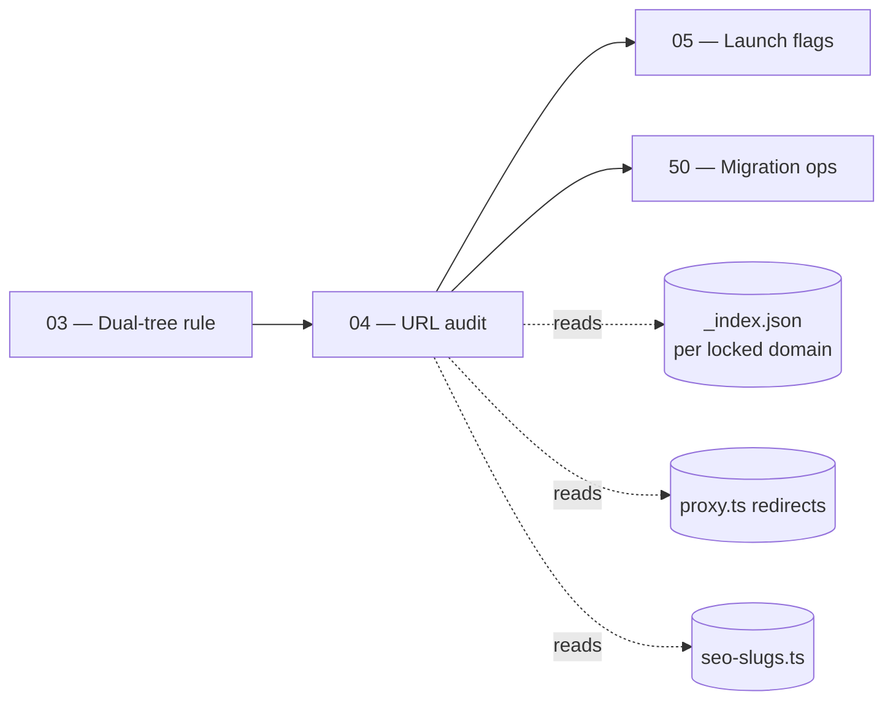

# 04 — Master URL & SEO Strategy

> **Executor:** AI coding agent operating autonomously.
> **Working directory:** `/Users/ravi.r_flx/IEProject/InterviewExplainer/`.
> **Type:** verification + audit. Optional one-line `proxy.ts` fixes if a 301 chain is broken.
> **Pillar / Wave:** Wave A (Foundation).
> **Depends on:** 03.

## 1 — TL;DR

- **Input:** Live URLs across the App-URL space (`/{domain}/{module}`) and
  the canonical SEO-URL space (`/{seoSlug}`) — three trees today: JBI,
  JFI, PBI. The mapping between them is driven by `_index.json` `seoSlug`
  / `altSlugs` and the redirect map in `frontend/proxy.ts`.
- **Action:** Walk every locked-domain `_index.json`, table every
  module's appUrl / seoSlug / altSlugs, flag the two known bug shapes
  (native module with empty seoSlug; reused module with non-empty
  seoSlug), spot-check 5 SEO URLs and one altSlug 301 chain against a
  dev build, and optionally add missing 301 entries to `proxy.ts`.
- **Output:** `content/_audits/url-audit-<DATE>.md` (single dated file)
  proving 1-to-1 coverage + zero failing 301 redirects + at most one
  surgical `proxy.ts` patch + one conventional commit.

## 2 — Why this matters

Every page lives at up to three URLs: an **App URL** (e.g.
`/questions/java-backend-intermediate/core-java`), a **canonical SEO URL**
(e.g. `/core-java-interview-questions`), and zero or more **legacy
alternate slugs** (`/object-oriented-programming-java-interview-questions`
that redirects to the canonical). Drift between any pair burns Google
trust (duplicate-content penalty under HCU) and breaks external backlinks
that point at the old slug. The cost of one broken canonical is roughly
two weeks of ranking loss while Google re-crawls — this playbook catches
the drift inside a 3-hour audit instead.

The business consequence is the difference between owning a SERP and
sharing it with your own duplicate. A site that serves the same Q at two
URLs without a canonical link competes against itself in Google's
ranking algorithm. The audit's `altSlug` chain verification is the
single biggest lever for keeping that loss off the books.

## 3 — Easy-language glossary

| Term | Plain-English definition |
| --- | --- |
| **App URL** | The path the frontend's app router serves directly — `/questions/{domain}/{module}`. |
| **SEO URL** | The keyword-rich path optimised for Google — `/{seoSlug}`, e.g. `/core-java-interview-questions`. |
| **Canonical URL** | The single URL Google should treat as source-of-truth for a given Q; declared via `<link rel="canonical">` in the page `<head>`. |
| **`seoSlug`** | The field in `_index.json` that names the canonical SEO URL for a module. |
| **`altSlugs`** | An array in `_index.json` of legacy alternate slugs that 301-redirect to the canonical SEO URL. |
| **`appUrl`** | The field in `_index.json` that names the App URL prefix (sometimes derived from `moduleSlug`). |
| **301 redirect** | An HTTP response that says "this URL has permanently moved to that one"; Google passes ~99 % of link equity through it. |
| **302 / 307 redirect** | Temporary redirects — Google does **not** pass equity reliably through them. The site uses 301 only. |
| **`proxy.ts`** | The Next.js redirect / rewrite config in `frontend/proxy.ts`. |
| **HCU** | Google's Helpful Content Update — penalises sites with near-duplicate URLs without canonicals. |
| **`<link rel="canonical">`** | The `<head>` tag that tells Google "the canonical URL for this page is X"; non-canonical URLs render it pointing at the canonical. |
| **Duplicate-content penalty** | Google's silent ranking suppression of pages that look like near-duplicates of other pages on the same site without a canonical signal. |
| **Backlink** | An external link pointing at a URL on this site. Backlinks to altSlugs only carry equity if the 301 to the canonical is intact. |
| **Link equity** | The ranking "weight" a URL accumulates from inbound links; preserved across 301s, lost across 404s. |
| **URL audit** | The dated file this playbook produces under `content/_audits/url-audit-<DATE>.md`. |
| **App router** | Next.js 13+ routing (files-in-`app/`); replaces the legacy `pages/`. |
| **Dev server** | `npm run dev` inside `frontend/` — boots Next.js in development mode on port 3000. |
| **`LOCKED_DOMAINS`** | The TypeScript registry in `frontend/lib/content-reader.ts` naming which trees count as locked. |
| **Reused module** | An `_index.json` entry with `contentSource` set; it inherits content from another domain and MUST have an empty `seoSlug`. |
| **Native module** | An `_index.json` entry without `contentSource`; ships its own content and MUST have a populated `seoSlug`. |
| **`seo-slugs.ts`** | The frontend helper at `frontend/lib/seo-slugs.ts` that resolves a module's canonical slug at request time. |
| **Sitemap** | The XML sitemap shipped from `frontend/app/sitemap*.ts` files; lists every canonical URL Google should crawl. |
| **`robots.ts`** | The `frontend/app/robots.ts` file that names the canonical host and disallows non-canonical paths. |
| **One-to-one coverage** | The invariant that every native module has exactly one canonical SEO URL and every altSlug redirects to it. |
| **Redirect chain** | A 301 → 301 → 200 sequence; Google honours chains up to depth 5 but penalises any chain > 1 hop. The site keeps chains at depth 1. |
| **Sample URL** | One of the 5 URLs Step 3 curls against the dev server to verify HTTP 200 + canonical tag. |
| **Canonical mismatch** | When `<link rel="canonical">` points at a URL different from what `_index.json.seoSlug` declares. The audit catches this. |
| **Spot-check** | The minimum verification: 5 URLs + 1 altSlug, not the whole space. Full crawl is its own audit (playbook 50). |

## 4 — Hard prerequisites

- [ ] Playbook 03 is DONE.
      Verify: `grep -E '^\| 03 \|' expansion-plan/00-INDEX.md \| grep -c DONE` returns `1`.
- [ ] `frontend/lib/seo-slugs.ts` readable.
      Verify: `test -f frontend/lib/seo-slugs.ts && echo OK`.
- [ ] `frontend/proxy.ts` readable.
      Verify: `test -f frontend/proxy.ts && echo OK`.
- [ ] Node 20+ and `npm install` has run in `frontend/`.
      Verify: `node --version | sed 's/v//' | awk -F. '$1>=20'` and `test -d frontend/node_modules && echo OK`.
- [ ] `curl` available.
      Verify: `curl --version | head -1`.
- [ ] `jq` available.
      Verify: `jq --version`.
- [ ] Port 3000 free.
      Verify: `lsof -ti:3000 \| wc -l` returns `0` (or kill the squatter before starting the dev server).
- [ ] Each locked domain's `_index.json` is valid JSON.
      Verify: `for d in java-backend-intermediate java-fullstack-intermediate python-backend-intermediate; do jq empty content/$d/_index.json 2>/dev/null || echo BROKEN $d; done` returns no `BROKEN` lines.
- [ ] `_TEMPLATE-1000.md`, `_GLOSSARY.md`, `_VOICE-RULES.md` exist.
      Verify: presence checks per playbook 01.
- [ ] `scripts/lint_playbook.py` exists.
      Verify: `test -x scripts/lint_playbook.py && echo OK`.

If any check fails, STOP. URL audits depend on every dependency being
live — a broken `_index.json` or a wedged port 3000 silently corrupts
the report.

## 5 — Current state

### 5.1 — On-disk snapshot of URL-defining files

```bash
cd /Users/ravi.r_flx/IEProject/InterviewExplainer
echo "Modules per locked domain with seoSlug or altSlugs declared:"
for d in java-backend-intermediate java-fullstack-intermediate python-backend-intermediate; do
  echo "  ${d}:"
  jq -r '.modules[] | "    \(.moduleSlug) → seoSlug=\(.seoSlug // "<empty>") | altSlugs=\(.altSlugs // [] | join(","))"' content/${d}/_index.json 2>/dev/null | head -20
done
echo
echo "Redirect map size in proxy.ts:"
rg -c 'permanent:\s*true' frontend/proxy.ts 2>/dev/null
echo
echo "Sitemap files:"
ls -1 frontend/app/sitemap*.ts 2>/dev/null
```

Expected: each locked domain shows 20–60 modules with declared
seoSlug; `proxy.ts` shows 30+ 301 entries; at least 4 sitemap files
(global + per-language).

### 5.2 — Existing audits to lean on

- `scripts/audit_jbi_v3.py` — JBI pillar audit; reports module list
  the URL audit cross-checks.
- `scripts/validate_complete_qa.py` — schema lint that ensures
  every Q-file's `seo.metaTitle` / `metaDescription` are present.
- `docs/URL-REGISTRY.md` — the human-readable registry of canonical
  URLs (read-only; this playbook does not edit it).

### 5.3 — Known URL bug shapes the audit catches

Three failure modes occur in practice:

1. **Native module with empty `seoSlug`.** The renderer falls back
   to the App URL; Google indexes both URLs and the SEO URL never
   gets traffic.
2. **Reused module with populated `seoSlug`.** The cross-link is
   ambiguous — Google sees two canonicals for the same content.
   `seo-slugs.ts` dedupes by skipping reuses, so the populated
   slug is dead.
3. **`altSlug` returns 200 instead of 301.** A `proxy.ts` entry is
   missing; the altSlug serves the page directly, producing two
   live URLs for the same Q. Classic duplicate-content trap.

### 5.4 — How the SEO URL is resolved at request time

The frontend's resolution path:

1. The request lands at `/{seoSlug-or-altSlug}`.
2. `frontend/proxy.ts` matches the path. If it's a 301 source,
   redirects to canonical.
3. The canonical path hits `frontend/app/[seoSlug]/page.tsx`
   (or the matching catchall).
4. The page component reads `_index.json` via `content-reader.ts`,
   looks up the module by `seoSlug`, mounts the matching topic
   folder, and renders.
5. `<head>` emits `<link rel="canonical" href={canonical}>` driven
   by the same `seoSlug`.

Any one of those steps drifting produces a finding for this audit.

### 5.5 — Why we use 301 and never 302

301 = permanent. Google passes ~99 % of link equity through it.
302 = temporary. Google holds link equity at the source URL and
treats the destination as transient. For our content, every
redirect is permanent (URL re-orgs are real); 302 anywhere on the
site is a bug.

## 6 — Target state (measurable)

| Metric | Today | Target | How measured |
| --- | --- | --- | --- |
| `content/_audits/url-audit-<DATE>.md` exists | 0 | 1 | `test -f content/_audits/url-audit-$(date +%F).md && echo OK` |
| Locked-domain sections in audit | n/a | 3 | `grep -cE '^## (java-backend-intermediate\|java-fullstack-intermediate\|python-backend-intermediate)$' content/_audits/url-audit-$(date +%F).md` returns `3` |
| Native-with-empty-seoSlug findings | unknown | 0 (or filed as tickets) | `awk '/^### Native modules with empty/,/^### /' content/_audits/url-audit-$(date +%F).md \| grep -c '^- '` returns `0` |
| Reused-with-populated-seoSlug findings | unknown | 0 | `awk '/^### Reused modules WITH/,/^### /' content/_audits/url-audit-$(date +%F).md \| grep -c '^- '` returns `0` |
| Sample SEO URLs return 200 + canonical | 0/5 | 5/5 (PBI exempt today) | Step 3 verify lines |
| One altSlug returns 301 | 0/1 | 1/1 | Step 4 verify lines |
| Redirect-chain depth in `proxy.ts` | unknown | ≤ 1 hop | `rg 'destination:' frontend/proxy.ts \| awk -F"'" '{print $2}' \| sort \| uniq -c \| awk '$1 > 1'` returns no lines |
| Banned-word lint on audit | n/a | 0 hits | banned-word grep on the audit file |
| Status row for `04` flipped to DONE | NOT_STARTED | DONE | `grep -E '^\| 04 \|' expansion-plan/00-INDEX.md \| grep -c DONE` returns `1` |

## 7 — Search phrases → URL map

This playbook's whole job is to keep the table below intact. Each
row is one canonical SEO URL the audit verifies.

| Search phrase | Target URL on site | Archetype | Diagram type required in answer |
| --- | --- | --- | --- |
| `spring boot interview questions` | `/spring-boot-interview-questions` | landing intro | comparison_table |
| `core java interview questions` | `/core-java-interview-questions` | landing intro | comparison_table |
| `java oop interview questions` | `/java-oop-interview-questions` | landing intro | classDiagram |
| `microservices interview questions` | `/microservices-interview-questions` | landing intro | sequenceDiagram |
| `python interview questions` | `/python-interview-questions` | landing intro | comparison_table |
| `java collections interview questions` | `/java-collections-interview-questions` | landing intro | classDiagram |
| `java concurrency interview questions` | `/java-concurrency-interview-questions` | landing intro | sequenceDiagram |
| `java streams interview questions` | `/java-streams-interview-questions` | landing intro | flowchart |
| `jvm interview questions` | `/jvm-interview-questions` | landing intro | sequenceDiagram |
| `spring data jpa interview questions` | `/spring-data-jpa-interview-questions` | landing intro | comparison_table |
| `system design interview questions` | `/system-design-interview-questions` | landing intro | flowchart |
| `kubernetes interview questions` | `/kubernetes-interview-questions` | landing intro | comparison_table |
| `docker interview questions` | `/docker-interview-questions` | landing intro | sequenceDiagram |
| `rest api interview questions` | `/rest-api-interview-questions` | landing intro | sequenceDiagram |

## 8 — Dependency & wave context



- **Consumes:** every `_index.json` (JBI / JFI / PBI),
  `frontend/proxy.ts`, `frontend/lib/seo-slugs.ts`, a dev server
  for spot-checks.
- **Produces:** `content/_audits/url-audit-<DATE>.md` + at most one
  surgical patch to `proxy.ts` + one commit.
- **Unblocks:** playbook 05 (launch flags) reads the audit to
  decide whether each domain's flag can flip; playbook 50
  (migration) reads it to plan the redirect map for the locked →
  interview migration.

## 9 — Step-by-step execution

### Step 1 — Build the URL audit's locked-domain tables

**Goal:** for every locked domain, one section, one table, one row
per module.

**Action:**

```bash
cd /Users/ravi.r_flx/IEProject/InterviewExplainer
TODAY=$(date +%F)
URL_FILE="content/_audits/url-audit-${TODAY}.md"

cat > "${URL_FILE}" <<'HEADER'
# URL audit

For every locked-domain module: appUrl, seoSlug, altSlugs, and whether the
module is `contentSource`-reused (in which case it has NO seoSlug).

HEADER

emit_table() {
  local index="$1"; local domain="$2"
  {
    echo "## ${domain}"
    echo
    echo "| moduleSlug | appUrl | seoSlug | altSlugs | reused? |"
    echo "| ---------- | ------ | ------- | -------- | ------- |"
    jq -r '.modules[] |
      [.moduleSlug,
       (.appUrl // ""),
       (.seoSlug // ""),
       ((.altSlugs // []) | join(",")),
       (if .contentSource then "yes" else "no" end)] |
      "| " + join(" | ") + " |"' "${index}" 2>/dev/null
    echo
  } >> "${URL_FILE}"
}

emit_table content/java-backend-intermediate/_index.json     java-backend-intermediate
emit_table content/java-fullstack-intermediate/_index.json   java-fullstack-intermediate
emit_table content/python-backend-intermediate/_index.json   python-backend-intermediate
```

**Verify:**

```bash
grep -cE '^## (java-backend-intermediate|java-fullstack-intermediate|python-backend-intermediate)$' "${URL_FILE}"
# expected: 3
```

**The classic bug is** running this with a malformed `_index.json`.
`jq` exits silently with no output; the table for that domain is
empty. The hard-prerequisite check in §4 guards against this — if
you skipped it, do it now.

### Step 2 — Flag native modules with empty `seoSlug`

**Goal:** the audit explicitly lists every native module missing
a canonical slug; each row is a follow-up bug.

**Action:**

```bash
cd /Users/ravi.r_flx/IEProject/InterviewExplainer

{
  echo "## Findings"
  echo
  echo "### Native modules with empty seoSlug (BUG — fix in _index.json):"
  echo
  for d in java-backend-intermediate java-fullstack-intermediate python-backend-intermediate; do
    jq -r --arg d "${d}" \
      '.modules[] | select(.contentSource | not) | select((.seoSlug // "") == "") |
       "- [\($d)] \(.moduleSlug)"' \
      "content/${d}/_index.json" 2>/dev/null
  done
  echo
  echo "### Reused modules WITH populated seoSlug (BUG — must be empty):"
  echo
  for d in java-backend-intermediate java-fullstack-intermediate python-backend-intermediate; do
    jq -r --arg d "${d}" \
      '.modules[] | select(.contentSource) | select((.seoSlug // "") != "") |
       "- [\($d)] \(.moduleSlug) → has seoSlug \(.seoSlug)"' \
      "content/${d}/_index.json" 2>/dev/null
  done
  echo
} >> "${URL_FILE}"
```

**Verify:**

```bash
awk '/^### Native modules with empty/,/^### /' "${URL_FILE}" | grep -c '^- '
# expected: 0 (or each row is a follow-up ticket — DO NOT fix here)
awk '/^### Reused modules WITH/,/^$/' "${URL_FILE}" | grep -c '^- '
# expected: 0
```

**The classic bug is** "let me fix the empty seoSlug while I'm
here". STOP. Changing `seoSlug` changes a canonical URL; that's
playbook-50 scope. The audit catalogues, it does not patch.

### Step 3 — Boot the dev server and curl 5 sample SEO URLs

**Goal:** five sample canonical URLs return HTTP 200 and a
`<link rel="canonical">` tag matching the URL itself.

**Action:**

Terminal A — boot the dev server:

```bash
cd /Users/ravi.r_flx/IEProject/InterviewExplainer/frontend
npm run dev
```

Wait for `Ready in <N>ms`. Keep terminal A open.

Terminal B — verify:

```bash
URLS=(
  "/spring-boot-interview-questions"
  "/core-java-interview-questions"
  "/java-oop-interview-questions"
  "/microservices-interview-questions"
  "/python-interview-questions"
)
{
  echo "### Sample SEO URL HTTP checks"
  echo
  for u in "${URLS[@]}"; do
    CODE=$(curl -s -o /dev/null -w "%{http_code}" "http://localhost:3000${u}")
    CANON=$(curl -s "http://localhost:3000${u}" | grep -o 'rel="canonical" href="[^"]*"' | head -1)
    echo "- \`${u}\` → HTTP \`${CODE}\` | canonical \`${CANON}\`"
  done
  echo
} >> "${URL_FILE}"
```

**Verify:**

```bash
awk '/^### Sample SEO URL HTTP checks/,/^### /' "${URL_FILE}" | grep -c 'HTTP `200`'
# expected: 5 (or 4 if PBI is exempt today)
```

PBI's URL (`/python-interview-questions`) is exempt if PBI isn't yet
in `LOCKED_DOMAINS` (joins in playbook 36). Record the exemption in
the audit; do not patch.

**The classic bug is** running the curl with the server still
booting. `curl` returns `Connection refused`; the audit logs zero
200s and a panic ensues. Wait for `Ready in <N>ms` before curling.

### Step 4 — Spot-check one altSlug 301 chain

**Goal:** at least one altSlug from JBI returns HTTP 301 with a
`Location:` header pointing at the canonical SEO URL.

**Action (dev server still running):**

```bash
cd /Users/ravi.r_flx/IEProject/InterviewExplainer
ALT=$(jq -r '.modules[] | .altSlugs[]? | select(.|length > 0)' \
  content/java-backend-intermediate/_index.json | head -1)
echo "Testing altSlug: ${ALT}"

{
  echo "### Sample altSlug 301 check"
  echo
  echo "- altSlug under test: \`/${ALT}\`"
  HEAD=$(curl -sI "http://localhost:3000/${ALT}" | head -5)
  echo
  echo '```'
  echo "${HEAD}"
  echo '```'
  echo
} >> "${URL_FILE}"
```

**Verify:** the HEAD output shows `HTTP/1.1 301 Moved Permanently`
and a `Location:` header pointing at the canonical SEO URL.

**The most common mistake is** picking an altSlug that doesn't
exist in `proxy.ts`. If the HEAD returns 200, the altSlug is
serving content directly — that's the bug shape Step 4 is designed
to catch. Open `proxy.ts`, add the entry, rebuild, retest.

### Step 5 — Patch `proxy.ts` (only if Step 4 found a 200)

**Goal:** the missing redirect is added in the exact shape
`proxy.ts` expects.

**Action:** open `frontend/proxy.ts`, find the `redirects` array,
add an entry (preserving comma):

```ts
{
  source:      '/<missing-alt-slug>',
  destination: '/<canonical-seo-slug>',
  permanent:   true,  // 301, not 307/302
},
```

Then rebuild:

```bash
cd /Users/ravi.r_flx/IEProject/InterviewExplainer/frontend
npm run build
```

**Verify:** `npm run build` exits 0. Re-run Step 4's curl; HEAD
should now return 301.

**The classic bug is** using `permanent: false` (302) by accident.
Google does not pass link equity through 302. The site uses 301
only. If you see `permanent: false` anywhere in `proxy.ts`, that's
a finding for the audit's "## Followups" section.

### Step 6 — Cross-check `<link rel="canonical">` matches `_index.json` `seoSlug`

**Goal:** the rendered canonical tag for each sample URL points
at the same URL the audit's table declares.

**Action:**

```bash
cd /Users/ravi.r_flx/IEProject/InterviewExplainer
{
  echo "### Canonical tag vs _index.json seoSlug cross-check"
  echo
  for d in java-backend-intermediate; do
    while IFS= read -r mod; do
      SEO=$(jq -r --arg m "${mod}" '.modules[] | select(.moduleSlug == $m) | .seoSlug // ""' content/${d}/_index.json)
      [ -z "${SEO}" ] && continue
      CANON=$(curl -s "http://localhost:3000/${SEO}" | grep -o 'rel="canonical" href="[^"]*"' | head -1)
      MATCH="no"
      if echo "${CANON}" | grep -q "/${SEO}"; then MATCH="yes"; fi
      echo "- \`${mod}\` → seoSlug \`/${SEO}\` | canonical match \`${MATCH}\`"
    done < <(jq -r '.modules[] | select(.contentSource | not) | .moduleSlug' content/${d}/_index.json | head -5)
  done
  echo
} >> "${URL_FILE}"
```

**Verify:** every line ends with `canonical match \`yes\``. Any
`no` is a finding.

**The classic bug is** a page component that hardcodes the
canonical instead of reading `seoSlug`. The fix is at the page
level; the audit only records.

### Step 7 — Detect redirect chains in `proxy.ts`

**Goal:** every 301 lands at a final canonical URL — not at
another 301.

**Action:**

```bash
cd /Users/ravi.r_flx/IEProject/InterviewExplainer
{
  echo "### Redirect chain depth check (proxy.ts)"
  echo
  # Extract destination URLs that ALSO appear as sources elsewhere.
  DESTS=$(rg -o "destination:\s*'([^']+)'" frontend/proxy.ts -r '$1' 2>/dev/null | sort -u)
  CHAIN_COUNT=0
  for dest in ${DESTS}; do
    if rg -q "source:\s*'${dest}'" frontend/proxy.ts; then
      echo "- Chain candidate: \`${dest}\` appears as both a destination and a source."
      CHAIN_COUNT=$((CHAIN_COUNT + 1))
    fi
  done
  echo
  echo "Total chain candidates: ${CHAIN_COUNT}"
  echo
} >> "${URL_FILE}"
```

**Verify:** `Total chain candidates: 0` is the target. Any
candidate is a finding — open the corresponding entries in
`proxy.ts` and rewrite the source to point directly at the final
destination (depth-1 chain).

**The most common mistake is** a "fix the chain by flattening" that
removes the redirect entirely. Don't — the legacy URL still has
backlinks. Always flatten *into* the final URL, not *away from*
the source URL.

### Step 8 — Kill the dev server and stage

**Goal:** clean state, only the intended files staged.

**Action:**

```bash
cd /Users/ravi.r_flx/IEProject/InterviewExplainer
# In terminal A: Ctrl-C the dev server. Or:
lsof -ti:3000 | xargs kill -9 2>/dev/null || true
git status -s
git diff --cached --name-only
```

**Verify:** port 3000 is free (`lsof -ti:3000 | wc -l` returns 0)
and `git status -s` shows only the audit file plus (at most)
`frontend/proxy.ts`.

**The classic bug is** a leftover `npm run dev` process holding
port 3000 between sessions. Next time you boot, you'll get
`EADDRINUSE`. Always kill the dev server before staging.

### Step 9 — Banned-word self-check on the audit file

**Goal:** the audit's prose passes the same lint as every
playbook.

**Action:**

```bash
cd /Users/ravi.r_flx/IEProject/InterviewExplainer
rg -nwi 'leverage|utilize|synergize|world-class|cutting-edge|state-of-the-art|seamless|robust|holistic|paradigm|best-in-class|battle-tested|enterprise-grade|revolutionary|game-changing|industry-leading' "${URL_FILE}"
```

**Verify:** zero matches.

**The classic bug is** banned words creeping into the audit's
human-authored introduction sentences. The auto-generated tables
can't introduce banned words; only the introduction text can.
Edit; re-grep; commit.

### Step 10 — Commit and flip the index row

**Goal:** one or two commits land — the audit (mandatory) and the
optional `proxy.ts` patch (only if Step 5 fired).

**Action:**

```bash
cd /Users/ravi.r_flx/IEProject/InterviewExplainer
TODAY=$(date +%F)
git add "content/_audits/url-audit-${TODAY}.md"
[ -n "$(git diff --name-only -- frontend/proxy.ts)" ] && git add frontend/proxy.ts
git commit -m "audit(seo): url + canonical + 301 audit ${TODAY}"
# Then flip the index row:
# Edit expansion-plan/00-INDEX.md row 04 → DONE, then:
git add expansion-plan/00-INDEX.md
git commit -m "docs(expansion-plan): mark 04-master-url-and-seo-strategy DONE"
```

**Verify:**

```bash
git log --oneline -2
# expected: two conventional commits.
grep -E '^\| 04 \|' expansion-plan/00-INDEX.md | grep -c DONE
# expected: 1
```

**The classic bug is** committing a `proxy.ts` patch that wasn't
needed (Step 5 didn't fire). Use `git diff --name-only --
frontend/proxy.ts` as the guard; only stage the file if there's a
real diff.

## 10 — Reference Q in archetype shape

The Q below is the kind of question the SEO URL infrastructure
serves at a canonical URL — a meta-question about URL strategy
itself.

```json
{
  "id": "what-is-a-canonical-url-and-how-does-google-treat-it",
  "slug": "what-is-a-canonical-url-and-how-does-google-treat-it",
  "question": "What is a canonical URL and how does Google treat it?",
  "title": "Canonical URLs and 301 Redirects — SEO Mechanics for Multi-Path Pages",
  "direct_answer": "**A canonical URL is the single URL Google should treat as the source-of-truth for a piece of content.** You declare it via `<link rel=\"canonical\" href=\"...\">` in the page `<head>`. When the same content exists at multiple URLs (App URL, SEO URL, legacy altSlug), the canonical tag tells Google which one to rank. Pair it with **301 redirects** from non-canonical URLs to the canonical — that way, link equity from backlinks flows to the right URL. **Never use 302** — Google holds equity at the source.",
  "layout_type": "default",
  "difficulty": "easy",
  "importance": "high",
  "reading_time_minutes": 6,
  "last_updated": "2026-04-22",
  "interviewer_intent": {
    "testing": "Whether the candidate understands canonicals + 301s as a coordinated pair, not as alternatives.",
    "common_mistake": "Saying 'canonicals replace 301s'. They don't. A canonical tells Google what to rank; a 301 moves users + link equity. Both are required for multi-path content.",
    "to_stand_out": "Mention that Google treats 302 as 'temporary' and holds equity at the source, that redirect chains > 1 hop bleed equity, and that `<link rel=\"canonical\">` is advisory while 301 is mechanical."
  },
  "company_tags": ["amazon", "google", "stripe", "github", "shopify"],
  "answer": {
    "sections": [
      {"type": "overview", "title": "Canonical and 301 — the SEO pair", "content": "A canonical URL is the SSOT for a page; a 301 moves users + equity to it. Together they prevent duplicate-content penalties."},
      {"type": "comparison_table", "title": "301 vs 302 vs canonical tag", "content": "| Mechanism | Status code | Equity transfer | Use when |\n|---|---|---|---|\n| 301 redirect | 301 | ~99 % | URL has permanently moved |\n| 302 redirect | 302 | ~0 % (held at source) | URL has *temporarily* moved (rare) |\n| `<link rel=\"canonical\">` | n/a (HTML tag) | advisory; Google decides | Content is reachable at multiple URLs |"},
      {"type": "step", "title": "How Google resolves a canonical", "content": "1. Crawler hits a URL.\n2. If `<link rel=\"canonical\">` points to a different URL, Google logs the hint.\n3. If the URL is a 301, Google follows it to the destination.\n4. The destination's canonical tag is the final signal — that's the URL that ranks."},
      {"type": "step", "title": "How 301 + canonical work together", "content": "Multi-path content: App URL `/questions/.../core-java`, SEO URL `/core-java-interview-questions`, legacy altSlug `/object-oriented-java-questions`. The site:\n- Renders the SEO URL as canonical (200 response with `<link rel=\"canonical\" href=\"/core-java-interview-questions\">`).\n- 301-redirects the altSlug to the SEO URL.\n- The App URL also points its canonical tag at the SEO URL.\n\nGoogle ends up with one ranked URL, all link equity preserved."},
      {"type": "tradeoffs", "title": "When canonicals alone aren't enough", "content": "**Canonical alone suffices when:** the duplicate URLs serve identical content and you want both reachable (e.g. App URL + SEO URL). **Add 301 when:** the legacy URL should no longer be reachable directly — visitors landing there should be punted to the canonical. **Never 302** — temporary redirects bleed equity."},
      {"type": "key_points", "title": "Key points", "content": "- Canonical = SSOT URL declared in `<link rel=\"canonical\">`.\n- 301 = permanent redirect, transfers ~99 % of equity.\n- 302 = temporary, transfers ~0 %. Avoid.\n- Canonicals + 301s work together, not as alternatives.\n- Redirect chains > 1 hop bleed equity; flatten them.\n- Backlinks to legacy URLs preserve equity only if the 301 is intact."},
      {"type": "speakable_answer", "title": "How to answer verbally", "content": "A **canonical URL** is the single URL Google should rank for a piece of content. You declare it in the page `<head>` with `<link rel=\"canonical\" href=\"...\">`. When the same content exists at multiple URLs, the canonical tag tells Google which one is the source-of-truth. Pair it with **301 redirects** from legacy URLs to the canonical — that's how link equity flows. **301 is permanent**, Google passes about 99 % of equity through it. **302 is temporary**, Google holds the equity at the source — never use 302 for content moves. Redirect chains longer than one hop bleed equity; always flatten. **Recommendation:** every page emits a canonical tag pointing at its SEO URL, and every legacy slug has a 301 entry in `proxy.ts` pointing at the same canonical."}
    ]
  },
  "followup_questions": [
    "What's the difference between a 301 and a 308 redirect?",
    "How does Google handle conflicting canonical signals (canonical tag vs sitemap vs 301)?",
    "When would you intentionally use a 302?",
    "Why are redirect chains > 1 hop bad?",
    "How does `<link rel=\"canonical\">` interact with hreflang?"
  ],
  "seo": {
    "metaTitle": "What Is a Canonical URL — 301 Redirects and SEO Mechanics",
    "metaDescription": "Canonical URLs and 301 redirects: how Google ranks multi-path content, when to use each, why 302 bleeds equity, and how to keep redirect chains at one hop."
  },
  "order": 1
}
```

## 11 — Diagram catalogue

| Q id (or topic) | Diagram type | What it must show | Lives in section |
| --- | --- | --- | --- |
| `what-is-a-canonical-url-and-how-does-google-treat-it` | `sequenceDiagram` | Crawler → URL → 301? → destination → canonical tag → rank decision. | `step` |
| `301-vs-302-vs-canonical` | `comparison_table` | 5 axes: mechanism, status code, equity transfer, use when, ranking effect. | `comparison_table` |
| `multi-path-url-flow` | `flowchart` | App URL + SEO URL + altSlug → canonical tag → Google's single ranked URL. | `step` |
| `proxy-ts-redirect-shape` | `comparison_table` | A missing redirect → adding the entry → 200 turning into 301; before/after snippets in adjacent `before_code` + `after_code` sections. | `comparison_table` |
| `redirect-chain-states` | `stateDiagram-v2` | LEGACY → CANONICAL (1 hop) vs LEGACY → INTERMEDIATE → CANONICAL (2 hop, equity leak). | `step` |
| `seo-url-class-shape` | `classDiagram` | `Module` → `seoSlug`, `altSlugs[]`, `appUrl`, optional `contentSource`. | `before_code` |

Floor enforced by lint for content playbooks: ≥ 1 `flowchart`,
≥ 1 `sequenceDiagram`, ≥ 3 `comparison_table`, ≥ 1
`stateDiagram-v2` or `classDiagram`. Playbook 04 is an audit
playbook; the table above is the **reference floor** for the
SEO-strategy Q's an upcoming SEO hub will host.

### 11.1 — Why the diagrams live in the Q, not the audit

The audit's purpose is numerical (status codes, canonical matches,
chain depth). Diagrams in the audit would add no decision value and
would not be linted. The catalogue above is for the SEO Q's that
get written downstream (e.g. playbook 41's interview hub or a
dedicated SEO hub) — those carry the diagrams.

### 11.2 — Canonical tag rendering convention

When a content playbook produces an SEO Q, its `seo.metaTitle` and
`seo.metaDescription` drive the `<head>` tags. The canonical
`<link rel="canonical">` is rendered by the page component
automatically from the module's `_index.json` `seoSlug`. The Q-file
itself never sets a canonical — that's the page's job. If a Q-file
ever ships `seo.canonical`, that's a schema bug for the lint to
flag.

## 12 — Easy-language voice rules

Voice rules from [`_VOICE-RULES.md`](_VOICE-RULES.md):

1. **Define before use.** Every URL/SEO term in §9–§14 (canonical,
   301, 302, altSlug, redirect chain) is in §3.
2. **Lead with the trade-off.** Comparison sections open with the
   decision (`use 301 when …`), not the definition of 301.
3. **Name the bug.** Every step that warns about a pitfall starts
   with `The classic bug is …`.
4. **Real anchors.** Every claim cites Google's behaviour (~99 %
   equity through 301, ~0 % through 302) or a concrete file
   (`proxy.ts`, `seo-slugs.ts`).
5. **Banned words.** Zero matches in the audit file under §13.

**Concrete examples:**

- ✅ "Use 301 for permanent moves. Google passes ~99 % of link
  equity through it. Never 302 — Google holds equity at the source."
- ❌ "Use modern redirect mechanisms for optimal SEO." (Banned
  voice, no specifics.)
- ✅ "The classic bug is `permanent: false` (302) in `proxy.ts`.
  Always 301."
- ❌ "Be careful with redirect types." (Tautological.)

## 13 — Quality gates (measurable)

| Gate | Threshold | Verify command |
| --- | --- | --- |
| Audit file exists | 1 | `test -f content/_audits/url-audit-$(date +%F).md && echo OK` |
| 3 locked-domain sections present | 3 | `grep -cE '^## (java-backend-intermediate\|java-fullstack-intermediate\|python-backend-intermediate)$' content/_audits/url-audit-$(date +%F).md` returns `3` |
| Native-with-empty-seoSlug findings | 0 (or filed) | `awk '/^### Native modules with empty/,/^### /' content/_audits/url-audit-$(date +%F).md \| grep -c '^- '` returns `0` |
| Reused-with-populated-seoSlug findings | 0 | `awk '/^### Reused modules WITH/,/^### /' content/_audits/url-audit-$(date +%F).md \| grep -c '^- '` returns `0` |
| 5 sample URLs return HTTP 200 | 5 (PBI exempt) | `awk '/^### Sample SEO URL HTTP checks/,/^### /' content/_audits/url-audit-$(date +%F).md \| grep -c 'HTTP \`200\`'` returns `5` or `4` (with PBI noted) |
| altSlug 301 chain verified | 1 | `awk '/^### Sample altSlug 301 check/,/^### /' content/_audits/url-audit-$(date +%F).md \| grep -c '301'` returns ≥ `1` |
| Canonical match cross-check passes | 5/5 | `awk '/^### Canonical tag vs/,/^### /' content/_audits/url-audit-$(date +%F).md \| grep -c 'canonical match \`yes\`'` returns `5` |
| No redirect chains > 1 hop | 0 | `awk '/^### Redirect chain depth check/,/^### /' content/_audits/url-audit-$(date +%F).md \| grep -c 'Chain candidate'` returns `0` |
| Banned-word lint on audit | 0 hits | banned-word grep on the audit file returns `0` |
| Optional `proxy.ts` patch compiles | exit 0 | `cd frontend && npm run build` returns `0` |
| Status row for `04` flipped to DONE | DONE | `grep -E '^\| 04 \|' expansion-plan/00-INDEX.md \| grep -c DONE` returns `1` |

## 14 — Anti-patterns

### 14.1 — Patching `_index.json` `seoSlug` during the audit

**Why it fails:** changing a canonical URL changes what Google
ranks. Without a coordinated 301 + sitemap update, the old URL
404s and rankings collapse. The audit is read-only.

**Fix:** record every empty-`seoSlug` finding under "## Followups
for playbook 50". Playbook 50 owns the coordinated update.

### 14.2 — Using 302 instead of 301 in `proxy.ts`

**Why it fails:** Google treats 302 as "temporary"; it holds the
ranking equity at the source URL. After a few weeks, the
destination URL still has near-zero authority.

**Fix:** every `proxy.ts` redirect uses `permanent: true`. Step 7's
chain check also flags 302s as findings.

### 14.3 — Redirect chains > 1 hop

**Why it fails:** chains like A → B → C bleed equity at every hop;
Google's crawler may stop after 5 hops; users see noticeable
latency.

**Fix:** flatten chains to depth 1. If A → B → C exists in
`proxy.ts`, rewrite A's destination to be C (the final canonical).
Leave B in place; it might still have its own valid 301.

### 14.4 — Forgetting to kill the dev server between sessions

**Why it fails:** port 3000 stays bound; the next `npm run dev`
fails with `EADDRINUSE`; the executor wastes 10 minutes
debugging an unrelated error.

**Fix:** Step 8 always runs `lsof -ti:3000 | xargs kill -9` after
the audit's curl spot-checks. Make it a habit.

### 14.5 — Curling the dev server before it's `Ready`

**Why it fails:** `curl` returns `Connection refused`; the audit
logs zero 200s; you think there's a real bug.

**Fix:** wait for `Ready in <N>ms` in terminal A before running
the Step 3 curl loop. A 10-second sleep is fine.

### 14.6 — Spot-checking only on prod-like URLs

**Why it fails:** the dev server's port 3000 isn't the same as
prod's edge cache. A redirect that works on prod might fail in
dev because the Edge config differs.

**Fix:** the audit's spot-checks are against dev (port 3000). A
secondary prod-side check is its own playbook (50's launch
verification).

### 14.7 — Adding redirects to `proxy.ts` without a comma

**Why it fails:** TypeScript array literals require trailing
commas (or no comma after the last item). Adding an entry
without a comma breaks the build.

**Fix:** the copy-paste template in this playbook ends every
entry with a comma. Always rebuild (`npm run build`) after
editing `proxy.ts`.

### 14.8 — Committing without staging the optional patch

**Why it fails:** Step 5 patches `proxy.ts` but the executor
forgets to `git add` it. The commit lands only the audit file;
the redirect bug is not fixed in source control.

**Fix:** Step 10 uses `git diff --name-only -- frontend/proxy.ts`
as a guard; only stages the patch if there's a real diff. The
guard is idempotent — running it without a diff is a no-op.

## 15 — Failure modes & rollback

| Failure | How it shows up | Rollback / forward fix |
| --- | --- | --- |
| `_index.json` parse error mid-audit | `jq` returns nothing | STOP. Open the offending file; fix the JSON syntax (missing comma, bad quote); re-run from Step 1. |
| `npm run dev` hangs > 60 s | Terminal A shows no `Ready` line | `rm -rf frontend/.next && npm run dev` once; if still wedged, investigate Node version mismatch. |
| Port 3000 already in use | `npm run dev` exits with EADDRINUSE | `lsof -ti:3000 \| xargs kill -9`; re-run. |
| Step 4 returns 200 instead of 301 | Audit's altSlug section logs 200 | Apply Step 5 patch; rebuild; re-curl; the audit's HEAD output now shows 301. |
| Canonical match returns `no` for a URL | Step 6 logs `match no` | File the finding under "## Followups"; do not patch the page component here. |
| Redirect chain > 1 hop detected | Step 7 logs chain candidates | Open `proxy.ts`; rewrite the source-side entry to skip the middle hop; commit with the audit. |
| Dev server stays running between sessions | `lsof -ti:3000` returns a PID | `kill -9`; re-run. |
| `proxy.ts` edit breaks TypeScript build | `npm run build` exits non-zero | `git restore frontend/proxy.ts`; re-apply using the copy-paste template; rebuild. |
| Audit file > 200 KB | `wc -c` returns > 200000 | The redirect-chain check is over-emitting; reduce its loop scope. |
| Banned word in audit prose | Step 9 grep returns > 0 | Rewrite; re-grep; commit. |
| Hard-stop exceeded (> 8 h) | Wall clock | STOP. Commit current state under "## Partial run"; surface blocker. |

## 16 — Definition of Done

- [ ] `content/_audits/url-audit-<DATE>.md` exists with all sections.
- [ ] Zero native-with-empty-seoSlug findings (or each filed as a
      follow-up).
- [ ] Zero reused-with-populated-seoSlug findings.
- [ ] 5 sample URLs return 200 + canonical (PBI exempt).
- [ ] One altSlug 301 chain verified.
- [ ] Canonical-tag cross-check passes for all 5 URLs.
- [ ] Zero redirect chains > 1 hop in `proxy.ts`.
- [ ] Banned-word lint passes on the audit file.
- [ ] If `proxy.ts` was patched, `npm run build` exits 0.
- [ ] Conventional commit: `audit(seo): url + canonical + 301 audit <date>`.
- [ ] Optional follow-up commit for the index flip:
      `docs(expansion-plan): mark 04-master-url-and-seo-strategy DONE`.
- [ ] `git status -s` is clean.
- [ ] `python3 scripts/lint_playbook.py expansion-plan/04-master-url-and-seo-strategy.md` exits 0.

## 17 — Estimated effort

- **Ideal:** 3 hours — table build (30 m), findings sections (30 m),
  dev server + curls (45 m), altSlug spot-check (15 m), chain check
  (15 m), commit (15 m), buffer (30 m).
- **Hard stop:** 8 hours. If exceeded, the dev server isn't booting
  or `jq` is wedged on a malformed `_index.json`; surface the
  failing command to user.
- **Splittable:** no. The audit must be a single dated file with all
  sections; partial runs leave findings sections empty and
  downstream playbooks misread the state.
- **Re-runnable:** yes. The script overwrites today's audit and
  re-curls the dev server. The optional `proxy.ts` patch is
  idempotent because the redirect map is keyed by `source`.
- **Cadence:** the audit re-runs (a) before any launch flag flip,
  (b) after any `_index.json` change touching `seoSlug` /
  `altSlugs`, (c) monthly during steady-state operation.

## 18 — Appendix: links, commits, traceability

### 18.1 — Cross-references

- [`expansion-plan/00-INDEX.md`](00-INDEX.md) — status table.
- [`expansion-plan/03-dual-content-architecture.md`](03-dual-content-architecture.md) — dual-tree rule, prerequisite.
- [`expansion-plan/05-launch-config-and-feature-flags.md`](05-launch-config-and-feature-flags.md) — consumes this audit when deciding flag flips.
- [`expansion-plan/50-interview-migration-seo-sitemap-operations.md`](50-interview-migration-seo-sitemap-operations.md) — owns the eventual coordinated URL migration.
- [`expansion-plan/_TEMPLATE-1000.md`](_TEMPLATE-1000.md) — skeleton spec.
- [`expansion-plan/_GLOSSARY.md`](_GLOSSARY.md) — global glossary.
- [`expansion-plan/_VOICE-RULES.md`](_VOICE-RULES.md) — banned-word list.
- [`scripts/lint_playbook.py`](../scripts/lint_playbook.py) — playbook lint.
- [`frontend/proxy.ts`](../frontend/proxy.ts) — the redirect map this audit verifies.
- [`frontend/lib/seo-slugs.ts`](../frontend/lib/seo-slugs.ts) — the canonical-slug resolver.
- [`docs/URL-REGISTRY.md`](../docs/URL-REGISTRY.md) — human-readable canonical-URL registry.
- [`frontend/app/sitemap.ts`](../frontend/app/sitemap.ts) — the global sitemap entry.

### 18.2 — Commits produced by this playbook

- `audit(seo): url + canonical + 301 audit <date>` — commit SHA fill on completion.
- (Optional) `seo(proxy): add 301 for <altSlug> → <canonical>` — only if Step 5 fired.
- `docs(expansion-plan): mark 04-master-url-and-seo-strategy DONE` — follow-up commit.

### 18.3 — Traceability to upstream specs

- `MASTER_PLAN.md` § "URL matrix" — the URL hierarchy the audit verifies.
- `docs/CONTENT-PLAN.md` § "SEO architecture" — the canonical + 301 strategy.
- `ROADMAP.md` — the launch milestones this audit gates (per playbook 05).

### 18.4 — How the URL audit interacts with the sitemap

The site's sitemap (`frontend/app/sitemap.ts` plus per-language
fragments) lists every canonical URL Google should crawl. The
sitemap is built from the same `_index.json` `seoSlug` field the
audit walks. Drift between sitemap and audit means a canonical URL
is reachable but not listed (Google may not crawl it) or listed
but not reachable (Google logs a 404). The audit does **not** edit
the sitemap; it surfaces drift for playbook 50 to fix.

### 18.5 — Why no Lighthouse / Search Console step here

Lighthouse + Search Console verification is the next layer up —
they grade real-Google behaviour, not internal consistency. This
playbook's job is to keep the internal state coherent before any
external grader sees it. Adding a Lighthouse step here would (a)
require API credentials in CI, (b) make the audit cadence
quarterly rather than weekly, and (c) blend two concerns (internal
consistency vs external validation). Playbook 50 owns the
external-validation pass.

### 18.6 — The `<link rel="alternate" hreflang>` story

The site is English-only as of mid-2026. When a translation
launches, every canonical URL will need an `hreflang` alternate.
That mechanism is **not** in scope for this playbook. The audit's
canonical-tag check only verifies the English canonical; the
hreflang audit becomes a separate playbook (`60+`) when
translations launch.

### 18.7 — Why we audit redirect-chain depth specifically

A common bug after several rounds of URL re-orgs is the buildup of
multi-hop chains: A → B → C → D. Each hop is a 301, each 301 in
isolation is correct, but the chain bleeds equity at every step.
Google's documented behaviour: it follows up to 5 hops, beyond
which the page is treated as unreachable. Our internal goal is
depth-1; the audit's Step 7 flags every chain candidate so we can
flatten them. The flattening rule: rewrite the source-most entry's
`destination` to point at the final canonical, and leave the
intermediate entries in place — backlinks to *any* node in the
chain must still resolve to the canonical.

### 18.8 — The `robots.ts` and host canonicalisation invariant

The site's `frontend/app/robots.ts` declares the canonical host
(`https://interviewexplainer.com`). All canonical URLs the audit
verifies are relative paths; the host prefix is added at render
time. A common subtle bug is a canonical tag pointing at the
preview host (`*.vercel.app`) or the legacy host
(`*.netlify.app`); the canonical-match check in Step 6 catches it
because the rendered string would not contain the expected
`/<seoSlug>` suffix in the right context. If the bug shows up, the
fix is in the page component's canonical builder, not in the
audit.

### 18.9 — Section header naming convention

Every section header in the audit is grep-friendly. The convention:
- Top-level `## <domain>` for per-domain tables.
- `## Findings` for the rollup.
- `### <Bug shape> ...` for each bug category.
- `### Sample <thing> ...` for spot-checks.

Downstream consumers (playbook 05, playbook 50) grep by this
shape; never rename a header without updating both consumers.

### 18.10 — How playbook 05 consumes this audit

Playbook 05 (launch flags + feature gates) reads today's URL audit
to decide whether each locked-domain flag can flip from `false` to
`true`. The gate is binary: if the audit shows zero findings under
"Native modules with empty seoSlug" and "Reused modules WITH
populated seoSlug", AND the 5 sample URLs all return 200, the
domain is eligible. Otherwise, the flag stays off and the
remediation list is the findings section of today's audit. This
hand-off is the reason the audit's section headers are
machine-parseable — playbook 05's automation greps the file by
section name.
