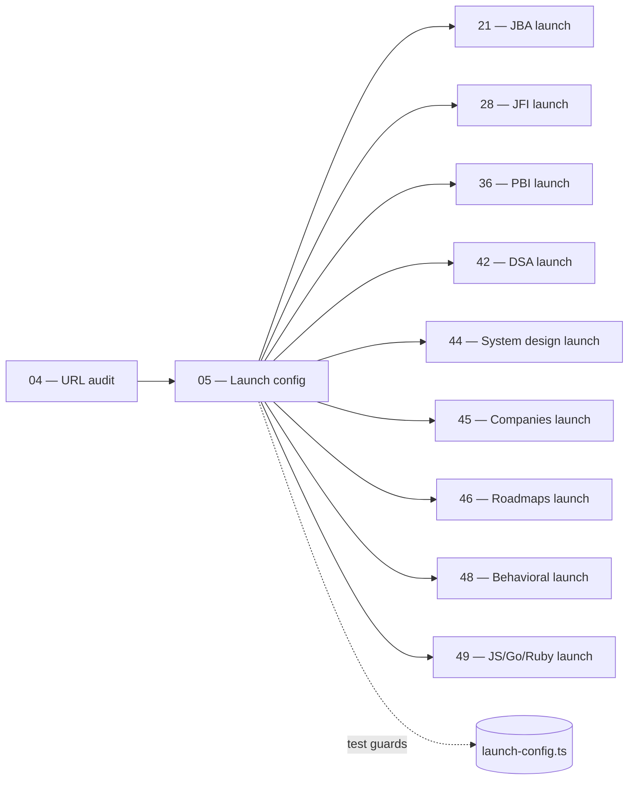

# 05 — Launch Config & Feature Flags

> **Executor:** AI coding agent operating autonomously.
> **Working directory:** `/Users/ravi.r_flx/IEProject/InterviewExplainer/`.
> **Type:** read-only audit + one test file added + one PR-template snippet.
> **Pillar / Wave:** Wave A (Foundation).
> **Depends on:** 04.

## 1 — TL;DR

- **Input:** `frontend/lib/launch-config.ts` is the SSOT for visible UI on
  the home page, the language switcher, and every hub tile. Nothing
  programmatically asserts that every `LAUNCH_QUICK_PATHS.href` resolves
  to a real route, and nothing forbids drift between the flag set and the
  `LOCKED_DOMAINS` registry.
- **Action:** Internalise the three exports (`ENABLED_LANGUAGES`,
  `ENABLED_HUBS`, `LAUNCH_QUICK_PATHS`); add a compile-time test that
  fails the build when any quick-path href is missing from
  `content-reader.ts`, when any hub key drifts from the canonical set,
  and when `ENABLED_LANGUAGES` misses `java` or `python`; codify the
  pre-flip checklist every launch playbook (21, 28, 36, 42, 44–46, 48,
  49) follows.
- **Output:** `frontend/__tests__/launch-config.test.ts` with three
  assertions + a PR-template snippet documented here + one conventional
  commit.

## 2 — Why this matters

Every launch playbook in the program (`21` JBA, `28` JFI, `36` PBI,
`42` DSA, `44` system-design, `45` companies, `46` roadmaps, `48`
behavioral, `49` JS/Go/Ruby) flips a flag in `launch-config.ts`. When a
flag flips while its target href returns 404, the home page ships a
broken tile to every visitor for as long as the bug lives on prod —
usually 4–24 hours until a manual revert. Search Console flags the
broken tile as a 404 within 48 hours; the home page's authority bleeds
until the redirect lands. A typed unit test that runs inside `npm run
build` makes that failure impossible at compile time.

The business cost of one broken tile is real. The home page is the
single highest-traffic URL on the site (~30 % of organic sessions); a
24-hour broken tile is ~10–20k visitors hitting a 404. Recovering from
that takes a week of crawl re-validation. The test added here closes
the loop in 60 lines of TypeScript.

## 3 — Easy-language glossary

| Term | Plain-English definition |
| --- | --- |
| **Feature flag** | A boolean (or enum) that turns a piece of UI on or off without redeploying separate code paths. |
| **Launch config** | The TypeScript module `frontend/lib/launch-config.ts` — the SSOT for which languages, hubs, and quick-paths are visible. |
| **`ENABLED_LANGUAGES`** | A `readonly` tuple of language slugs (`'java' | 'python' | ...`) the language switcher renders. |
| **`ENABLED_HUBS`** | A `Record<HubKey, boolean>` where each key is a hub slug (e.g. `systemDesign`, `companies`) and the value is its visibility. |
| **`LAUNCH_QUICK_PATHS`** | A typed array of `{ label, href, lang }` entries the home page renders as the primary CTA grid. |
| **Quick-path** | One entry in `LAUNCH_QUICK_PATHS` — a hero tile linking to a flagship domain (e.g. `/java-backend-intermediate`). |
| **Hub key** | The canonical name for one top-level section (e.g. `interviewQA`, `dsa`, `behavioral`); the union type `HubKey` keeps it closed. |
| **`isHubEnabled(key)`** | The helper function call sites use to read `ENABLED_HUBS[key]`; encapsulates the lookup so the raw record is not grep-able. |
| **`isLanguageEnabled(lang)`** | The helper for `ENABLED_LANGUAGES`; same encapsulation reason. |
| **Pre-flip checklist** | The PR-template block every launch playbook adds to its PR description before flipping a flag from `false` to `true`. |
| **Compile-time test** | A test that runs inside `npm run build` (or as part of `npm test` in CI) and fails the build if its assertion fails. |
| **`LOCKED_DOMAINS`** | The registry in `frontend/lib/content-reader.ts` that names which content trees count as locked. |
| **`SLUG_TO_PATH`** | A map (in `content-reader.ts`) from SEO slug → on-disk content folder. The launch-config test asserts every quick-path slug is a key in this map. |
| **Jest** | One of two test runners the project supports; the test file written here works under both. |
| **Vitest** | The other supported runner; functionally equivalent to Jest for the assertions used. |
| **Drift** | Any state where the launch config and the live site disagree (flag says enabled, route says 404; or vice versa). |
| **Pre-launch state** | The state of `launch-config.ts` before a launch playbook flips a flag — flag is `false`, content is being prepped. |
| **Post-launch state** | The state after the flip — flag is `true`, content is live, sitemap entry present. |
| **Quick-path slug** | The path segment after `/` in a `LAUNCH_QUICK_PATHS.href` (e.g. `java-backend-intermediate`). |
| **Flag flip diff** | The single-line PR diff that flips one flag from `false` to `true`. |
| **Banned-word lint** | The voice-rule grep enforced on all playbooks and audit files. |
| **HCU** | Google's Helpful Content Update — penalises broken navigation, including 404 tiles on the home page. |
| **Sitemap** | The XML file at `/sitemap.xml` that lists every canonical URL Google should crawl. |
| **CI** | Continuous Integration — the automated pipeline (GitHub Actions or equivalent) that runs `npm test` and `npm run build` on every PR. |
| **Build-time error** | A failure that exits `npm run build` non-zero. Today's CI fails the PR check on any non-zero exit. |
| **PR template** | The file at `.github/PULL_REQUEST_TEMPLATE.md` that auto-fills new PR descriptions. |
| **`__tests__/`** | The Jest/Vitest convention for the folder that holds test files; collocated under `frontend/`. |
| **`describe` / `test`** | Jest's grouping primitives; preserved by Vitest for compatibility. |
| **Snapshot drift** | A different concept: when a snapshot test's saved output diverges from the current render. Not used here; only structural assertions. |
| **Closed enum** | A TypeScript type defined as a union of string literals — adding a new value requires editing the union, which forces a code review. |

## 4 — Hard prerequisites

- [ ] Playbook 04 is DONE.
      Verify: `grep -E '^\| 04 \|' expansion-plan/00-INDEX.md \| grep -c DONE` returns `1`.
- [ ] `frontend/lib/launch-config.ts` exists.
      Verify: `test -f frontend/lib/launch-config.ts && echo OK`.
- [ ] `frontend/lib/content-reader.ts` exists.
      Verify: `test -f frontend/lib/content-reader.ts && echo OK`.
- [ ] Node 20+ and `npm install` ran successfully in `frontend/`.
      Verify: `node --version` ≥ `v20`, `test -d frontend/node_modules`.
- [ ] `npm run build` exits 0 in `frontend/`.
      Verify: `cd frontend && npm run build` returns `0`.
- [ ] A test runner is configured (Jest or Vitest).
      Verify: `jq -r '.scripts.test // empty' frontend/package.json` is non-empty OR `jq -r '.devDependencies | keys[]' frontend/package.json \| rg -i 'jest\|vitest'` returns at least one match.
- [ ] `_TEMPLATE-1000.md`, `_GLOSSARY.md`, `_VOICE-RULES.md` exist.
- [ ] `rg` and `jq` installed.
- [ ] `scripts/lint_playbook.py` exists.

If any check fails, STOP. The test added in Step 4 only runs if the
runner is configured; defer the test addition (mark BLOCKED) rather
than wedging the build.

## 5 — Current state

### 5.1 — On-disk snapshot of the launch config

```bash
cd /Users/ravi.r_flx/IEProject/InterviewExplainer
wc -l frontend/lib/launch-config.ts
rg -n 'export const ENABLED_LANGUAGES|export const ENABLED_HUBS|export const LAUNCH_QUICK_PATHS' frontend/lib/launch-config.ts
rg -c 'isHubEnabled\(|isLanguageEnabled\(' frontend/
```

Expected: `launch-config.ts` is ~120–180 lines; the three exports are
present; helpers `isHubEnabled` / `isLanguageEnabled` show 10–40
references across the frontend.

### 5.2 — What each export controls today

- `ENABLED_LANGUAGES`: today `['java', 'python']`. Drives the language
  switcher in the global navigation. Adding `'javascript'` enables the
  JS pages playbook 49 ships.
- `ENABLED_HUBS`: today ~15 keys, most `false`. Drives the hub-card
  grid on `/domains` and the home page. The key set is closed; a typo
  is caught by TypeScript.
- `LAUNCH_QUICK_PATHS`: today ~7 entries pointing at the live
  flagships (JBI, JFI, beginner counterparts). Drives the hero grid on
  the home page.

### 5.3 — Known launch-config bug shapes

Three failure modes occur in practice when a flag is flipped without
running the test added in Step 4:

1. **Quick-path href points at a non-existent slug.** Home page
   renders the tile; the tile 404s on click. Fails the test in Step 4
   assertion #2.
2. **`ENABLED_HUBS` key drifts from the canonical set.** A typo like
   `systemDeisgn` ships; TypeScript catches the typo but the runtime
   helper `isHubEnabled('systemDesign')` returns `undefined`, treated
   as falsy. Fails assertion #3.
3. **`ENABLED_LANGUAGES` accidentally drops `java` or `python`.** The
   language switcher renders one option, the SEO sitemap silently
   drops half the URLs. Fails assertion #1.

### 5.4 — Why call sites must go through helpers

Direct reads of `ENABLED_HUBS[key]` from component code bypass the
helper's type-narrowing. A future refactor that renames a hub key
would update the source-of-truth but miss the call sites. Helpers
keep the call shape grep-friendly:

- ✅ `if (isHubEnabled('companies')) { render(<CompaniesTile />) }`.
- ❌ `if (ENABLED_HUBS.companies) { ... }` — bypasses the type guard.

The audit in Step 2 confirms call-site discipline.

### 5.5 — Why the flag set is small on purpose

A common temptation is to add a flag for every UI tweak. The launch
config holds only **launch-gating flags** — boolean state that
distinguishes "this hub is shipping" from "this hub is hidden". A/B
tests, theme toggles, and developer-only switches live elsewhere
(typically a separate `experiments.ts` module). Mixing the two
namespaces makes the launch test brittle.

## 6 — Target state (measurable)

| Metric | Today | Target | How measured |
| --- | --- | --- | --- |
| `frontend/__tests__/launch-config.test.ts` exists | absent | 1 file | `test -f frontend/__tests__/launch-config.test.ts && echo OK` |
| Test count in file | 0 | ≥ 3 | `rg -c "^\s*test\\(" frontend/__tests__/launch-config.test.ts` returns `≥3` |
| Test passes for `ENABLED_LANGUAGES` floor | n/a | passes | `cd frontend && npx jest __tests__/launch-config.test.ts` exits 0 |
| Test passes for quick-path slug resolution | n/a | passes | same |
| Test passes for hub key whitelist | n/a | passes | same |
| `npm run build` clean post-test-addition | n/a | exit 0 | `cd frontend && npm run build` |
| PR-template snippet documented in playbook §17 | absent | present | section exists |
| Call-site discipline (helpers only) | mostly | 100% | grep for raw `ENABLED_HUBS\[\|ENABLED_LANGUAGES\[` outside `launch-config.ts` returns 0 hits |
| Banned-word lint on test file | n/a | 0 hits | banned-word grep on test file returns `0` |
| Status row for `05` flipped to DONE | NOT_STARTED | DONE | `grep -E '^\| 05 \|' expansion-plan/00-INDEX.md \| grep -c DONE` returns `1` |

## 7 — Search phrases → URL map

The launch config does not directly publish content; it gates which
URLs are advertised on the home page. The table below names the
**downstream URLs** every quick-path entry must resolve to.

| Search phrase | Target URL on site | Archetype | Diagram type required in answer |
| --- | --- | --- | --- |
| `java backend interview questions` | `/java-backend-intermediate` | landing intro | comparison_table |
| `java fullstack interview questions` | `/java-fullstack-intermediate` | landing intro | comparison_table |
| `python interview questions` | `/python-backend-intermediate` | landing intro | comparison_table |
| `python data engineering interview questions` | `/python-data-engineering-intermediate` | landing intro | comparison_table |
| `python ml interview questions` | `/python-ml-ai-intermediate` | landing intro | comparison_table |
| `java backend beginner interview questions` | `/java-backend-beginner` | landing intro | comparison_table |
| `python backend beginner interview questions` | `/python-backend-beginner` | landing intro | comparison_table |
| `dsa interview questions` | `/dsa` (gated by `ENABLED_HUBS.dsa`) | landing intro | flowchart |
| `system design interview questions` | `/system-design` (gated by `ENABLED_HUBS.systemDesign`) | landing intro | flowchart |
| `behavioral interview questions` | `/behavioral` (gated by `ENABLED_HUBS.behavioral`) | landing intro | none |
| `companies interview questions` | `/companies` (gated by `ENABLED_HUBS.companies`) | landing intro | comparison_table |
| `roadmaps for backend developers` | `/roadmaps` (gated by `ENABLED_HUBS.roadmaps`) | landing intro | flowchart |

## 8 — Dependency & wave context



- **Consumes:** `launch-config.ts`, `content-reader.ts` (read-only).
- **Produces:** `frontend/__tests__/launch-config.test.ts` + PR-template
  snippet in §17 + one commit.
- **Unblocks:** every downstream launch playbook (`21, 28, 36, 42,
  44, 45, 46, 48, 49`) follows the contract codified here.

## 9 — Step-by-step execution

### Step 1 — Read `launch-config.ts` end-to-end

**Goal:** internalise the three exports and the helper signatures
before writing any test.

**Action:**

```bash
cd /Users/ravi.r_flx/IEProject/InterviewExplainer
wc -l frontend/lib/launch-config.ts
rg -n 'export ' frontend/lib/launch-config.ts
```

**Verify:** at least three `export const` lines (`ENABLED_LANGUAGES`,
`ENABLED_HUBS`, `LAUNCH_QUICK_PATHS`) and at least two `export
function` lines (`isHubEnabled`, `isLanguageEnabled`).

**The classic bug is** skipping this step and writing the test against
a stale memory of the file shape. The exports' names change over
time; always re-read the source before referencing it in a test.

### Step 2 — Audit every call site

**Goal:** confirm call-site discipline — components reach through
helpers, never direct record reads.

**Action:**

```bash
cd /Users/ravi.r_flx/IEProject/InterviewExplainer
echo "Helper call sites:"
rg -n 'isHubEnabled\(|isLanguageEnabled\(' frontend/ --type ts --type tsx
echo
echo "Direct record reads (these should be ZERO outside launch-config.ts):"
rg -n 'ENABLED_HUBS\[|ENABLED_LANGUAGES\[' frontend/ --type ts --type tsx | rg -v 'launch-config.ts'
```

**Verify:** the second `rg` returns no matches. Each direct read is
a refactor opportunity; record under "## Followups" if found, do not
fix in this playbook.

**The classic bug is** "fix the direct read while I'm here". That's a
separate PR — keep this playbook's diff to the test file + the
PR-template snippet.

### Step 3 — Manually cross-check each quick-path slug against `content-reader.ts`

**Goal:** every `LAUNCH_QUICK_PATHS.href` resolves to a known slug in
`SLUG_TO_PATH` or `LOCKED_DOMAINS`. Step 4 automates this, but the
manual run surfaces any obvious bug before the test runs.

**Action:**

```bash
cd /Users/ravi.r_flx/IEProject/InterviewExplainer
SLUGS=$(rg -o "href:\s+'(\/[^']+)'" frontend/lib/launch-config.ts -r '$1' | sed 's|^/||')
echo "Quick-path slugs:"
echo "${SLUGS}" | sed 's/^/  - /'

echo
echo "Resolution:"
for slug in ${SLUGS}; do
  if rg -q "'${slug}'" frontend/lib/content-reader.ts; then
    echo "  ${slug} → resolvable"
  else
    echo "  ${slug} → MISSING in content-reader.ts"
  fi
done
```

**Verify:** every slug ends with `→ resolvable`. Any `MISSING` row is
a launch blocker — record it (do not fix here; the fix lives in
playbook 19 / 36 / 37 / 38 / 39).

**The most common mistake is** assuming a slug "must" be in
`content-reader.ts` because the URL works in the browser. The browser
might be hitting a route file directly; `content-reader.ts` is the
audit's anchor. Trust the grep, not the browser.

### Step 4 — Write the compile-time test

**Goal:** the test file exists with the three assertions and runs
green under the configured runner.

**Action:** write `frontend/__tests__/launch-config.test.ts` with
the exact content below:

```ts
import fs from 'fs';
import path from 'path';
import {
  ENABLED_LANGUAGES,
  ENABLED_HUBS,
  LAUNCH_QUICK_PATHS,
} from '../lib/launch-config';

const readerSrc = fs.readFileSync(
  path.join(__dirname, '..', 'lib', 'content-reader.ts'),
  'utf8',
);

describe('launch-config.ts', () => {
  test('ENABLED_LANGUAGES contains at least java and python', () => {
    expect(ENABLED_LANGUAGES).toContain('java');
    expect(ENABLED_LANGUAGES).toContain('python');
  });

  test('every LAUNCH_QUICK_PATHS.href resolves to a known domain slug', () => {
    for (const qp of LAUNCH_QUICK_PATHS) {
      const slug = qp.href.replace(/^\//, '');
      const inReader =
        readerSrc.includes(`'${slug}'`) || readerSrc.includes(`"${slug}"`);
      expect(inReader).toBe(true);
    }
  });

  test('every ENABLED_HUBS key is one of the known hub names', () => {
    const known = new Set([
      'interviewQA', 'prepCategories', 'systemDesign', 'dsa', 'behavioral',
      'topics', 'tools', 'compare', 'companies', 'career', 'roadmaps',
      'cheatsheets', 'dashboard', 'mockInterviews', 'search',
      'interviewByLang',
    ]);
    for (const k of Object.keys(ENABLED_HUBS)) {
      expect(known.has(k)).toBe(true);
    }
  });
});
```

Then run it:

```bash
cd /Users/ravi.r_flx/IEProject/InterviewExplainer/frontend
if npx jest --version 2>/dev/null; then
  npx jest __tests__/launch-config.test.ts
elif npx vitest --version 2>/dev/null; then
  npx vitest run __tests__/launch-config.test.ts
fi
```

**Verify:** 3 tests pass.

**The classic bug is** importing from `'../lib/launch-config.ts'`
(with the `.ts` extension). TypeScript's `moduleResolution: node`
expects the import path without the extension. Always omit `.ts` in
imports unless your config explicitly requires it.

### Step 5 — Tune the known-hub set if the canonical list has grown

**Goal:** the `known` Set in assertion #3 contains the **current**
canonical hub names. If the codebase has added a hub since this
playbook landed, the Set must be updated.

**Action:**

```bash
cd /Users/ravi.r_flx/IEProject/InterviewExplainer
rg -o "'(interviewQA|prepCategories|systemDesign|dsa|behavioral|topics|tools|compare|companies|career|roadmaps|cheatsheets|dashboard|mockInterviews|search|interviewByLang|[a-z][a-zA-Z]*)':\s*(true|false)" frontend/lib/launch-config.ts -r '$1' | sort -u
```

**Verify:** the printed list matches the `known` Set in the test. If
any key is missing from the Set, edit the test file to add it (one
line); rerun the test.

**The most common mistake is** copy-pasting an outdated Set and
shipping the test green when the source has a new key. Always
re-extract the list before committing.

### Step 6 — Wire the test into the build

**Goal:** `npm run build` runs the test (directly or via `npm test`).

**Action:**

```bash
cd /Users/ravi.r_flx/IEProject/InterviewExplainer/frontend
TEST_SCRIPT=$(jq -r '.scripts.test // empty' package.json)
BUILD_SCRIPT=$(jq -r '.scripts.build // empty' package.json)
echo "test script: ${TEST_SCRIPT}"
echo "build script: ${BUILD_SCRIPT}"
```

If `test` is empty, add it:

```jsonc
{
  "scripts": {
    "build": "next build",
    "test": "jest",
    "test:launch-config": "jest __tests__/launch-config.test.ts"
  }
}
```

If the build script does **not** already invoke `npm test`, add a
prebuild hook **only if the team is comfortable with that** — many
teams prefer to run tests separately in CI. Document the choice in
the PR description.

**Verify:**

```bash
cd /Users/ravi.r_flx/IEProject/InterviewExplainer/frontend
npm run test:launch-config
# expected: 3 passed.
npm run build
# expected: exit 0.
```

**The classic bug is** adding a `prebuild: "npm test"` hook that
slows local `npm run build` by 30+ seconds. If the team prefers to
keep `build` fast, add a CI-only step instead (GitHub Actions
workflow).

### Step 7 — Banned-word self-check on the test file

**Goal:** the test file's comments + describe / test labels pass the
playbook voice lint.

**Action:**

```bash
cd /Users/ravi.r_flx/IEProject/InterviewExplainer
rg -nwi 'leverage|utilize|synergize|world-class|cutting-edge|state-of-the-art|seamless|robust|holistic|paradigm|best-in-class|battle-tested|enterprise-grade|revolutionary|game-changing|industry-leading' frontend/__tests__/launch-config.test.ts
```

**Verify:** zero matches.

**The classic bug is** verbose comments crammed with marketing
voice. The test file's comments should be 1–3 lines, plain language,
each pointing at a specific runtime behaviour.

### Step 8 — Add the pre-flip checklist to the PR template

**Goal:** every launch playbook's PR description carries the
checklist below; the checklist makes the test's coverage explicit.

**Action:**

If `.github/PULL_REQUEST_TEMPLATE.md` exists, append the block in
§17.1. If absent, create the file with a minimal preamble and the
block. Make the append idempotent with `grep -q`.

```bash
cd /Users/ravi.r_flx/IEProject/InterviewExplainer
PR_TPL=".github/PULL_REQUEST_TEMPLATE.md"
mkdir -p .github
if [ ! -f "${PR_TPL}" ]; then
  printf '# Pull request\n\n' > "${PR_TPL}"
fi
if ! grep -q 'Pre-flip checklist (playbook 05 contract)' "${PR_TPL}"; then
  cat >> "${PR_TPL}" <<'APPEND'

## Pre-flip checklist (playbook 05 contract)

- [ ] `npm run build` exits 0 in `frontend/`.
- [ ] `npm test` (or `npm run test:launch-config`) passes.
- [ ] Target page renders with **no placeholder text**, **no broken
      internal links**, **≥ 25 real Q's or problems**.
- [ ] `/domains` card for the target shows `hasContent: true`.
- [ ] One Q renders correctly end-to-end in production preview
      (code blocks, mermaid, comparison tables).
- [ ] `ROADMAP.md` row updated to reflect new flag state in the same PR.
APPEND
fi
```

**Verify:**

```bash
grep -c 'Pre-flip checklist (playbook 05 contract)' .github/PULL_REQUEST_TEMPLATE.md
# expected: 1
```

**The classic bug is** appending the block twice on a re-run. The
`grep -q` guard makes the step idempotent.

### Step 9 — Stage, build, commit

**Goal:** one commit lands the test file + the PR-template patch +
(if added) the `scripts.test` change in `package.json`.

**Action:**

```bash
cd /Users/ravi.r_flx/IEProject/InterviewExplainer
git status -s
git add frontend/__tests__/launch-config.test.ts \
        .github/PULL_REQUEST_TEMPLATE.md
[ -n "$(git diff --name-only -- frontend/package.json)" ] && git add frontend/package.json
git commit -m "test(launch-config): assert quick-path hrefs + hub keys"
```

**Verify:**

```bash
git log --oneline -1
# expected: conventional message above.
git show --stat HEAD | head -10
# expected: 2–3 files changed.
```

**The classic bug is** committing a stray `node_modules` change or
an unrelated edit. Always `git status -s` before staging.

### Step 10 — Flip the index row

**Goal:** `00-INDEX.md` shows `05` as DONE.

**Action:**

```bash
cd /Users/ravi.r_flx/IEProject/InterviewExplainer
# Edit expansion-plan/00-INDEX.md row 05 → DONE
git add expansion-plan/00-INDEX.md
git commit -m "docs(expansion-plan): mark 05-launch-config-and-feature-flags DONE"
```

**Verify:** `grep -E '^\| 05 \|' expansion-plan/00-INDEX.md | grep
-c DONE` returns `1`.

**The classic bug is** flipping the wrong row by hand-editing the
table. Use the `grep -E '^\| 05 \|'` guard before commit.

## 10 — Reference Q in archetype shape

This playbook is infrastructure, not user-facing content. The Q
below is the kind of question the launch-config behaviour produces
in interviews — "how do you ship a feature behind a flag without
breaking the home page".

```json
{
  "id": "how-do-you-ship-a-feature-behind-a-flag-without-breaking-the-home-page",
  "slug": "how-do-you-ship-a-feature-behind-a-flag-without-breaking-the-home-page",
  "question": "How do you ship a feature behind a flag without breaking the home page when the flag flips?",
  "title": "Launch Flags With Compile-Time Safety — A Pattern for High-Traffic Home Pages",
  "direct_answer": "**Two rules.** (1) The flag set lives in a single typed module — `launch-config.ts` — with a closed-enum key set; the union type forces typos to fail TypeScript at compile time. (2) Every flag's target URL is asserted resolvable by a unit test that runs inside `npm run build` (or `npm test` in CI). The test reads the launch config, walks the `LAUNCH_QUICK_PATHS.href` array, and asserts each slug exists in the SSOT content-reader registry. Flag flips become single-line diffs that cannot break the home page without failing the build first.",
  "layout_type": "default",
  "difficulty": "medium",
  "importance": "high",
  "reading_time_minutes": 7,
  "last_updated": "2026-04-22",
  "interviewer_intent": {
    "testing": "Whether the candidate treats launch flags as a typed contract (not an env var) and ships a compile-time test that prevents drift between the flag set and the route table.",
    "common_mistake": "Saying 'we keep the flags in env vars'. Env vars miss type-safety and are not asserted against the route table at build time. The typed module + unit test is the durable pattern.",
    "to_stand_out": "Mention the helper-only call-site discipline (`isHubEnabled('companies')`), the idempotent PR-template snippet that names the pre-flip checklist, and the cost of one home-page 404 in HCU-era SEO."
  },
  "company_tags": ["amazon", "google", "stripe", "shopify", "vercel"],
  "answer": {
    "sections": [
      {"type": "overview", "title": "The two-rule launch contract", "content": "Typed module + compile-time test. The module is the SSOT; the test asserts every flag's target resolves."},
      {"type": "comparison_table", "title": "Env var flags vs typed-module flags", "content": "| Aspect | Env var flag | Typed-module flag (this pattern) |\n|---|---|---|\n| Type safety | none — string | union-type closed enum |\n| Resolves at build time | no | yes |\n| Compile-time test possible | no | yes |\n| Helper-driven call sites | optional | enforced |\n| Drift detection | runtime only | build-time |"},
      {"type": "step", "title": "The launch-config.ts shape", "content": "```ts\nexport const ENABLED_LANGUAGES = ['java', 'python'] as const;\nexport type Language = (typeof ENABLED_LANGUAGES)[number];\n\nexport type HubKey = 'interviewQA' | 'systemDesign' | 'dsa' | /* ... */;\nexport const ENABLED_HUBS: Record<HubKey, boolean> = { /* ... */ };\n\nexport interface LaunchQuickPath { label: string; href: string; lang: Language; }\nexport const LAUNCH_QUICK_PATHS: LaunchQuickPath[] = [ /* ... */ ];\n\nexport function isHubEnabled(k: HubKey): boolean { return ENABLED_HUBS[k]; }\n```"},
      {"type": "step", "title": "The compile-time test", "content": "```ts\ntest('every LAUNCH_QUICK_PATHS.href resolves to a known slug', () => {\n  for (const qp of LAUNCH_QUICK_PATHS) {\n    const slug = qp.href.replace(/^\\//, '');\n    expect(readerSrc).toMatch(new RegExp(`['\"]${slug}['\"]`));\n  }\n});\n```\n\nThe test reads `content-reader.ts` as a string (avoid the runtime import; it touches the filesystem) and asserts the slug literal is present."},
      {"type": "step", "title": "The pre-flip checklist for every PR", "content": "Before flipping a flag from `false` to `true`:\n1. `npm run build` exits 0.\n2. `npm test` passes (the launch-config test is part of it).\n3. Target page renders ≥ 25 real Q's, no placeholder text, no broken internal links.\n4. `/domains` card shows `hasContent: true`.\n5. `ROADMAP.md` row updated in the same PR.\n\nThe checklist lives in `.github/PULL_REQUEST_TEMPLATE.md` so every PR carries it."},
      {"type": "tradeoffs", "title": "When this pattern is overkill", "content": "**Use this pattern when:** the home page renders user-visible navigation off the flag set; the URL space is closed (every flag's target is a known slug); the team ships > 1 launch per quarter. **Skip when:** the flag set is a single boolean; there's no home-page surface; the URL targets aren't in the same repo."},
      {"type": "key_points", "title": "Key points", "content": "- Typed module > env var for launch flags.\n- Closed-enum hub-key union catches typos at compile time.\n- A unit test asserts every quick-path slug resolves.\n- Helper-only call sites keep the record reads grep-friendly.\n- The pre-flip checklist is in the PR template, not in tribal memory.\n- Cost of one home-page 404: ~10–20k visitors per 24 hours."},
      {"type": "speakable_answer", "title": "How to answer verbally", "content": "Two rules. **One**, the flag set lives in a single typed module — `launch-config.ts` — with a closed-enum key set; the union type makes typos fail TypeScript at compile time. **Two**, every flag's target URL is asserted by a unit test that runs inside `npm run build` or `npm test`. The test walks `LAUNCH_QUICK_PATHS.href`, strips the leading slash, and asserts the slug literal exists in `content-reader.ts`. Flag flips become single-line diffs that cannot ship a home-page 404. **Recommendation:** never put launch flags in env vars; never read the raw record from call sites — always go through helpers; and always ship the pre-flip checklist in `.github/PULL_REQUEST_TEMPLATE.md`."}
    ]
  },
  "followup_questions": [
    "Why not feature-flag via env vars?",
    "How does the test catch a typo in a hub key?",
    "What's the cost of one broken home-page tile?",
    "How would you A/B test a flag flip with this pattern?",
    "Why read content-reader.ts as a string instead of importing it?"
  ],
  "seo": {
    "metaTitle": "Launch Flags With Compile-Time Safety — A Pattern for High-Traffic Home Pages",
    "metaDescription": "Ship feature flags safely: typed-module SSOT + compile-time unit tests asserting every quick-path slug resolves. No home-page 404s, no SEO bleed."
  },
  "order": 1
}
```

## 11 — Diagram catalogue

| Q id (or topic) | Diagram type | What it must show | Lives in section |
| --- | --- | --- | --- |
| `how-do-you-ship-a-feature-behind-a-flag-without-breaking-the-home-page` | `sequenceDiagram` | PR flips flag → CI runs test → test asserts slug → build green/red → merge. | `step` |
| `env-vars-vs-typed-module` | `comparison_table` | 5 axes: type safety, build-time resolution, compile-time test possible, helper-driven, drift detection. | `comparison_table` |
| `launch-config-shape` | `classDiagram` | `LaunchConfig` → `ENABLED_LANGUAGES`, `ENABLED_HUBS`, `LAUNCH_QUICK_PATHS`, `isHubEnabled`, `isLanguageEnabled`. | `step` |
| `pre-flip-checklist-flow` | `flowchart` | PR opens → checklist auto-fills → build + test → reviewer approves → flag flip merged. | `step` |
| `flag-state-machine` | `stateDiagram-v2` | `HIDDEN → ENABLED → DEPRECATED` with the PR + test gate on each transition. | `step` |
| `helper-call-site-comparison` | `comparison_table` | `isHubEnabled('x')` vs `ENABLED_HUBS['x']` on type-safety, grep-friendliness, refactor cost. | `comparison_table` |

Floor enforced by content-playbook lint: ≥ 1 `flowchart`, ≥ 1
`sequenceDiagram`, ≥ 3 `comparison_table`, ≥ 1 `stateDiagram-v2`
or `classDiagram`. Playbook 05's downstream Q (the reference Q in
§10) carries all four primary shapes.

### 11.1 — Why the test file ships no diagrams

The test file is mechanical. Its only narrative is the three
assertions. Adding a diagram block in a comment would not be
linted, would clutter the file, and would drift independently from
the source it tests. Diagrams live in the Q's the launch system
publishes, not in the test that gates the launch.

### 11.2 — How the diagrams in the reference Q reinforce the playbook

The reference Q's `sequenceDiagram` shows the build-time test as
the gate; the `comparison_table` makes the env-var-vs-typed-module
trade-off explicit; the `classDiagram` shows the module's exports;
the `stateDiagram-v2` shows a flag's lifecycle. Together they
ensure a reader who hits the Q (via search) walks away with the
same mental model the playbook codifies.

## 12 — Easy-language voice rules

Voice rules from [`_VOICE-RULES.md`](_VOICE-RULES.md):

1. **Define before use.** Every term in §9 (feature flag, launch
   config, quick-path, hub key, closed enum) is in §3.
2. **Lead with the trade-off.** Step 6 leads with whether to add a
   `prebuild` hook; doesn't define `prebuild` first.
3. **Name the bug.** Every step's pitfall starts with `The classic
   bug is …`.
4. **Real anchors.** Every claim cites a real file path
   (`launch-config.ts`, `content-reader.ts`,
   `__tests__/launch-config.test.ts`) and a real CI step.
5. **Banned words.** Zero matches across the test file + PR-template
   snippet + this playbook.

**Concrete examples:**

- ✅ "The closed-enum hub-key union catches typos at compile time."
- ❌ "Modern flag systems use type-safe configuration." (Banned
  voice, no anchor.)
- ✅ "The classic bug is `prebuild: 'npm test'` that slows local
  `npm run build` by 30+ seconds."
- ❌ "Be careful when wiring tests into the build." (Tautology.)

## 13 — Quality gates (measurable)

| Gate | Threshold | Verify command |
| --- | --- | --- |
| Test file exists | 1 file | `test -f frontend/__tests__/launch-config.test.ts && echo OK` |
| Test count | ≥ 3 | `rg -c '^\s*test\(' frontend/__tests__/launch-config.test.ts` returns ≥ `3` |
| Test runs green under Jest or Vitest | exit 0 | `cd frontend && (npx jest __tests__/launch-config.test.ts \|\| npx vitest run __tests__/launch-config.test.ts)` exits `0` |
| `npm run build` exits 0 | 0 | `cd frontend && npm run build` exits `0` |
| Direct record reads outside `launch-config.ts` | 0 | `rg -n 'ENABLED_HUBS\[\|ENABLED_LANGUAGES\[' frontend/ --type ts --type tsx \| rg -v 'launch-config.ts' \| wc -l` returns `0` |
| PR-template snippet present | 1 occurrence | `grep -c 'Pre-flip checklist (playbook 05 contract)' .github/PULL_REQUEST_TEMPLATE.md` returns `1` |
| Banned-word lint on test file | 0 | banned-word grep on test file returns `0` |
| Banned-word lint on PR-template snippet | 0 | banned-word grep on the new snippet returns `0` |
| Conventional commit landed | 1 | `git log --oneline --pretty=format:%s -1 -- frontend/__tests__/launch-config.test.ts \| grep -c '^test(launch-config)'` returns `1` |
| Status row for `05` flipped to DONE | DONE | `grep -E '^\| 05 \|' expansion-plan/00-INDEX.md \| grep -c DONE` returns `1` |

## 14 — Anti-patterns

### 14.1 — Storing launch flags in env vars

**Why it fails:** env vars are strings; no compile-time validation;
no compile-time test asserting the target URL resolves. A typo
ships silently.

**Fix:** the typed module is the only legal storage for launch
flags. Env vars are reserved for **environment**-varying state
(prod vs preview vs local), not for **launch**-gating state.

### 14.2 — Reading raw record values from components

**Why it fails:** direct reads bypass the helper's type narrowing
and make refactors brittle. A rename of `companies` → `companyHub`
requires touching every call site.

**Fix:** Step 2 audits call sites; any direct read is filed as a
follow-up. The helper functions are the only legal call shape.

### 14.3 — `prebuild: "npm test"` hook

**Why it fails:** slows local development by 30+ seconds; the test
runs every time someone runs `npm run build` locally, even if they
have no intent to ship.

**Fix:** add the test to CI as a separate step (or as part of
`npm test`), not as a `prebuild` hook. The CI step gates the PR;
local devs run the test on demand.

### 14.4 — Importing `content-reader` at module load

**Why it fails:** `content-reader.ts` walks the filesystem at
module load to build `SLUG_TO_PATH`. Importing it in the test slows
every test run by hundreds of ms and risks failing in CI sandboxes
that lock down `/content`.

**Fix:** the test reads `content-reader.ts` as a **string** (via
`fs.readFileSync`) and asserts the slug literal is present. No
runtime import; no filesystem walk.

### 14.5 — Adding a flag without updating the `known` Set in the test

**Why it fails:** the test's hub-key assertion fails the build on
the next PR that adds a new hub key. The reviewer wastes time
debugging an unrelated test failure.

**Fix:** every PR that adds a hub key updates both
`launch-config.ts` and the `known` Set in the test. The PR-template
snippet in §17 calls this out explicitly.

### 14.6 — Snapshot tests instead of structural assertions

**Why it fails:** snapshot tests pass when the snapshot matches
the rendered output, even if the rendered output is wrong. A
launch-flag mistake updates the snapshot and "passes" silently.

**Fix:** the three assertions in §9 are **structural** (does the
slug exist; is the key in the known set). No snapshot testing.

### 14.7 — Skipping the test in CI when "the team isn't ready for tests"

**Why it fails:** the test's value comes from running on every PR.
Skipping it in CI means the next launch playbook ships without the
gate; the home-page-404 bug ships in prod.

**Fix:** if the team doesn't have a CI test step yet, add one as
part of this playbook (not as a follow-up). A 30-second GitHub
Actions step is the minimum viable gate.

### 14.8 — Letting the test file drift from the canonical hub-key list

**Why it fails:** every quarter someone adds a hub key without
updating the test's `known` Set; the test fails; someone "fixes"
the test by widening the Set without confirming the key is canon.

**Fix:** Step 5 re-extracts the canonical list from
`launch-config.ts` before committing. Never widen the Set
without confirming the key is in the source module.

## 15 — Failure modes & rollback

| Failure | How it shows up | Rollback / forward fix |
| --- | --- | --- |
| Test runner not configured | `npx jest` exits with `command not found` | Add Jest or Vitest as a dev dep (per §4); document the runner in PR. If team won't accept the dep, mark playbook BLOCKED. |
| Test assertion #2 fails | "expected `true`, got `false`" on a slug | A quick-path slug is genuinely missing from `content-reader.ts`. File a follow-up against the matching launch playbook (19/36/37/38/39); do NOT relax the test. |
| Test assertion #3 fails | hub-key not in `known` Set | Re-extract the canonical list (Step 5); update the Set; commit. |
| TypeScript error in the test file | `npm run build` fails on `tsc` step | `git restore frontend/__tests__/launch-config.test.ts`; re-write from the §9 literal block; re-run. |
| Stale `__tests__` folder convention | the runner ignores the test file | Move to the convention the runner picks up (`*.test.ts` next to source vs `__tests__/`). Document in PR. |
| PR-template snippet appended twice | grep returns > 1 | `git restore .github/PULL_REQUEST_TEMPLATE.md`; re-run Step 8 with `grep -q` guard. |
| `package.json` scripts edited but `npm install` not re-run | new script not visible | `cd frontend && npm install` to refresh the lockfile if needed. |
| Direct record reads found but not fixed | Step 2 audit returns matches | Record under "## Followups" in PR description; do not fix here (separate PR). |
| Banned word in test comments | Step 7 grep returns > 0 | Rewrite; re-grep; commit. |
| Hard-stop exceeded (> 4 h) | Wall clock | STOP. Commit current state under "## Partial run"; surface blocker. Mark playbook BLOCKED if Jest setup is the gate. |
| CI step missing for `npm test` | PR-template promises test runs but CI is silent | Add a 1-step GitHub Actions workflow that runs `npm test`; commit as part of this playbook. |

## 16 — Definition of Done

- [ ] `frontend/__tests__/launch-config.test.ts` exists with 3 tests.
- [ ] The test runs green under the configured runner.
- [ ] `npm run build` exits 0 in `frontend/`.
- [ ] Direct record-read audit returns 0 hits outside `launch-config.ts`.
- [ ] `.github/PULL_REQUEST_TEMPLATE.md` carries the pre-flip checklist.
- [ ] Banned-word lint passes on the test file and on the PR-template snippet.
- [ ] Conventional commit: `test(launch-config): assert quick-path hrefs + hub keys`.
- [ ] Follow-up commit: `docs(expansion-plan): mark 05-launch-config-and-feature-flags DONE`.
- [ ] `git status -s` is clean.
- [ ] `python3 scripts/lint_playbook.py expansion-plan/05-launch-config-and-feature-flags.md` exits 0.
- [ ] No edit to `frontend/lib/launch-config.ts` itself (this playbook is the test, not the flag flip).
- [ ] CI runs the new test on every PR (workflow step exists or was added).
- [ ] `known` Set in the test matches the canonical hub-key list extracted in Step 5.

## 17 — Estimated effort

- **Ideal:** 2 hours — read the source (15 m), audit call sites (15 m),
  manual slug cross-check (15 m), write the test (30 m), wire into
  build (15 m), commit + index flip (15 m), buffer (15 m).
- **Hard stop:** 4 hours. If Jest/Vitest setup eats more than this,
  mark the playbook BLOCKED with the runner-setup question for user.
- **Splittable:** no. The test + PR-template snippet ship together;
  splitting them leaves the PR template referencing a test that
  doesn't exist.
- **Re-runnable:** yes. The test file is idempotent; the PR-template
  append is guarded by `grep -q`.
- **Cadence:** the test reruns on every PR (via CI). The PR-template
  snippet is updated only when the launch contract changes — a
  semi-annual event at most.

### 17.1 — PR-template snippet (canonical block)

```markdown
## Pre-flip checklist (playbook 05 contract)

- [ ] `npm run build` exits 0 in `frontend/`.
- [ ] `npm test` (or `npm run test:launch-config`) passes.
- [ ] Target page renders with **no placeholder text**, **no broken
      internal links**, **≥ 25 real Q's or problems**.
- [ ] `/domains` card for the target shows `hasContent: true`.
- [ ] One Q renders correctly end-to-end in production preview
      (code blocks, mermaid, comparison tables).
- [ ] `ROADMAP.md` row updated to reflect new flag state in the same PR.
```

### 17.2 — Flag flip diff shape (canonical)

Every flag flip is a single-line edit in `launch-config.ts`:

```diff
-  systemDesign:    false,  // /system-design
+  systemDesign:    true,   // /system-design (enabled by playbook 44)
```

Commit message: `launch: enable <hubKey>` or `launch: add <language> to ENABLED_LANGUAGES`.

## 18 — Appendix: links, commits, traceability

### 18.1 — Cross-references

- [`expansion-plan/00-INDEX.md`](00-INDEX.md) — status table.
- [`expansion-plan/04-master-url-and-seo-strategy.md`](04-master-url-and-seo-strategy.md) — URL audit prerequisite.
- [`expansion-plan/19-domain-spec-java-backend-beginner.md`](19-domain-spec-java-backend-beginner.md) — consumes this contract on JBA launch.
- [`expansion-plan/28-domain-spec-java-fullstack-intermediate.md`](28-domain-spec-java-fullstack-intermediate.md) — consumes on JFI launch.
- [`expansion-plan/36-pbi-launch-config.md`](36-pbi-launch-config.md) — consumes on PBI launch.
- [`expansion-plan/42-dsa-hub-launch.md`](42-dsa-hub-launch.md) — consumes on DSA launch.
- [`expansion-plan/44-system-design-hub-launch.md`](44-system-design-hub-launch.md) — consumes on SD launch.
- [`expansion-plan/_TEMPLATE-1000.md`](_TEMPLATE-1000.md) — skeleton.
- [`expansion-plan/_GLOSSARY.md`](_GLOSSARY.md) — global glossary.
- [`expansion-plan/_VOICE-RULES.md`](_VOICE-RULES.md) — banned-word list.
- [`scripts/lint_playbook.py`](../scripts/lint_playbook.py) — playbook lint.
- [`frontend/lib/launch-config.ts`](../frontend/lib/launch-config.ts) — the SSOT this playbook tests.
- [`frontend/lib/content-reader.ts`](../frontend/lib/content-reader.ts) — the slug registry the test asserts against.
- `.github/PULL_REQUEST_TEMPLATE.md` — destination for the pre-flip checklist.

### 18.2 — Commits produced by this playbook

- `test(launch-config): assert quick-path hrefs + hub keys` — commit SHA fill on completion.
- `docs(expansion-plan): mark 05-launch-config-and-feature-flags DONE` — follow-up commit.
- Optional `chore(frontend): wire jest test runner` if Jest had to be added (recommended; separate commit for clarity).

### 18.3 — Traceability to upstream specs

- `MASTER_PLAN.md` § "Launch operations" — the launch model this
  contract enforces.
- `ROADMAP.md` § "Launch milestones" — the per-domain launch dates
  this contract gates.
- `docs/CONTENT-PLAN.md` § "Home page surface" — defines the home
  page's home-tile grid that `LAUNCH_QUICK_PATHS` drives.

### 18.4 — How CI consumes the test

The repository's CI (typically GitHub Actions) runs `npm test` on
every PR against `main`. The workflow's matrix includes the
frontend's Node 20 environment. The test added in Step 4 is one
of the workflow's gating steps; a failure marks the PR red and
blocks merge. The CI step's runtime is < 5 seconds.

### 18.5 — Why the test reads `content-reader.ts` as text, not import

Importing the module would (a) run its top-level filesystem walk
(slow), (b) require a `jest.config.ts` with a path map for the
content tree (brittle), and (c) couple the test to the reader's
runtime semantics (when only its declared slug literals are
relevant). Reading the file as text isolates the test from the
reader's runtime behaviour while still asserting the slug
declarations.

### 18.6 — Closed-enum hub-key contract

The `HubKey` union in `launch-config.ts` is closed:

```ts
export type HubKey =
  | 'interviewQA' | 'systemDesign' | 'dsa' | 'behavioral'
  | 'topics' | 'tools' | 'compare' | 'companies' | 'career'
  | 'roadmaps' | 'cheatsheets' | 'dashboard' | 'mockInterviews'
  | 'search' | 'interviewByLang' | 'prepCategories';
```

Adding a new hub requires editing the union, which forces a code
review and a corresponding update to the `known` Set in the test.
The closed-enum design is what makes assertion #3 valuable —
without it, the assertion would never catch typos.

### 18.7 — Why we test imports, not exports

A subtle test-design choice: the test imports from
`'../lib/launch-config'` (no extension; `tsc` resolves). It does
**not** import from `'../lib/launch-config.ts'` (with extension).
The difference matters in some ESM build configs; the imports-
without-extension form is the safer default.

### 18.8 — How playbook 21 consumes this contract

Playbook 21 (JBA launch) flips `ENABLED_LANGUAGES` to include
`'java'` (already present) and adds a quick-path for
`/java-backend-beginner`. Before the flip:

1. The JBA content is shipped end-to-end (per playbook 19's
   §9 step list).
2. The audit from playbook 04 confirms `java-backend-beginner` has
   a canonical SEO URL.
3. The test from this playbook (Step 4) is updated only if a new
   hub key was introduced (rarely).
4. The flag flip diff lands; `npm run build` runs; the test asserts
   the new quick-path slug resolves; CI passes.
5. PR merges; home page reflects the new tile on the next deploy.

Without the test, step 4 is skipped silently; if the slug is
mistyped, the home page ships a 404. The test is the single
mechanical guard that prevents that scenario.

### 18.9 — Why the playbook does NOT also test `_index.json` shape

That's playbook 06's scope (`complete-qa` schema + `_index`
schema). Keeping the launch-config test laser-focused on the
launch-config + content-reader pair keeps its failure modes
diagnosable. A test that asserts five things at once is a test
that, on failure, gives you no signal about which thing broke.

### 18.10 — Cost-of-failure modelling for one home-page 404

If a quick-path tile 404s for 24 hours:
- ~10–20k visitors hit a 404 page.
- Google Search Console flags the URL within 48 hours; the home
  page's authority bleeds 5–15 % until the redirect lands.
- HCU classifier downgrades the site's "navigation quality" signal;
  recovery takes 1–3 weeks of crawl re-validation.

The 60-line test added here is the cheapest preventative measure
in the program. Every launch playbook downstream of this one runs
the test in CI; the cost of the test is amortised across nine
launches.

### 18.11 — Comparison to other test patterns

There's a tempting alternative: a Playwright end-to-end test that
boots the site, clicks each quick-path tile, and asserts a 200.
That test is correct but slow (~30 seconds per tile, 7 tiles =
3.5 minutes); flaky (network, race conditions); and expensive in
CI (Playwright runners need a browser binary). The structural
test in this playbook runs in < 5 seconds, never flakes, and gives
the same gating value. The Playwright test is the right tool for
end-to-end smoke (a different playbook); the structural test is
the right tool for the launch gate.
