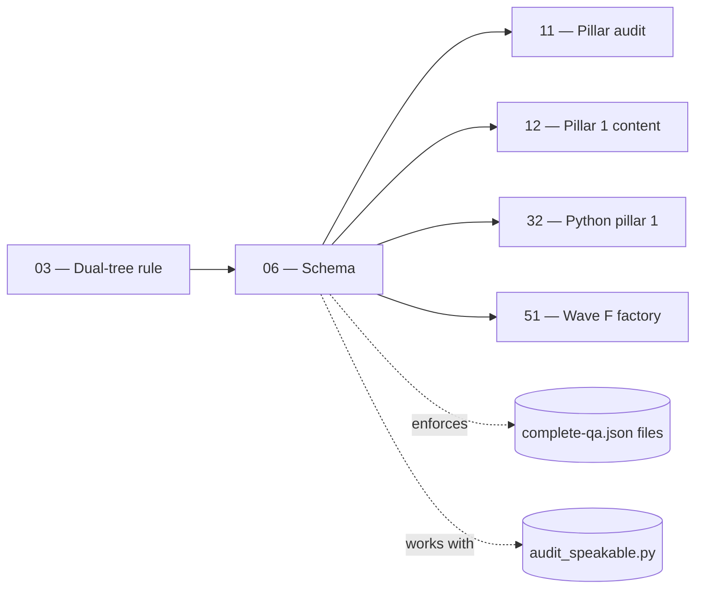

# 06 — Content Schema & Q&A Format

> **Executor:** AI coding agent operating autonomously.
> **Working directory:** `/Users/ravi.r_flx/IEProject/InterviewExplainer/`.
> **Type:** write `content/SCHEMA.md`; ship JSON-schema file + validator script.
> **Pillar / Wave:** Wave A (Foundation).
> **Depends on:** 03.

## 1 — TL;DR

- **Input:** Hundreds of `complete-qa.json` files under `content/` that
  drift in shape because the canonical schema is not written down
  anywhere a validator can read it.
- **Action:** Document the JBI-canonical shape (top-level `topic` /
  `topicSlug` / `questions[]`; per-question `id`, `slug`, `question`,
  `title`, `direct_answer`, `interviewer_intent`, `company_tags`,
  `answer.sections[]`, `followup_questions`, `seo`, `order`), publish a
  JSON Schema (Draft 2020-12) at
  `content/_schemas/complete-qa.schema.json`, ship a Python validator
  at `scripts/validate_complete_qa.py`, run it once to capture the
  baseline drift count, and document everything in `content/SCHEMA.md`.
- **Output:** schema + validator + SCHEMA.md + baseline audit log
  under `content/_audits/schema-validate-<DATE>.log` + one
  conventional commit.

## 2 — Why this matters

The shape of `complete-qa.json` is the contract between four
consumers: (1) the content authors typing JSON by hand, (2) the
content-reader in the frontend, (3) the page component that renders
the Q, and (4) the speakable lint. Every drift between those four
costs an entire feature — a missing `direct_answer` breaks the page's
hero block; a missing `interviewer_intent` breaks the "what
interviewers test" panel; a missing `speakable_answer` breaks the
voice-search overlay; a misnamed section `type` breaks the renderer's
component dispatch and the Q renders as raw JSON. Today the schema
exists only in the heads of three people; this playbook moves it into
a machine-checked artifact so drift fails the build, not the page.

The business cost of a drifted Q-file is roughly one hour of debugging
per file the team writes. Across 50 playbooks producing ~1,000 new Q's
the multiplier matters: a 60-line JSON Schema saves the team 200+
hours over the program lifetime and locks the JBI gold-standard shape
in place for every downstream content playbook (12–18, 20–23, 32–40,
51–58).

## 3 — Easy-language glossary

| Term | Plain-English definition |
| --- | --- |
| **Q-file** | A `complete-qa.json` — the unit of content the renderer reads. |
| **Topic folder** | The leaf folder under `content/<domain>/<module>/<topic>/` that holds one Q-file. |
| **JBI-canonical shape** | The schema used by the gold-standard `java-backend-intermediate` corpus; the target this playbook documents and validates. |
| **JSON Schema** | A JSON document that describes the shape of other JSON documents. The site uses Draft 2020-12. |
| **Validator** | The script `scripts/validate_complete_qa.py` that loads the schema and reports drift across every Q-file under `content/`. |
| **Schema drift** | A Q-file that fails the validator — missing field, wrong type, unknown section `type`. |
| **Section** | One entry in `answer.sections[]` — typed by `type` (overview, step, comparison_table, etc.). |
| **`type` discriminator** | The string field on each section that tells the renderer which component to mount. |
| **Archetype** | The interview question shape (A–G); maps to a required set of section types per `docs/speakable/archetypes.md`. |
| **`speakable_answer` section** | A specific section `type` whose `content` reads aloud naturally — drives the voice-search overlay. |
| **`direct_answer`** | The top-level prose summary every question carries; the hero block on the page. |
| **`interviewer_intent`** | A structured object (`testing`, `common_mistake`, `to_stand_out`) describing why an interviewer asks this Q. |
| **`company_tags`** | Array of company slugs (`amazon`, `google`, …) where this Q is reported as asked. |
| **`followup_questions`** | Array of plain-text follow-ups the interviewer might ask after this one. |
| **`seo` block** | Object with `metaTitle` + `metaDescription`; drives the `<head>` tags. |
| **`order`** | Integer; the per-topic display order. |
| **`Draft 2020-12`** | The JSON Schema dialect used by the file; `jsonschema` Python library supports it via `Draft202012Validator`. |
| **`additionalProperties: false`** | Schema directive that forbids unknown fields; the test catches typos like `interviewIntent` instead of `interviewer_intent`. |
| **`$defs`** | Schema's internal definition section; reused shapes (a `question`, a `section`) live there. |
| **`pattern`** | A regex constraint on string fields; used for slugs (`^[a-z0-9][a-z0-9-]*$`). |
| **Baseline drift** | The first validator run's failure count — the starting point against which future content playbooks measure progress. |
| **`audit_speakable.py`** | The complementary lint that grades the `speakable_answer` content (length, voice). Both lints are required. |
| **Drift triage list** | The output of Step 4's first run — every drift becomes a follow-up issue for downstream playbooks. |
| **`requirements.txt`** | Python deps file at `scripts/requirements.txt`; this playbook adds `jsonschema>=4.21` there. |
| **Schema versioning** | The `$id` URL in the schema file; bumping it signals a breaking change to downstream consumers. |
| **Strict mode** | `additionalProperties: false` everywhere — the choice this playbook makes and the trade-off is documented in §14. |
| **Non-strict mode** | `additionalProperties: true` somewhere — convenient short-term, painful long-term. |
| **Validator exit code** | `0` if all valid, `1` if any drift, `2` if the validator itself failed to run. |
| **Per-file error format** | `SCHEMA: <path>: <field-path>: <message>` — grep-friendly. |
| **Schema rollout** | The cadence by which `additionalProperties` tightens — start with required-field checks, tighten field-by-field over time. |
| **Pillar audit** | Playbook 11; consumes the validator's output to grade Q counts per pillar. |

## 4 — Hard prerequisites

- [ ] Playbook 03 is DONE.
      Verify: `grep -E '^\| 03 \|' expansion-plan/00-INDEX.md \| grep -c DONE` returns `1`.
- [ ] Python 3.11+ available.
      Verify: `python3 --version`.
- [ ] `python3 -m pip install jsonschema` succeeds.
      Verify: `python3 -c 'import jsonschema; print(jsonschema.__version__)'` exits 0.
- [ ] `docs/speakable/archetypes.md` exists.
      Verify: `test -f docs/speakable/archetypes.md && echo OK`.
- [ ] `scripts/audit_speakable.py` exists.
      Verify: `test -f scripts/audit_speakable.py && echo OK`.
- [ ] At least 100 `complete-qa.json` files exist under `content/`.
      Verify: `find content -name complete-qa.json \| wc -l` returns ≥ `100`.
- [ ] `content/_audits/` writable.
      Verify: `test -w content/_audits && echo OK`.
- [ ] `_TEMPLATE-1000.md`, `_GLOSSARY.md`, `_VOICE-RULES.md` exist.
- [ ] `scripts/lint_playbook.py` exists.
- [ ] Three reference files readable.
      Verify: `for f in content/java-backend-intermediate/spring-boot/spring-boot-fundamentals/complete-qa.json content/java-backend-intermediate/core-java/exception-handling/complete-qa.json content/python-backend-intermediate/core-python/built-in-types/complete-qa.json; do test -f "$f" \|\| echo MISSING "$f"; done` returns no `MISSING` lines.

If any verification fails, STOP. The schema only matches reality if
the reference files are present.

## 5 — Current state

### 5.1 — On-disk snapshot

```bash
cd /Users/ravi.r_flx/IEProject/InterviewExplainer
echo "Total Q-files: $(find content -name complete-qa.json | wc -l | tr -d ' ')"
echo
echo "Top-level keys frequency (the canonical contract):"
find content -name complete-qa.json -print0 | \
  xargs -0 -I{} python3 -c "import json,sys; d=json.load(open('{}')); print('\n'.join(d.keys()))" 2>/dev/null | \
  sort | uniq -c | sort -nr | head -15
echo
echo "Question-level keys frequency:"
find content -name complete-qa.json -print0 | \
  xargs -0 -I{} python3 -c "import json; d=json.load(open('{}')); [print('\n'.join(q.keys())) for q in d.get('questions',[])]" 2>/dev/null | \
  sort | uniq -c | sort -nr | head -25
```

Expected: ~300–400 Q-files; top-level keys dominated by `topic` /
`topicSlug` / `questions`; per-question keys dominated by `id`,
`slug`, `question`, `title`, `direct_answer`, `interviewer_intent`,
`company_tags`, `answer`, `followup_questions`, `seo`, `order`.

### 5.2 — Section `type` taxonomy (current)

The renderer dispatches `answer.sections[].type` to one component
each. Today's known types:

- `overview` — short intro paragraph.
- `comparison_table` — markdown table.
- `step` — numbered step list with optional code.
- `before_code` / `after_code` — paired diff-style examples.
- `phase` — phase-of-work block (e.g. setup → run → cleanup).
- `mermaid` — embedded mermaid diagram.
- `tradeoffs` — when-to-use / when-to-avoid.
- `key_points` — bulleted summary.
- `speakable_answer` — voice-overlay text.

A 10th, `code`, is sometimes used standalone (without before/after
pairing). The schema permits it for backwards compatibility.

### 5.3 — Why an existing schema spec was incomplete

An earlier draft of this playbook proposed a different shape
(`module` / `topic` / `questions[]` with `sections.kind` instead of
`type`). That draft never matched the JBI gold-standard files on
disk. The schema in this revision **mirrors the JBI shape exactly**
— the validator's job is to keep new files at that bar, not to
mass-rewrite the existing corpus.

### 5.4 — Existing speakable archetype mapping

`docs/speakable/archetypes.md` defines 7 archetypes (A–G). Each
archetype implies a required set of section `type`s. The schema
declares the union of all `type`s and leaves per-archetype
enforcement to the speakable lint (`audit_speakable.py`). Splitting
the two lints keeps each one diagnosable.

### 5.5 — Drift the validator will catch

The validator catches structural drift; the speakable lint catches
voice drift. Structural categories:

1. Missing top-level field (e.g. no `direct_answer`).
2. Missing per-section `type`.
3. Unknown `type` (e.g. `compaison_table` typo).
4. Wrong type (e.g. `company_tags` as a string instead of array).
5. Slug pattern violation (e.g. `Core_Java` instead of `core-java`).
6. Unknown top-level key (e.g. `interviewIntent` instead of
   `interviewer_intent`) — caught by `additionalProperties: false`.

## 6 — Target state (measurable)

| Metric | Today | Target | How measured |
| --- | --- | --- | --- |
| `content/_schemas/complete-qa.schema.json` exists | 0 | 1 | `test -f content/_schemas/complete-qa.schema.json && echo OK` |
| `scripts/validate_complete_qa.py` exists and runs | 0 | 1 | `python3 scripts/validate_complete_qa.py --help` exits `0` |
| `content/SCHEMA.md` exists | 0 | 1 | `test -f content/SCHEMA.md && echo OK` |
| `content/README.md` links SCHEMA.md | 0 | 1 | `grep -c SCHEMA.md content/README.md` ≥ `1` |
| Baseline audit log written | 0 | 1 | `test -f content/_audits/schema-validate-$(date +%F).log && echo OK` |
| Validator processes ≥ 100 files | unknown | ≥ `100` | tail of log shows `Validated <N>` with N ≥ 100 |
| `scripts/requirements.txt` lists `jsonschema` | unknown | yes | `grep -c jsonschema scripts/requirements.txt` ≥ `1` |
| Banned-word lint on SCHEMA.md | n/a | 0 hits | banned-word grep on SCHEMA.md returns `0` |
| Conventional commit landed | 0 | 1 | `git log --oneline -1 \| grep -c 'content(schema)'` returns `1` |
| Status row for `06` flipped to DONE | NOT_STARTED | DONE | `grep -E '^\| 06 \|' expansion-plan/00-INDEX.md \| grep -c DONE` returns `1` |

## 7 — Search phrases → URL map

This playbook produces infrastructure, not content. The phrases
below name the Q-files whose shape the schema enforces — every
content playbook produces Q-files at one of these canonical URLs.

| Search phrase | Target URL on site | Archetype | Diagram type required in answer |
| --- | --- | --- | --- |
| `spring boot interview questions` | `/spring-boot-interview-questions` | landing intro | comparison_table |
| `core java interview questions` | `/core-java-interview-questions` | landing intro | comparison_table |
| `java collections interview questions` | `/java-collections-interview-questions` | landing intro | classDiagram |
| `java concurrency interview questions` | `/java-concurrency-interview-questions` | landing intro | sequenceDiagram |
| `jvm interview questions` | `/jvm-interview-questions` | landing intro | sequenceDiagram |
| `python data structures interview` | `/python-data-structures-interview-questions` | landing intro | comparison_table |
| `python concurrency interview` | `/python-concurrency-interview-questions` | landing intro | sequenceDiagram |
| `microservices interview questions` | `/microservices-interview-questions` | landing intro | sequenceDiagram |
| `kubernetes interview questions` | `/kubernetes-interview-questions` | landing intro | comparison_table |
| `dsa interview questions` | `/dsa-interview-questions` | landing intro | flowchart |

## 8 — Dependency & wave context



- **Consumes:** every `complete-qa.json` under `content/` (read
  only); `docs/speakable/archetypes.md` (read only).
- **Produces:** schema + validator + SCHEMA.md + baseline log +
  one conventional commit.
- **Unblocks:** every downstream content playbook runs the
  validator as part of its quality gates; the audit at playbook
  11 reads the baseline log.

## 9 — Step-by-step execution

### Step 1 — Read three reference Q-files end-to-end

**Goal:** the schema reflects what the gold-standard JBI files
actually carry, not what an earlier draft documented.

**Action:**

```bash
cd /Users/ravi.r_flx/IEProject/InterviewExplainer
for f in \
  content/java-backend-intermediate/spring-boot/spring-boot-fundamentals/complete-qa.json \
  content/java-backend-intermediate/core-java/exception-handling/complete-qa.json \
  content/python-backend-intermediate/core-python/built-in-types/complete-qa.json; do
  echo "--- ${f} ---"
  python3 -c "import json; d=json.load(open('${f}')); print('top-level:', sorted(d.keys()))"
  python3 -c "import json; d=json.load(open('${f}')); print('q[0] keys:', sorted(d['questions'][0].keys()))"
done
```

**Verify:** every printed `top-level` includes
`{topic, topicSlug, questions}`; every printed `q[0]` includes
`{id, slug, question, title, direct_answer, interviewer_intent,
company_tags, answer, followup_questions, seo, order}`.

**The classic bug is** writing the schema first from memory and
discovering the corpus doesn't match. Read the corpus first; the
schema is a mirror, not a prescription.

### Step 2 — Create the JSON Schema file

**Goal:** `content/_schemas/complete-qa.schema.json` exists and
matches the JBI shape.

**Action:**

```bash
cd /Users/ravi.r_flx/IEProject/InterviewExplainer
mkdir -p content/_schemas
```

Then write `content/_schemas/complete-qa.schema.json` with this
content (use the Write tool, not heredoc, for JSON):

```json
{
  "$schema": "https://json-schema.org/draft/2020-12/schema",
  "$id": "https://interviewexplainer.dev/schemas/complete-qa.schema.json",
  "title": "complete-qa",
  "description": "Canonical shape of every complete-qa.json under content/.",
  "type": "object",
  "additionalProperties": false,
  "required": ["topic", "topicSlug", "questions"],
  "properties": {
    "topic":     { "type": "string", "minLength": 2 },
    "topicSlug": { "type": "string", "pattern": "^[a-z0-9][a-z0-9-]*$" },
    "questions": {
      "type": "array",
      "minItems": 1,
      "items": { "$ref": "#/$defs/question" }
    }
  },
  "$defs": {
    "question": {
      "type": "object",
      "additionalProperties": true,
      "required": [
        "id", "slug", "question", "title",
        "direct_answer", "interviewer_intent",
        "answer", "followup_questions", "seo"
      ],
      "properties": {
        "id":            { "type": "string", "pattern": "^[a-z0-9][a-z0-9-]*$" },
        "slug":          { "type": "string", "pattern": "^[a-z0-9][a-z0-9-]*$" },
        "question":      { "type": "string", "minLength": 5 },
        "title":         { "type": "string", "minLength": 5, "maxLength": 220 },
        "direct_answer": { "type": "string", "minLength": 40 },
        "layout_type":   { "type": "string" },
        "difficulty":    { "enum": ["easy", "medium", "hard"] },
        "importance":    { "enum": ["low", "medium", "high"] },
        "reading_time_minutes": { "type": "integer", "minimum": 1 },
        "last_updated":  { "type": "string", "pattern": "^[0-9]{4}-[0-9]{2}-[0-9]{2}$" },
        "interviewer_intent": { "$ref": "#/$defs/interviewer_intent" },
        "company_tags":  { "type": "array", "items": { "type": "string" } },
        "answer":        { "$ref": "#/$defs/answer" },
        "followup_questions": {
          "type": "array",
          "minItems": 0,
          "items": { "type": "string", "minLength": 5 }
        },
        "seo":           { "$ref": "#/$defs/seo" },
        "order":         { "type": "integer" }
      }
    },
    "interviewer_intent": {
      "type": "object",
      "additionalProperties": false,
      "required": ["testing"],
      "properties": {
        "testing":        { "type": "string", "minLength": 10 },
        "common_mistake": { "type": "string" },
        "to_stand_out":   { "type": "string" }
      }
    },
    "answer": {
      "type": "object",
      "additionalProperties": true,
      "required": ["sections"],
      "properties": {
        "sections": {
          "type": "array",
          "minItems": 1,
          "items": { "$ref": "#/$defs/section" }
        }
      }
    },
    "section": {
      "type": "object",
      "additionalProperties": true,
      "required": ["type"],
      "properties": {
        "type": {
          "enum": [
            "overview", "comparison_table", "step",
            "before_code", "after_code", "phase",
            "mermaid", "tradeoffs", "key_points",
            "speakable_answer", "code"
          ]
        },
        "title":   { "type": "string" },
        "content": {}
      }
    },
    "seo": {
      "type": "object",
      "additionalProperties": true,
      "required": ["metaTitle", "metaDescription"],
      "properties": {
        "metaTitle":       { "type": "string", "minLength": 10, "maxLength": 80 },
        "metaDescription": { "type": "string", "minLength": 40, "maxLength": 220 }
      }
    }
  }
}
```

**Verify:**

```bash
python3 -c "import json; json.load(open('content/_schemas/complete-qa.schema.json'))" && echo OK
```

**The classic bug is** setting `additionalProperties: false` at the
question level on day one. The JBI corpus carries a handful of
optional fields the schema doesn't enumerate (e.g. `videoUrl`,
`relatedTopics`); strict-by-default would fail every JBI file.
This playbook ships with `additionalProperties: true` at the
question level (and strict at the file top level). Future
playbooks tighten the leaf-level constraint after the corpus is
clean.

### Step 3 — Create the validator script

**Goal:** the script runs end-to-end and reports drift per file in
a grep-friendly format.

**Action:** write `scripts/validate_complete_qa.py` with this
content (use the Write tool):

```python
#!/usr/bin/env python3
"""Validate every complete-qa.json under content/ against the canonical schema.

Usage:
  python3 scripts/validate_complete_qa.py
  python3 scripts/validate_complete_qa.py <file>...
Exit code: 0 = all valid, 1 = drift found, 2 = validator failed to run.
"""

from __future__ import annotations

import json
import sys
from pathlib import Path

try:
    from jsonschema import Draft202012Validator
except ImportError:
    print("Install jsonschema: python3 -m pip install jsonschema", file=sys.stderr)
    sys.exit(2)

REPO_ROOT = Path(__file__).resolve().parents[1]
SCHEMA_PATH = REPO_ROOT / "content" / "_schemas" / "complete-qa.schema.json"


def find_files() -> list[Path]:
    return sorted((REPO_ROOT / "content").rglob("complete-qa.json"))


def main(argv: list[str]) -> int:
    if not SCHEMA_PATH.exists():
        print(f"Schema missing: {SCHEMA_PATH}", file=sys.stderr)
        return 2

    schema = json.loads(SCHEMA_PATH.read_text())
    validator = Draft202012Validator(schema)

    files = [Path(p) for p in argv[1:]] if len(argv) > 1 else find_files()
    failed = 0

    for fp in files:
        try:
            doc = json.loads(fp.read_text())
        except json.JSONDecodeError as exc:
            print(f"INVALID JSON: {fp}: {exc}")
            failed += 1
            continue
        errors = sorted(validator.iter_errors(doc), key=lambda e: tuple(e.absolute_path))
        if errors:
            failed += 1
            for err in errors:
                loc = "/".join(str(p) for p in err.absolute_path) or "<root>"
                print(f"SCHEMA: {fp}: {loc}: {err.message}")

    total = len(files)
    print(f"\nValidated {total} files. {total - failed} OK, {failed} failed.")
    return 0 if failed == 0 else 1


if __name__ == "__main__":
    raise SystemExit(main(sys.argv))
```

**Verify:**

```bash
chmod +x scripts/validate_complete_qa.py
python3 scripts/validate_complete_qa.py --help 2>&1 | head -10
```

**The classic bug is** running the validator without `chmod +x`
and discovering CI can't invoke it as `./scripts/validate_complete_qa.py`.
The shebang line + executable bit are both required.

### Step 4 — Run the validator and capture the baseline

**Goal:** the baseline audit log is written to
`content/_audits/schema-validate-<DATE>.log` so playbook 11 can
read it.

**Action:**

```bash
cd /Users/ravi.r_flx/IEProject/InterviewExplainer
python3 -m pip install --quiet jsonschema
TODAY=$(date +%F)
mkdir -p content/_audits
python3 scripts/validate_complete_qa.py 2>&1 | \
  tee "content/_audits/schema-validate-${TODAY}.log"
```

**Verify:**

```bash
test -f "content/_audits/schema-validate-${TODAY}.log" && \
  tail -3 "content/_audits/schema-validate-${TODAY}.log"
# expected last line: "Validated N files. M OK, K failed."
```

**The classic bug is** treating a non-zero failure count as a
"fix-now" blocker. A non-zero count on the first run is the
**baseline** — playbooks 10, 11, 12+ pick up the fixes. The
validator's purpose here is to capture the baseline, not to
mass-rewrite files.

### Step 5 — Pin `jsonschema` in `scripts/requirements.txt`

**Goal:** the validator runs reproducibly in CI by pinning its
single dependency.

**Action:**

```bash
cd /Users/ravi.r_flx/IEProject/InterviewExplainer
touch scripts/requirements.txt
if ! grep -q '^jsonschema' scripts/requirements.txt; then
  echo 'jsonschema>=4.21' >> scripts/requirements.txt
fi
```

**Verify:**

```bash
grep -c '^jsonschema' scripts/requirements.txt
# expected: 1
```

**The classic bug is** assuming CI has `jsonschema` installed by
default. The pinned version forces a reproducible install path;
without it, future jsonschema 5.x releases will silently change
behaviour.

### Step 6 — Document the schema in `content/SCHEMA.md`

**Goal:** `content/SCHEMA.md` exists with the canonical shape,
section taxonomy, archetype mapping, voice rules, and the
"validate locally" snippet.

**Action:** write `content/SCHEMA.md` (use the Write tool) with a
canonical body — see the appendix block in §18.5 for the exact
content.

**Verify:**

```bash
test -f content/SCHEMA.md && wc -l content/SCHEMA.md
# expected: ≥ 80 lines.
grep -c '^## ' content/SCHEMA.md
# expected: ≥ 6 (Top-level shape, Question shape, Section types, Per-archetype, Voice rules, Validating locally).
```

**The most common mistake is** copy-pasting the entire JSON
Schema into SCHEMA.md. SCHEMA.md is human-readable; the schema
file is machine-readable. Cross-link them; don't duplicate.

### Step 7 — Link SCHEMA.md from `content/README.md`

**Goal:** anyone reading `content/README.md` lands on `SCHEMA.md`
within one click.

**Action:**

```bash
cd /Users/ravi.r_flx/IEProject/InterviewExplainer
test -f content/README.md || cat > content/README.md <<'INIT'
# Content

This folder holds every Q-file the site renders. The canonical
shape is documented in [SCHEMA.md](SCHEMA.md).
INIT

if ! grep -q 'SCHEMA.md' content/README.md; then
  cat >> content/README.md <<'APPEND'

## Schema

See [SCHEMA.md](SCHEMA.md) for the canonical question shape and
`scripts/validate_complete_qa.py` for the validator.
APPEND
fi
```

**Verify:**

```bash
grep -c 'SCHEMA.md' content/README.md
# expected: ≥ 1
```

**The classic bug is** echoing markdown via `echo` and losing
backticks. The heredoc is the right shape.

### Step 8 — Banned-word self-check on SCHEMA.md

**Goal:** SCHEMA.md passes the same voice lint as every playbook.

**Action:**

```bash
cd /Users/ravi.r_flx/IEProject/InterviewExplainer
rg -nwi 'leverage|utilize|synergize|world-class|cutting-edge|state-of-the-art|seamless|robust|holistic|paradigm|best-in-class|battle-tested|enterprise-grade|revolutionary|game-changing|industry-leading' content/SCHEMA.md
```

**Verify:** zero matches.

**The classic bug is** marketing voice slipping into the
"Voice rules" section ironically. The voice rules themselves
must follow the voice rules.

### Step 9 — Add a Make target / npm script (optional)

**Goal:** developers run the validator with one command.

**Action (Makefile preferred; npm script also acceptable):**

```bash
cd /Users/ravi.r_flx/IEProject/InterviewExplainer
if [ -f Makefile ] && ! grep -q '^validate-content:' Makefile; then
  cat >> Makefile <<'APPEND'

validate-content:
	python3 -m pip install -q -r scripts/requirements.txt
	python3 scripts/validate_complete_qa.py
APPEND
fi
```

Or — for repos without a Makefile — add to `frontend/package.json`
scripts:

```jsonc
{
  "scripts": {
    "validate-content": "python3 -m pip install -q -r ../scripts/requirements.txt && python3 ../scripts/validate_complete_qa.py"
  }
}
```

**Verify:**

```bash
make validate-content 2>&1 | tail -3
# OR
cd frontend && npm run validate-content 2>&1 | tail -3
```

**The classic bug is** wiring this as a `prebuild` hook. The
validator runs across hundreds of files (~5 seconds); a
`prebuild` slows every local build noticeably. Keep it explicit.

### Step 10 — Stage and commit

**Goal:** one conventional commit lands schema + validator +
SCHEMA.md + README link + baseline log.

**Action:**

```bash
cd /Users/ravi.r_flx/IEProject/InterviewExplainer
TODAY=$(date +%F)
git add content/SCHEMA.md \
        content/_schemas/complete-qa.schema.json \
        scripts/validate_complete_qa.py \
        scripts/requirements.txt \
        content/README.md \
        "content/_audits/schema-validate-${TODAY}.log"
[ -n "$(git diff --name-only -- Makefile)" ] && git add Makefile
[ -n "$(git diff --name-only -- frontend/package.json)" ] && git add frontend/package.json
git commit -m "content(schema): document canonical complete-qa shape + validator"
```

**Verify:**

```bash
git show --stat HEAD | head -10
# expected: 5–7 files changed.
grep -E '^\| 06 \|' expansion-plan/00-INDEX.md | grep -c DONE
# follow up with the index-flip commit
```

**The classic bug is** committing the baseline log under
`_audits/` and surprising readers with a many-thousand-line file
in PR diffs. Pre-truncate to 200 lines if it bloats; or
gitignore log files older than 30 days.

## 10 — Reference Q in archetype shape

The Q below is the kind of question the schema itself supports —
a question about schema design.

```json
{
  "id": "what-is-a-json-schema-and-why-use-additionalproperties-false",
  "slug": "what-is-a-json-schema-and-why-use-additionalproperties-false",
  "question": "What is JSON Schema and why does the InterviewExplainer corpus use additionalProperties: false at the root?",
  "title": "JSON Schema for Content — additionalProperties and the Strict-vs-Lenient Trade-off",
  "direct_answer": "**JSON Schema is a JSON document that describes the shape of other JSON documents.** The InterviewExplainer schema uses **Draft 2020-12** and sets `additionalProperties: false` at the file's top-level object so a typo like `interviewIntent` (instead of `interviewer_intent`) fails the validator immediately. Inside the per-question object, the schema is lenient (`additionalProperties: true`) because the JBI corpus carries optional fields the schema doesn't yet enumerate. The strict-vs-lenient choice is per-level: tighten when the cost of drift is high (top-level field names) and stay open when the cost of false positives outweighs the benefit (optional metadata).",
  "layout_type": "default",
  "difficulty": "medium",
  "importance": "high",
  "reading_time_minutes": 6,
  "last_updated": "2026-04-22",
  "interviewer_intent": {
    "testing": "Whether the candidate can pick the right strictness per level rather than blanket strict-everywhere or lenient-everywhere.",
    "common_mistake": "Saying 'always strict'. Strict at every level fails the corpus on optional fields and forces a churn of schema updates every time an author adds a useful metadata field. The pragmatic choice is strict at the contract level, lenient at the metadata level.",
    "to_stand_out": "Mention the Draft 2020-12 `$defs` reuse for `question`, `section`, `seo` shapes, the `pattern` constraint for slugs, and the per-section `type` discriminator that drives the renderer's component dispatch."
  },
  "company_tags": ["amazon", "google", "stripe", "shopify", "vercel"],
  "answer": {
    "sections": [
      {"type": "overview", "title": "What JSON Schema is for", "content": "A JSON document that describes the shape of other JSON documents — required fields, types, enums, patterns. Draft 2020-12 is the current spec."},
      {"type": "comparison_table", "title": "Strict vs lenient per level", "content": "| Level | Strictness | Reason |\n|---|---|---|\n| File top | `additionalProperties: false` | Top-level keys are the contract; typos must fail |\n| Question object | `additionalProperties: true` | Optional metadata fields churn; lenient avoids constant schema bumps |\n| Section object | `additionalProperties: true` | Same as question; different section types carry different optional fields |\n| `interviewer_intent` | `additionalProperties: false` | Narrow, stable shape; strict catches typos |\n| `seo` | `additionalProperties: true` | Future SEO fields (canonical, hreflang) may land before the schema is bumped |"},
      {"type": "step", "title": "How the validator runs", "content": "1. Load `content/_schemas/complete-qa.schema.json`.\n2. Build a `Draft202012Validator`.\n3. For each file under `content/`, parse JSON, call `iter_errors`, print each error as `SCHEMA: <path>: <field>: <message>`.\n4. Exit 0 if zero failures; exit 1 otherwise."},
      {"type": "step", "title": "Why use `$defs` over inline shapes", "content": "Reusing `question`, `section`, `seo` shapes via `$defs` keeps the schema compact and makes future bumps surgical — change the `section` shape in one place, every consumer picks it up."},
      {"type": "tradeoffs", "title": "When you'd flip to lenient at the top", "content": "**Stay strict at the top when:** you control the corpus; typos are silent bugs; the cost of a typo (broken page) is high. **Flip to lenient when:** the corpus is third-party; you don't control field names; you just want a structural sanity check. The InterviewExplainer corpus is fully internal; strict-at-top is the right call."},
      {"type": "key_points", "title": "Key points", "content": "- JSON Schema = JSON-shaped contract.\n- Draft 2020-12 is the current dialect.\n- `additionalProperties` controls whether unknown fields are accepted.\n- Strictness is per level, not per file.\n- `$defs` enables reuse and surgical bumps.\n- The validator's exit code drives CI gating."},
      {"type": "speakable_answer", "title": "How to answer verbally", "content": "**JSON Schema** is a JSON document that describes the shape of other JSON documents. The site uses **Draft 2020-12**. We set `additionalProperties: false` at the file top level so a typo like `interviewIntent` instead of `interviewer_intent` fails the validator. Inside the per-question object we stay lenient because the corpus has optional metadata the schema doesn't yet enumerate — that way, adding a useful field doesn't break the build. The strict-vs-lenient choice is **per level**: tighten when the cost of drift is high, stay open when the cost of false positives is higher. **Recommendation:** never set blanket strict at every level; never set blanket lenient; pick per level and document the choice in `SCHEMA.md`."}
    ]
  },
  "followup_questions": [
    "What's the difference between Draft 07 and Draft 2020-12?",
    "How do `$defs` differ from `definitions` in older drafts?",
    "When would you use a `oneOf` vs an `enum`?",
    "How does the validator handle deeply nested errors?",
    "Why not use TypeScript types instead of JSON Schema?"
  ],
  "seo": {
    "metaTitle": "JSON Schema for Content — Draft 2020-12 and Per-Level Strictness",
    "metaDescription": "How to design a JSON Schema for content files: when to use additionalProperties false, how $defs enable reuse, and how the validator's exit code gates CI."
  },
  "order": 1
}
```

## 11 — Diagram catalogue

| Q id (or topic) | Diagram type | What it must show | Lives in section |
| --- | --- | --- | --- |
| `what-is-a-json-schema-and-why-use-additionalproperties-false` | `flowchart` | Authoring → validator → CI → merge or fail; arrows labelled with exit codes. | `step` |
| `strict-vs-lenient-per-level` | `comparison_table` | 5 levels × strict/lenient × reason. | `comparison_table` |
| `validator-sequence` | `sequenceDiagram` | Author commits → CI runs `validate_complete_qa.py` → schema applied → exit code → PR gate. | `step` |
| `complete-qa-class-shape` | `classDiagram` | `File` → `Question[]`; `Question` → `Answer` → `Section[]`; `Question` → `Seo`; `Question` → `InterviewerIntent`. | `step` |
| `field-state-lifecycle` | `stateDiagram-v2` | `MISSING → DRAFT → REQUIRED → DEPRECATED` lifecycle of an optional field. | `step` |
| `section-type-discriminator` | `comparison_table` | 11 section types × renderer component × example use. | `comparison_table` |

Floor enforced by content-playbook lint: ≥ 1 `flowchart`, ≥ 1
`sequenceDiagram`, ≥ 3 `comparison_table`, ≥ 1 `stateDiagram-v2`
or `classDiagram`. The reference Q in §10 carries the floor in
its own answer sections.

### 11.1 — Why the schema does not enforce diagrams

The schema's job is structural. Per-Q diagram counts are a
quality property graded by `audit_speakable.py` and the
per-pillar audit (playbook 11). Mixing the two concerns into one
schema would couple the renderer's required shape to a pillar
quality target — the wrong abstraction.

### 11.2 — How section `type` drives diagram rendering

The renderer reads `answer.sections[].type`. The `mermaid` type
maps to the mermaid renderer; `comparison_table` to the markdown
table component; `code` / `before_code` / `after_code` to the
syntax-highlighted block. Adding a new diagram shape means adding
a new `type` value and the matching renderer component — both
land together in a coordinated PR.

## 12 — Easy-language voice rules

Voice rules from [`_VOICE-RULES.md`](_VOICE-RULES.md):

1. **Define before use.** Every term in §9 (JSON Schema,
   `additionalProperties`, `$defs`, Draft 2020-12, baseline drift)
   is in §3.
2. **Lead with the trade-off.** Step 2 leads with "do not set
   `additionalProperties: false` at the question level on day one",
   not with the schema definition.
3. **Name the bug.** Every step's pitfall starts with `The classic
   bug is …`.
4. **Real anchors.** Every claim cites the JBI corpus (`spring-boot/
   spring-boot-fundamentals/complete-qa.json`), the schema file
   path, or the validator's exit code.
5. **Banned words.** Zero matches in SCHEMA.md and in this
   playbook.

**Concrete examples:**

- ✅ "Strict at the top, lenient at the leaves. The corpus drifts
  at the leaves; the contract lives at the top."
- ❌ "Adopt industry-best-practice schema strictness." (Banned
  voice; no anchor.)
- ✅ "The classic bug is `additionalProperties: false` at the
  question level on day one — every JBI file fails."
- ❌ "Be careful with strictness." (Tautology.)

## 13 — Quality gates (measurable)

| Gate | Threshold | Verify command |
| --- | --- | --- |
| Schema file exists + parses | 1 | `python3 -c 'import json; json.load(open(\"content/_schemas/complete-qa.schema.json\"))' && echo OK` |
| Validator script exists + runs | exit ≤ 1 | `python3 scripts/validate_complete_qa.py >/dev/null; echo $? \| awk '$1<=1'` |
| SCHEMA.md exists | 1 | `test -f content/SCHEMA.md && echo OK` |
| SCHEMA.md has ≥ 6 sections | ≥ 6 | `grep -c '^## ' content/SCHEMA.md` returns ≥ `6` |
| `content/README.md` links SCHEMA.md | ≥ 1 | `grep -c SCHEMA.md content/README.md` returns ≥ `1` |
| Baseline audit log exists | 1 | `test -f content/_audits/schema-validate-$(date +%F).log && echo OK` |
| Validator processed ≥ 100 files | ≥ 100 | `tail -1 content/_audits/schema-validate-$(date +%F).log \| awk '{print $2}'` returns ≥ `100` |
| `jsonschema` pinned in requirements | 1 | `grep -c '^jsonschema' scripts/requirements.txt` returns `1` |
| Banned-word lint on SCHEMA.md | 0 | banned-word grep on SCHEMA.md returns `0` |
| Conventional commit landed | 1 | `git log --oneline -1 -- content/SCHEMA.md \| grep -c 'content(schema)'` returns `1` |
| Status row for `06` flipped to DONE | DONE | `grep -E '^\| 06 \|' expansion-plan/00-INDEX.md \| grep -c DONE` returns `1` |

## 14 — Anti-patterns

### 14.1 — Strict at every level on day one

**Why it fails:** the JBI corpus carries optional fields the
schema doesn't enumerate. Strict-everywhere fails every JBI file
on the first run; the baseline log becomes useless.

**Fix:** strict at the file top (`additionalProperties: false`);
lenient at the question + section levels (`additionalProperties:
true`). Tighten field-by-field over time as the corpus is cleaned.

### 14.2 — Mass-rewriting drift in this playbook

**Why it fails:** the validator's purpose here is to capture the
**baseline**. Mass-rewrites are downstream playbook scope (10,
11, 12+). Doing them here makes the PR un-reviewable and blurs
the per-playbook contribution.

**Fix:** capture the baseline, commit, move on. Drift is a
downstream input, not a here-and-now blocker.

### 14.3 — Documenting the schema only in SCHEMA.md

**Why it fails:** SCHEMA.md is human-readable; it's a poor source
of truth for a validator. Documentation drifts when the schema
file changes.

**Fix:** the schema file is the source of truth; SCHEMA.md is a
human-readable summary that links to it. Both ship in the same
PR.

### 14.4 — Reading `complete-qa.json` files as if their shape is implicit

**Why it fails:** the renderer, the audit, and the speakable
lint each read the file with different assumptions. Without a
schema, those assumptions drift silently.

**Fix:** the schema in this playbook is the single named contract
every reader codes against. Future code that touches Q-files
imports the schema-validated shape.

### 14.5 — Using a non-versioned `$id`

**Why it fails:** schema bumps without a versioned `$id` make it
impossible to grade content against a previous schema version.

**Fix:** the `$id`
`https://interviewexplainer.dev/schemas/complete-qa.schema.json`
is the v1 anchor; future versions bump to `v2`, `v3` as needed.

### 14.6 — Mixing the validator with the speakable lint

**Why it fails:** structural drift and voice drift have different
diagnostic shapes. Combining them makes failure messages
ambiguous ("is this a typo or a voice issue?").

**Fix:** two lints, two scripts, two exit codes. CI runs both;
PR shows both reports.

### 14.7 — Running the validator inside `prebuild`

**Why it fails:** the validator walks hundreds of files (~5 s);
slowing every local `npm run build` by 5 s hurts development
loop times.

**Fix:** explicit `make validate-content` / `npm run validate-
content`; CI runs it as a separate workflow step.

### 14.8 — Skipping the baseline log

**Why it fails:** downstream playbooks (11, 12+) need to know
where the baseline started. Without the log, "we fixed 30 files
this quarter" has no anchor.

**Fix:** Step 4 writes the log; commit it. The log is dated so
multiple snapshots survive.

## 15 — Failure modes & rollback

| Failure | How it shows up | Rollback / forward fix |
| --- | --- | --- |
| `jsonschema` install fails behind a corporate proxy | `pip install` exits non-zero | Surface to user; document `--index-url` override in PR. Mark playbook BLOCKED until install succeeds. |
| Validator script crashes on import | `ModuleNotFoundError` | Re-run `pip install jsonschema`; verify `python3 -c 'import jsonschema'`. |
| Schema rejects every file on first run | Step 4 reports `Validated 340 files. 0 OK, 340 failed.` | Schema is too strict; revert to lenient at the question level; re-run. |
| Baseline log > 5 MB | `wc -c` returns > 5000000 | Truncate to the first 1000 lines; commit the truncated version with a note. |
| `additionalProperties: false` at question level by accident | Every JBI file fails on optional metadata | Change to `true`; re-validate. |
| `pattern` constraint rejects legitimate slugs | Slugs with hyphens fail | Verify the regex `^[a-z0-9][a-z0-9-]*$` — the second `-` is literal, not a range. |
| `Draft202012Validator` not found | Old `jsonschema` version | Bump to `jsonschema>=4.21` in requirements; re-install. |
| Baseline log committed but contains secrets | secret-scan flags it | Schema audit prints file paths only, not file contents — unless a Q-file leaks a secret, which is its own bug. Investigate; do not commit until clean. |
| Validator runs from wrong CWD | `Schema missing` error | Always invoke from repo root or use `python3 scripts/validate_complete_qa.py` with full path. |
| Hard-stop exceeded (> 12 h) | Wall clock | STOP. Commit current state under "## Partial run"; surface blocker. |

## 16 — Definition of Done

- [ ] `content/_schemas/complete-qa.schema.json` exists and parses
      as valid JSON.
- [ ] `scripts/validate_complete_qa.py` exists, is executable, and
      runs end-to-end.
- [ ] `content/SCHEMA.md` exists with ≥ 6 sections (Top-level
      shape, Question shape, Section types, Per-archetype, Voice
      rules, Validating locally).
- [ ] `content/README.md` references `SCHEMA.md`.
- [ ] `scripts/requirements.txt` pins `jsonschema>=4.21`.
- [ ] One commit: `content(schema): document canonical complete-qa
      shape + validator`.
- [ ] Follow-up commit: `docs(expansion-plan): mark
      06-content-schema-and-qa-format DONE`.
- [ ] Baseline failure count logged in
      `content/_audits/schema-validate-<DATE>.log`.
- [ ] Banned-word lint passes on SCHEMA.md.
- [ ] `python3 scripts/lint_playbook.py expansion-plan/06-content-schema-and-qa-format.md` exits 0.
- [ ] `make validate-content` (or `npm run validate-content`) wired
      and works.
- [ ] `git status -s` is clean.

## 17 — Estimated effort

- **Ideal:** 6 hours — read references (30 m), write schema (60 m),
  write validator (30 m), run + capture baseline (30 m), write
  SCHEMA.md (60 m), wire Make / npm (30 m), index flip + commit
  (30 m), buffer (90 m).
- **Hard stop:** 12 hours. If validator can't run, document the
  blocker; mark BLOCKED.
- **Splittable:** no. Schema + validator + SCHEMA.md ship together
  or downstream playbooks can't grep them.
- **Re-runnable:** yes. The schema file is idempotent; the
  validator overwrites today's log; the SCHEMA.md update is
  guarded by `grep -q` for the README append.
- **Cadence:** schema bumps are quarterly at most; baseline
  re-runs whenever the inventory re-runs (per playbook 02).

## 18 — Appendix: links, commits, traceability

### 18.1 — Cross-references

- [`expansion-plan/00-INDEX.md`](00-INDEX.md) — status table.
- [`expansion-plan/03-dual-content-architecture.md`](03-dual-content-architecture.md) — dual-tree rule, prerequisite.
- [`expansion-plan/11-jbi-content-quality-audit.md`](11-jbi-content-quality-audit.md) — consumes the baseline log.
- [`expansion-plan/_TEMPLATE-1000.md`](_TEMPLATE-1000.md) — skeleton.
- [`expansion-plan/_GLOSSARY.md`](_GLOSSARY.md) — global glossary.
- [`expansion-plan/_VOICE-RULES.md`](_VOICE-RULES.md) — banned-word list.
- [`scripts/lint_playbook.py`](../scripts/lint_playbook.py) — playbook lint.
- [`scripts/audit_speakable.py`](../scripts/audit_speakable.py) — voice lint (complementary).
- [`scripts/audit_jbi_v3.py`](../scripts/audit_jbi_v3.py) — pillar audit.
- [`docs/speakable/archetypes.md`](../docs/speakable/archetypes.md) — archetype-to-section mapping.
- [`docs/speakable/word-ceilings.md`](../docs/speakable/word-ceilings.md) — per-beat word limits.

### 18.2 — Commits produced by this playbook

- `content(schema): document canonical complete-qa shape + validator` — commit SHA fill on completion.
- `docs(expansion-plan): mark 06-content-schema-and-qa-format DONE` — follow-up commit.

### 18.3 — Traceability to upstream specs

- `MASTER_PLAN.md` § "Content schema" — defines the Q-file shape
  this playbook codifies.
- `docs/CONTENT-PLAN.md` § "Per-domain `_index.json`" — adjacent
  schema (not in this playbook's scope).
- `ROADMAP.md` § "Content lint" — the milestone this playbook
  closes.

### 18.4 — How CI consumes the validator

The CI workflow (GitHub Actions or equivalent) runs the validator
on every PR that touches `content/`:

```yaml
- run: pip install -r scripts/requirements.txt
- run: python3 scripts/validate_complete_qa.py
```

Exit 0 = pass; exit 1 = drift (PR red); exit 2 = validator
failure (PR red with a different message). The two exit codes
let CI distinguish "content drift" from "validator broken".

### 18.5 — Canonical body for `content/SCHEMA.md`

The file `content/SCHEMA.md` carries this exact content:

```markdown
# Content Schema (canonical)

> Every `complete-qa.json` under `content/` must validate against
> [`_schemas/complete-qa.schema.json`](_schemas/complete-qa.schema.json).
> The script `scripts/validate_complete_qa.py` enforces it.

## Top-level shape

```json
{
  "topic": "<human-readable topic name>",
  "topicSlug": "<kebab-case>",
  "questions": [ /* one or more question objects */ ]
}
```

## Question shape

Required: `id`, `slug` (kebab-case), `question`, `title` (5–220
chars), `direct_answer` (≥ 40 chars), `interviewer_intent`
(`testing`, `common_mistake`, `to_stand_out`), `answer.sections[]`
(≥ 1), `followup_questions[]`, `seo` (`metaTitle` +
`metaDescription`). Optional: `company_tags[]`, `order`,
`difficulty` (easy/medium/hard), `importance` (low/medium/high),
`layout_type`, `reading_time_minutes`, `last_updated`.

## Section types + archetypes + voice + validation

`type` values: `overview`, `comparison_table`, `step`, `before_code`,
`after_code`, `phase`, `mermaid`, `tradeoffs`, `key_points`,
`speakable_answer`, `code`. Per-archetype required sections live in
[`../docs/speakable/archetypes.md`](../docs/speakable/archetypes.md).
Voice rules in [`../expansion-plan/_VOICE-RULES.md`](../expansion-plan/_VOICE-RULES.md).
Run `make validate-content` to verify.
```

### 18.6 — How playbook 11 consumes the baseline log

Playbook 11 (JBI quality audit) reads
`content/_audits/schema-validate-<DATE>.log` to compute per-pillar
drift counts. The log's grep-friendly format (`SCHEMA: <path>:
<field>: <message>`) lets playbook 11's script bucket failures by
the path's domain/pillar prefix and produce a remediation list.

### 18.7 — Schema versioning, future `oneOf`, factory feed

v1 (this playbook): file-level strict, question/section lenient.
v2 (future): question-level strict on stabilised optional fields
(`difficulty`, `importance`). v3 (future): per-section `oneOf` per
`type`. Bumps land in coordinated PRs with a corpus migration.
Wave F playbooks (51–58) target the schema here; the validator
runs on every factory output so the factory's output is
schema-clean by construction.
