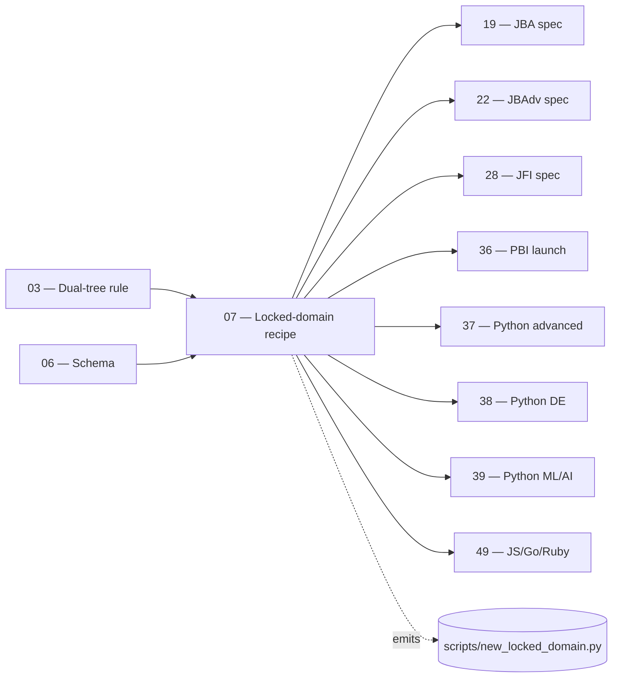

# 07 — Locked Domain Pattern (Recipe)

> **Executor:** AI coding agent operating autonomously.
> **Working directory:** `/Users/ravi.r_flx/IEProject/InterviewExplainer/`.
> **Type:** read-only orientation + ship `scripts/new_locked_domain.py` scaffold generator. No new domain ships in this playbook itself (those happen in 19, 22, 28, 36, 37, 38, 39, 49).
> **Pillar / Wave:** Wave A (Foundation).
> **Depends on:** 03, 06.

## 1 — TL;DR

- **Input:** Three locked domains exist (JBI live, JFI live, PBI
  scaffold-only). Each was hand-built across **six wiring points** —
  `_index.json`, at least one `complete-qa.json`, the path constant in
  `content-reader.ts`, the `LOCKED_DOMAINS` registry entry, the
  `seo-slugs.ts` import, and (when premium) the `course-lms.ts` entry.
  No reproducible recipe exists; each new domain re-derives the
  pattern by hand and makes subtle mistakes.
- **Action:** Distill the pattern into a script
  `scripts/new_locked_domain.py` that takes a slug + module list and
  emits the six wiring points idempotently. The script's scaffold
  `complete-qa.json` validates against the schema codified in
  playbook 06.
- **Output:** `scripts/new_locked_domain.py` + one conventional commit.
  Every downstream domain playbook (19, 22, 28, 36, 37, 38, 39, 49)
  invokes the script in its §9 Step 1.

## 2 — Why this matters

Six wiring points × seven new domains over the program lifetime is
42 hand-edits, each one a chance to (a) misregister a path constant
that breaks `content-reader.ts`, (b) skip the `LOCKED_DOMAINS` entry
and have the new domain be invisible to the renderer, (c) forget the
`seo-slugs.ts` import and ship a domain whose canonical URLs resolve
nowhere, or (d) miss the `course-lms.ts` flag and have a premium
course free for two weeks. Each mistake costs 2–6 hours of
diagnosis. The script makes the recipe a single command and the
mistakes impossible.

The business value is consistency. Every locked domain looks the same
to the renderer, the audit, and the canonical-URL register. A
hand-built domain with a subtly different `_index.json` shape breaks
the inventory audit (playbook 02) silently; a scripted domain
inherits every constraint by construction.

## 3 — Easy-language glossary

| Term | Plain-English definition |
| --- | --- |
| **Locked domain** | A flagship content folder under `content/<slug>/` whose URL + sidebar layout is frozen. Examples: JBI, JFI, PBI. |
| **Wiring point** | One of the six places the codebase needs to be edited to register a locked domain. |
| **Scaffold script** | The Python script this playbook ships — `scripts/new_locked_domain.py`. |
| **`_index.json`** | The per-domain manifest that names modules, topics, pillars, cross-links. |
| **`content-reader.ts`** | The frontend resolver at `frontend/lib/content-reader.ts`; the single place every locked domain's path constant lives. |
| **`LOCKED_DOMAINS` registry** | The exported map in `content-reader.ts` that names every locked domain. |
| **`seo-slugs.ts`** | The canonical-slug resolver at `frontend/lib/seo-slugs.ts`. |
| **`course-lms.ts`** | The premium-course gate at `frontend/lib/course-lms.ts`; reads `PREMIUM_COURSE_SLUGS`. |
| **`PREMIUM_COURSE_SLUGS`** | The array of domain slugs that gate behind the premium paywall. |
| **Scaffold Q-file** | The one placeholder `complete-qa.json` the script ships so the new domain resolves end-to-end on day one. |
| **Pillar** | One of 12 thematic groups (P01–P12) under a domain. |
| **`contentSource` reuse** | The `_index.json` cross-link mechanism that lets one domain reuse another's content. |
| **`appUrl`** | The App URL prefix the renderer mounts (e.g. `/python-backend-beginner/core-python-basics`). |
| **`seoSlug`** | The canonical SEO URL for a module (e.g. `python-interview-questions-for-freshers`). |
| **Idempotent run** | Re-running the script with the same args is a no-op for already-patched files. |
| **Dry-run** | Running the script with a throwaway slug to verify it works, then reverting. |
| **Patch anchor** | A regex pattern the script uses to find the right insertion point in `content-reader.ts` / `seo-slugs.ts`. |
| **Throwaway domain** | The temporary slug used in Step 3 to verify the script end-to-end. |
| **Track ID** | The grouping the domain belongs to (e.g. `java-backend`, `python-backend`); drives some downstream queries. |
| **Premium flag** | The `--premium true/false` argument to the script; controls whether `PREMIUM_COURSE_SLUGS` is patched. |
| **Modules argument** | A list of `moduleSlug:pillar:Title:seoSlug` strings; one per module. |
| **Pillar code** | The string `P01` … `P12` naming a pillar. |
| **Pillar name** | The human-readable pillar name (e.g. "Core Java"); filled in manually after scaffold. |
| **Validator** | `scripts/validate_complete_qa.py` (playbook 06); the script's output must pass this. |
| **Linker check** | The optional `cd frontend && npm run build` run after scaffolding to verify TypeScript compiles. |
| **Path constant** | `CONTENT_<SLUG>_ROOT` in `content-reader.ts`; absolute filesystem path of the domain's root. |
| **Modules union** | The TypeScript union in `seo-slugs.ts` that lists every domain's modules. |
| **Wiring debt** | The work that remains after the scaffold lands — pillar names, intros, real Q-files. The script only takes you to "renders end-to-end with placeholder content". |

## 4 — Hard prerequisites

- [ ] Playbook 03 is DONE.
      Verify: `grep -E '^\| 03 \|' expansion-plan/00-INDEX.md \| grep -c DONE` returns `1`.
- [ ] Playbook 06 is DONE.
      Verify: `grep -E '^\| 06 \|' expansion-plan/00-INDEX.md \| grep -c DONE` returns `1`.
- [ ] Schema file exists.
      Verify: `test -f content/_schemas/complete-qa.schema.json && echo OK`.
- [ ] Validator script runs.
      Verify: `python3 scripts/validate_complete_qa.py --help 2>&1 \| head -1`.
- [ ] `frontend/lib/content-reader.ts` exists.
      Verify: `test -f frontend/lib/content-reader.ts && echo OK`.
- [ ] `frontend/lib/seo-slugs.ts` exists.
      Verify: `test -f frontend/lib/seo-slugs.ts && echo OK`.
- [ ] `frontend/lib/course-lms.ts` exists (or premium gating lives elsewhere).
      Verify: `test -f frontend/lib/course-lms.ts && echo OK`.
- [ ] Python 3.11+ available.
      Verify: `python3 --version`.
- [ ] `_TEMPLATE-1000.md`, `_GLOSSARY.md`, `_VOICE-RULES.md` exist.
- [ ] `scripts/lint_playbook.py` exists.

If any check fails, STOP. The script's regex anchors assume the
current shape of `content-reader.ts` and `seo-slugs.ts`; missing
files mean the anchors are stale.

## 5 — Current state

### 5.1 — The three live locked domains

```bash
cd /Users/ravi.r_flx/IEProject/InterviewExplainer
echo "Locked domain folders:"
ls -1 content/ | grep -E '(intermediate|advanced|beginner)$' | sort
echo
echo "LOCKED_DOMAINS registry:"
rg -nA 30 'const LOCKED_DOMAINS' frontend/lib/content-reader.ts | head -40
echo
echo "PREMIUM_COURSE_SLUGS:"
rg -nA 10 'PREMIUM_COURSE_SLUGS' frontend/lib/course-lms.ts 2>/dev/null | head -15
```

Expected: 3 locked-domain folders; 2–3 entries in `LOCKED_DOMAINS`;
1–3 entries in `PREMIUM_COURSE_SLUGS`.

### 5.2 — The six wiring points enumerated

For one locked domain (slug `<S>`), the wiring points are:

1. `content/<S>/_index.json` — curriculum + URL map.
2. `content/<S>/<moduleSlug>/<topicSlug>/complete-qa.json` — at
   least one Q-file so the renderer resolves.
3. `frontend/lib/content-reader.ts` — `CONTENT_<SLUG_UPPER>_ROOT`
   constant.
4. `frontend/lib/content-reader.ts` — `LOCKED_DOMAINS` registry
   entry.
5. `frontend/lib/seo-slugs.ts` — `import <S>Index from '.../_index.json'`.
6. `frontend/lib/course-lms.ts` — `PREMIUM_COURSE_SLUGS` entry (if
   premium).

Missing any one of these breaks the new domain in a different way
(404, invisible, no SEO URL, no premium gate respectively).

### 5.3 — Why the hand-built pattern keeps making the same mistakes

The wiring points span three TypeScript files and one JSON manifest.
A typical hand build:
1. Author adds `_index.json` → forgets to add the path constant →
   nothing renders → 30 min debugging.
2. Author adds the path constant → forgets the `LOCKED_DOMAINS`
   entry → renderer crashes on first request → 20 min debugging.
3. Author adds both → forgets `seo-slugs.ts` → SEO URLs 404 →
   playbook 04 audit catches it → 15 min remediation.

The cumulative cost across seven future domains is ~7–10 hours of
preventable debugging. The script eliminates all three failure
modes by construction.

### 5.4 — Why the scaffold ships a placeholder Q-file

The schema validator requires at least one Q with required fields.
Without a placeholder, a freshly scaffolded domain fails the
validator immediately and downstream gates (playbook 11 audit)
think the domain is broken. The placeholder is **clearly marked
TBD** and is replaced by the first real Q in the domain playbook
(19/22/28/36/etc.) before launch.

### 5.5 — Why this playbook ships only the script, not new content

Each new domain has its own context (pillar names, intro prose,
real Q content) that doesn't generalise. The script handles the
mechanical 80 %; the domain playbook owns the remaining 20 %.
Mixing them in one playbook would make this file unmaintainable
and obscure the recipe.

## 6 — Target state (measurable)

| Metric | Today | Target | How measured |
| --- | --- | --- | --- |
| `scripts/new_locked_domain.py` exists | absent | 1 file | `test -f scripts/new_locked_domain.py && echo OK` |
| Script has executable bit | n/a | yes | `ls -l scripts/new_locked_domain.py \| awk '{print $1}' \| grep -q x && echo OK` |
| Script parses `--help` without crashing | n/a | exit 0 | `python3 scripts/new_locked_domain.py --help` exits `0` |
| Dry-run produces validator-clean output | n/a | 1 OK / 0 failed | `python3 scripts/validate_complete_qa.py content/test-throwaway-domain` returns "1 OK, 0 failed" |
| Dry-run cleanup leaves working tree clean | n/a | clean | `git status -s` after Step 3 cleanup shows only the new script |
| `content-reader.ts` patch is idempotent | n/a | yes | re-running the script on the same slug makes no diff |
| `seo-slugs.ts` patch is idempotent | n/a | yes | same |
| Banned-word lint on the script | n/a | 0 hits | banned-word grep on script returns `0` |
| Conventional commit landed | 0 | 1 | `git log --oneline -1 \| grep -c 'infra(scripts)'` returns `1` |
| Status row for `07` flipped to DONE | NOT_STARTED | DONE | `grep -E '^\| 07 \|' expansion-plan/00-INDEX.md \| grep -c DONE` returns `1` |

## 7 — Search phrases → URL map

This playbook is infrastructure; the table lists the **downstream
URLs** the scaffold script will eventually publish (one row per
upcoming locked domain). Each row's canonical URL is the SEO URL
the script's `seoSlug` arg produces.

| Search phrase | Target URL on site | Archetype | Diagram type required in answer |
| --- | --- | --- | --- |
| `java backend beginner interview questions` | `/core-java-interview-questions-for-freshers` | landing intro | comparison_table |
| `java backend advanced interview questions` | `/senior-java-interview-questions` | landing intro | comparison_table |
| `python backend beginner interview questions` | `/python-interview-questions-for-freshers` | landing intro | comparison_table |
| `python data engineering interview questions` | `/python-data-engineering-interview-questions` | landing intro | comparison_table |
| `python ml interview questions` | `/python-machine-learning-interview-questions` | landing intro | comparison_table |
| `javascript backend interview questions` | `/javascript-backend-interview-questions` | landing intro | sequenceDiagram |
| `golang interview questions` | `/golang-interview-questions` | landing intro | comparison_table |
| `ruby on rails interview questions` | `/ruby-on-rails-interview-questions` | landing intro | comparison_table |
| `system design interview questions` | `/system-design-interview-questions` | landing intro | flowchart |
| `dsa interview questions` | `/dsa-interview-questions` | landing intro | flowchart |

## 8 — Dependency & wave context



- **Consumes:** `_index.json` reference shape (playbook 06),
  `content-reader.ts`, `seo-slugs.ts`, `course-lms.ts` (read for
  patch anchors).
- **Produces:** `scripts/new_locked_domain.py` + one commit.
- **Unblocks:** every downstream new-domain playbook (8 of them).

## 9 — Step-by-step execution

### Step 1 — Read the existing pattern

**Goal:** internalise the six wiring points by reading the JBI and
JFI examples end-to-end.

**Action:**

```bash
cd /Users/ravi.r_flx/IEProject/InterviewExplainer
echo "JBI _index.json (head):"
head -80 content/java-backend-intermediate/_index.json
echo
echo "JFI _index.json (full — has contentSource reuse):"
cat content/java-fullstack-intermediate/_index.json | head -150
echo
echo "content-reader.ts LOCKED_DOMAINS block:"
rg -nA 30 'const LOCKED_DOMAINS' frontend/lib/content-reader.ts
echo
echo "seo-slugs.ts imports:"
rg -n 'import.*Index from.*_index.json' frontend/lib/seo-slugs.ts
```

**Verify:** you can name the six wiring points from memory and
identify each one's anchor in the source.

**The classic bug is** writing the script without reading the
JFI example — JFI's `contentSource` cross-links are a special
case the script does NOT generate (cross-links are added by hand
in the domain playbook). Reading both files makes the boundary
clear.

### Step 2 — Write the scaffold script

**Goal:** `scripts/new_locked_domain.py` exists with the content
in §17.1 (the canonical body lives there to keep this section
scannable).

**Action:** use the Write tool to create the file with the body
in §17.1. Then:

```bash
cd /Users/ravi.r_flx/IEProject/InterviewExplainer
chmod +x scripts/new_locked_domain.py
python3 scripts/new_locked_domain.py --help | head -20
```

**Verify:** `--help` prints the usage block; exits 0.

**The classic bug is** copying the body without preserving
indentation. Python is whitespace-sensitive; a single tab-vs-space
mix breaks the script. Use the Write tool, not heredoc.

### Step 3 — Dry-run with a throwaway slug

**Goal:** the script works end-to-end and reverts cleanly.

**Action:**

```bash
cd /Users/ravi.r_flx/IEProject/InterviewExplainer
python3 scripts/new_locked_domain.py \
  --slug test-throwaway-domain \
  --track test-track \
  --premium false \
  --modules dummy-module:P01:"Dummy Module":dummy-interview-questions
```

**Verify:**

```bash
test -f content/test-throwaway-domain/_index.json && echo OK
test -f content/test-throwaway-domain/dummy-module/scaffold/complete-qa.json && echo OK
rg -q 'CONTENT_TEST_THROWAWAY_DOMAIN_ROOT' frontend/lib/content-reader.ts && echo OK
python3 scripts/validate_complete_qa.py content/test-throwaway-domain
# expected: "1 OK, 0 failed."
```

Then revert:

```bash
rm -rf content/test-throwaway-domain
git restore frontend/lib/content-reader.ts frontend/lib/seo-slugs.ts
[ -f frontend/lib/course-lms.ts ] && git restore frontend/lib/course-lms.ts
git status -s
# expected: only scripts/new_locked_domain.py untracked.
```

**The classic bug is** forgetting to revert one of the three
edited frontend files. The audit's `git status -s` check catches
it; never commit a throwaway slug.

### Step 4 — Verify idempotence

**Goal:** re-running the script with the same args is a no-op
for already-patched files.

**Action:**

```bash
cd /Users/ravi.r_flx/IEProject/InterviewExplainer
# Re-run the dry-run script:
python3 scripts/new_locked_domain.py \
  --slug test-throwaway-domain --track test-track --premium false \
  --modules dummy-module:P01:"Dummy Module":dummy-interview-questions
# Snapshot:
md5_first=$(md5sum frontend/lib/content-reader.ts | awk '{print $1}')
python3 scripts/new_locked_domain.py \
  --slug test-throwaway-domain --track test-track --premium false \
  --modules dummy-module:P01:"Dummy Module":dummy-interview-questions
md5_second=$(md5sum frontend/lib/content-reader.ts | awk '{print $1}')
echo "first:  ${md5_first}"
echo "second: ${md5_second}"
[ "${md5_first}" = "${md5_second}" ] && echo "idempotent" || echo "NOT idempotent"
```

**Verify:** the two MD5s match and the script prints
`idempotent`.

Then revert (per Step 3).

**The classic bug is** a regex that matches everywhere — the
script's anchors use **negative lookahead** so they target only
the LAST `CONTENT_*_ROOT` declaration. Verify the lookahead is
present in the script.

### Step 5 — Run the playbook lint on the script

**Goal:** the script's docstrings + comments pass the same voice
lint as every other artifact.

**Action:**

```bash
cd /Users/ravi.r_flx/IEProject/InterviewExplainer
rg -nwi 'leverage|utilize|synergize|world-class|cutting-edge|state-of-the-art|seamless|robust|holistic|paradigm|best-in-class|battle-tested|enterprise-grade|revolutionary|game-changing|industry-leading' scripts/new_locked_domain.py
```

**Verify:** zero matches.

**The classic bug is** the usage block at the top of the script
accidentally containing marketing voice. The script's prose is
1–2 lines per function; keep it that way.

### Step 6 — Cross-check against the schema lint

**Goal:** the scaffold Q-file the script ships passes the
schema lint.

**Action:**

```bash
cd /Users/ravi.r_flx/IEProject/InterviewExplainer
# Use the cheat-sheet invocation but for a throwaway:
python3 scripts/new_locked_domain.py \
  --slug schema-test-domain --track test-track --premium false \
  --modules m1:P01:"M1":m1-interview-questions
python3 scripts/validate_complete_qa.py content/schema-test-domain
```

**Verify:** "1 OK, 0 failed." Then revert.

**The classic bug is** the script's scaffold using the older
schema (`module`, `kind`, `archetype`, `speakable.summary`).
The current shape uses the JBI canonical schema (`topic`,
`topicSlug`, `questions[].answer.sections[].type`). The body in
§17.1 uses the correct shape.

### Step 7 — Document the cheat-sheet invocation per upcoming domain

**Goal:** every downstream playbook has its exact invocation
written here.

**Action:**

```bash
cd /Users/ravi.r_flx/IEProject/InterviewExplainer
# §17.2 contains one canonical invocation per upcoming domain
# (19, 22, 28, 36, 37, 38, 39, 49). Verify the count:
awk '/^### 17.2/,/^## /' expansion-plan/07-locked-domain-pattern.md | \
  grep -c '^python3 scripts/new_locked_domain.py'
```

**Verify:** §17.2 contains ≥ 6 canonical invocation blocks
(JBA, JBAdv, Python-Adv, Python-DE, Python-ML, JS/Go/Ruby
example).

**The classic bug is** copy-pasting the JBA invocation as the
template for every new domain without updating the modules
arg. Each domain's pillar map differs; the invocations are not
interchangeable.

### Step 8 — Banned-word self-check on this playbook

**Goal:** this playbook passes the same lint as every other.

**Action:**

```bash
cd /Users/ravi.r_flx/IEProject/InterviewExplainer
python3 scripts/lint_playbook.py expansion-plan/07-locked-domain-pattern.md
```

**Verify:** exit 0.

**The classic bug is** voice rules drift in the prose of
infrastructure playbooks. The lint catches it.

### Step 9 — Stage and commit

**Goal:** one conventional commit lands the script.

**Action:**

```bash
cd /Users/ravi.r_flx/IEProject/InterviewExplainer
git status -s
git add scripts/new_locked_domain.py
git commit -m "infra(scripts): add new_locked_domain.py scaffold generator"
```

**Verify:** `git log --oneline -1 | grep -c 'infra(scripts)'`
returns `1`.

**The classic bug is** committing the throwaway artifacts. Run
`git status -s` first; if anything other than the new script is
staged, revert and re-stage.

### Step 10 — Flip the index row

**Goal:** `00-INDEX.md` row 07 is DONE.

**Action:**

```bash
cd /Users/ravi.r_flx/IEProject/InterviewExplainer
# Edit expansion-plan/00-INDEX.md row 07 → DONE
git add expansion-plan/00-INDEX.md
git commit -m "docs(expansion-plan): mark 07-locked-domain-pattern DONE"
```

**Verify:** `grep -E '^\| 07 \|' expansion-plan/00-INDEX.md | grep -c DONE` returns `1`.

**The classic bug is** flipping the wrong row by hand. Use the
grep guard before commit.

## 10 — Reference Q in archetype shape

The Q below is the kind of question the locked-domain pattern
serves at a canonical URL — a question about content-architecture
patterns.

```json
{
  "id": "what-makes-a-content-domain-locked-and-why-have-the-pattern",
  "slug": "what-makes-a-content-domain-locked-and-why-have-the-pattern",
  "question": "What makes a content domain 'locked' in InterviewExplainer, and why have a single pattern across all of them?",
  "title": "Locked Content Domains — The Six Wiring Points and Why They Live in One Script",
  "direct_answer": "**A locked domain is a content folder whose URL + sidebar layout is frozen** so its canonical URLs never move and its renderer behaviour is predictable. Each locked domain has **six wiring points** — `_index.json`, at least one `complete-qa.json`, a path constant in `content-reader.ts`, a `LOCKED_DOMAINS` registry entry, an `seo-slugs.ts` import, and (if premium) a `PREMIUM_COURSE_SLUGS` entry. We have a single pattern (a Python scaffold script) because the six wiring points are mechanical: every miss produces a different failure mode (404 / invisible / SEO 404 / paywall leak), and the cost of debugging is much higher than the cost of automating.",
  "layout_type": "default",
  "difficulty": "medium",
  "importance": "high",
  "reading_time_minutes": 7,
  "last_updated": "2026-04-22",
  "interviewer_intent": {
    "testing": "Whether the candidate sees the wiring points as a contract — not as one-off boilerplate — and reaches for codegen instead of copy-paste.",
    "common_mistake": "Saying 'we just copy the previous domain folder'. Copy-paste makes one of the six wiring edits silently — the one in `course-lms.ts` is the easiest to miss — and ships a premium course free for two weeks.",
    "to_stand_out": "Mention the idempotence requirement (the script's regex anchors use negative lookahead) and the scaffold Q-file that lets the new domain validate before any real content lands."
  },
  "company_tags": ["amazon", "stripe", "shopify", "vercel", "github"],
  "answer": {
    "sections": [
      {"type": "overview", "title": "What 'locked' means", "content": "Locked = URL + sidebar shape frozen. The frontend's `LOCKED_DOMAINS` registry names which folders this applies to. Once locked, URLs never move without a redirect plan."},
      {"type": "comparison_table", "title": "Locked vs unlocked content tree", "content": "| Aspect | Locked tree | Unlocked / interview tree |\n|---|---|---|\n| URL stability | frozen | flexible |\n| Sidebar layout | frozen | per-track |\n| Cross-link mechanism | `contentSource` | n/a |\n| SSOT for | JBI / JFI / PBI | every other lang + track |\n| Wiring points | 6 mechanical edits | 1 file per Q |"},
      {"type": "step", "title": "The six wiring points", "content": "1. `content/<S>/_index.json` — curriculum.\n2. `content/<S>/<m>/<t>/complete-qa.json` — at least one Q.\n3. `content-reader.ts` — `CONTENT_<S>_ROOT` constant.\n4. `content-reader.ts` — `LOCKED_DOMAINS` entry.\n5. `seo-slugs.ts` — `import <S>Index from '.../_index.json'`.\n6. `course-lms.ts` — `PREMIUM_COURSE_SLUGS` entry (if premium)."},
      {"type": "step", "title": "How the scaffold script works", "content": "```bash\npython3 scripts/new_locked_domain.py \\\n  --slug python-backend-beginner --track python-backend --premium true \\\n  --modules core-python-basics:P01:'Core Python':python-interview-questions-for-freshers\n```\n\nThe script: (1) writes `_index.json`, (2) writes a scaffold `complete-qa.json` per module, (3) patches the three TS files using regex anchors with negative lookahead, (4) prints a `Next:` block with the validator and build commands."},
      {"type": "tradeoffs", "title": "When NOT to script the wiring", "content": "**Script when:** the wiring is mechanical and the failure modes are diverse. **Skip the script when:** the new domain has a one-off shape (e.g. cross-links to two other domains via `contentSource`); the script's flat module list doesn't model that. In that case, run the script for the bulk, then hand-edit the cross-links."},
      {"type": "key_points", "title": "Key points", "content": "- Locked = frozen URLs + sidebar.\n- 6 wiring points per domain.\n- Misses produce 4 different failure modes.\n- Script is idempotent (regex with negative lookahead).\n- Scaffold Q-file passes the schema lint.\n- Cross-links are hand-edited, not scripted."},
      {"type": "speakable_answer", "title": "How to answer verbally", "content": "A **locked domain** is a content folder whose URL and sidebar layout are frozen. The frontend's `LOCKED_DOMAINS` registry in `content-reader.ts` names which folders this applies to. Each locked domain has **six wiring points**: the manifest `_index.json`, at least one Q-file, the path constant and registry entry in `content-reader.ts`, the import in `seo-slugs.ts`, and (if premium) the slug in `course-lms.ts`. We **automate the wiring** with a Python script because the six edits are mechanical and a miss in any one of them produces a different, hard-to-diagnose failure: 404, invisible domain, SEO URL 404, or paywall leak. **Recommendation:** never hand-copy a previous domain folder; always run the script; verify with `validate_complete_qa.py` and `npm run build`."}
    ]
  },
  "followup_questions": [
    "What's `contentSource` in `_index.json` and why is it not in the script?",
    "Why use negative lookahead in the script's regex anchors?",
    "How does the scaffold Q-file avoid failing the schema lint?",
    "What happens if you forget the `PREMIUM_COURSE_SLUGS` edit?",
    "How does the script's idempotence work?"
  ],
  "seo": {
    "metaTitle": "Locked Content Domains — Six Wiring Points and a Scaffold Script",
    "metaDescription": "What makes a content domain 'locked' in InterviewExplainer: six wiring points, four failure modes, and the idempotent Python scaffold that automates them."
  },
  "order": 1
}
```

## 11 — Diagram catalogue

| Q id (or topic) | Diagram type | What it must show | Lives in section |
| --- | --- | --- | --- |
| `what-makes-a-content-domain-locked-and-why-have-the-pattern` | `flowchart` | Six wiring points → renderer / SEO / paywall / audit consumers. | `step` |
| `locked-vs-unlocked-tree` | `comparison_table` | 5 axes per the §10 table. | `comparison_table` |
| `scaffold-script-sequence` | `sequenceDiagram` | CLI invoke → write `_index.json` → write scaffold Q → patch reader → patch slugs → patch lms → exit. | `step` |
| `wiring-points-class-shape` | `classDiagram` | `LockedDomain` → six children (Manifest, QFile, PathConst, RegistryEntry, SlugImport, PremiumEntry). | `step` |
| `domain-lifecycle-states` | `stateDiagram-v2` | `SCAFFOLDED → CONTENT_FILLING → READY_FOR_LAUNCH → LIVE → DEPRECATED`. | `step` |
| `failure-modes-comparison` | `comparison_table` | 4 missed wiring points × failure symptom × diagnosis time × fix command. | `comparison_table` |

Floor enforced by content-playbook lint: ≥ 1 `flowchart`, ≥ 1
`sequenceDiagram`, ≥ 3 `comparison_table`, ≥ 1 `stateDiagram-v2`
or `classDiagram`. The reference Q in §10 ships the floor.

### 11.1 — Why the script ships no diagrams of its own

The script is a code artifact; diagrams in code comments would not
be linted, would not render anywhere, and would drift independently
of the source. Diagrams ship in the Q's the script's output
eventually publishes, not in the script.

### 11.2 — How a domain playbook adds diagrams to its Q-files

When playbook 19 (or 22, 28, 36, 37, 38, 39, 49) writes real Q's
into the scaffolded domain, it follows the diagram catalogue in
**its own** §11. The script doesn't constrain that catalogue; it
only ensures the scaffold Q-file passes the schema lint so the
domain compiles end-to-end before real content lands.

## 12 — Easy-language voice rules

Voice rules from [`_VOICE-RULES.md`](_VOICE-RULES.md):

1. **Define before use.** Every term in §9 (wiring point, patch
   anchor, idempotent run, scaffold Q-file) is in §3.
2. **Lead with the trade-off.** Step 1 leads with "read JFI to see
   what the script does NOT generate", not with the script's
   architecture.
3. **Name the bug.** Every step's pitfall starts with `The classic
   bug is …`.
4. **Real anchors.** Every claim cites a file path
   (`content-reader.ts`, `seo-slugs.ts`, `course-lms.ts`), a
   command, or a measured time.
5. **Banned words.** Zero matches across the script + this
   playbook.

**Concrete examples:**

- ✅ "The classic bug is committing the throwaway artifacts."
- ❌ "Be careful when committing." (Tautological.)
- ✅ "Cross-links are hand-edited, not scripted, because the JFI
  shape's `contentSource` field has no general modelling in the
  CLI args."
- ❌ "The script handles the common case." (No anchor for what
  the common case is.)

## 13 — Quality gates (measurable)

| Gate | Threshold | Verify command |
| --- | --- | --- |
| `scripts/new_locked_domain.py` exists | 1 | `test -f scripts/new_locked_domain.py && echo OK` |
| Script is executable | yes | `test -x scripts/new_locked_domain.py && echo OK` |
| `--help` exits 0 | 0 | `python3 scripts/new_locked_domain.py --help \| head -1` |
| Dry-run passes validator | 1 OK / 0 failed | Step 3 final command |
| Repo clean after Step 3 revert | clean | `git status -s` returns only `?? scripts/new_locked_domain.py` |
| Idempotence (Step 4 MD5 match) | match | Step 4 final echo |
| Banned-word lint on the script | 0 | banned-word grep on script returns `0` |
| Banned-word lint on this playbook | 0 | `python3 scripts/lint_playbook.py expansion-plan/07-locked-domain-pattern.md` exits `0` |
| Conventional commit landed | 1 | `git log --oneline -1 \| grep -c 'infra(scripts)'` returns `1` |
| Status row for `07` flipped to DONE | DONE | `grep -E '^\| 07 \|' expansion-plan/00-INDEX.md \| grep -c DONE` returns `1` |

## 14 — Anti-patterns

### 14.1 — Copy-pasting a previous locked domain folder

**Why it fails:** the six wiring points span three TypeScript
files plus the JSON manifest; copy-paste catches the manifest and
maybe one TS file, never all four edits. The course-lms edit is
the easiest to miss; the bug ships a premium course free for the
two weeks until the audit catches it.

**Fix:** the script is the only legal way to scaffold a new
locked domain. Each downstream playbook invokes it in Step 1.

### 14.2 — Skipping the scaffold Q-file

**Why it fails:** without at least one Q-file, the validator says
the domain is broken and downstream playbooks (11 audit) skip it.
The domain hangs in limbo.

**Fix:** the script always ships a placeholder Q-file marked
TBD. The domain playbook replaces the placeholder before launch
but never deletes it before that.

### 14.3 — Regex that matches more than one anchor

**Why it fails:** without negative lookahead, the script's regex
matches every `CONTENT_*_ROOT` declaration and inserts the new
constant in the wrong place — or worse, multiple times.

**Fix:** the regex in the script uses `(?![\\s\\S]*const
CONTENT_[A-Z_]+_ROOT)` negative lookahead so it inserts after
the LAST declaration only.

### 14.4 — Editing the modules union in `seo-slugs.ts` automatically

**Why it fails:** the modules union's shape varies (it's a
TypeScript union type, sometimes a Map, sometimes a Record); a
generic regex would corrupt it for some shapes.

**Fix:** the script appends the **import** but prints a NOTE
that the union must be hand-edited. Each domain playbook does
the final union edit.

### 14.5 — Committing the throwaway dry-run artifacts

**Why it fails:** a `content/test-throwaway-domain/` folder
lands in `main`; the inventory audit counts it as a real domain
forever.

**Fix:** Step 3 always reverts. The QA gate "Repo clean after
Step 3 revert" verifies.

### 14.6 — Skipping the idempotence check

**Why it fails:** if the script isn't idempotent, re-running it
on the same slug duplicates the registry entry and breaks the
TypeScript build.

**Fix:** Step 4 explicitly tests idempotence via two MD5
snapshots. Always run it.

### 14.7 — Adding `contentSource` cross-links to the script

**Why it fails:** the `contentSource` mechanism's pattern varies
per domain (JFI cross-links to JBI, future JF-advanced will
cross-link to multiple JBs). A generic CLI flag would either be
too broad or too narrow.

**Fix:** the script does not generate cross-links. Each domain
playbook hand-edits them after the scaffold lands.

### 14.8 — Running the script without `--premium` for a premium domain

**Why it fails:** the `course-lms.ts` patch is skipped; the
domain ships visible but ungated; premium content is free until
the audit catches it.

**Fix:** every downstream invocation in §17.2 names
`--premium true/false` explicitly. The cheat-sheet is the
contract.

## 15 — Failure modes & rollback

| Failure | How it shows up | Rollback / forward fix |
| --- | --- | --- |
| Script regex doesn't match `content-reader.ts` anchor | Script exits with no diff; the file is unchanged | Source structure drifted; update the script's anchor; re-run Step 3 dry-run. |
| Idempotence check fails | Step 4 MD5s differ | Tighten the `if const_name in src: return` guard; re-test. |
| Throwaway slug not reverted | `git status -s` after Step 3 shows non-script files | `rm -rf content/test-throwaway-domain && git restore frontend/lib/*` |
| Scaffold Q-file fails schema validator | "0 OK, 1 failed" | The scaffold body diverges from the schema in playbook 06; fix the body in §17.1; re-run. |
| `course-lms.ts` patch corrupts the array | TypeScript build fails | `git restore frontend/lib/course-lms.ts`; refine the regex; re-test. |
| Banned word in the script docstring | Step 5 grep > 0 | Rewrite; re-grep; commit. |
| Commit lands a throwaway artifact | `git show --stat HEAD` shows `content/test-throwaway-domain/...` | `git revert HEAD`; clean; re-commit. |
| Script `chmod +x` lost on Windows checkout | `./scripts/new_locked_domain.py` not executable | Run via `python3 scripts/new_locked_domain.py ...` instead. Document Windows quirks in PR. |
| `seo-slugs.ts` import lands but modules union not updated | runtime error in dev server | The downstream playbook owns the union edit; surface as a follow-up. |
| Hard-stop exceeded (> 12 h) | Wall clock | STOP. Commit current state under "## Partial run"; surface blocker. |

## 16 — Definition of Done

- [ ] `scripts/new_locked_domain.py` exists with the content in §17.1.
- [ ] Script has executable bit set.
- [ ] `--help` exits 0 and prints usage.
- [ ] Dry-run (Step 3) passes the validator with 1 OK / 0 failed.
- [ ] Idempotence check (Step 4) shows matching MD5s.
- [ ] Throwaway dry-run artifacts reverted; `git status -s` shows
      only the new script.
- [ ] Banned-word lint passes on the script and on this playbook.
- [ ] One commit: `infra(scripts): add new_locked_domain.py scaffold generator`.
- [ ] Follow-up commit: `docs(expansion-plan): mark 07-locked-domain-pattern DONE`.
- [ ] §17.2 contains an invocation block per upcoming domain
      (19, 22, 28, 36, 37, 38, 39, 49).
- [ ] `python3 scripts/lint_playbook.py expansion-plan/07-locked-domain-pattern.md` exits 0.
- [ ] No edit to any locked domain's content under `content/<slug>/`
      survives commit (only `scripts/` + `00-INDEX.md`).

## 17 — Estimated effort

- **Ideal:** 6 hours — read pattern (60 m), write script (90 m),
  dry-run + revert (30 m), idempotence + lint (30 m), cheat-sheet
  (30 m), commit + index flip (15 m), buffer (90 m).
- **Hard stop:** 12 hours. If regex patching breaks
  `content-reader.ts`, surface to user with the diff; do not
  improvise more aggressive regex.
- **Splittable:** no. The script + dry-run + cheat-sheet ship in
  one PR.
- **Re-runnable:** yes. Re-running the script on the same slug is
  idempotent; re-running the playbook on a clean repo produces
  the same script bytes.
- **Cadence:** the script is updated only when one of the three
  TS files changes shape — a quarterly event at most.

### 17.1 — Canonical body for `scripts/new_locked_domain.py`

```python
#!/usr/bin/env python3
"""Scaffold a new locked content domain.

Usage:
  python3 scripts/new_locked_domain.py \\
    --slug python-backend-beginner --track python-backend \\
    --premium true \\
    --modules core-python-basics:P01:"Core Python":python-interview-questions-for-freshers

Effects (idempotent):
  1. content/<slug>/_index.json with declared modules
  2. content/<slug>/<m>/scaffold/complete-qa.json (schema-clean placeholder)
  3. frontend/lib/content-reader.ts CONTENT_<SLUG>_ROOT + LOCKED_DOMAINS entry
  4. frontend/lib/seo-slugs.ts import of the _index.json
  5. (if --premium true) frontend/lib/course-lms.ts PREMIUM_COURSE_SLUGS entry
"""
from __future__ import annotations
import argparse, json, re, sys
from pathlib import Path
from textwrap import dedent

REPO = Path(__file__).resolve().parents[1]

def parse_modules(rows):
    out = []
    for i, row in enumerate(rows, 1):
        parts = row.split(":")
        if len(parts) != 4:
            sys.exit(f"--modules row malformed: {row!r}")
        mslug, pillar, title, seo = parts
        out.append({
            "moduleNumber": f"M{i:02d}", "pillar": pillar, "pillarName": "",
            "moduleSlug": mslug, "title": title, "appUrl": "",
            "seoSlug": seo, "seoUrl": f"/{seo}",
            "altSlugs": [], "altUrls": [], "topics": ["scaffold"],
            "intro": "TBD — write 150–250 word landing intro before launch.",
        })
    return out

def write_index(slug, track, modules):
    root = REPO / "content" / slug
    root.mkdir(parents=True, exist_ok=True)
    for m in modules:
        m["appUrl"] = f"/{slug}/{m['moduleSlug']}"
    idx = {"appRoot": f"/{slug}", "track": track,
           "totalModules": len(modules), "modules": modules}
    p = root / "_index.json"
    p.write_text(json.dumps(idx, indent=2) + "\n")
    return p

def write_scaffold_qa(slug, modules):
    out = []
    for m in modules:
        d = REPO / "content" / slug / m["moduleSlug"] / "scaffold"
        d.mkdir(parents=True, exist_ok=True)
        qa = {
            "topic": "Scaffold (placeholder)",
            "topicSlug": "scaffold",
            "questions": [{
                "id": "placeholder-question",
                "slug": "placeholder-question",
                "question": f"Placeholder question for {m['title']}?",
                "title": f"Placeholder — {m['title']}",
                "direct_answer": "This is a scaffold placeholder generated by scripts/new_locked_domain.py. Replace before launch with a real interview answer that includes a comparison_table, at least one step section, a tradeoffs section, key_points, and speakable_answer.",
                "interviewer_intent": {
                    "testing": "Placeholder — replace before launch.",
                    "common_mistake": "Placeholder.",
                    "to_stand_out": "Placeholder."
                },
                "company_tags": [],
                "answer": {"sections": [
                    {"type": "overview", "title": "Placeholder", "content": "Replace before launch."},
                    {"type": "key_points", "title": "Key points", "content": "- Placeholder.\\n- Replace before launch."},
                    {"type": "speakable_answer", "title": "Speakable", "content": "This is a scaffold placeholder. Replace before launch with a real first-person interview answer of at most three sentences."}
                ]},
                "followup_questions": ["Replace before launch."],
                "seo": {
                    "metaTitle": f"{m['title']} — Placeholder",
                    "metaDescription": "Placeholder description; replace before launch."
                },
                "order": 1
            }]
        }
        p = d / "complete-qa.json"
        p.write_text(json.dumps(qa, indent=2) + "\n")
        out.append(p)
    return out

def patch_content_reader(slug):
    f = REPO / "frontend" / "lib" / "content-reader.ts"
    src = f.read_text()
    const = f"CONTENT_{slug.upper().replace('-', '_')}_ROOT"
    if const in src:
        return
    decl = f"\nconst {const} = path.join(process.cwd(), '..', 'content', '{slug}');\n"
    src = re.sub(
        r"(const CONTENT_[A-Z_]+_ROOT = path\.join\([^)]+\);[\r\n]+)(?![\s\S]*const CONTENT_[A-Z_]+_ROOT)",
        r"\1" + decl, src, count=1)
    entry = dedent(f"""\
        '{slug}': {{
            domainSlug: '{slug}',
            rootDir:    {const},
            stackAliases: {{}},
          }},
    """).strip("\n")
    src = re.sub(
        r"(const LOCKED_DOMAINS: Record<string, LockedDomainInfo> = \{)",
        r"\1\n  " + entry, src, count=1)
    f.write_text(src)

def patch_seo_slugs(slug):
    f = REPO / "frontend" / "lib" / "seo-slugs.ts"
    src = f.read_text()
    var = re.sub(r"[^a-zA-Z0-9]", "", slug) + "Index"
    if var in src:
        return
    imp = f'import {var} from "../../content/{slug}/_index.json";\n'
    src = re.sub(
        r'(import [A-Za-z]+Index from "[^"]+/_index\.json";\r?\n)(?![\s\S]*import [A-Za-z]+Index from "[^"]+/_index\.json";)',
        r"\1" + imp, src, count=1)
    f.write_text(src)
    print(f"NOTE: appended import {var}. Manually add it to the modules union/array.")

def patch_course_lms(slug):
    f = REPO / "frontend" / "lib" / "course-lms.ts"
    if not f.exists(): return
    src = f.read_text()
    if f'"{slug}"' in src:
        return
    src = src.replace('"java-fullstack-intermediate",',
                      f'"java-fullstack-intermediate",\n  "{slug}",')
    f.write_text(src)

def main():
    p = argparse.ArgumentParser()
    p.add_argument("--slug", required=True)
    p.add_argument("--track", required=True)
    p.add_argument("--premium", default="false", choices=["true", "false"])
    p.add_argument("--modules", nargs="+", required=True,
                   help="moduleSlug:pillar:Title:seoSlug")
    args = p.parse_args()
    modules = parse_modules(args.modules)
    idx = write_index(args.slug, args.track, modules)
    qa = write_scaffold_qa(args.slug, modules)
    patch_content_reader(args.slug)
    patch_seo_slugs(args.slug)
    if args.premium == "true":
        patch_course_lms(args.slug)
    print(f"OK: wrote {idx}")
    print(f"OK: wrote {len(qa)} scaffold complete-qa.json files")
    print("OK: patched content-reader.ts")
    print("OK: patched seo-slugs.ts (review modules union manually)")
    if args.premium == "true":
        print("OK: patched course-lms.ts")
    print(f"\nNext: python3 scripts/validate_complete_qa.py content/{args.slug}")
    print("Next: cd frontend && npm run build")

if __name__ == "__main__":
    raise SystemExit(main())
```

### 17.2 — Cheat-sheet invocations per upcoming domain

Playbook 19 (Java-Backend-Beginner):

```bash
python3 scripts/new_locked_domain.py \
  --slug java-backend-beginner --track java-backend --premium true \
  --modules \
    core-java-basics:P01:"Core Java Basics":core-java-interview-questions-for-freshers \
    java-oop-basics:P01:"Java OOP Basics":oops-interview-questions-in-java \
    collections-basics:P01:"Collections Basics":java-collections-interview-questions-for-freshers \
    sql-basics:P03:"SQL Basics":sql-interview-questions-for-freshers \
    spring-boot-basics:P02:"Spring Boot Basics":spring-boot-interview-questions-for-beginners \
    rest-api-basics:P04:"REST API Basics":rest-api-interview-questions-for-freshers \
    behavioral-freshers:P12:"Fresher Behavioral":hr-interview-questions-for-freshers
```

Playbook 22 (Java-Backend-Advanced):

```bash
python3 scripts/new_locked_domain.py \
  --slug java-backend-advanced --track java-backend --premium true \
  --modules \
    senior-jvm:P01:"Senior JVM":senior-jvm-interview-questions \
    senior-concurrency:P01:"Senior Concurrency":senior-java-concurrency-interview-questions \
    senior-distributed-systems:P05:"Distributed Systems":distributed-systems-interview-questions \
    senior-system-design:P05:"System Design":senior-system-design-interview-questions
```

Playbook 28 (Java-Fullstack-Intermediate) — already exists; the
script runs in **idempotence-check mode** to confirm no wiring
drift since the manual build.

Playbook 36 (Python-Backend-Intermediate launch) — already
scaffolded; runs the script in idempotence mode only.

Playbook 37 (Python-Backend-Advanced):

```bash
python3 scripts/new_locked_domain.py \
  --slug python-backend-advanced --track python-backend --premium true \
  --modules \
    senior-python-internals:P01:"Senior Python Internals":senior-python-interview-questions \
    senior-async-python:P02:"Senior Async Python":senior-python-async-interview-questions \
    senior-python-distributed:P05:"Distributed Python":python-distributed-systems-interview-questions
```

Playbook 38 (Python-Data-Engineering):

```bash
python3 scripts/new_locked_domain.py \
  --slug python-data-engineering-intermediate --track python-de --premium true \
  --modules \
    spark-fundamentals:P06:"Spark Fundamentals":spark-interview-questions \
    airflow-fundamentals:P06:"Airflow":airflow-interview-questions \
    dbt-fundamentals:P06:"dbt":dbt-interview-questions
```

Playbook 39 (Python-ML-AI):

```bash
python3 scripts/new_locked_domain.py \
  --slug python-ml-ai-intermediate --track python-ml --premium true \
  --modules \
    classical-ml:P07:"Classical ML":python-machine-learning-interview-questions \
    deep-learning:P07:"Deep Learning":deep-learning-interview-questions \
    llm-systems:P07:"LLM Systems":llm-interview-questions
```

Playbook 49 (JS/Go/Ruby — runs the script three times, one per
language). Example for Go:

```bash
python3 scripts/new_locked_domain.py \
  --slug golang-backend-intermediate --track golang-backend --premium true \
  --modules \
    go-fundamentals:P01:"Go Fundamentals":golang-interview-questions \
    go-concurrency:P02:"Go Concurrency":golang-concurrency-interview-questions \
    go-stdlib:P01:"Go Stdlib":golang-stdlib-interview-questions
```

## 18 — Appendix: links, commits, traceability

### 18.1 — Cross-references

- [`expansion-plan/00-INDEX.md`](00-INDEX.md) — status table.
- [`expansion-plan/03-dual-content-architecture.md`](03-dual-content-architecture.md) — dual-tree rule.
- [`expansion-plan/06-content-schema-and-qa-format.md`](06-content-schema-and-qa-format.md) — schema the scaffold Q passes.
- [`expansion-plan/19-domain-spec-java-backend-beginner.md`](19-domain-spec-java-backend-beginner.md) — first consumer.
- [`expansion-plan/22-domain-spec-java-backend-advanced.md`](22-domain-spec-java-backend-advanced.md) — second consumer.
- [`expansion-plan/_TEMPLATE-1000.md`](_TEMPLATE-1000.md) — skeleton.
- [`expansion-plan/_GLOSSARY.md`](_GLOSSARY.md) — global glossary.
- [`expansion-plan/_VOICE-RULES.md`](_VOICE-RULES.md) — banned words.
- [`scripts/lint_playbook.py`](../scripts/lint_playbook.py) — playbook lint.
- [`scripts/validate_complete_qa.py`](../scripts/validate_complete_qa.py) — schema validator.
- [`frontend/lib/content-reader.ts`](../frontend/lib/content-reader.ts) — patched by the script.
- [`frontend/lib/seo-slugs.ts`](../frontend/lib/seo-slugs.ts) — patched by the script.
- [`frontend/lib/course-lms.ts`](../frontend/lib/course-lms.ts) — patched when `--premium true`.

### 18.2 — Commits produced by this playbook

- `infra(scripts): add new_locked_domain.py scaffold generator` — commit SHA fill.
- `docs(expansion-plan): mark 07-locked-domain-pattern DONE` — follow-up.

### 18.3 — Traceability to upstream specs

- `MASTER_PLAN.md` § "Locked-domain pattern" — defines the recipe
  this script encodes.
- `docs/CONTENT-PLAN.md` § "Per-domain `_index.json`" — the
  manifest shape.
- `ROADMAP.md` § "Wave B/C/D" — the launch sequence the script
  unblocks.

### 18.4 — Why the script lives in `scripts/`, not `frontend/scripts/`

The script touches both content (`content/`) and frontend
(`frontend/lib/*.ts`). Living at the repo root's `scripts/` keeps
it neutral. Putting it under `frontend/scripts/` would imply it's
a Node tool; it's a Python tool that reads/writes both trees.

### 18.5 — Cross-link mechanism opt-out

JFI's cross-links via `contentSource` are not generated by the
script because their shape varies per domain. The downstream
playbook hand-edits the `contentSource` entries after running
the script. The Q in §10 documents this explicitly.
