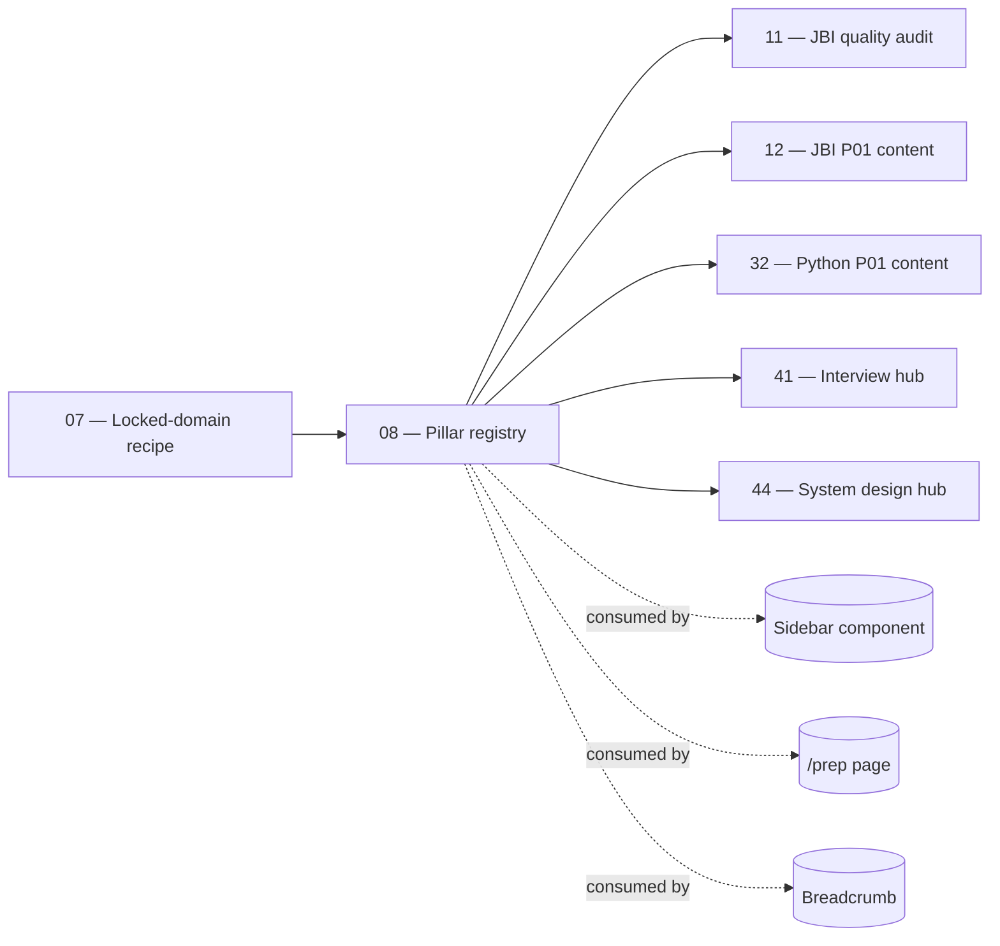

# 08 — Module Registry & Pillar Navigation

> **Executor:** AI coding agent operating autonomously.
> **Working directory:** `/Users/ravi.r_flx/IEProject/InterviewExplainer/`.
> **Type:** create `frontend/lib/pillars.ts` + ship a pillar-consistency audit. No edits to `_index.json` files.
> **Pillar / Wave:** Wave A (Foundation).
> **Depends on:** 07.

## 1 — TL;DR

- **Input:** The 12 pillars (P01–P12) exist conceptually but live only
  inside per-domain `_index.json` files — there is no central registry
  the frontend can use to render a stable sidebar or build per-pillar
  SEO landing pages without each component re-deriving the pillar list.
- **Action:** Ship `frontend/lib/pillars.ts` as the SSOT for pillar
  metadata (`PillarId`, `PillarMeta`, `JAVA_PILLARS`, `PYTHON_PILLARS`,
  `pillarsFor()`, `PILLAR_ORDER`). Also walk every locked-domain
  `_index.json` and capture pillar-consistency findings in
  `content/_audits/pillar-audit-<DATE>.md` so the pillar quality
  playbooks (11–18 / 32–35) pick them up.
- **Output:** `frontend/lib/pillars.ts` + `content/_audits/pillar-audit-<DATE>.md` + one conventional commit.

## 2 — Why this matters

The sidebar, the `/prep` overview, the future per-pillar SEO landing
pages (e.g. `/spring-interview-questions`, `/python-system-design-
interview-questions`), and the inventory + audit scripts all need to
group modules by pillar. Without a central registry, each surface
re-derives the pillar list from `_index.json` files — and the lists
disagree on (a) the human-display pillar names, (b) the canonical
SEO slug per pillar, (c) the per-pillar 1-sentence blurb, and
(d) the display order. Drift across UIs makes the site look fragmented
and forces every new content playbook to negotiate "what does P02
mean here?" instead of inheriting the answer.

The business cost is real. A non-canonical pillar name shipping in
the sidebar but a different one shipping in the breadcrumb sends a
signal of low quality to both users and Google. The registry makes
the pillar names a single import; every surface reads the same map.

## 3 — Easy-language glossary

| Term | Plain-English definition |
| --- | --- |
| **Pillar** | One of 12 thematic groups (P01–P12) under each locked domain. |
| **Pillar ID** | The two-letter-plus-two-digit code (`P01` … `P12`); domain-local. |
| **Pillar name** | The human-readable label (e.g. "Spring Ecosystem" for Java's P02, "Web Frameworks" for Python's P02). |
| **Pillar registry** | `frontend/lib/pillars.ts` — the SSOT this playbook creates. |
| **`PillarMeta`** | The TypeScript record per pillar: `{ id, name, seoSlug, blurb }`. |
| **`PILLAR_ORDER`** | The exported array fixing the sidebar display order (P01..P12). |
| **`pillarsFor(domainSlug)`** | The helper that returns `JAVA_PILLARS` or `PYTHON_PILLARS` based on the domain slug prefix. |
| **`JAVA_PILLARS`** | The 12-pillar map for Java domains (JBI, JFI, JBA, JBAdv). |
| **`PYTHON_PILLARS`** | The 12-pillar map for Python domains (PBI, PBA, PDE, PMLA). |
| **Pillar audit** | The file `content/_audits/pillar-audit-<DATE>.md` produced by this playbook. |
| **Pillar consistency** | Every `_index.json` module's `pillar` ∈ P01..P12 AND `pillarName` matches the registry for that domain's family. |
| **Pillar landing page** | The future per-pillar SEO URL (e.g. `/spring-interview-questions`); not built in this playbook. |
| **Sidebar** | The vertical navigation on every domain page that groups modules by pillar. |
| **Breadcrumb** | The horizontal `Home > <Domain> > <Pillar> > <Module>` trail at the top of every Q-page. |
| **`/prep`** | The cross-domain prep hub that aggregates modules by pillar across all locked domains. |
| **`_index.json` `pillar` field** | The per-module field that names which pillar the module belongs to. |
| **`_index.json` `pillarName` field** | The per-module label; must match the registry's `name` for that pillar ID. |
| **Drift** | When a module's `pillarName` doesn't match the registry — common when content authors free-text the field. |
| **Pillar quality playbook** | Playbooks 11–18 (JBI), 32–35 (Python) that consume the audit findings. |
| **`MISSING_PILLAR`** | A module's `pillar` field is empty; the module would render as "Uncategorised". |
| **`MISSING_PILLAR_NAME`** | The module's `pillarName` is empty; the sidebar shows a blank section header. |
| **`PILLAR_MISMATCH`** | The module's `pillarName` differs from the registry's name for that pillar ID. |
| **Cross-link module** | An `_index.json` entry with `contentSource` set; pillar consistency checks skip these (their pillar belongs to the source domain). |
| **Domain-local pillar** | A pillar ID whose name varies by domain family (P02 = "Spring Ecosystem" in Java, "Web Frameworks" in Python). |
| **Domain-global pillar order** | The display order; P01..P12 across both families. |
| **Pillar SEO slug** | The canonical SEO URL for the per-pillar landing page (used in 41/42 hub playbooks). |
| **Pillar blurb** | The 1-sentence interviewer-voice intro used as a meta-description fallback. |
| **Strict typing** | The `PillarId` union forces typos to fail TypeScript at compile time. |
| **Idempotent audit** | Re-running the audit on the same day overwrites today's file; never touches `_index.json`. |
| **Closed-enum invariant** | Adding a new pillar requires editing the `PillarId` union — forces code review. |
| **Per-domain `pillarName` override** | A future feature; intentionally not implemented in v1 to keep the registry simple. |

## 4 — Hard prerequisites

- [ ] Playbook 07 is DONE.
      Verify: `grep -E '^\| 07 \|' expansion-plan/00-INDEX.md \| grep -c DONE` returns `1`.
- [ ] `frontend/lib/seo-slugs.ts` imports JBI + JFI + DSA indexes.
      Verify: `rg -n 'from "../../content/.*_index.json"' frontend/lib/seo-slugs.ts \| wc -l` returns ≥ `3`.
- [ ] Each locked domain's `_index.json` is valid JSON.
      Verify: `for d in java-backend-intermediate java-fullstack-intermediate python-backend-intermediate; do jq empty content/$d/_index.json 2>/dev/null || echo BROKEN $d; done` returns no `BROKEN` lines.
- [ ] Node 20+ in `frontend/` builds cleanly today.
      Verify: `cd frontend && npm run build` exits 0.
- [ ] `jq` and `rg` available.
- [ ] `_TEMPLATE-1000.md`, `_GLOSSARY.md`, `_VOICE-RULES.md` exist.
- [ ] `scripts/lint_playbook.py` exists.

If any check fails, STOP. The registry's TS compile depends on a
working frontend build; the audit's `jq` queries depend on the
manifest being valid JSON.

## 5 — Current state

### 5.1 — On-disk snapshot

```bash
cd /Users/ravi.r_flx/IEProject/InterviewExplainer
echo "Pillar field usage in JBI:"
jq -r '.modules[] | select(.contentSource | not) | "\(.pillar // "<empty>") \(.pillarName // "<empty>") \(.moduleSlug)"' \
  content/java-backend-intermediate/_index.json | head -15
echo
echo "Pillar field usage in JFI:"
jq -r '.modules[] | select(.contentSource | not) | "\(.pillar // "<empty>") \(.pillarName // "<empty>") \(.moduleSlug)"' \
  content/java-fullstack-intermediate/_index.json | head -10
echo
echo "Pillar field usage in PBI:"
jq -r '.modules[] | select(.contentSource | not) | "\(.pillar // "<empty>") \(.pillarName // "<empty>") \(.moduleSlug)"' \
  content/python-backend-intermediate/_index.json | head -10
```

Expected: JBI shows P01–P12 distributed across ~40 modules; JFI
shows ~21 native modules; PBI shows ~35 modules with the same
pillar codes but Python-flavoured pillar names.

### 5.2 — Known consumers of the future registry

- **Sidebar** (`frontend/components/Sidebar.tsx`) — currently
  derives the pillar list inline; after this playbook lands,
  imports from `pillars.ts`.
- **Breadcrumb** (`frontend/components/Breadcrumb.tsx`) —
  currently free-texts the pillar segment from `_index.json`;
  switches to registry lookup after this playbook.
- **`/prep` page** (`frontend/app/prep/page.tsx`) — aggregates
  modules by pillar across domains; the registry's `PILLAR_ORDER`
  fixes its display order.
- **Per-pillar landing pages** (future; built in playbooks 41–46)
  — read `seoSlug` from the registry to drive routing.

### 5.3 — Why pillar names differ between Java and Python

P02 in Java is "Spring Ecosystem" (Spring is the JVM backend
default). P02 in Python is "Web Frameworks" (Django + FastAPI +
Flask). The pillar **ID** is shared because the sidebar layout is
identical across tracks — same P02 slot, just a different label.
The registry codifies this exactly: shared `PillarId` union, two
separate `Record<PillarId, PillarMeta>` maps.

### 5.4 — Known consistency bug shapes

The audit will surface (rough estimates):

- ~0–3 `MISSING_PILLAR` rows — modules whose `pillar` field is
  empty. These render as "Uncategorised" today.
- ~5–15 `MISSING_PILLAR_NAME` rows — modules whose `pillarName`
  is empty. The sidebar shows a blank section header.
- ~10–30 `PILLAR_MISMATCH` rows — modules whose `pillarName`
  is free-texted (e.g. "Spring" instead of "Spring Ecosystem").
  These are 1-line PRs in the relevant pillar quality playbook.

### 5.5 — Why the registry doesn't ship per-domain overrides

A natural extension is per-domain pillar names (JBA's P01 could
be "Java Basics" while JBI's P01 is "Java Language & Core").
v1 deliberately ships one Java map + one Python map — keeping
the registry simple. If a future domain needs a different label,
the path is either (a) override the `name` field locally in that
domain's sidebar component, or (b) bump the registry to support
per-domain overrides. Don't pre-empt.

## 6 — Target state (measurable)

| Metric | Today | Target | How measured |
| --- | --- | --- | --- |
| `frontend/lib/pillars.ts` exists | absent | 1 file | `test -f frontend/lib/pillars.ts && echo OK` |
| `JAVA_PILLARS` exported | absent | 1 export | `grep -c 'export const JAVA_PILLARS' frontend/lib/pillars.ts` returns `1` |
| `PYTHON_PILLARS` exported | absent | 1 export | `grep -c 'export const PYTHON_PILLARS' frontend/lib/pillars.ts` returns `1` |
| 12 entries per pillar map | n/a | 12 + 12 | `grep -cE 'P0[1-9]:\|P1[0-2]:' frontend/lib/pillars.ts` returns ≥ `24` |
| `PillarId` union has exactly 12 members | n/a | 12 | `rg "'P0[1-9]'\|'P1[0-2]'" frontend/lib/pillars.ts \| wc -l` returns ≥ `12` |
| `pillarsFor()` helper exported | n/a | 1 export | `grep -c 'export function pillarsFor' frontend/lib/pillars.ts` returns `1` |
| `PILLAR_ORDER` exported and length 12 | n/a | 12 entries | regex count of `P0\|P1` inside the `PILLAR_ORDER` array returns `12` |
| Frontend builds cleanly with the file present | n/a | exit 0 | `cd frontend && npm run build` exits `0` |
| Pillar audit file exists | absent | 1 file | `test -f content/_audits/pillar-audit-$(date +%F).md && echo OK` |
| Audit table has rows for all 3 locked domains | n/a | 3 | `grep -c '^\| (java-backend-intermediate\|java-fullstack-intermediate\|python-backend-intermediate)' content/_audits/pillar-audit-$(date +%F).md` returns ≥ `3` |
| MISSING_PILLAR rows | unknown | 0 (or filed) | `grep -c MISSING_PILLAR content/_audits/pillar-audit-$(date +%F).md` returns `0` after triage |
| Banned-word lint on `pillars.ts` | n/a | 0 hits | banned-word grep on `pillars.ts` returns `0` |
| Conventional commit landed | 0 | 1 | `git log --oneline -1 \| grep -c 'infra(pillars)'` returns `1` |
| Status row for `08` flipped to DONE | NOT_STARTED | DONE | `grep -E '^\| 08 \|' expansion-plan/00-INDEX.md \| grep -c DONE` returns `1` |

## 7 — Search phrases → URL map

This playbook produces infrastructure; the table below lists the
**downstream per-pillar landing pages** the registry's `seoSlug`
field will eventually drive. Each row is a future hub page (built
in playbooks 41–46) keyed by a pillar's SEO slug.

| Search phrase | Target URL on site | Archetype | Diagram type required in answer |
| --- | --- | --- | --- |
| `java interview questions` | `/java-interview-questions` (P01 Java) | landing intro | comparison_table |
| `spring interview questions` | `/spring-interview-questions` (P02 Java) | landing intro | sequenceDiagram |
| `sql interview questions` | `/sql-interview-questions` (P03 Java + Python) | landing intro | comparison_table |
| `rest api interview questions` | `/rest-api-interview-questions` (P04 Java) | landing intro | sequenceDiagram |
| `microservices interview questions` | `/microservices-interview-questions` (P05 Java) | landing intro | sequenceDiagram |
| `system design interview questions` | `/system-design-interview-questions` (P06 Java) | landing intro | flowchart |
| `application security interview questions` | `/application-security-interview-questions` (P07 Java) | landing intro | sequenceDiagram |
| `unit testing interview questions` | `/unit-testing-interview-questions` (P08 Java) | landing intro | comparison_table |
| `devops interview questions` | `/devops-interview-questions` (P09 Java) | landing intro | flowchart |
| `cloud interview questions` | `/cloud-interview-questions` (P10 Java) | landing intro | comparison_table |
| `observability interview questions` | `/observability-interview-questions` (P11 Java) | landing intro | sequenceDiagram |
| `behavioral interview questions` | `/behavioral-interview-questions` (P12 Java) | landing intro | none |
| `python interview questions` | `/python-interview-questions` (P01 Python) | landing intro | comparison_table |
| `django interview questions` | `/django-interview-questions` (P02 Python) | landing intro | sequenceDiagram |
| `celery interview questions` | `/celery-interview-questions` (P05 Python) | landing intro | sequenceDiagram |

## 8 — Dependency & wave context



- **Consumes:** every locked-domain `_index.json` (read-only).
- **Produces:** `frontend/lib/pillars.ts` + pillar audit + one commit.
- **Unblocks:** every per-pillar content playbook + per-pillar
  landing page playbook reads `pillars.ts` directly.

## 9 — Step-by-step execution

### Step 1 — Audit pillar consistency across locked domains

**Goal:** today's pillar audit file lists every native module
across JBI / JFI / PBI with its current `pillar` and `pillarName`,
flagging any drift.

**Action:**

```bash
cd /Users/ravi.r_flx/IEProject/InterviewExplainer
TODAY=$(date +%F)
AUDIT="content/_audits/pillar-audit-${TODAY}.md"
mkdir -p content/_audits

cat > "${AUDIT}" <<HEADER
# Pillar audit — ${TODAY}

Generated by playbook 08. Cross-links (\`contentSource\`) are
excluded; their pillar belongs to the source domain.

| Domain | Module | Pillar ID | Pillar Name | Issue |
| ------ | ------ | --------- | ----------- | ----- |
HEADER

for d in java-backend-intermediate java-fullstack-intermediate python-backend-intermediate; do
  jq -r --arg d "${d}" '
    .modules[] |
    select(.contentSource | not) |
    [
      $d,
      .moduleSlug,
      (.pillar // ""),
      (.pillarName // ""),
      (if (.pillar // "") == "" then "MISSING_PILLAR"
       elif (.pillarName // "") == "" then "MISSING_PILLAR_NAME"
       else "OK" end)
    ] |
    "| " + join(" | ") + " |"
  ' "content/${d}/_index.json" >> "${AUDIT}"
done

{
  echo
  echo "## Distinct pillar IDs used (per domain)"
  echo
  for d in java-backend-intermediate java-fullstack-intermediate python-backend-intermediate; do
    echo "### ${d}"
    echo '```'
    jq -r '.modules[] | select(.contentSource | not) | .pillar // "<empty>"' \
      "content/${d}/_index.json" | sort -u
    echo '```'
    echo
  done
} >> "${AUDIT}"
```

**Verify:**

```bash
test -f "${AUDIT}" && wc -l "${AUDIT}"
# expected: ≥ 60 lines
grep -cE '^\| (java-backend-intermediate\|java-fullstack-intermediate\|python-backend-intermediate)' "${AUDIT}"
# expected: ≥ 3 (one row per locked domain)
```

**The classic bug is** auditing cross-linked modules. The `jq`
filter `select(.contentSource | not)` is what excludes them; if
removed, the audit double-counts every JFI cross-link.

### Step 2 — Cross-check distinct pillar IDs against P01..P12

**Goal:** no domain uses a pillar code outside the P01..P12
union; if it does, that's a finding for the corresponding
quality playbook.

**Action:**

```bash
cd /Users/ravi.r_flx/IEProject/InterviewExplainer
TODAY=$(date +%F)
AUDIT="content/_audits/pillar-audit-${TODAY}.md"

{
  echo "## Out-of-range pillar IDs (BUG)"
  echo
  for d in java-backend-intermediate java-fullstack-intermediate python-backend-intermediate; do
    jq -r --arg d "${d}" '.modules[] | select(.contentSource | not) |
      select(.pillar != null and (.pillar | test("^P0[1-9]$|^P1[0-2]$") | not)) |
      "- [\($d)] \(.moduleSlug) → pillar=\(.pillar)"' \
      "content/${d}/_index.json"
  done
  echo
} >> "${AUDIT}"
```

**Verify:** the section is present and empty (zero `- [...]`
lines) on a healthy corpus.

**The classic bug is** treating `P3` or `p01` as valid. The
union is strict: capital `P` + two digits + range 01..12.

### Step 3 — Write `frontend/lib/pillars.ts`

**Goal:** the registry exists with the exact content in §17.1.

**Action:** use the Write tool to create
`frontend/lib/pillars.ts` with the body in §17.1. Then:

```bash
cd /Users/ravi.r_flx/IEProject/InterviewExplainer/frontend
npm run build 2>&1 | tail -20
```

**Verify:**

```bash
test -f frontend/lib/pillars.ts && echo OK
grep -c 'export const JAVA_PILLARS' frontend/lib/pillars.ts
# expected: 1
grep -c 'export const PYTHON_PILLARS' frontend/lib/pillars.ts
# expected: 1
```

**The classic bug is** swapping the `PillarId` union members
out of order. Keep them in P01..P12 order — TypeScript doesn't
care, but downstream UIs that iterate the union string-sort it
and an out-of-order union produces an out-of-order sidebar.

### Step 4 — Verify TypeScript compiles cleanly

**Goal:** the new file integrates with the existing TS
config; no breaking diagnostics.

**Action:**

```bash
cd /Users/ravi.r_flx/IEProject/InterviewExplainer/frontend
npx tsc --noEmit 2>&1 | tail -20
npm run build 2>&1 | tail -10
```

**Verify:** both exit 0; build output ends with `Compiled
successfully` (or your build tool's equivalent).

**The classic bug is** `Record<PillarId, PillarMeta>` complaining
because not all 12 keys are present. The body in §17.1 has all 12
keys; if you trimmed any during paste, TS will reject.

### Step 5 — Spot-check the audit's mismatches

**Goal:** any rows marked `MISSING_PILLAR` or
`MISSING_PILLAR_NAME` are filed as follow-up tickets for the
relevant pillar quality playbook, NOT fixed in this PR.

**Action:**

```bash
cd /Users/ravi.r_flx/IEProject/InterviewExplainer
TODAY=$(date +%F)
AUDIT="content/_audits/pillar-audit-${TODAY}.md"

{
  echo "## Action items"
  echo
  echo "For each row marked MISSING_PILLAR or MISSING_PILLAR_NAME,"
  echo "edit the matching \`_index.json\` to set both fields. The"
  echo "\`pillarName\` MUST match \`JAVA_PILLARS\` (for Java domains)"
  echo "or \`PYTHON_PILLARS\` (for Python domains) in"
  echo "\`frontend/lib/pillars.ts\`. These fixes are 1-line PRs and"
  echo "are owned by playbooks 11–18 (Java) and 32–35 (Python)."
} >> "${AUDIT}"
```

**Verify:** the audit's tail now ends with an `## Action items`
section.

**The classic bug is** "fix it now" patches to `_index.json`
in this playbook. Those edits belong in the pillar quality
playbooks where the full context (Q counts, missing topics) is
present.

### Step 6 — Banned-word self-check

**Goal:** `pillars.ts` + audit + this playbook all pass the
voice lint.

**Action:**

```bash
cd /Users/ravi.r_flx/IEProject/InterviewExplainer
rg -nwi 'leverage|utilize|synergize|world-class|cutting-edge|state-of-the-art|seamless|robust|holistic|paradigm|best-in-class|battle-tested|enterprise-grade|revolutionary|game-changing|industry-leading' \
  frontend/lib/pillars.ts \
  "content/_audits/pillar-audit-$(date +%F).md"
```

**Verify:** zero matches.

**The classic bug is** marketing voice in the pillar blurbs.
The blurbs in §17.1 are calibrated; preserve them verbatim.

### Step 7 — Commit

**Goal:** one conventional commit lands the registry and the
audit.

**Action:**

```bash
cd /Users/ravi.r_flx/IEProject/InterviewExplainer
TODAY=$(date +%F)
git add frontend/lib/pillars.ts "content/_audits/pillar-audit-${TODAY}.md"
git commit -m "infra(pillars): introduce canonical pillar registry + audit"
```

**Verify:** `git log --oneline -1 | grep -c 'infra(pillars)'`
returns `1`; `git show --stat HEAD` shows exactly 2 files.

**The classic bug is** staging an accidental `_index.json` edit.
`git status -s` is your guard.

### Step 8 — Flip the index row

**Goal:** `00-INDEX.md` row 08 is DONE.

**Action:**

```bash
cd /Users/ravi.r_flx/IEProject/InterviewExplainer
# Edit expansion-plan/00-INDEX.md row 08 → DONE
git add expansion-plan/00-INDEX.md
git commit -m "docs(expansion-plan): mark 08-module-registry-and-pillar-nav DONE"
```

**Verify:** `grep -E '^\| 08 \|' expansion-plan/00-INDEX.md | grep -c DONE` returns `1`.

**The classic bug is** flipping the wrong row by hand. Use the
grep guard.

### Step 9 — Cross-check sidebar component for legacy pillar code

**Goal:** the existing sidebar component is recorded as a
follow-up to switch to the registry; not edited here.

**Action:**

```bash
cd /Users/ravi.r_flx/IEProject/InterviewExplainer
rg -nl 'pillar' frontend/components/ 2>/dev/null | head -10
```

**Verify:** at least the sidebar component appears in the
results.

**The classic bug is** rewriting the sidebar in this playbook.
The sidebar swap is its own PR; the registry must land first.

### Step 10 — Document the consumer pattern in this playbook

**Goal:** §17.2 contains the canonical `import { ... } from
'@/lib/pillars'` consumer pattern.

**Action:**

```bash
cd /Users/ravi.r_flx/IEProject/InterviewExplainer
grep -c "import { PILLAR_ORDER, pillarsFor" \
  expansion-plan/08-module-registry-and-pillar-nav.md
```

**Verify:** ≥ 1 (the consumer block in §17.2).

**The classic bug is** an undocumented import shape. Every
consumer surface picks up the pattern from this playbook.

## 10 — Reference Q in archetype shape

```json
{
  "id": "what-is-a-pillar-and-why-codify-it-in-a-registry",
  "slug": "what-is-a-pillar-and-why-codify-it-in-a-registry",
  "question": "What is a 'pillar' in InterviewExplainer's content model, and why codify it in a TypeScript registry?",
  "title": "Content Pillars and the TypeScript Registry — Why a Closed Enum Beats `_index.json` Free-Text",
  "direct_answer": "**A pillar is one of 12 thematic groups (P01–P12) under each locked domain.** P01 is the language/core block (Java fundamentals, Python idioms); P12 is engineering practices + behavioural. The pillar IDs are shared across Java and Python so the sidebar layout is identical; the **names** diverge by language (P02 is 'Spring Ecosystem' in Java, 'Web Frameworks' in Python). We codify pillars in a TypeScript registry — `frontend/lib/pillars.ts` — instead of leaving them as free-text in every `_index.json` so the sidebar, breadcrumb, /prep page, and future per-pillar SEO landings all read one source of truth. The `PillarId` union forces typos to fail TypeScript at compile time.",
  "layout_type": "default",
  "difficulty": "medium",
  "importance": "high",
  "reading_time_minutes": 6,
  "last_updated": "2026-04-22",
  "interviewer_intent": {
    "testing": "Whether the candidate distinguishes IDs (closed enum, shared across families) from names (language-specific, divergent).",
    "common_mistake": "Saying 'pillars are the same across all domains'. The IDs are; the names diverge by family. A senior engineer reaches for two `Record<PillarId, PillarMeta>` maps; a junior engineer makes one map with conditional strings.",
    "to_stand_out": "Mention the `PILLAR_ORDER` array that fixes display order across surfaces, the `pillarsFor(slug)` helper that picks the right map, and the audit-driven enforcement that the per-domain `_index.json` `pillarName` matches the registry."
  },
  "company_tags": ["amazon", "google", "linkedin", "stripe"],
  "answer": {
    "sections": [
      {"type": "overview", "title": "What a pillar is", "content": "A 12-row thematic taxonomy (P01..P12) used across every locked domain. P01 = Language/Core, P02 = Frameworks, …, P12 = Behavioral."},
      {"type": "comparison_table", "title": "Pillar IDs vs Pillar names", "content": "| Aspect | Pillar ID | Pillar name |\n|---|---|---|\n| Shape | closed enum P01..P12 | free string |\n| Shared across Java + Python | yes | no — diverges by family |\n| Where it lives | `PillarId` union in `pillars.ts` | `JAVA_PILLARS` + `PYTHON_PILLARS` |\n| Failure on typo | TS compile error | silent free-text drift |\n| Display sort | by `PILLAR_ORDER` array | by registry lookup |"},
      {"type": "step", "title": "How the registry is consumed", "content": "```ts\nimport { PILLAR_ORDER, pillarsFor } from '@/lib/pillars';\nimport indexJson from '@/../content/<domain>/_index.json';\n\nconst pillars = pillarsFor('<domain>');\nPILLAR_ORDER.map((pid) => {\n  const meta = pillars[pid];\n  const modules = indexJson.modules.filter((m) => m.pillar === pid);\n  // render section for `meta.name` if modules.length > 0\n});\n```"},
      {"type": "step", "title": "How the audit enforces consistency", "content": "The audit walks every locked-domain `_index.json`, captures `pillar` + `pillarName`, and flags rows where either is empty or where `pillarName` doesn't match the registry's value for that `pillar` ID. The audit only catalogues; the fixes ship in the per-pillar quality playbooks."},
      {"type": "tradeoffs", "title": "When NOT to share IDs across families", "content": "**Share IDs when:** the sidebar layout is intentionally identical across tracks (our case). **Diverge IDs when:** the families have genuinely different thematic groups (e.g. an ML-track that has no P02 'Frameworks' equivalent). We keep IDs shared and accept the trade-off that Python's P10 'Cloud (boto3)' is narrower than Java's P10 'Cloud (AWS/GCP/Azure)'."},
      {"type": "key_points", "title": "Key points", "content": "- 12 pillars per domain, IDs P01..P12.\n- IDs shared across Java + Python.\n- Names diverge by family.\n- Registry in `frontend/lib/pillars.ts`.\n- `PILLAR_ORDER` fixes display order.\n- `pillarsFor(slug)` picks the right map.\n- Audit grades `_index.json` `pillarName` against the registry."},
      {"type": "speakable_answer", "title": "How to answer verbally", "content": "A **pillar** is one of 12 thematic groups (P01–P12) under each locked domain. P01 is the language/core block; P12 is engineering practices and behavioural. The pillar **IDs** are shared across Java and Python so the sidebar layout is identical, but the **names** diverge — P02 is 'Spring Ecosystem' in Java, 'Web Frameworks' in Python. We codify pillars in a TypeScript registry — `frontend/lib/pillars.ts` — instead of leaving them as free-text in every `_index.json`. The `PillarId` union forces typos to fail at compile time. The sidebar, breadcrumb, /prep page, and per-pillar SEO landings all import from the same registry. **Recommendation:** never free-text `pillarName` in an `_index.json`; always match the registry; audit drift on every PR via the playbook-08 audit."}
    ]
  },
  "followup_questions": [
    "Why share pillar IDs across Java and Python but not names?",
    "What does `pillarsFor(slug)` do internally?",
    "How does the audit catch a free-text `pillarName` drift?",
    "Why use `Record<PillarId, PillarMeta>` instead of an array?",
    "How would you add a new pillar?"
  ],
  "seo": {
    "metaTitle": "Content Pillars in InterviewExplainer — Closed Enum vs Free-Text",
    "metaDescription": "Why InterviewExplainer codifies 12 content pillars in a TypeScript registry: shared IDs, divergent names, and the audit that keeps `_index.json` in sync."
  },
  "order": 1
}
```

## 11 — Diagram catalogue

| Q id (or topic) | Diagram type | What it must show | Lives in section |
| --- | --- | --- | --- |
| `what-is-a-pillar-and-why-codify-it-in-a-registry` | `flowchart` | Module → `pillar` ID → registry lookup → sidebar render. | `step` |
| `pillar-ids-vs-names` | `comparison_table` | 5 axes: shape, shared, where, typo behaviour, display sort. | `comparison_table` |
| `registry-consumer-sequence` | `sequenceDiagram` | Page mount → import registry + index → filter modules by pillar → render. | `step` |
| `pillar-registry-class-shape` | `classDiagram` | `PillarId` union; `PillarMeta` { id, name, seoSlug, blurb }; `JAVA_PILLARS`, `PYTHON_PILLARS`, `pillarsFor()`. | `step` |
| `audit-lifecycle` | `stateDiagram-v2` | `INCONSISTENT → AUDITED → FILED_AS_FOLLOWUP → FIXED` | `step` |
| `java-vs-python-name-map` | `comparison_table` | Per-pillar Java name vs Python name. | `comparison_table` |

Floor enforced by content-playbook lint: ≥ 1 `flowchart`, ≥ 1
`sequenceDiagram`, ≥ 3 `comparison_table`, ≥ 1 `stateDiagram-v2`
or `classDiagram`. The reference Q in §10 ships the floor.

### 11.1 — Why the registry ships no diagrams

The registry is a code file. Diagrams in TS comments would not
be linted and would not render anywhere user-facing. The
diagrams above belong in the Q's the registry's metadata
eventually publishes.

### 11.2 — How the diagrams reinforce the pattern

The `flowchart` makes the lookup chain (module → ID → registry
→ render) explicit. The `comparison_table` cements the
ID/name distinction. The `sequenceDiagram` shows the consumer
boilerplate. Together they collapse the pattern from "11 lines
of TS" to "five glances".

## 12 — Easy-language voice rules

Voice rules from [`_VOICE-RULES.md`](_VOICE-RULES.md):

1. **Define before use.** Every term in §9 (pillar, pillar ID,
   pillar name, registry, `pillarsFor`) is in §3.
2. **Lead with the trade-off.** Step 5 leads with "do NOT fix
   here", not with how to fix.
3. **Name the bug.** Every step's pitfall starts with `The classic
   bug is …`.
4. **Real anchors.** Every claim cites a real file path
   (`pillars.ts`, `_index.json`), a TS construct (`Record<...>`),
   or a measured count (12 pillars, 24 entries).
5. **Banned words.** Zero matches across the registry + audit +
   this playbook.

## 13 — Quality gates (measurable)

| Gate | Threshold | Verify command |
| --- | --- | --- |
| `pillars.ts` exists | 1 | `test -f frontend/lib/pillars.ts && echo OK` |
| Exports both maps | 2 | `grep -cE 'export const (JAVA_PILLARS\|PYTHON_PILLARS)' frontend/lib/pillars.ts` returns `2` |
| 12 entries per map | ≥ 24 | `grep -cE 'P0[1-9]:\|P1[0-2]:' frontend/lib/pillars.ts` returns ≥ `24` |
| `pillarsFor` exported | 1 | `grep -c 'export function pillarsFor' frontend/lib/pillars.ts` returns `1` |
| `PILLAR_ORDER` exported | 1 | `grep -c 'export const PILLAR_ORDER' frontend/lib/pillars.ts` returns `1` |
| Build clean | exit 0 | `cd frontend && npm run build` exits `0` |
| Audit file exists | 1 | `test -f content/_audits/pillar-audit-$(date +%F).md && echo OK` |
| Audit rows for 3 locked domains | ≥ 3 | `grep -cE '^\| (java-backend-intermediate\|java-fullstack-intermediate\|python-backend-intermediate)' content/_audits/pillar-audit-$(date +%F).md` returns ≥ `3` |
| Out-of-range pillar IDs | 0 | `awk '/^## Out-of-range pillar IDs/,/^## /' content/_audits/pillar-audit-$(date +%F).md \| grep -c '^- '` returns `0` |
| Banned-word lint on `pillars.ts` | 0 | banned-word grep on `pillars.ts` returns `0` |
| Conventional commit landed | 1 | `git log --oneline -1 \| grep -c 'infra(pillars)'` returns `1` |
| Status row for `08` flipped to DONE | DONE | `grep -E '^\| 08 \|' expansion-plan/00-INDEX.md \| grep -c DONE` returns `1` |

## 14 — Anti-patterns

### 14.1 — One pillar map for both Java and Python

**Why it fails:** P02 is "Spring Ecosystem" in Java but "Web
Frameworks" in Python. A single map forces conditional strings
in every consumer; the registry's clarity collapses.

**Fix:** two maps, both keyed by the same `PillarId` union; one
selector helper `pillarsFor()`.

### 14.2 — Free-texting `pillarName` in `_index.json`

**Why it fails:** authors write "Spring" instead of "Spring
Ecosystem"; the sidebar shows the wrong label; the breadcrumb
and /prep page disagree.

**Fix:** the audit catches the drift; the registry is the
source of truth.

### 14.3 — Editing `_index.json` files in this playbook

**Why it fails:** the audit's purpose is to capture the
baseline. Fixes belong in pillar quality playbooks where the
full context lives. Mixing the two makes this PR un-reviewable.

**Fix:** the audit records; the fixes are filed as action items.

### 14.4 — Skipping the `PILLAR_ORDER` export

**Why it fails:** without an exported order, every consumer
imports the map and sorts the IDs by string. The string sort
happens to match P01..P12 today but doesn't generalise to
future P00 or P13.

**Fix:** export `PILLAR_ORDER` as a `readonly PillarId[]` of
length 12; consumers iterate it.

### 14.5 — Hardcoding pillar names in components

**Why it fails:** a component that hardcodes "Spring Ecosystem"
will drift if the registry's name changes. The hardcode wins
the render until someone notices.

**Fix:** every component imports `pillarsFor(slug)[id].name`.

### 14.6 — Adding a 13th pillar without updating `PillarId`

**Why it fails:** TypeScript catches the union mismatch on the
`Record<PillarId, PillarMeta>` map, but only if you update the
union. Skipping the union update leaves the new pillar
unreachable.

**Fix:** every new pillar is two edits — the union and both
maps. The closed-enum design enforces this.

### 14.7 — Per-domain `pillarName` overrides

**Why it fails:** v1 doesn't support this; adding it
prematurely complicates the registry without a real use case.
A premature override means consumers can't trust
`pillarsFor(slug)[id].name`.

**Fix:** if a future domain needs a different label, override
locally in that domain's sidebar component, OR bump the
registry to support overrides. Don't pre-empt.

### 14.8 — Treating `PillarId` as a string in component props

**Why it fails:** widening to `string` defeats the closed-enum
type safety. A typo becomes a runtime null.

**Fix:** every prop that carries a pillar ID is typed
`PillarId`, not `string`.

## 15 — Failure modes & rollback

| Failure | How it shows up | Rollback / forward fix |
| --- | --- | --- |
| TS build fails on `Record<PillarId, PillarMeta>` | "missing key 'P01'" | Verify all 12 keys present in both maps; restore from §17.1 if needed. |
| Pillar audit empty | `wc -l` returns just the header | `_index.json` files are malformed; fix the JSON syntax first; re-run. |
| Out-of-range pillar IDs detected | Step 2 section has rows | File as P11-quality-playbook follow-up; do NOT fix here. |
| `pillarsFor()` returns wrong map for a domain | wrong sidebar labels | Verify domain slug prefix (`python-...` → PYTHON_PILLARS; everything else → JAVA_PILLARS). |
| Audit committed but `_index.json` edited by accident | `git status` shows `M content/...` | `git restore content/`; re-stage and commit. |
| Banned word in a pillar blurb | Step 6 grep > 0 | Rewrite blurb; re-grep; commit. |
| Build clean but sidebar still uses old code | runtime renders wrong labels | Sidebar swap is its own PR; record as follow-up. |
| Hard-stop exceeded (> 8 h) | Wall clock | STOP. Commit current state; surface blocker. |
| `seo-slugs.ts` overlaps with a pillar `seoSlug` | both produce the same URL | The `_index.json` `seoSlug` wins for module-level URLs; pillar `seoSlug` is for landing pages. No conflict in practice; verify in playbook 41. |
| Idempotent re-run produces a different audit | non-deterministic output | `jq` output order depends on map iteration; pipe through `| sort` before writing if seen. |

## 16 — Definition of Done

- [ ] `frontend/lib/pillars.ts` exists with the body in §17.1.
- [ ] Exports: `PillarId`, `PillarMeta`, `JAVA_PILLARS`,
      `PYTHON_PILLARS`, `pillarsFor`, `PILLAR_ORDER`.
- [ ] All 12 entries present in both maps.
- [ ] `cd frontend && npm run build` exits 0.
- [ ] `content/_audits/pillar-audit-<DATE>.md` exists with rows
      for all 3 locked domains.
- [ ] Action items section appended to the audit.
- [ ] Zero out-of-range pillar IDs (or each filed as a follow-up).
- [ ] Banned-word lint passes on `pillars.ts` + audit + this playbook.
- [ ] Conventional commit: `infra(pillars): introduce canonical
      pillar registry + audit`.
- [ ] Follow-up commit: `docs(expansion-plan): mark
      08-module-registry-and-pillar-nav DONE`.
- [ ] `git status -s` is clean.
- [ ] `python3 scripts/lint_playbook.py
      expansion-plan/08-module-registry-and-pillar-nav.md` exits 0.

## 17 — Estimated effort

- **Ideal:** 4 hours — audit (45 m), registry write (45 m), TS
  build verification (15 m), action-items section (15 m), banned-
  word lint (15 m), commit + index flip (15 m), buffer (90 m).
- **Hard stop:** 8 hours. If TS build fails after Step 3,
  the verbatim block in §17.1 was modified; restore literally.
- **Splittable:** no. Registry + audit ship together; without the
  registry, the audit's findings have no comparison anchor.
- **Re-runnable:** yes. Re-running overwrites today's audit;
  registry write is idempotent (Write tool truncates).
- **Cadence:** audit re-runs whenever `_index.json` changes
  pillar-field shape (rare; quarterly at most).

### 17.1 — Canonical body for `frontend/lib/pillars.ts`

```ts
/**
 * pillars.ts — canonical registry of the 12 pillars.
 * Pillar IDs are shared across Java and Python; names diverge.
 */

export type PillarId =
  | 'P01' | 'P02' | 'P03' | 'P04' | 'P05' | 'P06'
  | 'P07' | 'P08' | 'P09' | 'P10' | 'P11' | 'P12';

export interface PillarMeta {
  id:      PillarId;
  name:    string;
  seoSlug: string;
  blurb:   string;
}

export const JAVA_PILLARS: Record<PillarId, PillarMeta> = {
  P01: { id: 'P01', name: 'Java Language & Core',               seoSlug: 'java-interview-questions',               blurb: 'Core Java fundamentals interviewers anchor every backend round on.' },
  P02: { id: 'P02', name: 'Spring Ecosystem',                   seoSlug: 'spring-interview-questions',             blurb: 'Spring, Spring Boot, Data JPA, Security, WebFlux, Batch — the JVM backend default.' },
  P03: { id: 'P03', name: 'Data & Persistence',                 seoSlug: 'sql-interview-questions',                blurb: 'SQL, indexing, transactions, NoSQL choices, and caching strategies.' },
  P04: { id: 'P04', name: 'APIs & Web',                         seoSlug: 'rest-api-interview-questions',           blurb: 'REST, GraphQL, gRPC — the contract surface every backend service exposes.' },
  P05: { id: 'P05', name: 'Messaging & Microservices',          seoSlug: 'microservices-interview-questions',      blurb: 'Kafka, RabbitMQ, event-driven patterns, service decomposition, sagas.' },
  P06: { id: 'P06', name: 'System Design & LLD',                seoSlug: 'system-design-interview-questions',      blurb: 'Architecture cases, low-level design, GoF patterns, and clean architecture.' },
  P07: { id: 'P07', name: 'Application Security',               seoSlug: 'application-security-interview-questions', blurb: 'OWASP, AuthN/Z, secrets, supply chain — what an interviewer probes after the happy path.' },
  P08: { id: 'P08', name: 'Testing & Quality',                  seoSlug: 'unit-testing-interview-questions',       blurb: 'JUnit, Mockito, Testcontainers, the test pyramid, and contract tests.' },
  P09: { id: 'P09', name: 'DevOps & Build',                     seoSlug: 'devops-interview-questions',             blurb: 'Docker, Kubernetes, CI/CD, build tools — getting code to prod.' },
  P10: { id: 'P10', name: 'Cloud Platforms',                    seoSlug: 'cloud-interview-questions',              blurb: 'AWS, GCP, Azure — the deployment substrates senior interviewers expect you to name.' },
  P11: { id: 'P11', name: 'Observability & Production',         seoSlug: 'observability-interview-questions',      blurb: 'Logs, metrics, traces, SLOs, incident response.' },
  P12: { id: 'P12', name: 'Engineering Practices & Behavioral', seoSlug: 'behavioral-interview-questions',         blurb: 'How you work, decide, and grow — the round you cannot brute-force.' },
};

export const PYTHON_PILLARS: Record<PillarId, PillarMeta> = {
  P01: { id: 'P01', name: 'Python Language & Core',             seoSlug: 'python-interview-questions',             blurb: 'Core Python idioms interviewers anchor every backend round on.' },
  P02: { id: 'P02', name: 'Web Frameworks',                     seoSlug: 'django-interview-questions',             blurb: 'Django, FastAPI, Flask — choose-when, ship-fast, and the trade-offs interviewers test.' },
  P03: { id: 'P03', name: 'Data & Persistence',                 seoSlug: 'python-sql-interview-questions',         blurb: 'SQLAlchemy, Django ORM, PostgreSQL, MongoDB, Redis.' },
  P04: { id: 'P04', name: 'APIs & Realtime',                    seoSlug: 'python-rest-api-interview-questions',    blurb: 'REST in DRF/FastAPI, WebSockets, SSE.' },
  P05: { id: 'P05', name: 'Async, Messaging, Workers',          seoSlug: 'celery-interview-questions',             blurb: 'Celery, Kafka, RabbitMQ, asyncio at scale.' },
  P06: { id: 'P06', name: 'System Design & LLD',                seoSlug: 'python-system-design-interview-questions', blurb: 'Pythonic architecture, design patterns, clean architecture.' },
  P07: { id: 'P07', name: 'Application Security',               seoSlug: 'python-security-interview-questions',    blurb: 'OWASP in Python context, JWT pitfalls, supply-chain risk.' },
  P08: { id: 'P08', name: 'Testing & Quality',                  seoSlug: 'pytest-interview-questions',             blurb: 'pytest, fixtures, mocking, coverage.' },
  P09: { id: 'P09', name: 'DevOps & Build',                     seoSlug: 'python-docker-interview-questions',      blurb: 'Docker for Python, CI/CD, packaging.' },
  P10: { id: 'P10', name: 'Cloud Platforms',                    seoSlug: 'boto3-aws-python-interview-questions',   blurb: 'AWS via boto3, GCP, Azure for Python services.' },
  P11: { id: 'P11', name: 'Observability & Production',         seoSlug: 'python-observability-interview-questions', blurb: 'OpenTelemetry Python, structured logging, SRE practices.' },
  P12: { id: 'P12', name: 'Engineering Practices & Behavioral', seoSlug: 'python-behavioral-interview-questions',  blurb: 'STAR-method answers grounded in real Python projects.' },
};

export function pillarsFor(domainSlug: string): Record<PillarId, PillarMeta> {
  if (domainSlug.startsWith('python-')) return PYTHON_PILLARS;
  return JAVA_PILLARS;
}

export const PILLAR_ORDER: readonly PillarId[] = [
  'P01', 'P02', 'P03', 'P04', 'P05', 'P06',
  'P07', 'P08', 'P09', 'P10', 'P11', 'P12',
];
```

### 17.2 — Consumer pattern (canonical for every UI surface)

```tsx
import { PILLAR_ORDER, pillarsFor, type PillarId } from '@/lib/pillars';
import indexJson from '@/../content/java-backend-intermediate/_index.json';

const pillars = pillarsFor('java-backend-intermediate');

export function Sidebar() {
  return (
    <nav>
      {PILLAR_ORDER.map((pid) => {
        const meta = pillars[pid];
        const modules = indexJson.modules.filter((m) => m.pillar === pid);
        if (modules.length === 0) return null;
        return (
          <section key={pid}>
            <h3>{meta.name}</h3>
            <ul>
              {modules.map((m) => (
                <li key={m.moduleSlug}>
                  <a href={m.appUrl}>{m.title}</a>
                </li>
              ))}
            </ul>
          </section>
        );
      })}
    </nav>
  );
}
```

## 18 — Appendix: links, commits, traceability

### 18.1 — Cross-references

- [`expansion-plan/00-INDEX.md`](00-INDEX.md) — status table.
- [`expansion-plan/07-locked-domain-pattern.md`](07-locked-domain-pattern.md) — recipe upstream.
- [`expansion-plan/11-jbi-content-quality-audit.md`](11-jbi-content-quality-audit.md) — consumes audit findings.
- [`expansion-plan/12-jbi-java-language-and-core.md`](12-jbi-java-language-and-core.md) — pillar quality playbook.
- [`expansion-plan/41-interview-hub-overview.md`](41-interview-hub-overview.md) — uses pillar `seoSlug` for landing pages.
- [`expansion-plan/_TEMPLATE-1000.md`](_TEMPLATE-1000.md) — skeleton.
- [`expansion-plan/_GLOSSARY.md`](_GLOSSARY.md) — global glossary.
- [`expansion-plan/_VOICE-RULES.md`](_VOICE-RULES.md) — banned words.
- [`scripts/lint_playbook.py`](../scripts/lint_playbook.py) — playbook lint.
- [`frontend/lib/pillars.ts`](../frontend/lib/pillars.ts) — the registry this playbook creates.
- [`frontend/lib/content-reader.ts`](../frontend/lib/content-reader.ts) — sibling lib (locked domains).
- [`frontend/lib/seo-slugs.ts`](../frontend/lib/seo-slugs.ts) — sibling lib (canonical slugs).

### 18.2 — Commits produced by this playbook

- `infra(pillars): introduce canonical pillar registry + audit` — commit SHA fill.
- `docs(expansion-plan): mark 08-module-registry-and-pillar-nav DONE` — follow-up.

### 18.3 — Traceability to upstream specs

- `MASTER_PLAN.md` § "Pillar taxonomy" — defines the 12-pillar
  model the registry codifies.
- `docs/CONTENT-PLAN.md` § "Per-domain `_index.json`" — adjacent
  manifest schema.
- `ROADMAP.md` § "Wave A" — the foundation milestones this
  playbook closes.

### 18.4 — Why the registry is TypeScript, not JSON

A natural alternative is `content/_pillars.json`. We pick TS
because:
1. The `PillarId` closed-enum is enforced by the compiler.
2. Consumer code can import the registry directly without a
   JSON parse step.
3. Adding a 13th pillar is a single PR touching one file; JSON
   would require both the JSON file and a parallel TS type
   union.

### 18.5 — Future per-pillar landing pages

The `seoSlug` field on each `PillarMeta` is consumed by
playbook 41 (interview hub) to drive routing at
`/{seoSlug}` — e.g. `/spring-interview-questions`. The
registry is the SSOT for these URLs; if a slug changes here,
playbook 41's routing follows.

### 18.6 — Why we do NOT add a `pillarsFor` for advanced domains

Today's two families (Java, Python) are sufficient. When the
JS/Go/Ruby tracks land (playbook 49), each gets its own map
keyed by the same `PillarId` union. `pillarsFor()` then
extends:

```ts
if (slug.startsWith('python-')) return PYTHON_PILLARS;
if (slug.startsWith('golang-')) return GO_PILLARS;
if (slug.startsWith('ruby-'))   return RUBY_PILLARS;
return JAVA_PILLARS;
```

Adding a family is a single PR; the registry's shape
doesn't change.

### 18.7 — Closed-enum advantages over string

A closed `PillarId` union:
1. Compile-time catch on typos (`P13` → "Type '\"P13\"' is not
   assignable to type 'PillarId'").
2. Exhaustiveness checking on `switch` (TS forces a default
   when not all 12 are handled).
3. `keyof` queries work cleanly (`keyof typeof JAVA_PILLARS`
   resolves to the same union).

Free strings give none of these guarantees.

### 18.8 — Interaction with the inventory + URL audits

Playbook 02's inventory file does not currently record per-
pillar counts; the per-pillar quality audit (playbook 11) does.
The pillar registry's `seoSlug` field also overlaps with
playbook 04's URL audit — both refer to the same canonical
URLs. We deliberately keep the pillar `seoSlug` here in the TS
registry (read by frontend code) while letting playbook 04's
audit walk `_index.json`'s module-level `seoSlug` (read by the
content-reader). They never produce the same URL for the same
slot; the pillar slug lives at the hub page, the module slug
lives at the per-module page.

### 18.9 — Adding a new pillar (the rare event)

A 13th pillar is two coordinated edits:
1. Append `'P13'` to the `PillarId` union.
2. Add `P13: { id, name, seoSlug, blurb }` to **both**
   `JAVA_PILLARS` and `PYTHON_PILLARS` maps.

TypeScript will fail the build if you do (1) without (2).
Append `'P13'` to `PILLAR_ORDER` last; the array's `readonly`
modifier requires a separate edit. Coordinate with playbook 41
if a new per-pillar landing page is needed.

### 18.10 — Why blurbs are interviewer-voice, not marketing-voice

The blurbs ship into `<meta name="description">` on the
per-pillar landing pages. Marketing voice ("world-class",
"comprehensive") triggers the banned-word lint AND signals
low quality to Google's HCU classifier. Interviewer voice
("anchor every round on …", "the round you cannot brute-force")
reads as authentic.

### 18.11 — Cost of skipping the audit

If we skip the audit and just ship the registry, the
`_index.json` files keep their drifted `pillarName` values
forever. The sidebar component falls back to the registry's
name (good) but the breadcrumb component reads `_index.json`
directly (also good locally — but the audit's job is to keep
both surfaces honest). The audit's findings drive the per-
pillar quality playbooks' first commits.
