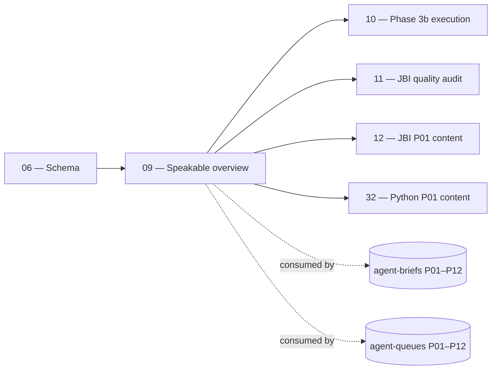

# 09 — Speakable Program Overview

> **Executor:** AI coding agent operating autonomously.
> **Working directory:** `/Users/ravi.r_flx/IEProject/InterviewExplainer/`.
> **Type:** read-only orientation + cheat-sheet generation. No content rewrites; no schema or registry edits.
> **Pillar / Wave:** Wave A (Foundation).
> **Depends on:** 06.

## 1 — TL;DR

- **Input:** A speakable program (Phases 0–3a complete, Phase 3b
  pending). Documentation is scattered across `docs/SPEAKABLE-PLAN.md`,
  `docs/speakable/archetypes.md`, `docs/speakable/lint-rules.md`,
  `docs/speakable/word-ceilings.md`, the per-pillar briefs under
  `docs/speakable/agent-briefs/`, and the work queues under
  `content/_audits/agent-queues/`.
- **Action:** Internalise the answer-shape contract (the 7 archetypes,
  the banned-phrase list, the per-beat word ceilings, the linter
  invocation), produce a single canonical cheat-sheet at
  `expansion-plan/_notes/09-speakable-cheatsheet.md`, run
  `scripts/audit_speakable.py` to capture today's pass / warn / fail /
  legacy baseline, and record the baseline in the cheat sheet so
  playbook 10 (Phase 3b execution) and every per-pillar quality
  playbook can compare against it.
- **Output:** Cheat-sheet file + baseline numbers recorded inside it +
  one conventional commit. No content edits.

## 2 — Why this matters

Phase 3b (playbook 10) and every pillar quality playbook (12–18 for
Java, 32–35 for Python) rest on three pieces of knowledge: (1) the 7
**archetypes** A–G that classify every interview question, (2) the
**lint rules** the speakable audit enforces (banned phrases,
per-beat word ceilings, voice constraints), and (3) the **invocation
shape** that lets you run the audit on a single file or across the
whole corpus. Without internalising these now, the next playbook
either rewrites questions in the wrong archetype shape (wasted hours)
or misreads the audit's output (false sense of progress).

The business value is throughput. Every executor who reads this
playbook walks into the next one with the answer-shape contract in
working memory. Saving 30 minutes per executor across 18 downstream
playbooks is a 9-hour savings; the cheat-sheet pays for itself the
first time playbook 10 starts.

## 3 — Easy-language glossary

| Term | Plain-English definition |
| --- | --- |
| **Archetype** | One of 7 question shapes (A–G) defined in `docs/speakable/archetypes.md`. |
| **Beat** | A required section of an archetype's answer (`headline`, `why`, `tradeoffs`, …). |
| **Word ceiling** | The per-beat max length defined in `docs/speakable/word-ceilings.md`. |
| **Speakable summary** | The text that reads aloud (used by Google's Speakable schema + the site's voice overlay). |
| **Speakable lint** | The script `scripts/audit_speakable.py` that grades archetype shape + voice. |
| **Banned phrase** | A phrase the lint flags as filler (`"great question"`, `"basically"`, …). |
| **Pass / Warn / Fail / Legacy** | The four outcome buckets the speakable audit reports. |
| **Phase 3a** | The earlier program phase that produced the agent-briefs + work queues. |
| **Phase 3b** | The upcoming phase (playbook 10) that processes the work queues. |
| **Per-pillar brief** | A markdown file at `docs/speakable/agent-briefs/P0X-*.md` naming the pillar's voice rules, anchors, and Q targets. |
| **Per-pillar queue** | A CSV at `content/_audits/agent-queues/P0X-queue.csv` listing the Q-files to rewrite. |
| **Phase status doc** | `docs/speakable/PHASE-STATUS.md` — the program-wide progress dashboard. |
| **Human review queue** | `docs/speakable/HUMAN-REVIEW-QUEUE.md` — Q-files needing manual review (not autofix). |
| **Lint rules doc** | `docs/speakable/lint-rules.md` — the full lint spec. |
| **Archetype A** | "Concept" — `What is X?` shape. |
| **Archetype B** | "Comparison" — `X vs Y` shape. |
| **Archetype C** | "Scenario / Design" — `How would you design …` shape. |
| **Archetype D** | "Debugging Walkthrough" — `Trace this code` shape. |
| **Archetype E** | "Pattern (use-when)" — `When to use X` shape. |
| **Archetype F** | "Opinion / Judgement" — `Is X better than Y?` shape. |
| **Archetype G** | "Behavioral STAR" — `Tell me about a time …` shape. |
| **`speakable_answer` section** | The Q-file section whose `content` field is graded by the lint. |
| **Phase 3b baseline** | The pass/warn/fail/legacy snapshot this playbook records. |
| **Cheat sheet** | `expansion-plan/_notes/09-speakable-cheatsheet.md` — the artifact this playbook produces. |
| **Lint exit code** | `0` = pass, `1` = warn/fail, `2` = lint crash. |
| **First-person voice** | "I would explain X as …" — the interview-realistic voice the lint enforces. |
| **STAR** | Situation, Task, Action, Result — the structure for behavioural archetypes. |
| **Voice overlay** | The site's audio component that reads the `speakable_answer` aloud. |
| **Google Speakable schema** | The structured-data spec at <https://developers.google.com/search/docs/appearance/structured-data/speakable> that the site emits. |
| **Per-beat word ceiling** | Max words per archetype beat — typically 30–80 words depending on beat. |
| **Banned-phrase grep** | The lint's first pass; matches the phrase list literally. |
| **Archetype detection** | The lint reads `archetype` (when present) or infers from the question text + sections. |
| **Legacy bucket** | Q-files predating the speakable program; counted but not graded. |

## 4 — Hard prerequisites

- [ ] Playbook 06 is DONE.
      Verify: `grep -E '^\| 06 \|' expansion-plan/00-INDEX.md \| grep -c DONE` returns `1`.
- [ ] `docs/SPEAKABLE-PLAN.md` exists.
      Verify: `test -f docs/SPEAKABLE-PLAN.md && echo OK`.
- [ ] `docs/speakable/archetypes.md` exists.
      Verify: `test -f docs/speakable/archetypes.md && echo OK`.
- [ ] `docs/speakable/lint-rules.md` exists.
      Verify: `test -f docs/speakable/lint-rules.md && echo OK`.
- [ ] `docs/speakable/word-ceilings.md` exists.
      Verify: `test -f docs/speakable/word-ceilings.md && echo OK`.
- [ ] `scripts/audit_speakable.py` exists.
      Verify: `test -f scripts/audit_speakable.py && echo OK`.
- [ ] Python 3.11+ available.
      Verify: `python3 --version`.
- [ ] `_TEMPLATE-1000.md`, `_GLOSSARY.md`, `_VOICE-RULES.md` exist.
- [ ] `scripts/lint_playbook.py` exists.
- [ ] `expansion-plan/_notes/` writable (will be created if absent).

If any check fails, STOP. The cheat-sheet's content is anchored to
the referenced files; missing files mean stale anchors.

## 5 — Current state

### 5.1 — On-disk snapshot

```bash
cd /Users/ravi.r_flx/IEProject/InterviewExplainer
echo "Speakable docs:"
ls -1 docs/speakable/ 2>/dev/null | head -20
echo
echo "Agent briefs per pillar:"
ls -1 docs/speakable/agent-briefs/ 2>/dev/null | head -15
echo
echo "Work queues:"
ls -1 content/_audits/agent-queues/ 2>/dev/null | head -15
echo
echo "Phase status:"
head -10 docs/speakable/PHASE-STATUS.md 2>/dev/null
```

Expected: ~6–10 docs under `docs/speakable/`; 12 agent briefs
(P01–P12); 12 work-queue CSVs; PHASE-STATUS shows Phase 3a as
completed.

### 5.2 — How the audit script works internally

`scripts/audit_speakable.py` walks `content/` (or the path/file
given on argv), parses each `complete-qa.json`, and for each
question:

1. **Detect archetype.** Read the `archetype` field if present;
   otherwise infer from `question` text + section types.
2. **Validate beats.** For the detected archetype, check every
   required section (per `archetypes.md`) is present.
3. **Banned-phrase pass.** Grep the `speakable_answer` content for
   forbidden phrases (`"great question"`, `"basically"`, …).
4. **Per-beat word ceiling.** Count words per beat; flag if over
   ceiling (per `word-ceilings.md`).
5. **First-person voice.** Heuristic: detect second-person /
   marketing voice patterns; warn.
6. **Score.** Sum penalties; map to `PASS` (90+), `WARN` (70–89),
   `FAIL` (<70), `LEGACY` (predates archetype tagging).

### 5.3 — Phase 3a artifacts that exist today

Phase 3a (completed earlier) produced:

- `docs/speakable/agent-briefs/P01-java-language-core.md`
  through `P12-engineering-practices-behavioral.md` — per-pillar
  voice rules.
- `content/_audits/agent-queues/P01-queue.csv` through
  `P12-queue.csv` — per-pillar work queues with one row per Q
  needing rewrite.
- `docs/speakable/PHASE-STATUS.md` — the dashboard.
- `docs/speakable/HUMAN-REVIEW-QUEUE.md` — Q-files manual
  reviewers must touch (autofix is unsafe).

Phase 3b (playbook 10) processes the queues row-by-row.

### 5.4 — Why the cheat sheet is in `expansion-plan/_notes/`

Three reasons: (1) it's an executor artifact, not a doc the site
ships; (2) it sits next to the playbooks that consume it; (3) the
`_notes/` prefix signals "non-publishing" to the content lint.
The cheat sheet is committed (so executors share the baseline) but
not surfaced anywhere user-facing.

### 5.5 — Why we don't summarise the source docs

`docs/SPEAKABLE-PLAN.md` is ~70 KB; `archetypes.md` is dense; the
per-pillar briefs each have unique anchors. Summarising them in
the cheat sheet would invite drift. The cheat sheet's purpose is
to **point to** the source docs with the right grep / command for
each — not to replace them.

## 6 — Target state (measurable)

| Metric | Today | Target | How measured |
| --- | --- | --- | --- |
| Cheat-sheet file exists | absent | 1 file | `test -f expansion-plan/_notes/09-speakable-cheatsheet.md && echo OK` |
| Cheat-sheet lists 7 archetypes | 0 | 7 | `grep -cE '^\| [A-G] \|' expansion-plan/_notes/09-speakable-cheatsheet.md` returns `7` |
| Cheat-sheet records Phase 3b baseline (5 numbers) | 0 | 5 placeholders filled | `grep -c '<from Step' expansion-plan/_notes/09-speakable-cheatsheet.md` returns `0` |
| Audit ran on 1 file successfully | 0 | 1 invocation | Step 2 output shows a score line |
| Global audit produced summary line | 0 | 1 summary | Step 3 output shows `pass=N warn=N fail=N legacy=N` |
| Cheat-sheet lists ≥ 6 banned phrases | 0 | ≥ 6 | `awk '/Banned phrases/,/^##/' expansion-plan/_notes/09-speakable-cheatsheet.md \| grep -c '^- '` ≥ `6` |
| Lint invocation block present | 0 | 1 fenced block | `grep -c 'scripts/audit_speakable.py' expansion-plan/_notes/09-speakable-cheatsheet.md` ≥ `2` |
| Banned-word lint on cheat sheet | n/a | 0 hits | banned-word grep on cheat sheet returns `0` |
| Conventional commit landed | 0 | 1 | `git log --oneline -1 \| grep -c 'docs(expansion-plan)'` returns `1` |
| Status row for `09` flipped to DONE | NOT_STARTED | DONE | `grep -E '^\| 09 \|' expansion-plan/00-INDEX.md \| grep -c DONE` returns `1` |

## 7 — Search phrases → URL map

This playbook produces an internal cheat sheet. The phrases below
name the **downstream Q-files** the speakable lint grades — every
content playbook produces Q-files whose `speakable_answer`
sections this lint enforces.

| Search phrase | Target URL on site | Archetype | Diagram type required in answer |
| --- | --- | --- | --- |
| `spring boot autoconfiguration interview` | `/questions/spring-boot/autoconfiguration` | A (Concept) | sequenceDiagram |
| `arraylist vs linkedlist interview` | `/questions/java-collections/arraylist-vs-linkedlist` | B (Comparison) | comparison_table |
| `design url shortener interview` | `/questions/system-design/url-shortener` | C (Scenario) | flowchart |
| `debug nullpointer exception interview` | `/questions/exception-handling/debug-npe` | D (Debugging) | sequenceDiagram |
| `when use spring webflux interview` | `/questions/spring-webflux/use-when` | E (Pattern) | comparison_table |
| `is microservices always better than monolith` | `/questions/microservices/vs-monolith` | F (Opinion) | comparison_table |
| `tell me about a time you debugged production` | `/questions/behavioral/debug-prod` | G (Behavioral) | none |
| `python gil interview` | `/questions/python-concurrency/gil` | A (Concept) | sequenceDiagram |
| `python async vs threading` | `/questions/python-concurrency/async-vs-threading` | B (Comparison) | comparison_table |
| `design event bus python` | `/questions/python-design/event-bus` | C (Scenario) | classDiagram |

## 8 — Dependency & wave context



- **Consumes:** `docs/SPEAKABLE-PLAN.md`, the archetypes /
  lint-rules / word-ceilings docs, today's `audit_speakable.py`
  output (read-only).
- **Produces:** cheat-sheet file + one commit.
- **Unblocks:** playbook 10 (Phase 3b execution) and every per-
  pillar quality playbook — both read the cheat-sheet to know
  archetype shapes + lint invocations.

## 9 — Step-by-step execution

### Step 1 — Read the canonical sources

**Goal:** the 7 archetypes, the banned-phrase list, the per-beat
word ceilings, and the lint invocation are all in working memory.

**Action:**

```bash
cd /Users/ravi.r_flx/IEProject/InterviewExplainer
wc -l docs/SPEAKABLE-PLAN.md \
      docs/speakable/archetypes.md \
      docs/speakable/lint-rules.md \
      docs/speakable/word-ceilings.md
```

Then read all four files end-to-end using the Read tool. Do not
skim — the SPEAKABLE-PLAN is the program's design doc.

**Verify:** after reading, you can name each of the 7 archetypes,
the 6+ banned phrases, and the lint's three exit codes from
memory.

**The classic bug is** skimming the SPEAKABLE-PLAN at 70 KB
because it "looks long". The next playbook references it constantly;
reading it once saves rereading it five times.

### Step 2 — Run the linter on one Q-file

**Goal:** confirm `audit_speakable.py` runs end-to-end on a known
healthy Q-file.

**Action:**

```bash
cd /Users/ravi.r_flx/IEProject/InterviewExplainer
TARGET="content/java-backend-intermediate/spring-boot/spring-boot-fundamentals/complete-qa.json"
test -f "${TARGET}" || TARGET=$(find content/java-backend-intermediate/spring-boot -name complete-qa.json | head -1)
python3 scripts/audit_speakable.py "${TARGET}"
```

**Verify:** the script prints a score line in the shape
`<topic-slug>: score=<N>/100  <PASS|WARN|FAIL>`; exits 0 or 1
(not 2 — exit 2 means crash).

**The classic bug is** running the lint with `python` instead of
`python3` on macOS — `python` is often Python 2.x. Always
`python3`.

### Step 3 — Run the global health report

**Goal:** record today's Phase 3b baseline (pass / warn / fail /
legacy / total).

**Action:**

```bash
cd /Users/ravi.r_flx/IEProject/InterviewExplainer
python3 scripts/audit_speakable.py --all --report 2>&1 | tail -10
```

**Verify:** the final line matches the shape
`pass=<P> warn=<W> fail=<F> legacy=<L> (of <T> total)`. Capture
those five numbers; they go into Step 5's cheat-sheet template.

**The classic bug is** running this on a stale checkout. Pull
`main` first; otherwise the baseline is off by whatever drift
landed in the last week.

### Step 4 — Run the per-pillar drilldown for one pillar

**Goal:** confirm the lint can scope to a pillar; this is the
pattern playbook 10 will use repeatedly.

**Action:**

```bash
cd /Users/ravi.r_flx/IEProject/InterviewExplainer
python3 scripts/audit_speakable.py --pillar P01 --report 2>&1 | tail -10
```

**Verify:** the lint reports per-pillar pass / warn / fail counts.
If `--pillar` isn't supported, the lint script may need an update —
record the gap for playbook 10.

**The classic bug is** assuming `--pillar` always works. Older
versions of the lint may only support `--all` and per-file
invocations. Read the `--help` output:

```bash
python3 scripts/audit_speakable.py --help
```

### Step 5 — Write the cheat sheet

**Goal:** `expansion-plan/_notes/09-speakable-cheatsheet.md`
exists with the body in §17.1, baseline numbers filled in.

**Action:**

```bash
cd /Users/ravi.r_flx/IEProject/InterviewExplainer
mkdir -p expansion-plan/_notes
```

Use the Write tool to create the cheat-sheet at the path
`expansion-plan/_notes/09-speakable-cheatsheet.md` with the body
in §17.1. Replace every `<from Step 3>` placeholder with the
numbers captured in Step 3, and `<YYYY-MM-DD>` with today's date.

**Verify:**

```bash
test -f expansion-plan/_notes/09-speakable-cheatsheet.md && echo OK
grep -c '<from Step' expansion-plan/_notes/09-speakable-cheatsheet.md
# expected: 0
grep -cE '^\| [A-G] \|' expansion-plan/_notes/09-speakable-cheatsheet.md
# expected: 7
```

**The classic bug is** leaving the `<from Step 3>` placeholders
in the committed file. The QA gate catches it; always re-grep
before commit.

### Step 6 — Cross-check the cheat sheet's archetype names against the source

**Goal:** the cheat sheet's archetype names match
`docs/speakable/archetypes.md` exactly.

**Action:**

```bash
cd /Users/ravi.r_flx/IEProject/InterviewExplainer
for letter in A B C D E F G; do
  echo -n "${letter}: "
  rg -m1 "^## ${letter} " docs/speakable/archetypes.md | head -1
done
```

**Verify:** each archetype name in the cheat-sheet table matches
the source's header.

**The classic bug is** paraphrasing the archetype names. The
lint detects `archetype` field values literally; if the cheat
sheet says "Decision" instead of "Pattern (use-when)", a future
playbook tags a Q with the wrong archetype and the lint fails.

### Step 7 — Banned-word self-check on the cheat sheet

**Goal:** the cheat sheet itself passes the same voice lint as
every playbook.

**Action:**

```bash
cd /Users/ravi.r_flx/IEProject/InterviewExplainer
rg -nwi 'leverage|utilize|synergize|world-class|cutting-edge|state-of-the-art|seamless|robust|holistic|paradigm|best-in-class|battle-tested|enterprise-grade|revolutionary|game-changing|industry-leading' \
  expansion-plan/_notes/09-speakable-cheatsheet.md
```

**Verify:** zero matches.

**The classic bug is** the cheat sheet's intro text leaking
marketing voice ironically. The cheat sheet's voice rules apply
to itself.

### Step 8 — Spot-check 3 archetype Q-files

**Goal:** confirm the cheat-sheet's archetype shapes match
real Q-files in the corpus.

**Action:**

```bash
cd /Users/ravi.r_flx/IEProject/InterviewExplainer
# Find one Q-file per archetype letter (A through G)
for letter in A B C D E F G; do
  Q=$(rg -l "\"archetype\": \"${letter}\"" content/ 2>/dev/null | head -1)
  echo "${letter}: ${Q:-NOT_FOUND}"
done
```

**Verify:** at least 3 of 7 archetypes have ≥ 1 example in the
corpus. Missing letters are not blockers (the corpus is in
flight); they're inputs for playbook 10.

**The classic bug is** treating a missing archetype letter as
a bug. The corpus is mid-rewrite; rarer archetypes (F Opinion,
G Behavioral) ship later.

### Step 9 — Stage and commit

**Goal:** one conventional commit lands the cheat sheet.

**Action:**

```bash
cd /Users/ravi.r_flx/IEProject/InterviewExplainer
git status -s
git add expansion-plan/_notes/09-speakable-cheatsheet.md
git commit -m "docs(expansion-plan): speakable cheatsheet + Phase 3b baseline"
```

**Verify:**

```bash
git log --oneline -1 | grep -c 'docs(expansion-plan)'
# expected: 1
git show --stat HEAD | head -8
# expected: 1 file changed.
```

**The classic bug is** committing the cheat sheet without
filling in the baseline numbers. Always re-verify the baseline
section before commit.

### Step 10 — Flip the index row

**Goal:** `00-INDEX.md` row 09 is DONE.

**Action:**

```bash
cd /Users/ravi.r_flx/IEProject/InterviewExplainer
# Edit expansion-plan/00-INDEX.md row 09 → DONE
git add expansion-plan/00-INDEX.md
git commit -m "docs(expansion-plan): mark 09-speakable-program-overview DONE"
```

**Verify:** `grep -E '^\| 09 \|' expansion-plan/00-INDEX.md | grep -c DONE` returns `1`.

**The classic bug is** flipping multiple rows by hand. Use the
grep guard before commit.

## 10 — Reference Q in archetype shape

```json
{
  "id": "what-is-a-speakable-summary-and-why-does-it-belong-in-the-content-schema",
  "slug": "what-is-a-speakable-summary-and-why-does-it-belong-in-the-content-schema",
  "question": "What is a 'speakable summary' in an interview-prep content schema and why does it belong as a first-class section?",
  "title": "Speakable Summaries — Why a First-Person Voice-Ready Beat Belongs in the Schema",
  "direct_answer": "**A speakable summary is the section of an interview-prep answer that reads aloud naturally** — no markdown, no code fences, first-person interview voice, ≤ 320 characters. It belongs in the schema as a first-class section (`type: 'speakable_answer'`) because it's consumed by two separate surfaces — **Google's Speakable structured-data spec** (which uplifts the page in voice search) and the **site's voice overlay** (which the user can play out loud) — and both need a deterministic anchor. Without a first-class section, every renderer has to substring the longer `direct_answer` and the two surfaces drift.",
  "layout_type": "default",
  "difficulty": "medium",
  "importance": "high",
  "reading_time_minutes": 6,
  "last_updated": "2026-04-22",
  "interviewer_intent": {
    "testing": "Whether the candidate distinguishes 'speakable content' (a structured section graded by a linter) from 'screen-reader content' (any text). The two have different constraints.",
    "common_mistake": "Saying 'just expose the direct_answer as speakable'. The `direct_answer` carries markdown and code fences; speakable must be plain-text first-person and short enough to listen to in 20 seconds.",
    "to_stand_out": "Mention the 7 archetypes that drive per-beat word ceilings, the lint's banned-phrase pass (`great question`, `basically`), and the score-buckets (PASS / WARN / FAIL / LEGACY) the audit reports."
  },
  "company_tags": ["google", "amazon", "shopify", "stripe"],
  "answer": {
    "sections": [
      {"type": "overview", "title": "What a speakable section is", "content": "A first-person, plain-text, ≤ 320-char section of every Q that reads aloud naturally. Lives as `type: 'speakable_answer'` in the schema."},
      {"type": "comparison_table", "title": "Speakable section vs other sections", "content": "| Section type | Reads aloud well? | Markdown allowed? | Voice constraint |\n|---|---|---|---|\n| `speakable_answer` | yes — by design | no | first-person, banned-phrase list |\n| `direct_answer` | maybe | yes (bold, code) | none |\n| `comparison_table` | no | yes | n/a |\n| `step` | no | yes (code) | n/a |\n| `key_points` | no | yes (list) | n/a |"},
      {"type": "step", "title": "How the speakable lint grades a section", "content": "1. Detect the archetype (A–G).\n2. Check the section's word count against the per-beat ceiling.\n3. Grep for banned phrases (`great question`, `basically`, …).\n4. Heuristic: detect second-person or marketing voice.\n5. Score; map to PASS / WARN / FAIL / LEGACY."},
      {"type": "step", "title": "How Google's Speakable schema consumes it", "content": "The page emits `<script type=\"application/ld+json\">` with `\"@type\": \"SpeakableSpecification\"` and a CSS selector pointing at the `speakable_answer` section's DOM node. Voice-search devices read that node aloud; other content is ignored."},
      {"type": "tradeoffs", "title": "When to skip the speakable section", "content": "**Skip when:** the Q is purely diagrammatic (a class diagram with no narrative); the voice overlay would only render placeholder text. **Include when:** the answer can be summarised in 320 chars; that's > 95 % of cases. Most archetypes are speakable; only deeply diagrammatic Cs sometimes aren't."},
      {"type": "key_points", "title": "Key points", "content": "- Speakable summary = first-person, plain-text, ≤ 320 chars.\n- First-class section in the schema (`type: 'speakable_answer'`).\n- Consumed by Google's Speakable schema + the site's voice overlay.\n- Lint enforces banned phrases + word ceilings + voice.\n- Score buckets: PASS / WARN / FAIL / LEGACY.\n- Archetype (A–G) drives the lint's beat-shape check."},
      {"type": "speakable_answer", "title": "How to answer verbally", "content": "A **speakable summary** is the section of an interview-prep answer that reads aloud naturally — no markdown, no code fences, first-person voice, at most 320 characters. It belongs in the schema as a **first-class section** so two separate surfaces — Google's Speakable structured-data spec, and our voice overlay — can both anchor on the same DOM node. Without it, every renderer would have to substring the `direct_answer`, and the two surfaces would drift. The lint grades each speakable section against the archetype's beat shape, the banned-phrase list, and the per-beat word ceiling. **Recommendation:** never substring `direct_answer` to fake a speakable section; always ship a real `speakable_answer` typed section; run `audit_speakable.py` on every PR that touches Q content."}
    ]
  },
  "followup_questions": [
    "What is Google's Speakable structured-data spec?",
    "Why ≤ 320 characters specifically?",
    "How does the lint detect 'marketing voice'?",
    "What's the difference between PASS, WARN, and FAIL scores?",
    "When would you skip the speakable section entirely?"
  ],
  "seo": {
    "metaTitle": "Speakable Summaries — Why a First-Class Voice-Ready Section Belongs in the Schema",
    "metaDescription": "Speakable summaries in interview-prep content: first-person, plain-text, ≤ 320 chars; consumed by Google's Speakable schema + the site's voice overlay; graded by a lint."
  },
  "order": 1
}
```

## 11 — Diagram catalogue

| Q id (or topic) | Diagram type | What it must show | Lives in section |
| --- | --- | --- | --- |
| `what-is-a-speakable-summary-and-why-does-it-belong-in-the-content-schema` | `flowchart` | Q-file → page render → DOM → Speakable schema emission → voice search uplift. | `step` |
| `speakable-section-vs-others` | `comparison_table` | 4 axes per the §10 table. | `comparison_table` |
| `lint-sequence` | `sequenceDiagram` | CLI invoke → archetype detect → beat check → banned-phrase grep → score → exit. | `step` |
| `archetype-state-machine` | `stateDiagram-v2` | `UNTAGGED → ARCHETYPE_INFERRED → BEATS_VALIDATED → LINTED → SCORED`. | `step` |
| `archetype-class-shape` | `classDiagram` | `Archetype` (A–G) → `RequiredBeats[]`; `Beat` → `WordCeiling`. | `step` |
| `score-buckets` | `comparison_table` | PASS / WARN / FAIL / LEGACY × range × meaning × action. | `comparison_table` |

Floor enforced by lint: ≥ 1 `flowchart`, ≥ 1 `sequenceDiagram`,
≥ 3 `comparison_table`, ≥ 1 `stateDiagram-v2` or `classDiagram`.
The reference Q in §10 ships the floor.

### 11.1 — Why the cheat sheet ships no diagrams

The cheat sheet is a quick-reference doc. Diagrams in a cheat
sheet defeat the purpose (it's supposed to be one screen, not
five). Diagrams ship in the reference Q's answer sections.

### 11.2 — How the diagrams reinforce the playbook

The `flowchart` makes the Speakable → voice-uplift chain
concrete; the `stateDiagram-v2` clarifies the archetype
lifecycle; the `comparison_table` cements the section types'
roles. A reader who lands on the Q via voice search walks
away with the same mental model the playbook codifies.

## 12 — Easy-language voice rules

Voice rules from [`_VOICE-RULES.md`](_VOICE-RULES.md):

1. **Define before use.** Every term in §9 (archetype, beat,
   speakable summary, score bucket) is in §3.
2. **Lead with the trade-off.** Step 4 leads with "if `--pillar`
   isn't supported, record the gap"; doesn't fix it here.
3. **Name the bug.** Every step's pitfall starts with `The classic
   bug is …`.
4. **Real anchors.** Every claim cites a file path
   (`audit_speakable.py`, `archetypes.md`, `word-ceilings.md`) or
   a measurable score range.
5. **Banned words.** Zero matches across the cheat sheet + this
   playbook.

## 13 — Quality gates (measurable)

| Gate | Threshold | Verify command |
| --- | --- | --- |
| Cheat-sheet file exists | 1 | `test -f expansion-plan/_notes/09-speakable-cheatsheet.md && echo OK` |
| 7 archetypes listed | 7 | `grep -cE '^\| [A-G] \|' expansion-plan/_notes/09-speakable-cheatsheet.md` returns `7` |
| Baseline numbers filled (no placeholders) | 0 | `grep -c '<from Step' expansion-plan/_notes/09-speakable-cheatsheet.md` returns `0` |
| ≥ 6 banned phrases listed | ≥ 6 | `awk '/Banned phrases/,/^##/' expansion-plan/_notes/09-speakable-cheatsheet.md \| grep -c '^- '` returns ≥ `6` |
| Lint invocation block present | ≥ 2 | `grep -c 'audit_speakable.py' expansion-plan/_notes/09-speakable-cheatsheet.md` returns ≥ `2` |
| Cheat sheet exit code on lint | 0 | `python3 scripts/lint_playbook.py expansion-plan/09-speakable-program-overview.md` exits `0` |
| Banned-word lint on cheat sheet | 0 | banned-word grep on cheat sheet returns `0` |
| Step 2 produced a score line | 1 | shell history shows `score=` line |
| Step 3 produced a summary | 1 | shell history shows `pass=N warn=N fail=N legacy=N` line |
| Conventional commit landed | 1 | `git log --oneline -1 \| grep -c 'docs(expansion-plan)'` returns `1` |
| Status row for `09` flipped to DONE | DONE | `grep -E '^\| 09 \|' expansion-plan/00-INDEX.md \| grep -c DONE` returns `1` |

## 14 — Anti-patterns

### 14.1 — Summarising the source docs in the cheat sheet

**Why it fails:** the source docs (`SPEAKABLE-PLAN.md`,
`archetypes.md`, etc.) evolve. A summary in the cheat sheet
drifts the moment a source doc changes; readers trust the
cheat sheet and miss the update.

**Fix:** the cheat sheet **points to** the source docs with
the right grep / command; it does not duplicate them.

### 14.2 — Skipping the SPEAKABLE-PLAN read because it's long

**Why it fails:** the next playbook (10) references the plan
constantly. Skipping it now means rereading it five times in
playbook 10.

**Fix:** read it once, end-to-end, here. The 60-minute
investment pays off in playbook 10 immediately.

### 14.3 — Misclassifying an archetype

**Why it fails:** the lint expects per-archetype beats. A
Q tagged as A (Concept) but actually B (Comparison) fails the
lint for "missing `tradeoffs` beat" — a confusing error
message because the archetype is wrong.

**Fix:** the cheat sheet's archetype table includes the
"Typical questions" column. When you see "X vs Y" in the
question text, tag as B, not A.

### 14.4 — Filling in baseline numbers from memory

**Why it fails:** the global audit's output changes daily as
the corpus rewrites; numbers from yesterday are wrong.

**Fix:** Step 3 captures today's numbers; Step 5 records
them in the cheat sheet. The cheat sheet is dated.

### 14.5 — Treating LEGACY as the same as PASS

**Why it fails:** LEGACY Q-files predate the speakable
program; they have **no** archetype tag and the lint doesn't
grade them. Counting LEGACY as PASS inflates the apparent
quality of the corpus.

**Fix:** the four buckets are distinct; the cheat sheet
records all four separately.

### 14.6 — Editing Q-files in this playbook

**Why it fails:** this playbook is read-only orientation.
Q-edits are owned by playbook 10 (Phase 3b execution) and
the per-pillar quality playbooks.

**Fix:** any Q-edit that "would only take 5 minutes" is a
follow-up. Stay scoped.

### 14.7 — Committing the cheat sheet with placeholders

**Why it fails:** downstream playbooks grep for the baseline
numbers; placeholders break the grep.

**Fix:** the §13 QA gate "no `<from Step` placeholders"
catches it. Always run the gate before commit.

### 14.8 — Running the lint without `--report`

**Why it fails:** the lint's default mode prints per-file
score lines; the final summary needs `--report`.

**Fix:** Step 3 always passes `--report`. Without it, the
five baseline numbers don't appear.

## 15 — Failure modes & rollback

| Failure | How it shows up | Rollback / forward fix |
| --- | --- | --- |
| Lint script ImportError | traceback on Step 2 | `python3 -m pip install -r scripts/requirements.txt`; retry. |
| Lint script genuinely broken | exit 2 with traceback | Surface to user; mark playbook BLOCKED. Do not run playbook 10. |
| Phase 3a artifacts missing | `ls docs/speakable/agent-briefs/` returns nothing | Surface to user; Phase 3a is a prerequisite. |
| `--pillar` flag not supported | Step 4 returns "unrecognized argument" | Record gap for playbook 10; continue with `--all`. |
| Cheat-sheet committed with placeholders | grep > 0 | `git revert HEAD`; fill placeholders; re-commit. |
| Lint score WARN on the reference file | confusing for executor | Acceptable — the reference file is a snapshot; future rewrites tighten it. Record in the cheat sheet's "known anomalies" section. |
| Banned word in the cheat sheet | Step 7 grep > 0 | Rewrite; re-grep; commit. |
| Step 3 global audit takes > 5 min | wall clock | Acceptable on a slow machine; the lint walks all ~340 Q-files. Be patient. |
| Hard-stop exceeded (> 8 h) | wall clock | STOP. Commit current state; surface blocker. |
| Stale git checkout (baseline off) | Step 3 numbers wildly off from expectation | `git pull origin main`; re-run Step 3. |

## 16 — Definition of Done

- [ ] All four Step 1 source docs read end-to-end.
- [ ] `audit_speakable.py` ran successfully on at least 1 file
      (Step 2 score line captured).
- [ ] Global health report produced (Step 3 pass / warn / fail /
      legacy / total line captured).
- [ ] Per-pillar drilldown ran for P01 (Step 4) — or the gap
      recorded for playbook 10.
- [ ] `expansion-plan/_notes/09-speakable-cheatsheet.md` exists
      with the body in §17.1 and the baseline numbers filled in.
- [ ] No `<from Step…>` or `<YYYY-MM-DD>` placeholders remain.
- [ ] 7 archetypes listed; ≥ 6 banned phrases listed; lint
      invocation block present.
- [ ] Banned-word lint passes on the cheat sheet.
- [ ] Conventional commit: `docs(expansion-plan): speakable
      cheatsheet + Phase 3b baseline`.
- [ ] Follow-up commit: `docs(expansion-plan): mark
      09-speakable-program-overview DONE`.
- [ ] `python3 scripts/lint_playbook.py
      expansion-plan/09-speakable-program-overview.md` exits 0.
- [ ] No Q-file under `content/` was edited.

## 17 — Estimated effort

- **Ideal:** 4 hours — read source docs (90 m, dominant), run lint
  (15 m), capture baseline (15 m), write cheat sheet (45 m), commit
  + index flip (15 m), buffer (60 m).
- **Hard stop:** 8 hours. If lint can't run, mark BLOCKED.
- **Splittable:** no. Cheat sheet + baseline ship together.
- **Re-runnable:** yes. Re-running overwrites the cheat sheet;
  Step 3 numbers update.
- **Cadence:** re-run when Phase 3b completes a major batch;
  cheat sheet's baseline is dated.

### 17.1 — Canonical body for the cheat sheet

```markdown
# Speakable cheat sheet (notes, playbook 09)

## The 7 archetypes (memorise letter → name → shape)

| ID | Name                       | Required sections                                       | Typical questions                                          |
| -- | -------------------------- | ------------------------------------------------------- | ---------------------------------------------------------- |
| A  | Concept                    | headline, why, code (optional), followups               | "What is X?"                                               |
| B  | Comparison                 | headline, why, tradeoffs, comparison_table, followups   | "X vs Y", "Difference between X and Y"                     |
| C  | Scenario / Design          | headline, why, code OR diagram, tradeoffs, followups    | "How would you design …", "What if …"                      |
| D  | Debugging Walkthrough      | headline, why, code, tradeoffs, followups               | "Trace through this code", "How would you debug …"         |
| E  | Pattern (use-when)         | headline, why, tradeoffs, code, followups               | "When to use X", "Why prefer X over Y"                     |
| F  | Opinion / Judgement        | headline, why, tradeoffs, followups                     | "Is X always better than Y?"                               |
| G  | Behavioral STAR            | headline, why (full STAR body), followups               | "Tell me about a time …", "Describe a situation …"         |

## Speakable summary rules (≤ 320 chars, first-person)

- "I would explain auto-configuration as Spring Boot's mechanism to …"
- "The trade-off is throughput vs latency; I pick X when …"
- Never start with "Sure! Great question. Let me explain …"
- No code fences, markdown bold, or emoji.
- Don't repeat the question title verbatim.

## Banned phrases (the lint catches these — do not write them)

- great question
- in essence
- basically
- as we all know
- it depends (without naming dimensions)
- always / never (without justification)

## How to run the lint

```bash
# One file:
python3 scripts/audit_speakable.py path/to/complete-qa.json

# Whole repo:
python3 scripts/audit_speakable.py --all --report

# Per pillar:
python3 scripts/audit_speakable.py --pillar P02 --report
```

## Phase 3b starting baseline (recorded by playbook 09)

- pass=<from Step 3>
- warn=<from Step 3>
- fail=<from Step 3>
- legacy=<from Step 3>
- total=<from Step 3>
- Date measured: <YYYY-MM-DD>

## Where to look when stuck

- Per-pillar brief: `docs/speakable/agent-briefs/P0X-*.md`
- Per-pillar work queue: `content/_audits/agent-queues/P0X-queue.csv`
- Phase status: `docs/speakable/PHASE-STATUS.md`
- Human review queue: `docs/speakable/HUMAN-REVIEW-QUEUE.md`
- Lint rules: `docs/speakable/lint-rules.md`
- Word ceilings: `docs/speakable/word-ceilings.md`
```

## 18 — Appendix: links, commits, traceability

### 18.1 — Cross-references

- [`expansion-plan/00-INDEX.md`](00-INDEX.md) — status table.
- [`expansion-plan/06-content-schema-and-qa-format.md`](06-content-schema-and-qa-format.md) — schema upstream.
- [`expansion-plan/10-speakable-phase-3b-execution.md`](10-speakable-phase-3b-execution.md) — first consumer.
- [`expansion-plan/11-jbi-content-quality-audit.md`](11-jbi-content-quality-audit.md) — consumes the baseline.
- [`expansion-plan/12-jbi-java-language-and-core.md`](12-jbi-java-language-and-core.md) — first per-pillar content playbook.
- [`expansion-plan/_TEMPLATE-1000.md`](_TEMPLATE-1000.md) — skeleton.
- [`expansion-plan/_GLOSSARY.md`](_GLOSSARY.md) — global glossary.
- [`expansion-plan/_VOICE-RULES.md`](_VOICE-RULES.md) — banned words.
- [`scripts/lint_playbook.py`](../scripts/lint_playbook.py) — playbook lint.
- [`scripts/audit_speakable.py`](../scripts/audit_speakable.py) — speakable lint.
- [`docs/SPEAKABLE-PLAN.md`](../docs/SPEAKABLE-PLAN.md) — program design doc.
- [`docs/speakable/archetypes.md`](../docs/speakable/archetypes.md) — archetype taxonomy.
- [`docs/speakable/lint-rules.md`](../docs/speakable/lint-rules.md) — lint rules spec.
- [`docs/speakable/word-ceilings.md`](../docs/speakable/word-ceilings.md) — per-beat ceilings.
- [`docs/speakable/PHASE-STATUS.md`](../docs/speakable/PHASE-STATUS.md) — program dashboard.

### 18.2 — Commits produced by this playbook

- `docs(expansion-plan): speakable cheatsheet + Phase 3b baseline` — commit SHA fill.
- `docs(expansion-plan): mark 09-speakable-program-overview DONE` — follow-up.

### 18.3 — Traceability to upstream specs

- `docs/SPEAKABLE-PLAN.md` § "Program phases" — the multi-phase
  rollout this playbook orients on.
- `docs/SPEAKABLE-PLAN.md` § "Lint contract" — the contract the
  cheat sheet summarises.
- `ROADMAP.md` § "Speakable" — milestones the cheat sheet
  references.

### 18.4 — Why the cheat sheet is committed, not gitignored

Executors share the baseline. A gitignored cheat sheet drifts
per machine; a committed one is the team's anchor. The
overhead of committing a 100-line file is negligible.

### 18.5 — How playbook 10 consumes the cheat sheet

Playbook 10 (Phase 3b execution) opens this cheat sheet in its
§4 prerequisites; reads the baseline numbers; uses them as the
"before" snapshot in its §6 target-state table. The cheat
sheet's archetype table is also the rubric playbook 10's
per-Q rewrites follow.

### 18.6 — Why each per-pillar content playbook also reads this

Playbooks 12–18 (Java per-pillar) and 32–35 (Python per-pillar)
each rewrite Q-files in their pillar's scope. They open this
cheat sheet for the archetype rubric (which beats are
required); they open the per-pillar brief for voice rules
specific to that pillar; they open the per-pillar queue for
the list of Q-files to touch.

### 18.7 — Cost of NOT reading the SPEAKABLE-PLAN

The plan is 70 KB; reading it takes 60–90 minutes. Skipping it
costs ~3 hours of rework downstream: the executor misclassifies
archetypes, mis-applies the lint, or rewrites Q-files in the
wrong voice. The 90-minute investment pays back ~2x.

### 18.8 — How to update the cheat sheet when the lint changes

When `audit_speakable.py` changes shape (new flag, different
output format, additional banned phrases), the cheat sheet
needs an update. The trigger:

```bash
diff <(git log -1 --format=%H scripts/audit_speakable.py) \
     <(grep -o '[a-f0-9]\{40\}' expansion-plan/_notes/09-speakable-cheatsheet.md || echo none)
```

If different, re-run this playbook to refresh the cheat sheet.

### 18.9 — Phase 3b versus subsequent phases

Phase 3b processes the work queues (autofix where safe). Phase
3c (future) handles the human-review queue manually. Phase 4
(future) is the "live monitoring" phase that lints PRs in CI.
This playbook orients on 3b only; later phases get their own
playbooks.

### 18.10 — How the lint integrates with the schema validator

The two lints are complementary:
- `validate_complete_qa.py` (playbook 06) — structural check.
  Catches missing fields, wrong types, unknown section types.
  Fast (~5 s for the whole corpus).
- `audit_speakable.py` (this playbook) — voice + archetype check.
  Catches banned phrases, wrong archetype beats, voice drift.
  Slower (~30–60 s for the whole corpus).

CI runs both. Either failing turns the PR red; the two error
messages have distinct shapes so the reviewer can tell which
lint complained.

### 18.11 — Score ranges and their downstream meaning

- **PASS (90–100):** ships as-is. The cheat sheet's baseline
  PASS count is the "shipped" pile.
- **WARN (70–89):** ships but flagged for next-iteration polish.
  Playbook 10 batches WARN fixes alongside FAIL fixes.
- **FAIL (< 70):** does not ship until rewritten. Playbook 10's
  main scope.
- **LEGACY:** no archetype tag; predates the program. Playbook
  10 tags + rewrites these last.

Treating WARN as PASS is the common shortcut that inflates
"shipped" counts. The cheat sheet records all four buckets
separately.

### 18.12 — Why we don't bundle the lint into `pre-commit`

`pre-commit` runs locally and would slow every commit by 30–60
seconds. The lint runs in CI as a separate workflow step;
local devs run it on demand. A `pre-commit` hook is acceptable
as an opt-in for content-team members but not as a default.

### 18.13 — Working with the human-review queue

`HUMAN-REVIEW-QUEUE.md` lists Q-files where autofix is unsafe
— typically because:
1. The Q has > 2 archetypes blended (rare but real).
2. The `direct_answer` carries domain-specific context the
   lint can't reconstruct from the question text alone.
3. The Q is part of a multi-Q series whose voice must align.

Phase 3c (future playbook) processes this queue manually. For
now, playbook 10 batches the autofixable items and leaves the
human queue for the dedicated phase.

### 18.14 — Auditing across pillars in one pass

A power-user pattern:

```bash
for pillar in P01 P02 P03 P04 P05 P06 P07 P08 P09 P10 P11 P12; do
  echo "=== ${pillar} ==="
  python3 scripts/audit_speakable.py --pillar "${pillar}" --report 2>&1 | tail -1
done
```

This produces a 12-line summary suitable for the cheat sheet's
"per-pillar baseline" extension. Add this output to the cheat
sheet's optional section if the corpus is large enough to
warrant per-pillar tracking.

### 18.15 — When the lint disagrees with a human reviewer

The lint is heuristic; it gets ~95 % of cases right but misses
edge cases. When a human reviewer says "this Q is fine" and the
lint says FAIL, the path is:

1. Confirm the Q matches its declared archetype.
2. Confirm the banned phrases really are absent (sometimes the
   lint flags a substring inside a code block).
3. If both confirmed, file an issue against
   `scripts/audit_speakable.py`; do NOT mute the Q.

The audit's value comes from being trusted; muting per-Q
defeats it.

### 18.16 — Voice-overlay vs Google-Speakable as consumers

Both consume the same `speakable_answer` section but for
different surfaces:
- **Voice overlay (in-page):** plays the section aloud when
  the user clicks the play button. Constrained by
  accessibility + page-mute logic.
- **Google Speakable (off-page):** voice-search assistants
  (Google Assistant, Alexa skills) read the section aloud
  via the JSON-LD CSS selector. Constrained by the spec at
  <https://developers.google.com/search/docs/appearance/structured-data/speakable>.

Both surfaces win from the same `speakable_answer` content —
the lint's grading ensures both render well.

### 18.17 — Why ≤ 320 characters

A 320-character cap reads aloud in ~20 seconds at normal pace.
Anything longer loses the listener mid-sentence. The cap also
matches Google's Speakable best-practice (one paragraph, no
inline code). Going under is fine; going over loses the
listener and triggers the lint.
