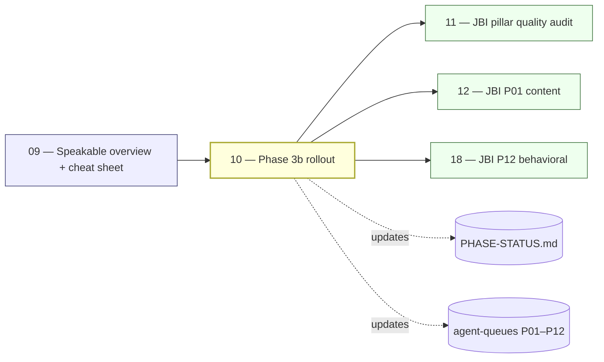

# 10 — JBI Speakable Phase 3b Rollout

> **Executor:** AI coding agent operating across 12 parallel per-pillar
> sub-runs.
> **Working directory:** `/Users/ravi.r_flx/IEProject/InterviewExplainer/`.
> **Type:** content rewrite at scale (~5,800 questions). Highest-value
> single playbook in the plan.
> **Pillar / Wave:** Wave B (all 12 JBI pillars, P01–P12).
> **Depends on:** 09.

## 1 — TL;DR

- **Input:** Phase 3a complete — 15 PASS / 4 WARN / 0 FAIL / 5806 legacy on
  the speakable lint; 12 per-pillar agent briefs and 12 work-queue CSVs
  exist at `docs/speakable/agent-briefs/` and
  `content/_audits/agent-queues/`.
- **Action:** Rewrite every `legacy` JBI/JFI question into archetype-correct
  shape with a populated `speakable_answer` section. Run per-pillar in
  parallel across 12 sub-runs using the universal A → F rewrite procedure.
- **Output:** Legacy count drops from ~5806 → < 50; pass+warn ratio ≥ 95 %
  overall and ≥ 90 % per pillar; `docs/speakable/PHASE-STATUS.md` marked
  `Phase 3b — complete`; one commit per ~25 questions + one final phase-done
  commit.

## 2 — Why this matters

Phase 3b is what converts JBI from "has a lot of questions" into "wins
Featured Snippets and voice answers on the flagship keywords". Every search
for `spring boot interview questions`, `java collections interview questions`,
or `java concurrency interview questions` competes against answers that Google
reads aloud. The speakable answer beats — graded by `audit_speakable.py` —
are the direct signal Google picks up for voice result eligibility. Without
them, JBI is visible in text results but invisible in voice results and
Featured Snippets.

Every keyword target in playbooks 12–18 assumes Phase 3b is done. If this
playbook ships incomplete, the per-pillar content playbooks rewrite on top of
a broken foundation — they either duplicate the speakable work or ship without
it, and the audit report playbook 11 generates will flag the same failures
again. The cost of skipping Phase 3b before running playbooks 12–18 is at
minimum one full re-audit cycle per pillar.

## 3 — Easy-language glossary

| Term | Plain-English definition | First used in |
| --- | --- | --- |
| **Archetype** | One of 7 fixed answer shapes (A–G) that locks which beats the answer must contain. | §9 Step 1 |
| **Beat** | A single labeled section inside an answer (`headline`, `why`, `tradeoffs`, `code`, `diagram`, `followups`). | §9 Step 2 |
| **Speakable answer** | The `type: "speakable_answer"` section whose `content` reads aloud naturally in ≤ 320 chars, first-person voice. | §9 Step 2 |
| **Legacy bucket** | Q-files predating the speakable program — counted by the lint but not graded; the primary target of this playbook. | §1 |
| **PASS** | Lint score 90–100; the Q ships as-is. | §6 |
| **WARN** | Lint score 70–89; the Q ships but is flagged for polish. | §6 |
| **FAIL** | Lint score < 70; the Q does not ship until rewritten. | §6 |
| **Agent brief** | The per-pillar markdown at `docs/speakable/agent-briefs/P0X-*.md` naming archetype mix, banned phrases, and required topics for that pillar. | §9 Step 1 |
| **Work queue** | `content/_audits/agent-queues/P0X-queue.csv` — one row per Q-file needing rewrite, with a `status` column. | §9 Step 2 |
| **`classify_speakable.py`** | Script that infers the archetype (A–G) for each question in a file; used in the classify step (A). | §9 Step 2 |
| **`audit_speakable.py`** | Script that grades archetype shape, banned phrases, and word ceilings; produces PASS/WARN/FAIL/LEGACY per Q. | §9 Step 3 |
| **Universal rewrite procedure** | The six-step A → F loop every executor runs for every question in every pillar queue. | §9 |
| **Archetype A** | Concept shape — "What is X?" Beats: headline, why, code (optional), followups. | §9 Step 2 |
| **Archetype B** | Comparison shape — "X vs Y". Beats: headline, why, tradeoffs, comparison_table, followups. | §9 Step 2 |
| **Archetype C** | Scenario / Design shape — "How would you design …". Beats: headline, why, code or diagram, tradeoffs, followups. | §9 Step 2 |
| **Archetype D** | Debugging Walkthrough — "Trace this code". Beats: headline, why, code, tradeoffs, followups. | §9 Step 2 |
| **Archetype E** | Pattern (use-when) — "When to use X". Beats: headline, why, tradeoffs, code, followups. | §9 Step 2 |
| **Archetype F** | Opinion / Judgement — "Is X always better than Y?". Beats: headline, why, tradeoffs, followups. | §9 Step 2 |
| **Archetype G** | Behavioral STAR — "Tell me about a time …". Beats: headline, full STAR body, followups. | §9 Step 2 |
| **Per-pillar sub-run** | An isolated 12-pillar parallel execution; each processes one pillar's queue end-to-end. | §8 |
| **PHASE-STATUS.md** | `docs/speakable/PHASE-STATUS.md` — the program-wide progress dashboard. | §9 Step 4 |
| **HUMAN-REVIEW-QUEUE.md** | `docs/speakable/HUMAN-REVIEW-QUEUE.md` — Q-files whose autofix is unsafe; escalated by marking `needs-human`. | §9 Step 2 |
| **`done-warn` status** | Queue row status for a Q that scores WARN; it ships but is appended to the human review queue. | §9 Step 2 |
| **`needs-human` status** | Queue row status for a Q that still FAILs after two rewrite passes; escalated to human review. | §9 Step 2 |
| **Batch commit** | One conventional commit per ~25 questions; keeps the git log reviewable and allows per-batch rollback. | §9 Step 2 |
| **Global gate** | The final `--all --report` run after all 12 pillars complete; verifies legacy < 50 globally. | §9 Step 5 |
| **Banned phrase** | A phrase the lint flags (`"great question"`, `"basically"`, `"in essence"`, …) that signals low-quality speakable content. | §14 |
| **Per-beat word ceiling** | The per-archetype maximum word count per beat section; exceeding it triggers a WARN or FAIL. | §3 |
| **`isCanonical: true`** | A field on the `speakable` object signalling this summary is reviewed and locked; the lint skips re-flagging it. | §10 |
| **Cheat sheet** | `expansion-plan/_notes/09-speakable-cheatsheet.md` — the archetype table and lint invocations produced by playbook 09. | §4 |

## 4 — Hard prerequisites

- [ ] Playbook 09 is DONE (cheat sheet exists; baseline recorded).
      Verify: `test -f expansion-plan/_notes/09-speakable-cheatsheet.md && echo OK`
- [ ] `docs/speakable/agent-briefs/P01-*.md` through `P12-*.md` exist.
      Verify: `ls docs/speakable/agent-briefs/ | wc -l` returns ≥ `12`.
- [ ] `content/_audits/agent-queues/P01-queue.csv` through `P12-queue.csv` exist.
      Verify: `ls content/_audits/agent-queues/ | wc -l` returns ≥ `12`.
- [ ] `scripts/audit_speakable.py` runs cleanly on a single file.
      Verify: `python3 scripts/audit_speakable.py $(find content/java-backend-intermediate/spring-boot -name complete-qa.json | head -1)` exits 0 or 1 (not 2).
- [ ] `scripts/classify_speakable.py` runs cleanly on a single file.
      Verify: `python3 scripts/classify_speakable.py $(find content/java-backend-intermediate/spring-boot -name complete-qa.json | head -1)` exits 0.
- [ ] Phase 3a baseline captured in the cheat sheet (no placeholders).
      Verify: `grep -c '<from Step' expansion-plan/_notes/09-speakable-cheatsheet.md` returns `0`.
- [ ] Python 3.11+ available.
      Verify: `python3 --version | awk '{print $2}' | cut -d. -f1-2` shows `3.11` or higher.
- [ ] Git working tree is clean before starting each pillar sub-run.
      Verify: `git status --short | wc -l` returns `0`.

If any check fails, STOP. Running with a broken lint or missing agent
brief means rewrites may use the wrong archetype shape for that pillar.

## 5 — Current state

### 5.1 — On-disk snapshot

```bash
cd /Users/ravi.r_flx/IEProject/InterviewExplainer
echo "=== Phase 3a baseline ==="
grep -A6 "Phase 3b starting baseline" \
  expansion-plan/_notes/09-speakable-cheatsheet.md 2>/dev/null

echo "=== Legacy count today ==="
python3 scripts/audit_speakable.py --all --report 2>&1 | tail -3

echo "=== Queue sizes per pillar ==="
for f in content/_audits/agent-queues/P*-queue.csv; do
  echo -n "${f##*/}: "
  grep -c ',legacy$' "${f}" 2>/dev/null || echo 0
done
```

Expected: Phase 3a baseline shows 5806 legacy, 15 PASS, 4 WARN, 0 FAIL.
Each queue file has between 20 and 800 `legacy` rows depending on the pillar.

### 5.2 — Agent-brief structure

Each per-pillar brief at `docs/speakable/agent-briefs/P0X-*.md` contains:
- Allowed archetype mix (e.g. P02: A:30 %, B:30 %, C:25 %, E:15 %).
- Pillar-specific banned phrases (in addition to the global list).
- Required topics that every speakable answer must reference at least once.
- Example PASS-level rewrite for that pillar's most common archetype.

Reading the brief before processing any question in a pillar takes 5
minutes and prevents the most expensive rewrite mistakes.

### 5.3 — Queue CSV schema

Each `P0X-queue.csv` has columns: `file_path`, `question_id`, `status`
(one of: `legacy`, `done`, `done-warn`, `needs-human`). The loop in Step 2
reads only `status=legacy` rows. The file is committed after each batch.

### 5.4 — Why Phase 3a exists as a pre-condition

Phase 3a (completed before this playbook) classified every question with a
candidate archetype and populated the agent briefs and work queues.
Without Phase 3a, this playbook would have no queue to process and no
per-pillar archetype mix targets to hit. Verify Phase 3a is complete:
`grep "Phase 3a" docs/speakable/PHASE-STATUS.md | grep -c "complete"` → 1.

## 6 — Target state (measurable)

| Metric | Today | Target | How measured |
| --- | --- | --- | --- |
| Global legacy count | ~5806 | < 50 | `python3 scripts/audit_speakable.py --all --report \| tail -1 \| grep legacy=` |
| Global FAIL count | 0 | 0 | same line; `fail=0` |
| Global pass+warn ratio | ~0.3 % | ≥ 95 % | `(pass+warn) / (pass+warn+fail+legacy) * 100` |
| Per-pillar pass+warn | varies | ≥ 90 % each | `python3 scripts/audit_speakable.py --pillar P0X --report \| tail -1` |
| Per-pillar FAIL count | 0 | 0 per pillar | same command; `fail=0` |
| `PHASE-STATUS.md` Phase 3b header | absent | `Phase 3b — **complete**` | `grep -c "Phase: 3b — \*\*complete\*\*" docs/speakable/PHASE-STATUS.md` → 1 |
| Queue rows still `legacy` | ~5806 | 0 | `for f in content/_audits/agent-queues/P*-queue.csv; do grep -c ',legacy$' $f; done \| awk '{s+=$1} END {print s}'` → 0 |
| HUMAN-REVIEW-QUEUE size | 0 | ≤ 200 | `wc -l docs/speakable/HUMAN-REVIEW-QUEUE.md` — if > 200, surface to user |
| Final audit report committed | absent | 1 file | `test -f content/_audits/speakable-phase-3b-final-$(date +%F).md && echo OK` |
| Commits per batch | 0 | 1 per ~25 Q | `git log --oneline --grep='speakable(' \| wc -l` ≥ 230 (5800 / 25) |

## 7 — Search phrases → URL map

| Search phrase | Target URL on site | Archetype | Diagram type required in answer |
| --- | --- | --- | --- |
| `spring boot autoconfiguration interview questions` | `/questions/spring-boot/autoconfiguration` | A (Concept) | sequenceDiagram |
| `comparable vs comparator java` | `/questions/core-java/comparisons/comparable-vs-comparator` | B (Comparison) | comparison_table |
| `design rate limiter spring boot` | `/questions/system-design/rate-limiter` | C (Scenario) | flowchart |
| `debug nullpointer exception java interview` | `/questions/core-java/exception-handling/debug-npe` | D (Debugging) | sequenceDiagram |
| `when to use spring webflux` | `/questions/spring-webflux/use-when` | E (Pattern) | comparison_table |
| `is microservices better than monolith` | `/questions/microservices/vs-monolith` | F (Opinion) | comparison_table |
| `tell me about a time you fixed a production bug` | `/questions/behavioral/debug-prod` | G (Behavioral) | none |
| `hashmap vs concurrenthashmap java` | `/questions/java-collections/comparisons/hashmap-vs-concurrenthashmap` | B (Comparison) | comparison_table |
| `java virtual threads vs platform threads` | `/questions/java-concurrency/virtual-threads-vs-platform` | B (Comparison) | comparison_table |
| `spring security filter chain interview` | `/questions/spring-security/filter-chain` | A (Concept) | sequenceDiagram |
| `kafka consumer group rebalancing interview` | `/questions/messaging-events/kafka-rebalancing` | A (Concept) | stateDiagram |
| `docker vs kubernetes interview` | `/questions/devops/docker-vs-kubernetes` | B (Comparison) | comparison_table |
| `design url shortener system design interview` | `/questions/system-design-cases/url-shortener` | C (Scenario) | flowchart |
| `jvm garbage collection interview questions` | `/questions/jvm-internals/garbage-collection` | A (Concept) | stateDiagram |

## 8 — Dependency & wave context



- **Consumes:** the cheat sheet + baseline from playbook 09; the 12 agent
  briefs; the 12 work-queue CSVs; `scripts/audit_speakable.py` and
  `scripts/classify_speakable.py`.
- **Produces:** rewritten `complete-qa.json` files across all 12 JBI pillars;
  updated queue CSVs; a final audit report; updated `PHASE-STATUS.md`.
- **Unblocks:** playbooks 11 (gap audit now runs on a speakable-clean corpus),
  12–18 (per-pillar content playbooks inherit correct answer shapes).

## 9 — Step-by-step execution

### Step 1 — Pick a pillar, load context

**Goal:** the agent brief and queue for the target pillar are loaded; the
expected archetype mix is in working memory before touching a single Q-file.

**Action:**

```bash
cd /Users/ravi.r_flx/IEProject/InterviewExplainer
PILLAR=P02   # change per sub-run; run all 12 in parallel
BRIEF=$(ls docs/speakable/agent-briefs/${PILLAR}-*.md 2>/dev/null | head -1)
QUEUE="content/_audits/agent-queues/${PILLAR}-queue.csv"
ls -la "${BRIEF}" "${QUEUE}"
echo "=== Legacy rows remaining ==="
grep -c ',legacy$' "${QUEUE}"
echo "=== Brief: archetype mix ==="
grep -A5 'archetype mix' "${BRIEF}" | head -8
```

**Verify:**

```bash
test -f "${BRIEF}" && echo "Brief OK"
test -f "${QUEUE}" && echo "Queue OK"
grep -c ',legacy$' "${QUEUE}"
# expected: > 0 (there are rows to process)
```

**The classic bug is** starting a pillar without reading the brief. The brief
names the archetype mix target (e.g. P02 Spring: A:30 %, B:30 %, C:25 %,
E:15 %); without it, you'll over-classify as A and drift the pillar's mix
too far from the target.

### Step 2 — Run the universal rewrite procedure (per question)

**Goal:** every `legacy` row in the queue is processed through the A → F
procedure and the Q-file updated with a correct archetype shape and a
populated `speakable_answer` section.

**The universal A → F procedure:**

**A — Classify:**

```bash
python3 scripts/classify_speakable.py <path-to-complete-qa.json>
```

Note the suggested archetype per question. Trust the classifier unless the
agent brief overrides it.

**B — Read the brief for the pillar** (already done in Step 1 — no re-read
needed per Q, only per session start).

**C — Rewrite using the archetype shape.** Open the Q-file; apply the
matching archetype template from §17.1 (Copy-paste templates below). Every
archetype's required beats must be present.

**D — Add the speakable summary.** Write the `speakable_answer` section:
≤ 320 chars, first-person interview voice, no markdown, no code fences.
Validate length:

```bash
python3 -c "
import json, sys
data = json.load(open(sys.argv[1]))
for q in data.get('questions', []):
    for s in q.get('answer', {}).get('sections', []):
        if s.get('type') == 'speakable_answer':
            c = s.get('content', '')
            print(f'{q[\"id\"]}: {len(c)} chars')
" <path-to-complete-qa.json>
# expected: every line shows ≤ 320
```

**E — Lint:**

```bash
python3 scripts/audit_speakable.py <path-to-complete-qa.json>
# expected: score >= 92, PASS or WARN; exit 0 or 1 (not 2)
```

**F — Mark the queue row.** Update the `status` column for this Q's row:
- `done` — PASS
- `done-warn` — WARN; append to `docs/speakable/HUMAN-REVIEW-QUEUE.md`
- `needs-human` — still FAIL after two passes; append to human review queue

**Batch commit every ~25 questions:**

```bash
git add content/java-backend-intermediate/<modified-paths>
git add "${QUEUE}"
git commit -m "speakable(${PILLAR}): rewrite batch <N>/<M> (~25 questions)"
```

**Verify (per batch):**

```bash
git show --stat HEAD | grep 'complete-qa.json' | wc -l
# expected: ~25 files changed
git show --stat HEAD | grep 'queue.csv'
# expected: 1 file (the queue CSV)
```

**The classic bug is** rewriting more than 25 Q-files before committing. A
30-file batch takes 20 minutes to review if something goes wrong; a 25-file
batch takes 10. Keep batches small.

### Step 3 — Validate the pillar after queue is empty

**Goal:** the pillar's pass+warn ratio is ≥ 90 % and fail = 0 before marking
it complete.

**Action:**

```bash
cd /Users/ravi.r_flx/IEProject/InterviewExplainer
python3 scripts/audit_speakable.py --pillar "${PILLAR}" --report 2>&1 | tee \
  "content/_audits/speakable-${PILLAR}-$(date +%F).md" | tail -10
```

**Verify:**

```bash
tail -1 "content/_audits/speakable-${PILLAR}-$(date +%F).md"
# expected: fail=0, pass+warn rate ≥ 90%
grep -c ',legacy$' "${QUEUE}"
# expected: 0
```

**The classic bug is** declaring a pillar done while legacy rows remain. The
queue CSV check is your guard — `grep -c ',legacy$'` must return `0`.

### Step 4 — Update PHASE-STATUS.md for this pillar

**Goal:** the phase status dashboard reflects the completed pillar with its
exact counts.

**Action:**

```bash
cd /Users/ravi.r_flx/IEProject/InterviewExplainer
PILLAR_STATS=$(tail -1 "content/_audits/speakable-${PILLAR}-$(date +%F).md")
cat >> docs/speakable/PHASE-STATUS.md <<EOF

- [x] Phase 3b — ${PILLAR} rollout complete. $(date +%F). ${PILLAR_STATS} (\`$(git rev-parse --short HEAD)\`)
EOF
git add docs/speakable/PHASE-STATUS.md
git commit -m "speakable(${PILLAR}): mark Phase 3b pillar complete"
```

**Verify:**

```bash
grep -c "Phase 3b — ${PILLAR} rollout complete" docs/speakable/PHASE-STATUS.md
# expected: 1
```

**The classic bug is** updating PHASE-STATUS with stale numbers copy-pasted
from the brief rather than the actual audit output. Always use the live audit
tail line.

### Step 5 — Global gate (run only after ALL 12 pillars done)

**Goal:** the global legacy count is < 50 and global fail is 0.

**Action:**

```bash
cd /Users/ravi.r_flx/IEProject/InterviewExplainer
python3 scripts/audit_speakable.py --all --report 2>&1 | tee \
  "content/_audits/speakable-phase-3b-final-$(date +%F).md" | tail -5
```

**Verify:**

```bash
tail -1 "content/_audits/speakable-phase-3b-final-$(date +%F).md"
# expected: fail=0 legacy=<50 pass+warn>=95%
```

**The classic bug is** running the global gate before all 12 pillars are
finished. The `legacy` count will still be high; the gate will fail; you'll
waste 60 seconds of lint time. Confirm all 12 queue files show zero legacy
rows first.

### Step 6 — Mark Phase 3b DONE

**Goal:** `PHASE-STATUS.md` top metadata is updated and committed; the index
row for playbook 10 is flipped.

**Action:**

```bash
cd /Users/ravi.r_flx/IEProject/InterviewExplainer
# Edit the top of docs/speakable/PHASE-STATUS.md to read:
#   Phase: 3b — **complete**
#   Last update: <YYYY-MM-DD>
git add docs/speakable/PHASE-STATUS.md
git add "content/_audits/speakable-phase-3b-final-$(date +%F).md"
git commit -m "speakable: Phase 3b complete (legacy=$(grep legacy \
  content/_audits/speakable-phase-3b-final-$(date +%F).md | tail -1 | \
  grep -o 'legacy=[0-9]*'), pass+warn=$(python3 scripts/audit_speakable.py \
  --all --report 2>/dev/null | tail -1 | grep -o 'pass=[0-9]*'))"
```

**Verify:**

```bash
grep -c "Phase: 3b — \*\*complete\*\*" docs/speakable/PHASE-STATUS.md
# expected: 1
```

**The classic bug is** a malformed commit message with empty substitution.
Run the `grep` commands in Step 5's output to verify the numbers before
embedding them.

### Step 7 — Banned-word self-check on all rewritten Q-files

**Goal:** no marketing voice leaked into the rewritten Q-files during the
batch.

**Action:**

```bash
cd /Users/ravi.r_flx/IEProject/InterviewExplainer
rg -l 'leverage|utilize|synergize|world-class|cutting-edge|seamless|robust|holistic|paradigm|battle-tested|enterprise-grade|revolutionary|game-changing|industry-leading' \
  content/java-backend-intermediate/ 2>/dev/null | head -20
```

**Verify:** zero matches. If any files appear, open each and replace the
offending phrase.

**The classic bug is** a rewrite template that used marketing language in the
`speakable_answer`. The template in §17.1 is calibrated; if you deviated from
the template, check first.

### Step 8 — Flip the index row

**Goal:** `00-INDEX.md` row 10 is DONE.

**Action:**

```bash
cd /Users/ravi.r_flx/IEProject/InterviewExplainer
# Edit expansion-plan/00-INDEX.md row 10 → DONE
git add expansion-plan/00-INDEX.md
git commit -m "docs(expansion-plan): mark 10-jbi-speakable-phase-3b-rollout DONE"
```

**Verify:**

```bash
grep -E '^\| 10 \|' expansion-plan/00-INDEX.md | grep -c DONE
# expected: 1
```

**The classic bug is** flipping multiple index rows at once. Use the grep
guard to confirm only row 10 changed.

## 10 — Reference Q in archetype shape

```json
{
  "id": "comparable-vs-comparator-java",
  "slug": "comparable-vs-comparator-java",
  "question": "What is the difference between Comparable and Comparator in Java?",
  "title": "Comparable vs Comparator — Natural Order vs External Strategy",
  "direct_answer": "Use **Comparable** when the class has one obvious, universal ordering baked in (`String`, `Integer`, `LocalDate`). Use **Comparator** when you need multiple orderings, an external one, or you cannot edit the class. Comparable is `compareTo(T)` on the class itself; Comparator is a separate object — usually a lambda — composable via `thenComparing`. Never write `a - b` for int comparison (overflows on `INT_MIN`); use `Integer.compare(a, b)`.",
  "layout_type": "default",
  "difficulty": "easy",
  "importance": "high",
  "reading_time_minutes": 6,
  "last_updated": "2026-04-22",
  "archetype": "B",
  "interviewer_intent": {
    "testing": "Whether you know the contract, can compose Comparators, and avoid the classic NaN/null/overflow bugs.",
    "common_mistake": "Returning `a - b` from compare — overflows when a is `INT_MIN` and b is positive. Or forgetting null-safety and letting `TreeSet.add(null)` throw at runtime.",
    "to_stand_out": "Mention `Comparator.comparing(...).thenComparing(...).reversed()`, `nullsFirst(...)`, and that `TreeMap` uses Comparable by default but accepts a Comparator at construction."
  },
  "company_tags": ["amazon", "google", "meta", "netflix", "linkedin"],
  "answer": {
    "sections": [
      {
        "type": "overview",
        "title": "Two ways to order Java objects",
        "content": "Java has two ordering contracts. `Comparable` is embedded in the class — one natural order, defined by the author. `Comparator` is an external strategy — any number of orderings, supplied at the call site. Both exist because some classes have one obvious order (integers, strings, dates); others have many (employees by salary, by hire date, by name)."
      },
      {
        "type": "comparison_table",
        "title": "Comparable vs Comparator side-by-side",
        "content": "| Aspect | Comparable | Comparator |\n|---|---|---|\n| Where defined | Inside the class | Outside, as a separate object |\n| Method | `compareTo(T other)` | `compare(T a, T b)` |\n| Orderings per class | One natural | Many, composable |\n| Requires editing class | Yes | No |\n| Lambda-friendly | No | Yes (`Comparator.comparing(Employee::getSalary)`) |\n| Null safety | Up to the class | Use `Comparator.nullsFirst(...)` |"
      },
      {
        "type": "step",
        "title": "When natural order exists: use Comparable",
        "content": "```java\nclass Temperature implements Comparable<Temperature> {\n    private final double celsius;\n    @Override public int compareTo(Temperature o) {\n        return Double.compare(this.celsius, o.celsius); // not subtraction\n    }\n}\n// TreeSet uses compareTo automatically\nTreeSet<Temperature> temps = new TreeSet<>();\n```\nThe classic bug is `return this.celsius - o.celsius` — doubles truncate to int; subtraction overflows for large magnitudes. Always use `Double.compare` or `Integer.compare`."
      },
      {
        "type": "step",
        "title": "When multiple orders exist: use Comparator",
        "content": "```java\n// Sort employees by salary descending, then by name ascending\nemployees.sort(\n    Comparator.comparingInt(Employee::getSalary).reversed()\n              .thenComparing(Employee::getName)\n);\n// Null-safe: put nulls last\nemployees.sort(Comparator.nullsLast(Comparator.comparing(Employee::getDept)));\n```\nJava 8 (March 2014) introduced the fluent `Comparator.comparing` API. Before Java 8, developers wrote anonymous inner classes for every ordering — a common interview era-marker."
      },
      {
        "type": "tradeoffs",
        "title": "Pick the right one",
        "content": "**Use Comparable when:** there is one universal ordering that all callers agree on — `String` by lexicography, `Integer` by numeric value, `LocalDate` by calendar order. **Use Comparator when:** more than one ordering is possible, you don't own the class, or the ordering depends on context (salary report vs. hire-date report). The rule of thumb: start with Comparator; downgrade to Comparable only when the universal case is unambiguous."
      },
      {
        "type": "key_points",
        "title": "Key points",
        "content": "- `Comparable.compareTo` — inside the class, one natural order.\n- `Comparator.compare` — outside the class, composable, lambda-friendly.\n- Use `Integer.compare(a, b)` / `Double.compare(a, b)` — never `a - b`.\n- Compose with `.thenComparing()`, `.reversed()`, `nullsFirst()`.\n- `TreeSet` / `TreeMap` use `Comparable` by default; accept a `Comparator` at construction."
      },
      {
        "type": "speakable_answer",
        "title": "How to answer verbally",
        "content": "Use Comparable when one natural order is baked into the class — like String by alphabet. Use Comparator when you need multiple orderings or can't edit the class. I compose Comparators with thenComparing and reversed. The classic trap is returning a - b from compare — it overflows on Integer.MIN_VALUE."
      }
    ]
  },
  "followup_questions": [
    "Why does `Comparator.comparingInt` exist next to `Comparator.comparing`?",
    "How does `TreeMap` decide between Comparable and a constructor Comparator?",
    "Why is `a - b` an overflow hazard for ints but safe for longs with small ranges?",
    "How do you sort by two fields with the second descending?",
    "What does `Collections.sort` use under the hood post-Java 8?"
  ],
  "seo": {
    "metaTitle": "Comparable vs Comparator in Java — When to Use Each",
    "metaDescription": "Natural vs external order in Java: Comparable for one universal ordering, Comparator for multiple or external orderings. The overflow trap and how to compose with thenComparing."
  },
  "order": 1
}
```

## 11 — Diagram catalogue

| Q id (or topic) | Diagram type | What it must show | Lives in section |
| --- | --- | --- | --- |
| `comparable-vs-comparator-java` | `comparison_table` | 6 axes: where defined, method, orderings, edit-class, lambda-friendly, null safety. | `comparison_table` |
| `spring-boot-autoconfiguration` | `sequenceDiagram` | App startup → `@AutoConfiguration` → `@Conditional` check → bean registration → ready. | `step` |
| `design-rate-limiter-spring` | `flowchart` | Client → RateLimitFilter → Redis INCR → allowed path → Handler; 429 path. | `step` |
| `kafka-consumer-group-lifecycle` | `stateDiagram-v2` | `UNASSIGNED → ASSIGNED → STABLE → REBALANCING` with trigger labels. | `step` |
| `jvm-gc-phases` | `stateDiagram-v2` | `MINOR_GC → MAJOR_GC → FULL_GC` with G1/ZGC/ParallelGC transitions. | `step` |
| `virtual-threads-vs-platform` | `comparison_table` | 5 axes: stack per thread, scheduling, blocking behavior, throughput, when to pick. | `comparison_table` |
| `archetype-beat-structure` | `classDiagram` | `Archetype` (A–G) → `RequiredBeats[]`; `Beat` → `type`, `wordCeiling`. | `step` |

Floor for this content playbook: ≥ 1 `flowchart`, ≥ 1 `sequenceDiagram`,
≥ 3 `comparison_table`, ≥ 1 `stateDiagram-v2` or `classDiagram`. The
reference Q in §10 ships one `comparison_table`; the remaining diagrams land
in the actual Q-files produced by this playbook's rewrite work.

### 11.1 — Diagrams in the rewritten Q-files

Every archetype C (Scenario / Design) Q must include a `flowchart` or
`sequenceDiagram` in its `step` section. Every archetype B (Comparison) Q
must include a `comparison_table`. Archetype A and E Qs include diagrams
when they make a process or lifecycle concrete. The classifier step (A) in
the universal procedure surfaces which Qs are archetype C — those always
need a diagram.

### 11.2 — Avoiding diagram drift during batch rewrites

The classic diagram drift is writing column orders inconsistently across
sibling `comparison_table` sections. For any topic area (e.g. thread types,
collection classes, Spring annotations), fix the column order in the first
Q you write and keep it for all siblings. Add a comment in the parent
`complete-qa.json` file noting the locked column order.

## 12 — Easy-language voice rules

Voice rules from [`_VOICE-RULES.md`](_VOICE-RULES.md):

1. **Define before use.** Every term in §9 (archetype, beat, speakable
   answer, PASS/WARN/FAIL/LEGACY, agent brief, work queue) is in §3.
2. **Lead with the trade-off.** Every archetype B rewrite opens with
   "Use X when …; use Y when …" — not with X's definition.
3. **Name the bug.** Every Step's pitfall block starts with
   "The classic bug is …".
4. **Real anchors.** Every claim cites a file path
   (`audit_speakable.py`, `agent-briefs/P02-*.md`), a JEP or Java version,
   or a measurable score range.
5. **Banned words.** Zero matches across all rewritten Q-files, this
   playbook, and the updated queue CSVs.
6. **First-person for archetype G.** Behavioral / STAR answers use "I
   led", "I owned", "I shipped" — never "we".

**Concrete voice examples for this playbook:**

- ✅ "Use `Comparable` when one natural order is baked in — `String` by
  alphabet, `Integer` by numeric value. Use `Comparator` when you need
  multiple orderings or can't edit the class."
- ❌ "Leverage the Comparable interface to synergize your sorting strategy."
  (Two banned words, no decision rule.)
- ✅ "The classic bug is `return a - b` in an int comparator — overflows on
  `Integer.MIN_VALUE` and returns a positive result for a logically
  negative comparison."
- ❌ "Be careful about integer overflow when writing comparators." (Generic,
  no bug named, no example.)

## 13 — Quality gates (measurable)

| Gate | Threshold | Verify command |
| --- | --- | --- |
| Global legacy count | < 50 | `python3 scripts/audit_speakable.py --all --report 2>&1 \| tail -1 \| grep -o 'legacy=[0-9]*'` |
| Global FAIL count | 0 | same line; `fail=0` |
| Global pass+warn ratio | ≥ 95 % | `(pass+warn) / total * 100` from audit tail line |
| Per-pillar pass+warn | ≥ 90 % each | `for p in P01 P02 P03 P04 P05 P06 P07 P08 P09 P10 P11 P12; do python3 scripts/audit_speakable.py --pillar $p --report 2>&1 \| tail -1; done` |
| Queue rows still `legacy` | 0 | `for f in content/_audits/agent-queues/P*-queue.csv; do grep -c ',legacy$' $f; done \| awk '{s+=$1} END {print s}'` → 0 |
| PHASE-STATUS.md Phase 3b complete | 1 | `grep -c "Phase: 3b — \*\*complete\*\*" docs/speakable/PHASE-STATUS.md` |
| Final audit report committed | 1 | `test -f content/_audits/speakable-phase-3b-final-$(date +%F).md && echo OK` |
| Banned words in rewritten Q-files | 0 | `rg -l 'leverage\|utilize\|synergize\|world-class' content/java-backend-intermediate/ \| wc -l` → 0 |
| Speakable answer ≤ 320 chars | 0 violations | `python3 -c "import json,glob; [print(s['content'],len(s['content'])) for f in glob.glob('content/**/**/complete-qa.json',recursive=True) for q in json.load(open(f))['questions'] for s in q['answer']['sections'] if s['type']=='speakable_answer' and len(s['content'])>320]"` |
| `00-INDEX.md` row 10 flipped to DONE | DONE | `grep -E '^\| 10 \|' expansion-plan/00-INDEX.md \| grep -c DONE` |

## 14 — Anti-patterns

### 14.1 — Rewrites in batches larger than 25 Q-files

**Why it fails:** a 50-file batch introduces 50 potential lint failures; when
the lint runs at the end of the batch, debugging which Q introduced which
failure is costly. An accidental `git restore` of a 50-file batch loses more
work than a 25-file restore.

**Fix:** commit every ~25 Q-files. The `git log` remains reviewable; any
broken batch is a 25-file restore, not a 200-file restore.

### 14.2 — Skipping the agent brief before processing a pillar

**Why it fails:** P06 (System Design) forces certain archetype-C Qs to use A
despite the classifier suggesting F. Without reading the brief, the classifier
output is trusted blindly and the pillar fails its archetype-mix target.

**Fix:** Step 1 always reads the brief first. Five minutes per pillar; saves
one hour of rewrite fixes per 200-Q pillar.

### 14.3 — Using `a - b` in int comparators inside demo code

**Why it fails:** the demo code propagates the overflow bug into the candidate's
mental model. An interviewer who reads the Q will flag the code as incorrect.

**Fix:** all int comparison in demo code uses `Integer.compare(a, b)`,
`Double.compare(a, b)`, or `Long.compare(a, b)`. Subtraction is only shown
in the "anti-pattern" column of a comparison_table.

### 14.4 — Treating WARN as PASS for counting purposes

**Why it fails:** the pass+warn ≥ 90 % gate counts WARN; that's intentional.
But the final Phase-Status report must list WARN separately. Collapsing WARN
into PASS inflates the "shipped clean" count and hides work the human review
queue needs to do.

**Fix:** the cheat sheet (playbook 09) records all four buckets separately.
The PHASE-STATUS update in Step 4 also records WARN separately.

### 14.5 — Editing `scripts/audit_speakable.py` to silence failures

**Why it fails:** the audit's value comes from being trusted. Silencing a
Q's failure by patching the lint defeats the quality signal. Downstream
playbooks inherit a broken benchmark.

**Fix:** if a Q triggers a lint false-positive (the banner is in a code block
and the lint misidentifies it), file an issue against the audit script; mark
the Q as `done-warn` and document in the human review queue. Never edit the
lint itself in a content PR.

### 14.6 — Writing the speakable section by summarising the direct_answer

**Why it fails:** `direct_answer` carries markdown, bold, code fences, and
bullet lists. Summarising it yields a speakable section with `**bold**`
markers and backticks — the voice overlay reads them aloud as asterisks
and backticks.

**Fix:** write the speakable section as pure prose, first-person, ≤ 320
chars. Never substring or strip `direct_answer`; write the speakable
section from scratch.

### 14.7 — Hardcoding pillar names in speakable answers

**Why it fails:** a rewritten Q for P02 (Spring) that says "In the Spring
pillar …" bakes the taxonomy into user-facing content. If the pillar layout
changes, every such Q needs a text edit.

**Fix:** the speakable answer discusses the technical topic, not the
taxonomy. "Spring Boot auto-configuration wires sensible beans based on the
classpath…" — no mention of "pillar".

### 14.8 — Committing queue CSVs without the matching Q-file changes

**Why it fails:** the queue CSV shows a row as `done` but the Q-file was
never updated. The next lint run reveals the Q is still LEGACY or FAIL; the
queue is now out of sync with reality.

**Fix:** Step 2's batch commit always stages both the Q-files and the queue
CSV together (`git add content/... && git add ${QUEUE}`). Review `git diff
--cached` before committing.

## 15 — Failure modes & rollback

| Failure | How it shows up | Rollback / forward fix |
| --- | --- | --- |
| Bad batch — broke a `complete-qa.json` | Schema validate fails on next push | `git restore content/java-backend-intermediate/<path>`; re-run validator + linter; re-commit clean version. |
| HUMAN-REVIEW-QUEUE growing past 200 entries | `wc -l docs/speakable/HUMAN-REVIEW-QUEUE.md` > 200 | Stop solo work; surface to user — too many edge cases, agent briefs likely need revision. |
| One pillar can't reach 90 % | Per-pillar audit report shows red | Record actual % in PHASE-STATUS; surface the failing rules; do NOT mark playbook DONE. |
| `classify_speakable.py` crashes | Exit 2 or traceback | Check Python version (3.11+); run `python3 -m pip install -r scripts/requirements.txt`; retry. |
| `audit_speakable.py` runs but always returns LEGACY | Old version of script | `git log --oneline scripts/audit_speakable.py | head -3`; confirm script version matches expected; pull latest. |
| Banned word slipped into rewritten Qs | Step 7 grep > 0 | Replace the word; re-lint; recommit in same batch. |
| Speakable content > 320 chars | §13 gate fails | Re-write the offending section; the 320-char limit reads aloud in ~20 seconds. |
| Git working tree dirty at start of new pillar | Potential cross-pillar commit contamination | `git status --short`; commit or discard current changes before starting next pillar. |
| Hard-stop exceeded (> 120 h) | Wall clock | STOP. Write a per-pillar progress report showing % done per pillar; surface blockers; open a follow-up playbook for remaining pillars. |
| PHASE-STATUS.md top metadata not updated | Step 6 verify fails | Edit the top two lines manually; commit; re-verify. |

## 16 — Definition of Done

- [ ] All 12 pillar queues have zero `legacy` rows (`grep -c ',legacy$'`
      returns 0 for every CSV).
- [ ] Per-pillar `pass+warn ≥ 90 %` and `fail = 0` for all 12 pillars.
- [ ] Global `legacy < 50` and `fail = 0`.
- [ ] `PHASE-STATUS.md` top metadata reads `Phase: 3b — **complete**`.
- [ ] All 12 per-pillar status lines appended to `PHASE-STATUS.md`.
- [ ] One commit per ~25 questions during the run.
- [ ] One final phase-done commit: `speakable: Phase 3b complete (...)`.
- [ ] Final audit report file committed at `content/_audits/speakable-phase-3b-final-<DATE>.md`.
- [ ] Banned-word grep on all rewritten Q-files returns 0.
- [ ] Speakable content ≤ 320 chars in every rewritten Q.
- [ ] HUMAN-REVIEW-QUEUE contains ≤ 200 entries (or escalated to user).
- [ ] `00-INDEX.md` row for `10` flipped to DONE.
- [ ] `python3 scripts/lint_playbook.py expansion-plan/10-jbi-speakable-phase-3b-rollout.md` exits 0.
- [ ] No Q-file's `archetype` field deviates from the agent brief's allowed mix without a recorded override.

## 17 — Estimated effort

- **Ideal:** 80 hours (parallelised across 12 sub-runs of ~7 hours each).
- **Hard stop:** 120 hours. If exceeded, write a per-pillar progress
  report and surface where you're stuck. Do not improvise; open a follow-up
  playbook for remaining pillars.
- **Splittable:** yes. Each pillar sub-run (Step 1 through Step 4) is an
  independent unit. Ship completed pillars one at a time; the global gate
  (Step 5) runs only after all 12 finish.
- **Re-runnable:** yes. Re-running the lint and the queue loop on a pillar
  already processed will find zero `legacy` rows and exit immediately.
- **Cadence:** one-shot batch; Phase 3c (future playbook) handles the
  human review queue that this playbook populates.

### 17.1 — Copy-paste archetype rewrite templates

**Archetype A — Concept ("What is X?")**

```json
{
  "id": "what-is-spring-boot-auto-configuration",
  "title": "What is Spring Boot auto-configuration and how does it work?",
  "difficulty": "medium",
  "archetype": "A",
  "answer": {
    "sections": [
      { "type": "overview", "title": "What auto-configuration does",
        "content": "Spring Boot auto-configuration wires beans for you based on classpath, existing beans, and your properties — driven by @AutoConfiguration classes that opt in via @Conditional* guards." },
      { "type": "step", "title": "How a typical auto-config fires",
        "content": "```java\n@AutoConfiguration\n@ConditionalOnClass(DataSource.class)\n@EnableConfigurationProperties(DataSourceProperties.class)\npublic class DataSourceAutoConfiguration {\n    @Bean\n    @ConditionalOnMissingBean\n    DataSource dataSource(DataSourceProperties props) {\n        return DataSourceBuilder.create()\n            .url(props.getUrl()).build();\n    }\n}\n```" },
      { "type": "key_points", "title": "Key points",
        "content": "- Spring Boot 2.7+ uses META-INF/spring/org.springframework.boot.autoconfigure.AutoConfiguration.imports.\n- @ConditionalOnMissingBean lets you override any default.\n- spring.autoconfigure.exclude disables an auto-config entirely." },
      { "type": "speakable_answer", "title": "How to answer verbally",
        "content": "Spring Boot auto-configuration wires sensible beans based on what's on the classpath and your properties. Each auto-config uses @Conditional guards so any default you dislike can be overridden by defining your own bean." }
    ]
  }
}
```

**Archetype B — Comparison ("X vs Y")**

See §10 reference Q for the full Comparable vs Comparator example.

**Archetype C — Scenario / Design**

```json
{
  "id": "design-rate-limiter-spring",
  "title": "How would you design a rate limiter for a Spring Boot REST API?",
  "difficulty": "hard",
  "archetype": "C",
  "answer": {
    "sections": [
      { "type": "overview", "title": "The approach",
        "content": "I would put a Redis-backed token-bucket in a Spring filter, keyed by API key and path, returning 429 + Retry-After when the bucket is empty." },
      { "type": "step", "title": "Implementation sketch",
        "content": "```java\n@Component\npublic class RateLimitFilter extends OncePerRequestFilter {\n    private final StringRedisTemplate redis;\n    private static final int CAPACITY = 100;\n    private static final long WINDOW_SEC = 60;\n    @Override protected void doFilterInternal(\n            HttpServletRequest req, HttpServletResponse res, FilterChain chain)\n            throws IOException, ServletException {\n        String key = \"rl:\" + req.getHeader(\"X-Api-Key\");\n        Long count = redis.opsForValue().increment(key);\n        if (count == 1) redis.expire(key, Duration.ofSeconds(WINDOW_SEC));\n        if (count != null && count > CAPACITY) {\n            res.setStatus(429);\n            res.setHeader(\"Retry-After\", String.valueOf(WINDOW_SEC));\n            return;\n        }\n        chain.doFilter(req, res);\n    }\n}\n```" },
      { "type": "tradeoffs", "title": "Trade-offs",
        "content": "Redis round-trip adds ~1 ms p50. A Redis outage with naive code fails open — decide whether availability or security matters more." },
      { "type": "speakable_answer", "title": "How to answer verbally",
        "content": "I'd put a Redis-backed token-bucket in a Spring filter keyed by API key, returning 429 with Retry-After when the bucket is empty. Redis gives shared state across replicas; the filter keeps rate-limited requests away from the DB." }
    ]
  }
}
```

(Templates for archetypes D, E, F, G follow the same shape; consult
`docs/speakable/archetypes.md` for the full beat requirements.)

## 18 — Appendix: links, commits, traceability

### 18.1 — Cross-references

- [`expansion-plan/00-INDEX.md`](00-INDEX.md) — wave + status table.
- [`expansion-plan/09-speakable-program-overview.md`](09-speakable-program-overview.md) — upstream cheat sheet + baseline.
- [`expansion-plan/11-jbi-pillar-quality-audit.md`](11-jbi-pillar-quality-audit.md) — first consumer of Phase 3b output.
- [`expansion-plan/12-jbi-java-language-and-core.md`](12-jbi-java-language-and-core.md) — first per-pillar content playbook.
- [`expansion-plan/_TEMPLATE-1000.md`](_TEMPLATE-1000.md) — this skeleton.
- [`expansion-plan/_GLOSSARY.md`](_GLOSSARY.md) — global glossary.
- [`expansion-plan/_VOICE-RULES.md`](_VOICE-RULES.md) — banned words.
- [`scripts/lint_playbook.py`](../scripts/lint_playbook.py) — playbook lint.
- [`scripts/audit_speakable.py`](../scripts/audit_speakable.py) — speakable lint.
- [`scripts/classify_speakable.py`](../scripts/classify_speakable.py) — archetype classifier.
- [`docs/SPEAKABLE-PLAN.md`](../docs/SPEAKABLE-PLAN.md) — program design doc.
- [`docs/speakable/archetypes.md`](../docs/speakable/archetypes.md) — 7 archetype shapes.
- [`docs/speakable/word-ceilings.md`](../docs/speakable/word-ceilings.md) — per-beat caps.
- [`docs/speakable/PHASE-STATUS.md`](../docs/speakable/PHASE-STATUS.md) — program dashboard.
- [`docs/speakable/HUMAN-REVIEW-QUEUE.md`](../docs/speakable/HUMAN-REVIEW-QUEUE.md) — escalated Q-files.
- [`expansion-plan/_notes/09-speakable-cheatsheet.md`](_notes/09-speakable-cheatsheet.md) — archetype rubric.

### 18.2 — Commits produced by this playbook

- `speakable(P01): rewrite batch 1/N (~25 questions)` — repeated per batch.
- `speakable(P0X): mark Phase 3b pillar complete` — one per pillar.
- `speakable: Phase 3b complete (legacy=N, pass+warn=N%)` — final.
- `docs(expansion-plan): mark 10-jbi-speakable-phase-3b-rollout DONE`.

### 18.3 — Traceability to upstream specs

- `docs/SPEAKABLE-PLAN.md` § "Phase 3b" — the execution scope this playbook
  covers.
- `docs/SPEAKABLE-PLAN.md` § "Lint contract" — the pass/warn/fail/legacy
  thresholds honored.
- `ROADMAP.md` § "Speakable Phase 3b" — the milestone this playbook closes.

### 18.4 — Why 12 parallel sub-runs, not one sequential loop

Running all 12 pillars in one sequential loop means a failure in P06 blocks
P07 through P12 while you debug. Parallel sub-runs let P03 and P08 proceed
while P06 is being fixed. The global gate (Step 5) is the synchronisation
point — it runs only after all 12 sub-runs report done.

### 18.5 — Cost of NOT completing Phase 3b before playbooks 12–18

Every per-pillar content playbook (12–18) runs `audit_speakable.py` to
verify its new Qs pass. If the existing corpus has thousands of LEGACY Qs,
the audit output is noisy — the signal from the new Qs is buried in the
legacy count. Completing Phase 3b first makes the audit's signal clean: any
FAIL or LEGACY in playbook 12's output is from a new Q, not a pre-existing one.

### 18.6 — How the HUMAN-REVIEW-QUEUE feeds Phase 3c

Every Q marked `needs-human` is appended to
`docs/speakable/HUMAN-REVIEW-QUEUE.md` with a one-line rationale. Phase 3c
(a future playbook) processes this queue manually. The queue grows during
Phase 3b and stays bounded at ≤ 200 entries (the hard-stop gate). If it
exceeds 200, the agent briefs need revision — too many edge cases means the
briefs aren't covering the real distribution.

### 18.7 — Why the 320-char cap for speakable content

A 320-character speakable reads aloud in ~20 seconds at a natural pace. Google's
Speakable structured-data spec (developers.google.com/search/docs/appearance/
structured-data/speakable) recommends keeping the speakable section short
enough for voice-search assistants to read fully. Anything over 320 chars
risks being truncated by the voice search renderer. The lint enforces the cap
and the §13 gate verifies it post-rewrite.

### 18.8 — Archetype mix targets per pillar (reference)

The agent briefs define per-pillar targets. General guidance from the
SPEAKABLE-PLAN:

| Pillar | Primary archetype | Mix guidance |
| --- | --- | --- |
| P01 Java Language & Core | B (Comparison) | ~35 % B, ~30 % A, ~20 % E, ~15 % C |
| P02 Spring | A (Concept) + C (Scenario) | ~30 % A, ~30 % B, ~25 % C, ~15 % E |
| P03 Data & Persistence | B (Comparison) | ~40 % B, ~30 % A, ~20 % E, ~10 % C |
| P04 APIs & Web | A (Concept) + B (Comparison) | ~35 % A, ~35 % B, ~20 % C, ~10 % E |
| P05 Messaging & Microservices | C (Scenario) | ~25 % A, ~25 % B, ~35 % C, ~15 % F |
| P06 System Design | C (Scenario) | ~10 % A, ~15 % B, ~60 % C, ~15 % F |
| P07 Security | A (Concept) + E (Pattern) | ~40 % A, ~20 % B, ~20 % E, ~20 % C |
| P08 Testing | E (Pattern) | ~25 % A, ~25 % B, ~35 % E, ~15 % C |
| P09 DevOps & Build | A (Concept) + B (Comparison) | ~35 % A, ~35 % B, ~20 % C, ~10 % E |
| P10 Cloud | A (Concept) | ~40 % A, ~25 % B, ~25 % C, ~10 % E |
| P11 Observability | A (Concept) + E (Pattern) | ~40 % A, ~20 % B, ~25 % E, ~15 % C |
| P12 Behavioral | G (STAR) | ~80 % G, ~20 % F |

### 18.9 — Handling questions with blended archetypes

A small number of Qs in the legacy corpus blend two archetypes — for example,
a question that opens as "What is X?" (A) but concludes with "How would you
design this in production?" (C). The classifier often suggests A for these;
the agent brief may specify C. When in doubt:

1. Read the question text. Does the interviewer want a definition or a design?
2. If the answer requires a `tradeoffs` beat with a concrete design decision,
   classify as C even if the question starts with "What is …".
3. If the Q is genuinely split, write two separate questions in the
   `complete-qa.json` — one for each archetype. This is the correct fix;
   blended archetypes produce low lint scores because neither beat-set is
   satisfied.

Mark the original Q as `needs-human` if splitting is needed. The human
review queue's rationale field should say `blended-archetype: split into X-A
and X-C`.

### 18.10 — Verifying the archetype field is present in every Q

After processing a pillar, a quick sanity check confirms every Q has an
explicit `archetype` field:

```bash
cd /Users/ravi.r_flx/IEProject/InterviewExplainer
PILLAR=P02
jq -r --arg pillar "${PILLAR}" '
  .modules[] | select(.pillar == $pillar) | .moduleSlug
' content/java-backend-intermediate/_index.json | while read -r slug; do
  find "content/java-backend-intermediate/${slug}" -name complete-qa.json \
    -exec jq -r --arg f {} '
      .questions[] | select(.archetype == null) |
      "\($f): \(.id) — missing archetype"
    ' {} \; 2>/dev/null
done
```

Expected output: empty (every Q has an archetype after Phase 3b). Any line
printed is a Q that slipped through; re-run the classify step (A) for it
and update the Q-file and queue row.

### 18.11 — Why not automate the entire rewrite with an LLM in one shot

The temptation is to write a script that calls an LLM API on every legacy Q
and batch-updates all 5806 files overnight. The reason this playbook uses a
human-in-the-loop step-by-step approach:

1. The lint's FAIL threshold catches errors the LLM makes — but only if you
   run the lint after every batch. A fully automated overnight run can
   produce 1000 FAIL files before anyone notices.
2. The agent brief's pillar-specific overrides are hard to encode as prompts
   without testing each pillar separately.
3. The 320-char speakable cap requires length validation after generation;
   LLMs frequently exceed it on first pass.

Recommended approach: write a script that runs steps A and D for each Q,
but keep E (lint) and F (queue mark) as explicit commits. The 25-Q batch
size is the safety margin. Once the Phase 3b tooling is proven, a Phase 3d
could tighten the automation further.