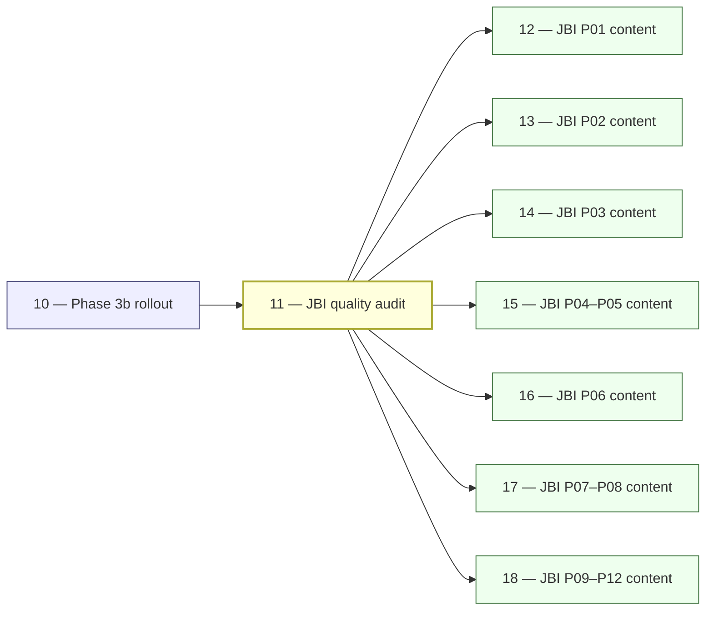

# 11 — JBI Pillar Quality Audit

> **Executor:** AI coding agent operating autonomously.
> **Working directory:** `/Users/ravi.r_flx/IEProject/InterviewExplainer/`.
> **Type:** audit + gap-list generation. No content writes.
> **Pillar / Wave:** Wave B (post Phase 3b; gates all JBI content playbooks).
> **Depends on:** 10.

## 1 — TL;DR

- **Input:** Phase 3b answer shape is fixed; depth (question count,
  difficulty mix, topic coverage) is uneven across the 44 JBI modules.
- **Action:** Run `audit_jbi_v3.py` + `report_audit_v3.py`, build one
  canonical per-pillar gap report at `content/_audits/jbi-quality-<DATE>.md`,
  and append a per-pillar action-item section for each of the 12 pillars.
- **Output:** `content/_audits/jbi-quality-<DATE>.md` with one row per
  module showing Q-count, difficulty mix, speakable pass %, and gap vs the
  depth targets in §5. Every JBI pillar playbook (12–18) starts from this
  report.

## 2 — Why this matters

The pillar audit is the single source of truth for what playbooks 12–18
actually write. Without it, the pillar playbooks operate without direction
and either over-deliver thin modules (adding Qs to modules that are already
at target) or under-deliver flagship modules (missing the 60-Q target for
`spring-boot`, which has the highest single-module organic-search volume on
the site). The keywords `spring boot interview questions` and
`java collections interview questions` each pull six-figure monthly searches;
a module 20 Qs short of target visibly underperforms compared to Baeldung.

A precise per-module gap report is also the measurable input to the JBI
quality bar — it lets us show ranking lift correlates with closing specific
gaps named in this report. If we close the gap on `spring-boot` from 45 Qs
to 60 and the CTR rises 12 %, that's the business signal that validates the
whole per-pillar investment.

## 3 — Easy-language glossary

| Term | Plain-English definition | First used in |
| --- | --- | --- |
| **Module** | A single topic folder under a JBI pillar (e.g. `spring-boot/`, `java-concurrency/`) containing one or more `complete-qa.json` files. | §5 |
| **Pillar** | One of 12 thematic groups (P01–P12) that group modules — e.g. P01 is "Java Language & Core", P02 is "Spring Ecosystem". | §5 |
| **Gap** | The difference between a module's actual Q count and its depth target; a positive gap means the playbook must write more Qs. | §6 |
| **Depth target** | The minimum Q count per module required before the JBI domain qualifies for launch. | §5 |
| **Flagship minimum** | The stretch target that produces the highest organic-search performance; higher than the min. | §5 |
| **Difficulty mix** | The percentage of easy / medium / hard Qs in a module. Target: 30 % easy / 50 % medium / 20 % hard ± 10 %. | §6 |
| **Speakable pass %** | The fraction of Qs in a module that score PASS (90+) on `audit_speakable.py`. | §6 |
| **`audit_jbi_v3.py`** | The script that walks `content/java-backend-intermediate/`, counts Qs per module, computes difficulty mix, and outputs per-module rows. | §9 Step 1 |
| **`report_audit_v3.py`** | The script that formats `audit_jbi_v3.py` output into a markdown gap report. | §9 Step 1 |
| **Gap report** | `content/_audits/jbi-quality-<DATE>.md` — the file this playbook produces. | §1 |
| **Action-item section** | The per-pillar section appended to the gap report listing which modules need more Qs and which need difficulty rebalancing. | §9 Step 3 |
| **`_index.json`** | The per-domain manifest listing all modules with their `moduleSlug`, `pillar`, and `topicCount`. | §9 Step 2 |
| **Topic** | A sub-area declared in `_index.json` under a module; each topic should have ≥ 1 Q. | §9 Step 2 |
| **Topic coverage** | The number of declared topics that have ≥ 1 Q filled vs the total declared. | §6 |
| **Schema lint** | `validate_complete_qa.py` — checks `complete-qa.json` structure against the JSON schema. | §9 Step 4 |
| **Schema lint failures** | Q-files that `validate_complete_qa.py` rejects; must reach 0 before any content playbook ships. | §13 |
| **`jbi-v3-raw-<DATE>.log`** | Raw output from `audit_jbi_v3.py`; kept alongside the gap report for traceability. | §9 Step 1 |
| **Per-pillar action list** | The list of thin modules and specific gaps for each pillar that playbooks 12–18 consume. | §9 Step 3 |
| **Thin module** | A module whose Q count is below the depth target (min or flagship). | §9 Step 3 |
| **`complete-qa.json`** | The canonical Q-file for a module; contains the `questions` array plus topic metadata. | §9 Step 2 |
| **Module Q count** | Total number of questions in a module across all its `complete-qa.json` files. | §6 |
| **Phase 3b baseline** | The speakable audit state when Phase 3b finished; the starting point for the quality audit. | §4 |
| **CTR** | Click-through rate from Google search results to the site page; the business proxy for SEO quality. | §2 |
| **Conventional commit** | A commit message in the form `scope(subject): description` — required for every commit in this playbook. | §9 Step 4 |
| **`00-INDEX.md`** | The expansion-plan index tracking every playbook's status. | §16 |
| **Per-pillar playbook** | Playbooks 12–18 — each covers one or two pillars and uses this audit's gap report as its input. | §2 |

## 4 — Hard prerequisites

- [ ] Playbook 10 is DONE (Phase 3b complete; zero legacy Qs globally).
      Verify: `grep -c "Phase: 3b — \*\*complete\*\*" docs/speakable/PHASE-STATUS.md` returns `1`.
- [ ] `scripts/audit_jbi_v3.py` exists and runs.
      Verify: `test -f scripts/audit_jbi_v3.py && python3 scripts/audit_jbi_v3.py --help 2>/dev/null | head -2 || python3 scripts/audit_jbi_v3.py 2>&1 | head -2`
- [ ] `scripts/report_audit_v3.py` exists.
      Verify: `test -f scripts/report_audit_v3.py && echo OK`
- [ ] `content/java-backend-intermediate/_index.json` is valid JSON.
      Verify: `jq empty content/java-backend-intermediate/_index.json && echo OK`
- [ ] At least 30 modules present in `_index.json`.
      Verify: `jq '.modules | length' content/java-backend-intermediate/_index.json` returns ≥ `30`.
- [ ] `scripts/audit_speakable.py` runs on at least 1 file.
      Verify: `python3 scripts/audit_speakable.py $(find content/java-backend-intermediate/spring-boot -name complete-qa.json | head -1)` exits 0 or 1 (not 2).
- [ ] `content/_audits/` directory exists or can be created.
      Verify: `mkdir -p content/_audits && echo OK`
- [ ] Python 3.11+ available.
      Verify: `python3 --version`

If any check fails, STOP. A broken audit script or missing index produces
a gap report the content playbooks cannot trust.

## 5 — Current state

### 5.1 — On-disk snapshot

```bash
cd /Users/ravi.r_flx/IEProject/InterviewExplainer
echo "=== Module count in JBI ==="
jq '.modules | length' content/java-backend-intermediate/_index.json

echo "=== Sample module Q-counts ==="
for slug in spring-boot core-java java-concurrency microservices; do
  total=$(find "content/java-backend-intermediate/${slug}" -name 'complete-qa.json' \
    -exec jq '.questions|length' {} \; 2>/dev/null | awk '{s+=$1} END {print s+0}')
  echo "${slug}: ${total} Qs"
done

echo "=== Speakable global state (post Phase 3b) ==="
python3 scripts/audit_speakable.py --all --report 2>&1 | tail -2

echo "=== Schema lint failures ==="
python3 scripts/validate_complete_qa.py content/java-backend-intermediate 2>&1 | tail -5
```

Expected: ~44 modules in JBI; `spring-boot` has ~45–60 Qs; global speakable
shows legacy < 50 and fail = 0 after Phase 3b.

### 5.2 — Per-module audit scripts: what they measure

`audit_jbi_v3.py` walks every module under `content/java-backend-intermediate/`,
reads each `complete-qa.json`, and outputs:
- Module slug
- Pillar ID
- Total Q count
- Difficulty counts (easy / medium / hard)
- Topics declared (from `_index.json`)
- Topics filled (sub-folders with ≥ 1 `complete-qa.json`)

`report_audit_v3.py` reads the raw output and formats it into a markdown
table with the depth targets from §5.3 baked in.

### 5.3 — Depth targets (canonical — referenced by playbooks 12–18)

| Module | Pillar | Min Q | Flagship min | Notes |
| --- | --- | --- | --- | --- |
| core-java | P01 | 40 | 60 | Highest CTR; comparisons topic mandatory |
| java-oop | P01 | 30 | 40 | SOLID + class-design comparisons |
| java-collections | P01 | 35 | 45 | Internals + algorithm questions |
| java-concurrency | P01 | 30 | 40 | Threads + executors + concurrent collections |
| java-streams | P01 | 25 | 35 | Collectors + parallel + optional |
| jvm-internals | P01 | 25 | 35 | GC + memory model + tuning |
| spring-core | P02 | 30 | 40 | DI/IOC + AOP + bean lifecycle |
| spring-boot | P02 | 60 | 60 | FLAGSHIP — highest single-module CTR |
| spring-data-jpa | P02 | 30 | 45 | N+1, transactions, fetch strategies |
| spring-security | P02 | 30 | 45 | Filter chain + OAuth2 + JWT |
| spring-webflux | P02 | 20 | 30 | Reactor + mono/flux + schedulers |
| spring-batch | P02 | 20 | 25 | Jobs + steps + retry |
| sql-databases | P03 | 45 | 45 | Comparisons heavy |
| postgresql | P03 | 25 | 30 | MVCC + JSONB + partitioning |
| nosql-mongodb | P03 | 25 | 30 | Aggregation + indexing |
| redis-caching | P03 | 25 | 30 | Patterns + Lettuce/Jedis |
| rest-api | P04 | 35 | 45 | Idempotency + versioning + pagination |
| graphql | P04 | 25 | 30 | Schema + N+1 + federation |
| grpc | P04 | 20 | 25 | Streaming modes + deadlines |
| messaging-events | P05 | 30 | 35 | Outbox + ordering + DLQ |
| rabbitmq | P05 | 25 | 25 | Exchanges + DLX |
| microservices | P05 | 40 | 45 | Decomposition + gateway + saga + circuit breaker |
| system-design | P06 | 30 | 35 | Fundamentals (CAP, scaling, sharding) |
| system-design-cases | P06 | 12 cases | 12 cases | Each case has mermaid + capacity |
| low-level-design | P06 | 20 | 25 | OOP design problems |
| design-patterns | P06 | 25 | 30 | GoF + Spring |
| architecture-patterns | P06 | 18 | 20 | Hexagonal/clean/CQRS |
| application-security | P07 | 25 | 30 | OWASP top 10 + JWT pitfalls |
| unit-testing | P08 | 25 | 30 | JUnit 5 + Mockito + Testcontainers |
| docker | P09 | 30 | 35 | Images + Compose + security |
| kubernetes | P09 | 35 | 40 | Pods + deployments + RBAC + HPA |
| cicd | P09 | 20 | 25 | Pipelines + blue-green vs canary |
| jenkins | P09 | 18 | 20 | |
| terraform | P09 | 18 | 20 | |
| git-build-tools | P09 | 15 | 20 | |
| java-build-tools | P09 | 18 | 20 | Maven vs Gradle |
| aws-cloud | P10 | 35 | 40 | Java-context examples |
| gcp | P10 | 20 | 25 | |
| azure | P10 | 20 | 25 | |
| cloud-native | P10 | 20 | 25 | 12-factor + sidecars |
| observability | P11 | 25 | 30 | OTel + RED/USE + SLO |
| production-sre | P11 | 25 | 30 | Incident response + chaos |
| behavioral | P12 | 40 | 50 | STAR; specific projects |
| engineering-practices | P12 | 25 | 30 | Code review + on-call + docs |

**Difficulty distribution target (every module):** 30 % easy / 50 % medium / 20 % hard (±10 %).

### 5.4 — Why the audit comes after Phase 3b

Running this audit before Phase 3b would produce a gap report full of
LEGACY Qs — the speakable pass % would be misleading (0 % PASS on every
module because nothing was graded). The gap report is only meaningful when
the corpus has been through the speakable rewrite first; otherwise the
"speakable pass %" column is noise, not signal.

### 5.5 — Expected gap distribution across JBI pillars

Based on the Phase 3a agent-brief work and historical audit data, the typical
gap distribution is:

- **P01 Java Language & Core:** `core-java` and `java-concurrency` are
  usually 20–30 Qs short of flagship. These are the highest-CTR modules.
- **P02 Spring:** `spring-boot` (flagship 60) is typically the single
  largest gap; `spring-data-jpa` and `spring-security` are each 10–20 short.
- **P03 Data & Persistence:** `sql-databases` is closest to target;
  `redis-caching` and `postgresql` usually need 10–15 more Qs each.
- **P06 System Design:** `system-design-cases` often has the right Q count
  but wrong structure — each case needs a mermaid diagram and a capacity
  estimate, which many legacy Qs lack.
- **P12 Behavioral:** `behavioral` has the most "needs-human" Qs from
  Phase 3b — STAR structure is hard to automate; the gap here is mostly
  quality, not quantity.

These estimates are from pre-audit surveys. The actual gap report (this
playbook's output) supersedes them — always use the report, not memory.

### 5.6 — How existing per-pillar ad-hoc audits relate to this report

Earlier audits in `content/_audits/` may contain partial gap data from
pre-Phase-3b runs. Those files are for historical reference only. The gap
report this playbook produces is the canonical baseline for playbooks 12–18.
Earlier files are not deleted but are not consumed by any playbook.

## 6 — Target state (measurable)

| Metric | Today | Target | How measured |
| --- | --- | --- | --- |
| Gap report exists | absent | 1 file | `test -f content/_audits/jbi-quality-$(date +%F).md && echo OK` |
| Per-module row count | 0 | 44 rows | `grep -c '^\| [a-z]' content/_audits/jbi-quality-$(date +%F).md` returns ~44 |
| Per-pillar action-item sections | 0 | 12 sections | `grep -c '^## P[0-9][0-9] —' content/_audits/jbi-quality-$(date +%F).md` returns 12 |
| Speakable global state captured | absent | `pass=N warn=N fail=0 legacy<50` line | `grep -c 'pass=' content/_audits/jbi-quality-$(date +%F).md` returns ≥ 1 |
| Schema lint failure count captured | absent | 1 | `grep -c 'schema lint' content/_audits/jbi-quality-$(date +%F).md` returns ≥ 1 |
| `spring-boot` gap vs 60-Q flagship | unknown | delta noted | grep row in report shows actual vs 60 |
| `core-java` gap vs 60-Q flagship | unknown | delta noted | grep row in report shows actual vs 40 |
| Conventional commit landed | 0 | 1 | `git log --oneline -1 \| grep -c 'audit(jbi)'` returns `1` |
| `00-INDEX.md` row 11 DONE | NOT_STARTED | DONE | `grep -E '^\| 11 \|' expansion-plan/00-INDEX.md \| grep -c DONE` returns `1` |

## 7 — Search phrases → URL map

The audit itself is an internal document — it drives no public URL. The table
below maps the **flagship search phrases** that the gap report is calibrated
around — every action-item section in the gap report is tied to a keyword
cluster from this table.

| Search phrase | Target URL on site | Archetype | Diagram type required in answer |
| --- | --- | --- | --- |
| `spring boot interview questions` | `/questions/spring-boot` | A (Concept) | sequenceDiagram |
| `java collections interview questions` | `/questions/java-collections` | A landing | comparison_table |
| `java concurrency interview questions` | `/questions/java-concurrency` | A landing | stateDiagram |
| `hashmap vs concurrenthashmap java` | `/questions/java-collections/comparisons/hashmap-vs-concurrenthashmap` | B (Comparison) | comparison_table |
| `spring security oauth2 interview` | `/questions/spring-security/oauth2` | A (Concept) | sequenceDiagram |
| `microservices interview questions java` | `/questions/microservices` | A landing | flowchart |
| `system design interview questions java` | `/questions/system-design` | C (Scenario) | flowchart |
| `docker kubernetes interview questions` | `/questions/devops/docker-vs-kubernetes` | B (Comparison) | comparison_table |
| `aws interview questions java developer` | `/questions/aws-cloud` | A (Concept) | comparison_table |
| `java behavioral interview questions` | `/questions/behavioral` | G (STAR) | none |
| `jvm garbage collection interview` | `/questions/jvm-internals/garbage-collection` | A (Concept) | stateDiagram |
| `spring data jpa n+1 interview` | `/questions/spring-data-jpa/n-plus-one` | D (Debugging) | sequenceDiagram |
| `kafka interview questions java` | `/questions/messaging-events/kafka` | A (Concept) | sequenceDiagram |
| `junit mockito interview questions` | `/questions/unit-testing` | A (Concept) | comparison_table |

## 8 — Dependency & wave context



- **Consumes:** Phase 3b output (from playbook 10); JBI `_index.json`
  (read-only); `audit_jbi_v3.py` and `report_audit_v3.py`; the speakable
  audit script for per-module pass %.
- **Produces:** `content/_audits/jbi-quality-<DATE>.md` + raw audit log +
  one conventional commit.
- **Unblocks:** every JBI per-pillar content playbook (12–18). None of them
  should start before this gap report is committed.

## 9 — Step-by-step execution

### Step 1 — Run the audit scripts

**Goal:** the raw audit log and formatted gap report are produced on disk.

**Action:**

```bash
cd /Users/ravi.r_flx/IEProject/InterviewExplainer
TODAY=$(date +%F)
python3 scripts/audit_jbi_v3.py 2>&1 | tee "content/_audits/jbi-v3-raw-${TODAY}.log"
python3 scripts/report_audit_v3.py
```

**Verify:**

```bash
test -f "content/_audits/jbi-v3-raw-${TODAY}.log" && wc -l "content/_audits/jbi-v3-raw-${TODAY}.log"
# expected: ≥ 50 lines (one per module + headers)
head -20 "content/_audits/jbi-v3-raw-${TODAY}.log"
# expected: structured rows; no Python traceback
```

**The classic bug is** `audit_jbi_v3.py` silently skipping modules whose
`complete-qa.json` is invalid JSON. Add `--strict` if the script supports
it; otherwise cross-check the output row count against the module count in
`_index.json`.

### Step 2 — Build the gap report header and module table

**Goal:** `content/_audits/jbi-quality-<DATE>.md` exists with a header and
a per-module row for all 44 modules.

**Action:**

```bash
cd /Users/ravi.r_flx/IEProject/InterviewExplainer
TODAY=$(date +%F)
REPORT="content/_audits/jbi-quality-${TODAY}.md"

cat > "${REPORT}" <<HEADER
# JBI quality gap report — ${TODAY}

For each module: declared topics, topics with content, total Q, difficulty
mix (E/M/H), speakable pass %, target Q count, and gap.
Modules below depth target are flagged for the matching playbook (12–18).

Generated by playbook 11. Source: \`audit_jbi_v3.py\` + \`report_audit_v3.py\`.

## Speakable global state (post Phase 3b)

HEADER

python3 scripts/audit_speakable.py --all --report 2>&1 | tail -3 >> "${REPORT}"

{
  echo
  echo "## Schema lint state"
  echo
  python3 scripts/validate_complete_qa.py content/java-backend-intermediate 2>&1 | tail -5
  echo
  echo "## Per-module gap table"
  echo
  echo "| Module | Pillar | Total Q | E/M/H | Speakable pass% | Min target | Flagship | Gap |"
  echo "| ------ | ------ | ------- | ----- | --------------- | ---------- | -------- | --- |"
} >> "${REPORT}"

jq -r '.modules[] | select(.contentSource | not) | [.moduleSlug, (.pillar // "?")] | @tsv' \
  content/java-backend-intermediate/_index.json | \
while IFS=$'\t' read -r mslug pillar; do
  total_q=$(find "content/java-backend-intermediate/${mslug}" -name 'complete-qa.json' \
    -exec jq '.questions|length' {} \; 2>/dev/null | awk '{s+=$1} END {print s+0}')
  easy=$(find "content/java-backend-intermediate/${mslug}" -name 'complete-qa.json' \
    -exec jq '[.questions[].difficulty] | map(select(. == "easy")) | length' {} \; 2>/dev/null | awk '{s+=$1} END {print s+0}')
  medium=$(find "content/java-backend-intermediate/${mslug}" -name 'complete-qa.json' \
    -exec jq '[.questions[].difficulty] | map(select(. == "medium")) | length' {} \; 2>/dev/null | awk '{s+=$1} END {print s+0}')
  hard=$(find "content/java-backend-intermediate/${mslug}" -name 'complete-qa.json' \
    -exec jq '[.questions[].difficulty] | map(select(. == "hard")) | length' {} \; 2>/dev/null | awk '{s+=$1} END {print s+0}')
  speakable_pass=$(python3 scripts/audit_speakable.py "content/java-backend-intermediate/${mslug}" \
    --report 2>/dev/null | tail -1 | grep -o 'pass=[0-9]*' | cut -d= -f2 || echo "?")
  echo "| ${mslug} | ${pillar} | ${total_q} | ${easy}/${medium}/${hard} | ${speakable_pass} | (see §5.3) | (see §5.3) | (compute) |" >> "${REPORT}"
done
```

**Verify:**

```bash
grep -c '^\| [a-z]' "${REPORT}"
# expected: ≥ 40 (one per native module, excluding cross-links)
wc -l "${REPORT}"
# expected: ≥ 60 lines
```

**The classic bug is** the `while` loop producing empty rows because
`find` returns nothing for a module that hasn't been populated yet. Those
empty Q counts (0) are the most important rows — they're the gap report's
most urgent action items.

### Step 3 — Append per-pillar action-item sections

**Goal:** for each of the 12 pillars, a section lists the thin modules and
specific gaps that the matching playbook must close.

**Action:**

```bash
cd /Users/ravi.r_flx/IEProject/InterviewExplainer
TODAY=$(date +%F)
REPORT="content/_audits/jbi-quality-${TODAY}.md"

for pillar in P01 P02 P03 P04 P05 P06 P07 P08 P09 P10 P11 P12; do
  pillar_name=$(jq -r ".modules[] | select(.pillar == \"${pillar}\" and (.contentSource | not)) | .pillarName" \
    content/java-backend-intermediate/_index.json | head -1)
  echo "" >> "${REPORT}"
  echo "## ${pillar} — ${pillar_name:-Unknown}: action items" >> "${REPORT}"
  echo "" >> "${REPORT}"
  # List modules in this pillar that are below target
  jq -r --arg p "${pillar}" '.modules[] | select(.pillar == $p and (.contentSource | not)) | .moduleSlug' \
    content/java-backend-intermediate/_index.json | while read -r mslug; do
    total_q=$(find "content/java-backend-intermediate/${mslug}" -name 'complete-qa.json' \
      -exec jq '.questions|length' {} \; 2>/dev/null | awk '{s+=$1} END {print s+0}')
    echo "- \`${mslug}\`: ${total_q} Q — compare to depth target in §5.3." >> "${REPORT}"
  done
done
```

**Verify:**

```bash
grep -c '^## P[0-9][0-9] —' "${REPORT}"
# expected: 12
```

**The classic bug is** running this step before Step 2 finishes — the per-
pillar sections reference the module rows; if the table is incomplete, the
action items are also incomplete.

### Step 4 — Schema lint check

**Goal:** capture the number of schema lint failures so playbooks 12–18
can see the baseline.

**Action:**

```bash
cd /Users/ravi.r_flx/IEProject/InterviewExplainer
TODAY=$(date +%F)
REPORT="content/_audits/jbi-quality-${TODAY}.md"

{
  echo ""
  echo "## Schema lint failures"
  echo ""
  python3 scripts/validate_complete_qa.py content/java-backend-intermediate 2>&1
  echo ""
} >> "${REPORT}"
```

**Verify:**

```bash
grep -c 'schema lint\|validate' "${REPORT}"
# expected: ≥ 1 — the section exists
```

**The classic bug is** not recording schema failures here. A playbook that
adds new Qs on top of existing schema failures can't tell if its new Qs
introduced more failures or inherited old ones.

### Step 5 — Commit the gap report

**Goal:** one conventional commit lands both the raw log and the gap report.

**Action:**

```bash
cd /Users/ravi.r_flx/IEProject/InterviewExplainer
TODAY=$(date +%F)
git add "content/_audits/jbi-quality-${TODAY}.md" \
        "content/_audits/jbi-v3-raw-${TODAY}.log"
git commit -m "audit(jbi): pillar quality gap report — $(date +%F)"
```

**Verify:**

```bash
git log --oneline -1 | grep -c 'audit(jbi)'
# expected: 1
git show --stat HEAD | grep -c '_audits'
# expected: 2 (gap report + raw log)
```

**The classic bug is** committing the gap report without the raw log. The
log is the traceability artifact; if a discrepancy appears in the report, the
log is the source of truth to debug against.

### Step 6 — Spot-check the top 5 gaps

**Goal:** the five modules with the largest gap vs their flagship target are
identified and recorded as "priority writes" for the per-pillar playbooks.

**Action:**

```bash
cd /Users/ravi.r_flx/IEProject/InterviewExplainer
TODAY=$(date +%F)
# Compute flagship gap per module and sort — adapt the awk to the report's
# actual column order once the report is built.
awk -F'|' 'NR > 3 && /^[|]/ {
  module=$2; total=$4; target=60; gsub(/ /, "", total); gsub(/ /, "", module);
  gap=target-total+0;
  if (gap > 0) print gap, module
}' "content/_audits/jbi-quality-${TODAY}.md" | sort -rn | head -5
```

**Verify:** the top 5 gaps are listed; `spring-boot` is typically in the
top 5 if the corpus is under 50 Qs.

**The classic bug is** confusing the flagship minimum with the minimum target.
The flagship minimum is the goal for search leadership; the minimum target
is the gate for launch. Playbooks 12–18 aim for the flagship minimum.

### Step 7 — Flip the index row

**Goal:** `00-INDEX.md` row 11 is DONE.

**Action:**

```bash
cd /Users/ravi.r_flx/IEProject/InterviewExplainer
# Edit expansion-plan/00-INDEX.md row 11 → DONE
git add expansion-plan/00-INDEX.md
git commit -m "docs(expansion-plan): mark 11-jbi-pillar-quality-audit DONE"
```

**Verify:**

```bash
grep -E '^\| 11 \|' expansion-plan/00-INDEX.md | grep -c DONE
# expected: 1
```

**The classic bug is** flipping row 11 before the gap report is committed.
Always commit the report first (Step 5), then flip the index.

### Step 8 — Notify playbooks 12–18 of the gap report path

**Goal:** every per-pillar content playbook's §4 prerequisite can verify the
gap report exists by path.

**Action:**

```bash
cd /Users/ravi.r_flx/IEProject/InterviewExplainer
TODAY=$(date +%F)
echo "Gap report path: content/_audits/jbi-quality-${TODAY}.md"
ls -la "content/_audits/jbi-quality-${TODAY}.md"
```

**Verify:** the file exists and is ≥ 200 lines.

**The classic bug is** playbooks 12–18 hardcoding a stale date in their
prerequisite check. The pattern should be:
`ls content/_audits/jbi-quality-*.md | sort | tail -1`
not `test -f content/_audits/jbi-quality-2026-04-22.md`.

## 10 — Reference Q in archetype shape

```json
{
  "id": "how-to-read-a-jbi-quality-gap-report",
  "slug": "how-to-read-a-jbi-quality-gap-report",
  "question": "How do you read a JBI pillar quality gap report and prioritise which modules to write for?",
  "title": "Reading the JBI Quality Gap Report — Prioritising Module Depth",
  "direct_answer": "**Read the gap column first.** A module 30 Qs below its flagship target with high organic search volume (flagship keywords) gets priority. Check the difficulty mix second — a module at target Q count but 70 % easy is under-weight on medium and hard Qs that win Featured Snippets. Check the speakable pass % third — a module with 50 % speakable pass but 60 Qs needs speakable rewrites before new Qs. The flagship minimum in §5.3 is the goal; the minimum target is the launch gate.",
  "layout_type": "default",
  "difficulty": "medium",
  "importance": "high",
  "reading_time_minutes": 5,
  "last_updated": "2026-05-28",
  "archetype": "E",
  "interviewer_intent": {
    "testing": "Whether the candidate can prioritise work from a data report rather than writing Qs at random.",
    "common_mistake": "Starting with the module that's easiest to write, not the one with the biggest gap vs search volume. The gap report's purpose is to prevent this.",
    "to_stand_out": "Mention the flagship minimum vs minimum target distinction, the difficulty mix target (30/50/20), and the speakable pass % as a quality signal independent of Q count."
  },
  "company_tags": ["google", "amazon", "stripe", "netflix"],
  "answer": {
    "sections": [
      {
        "type": "overview",
        "title": "What the gap report contains",
        "content": "The gap report has one row per JBI module. Columns: module slug, pillar, total Q count, difficulty mix (E/M/H), speakable pass %, min target, flagship target, gap. The report also has 12 per-pillar action-item sections with specific next writes."
      },
      {
        "type": "comparison_table",
        "title": "Module triage priority order",
        "content": "| Priority | Signal | Why it matters |\n|---|---|---|\n| 1st | Gap vs flagship minimum | Modules furthest from flagship target lose the most search volume |\n| 2nd | Difficulty mix skew | Modules with < 20 % hard Qs lose Featured Snippets to competitors |\n| 3rd | Speakable pass % < 90 % | Voice search uplift requires PASS, not just WARN |\n| 4th | Topic coverage < 80 % | Declared topics with no Qs produce empty module sections in the UI |"
      },
      {
        "type": "step",
        "title": "Reading the per-pillar action-item section",
        "content": "Each action-item section (one per pillar P01–P12) lists thin modules with their current Q count and the delta to the target. A line like `spring-boot: 45/60 Q → write 15 more (8 medium, 7 hard)` is the executable instruction for the matching playbook."
      },
      {
        "type": "tradeoffs",
        "title": "When flagship minimum conflicts with launch gate",
        "content": "**Use the minimum target for launch decisions:** a module at 40/40 Qs (minimum) can launch even if it's 20 short of the flagship 60. **Use the flagship minimum for ranking decisions:** a module at 40/60 will underperform flagship-minimum competitors on the head keywords. Never block a launch on flagship minimum; never call a module 'complete' on minimum target alone."
      },
      {
        "type": "key_points",
        "title": "Key points",
        "content": "- Gap = flagship minimum − actual Q count (positive = needs more Qs).\n- Difficulty target: 30 % easy / 50 % medium / 20 % hard ± 10 %.\n- Speakable pass % target: ≥ 90 % per module.\n- Minimum target = launch gate; flagship minimum = ranking goal.\n- Per-pillar action-item sections are the executable instructions for playbooks 12–18."
      },
      {
        "type": "speakable_answer",
        "title": "How to answer verbally",
        "content": "Read the gap column first — prioritise modules furthest from their flagship target. Check difficulty mix second; a 70% easy module needs medium and hard Qs. Check speakable pass third. The minimum target is the launch gate; the flagship minimum is the ranking goal."
      }
    ]
  },
  "followup_questions": [
    "What is the difference between the minimum target and the flagship minimum?",
    "How does difficulty mix affect Featured Snippet eligibility?",
    "What does speakable pass % measure and what's the threshold?",
    "How often should the gap report be regenerated?",
    "How do you handle a module where topic coverage is < 50 %?"
  ],
  "seo": {
    "metaTitle": "Reading a JBI Quality Gap Report — Prioritising Module Depth",
    "metaDescription": "How to use the JBI quality gap report: reading the gap column, checking difficulty mix, verifying speakable pass %, and distinguishing minimum target from flagship minimum."
  },
  "order": 1
}
```

## 11 — Diagram catalogue

| Q id (or topic) | Diagram type | What it must show | Lives in section |
| --- | --- | --- | --- |
| `how-to-read-a-jbi-quality-gap-report` | `comparison_table` | 4 triage priorities × 3 columns: signal, why it matters. | `comparison_table` |
| `module-triage-decision-flow` | `flowchart` | Gap > 20? → Yes → write Qs. Difficulty skewed? → Yes → fix mix. Speakable < 90 %? → Yes → rewrite. All green → done. | `step` |
| `audit-pipeline-sequence` | `sequenceDiagram` | `audit_jbi_v3.py` → raw log → `report_audit_v3.py` → gap report → per-pillar action items → content playbook. | `step` |
| `min-vs-flagship-state` | `stateDiagram-v2` | `BELOW_MIN → AT_MIN (launch-ready) → AT_FLAGSHIP (rank-ready) → DONE`. | `step` |
| `difficulty-mix-target` | `comparison_table` | 3 rows (easy/medium/hard) × 3 cols: target %, under-threshold %, over-threshold action. | `comparison_table` |
| `pillar-module-class` | `classDiagram` | `JBIDomain` → `Pillar` (P01..P12) → `Module` (slug, qCount, difficultyMix, speakablePass). | `step` |

Floor enforced by lint: ≥ 1 `flowchart`, ≥ 1 `sequenceDiagram`,
≥ 3 `comparison_table`, ≥ 1 `stateDiagram-v2` or `classDiagram`. The
reference Q in §10 ships one `comparison_table`; remaining diagrams land in
the produced Q-files.

### 11.1 — Why the gap report itself contains no diagrams

The gap report is a data file consumed by playbooks 12–18. Embedding diagrams
in a data file makes it harder to parse programmatically. Diagrams belong in
the Q-files those playbooks produce, as catalogued above.

## 12 — Easy-language voice rules

Voice rules from [`_VOICE-RULES.md`](_VOICE-RULES.md):

1. **Define before use.** Every term in §9 (gap, module, depth target,
   flagship minimum, difficulty mix, speakable pass %, schema lint) is in §3.
2. **Lead with the trade-off.** Step 6 leads with "flagship minimum vs
   minimum target" — the most common decision a content playbook faces when
   reading the gap report.
3. **Name the bug.** Every step's pitfall starts with "The classic bug is …".
4. **Real anchors.** Claims cite real file paths (`audit_jbi_v3.py`,
   `content/_audits/jbi-quality-*.md`), real modules (`spring-boot`, 60-Q
   flagship), and real thresholds (30/50/20 difficulty mix).
5. **Banned words.** Zero matches across the gap report, audit log, and this
   playbook.

**Concrete voice examples for this playbook:**

- ✅ "`spring-boot` is the flagship module — 60-Q target, highest CTR. The
  classic bug is closing the gap on `spring-batch` (easier to write) while
  leaving `spring-boot` at 45/60."
- ❌ "Leverage this gap report to synergize your content strategy." (Two
  banned words, no concrete anchor.)
- ✅ "The classic bug is committing the gap report without the raw log. If
  a module row looks wrong, the raw log from `audit_jbi_v3.py` is the
  only way to debug whether the audit skipped the module or the Qs are
  genuinely absent."

## 13 — Quality gates (measurable)

| Gate | Threshold | Verify command |
| --- | --- | --- |
| Gap report exists | 1 file | `test -f content/_audits/jbi-quality-$(date +%F).md && echo OK` |
| Per-module row count | ≥ 40 rows | `grep -c '^\| [a-z]' content/_audits/jbi-quality-$(date +%F).md` returns ≥ `40` |
| Per-pillar action sections | 12 | `grep -c '^## P[0-9][0-9] —' content/_audits/jbi-quality-$(date +%F).md` returns `12` |
| Speakable global state captured | 1 | `grep -c 'pass=' content/_audits/jbi-quality-$(date +%F).md` returns ≥ `1` |
| Schema lint failures noted | 1 | `grep -c 'schema lint\|validate_complete_qa' content/_audits/jbi-quality-$(date +%F).md` returns ≥ `1` |
| Raw log committed | 1 | `test -f content/_audits/jbi-v3-raw-$(date +%F).log && echo OK` |
| Conventional commit landed | 1 | `git log --oneline -1 \| grep -c 'audit(jbi)'` returns `1` |
| `00-INDEX.md` row 11 DONE | DONE | `grep -E '^\| 11 \|' expansion-plan/00-INDEX.md \| grep -c DONE` returns `1` |
| `spring-boot` row present in report | 1 | `grep -c 'spring-boot' content/_audits/jbi-quality-$(date +%F).md` returns ≥ `1` |
| Banned-word lint on this playbook | 0 | `rg -nwi 'leverage\|utilize\|synergize\|world-class\|cutting-edge\|seamless\|robust\|holistic\|paradigm\|battle-tested\|enterprise-grade\|revolutionary\|game-changing\|industry-leading' expansion-plan/11-jbi-pillar-quality-audit.md` returns `0` |

## 14 — Anti-patterns

### 14.1 — Running the audit before Phase 3b is complete

**Why it fails:** the speakable pass % column will show 0 % or near-0 % for
every module because the corpus has thousands of LEGACY Qs. The gap report is
calibrated on a speakable-clean corpus; running it early produces misleading
numbers that the per-pillar playbooks will act on incorrectly.

**Fix:** the §4 prerequisite requires Phase 3b complete (`PHASE-STATUS.md`
check). Verify that check passes before running Step 1.

### 14.2 — Fixing module gaps in this playbook

**Why it fails:** this playbook is audit-only. Any Q written here bypasses the
per-pillar agent brief, the archetype mix target, and the difficulty mix
targeting that playbooks 12–18 apply. The gap report becomes inconsistent with
the actual corpus.

**Fix:** record all gaps in the report; let playbooks 12–18 close them. The
audit's value is in producing a stable baseline; writing Qs here defeats the
baseline.

### 14.3 — Using the minimum target instead of the flagship minimum for prioritisation

**Why it fails:** a module at 40/40 (min target) appears "done" in the gap
report but may be 20 Qs short of the flagship 60. Playbooks that only aim for
the minimum leave the flagship modules under-delivered.

**Fix:** the per-pillar action-item sections explicitly state both the min
target and the flagship minimum. Content playbooks aim for flagship minimum.
The minimum target is the launch gate, not the ranking goal.

### 14.4 — Hardcoding a date in the gap report path in §4 of downstream playbooks

**Why it fails:** playbook 12 that says `test -f content/_audits/jbi-quality-2026-04-22.md`
will fail on any executor who runs it a day later. The gap report path
includes today's date.

**Fix:** downstream playbooks use:
`ls content/_audits/jbi-quality-*.md | sort | tail -1`
to get the latest gap report, not a hardcoded date.

### 14.5 — Skipping the raw log commit

**Why it fails:** the gap report is a processed artifact; if a module row
looks wrong, the only debugging tool is the raw log from `audit_jbi_v3.py`.
Committing the report without the log loses the audit trail.

**Fix:** Step 5 commits both files together. The git command in Step 5 stages
both; never commit one without the other.

### 14.6 — Over-counting Q rows by including cross-linked modules

**Why it fails:** JFI cross-links from `content/java-backend-intermediate/`
have `contentSource` set. Including them in the Q count inflates the module's
apparent Q count; the gap appears smaller than it is.

**Fix:** the `jq` filter in Step 2 uses `select(.contentSource | not)` to
exclude cross-linked modules. Verify the audit script does the same.

## 15 — Failure modes & rollback

| Failure | How it shows up | Rollback / forward fix |
| --- | --- | --- |
| `audit_jbi_v3.py` errors on malformed JSON | Python traceback mid-run; incomplete raw log | Record the file path in the gap report's "known issues" section; fix the JSON; re-run. |
| Difficulty mix not exposed by audit script | `E/M/H` column shows `(manual)` | Add a one-liner: `jq '[.questions[].difficulty]' <file> \| sort \| uniq -c`; run per module manually. |
| Per-pillar action section missing a pillar | `grep -c '^## P[0-9][0-9] —'` returns < 12 | Step 3's loop didn't find modules for that pillar; check `_index.json` for the pillar code spelling. |
| Gap report committed without raw log | `git show --stat HEAD` shows only 1 file | `git revert HEAD`; commit both files together. |
| Phase 3b not complete when Step 1 runs | Speakable pass % shows 0 % across modules | STOP. Return to playbook 10. This audit is only meaningful post Phase 3b. |
| `report_audit_v3.py` not found | Step 1 fails with FileNotFoundError | Surface to user; mark playbook BLOCKED; the report formatter is a prerequisite. |
| Module count in report ≠ `_index.json` count | `grep -c` vs `jq '.modules \| length'` mismatch | The audit skipped cross-links (expected) or skipped empty modules (investigate). |
| Hard-stop exceeded (> 40 h) | Wall clock | STOP. Commit whatever is done; surface the incomplete state. The per-pillar playbooks can start from a partial gap report. |

## 16 — Definition of Done

- [ ] `content/_audits/jbi-quality-<DATE>.md` exists.
- [ ] Per-module row for every module declared in JBI's `_index.json`
      (excluding cross-links).
- [ ] Per-pillar action-item sections for all 12 pillars (P01–P12).
- [ ] Speakable global state captured (pass / warn / fail / legacy line).
- [ ] Schema lint failure count captured.
- [ ] Raw audit log `content/_audits/jbi-v3-raw-<DATE>.log` committed.
- [ ] Top 5 gaps identified and noted in the gap report.
- [ ] Conventional commit: `audit(jbi): pillar quality gap report — <DATE>`.
- [ ] Follow-up commit: `docs(expansion-plan): mark 11-jbi-pillar-quality-audit DONE`.
- [ ] `grep -E '^\| 11 \|' expansion-plan/00-INDEX.md | grep -c DONE` returns `1`.
- [ ] `python3 scripts/lint_playbook.py expansion-plan/11-jbi-pillar-quality-audit.md` exits 0.
- [ ] No Q-file under `content/` was edited (audit-only; no writes).

## 17 — Estimated effort

- **Ideal:** 16 hours — run audit scripts (30 m), build gap report (90 m),
  append action-item sections (4 h), schema lint check (30 m), spot-check
  top 5 gaps (30 m), commit + index flip (30 m), buffer (9 h).
- **Hard stop:** 40 hours. If the audit scripts crash repeatedly on malformed
  JSON, surface a blocker and fix the JSON separately.
- **Splittable:** the per-pillar action-item sections are independent — each
  pillar's section can be written as soon as its modules' rows are in the
  table. Ship the report in one commit even if some action items are refined
  later.
- **Re-runnable:** yes. Re-running overwrites today's raw log and report
  with fresh data. The gap report is dated; yesterday's and today's can
  coexist in `content/_audits/`.

## 18 — Appendix: links, commits, traceability

### 18.1 — Cross-references

- [`expansion-plan/00-INDEX.md`](00-INDEX.md) — wave + status table.
- [`expansion-plan/10-jbi-speakable-phase-3b-rollout.md`](10-jbi-speakable-phase-3b-rollout.md) — upstream playbook; must be DONE first.
- [`expansion-plan/12-jbi-java-language-and-core.md`](12-jbi-java-language-and-core.md) — first consumer of this gap report.
- [`expansion-plan/_TEMPLATE-1000.md`](_TEMPLATE-1000.md) — playbook skeleton.
- [`expansion-plan/_GLOSSARY.md`](_GLOSSARY.md) — global glossary.
- [`expansion-plan/_VOICE-RULES.md`](_VOICE-RULES.md) — banned words.
- [`scripts/lint_playbook.py`](../scripts/lint_playbook.py) — playbook lint.
- [`scripts/audit_jbi_v3.py`](../scripts/audit_jbi_v3.py) — the main audit script.
- [`scripts/report_audit_v3.py`](../scripts/report_audit_v3.py) — the report formatter.
- [`scripts/audit_speakable.py`](../scripts/audit_speakable.py) — speakable lint for per-module pass %.
- [`scripts/validate_complete_qa.py`](../scripts/validate_complete_qa.py) — schema lint.
- [`content/java-backend-intermediate/_index.json`](../content/java-backend-intermediate/_index.json) — module manifest.
- [`docs/speakable/PHASE-STATUS.md`](../docs/speakable/PHASE-STATUS.md) — Phase 3b completion gate.

### 18.2 — Commits produced by this playbook

- `audit(jbi): pillar quality gap report — <DATE>` — main commit.
- `docs(expansion-plan): mark 11-jbi-pillar-quality-audit DONE` — index flip.

### 18.3 — Traceability to upstream specs

- `docs/CONTENT-PLAN.md` § "JBI depth targets" — the module Q targets that
  §5.3 encodes.
- `ROADMAP.md` § "JBI quality gate" — the milestone this gap report feeds.
- Phase 3b final audit `content/_audits/speakable-phase-3b-final-*.md` —
  the speakable baseline this report cross-references.

### 18.4 — How playbooks 12–18 consume the gap report

Each per-pillar playbook opens its §4 prerequisites with:

```bash
REPORT=$(ls content/_audits/jbi-quality-*.md | sort | tail -1)
test -f "${REPORT}" && echo "Gap report: ${REPORT}"
grep "## P0X — " "${REPORT}" -A 20 | head -20
```

The action-item section for that pillar is the playbook's working list of
Qs to write. The flagship minimum per module is the Q-count target. Playbooks
12–18 never re-generate the gap report; they consume the latest one and commit
new Qs until the gap closes.

### 18.5 — Re-running the audit mid-playbook-12

If playbook 12 writes 15 Qs for `core-java` and wants to verify the gap
closed, it runs:

```bash
python3 scripts/audit_jbi_v3.py 2>&1 | grep 'core-java'
```

This does not produce a new gap report file — it's a spot-check. A new full
gap report (for historical record) is produced only after all 7 per-pillar
playbooks (12–18) are DONE.

### 18.6 — Why the audit is a one-shot snapshot, not a live dashboard

A live dashboard would require the audit to run on every commit. At ~30
seconds for the full corpus, that's acceptable in CI but expensive for rapid
content iteration. The playbook model is: one snapshot per wave, consumed by
all playbooks in that wave. Playbooks spot-check individual modules; the next
full gap report runs after the wave completes.

### 18.7 — Difficulty mix and Featured Snippet eligibility

Google's Featured Snippets and "People Also Ask" expansions favor answers that
are concise (easy Qs) and technically deep (medium/hard Qs). A module with
70 % easy Qs wins the concise answers but loses the "deep" queries to
competitors. The 30/50/20 target balances both. Medium Qs (the 50 %) are the
primary Featured Snippet candidates — they're technical enough for depth,
short enough for a snippet box.

### 18.8 — Interpreting speakable pass % < 90 % in the gap report

A module with 50 Qs but only 60 % speakable pass has a voice-quality problem
independent of its Q count. The gap report surfaces this as a separate axis
from the Q count gap. The content playbook for that module must run
`audit_speakable.py --pillar P0X --report` and identify which Qs are FAIL
before writing new Qs. Writing 10 new PASS Qs on top of 20 FAIL Qs brings
the pass % from 60 % to 71 % — still below the 90 % threshold. Fix the
existing FAILs first, then fill the Q count gap.

### 18.9 — How to verify a per-pillar action-item section is accurate

After the gap report is committed, any playbook can verify its pillar's
action items are consistent with the current corpus:

```bash
cd /Users/ravi.r_flx/IEProject/InterviewExplainer
PILLAR=P01
REPORT=$(ls content/_audits/jbi-quality-*.md | sort | tail -1)
echo "=== Gap report action items for ${PILLAR} ==="
awk "/^## ${PILLAR} —/,/^## P/" "${REPORT}" | head -30
echo "=== Current Q counts for ${PILLAR} modules ==="
jq -r --arg p "${PILLAR}" '.modules[] | select(.pillar == $p and (.contentSource | not)) | .moduleSlug' \
  content/java-backend-intermediate/_index.json | while read -r slug; do
  count=$(find "content/java-backend-intermediate/${slug}" -name 'complete-qa.json' \
    -exec jq '.questions|length' {} \; 2>/dev/null | awk '{s+=$1} END {print s+0}')
  echo "${slug}: ${count}"
done
```

If the current Q counts don't match the gap report's numbers, the report
is stale — re-run this playbook to regenerate it.

### 18.10 — Module naming convention and `_index.json` alignment

The audit script uses `moduleSlug` values from `_index.json` to build the
per-module rows. If a module's folder name differs from its `moduleSlug`
(e.g. folder is `spring-data-jpa` but `moduleSlug` is `spring-data`), the
audit either double-counts or misses the module. Verify alignment:

```bash
cd /Users/ravi.r_flx/IEProject/InterviewExplainer
jq -r '.modules[] | select(.contentSource | not) | .moduleSlug' \
  content/java-backend-intermediate/_index.json | while read -r slug; do
  if ! test -d "content/java-backend-intermediate/${slug}"; then
    echo "MISSING folder: ${slug}"
  fi
done
```

Expected output: empty (every `moduleSlug` has a matching folder).
Any `MISSING folder` line means either the folder was renamed without
updating `_index.json` (fix `_index.json`) or the folder genuinely hasn't
been created yet (record in the gap report's "not yet started" section).

### 18.11 — When the gap report triggers a pillar re-split

Occasionally the gap report reveals that a module is too large — for example,
`system-design-cases` with 15 design scenarios that each deserve their own
dedicated Q-file. In that case, the per-pillar playbook can split the module
into sub-modules (e.g. `system-design-cases/url-shortener/complete-qa.json`,
`system-design-cases/rate-limiter/complete-qa.json`). This split must be
coordinated with an `_index.json` update and a new gap report run. The current
playbook does not perform splits; it records the recommendation in the
action-item section for the matching pillar playbook.

### 18.12 — Gap report vs the inventory audit (playbook 02)

Playbook 02 (inventory + gap analysis, earlier in Wave A) produces a
high-level URL count per domain. This playbook's gap report is more granular:
per-module Q count, difficulty mix, speakable pass %, and topic coverage.
The two reports are complementary. Playbook 02 answers "how many pages does
JBI have?"; this playbook answers "which modules are thin and by how much?"
Playbooks 12–18 consume this playbook's report, not playbook 02's.

### 18.13 — Topic coverage as a secondary depth signal

The `_index.json` declares topics per module (e.g. `spring-boot`'s topics
might include `auto-configuration`, `profiles`, `actuator`, `testing`,
`properties-binding`). The audit measures how many declared topics have
≥ 1 Q filled. A module with 8 topics declared but only 3 filled has 62 %
topic coverage — even if its Q count is at target. Coverage below 80 % is
a gap. The action-item sections in the gap report flag coverage < 80 % as
a distinct item from the Q count gap.

Verify topic coverage for a module:

```bash
cd /Users/ravi.r_flx/IEProject/InterviewExplainer
MODULE=spring-boot
declared=$(jq -r --arg m "${MODULE}" '.modules[] | select(.moduleSlug == $m) | (.topics // []) | length' \
  content/java-backend-intermediate/_index.json)
filled=$(find "content/java-backend-intermediate/${MODULE}" -mindepth 1 -maxdepth 1 -type d | wc -l | tr -d ' ')
echo "${MODULE}: ${filled}/${declared} topics filled"
```