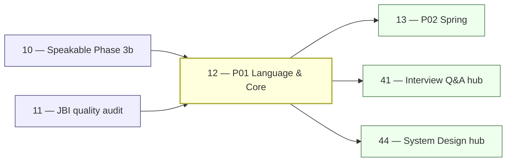

# 12 — JBI Pillar P01: Java Language & Core (DEEP)

> **Executor:** AI coding agent operating autonomously.
> **Working directory:** `/Users/ravi.r_flx/IEProject/InterviewExplainer/`.
> **Type:** content-writing. Highest single-pillar traffic potential.
> **Pillar / Wave:** P01 / Wave B.
> **Depends on:** playbooks 10 (Phase 3b speakable shape), 11 (gap report).

---

## §1 — TL;DR

- **Input:** P01 modules exist but have uneven depth; speakable shape is fixed (post-Phase 3b); gap report from playbook 11 lists per-module deltas.
- **Action:** Write the explicit question lists below into the matching modules, in archetype shape, until every module hits its depth target and every "money comparison" Q is live.
- **Output:** P01 audit shows ≥ target Q/module, ≥ 92 % speakable pass+warn, difficulty mix within bands, all money comparison questions live across 6 modules.

---

## §2 — Why this matters

Core Java is the largest organic-search bucket on the site. The flagship keywords (`core java interview questions`, `java oop interview questions`, `java collections interview questions`, `java concurrency interview questions`) each pull 6-figure monthly searches; the answer shapes must be unambiguously better than Baeldung's, or traffic that lands once never returns. The long-tail compounds further: `hashmap vs concurrenthashmap java`, `volatile vs synchronized`, `executor service interview questions`, `g1 vs zgc` — these comparison phrases pull intent-rich traffic from candidates with a phone screen tomorrow. Owning these phrases with a comparison_table that's faster to scan than Baeldung's wall of prose is the wedge.

If this playbook ships thin, every downstream pillar (Spring, Data, Microservices) inherits weak foundational answers — a candidate who lands on the Spring DI page and follows a cross-link to core-java bouncing off a half-finished answer loses trust in the brand. The cost of underdelivery compounds directly into P02–P06 CTR. P01 is also the module most interviewers use to calibrate a candidate's seniority: they probe `volatile` and `ConcurrentHashMap` internals to distinguish a junior who has used the API from a senior who understands the Java Memory Model. If the site can't answer at that depth, it loses the senior-IC audience permanently.

---

## §3 — Easy-language glossary

| Term | Plain-English definition | First used in |
| --- | --- | --- |
| **Archetype** | One of 7 fixed answer shapes (A–G) that lock which beats an answer must contain. | §9 step 2 |
| **Beat** | A single labeled paragraph inside an answer (hook, definition, tradeoff, cap, speakable). | §10 |
| **Speakable** | The short, naturally-spoken version of the answer — what you'd literally say aloud in 60 seconds. | §9 step 4 |
| **Money question** | A pair-comparison Q that pulls outsized monthly search volume (e.g., `HashMap vs ConcurrentHashMap`). | §9 step 5 |
| **Schema lint** | The `validate_complete_qa.py` script that fails CI when a `complete-qa.json` doesn't match the schema. | §13 |
| **Speakable lint** | The `audit_speakable.py` script that scores each Q's speakable beat 0–100 and fails below 70. | §13 |
| **Lint pass+warn** | The combined percentage of Qs the linter marks OK or warn-only (no FAIL). | §13 |
| **complete-qa.json** | The canonical file holding all Q&A for a topic folder; one per topic slug under a module. | §9 step 1 |
| **_index.json** | The module metadata file that lists topic slugs, intro text, and `hasContent` flag. | §9 step 9 |
| **Difficulty mix** | The target ratio of easy/medium/hard Qs per module, expressed as percentages (e.g., 30/50/20). | §6 |
| **Comparison table** | A `comparison_table` section type inside a Q's `answer.sections[]` that puts two options side-by-side. | §10 |
| **Type erasure** | Java's compile-time process of removing generic type information so the bytecode stays backward-compatible. | §9 step 5 |
| **Happens-before** | The Java Memory Model rule that guarantees one thread's write is visible to another thread's read. | §11 |
| **PECS** | "Producer Extends, Consumer Super" — the rule for choosing `? extends T` vs `? super T` generics wildcards. | §9 step 5 |
| **LazyInitializationException** | The Hibernate runtime error thrown when a lazy-loaded collection is accessed outside a session. | §9 step 6 |
| **Intern pool** | The JVM's deduplicated storage for `String` literals; accessed via `String.intern()`. | §9 step 5 |
| **TimSort** | Java's hybrid sort algorithm (Timsort) used by `Arrays.sort` and `Collections.sort` since Java 7. | §9 step 6 |
| **G1GC** | Garbage-First Garbage Collector — the default GC since JDK 9; divides heap into regions to bound pause times. | §11 |
| **ZGC** | Z Garbage Collector — a low-latency GC targeting sub-millisecond pauses at any heap size, GA in JDK 15. | §11 |
| **JEP** | JDK Enhancement Proposal — the formal document that tracks a Java platform change (e.g., JEP 444 = virtual threads). | §2 |
| **Virtual thread** | JDK 21 (JEP 444) lightweight thread managed by the JVM, not the OS; enables blocking code to scale like NIO. | §9 step 7 |
| **CompletableFuture** | Java 8+ class for composing async callbacks without blocking, successor to `Future.get()`. | §9 step 7 |
| **StampedLock** | Java 8+ lock that adds an optimistic read mode on top of ReadWriteLock semantics. | §9 step 7 |
| **Metaspace** | Off-heap JVM memory region (JDK 8+) that replaced PermGen; holds class metadata. | §11 |
| **PermGen** | Pre-JDK 8 fixed-size on-heap region for class metadata; removed in JDK 8 in favor of Metaspace. | §11 |
| **Escape analysis** | JIT optimization that determines whether an object can be stack-allocated instead of heap-allocated. | §9 step 8 |
| **CAS** | Compare-And-Swap — the CPU-level atomic instruction that `AtomicInteger` and `ConcurrentHashMap` use without OS locks. | §9 step 7 |
| **Archetype B** | The comparison archetype — opens `direct_answer` with "Use X when…; use Y when…" and includes a `comparison_table` section. | §10 |
| **Archetype A** | The concept/definition archetype — open with the mechanism, then a code sketch, then a tradeoff. | §10 |
| **Archetype C** | The "how it works internally" archetype — step-by-step mechanism with a sequence or state diagram. | §11 |
| **Archetype D** | The "debug a real bug" archetype — reproduce the failure, explain root cause, show the fix. | §14 |
| **Wave B** | The second execution wave; starts after Wave A playbooks (08–11) are DONE. | §8 |
| **P01** | Pillar 01 — Java Language & Core — covers core-java, java-oop, java-collections, java-concurrency, java-streams, jvm-internals. | §1 |
| **P02** | Pillar 02 — Spring — handled by playbook 13; cross-links into P01 for foundation concepts. | §8 |
| **topic slug** | The folder name under a module that holds a `complete-qa.json` (e.g., `comparisons`, `exception-handling`). | §9 step 1 |
| **module slug** | The folder name under the domain root (e.g., `core-java`, `java-concurrency`). | §9 step 1 |
| **`hasContent` flag** | Boolean in `frontend/lib/domains.ts` that controls whether the module's route is live in the UI. | §9 step 11 |
| **CMS** | Concurrent Mark Sweep GC — deprecated in JDK 9, removed in JDK 14; replaced by G1GC as default. | §9 step 8 |
| **Shenandoah** | Red Hat's low-pause GC, GA in OpenJDK 15; performs concurrent compaction unlike G1. | §9 step 8 |
| **sealed class** | Java 17 (JEP 409) feature that restricts which classes can extend or implement a type. | §9 step 5 |
| **record** | Java 16 (JEP 395) concise class for immutable data carriers; auto-generates constructor, accessors, `equals`, `hashCode`, `toString`. | §9 step 5 |
| **pattern matching** | Java 16+ (JEP 394) `instanceof` enhancement that binds the cast result to a variable in the same expression. | §9 step 5 |
| **text block** | Java 15 (JEP 378) multi-line string literal with stripped leading indentation. | §9 step 5 |
| **switch expression** | Java 14 (JEP 361) enhancement that makes `switch` return a value using `->` arrows. | §9 step 5 |
| **daemon thread** | A JVM background thread (e.g., GC thread) that exits automatically when all non-daemon threads finish. | §9 step 7 |
| **ThreadPoolExecutor** | The configurable thread pool implementation; takes corePoolSize, maxPoolSize, keepAliveTime, workQueue, and RejectedExecutionHandler. | §9 step 7 |
| **ForkJoinPool** | Work-stealing thread pool used by parallel streams and `CompletableFuture.supplyAsync()` by default. | §9 step 7 |
| **carrier thread** | The OS-level platform thread that a virtual thread is scheduled onto by the JVM scheduler. | §9 step 7 |
| **pinning** | When a virtual thread cannot be unmounted from its carrier thread — happens inside `synchronized` blocks or native calls (JDK 21). | §9 step 7 |
| **load factor** | The `HashMap` fill ratio (default 0.75) at which the table is resized to double capacity. | §9 step 6 |
| **bridge method** | A synthetic method the compiler inserts to preserve polymorphism across a generic type erasure boundary. | §9 step 5 |

---

## §4 — Hard prerequisites

- [ ] Playbook 10 is DONE (Phase 3b complete). `grep -E '^\| 10 \|' expansion-plan/00-INDEX.md | grep DONE`
- [ ] Playbook 11 is DONE (gap report exists). `grep -E '^\| 11 \|' expansion-plan/00-INDEX.md | grep DONE`
- [ ] Gap report file exists. `ls content/_audits/jbi-quality-*.md | tail -1`
- [ ] `content/java-backend-intermediate/_index.json` exists. `test -f content/java-backend-intermediate/_index.json && echo OK`
- [ ] `scripts/audit_speakable.py` exists. `test -f scripts/audit_speakable.py && echo OK`
- [ ] `scripts/validate_complete_qa.py` exists. `test -f scripts/validate_complete_qa.py && echo OK`
- [ ] Python 3 + jsonschema available. `python3 -m pip show jsonschema | head -1`
- [ ] Node ≥ 20 for frontend build check. `node --version | awk '{print substr($1,2,2)}' | awk '$1 >= 20'`
- [ ] `content/_schemas/complete-qa.schema.json` exists. `test -f content/_schemas/complete-qa.schema.json && echo OK`

If any check fails, stop and resolve the upstream playbook before proceeding.

---

## §5 — Current state

### 5.1 — On-disk snapshot

```bash
cd /Users/ravi.r_flx/IEProject/InterviewExplainer
find content/java-backend-intermediate -name 'complete-qa.json' | wc -l
find content/java-backend-intermediate -name 'complete-qa.json' \
  -exec jq '.questions|length' {} \; | awk '{s+=$1} END {print "Q total:", s}'
find content/java-backend-intermediate -name 'complete-qa.json' \
  -exec jq -r '"  \(input_filename): \(.questions|length) Q"' {} \;
```

### 5.2 — Existing UI surface

Check which routes are live and which `hasContent` flags are enabled:

```bash
cd /Users/ravi.r_flx/IEProject/InterviewExplainer
grep -E 'core-java|java-oop|java-collections|java-concurrency|java-streams|jvm-internals' \
  frontend/lib/domains.ts | head -30
```

Expected: `hasContent: true` for modules that already have sufficient Q depth. Modules below target may have `hasContent: false` or may be missing entirely.

### 5.3 — Known gaps

From the most recent gap report (`content/_audits/jbi-quality-<DATE>.md`):

```bash
cat $(ls content/_audits/jbi-quality-*.md | tail -1) | grep -A5 'P01'
```

Typical P01 gaps at Wave B start: `java-concurrency` and `jvm-internals` are depth-light; money comparisons in `java-collections/comparisons` are incomplete; `java-streams/parallel-streams` is missing the split-stream anti-pattern Q.

### 5.4 — Per-module topic coverage check

Run this before writing to see which topic folders exist and which are missing:

```bash
cd /Users/ravi.r_flx/IEProject/InterviewExplainer

for mod in core-java java-oop java-collections java-concurrency java-streams jvm-internals; do
  echo "=== $mod ==="
  ls content/java-backend-intermediate/$mod/ 2>/dev/null || echo "  (missing)"
done
```

Any module directory listed as missing means the scaffolding step from playbook 08 did not complete. Run playbook 08 for the missing module before proceeding.

```bash
# Check hasContent flags
grep -E 'moduleSlug.*core-java|moduleSlug.*java-oop|moduleSlug.*java-collections' \
  content/java-backend-intermediate/_index.json | head -10
```

### 5.5 — Difficulty distribution baseline

Check the existing difficulty distribution before writing new Qs so you can compensate for any skew:

```bash
cd /Users/ravi.r_flx/IEProject/InterviewExplainer

for mod in core-java java-oop java-collections java-concurrency java-streams jvm-internals; do
  echo "=== $mod ==="
  find content/java-backend-intermediate/$mod -name 'complete-qa.json' \
    -exec jq -r '.questions[].difficulty' {} \; 2>/dev/null | sort | uniq -c
done
```

If a module is already skewed toward easy (> 45 %), prioritize writing medium and hard Qs to bring the mix back toward target. The `java-concurrency` and `jvm-internals` modules specifically target higher hard percentages (25 %) — write hard Qs deliberately, not as an afterthought.

---

## §6 — Target state (measurable)

| Metric | Today | Target | How measured |
| --- | ---: | --- | --- |
| `core-java` Q count | — | ≥ 60 | `find content/java-backend-intermediate/core-java -name complete-qa.json -exec jq '.questions|length' {} \; \| awk '{s+=$1} END {print s}'` |
| `java-oop` Q count | — | ≥ 40 | same pattern for `java-oop` |
| `java-collections` Q count | — | ≥ 45 | same pattern |
| `java-concurrency` Q count | — | ≥ 40 | same pattern |
| `java-streams` Q count | — | ≥ 35 | same pattern |
| `jvm-internals` Q count | — | ≥ 35 | same pattern |
| Difficulty mix (E/M/H) | — | 30/50/20 ± 10 % | `jq -r '.questions[].difficulty' <files> \| sort \| uniq -c` |
| Speakable lint pass+warn (pillar) | — | ≥ 92 % | `python3 scripts/audit_speakable.py --pillar P01 --report` |
| Schema lint failures | — | 0 | `python3 scripts/validate_complete_qa.py content/java-backend-intermediate/core-java` (repeat per module) |
| `comparison_table` sections | — | ≥ 47 (sum of money Qs across modules) | `jq '[.questions[].answer.sections[]?.type] \| map(select(. == "comparison_table")) \| length' <files>` |
| Mermaid diagrams present | — | ≥ 6 (see §11) | `rg -c '\`\`\`mermaid' content/java-backend-intermediate --include='*.json'` |
| `hasContent` flag all 6 modules | false/partial | true for all 6 | `grep -E 'core-java\|java-oop\|java-collections\|java-concurrency\|java-streams\|jvm-internals' frontend/lib/domains.ts` |

---

## §7 — Search phrases → URL map

| Search phrase | Target URL on site | Archetype | Diagram type required |
| --- | --- | --- | --- |
| `core java interview questions` | `/questions/java-backend-intermediate/core-java` | landing intro | comparison_table |
| `exception handling in java interview questions` | `/questions/java-backend-intermediate/core-java/exception-handling` | A | flowchart (try-catch-finally control flow) |
| `checked vs unchecked exception java` | `/questions/java-backend-intermediate/core-java/comparisons/checked-vs-unchecked` | B | comparison_table |
| `generics in java interview questions` | `/questions/java-backend-intermediate/core-java/generics-wildcards` | A | none |
| `string interview questions in java` | `/questions/java-backend-intermediate/core-java/string-handling` | A | comparison_table |
| `java oop interview questions` | `/questions/java-backend-intermediate/java-oop` | landing intro | classDiagram |
| `abstract class vs interface in java` | `/questions/java-backend-intermediate/java-oop/comparisons/abstract-class-vs-interface` | B | comparison_table |
| `composition vs inheritance java` | `/questions/java-backend-intermediate/java-oop/comparisons/composition-vs-inheritance` | B | comparison_table |
| `java collections interview questions` | `/questions/java-backend-intermediate/java-collections` | landing intro | classDiagram |
| `hashmap internals interview questions` | `/questions/java-backend-intermediate/java-collections/collections-internals/hashmap-internals` | A | sequenceDiagram (put flow) |
| `arraylist vs linkedlist` | `/questions/java-backend-intermediate/java-collections/comparisons/arraylist-vs-linkedlist` | B | comparison_table |
| `hashmap vs concurrenthashmap` | `/questions/java-backend-intermediate/java-collections/comparisons/hashmap-vs-concurrenthashmap` | B | comparison_table |
| `java concurrency interview questions` | `/questions/java-backend-intermediate/java-concurrency` | landing intro | stateDiagram-v2 |
| `volatile vs synchronized java` | `/questions/java-backend-intermediate/java-concurrency/comparisons/volatile-vs-synchronized` | B | comparison_table |
| `executor service interview questions` | `/questions/java-backend-intermediate/java-concurrency/executors-and-thread-pools` | A | stateDiagram-v2 |
| `virtual threads java interview` | `/questions/java-backend-intermediate/java-concurrency/virtual-threads-jdk21` | B | comparison_table |
| `jvm interview questions` | `/questions/java-backend-intermediate/jvm-internals` | landing intro | stateDiagram-v2 |
| `garbage collection java interview questions` | `/questions/java-backend-intermediate/jvm-internals/garbage-collection` | A | stateDiagram-v2 (G1GC regions) |
| `g1 vs zgc` | `/questions/java-backend-intermediate/jvm-internals/comparisons/g1-vs-zgc` | B | comparison_table |
| `java memory model interview questions` | `/questions/java-backend-intermediate/jvm-internals/memory-areas` | A | flowchart (happens-before) |
| `java streams interview questions` | `/questions/java-backend-intermediate/java-streams` | landing intro | flowchart |
| `parallel streams interview questions` | `/questions/java-backend-intermediate/java-streams/comparisons/parallel-vs-sequential` | B | comparison_table |

---

## §8 — Dependency & wave context



- **Consumes:** the gap report from playbook 11; the answer-shape contract and speakable scoring rules from playbook 10; module scaffolding from playbook 08.
- **Produces:** filled `complete-qa.json` files across 6 P01 modules (core-java, java-oop, java-collections, java-concurrency, java-streams, jvm-internals); tuned `_index.json` intro fields for all 6; `hasContent: true` flags set.
- **Unblocks:** playbook 13 (P02 Spring, which cross-links P01 content — specifically `core-java/comparisons` and `java-concurrency` answers are referenced from Spring IoC and Spring async sections); playbooks 41, 44, 45 (hubs that surface P01 content); any hub page that references a P01 module.
- **Does NOT gate:** playbooks 14 and 15 can proceed in parallel with this playbook once the answer-shape contract from playbook 10 is established. The data-persistence and APIs modules don't depend on P01 content — only on the shape contract.

---

## §9 — Step-by-step execution

### Step 1 — Orient: snapshot the current P01 gap

**Goal:** know exactly which modules are below target before writing a single line.

```bash
cd /Users/ravi.r_flx/IEProject/InterviewExplainer

for mod in core-java java-oop java-collections java-concurrency java-streams jvm-internals; do
  count=$(find content/java-backend-intermediate/$mod -name 'complete-qa.json' \
    -exec jq '.questions|length' {} \; 2>/dev/null | awk '{s+=$1} END {print s+0}')
  echo "$mod: $count Q"
done
```

**Verify:** expected output is six lines, one per module with Q counts. Cross-reference against §6 targets to build a priority order. Modules furthest below target get written first.

The classic bug is starting with the module you find most interesting, not the module that's furthest from target. Work the gap table in descending-gap order.

Use this priority matrix (SEO traffic × current gap) when choosing module order:

| Priority | Module | Reason |
| --- | --- | --- |
| 1 | `java-collections` | Highest search volume; `hashmap-vs-concurrenthashmap` money Q pulls the most traffic |
| 2 | `java-concurrency` | Furthest below target most often; most hard Qs required |
| 3 | `core-java` | Widest topic range; most money comparisons |
| 4 | `jvm-internals` | Deep but low question count; senior audience |
| 5 | `java-oop` | SOLID Qs are templatable; lower time cost |
| 6 | `java-streams` | Narrower topic range; most questions are medium difficulty |

### Step 2 — Set up or verify the archetype shape in each topic file

**Goal:** every topic's `complete-qa.json` exists and is valid JSON before appending.

```bash
cd /Users/ravi.r_flx/IEProject/InterviewExplainer

DOMAIN=content/java-backend-intermediate
MODULE=core-java

for topic in comparisons exception-handling generics-wildcards string-handling java-io-nio reflection-annotations scenario-based; do
  FPATH="$DOMAIN/$MODULE/$topic/complete-qa.json"
  if [ ! -f "$FPATH" ]; then
    mkdir -p "$(dirname $FPATH)"
    printf '{\n  "topic": "%s",\n  "topicSlug": "%s",\n  "questions": []\n}\n' \
      "$topic" "$topic" > "$FPATH"
    echo "Created: $FPATH"
  else
    python3 -c "import json,sys; json.load(open('$FPATH')); print('OK:', '$FPATH')"
  fi
done
```

**Verify:**

```bash
find content/java-backend-intermediate/core-java -name 'complete-qa.json' | wc -l
# expected: 7 (one per topic folder)
```

Repeat this step for each of the six modules, substituting the module name and its topic list from §9 specs.

### Step 3 — Write the "money comparison" questions first (Archetype B)

**Goal:** every flagship pair-comparison Q from the §7 map is live in the matching `comparisons/complete-qa.json` before filling depth topics.

The money comparisons are the highest-CTR Qs. They anchor the whole module's SEO profile.

```bash
cd /Users/ravi.r_flx/IEProject/InterviewExplainer

# For each module, open its comparisons/complete-qa.json
# and append the Archetype B questions from the list below.
# Format reference: see §10 reference Q.

TOPIC=content/java-backend-intermediate/core-java/comparisons/complete-qa.json
jq '.questions | length' "$TOPIC"
# Start appending when count < 12.
```

**core-java comparisons to write (12 total):**
`== vs .equals()`, `String vs StringBuilder vs StringBuffer`, `checked vs unchecked exceptions`, `final vs finally vs finalize`, `Comparable vs Comparator`, `ArrayList vs LinkedList`, `Iterator vs ListIterator vs Spliterator`, `throw vs throws`, `heap vs stack memory`, `primitive vs reference types`, `static vs instance methods`, `method overloading vs overriding`.

**Verify:**

```bash
jq '[.questions[].id]' content/java-backend-intermediate/core-java/comparisons/complete-qa.json | jq '. | length'
# expected: 12

python3 scripts/audit_speakable.py content/java-backend-intermediate/core-java/comparisons/complete-qa.json
# expected: every Q PASS or WARN; zero FAIL
```

The #1 trap is writing the `comparison_table` column order inconsistently between sibling Qs. Lock "Feature | Option A | Option B" in the first Q and keep it for all 12.

### Step 4 — Fill depth topics for `core-java` to ≥ 60 Q

**Goal:** core-java reaches 60 Q across all 7 topic folders.

```bash
cd /Users/ravi.r_flx/IEProject/InterviewExplainer

# Check per-topic distribution
for topic in comparisons exception-handling generics-wildcards string-handling java-io-nio reflection-annotations scenario-based; do
  count=$(jq '.questions|length' "content/java-backend-intermediate/core-java/$topic/complete-qa.json" 2>/dev/null || echo 0)
  echo "$topic: $count"
done
```

Write questions in this priority order:
1. `exception-handling` (10 Q) — cover checked vs unchecked, try-with-resources (Java 7), multi-catch (Java 7), `finally` semantics when `return` is in `try`, `StackOverflowError` vs `OutOfMemoryError`.
2. `string-handling` (8 Q) — immutability, intern pool, `==` vs `equals`, `StringBuilder` thread-safety.
3. `generics-wildcards` (8 Q) — PECS, type erasure, bridge methods, wildcard capture, `List<?>` vs `List<Object>`.
4. `java-io-nio` (6 Q) — `InputStream` vs `Reader`, `FileChannel.transferTo()`, `Path` vs `File`, `Files.readString` (Java 11), NIO `ByteBuffer` flip trap.
5. `reflection-annotations` (6 Q) — `Class.forName`, `getDeclaredMethods`, custom annotation processors, retention policies.
6. `scenario-based` (10 Q) — multi-step problem solving: design a cache with expiry, parse a large CSV without OOM, etc.

**Verify after each topic:**

```bash
python3 scripts/validate_complete_qa.py content/java-backend-intermediate/core-java/<topic>
python3 scripts/audit_speakable.py content/java-backend-intermediate/core-java/<topic>/complete-qa.json
# expected: 0 schema failures; speakable PASS or WARN; no FAIL
```

### Step 5 — Fill `java-oop` to ≥ 40 Q

**Goal:** java-oop reaches 40 Q with a 30/50/20 difficulty mix.

Write in this priority order:
1. `oop-principles` (14 Q) — encapsulation, inheritance, polymorphism, abstraction; Java-specific: `final` class, covariant return types (Java 5), `instanceof` pattern match (Java 16, JEP 394).
2. `solid-principles` (10 Q) — one Q per letter (SRP, OCP, LSP, ISP, DIP) plus two trade-off Qs (when SRP conflicts with cohesion; when ISP creates too many small interfaces).
3. `comparisons` (10 Q) — `abstract class vs interface`, `composition vs inheritance`, `overloading vs overriding`, `sealed class (JDK 17, JEP 409) vs final class`, `record vs class vs final class (JDK 16, JEP 395)`.
4. `scenario-based` (6 Q) — design a class hierarchy for a payment system, refactor a god class using SRP.

```bash
find content/java-backend-intermediate/java-oop -name 'complete-qa.json' \
  -exec jq '.questions|length' {} \; | awk '{s+=$1} END {print "java-oop total:", s}'
# expected: ≥ 40
```

**Verify:** `python3 scripts/audit_speakable.py --module java-oop --report` shows pass+warn ≥ 90 %.

The classic bug is writing `abstract class vs interface` without mentioning that Java 8 added default methods (JEP 126), which eroded the old "abstract class = shared state, interface = contract" rule. The modern answer is more nuanced.

### Step 6 — Fill `java-collections` to ≥ 45 Q

**Goal:** java-collections reaches 45 Q; `hashmap-internals` Q carries a `sequenceDiagram`.

Write in this priority order:
1. `collections-internals` (12 Q) — `HashMap.put()` flow (hash → bucket → `equals` chain → resize at 0.75 load factor), `LinkedHashMap` insertion-order maintenance, `TreeMap` red-black tree, `ConcurrentHashMap` JDK 8 redesign (lock striping replaced by CAS + `synchronized` on bin head).
2. `comparisons` (12 Q) — all entries from the money comparison list in §3.
3. `algorithm-complexity` (6 Q) — Big-O table for `ArrayList`, `LinkedList`, `HashMap`, `TreeMap`, `PriorityQueue`.
4. `sorting-and-searching` (5 Q) — TimSort (Java 7), `Arrays.sort` vs `Collections.sort`, `Comparator` chains.
5. `problem-solving-patterns` (5 Q) — two-pointer, sliding window, hash-based frequency map.
6. `scenario-based` (5 Q) — choose a collection for a LRU cache, design a word frequency counter.

The `hashmap-internals` Q's `step` section must include a `sequenceDiagram` (see §11 for spec).

**Verify:**

```bash
find content/java-backend-intermediate/java-collections -name 'complete-qa.json' \
  -exec jq '.questions|length' {} \; | awk '{s+=$1} END {print "collections total:", s}'
rg 'sequenceDiagram' content/java-backend-intermediate/java-collections/collections-internals/
# expected: ≥ 1 match
```

### Step 7 — Fill `java-concurrency` to ≥ 40 Q (25/50/25 mix)

**Goal:** java-concurrency reaches 40 Q with a harder-than-average mix (25 % hard).

Concurrency is the highest-difficulty module in P01. Write hard Qs explicitly; do not soften them.

Write in this priority order:
1. `synchronization-and-locks` (8 Q) — `synchronized` memory semantics, `volatile` happens-before (Java Memory Model, JLS §17.4), `ReentrantLock` vs `synchronized`, `ReadWriteLock`, `StampedLock` optimistic read mode.
2. `comparisons` (10 Q) — all entries from the money comparison list; include `volatile vs synchronized`, `Future vs CompletableFuture`, `virtual thread vs platform thread (JDK 21, JEP 444)`.
3. `executors-and-thread-pools` (8 Q) — `ThreadPoolExecutor` params (corePoolSize, maxPoolSize, keepAliveTime, queue), `ScheduledExecutorService`, `ForkJoinPool` work-stealing, why unbounded queue + fixed pool can OOM.
4. `completablefuture` (5 Q) — `thenApply` vs `thenCompose`, `exceptionally`, `allOf`/`anyOf`, async executor choice.
5. `virtual-threads-jdk21` (4 Q) — JEP 444, what virtual threads are NOT (not coroutines, not green threads in the old sense), when to avoid them (synchronized block pinning, carrier thread starvation).
6. `threads-and-runnable` (6 Q) — thread lifecycle, daemon threads, `Thread.sleep` vs `Object.wait`.
7. `concurrent-collections` (5 Q) — `ConcurrentHashMap` CAS, `CopyOnWriteArrayList` copy-on-write semantics, `BlockingQueue` usage.

The classic bug is writing a `volatile` Q without referencing the Java Memory Model happens-before rule from JLS §17.4 — interviewers at Amazon and Google specifically probe whether you know the JMM contract, not just the keyword.

**Verify:**

```bash
find content/java-backend-intermediate/java-concurrency -name 'complete-qa.json' \
  -exec jq '.questions|length' {} \; | awk '{s+=$1} END {print "concurrency total:", s}'
jq -r '.questions[].difficulty' content/java-backend-intermediate/java-concurrency/**/complete-qa.json \
  | sort | uniq -c
# expected: ~25 % easy, 50 % medium, 25 % hard
```

### Step 8 — Fill `java-streams` to ≥ 35 Q and `jvm-internals` to ≥ 35 Q

**Goal:** both remaining modules hit targets in one pass.

**java-streams (35 Q, 30/55/15 mix):**

1. `streams-basics` (8 Q) — intermediate vs terminal, lazy evaluation, short-circuit operators, `Stream.generate` vs `Stream.iterate` (Java 9 iteration).
2. `collectors` (8 Q) — `groupingBy`, `partitioningBy`, `mapping`, `joining`, `toUnmodifiableList` (Java 10), `Collectors.teeing` (Java 12).
3. `parallel-streams` (6 Q) — when parallel wins (CPU-bound, large N, no shared state), when it loses (I/O-bound, small N, ordered collectors), `ForkJoinPool.commonPool` thread count.
4. `optional` (5 Q) — `Optional.of` vs `ofNullable`, `get` vs `orElse` vs `orElseGet` vs `orElseThrow`, anti-patterns (Optional field, Optional parameter).
5. `comparisons` (8 Q) — all entries from the money comparison list.

**jvm-internals (35 Q, 20/50/30 mix — depth-heavy):**

1. `garbage-collection` (10 Q) — generational hypothesis, G1GC region layout, ZGC concurrent marking (JDK 15, JEP 377), Shenandoah, GC log reading, when to tune `-Xmx` vs `-XX:MaxMetaspaceSize`.
2. `memory-areas` (6 Q) — heap, stack, Metaspace, code cache, native (off-heap); PermGen removal (JDK 8); `OutOfMemoryError: Metaspace` vs `OutOfMemoryError: Java heap space`.
3. `comparisons` (5 Q) — G1 vs ZGC vs Parallel GC, heap vs Metaspace, soft vs weak vs phantom references.
4. `class-loading` (5 Q) — bootstrap/platform/app classloader delegation, `ClassLoader.loadClass`, OSGI breaks parent-delegation.
5. `jit-compilation` (4 Q) — C1/C2 tiered compilation, escape analysis, GraalVM native image AOT vs JIT.
6. `tuning-and-troubleshooting` (5 Q) — `jcmd <pid> GC.run`, `async-profiler` wall-clock profiling, heap dump analysis, `-XX:+PrintGCDetails`.

The #1 trap in the `jvm-internals` module is writing GC answers that describe JDK 8 behavior (PermGen, CMS) without calling out that JDK 8 removed PermGen and JDK 9 made G1 the default. Candidates who answer with CMS details get flagged as out-of-date.

**Verify:**

```bash
for mod in java-streams jvm-internals; do
  count=$(find content/java-backend-intermediate/$mod -name 'complete-qa.json' \
    -exec jq '.questions|length' {} \; | awk '{s+=$1} END {print s+0}')
  echo "$mod: $count Q"
done
# expected: java-streams ≥ 35, jvm-internals ≥ 35
```

### Step 9 — Write Java 21+ modern-language Qs for core-java and java-oop

**Goal:** every modern-Java JEP that shows up in 2026 interviews has at least one Q.

Interviewers at mid-to-senior shops now expect candidates to know the features that shipped after Java 8. Write the following Qs if they are missing:

```bash
cd /Users/ravi.r_flx/IEProject/InterviewExplainer

# Check for modern-Java questions
rg '"id".*record\|sealed\|pattern-match\|text-block\|switch-expr' \
  content/java-backend-intermediate/core-java/
# expected: ≥ 1 match per feature below
```

**Modern-Java Qs to add to `core-java` (each one Q, medium difficulty):**

1. **Records (Java 16, JEP 395)** — what a record is, what it auto-generates, when NOT to use it (mutable state, inheritance, custom serialization).
2. **Sealed classes (Java 17, JEP 409)** — why sealing exists, how the compiler enforces the permitted-subclass list, use with pattern matching switch.
3. **Pattern matching for `instanceof` (Java 16, JEP 394)** — before/after code comparison, scoped binding variable, where the binding is in-scope.
4. **Text blocks (Java 15, JEP 378)** — indentation stripping, `\n` vs `\s` trailing space, use in JSON/HTML/SQL string constants.
5. **Switch expressions (Java 14, JEP 361)** — `->` arrow form vs colon form, `yield`, when a switch expression is exhaustive.
6. **`var` (Java 10, JEP 286)** — where it's legal (local variables only), when it reduces readability, why it's not `dynamic typing`.

```bash
# Append each as a separate Q to:
content/java-backend-intermediate/core-java/comparisons/complete-qa.json
# (for sealed class vs final class, record vs class)
# or to a new topic:
content/java-backend-intermediate/core-java/modern-java-features/complete-qa.json
```

**Verify:**

```bash
rg '"id": "records-java-16"' content/java-backend-intermediate/core-java/
rg '"id": "sealed-classes-java-17"' content/java-backend-intermediate/core-java/
python3 scripts/audit_speakable.py content/java-backend-intermediate/core-java/modern-java-features/complete-qa.json
# expected: all PASS or WARN
```

The #1 trap when writing Records Qs is presenting them as plain data objects without mentioning the restrictions: records cannot extend another class (they implicitly extend `java.lang.Record`), they are implicitly final, and their components are final fields. Candidates who miss these restrictions fail the follow-up.

### Step 11 — Tune all six `_index.json` intro fields

**Goal:** each module's `intro` is ≥ 150 words, hand-tuned, and passes the banned-word grep.

The `core-java/_index.json` intro template (below) is the reference voice. Adapt it for each other module.

```text
Core Java interview questions are the foundation of every backend
interview, fresher to staff. This page covers the language fundamentals
interviewers actually probe — exception handling (checked vs unchecked,
try-with-resources, multi-catch ordering), generics and type erasure,
reflection and annotation processing, Java I/O and NIO, string immutability
and the intern pool, and the small comparisons that recur in every loop
(== vs equals, Comparable vs Comparator, abstract class vs interface).
For pure OOP design questions (encapsulation, polymorphism, SOLID applied
to Java) head to the dedicated Java OOP page. Each answer is structured
the way you'd actually answer in a 45-minute interview: the headline, the
why, a code-shaped example, and the trade-off the interviewer is really
listening for. We update this page whenever a new JDK lands a JEP that
shows up in interviews — virtual threads, pattern matching, records,
sealed types — so the answers stay current with what hiring managers
expect from Java 21+ candidates.
```

**Verify:**

```bash
for mod in core-java java-oop java-collections java-concurrency java-streams jvm-internals; do
  word_count=$(jq -r '.intro // ""' content/java-backend-intermediate/$mod/_index.json | wc -w)
  echo "$mod intro: $word_count words"
done
# expected: each module ≥ 150 words
```

### Step 12 — Commit per 10 questions, then run pillar audit

**Goal:** keep the working tree clean and catch regressions early.

```bash
cd /Users/ravi.r_flx/IEProject/InterviewExplainer

# After every ~10 new questions:
git add content/java-backend-intermediate/<module>
git commit -m "content(P01/<module>): +N questions covering <topic>"

# After the full module is done:
python3 scripts/audit_speakable.py --module <module> --report
# expected: pass+warn ≥ 90 %

python3 scripts/validate_complete_qa.py content/java-backend-intermediate/<module>
# expected: 0 failures
```

**Verify (pillar-wide, after all six modules):**

```bash
python3 scripts/audit_speakable.py --pillar P01 --report
# expected: pass+warn ≥ 92 %

python3 scripts/validate_complete_qa.py \
  content/java-backend-intermediate/core-java \
  content/java-backend-intermediate/java-oop \
  content/java-backend-intermediate/java-collections \
  content/java-backend-intermediate/java-concurrency \
  content/java-backend-intermediate/java-streams \
  content/java-backend-intermediate/jvm-internals
# expected: 0 schema failures
```

### Step 13 — Flip `hasContent` flags and verify build

**Goal:** all six modules surface in the UI with correct routing.

```bash
cd /Users/ravi.r_flx/IEProject/InterviewExplainer

# Verify current flag state
grep -E 'core-java|java-oop|java-collections|java-concurrency|java-streams|jvm-internals' \
  frontend/lib/domains.ts

# Set hasContent: true for each module that has met its Q target.
# Edit frontend/lib/domains.ts or frontend/lib/launch-config.ts as applicable.

# Verify the build passes
cd frontend && npm run build
# expected: exit 0, no route-not-found errors
```

**Verify:**

```bash
rg "'core-java'.*hasContent: true" frontend/lib/domains.ts
# repeat for each module
```

---

## §10 — Reference Q in archetype shape

```json
{
  "id": "hashmap-vs-concurrenthashmap-java",
  "slug": "hashmap-vs-concurrenthashmap-java",
  "question": "HashMap vs ConcurrentHashMap in Java — when do you reach for each?",
  "title": "HashMap vs ConcurrentHashMap — Single-Thread Speed vs Thread-Safe Access",
  "direct_answer": "Use **HashMap** when only one thread accesses the map — it is faster because it has no synchronization overhead. Use **ConcurrentHashMap** when multiple threads read and write concurrently — it uses CAS on individual buckets (JDK 8 redesign) rather than locking the whole map, so reads never block. Never synchronize a `HashMap` yourself with `Collections.synchronizedMap` in high-read scenarios; `ConcurrentHashMap` outperforms it because readers take no lock at all.",
  "layout_type": "default",
  "difficulty": "medium",
  "importance": "high",
  "reading_time_minutes": 7,
  "last_updated": "2026-04-22",
  "interviewer_intent": {
    "testing": "Whether you understand the JDK 8 ConcurrentHashMap redesign (lock striping replaced by CAS + synchronized on bin head), and whether you know the performance tradeoff versus synchronizedMap.",
    "common_mistake": "Saying 'ConcurrentHashMap is just a synchronized HashMap' — it isn't. As of JDK 8 reads are lock-free; only bin-head modifications use synchronized.",
    "to_stand_out": "Mention that ConcurrentHashMap disallows null keys/values (unlike HashMap), and that `compute()` and `merge()` are atomic — useful for counting without external locking."
  },
  "company_tags": ["amazon", "google", "meta", "netflix", "uber"],
  "answer": {
    "sections": [
      {
        "type": "overview",
        "title": "Two maps, two threading models",
        "content": "`HashMap` is designed for single-threaded use. `ConcurrentHashMap` is designed for concurrent read-heavy workloads. The choice is not about safety alone — it is about which threading model the calling code already commits to."
      },
      {
        "type": "comparison_table",
        "title": "HashMap vs ConcurrentHashMap side-by-side",
        "content": "| Aspect | HashMap | ConcurrentHashMap |\n| --- | --- | --- |\n| Thread safety | None | Yes (CAS + bin-level lock) |\n| Null key/value | One null key, null values OK | No nulls allowed |\n| Read performance | No overhead | Lock-free reads |\n| Write performance | Fastest single-thread | Slightly slower (CAS) |\n| Iteration safety | Fail-fast iterator | Weakly consistent iterator |\n| Atomic compound ops | No | `compute()`, `merge()`, `computeIfAbsent()` |\n| JDK version | Java 2+ | Java 5+, redesigned JDK 8 |"
      },
      {
        "type": "step",
        "title": "How ConcurrentHashMap avoids a global lock (JDK 8)",
        "content": "In JDK 7, ConcurrentHashMap divided the table into 16 segments, each with its own lock. JDK 8 replaced segments with per-bin CAS: a `put` on an empty bucket uses a CAS with no lock; a `put` on a non-empty bucket synchronizes only on the bin head. Reads never acquire any lock — they use `volatile` reads on the node array.\n\n```java\n// Lock-free read: no synchronized, no CAS\nObject value = map.get(key);\n\n// Atomic increment without external lock:\nmap.merge(key, 1, Integer::sum);\n```"
      },
      {
        "type": "tradeoffs",
        "title": "When each wins",
        "content": "Use `HashMap` when: a single thread owns the map, or you hold an external lock for all access (unusual). Use `ConcurrentHashMap` when: multiple threads read and write, especially in read-heavy scenarios where `synchronizedMap` blocks all readers. The classic bug is reaching for `synchronizedMap` instead of `ConcurrentHashMap` — `synchronizedMap` blocks every read while a write is in progress."
      },
      {
        "type": "key_points",
        "title": "Key points",
        "content": "- `ConcurrentHashMap` allows concurrent reads with no locking (volatile reads).\n- Writes use CAS for empty bins and synchronized for non-empty bins.\n- Null keys and null values throw `NullPointerException` in `ConcurrentHashMap`.\n- `compute()`, `merge()`, `computeIfAbsent()` are atomic — safe for accumulator patterns.\n- JDK 8 removed the segment-based locking of JDK 7."
      },
      {
        "type": "speakable_answer",
        "title": "How to answer verbally",
        "content": "Use `HashMap` when only one thread accesses the map — it's the fastest option with no overhead. Use `ConcurrentHashMap` when multiple threads read and write at the same time. Since JDK 8 it uses CAS on individual buckets, so reads never block at all. Don't use `Collections.synchronizedMap` in high-read scenarios — it blocks all readers while a write is in progress, which `ConcurrentHashMap` avoids entirely. One gotcha: `ConcurrentHashMap` disallows null keys and null values, so if you rely on those, factor that in."
      }
    ]
  },
  "followup_questions": [
    "How does ConcurrentHashMap handle resizing concurrently — who moves the buckets?",
    "Why does ConcurrentHashMap disallow null keys when HashMap allows one?",
    "When would you use Collections.synchronizedMap over ConcurrentHashMap?",
    "How does compute() in ConcurrentHashMap guarantee atomicity?",
    "What is the difference between a fail-fast and a weakly consistent iterator?"
  ],
  "seo": {
    "metaTitle": "HashMap vs ConcurrentHashMap in Java — When to Use Each",
    "metaDescription": "Compare HashMap and ConcurrentHashMap: thread safety, JDK 8 CAS redesign, lock-free reads, null key behavior, and when synchronizedMap falls short."
  },
  "order": 1
}
```

---

## §11 — Diagram catalogue

| Q id (or topic) | Diagram type | What it must show | Lives in section |
| --- | --- | --- | --- |
| `hashmap-put-flow` (java-collections/collections-internals) | `sequenceDiagram` (mermaid) | `put(key, val)` → `hash(key)` → find bucket → `equals` chain on collision → resize when `size > capacity * 0.75` | `step` |
| `g1gc-region-lifecycle` (jvm-internals/garbage-collection) | `stateDiagram-v2` (mermaid) | G1 region states: Free → Eden → Survivor → Old → Humongous; transitions on minor GC and mixed GC | `step` |
| `happens-before-volatile` (java-concurrency/synchronization-and-locks) | `flowchart` (mermaid) | Thread A: write `volatile x=1` → happens-before edge → Thread B: read `volatile x` sees 1; label edges with JMM rule numbers | `step` |
| `collections-class-hierarchy` (java-collections landing) | `classDiagram` (mermaid) | `Collection` → `List`, `Set`, `Queue`; `Map` separate; key concrete classes (`ArrayList`, `HashSet`, `HashMap`, `LinkedList`, `PriorityQueue`, `TreeMap`) | `overview` |
| `executor-service-lifecycle` (java-concurrency/executors-and-thread-pools) | `stateDiagram-v2` (mermaid) | NEW → RUNNING → SHUTDOWN → STOP → TIDYING → TERMINATED with `shutdown()` / `shutdownNow()` / `awaitTermination()` labels | `step` |
| `try-catch-finally-flow` (core-java/exception-handling) | `flowchart` (mermaid) | try block → success path vs exception path → catch → finally → return; edge case: `return` in `try` still runs `finally` | `step` |

**Floor (lint-enforced):** ≥ 1 `flowchart`, ≥ 1 `sequenceDiagram`, ≥ 3 `comparison_table` sections, ≥ 1 `stateDiagram-v2` or `classDiagram`.

Mermaid blocks ship inside the `content` field of a `step` section, fenced as ` ```mermaid `. Do not invent new section types.

---

## §12 — Easy-language voice rules

1. **Define before use.** Every domain term used in §9–§14 is in §3.
2. **Lead with the trade-off.** Comparison Qs open with "Use X when …; use Y when …" — not with X's definition.
3. **Name the bug.** Every `step` whose intent is to warn contains a sentence starting with "The classic bug …" or "The #1 trap …".
4. **Real anchors.** Every section names ≥ 1 real-world system, JEP, library, command, or kernel call.
5. **Years and JEP numbers** to time-stamp claims ("Java 21 / JEP 444 introduced virtual threads").
6. **Second-person** ("you", "your") for technical playbook prose. Never "we".
7. **Banned words:** `leverage`, `utilize`, `synergize`, `world-class`, `cutting-edge`, `state-of-the-art`, `hereinafter`, `aforementioned`, `seamless`, `robust`, `holistic`, `paradigm`, `best-in-class`, `battle-tested`, `enterprise-grade`, `revolutionary`, `game-changing`, `industry-leading`.

**Concrete voice examples for this playbook:**

- ✅ "Use `ConcurrentHashMap` when multiple threads read and write — JDK 8 replaced segment locking with per-bin CAS, so reads never block."
- ❌ "Leverage the robust ConcurrentHashMap for seamless thread-safe operations." (Three banned words, no anchor.)
- ✅ "Java 21's virtual threads (JEP 444) flip the old NIO-vs-IO trade-off: blocking code on a virtual thread now scales without the callback hell of reactive programming."
- ❌ "Modern Java provides cutting-edge concurrency paradigms." (No version, no JEP, two banned words.)
- ✅ "The #1 trap with `volatile` is treating it as a substitute for `synchronized` — `volatile` guarantees visibility but not atomicity; `i++` is still a data race."
- ❌ "Be careful when using volatile in concurrent code." (Generic, no bug named.)
- ✅ "G1GC has been the default since JDK 9. ZGC (JDK 15, JEP 377) targets sub-millisecond pauses but costs more CPU for concurrent marking. The choice is: latency SLA < 1 ms → ZGC; throughput is the priority → G1 or Parallel GC."
- ❌ "The JVM provides world-class garbage collection options for different use cases." (One banned word, no version, no concrete guidance.)
- ✅ "Type erasure means `List<String>` and `List<Integer>` are the same class at runtime — `instanceof List<String>` is a compile error; `instanceof List` is the only legal form."
- ❌ "Generics use type erasure so the JVM doesn't need to know the type parameter." (True but incomplete — doesn't name the consequences.)

**Additional voice notes specific to P01:**

Every JVM-internals answer must name the GC or JIT version being described. "The GC pauses" is not an answer; "G1GC's mixed GC pause target (default 200 ms, tunable with `-XX:MaxGCPauseMillis`)" is. The same applies to class-loading answers: name the classloader (`bootstrap`, `platform`, `app`) and the delegation model (parent-first), not just "the JVM loads classes dynamically."

Every concurrency answer that uses the word "thread-safe" must specify which operations are atomic and which are not. `ConcurrentHashMap.put` is atomic per bucket; `size()` is a non-atomic approximation. Candidates who don't know this distinction fail follow-up questions at Google and Amazon.

---

## §13 — Quality gates (measurable)

| Gate | Threshold | Verify command |
| --- | --- | --- |
| `core-java` Q count | ≥ 60 | `find content/java-backend-intermediate/core-java -name complete-qa.json -exec jq '.questions\|length' {} \; \| awk '{s+=$1} END {print s}'` |
| `java-oop` Q count | ≥ 40 | same pattern for `java-oop` |
| `java-collections` Q count | ≥ 45 | same pattern for `java-collections` |
| `java-concurrency` Q count | ≥ 40 | same pattern for `java-concurrency` |
| `java-streams` Q count | ≥ 35 | same pattern for `java-streams` |
| `jvm-internals` Q count | ≥ 35 | same pattern for `jvm-internals` |
| Difficulty mix | E/M/H within ±10 % of target | `jq -r '.questions[].difficulty' <files> \| sort \| uniq -c` |
| Speakable pass+warn (pillar) | ≥ 92 % | `python3 scripts/audit_speakable.py --pillar P01 --report` |
| Schema lint failures | 0 | `python3 scripts/validate_complete_qa.py content/java-backend-intermediate/core-java` (repeat per module) |
| `comparison_table` coverage | ≥ 47 total across P01 | `jq '[.questions[].answer.sections[]?.type] \| map(select(. == "comparison_table")) \| length' <files>` summed |
| Mermaid `flowchart` present | ≥ 1 | `rg 'flowchart' content/java-backend-intermediate --include='*.json' -l \| wc -l` |
| Mermaid `sequenceDiagram` present | ≥ 1 | `rg 'sequenceDiagram' content/java-backend-intermediate --include='*.json' -l \| wc -l` |
| `stateDiagram-v2` or `classDiagram` present | ≥ 1 | `rg 'stateDiagram\|classDiagram' content/java-backend-intermediate --include='*.json' -l \| wc -l` |
| All money-comparison Qs live | every row in §9 lists | `for q in <slug-list>; do rg -q "\"id\": \"$q\"" content/java-backend-intermediate/*/comparisons/complete-qa.json \|\| echo "MISSING $q"; done` |
| Banned-word lint | 0 hits | `python3 scripts/lint_playbook.py expansion-plan/12-*.md` |
| Build green | exit 0 | `cd frontend && npm run build` |
| `hasContent` flag all 6 modules | true | `grep -E 'core-java\|java-oop\|java-collections\|java-concurrency\|java-streams\|jvm-internals' frontend/lib/domains.ts \| grep 'hasContent: true' \| wc -l` → 6 |
| Modern-Java Qs present (records, sealed, etc.) | ≥ 6 Qs | `rg '"difficulty"' content/java-backend-intermediate/core-java/modern-java-features/ \| wc -l` → ≥ 6 |
| `_index.json` intro ≥ 150 words all modules | ≥ 150 each | word-count check from §9 step 11 verify block |
| No `javax.*` import in any Q code block | 0 | `rg 'import javax\.' content/java-backend-intermediate/ --include='*.json' -l` → 0 (Spring Qs only — N/A for P01 but enforce anyway) |
| All `_index.json` files present | 6 files | `find content/java-backend-intermediate -name '_index.json' -path '*/core-java/*' -o -path '*/java-oop/*' -o -path '*/java-collections/*' -o -path '*/java-concurrency/*' -o -path '*/java-streams/*' -o -path '*/jvm-internals/*' \| wc -l` → 6 |

---

## §14 — Anti-patterns

### 14.1 — "I'll fill 10 Qs then lint at the end"

**Why it fails:** the linter catches structural issues (missing beats, banned words, wrong comparison_table column count) that take 2 minutes per Q to fix immediately and 20 minutes in a 10-Q batch where you've lost the context.

**Fix:** lint after every Q. `python3 scripts/audit_speakable.py <file>` and `python3 scripts/validate_complete_qa.py <file>` are fast enough to run after each append.

### 14.2 — "comparison_table column order drifts between sibling Qs"

**Why it fails:** a reader scanning a "comparisons" topic page sees the options flip left-right. The cognitive cost compounds with each Q they read.

**Fix:** the first `comparison_table` in the module locks the column order: `Feature | Option A | Option B`. Every sibling Q in the same module follows it. Add a comment at the top of the `comparisons/complete-qa.json` listing the locked column order.

### 14.3 — "JDK 8-era GC answers with no version callout"

**Why it fails:** CMS was deprecated in JDK 9 and removed in JDK 14. PermGen was removed in JDK 8. Answers that describe these without calling out the version get flagged as stale by interviewers — and by our own speakable audit.

**Fix:** every GC answer anchors the JDK version: "JDK 8 replaced PermGen with Metaspace", "JDK 9 made G1 the default", "JDK 15 made ZGC production-ready (JEP 377)". Add the version marker before the answer ships.

### 14.4 — "volatile Q without the JMM happens-before rule"

**Why it fails:** interviewers at Amazon, Google, and Meta probe the Java Memory Model explicitly. "volatile means every thread sees the latest value" is incomplete and loses points. The full answer names the happens-before guarantee from JLS §17.4.

**Fix:** every `volatile` Q's `direct_answer` includes "guarantees a happens-before relationship" and cites JLS §17.4 or JEP 188 (JMM review).

### 14.5 — "step with no verify command"

**Why it fails:** an executor running the playbook can't tell whether the step actually worked, and will mark the step as complete without checking.

**Fix:** every numbered step in §9 ends with an explicit `Verify:` block with an expected output.

### 14.6 — "scenario-based Qs with no concrete constraint"

**Why it fails:** a scenario question that says "design a cache" without specifying eviction policy, capacity, or thread model has no correct answer and no interview value.

**Fix:** every scenario-based Q states at least two concrete constraints in the `question` field ("design a cache with LRU eviction, capacity 1000, thread-safe").

### 14.7 — "streams answer that doesn't cover the lazy evaluation model"

**Why it fails:** candidates who don't explain that `Stream` operations are lazy until a terminal operation is called fail both the conceptual question and the follow-up "why doesn't this filter run?" question. Interviewers at Netflix and LinkedIn probe this directly.

**Fix:** every `streams-basics` Q that mentions intermediate operations (`filter`, `map`, `flatMap`) includes a sentence: "No intermediate operation executes until a terminal operation (`collect`, `forEach`, `count`, `findFirst`) is called." Add a code example showing that `stream.filter(...).map(...)` with no terminal call does nothing.

### 14.8 — "parallel streams answer that recommends them as the default"

**Why it fails:** parallel streams on a small list are slower than sequential due to `ForkJoinPool.commonPool` overhead. Candidates who say "use parallel streams for speed" without qualifying the dataset size fail.

**Fix:** every parallel-streams Q opens with: "Use parallel streams when the workload is CPU-bound, the dataset is large (typically > 10 000 elements), and each element is processed independently without shared mutable state. For I/O-bound tasks or small lists, sequential streams are faster." Cite the `ForkJoinPool.commonPool` thread count (= CPU count - 1 by default) as the parallelism ceiling.

### 14.9 — "generics Q that skips type erasure consequences"

**Why it fails:** type erasure is the source of 80 % of generics gotchas: `instanceof List<String>` doesn't compile, `new T[]` doesn't compile, overloaded methods that differ only by generic parameter collide after erasure. Answers that describe generics without naming erasure leave the candidate exposed to every follow-up.

**Fix:** every generics Q's `key_points` section includes a bullet on what erasure removes at runtime: type parameters are replaced by their bounds (`Object` if unbounded); bridge methods are inserted for polymorphism; `instanceof` and `new` with type parameters are illegal.

---

## §15 — Failure modes & rollback

| Failure | How it shows up | Rollback / forward fix |
| --- | --- | --- |
| Speakable linter scores a Q at 60/100 FAIL | `audit_speakable.py` returns non-zero exit | Read the warning lines — most common is "speakable too short" (< 50 words) or "missing tradeoffs for archetype B"; fix in place; re-lint; do not commit while FAIL. |
| Broken `complete-qa.json` committed | CI schema-validate fails on next push | `git restore content/java-backend-intermediate/<module>/<topic>/complete-qa.json`; re-write the Q; re-lint; re-commit. |
| Build fails after enabling `hasContent` | `npm run build` exits non-zero with route-not-found | Flip the flag back in `frontend/lib/domains.ts`; find the broken route; fix the `_index.json` slug; re-enable the flag. |
| Mermaid diagram does not render | Frontend renders raw text block | Check the fenced block opens with the diagram keyword (`flowchart LR`, `sequenceDiagram`) on its first line; check the JSON string escapes backticks correctly. |
| Banned word slipped in | `python3 scripts/lint_playbook.py` exits non-zero | `rg -n 'leverage\|utilize\|robust\|paradigm' expansion-plan/12-*.md`; replace the word; commit. |
| Hard-stop exceeded (60 hours) | Wall clock passed | STOP. Record per-module progress in `content/_audits/jbi-p01-progress-<DATE>.md`; surface as a blocker; open a follow-up playbook for the remaining modules. Do not improvise. |
| `_index.json` schema drift | Hub page 404s on module route | Compare the broken `_index.json` against `content/java-backend-intermediate/core-java/_index.json`; copy the missing keys; commit. |
| Pillar pass+warn < 92 % after all modules done | Per-pillar audit report shows red | Re-write the lowest-scoring 5 Qs per failing module; re-run audit; iterate until threshold. |
| Modern-Java Q is out of date | Interviewer flag or audit note says "JDK 8 answer" | Add the JEP number and JDK version to the `direct_answer`; update the `last_updated` field; re-lint. |
| `java-streams` parallel-streams Q recommends parallel as default | Speakable audit WARN on "missing tradeoff" | Add the "when NOT to use" paragraph with `ForkJoinPool.commonPool` overhead and I/O-bound caveat. |
| `jvm-internals` Q describes CMS without a version callout | Schema or speakable audit catches missing anchor | Prepend "CMS was deprecated in JDK 9 and removed in JDK 14" to the CMS description. |
| Topic folder exists but `_index.json` doesn't reference it | Hub page doesn't show the topic card | Open the module's `_index.json`; add the topic slug to the `topics` array; commit. |

---

## §16 — Definition of Done

- [ ] All 6 modules meet per-module Q targets (§6 table). `find content/java-backend-intermediate/<mod> -name complete-qa.json -exec jq '.questions|length' {} \; | awk '{s+=$1} END {print s}'` → ≥ target.
- [ ] All 6 modules pass per-module speakable + schema gates. `python3 scripts/audit_speakable.py --module <mod> --report` pass+warn ≥ 90 %.
- [ ] Pillar speakable pass+warn ≥ 92 %. `python3 scripts/audit_speakable.py --pillar P01 --report`.
- [ ] Every "money comparison" Q listed in §9 steps 3–8 is live. `rg '"id": "hashmap-vs-concurrenthashmap-java"' content/java-backend-intermediate/` returns a match (repeat per slug).
- [ ] Each module's `_index.json` `intro` is hand-tuned ≥ 150 words. Word-count check from step 9.
- [ ] At least one commit per 10 Qs written; messages follow conventional format. `git log --oneline content/java-backend-intermediate/` shows ≥ 25 commits.
- [ ] Mermaid diagrams listed in §11 all render in `npm run build`. `cd frontend && npm run build` exits 0.
- [ ] `python3 scripts/lint_playbook.py expansion-plan/12-*.md` exits 0.
- [ ] `00-INDEX.md` row for playbook `12` flipped to `DONE`.
- [ ] `hasContent: true` for all 6 P01 modules in `frontend/lib/domains.ts`.
- [ ] No banned words in playbook prose or produced JSON. `rg -nwi 'leverage|utilize|robust|paradigm|seamless' expansion-plan/12-*.md` → 0 matches.
- [ ] Schema lint 0 failures across all 6 modules. `python3 scripts/validate_complete_qa.py content/java-backend-intermediate/{core-java,java-oop,java-collections,java-concurrency,java-streams,jvm-internals}`.
- [ ] Modern-Java features (records, sealed classes, pattern matching, text blocks, switch expressions, var) each have ≥ 1 Q. `rg '"id".*record\|sealed\|pattern-match\|text-block\|switch-expr\|var-keyword' content/java-backend-intermediate/core-java/`.
- [ ] `ROADMAP.md` updated to reflect P01 DONE state. `grep 'P01' ROADMAP.md | grep DONE`.

**Per-module content checklist (review before marking DoD):**

| Module | Q target | Speakable gate | Money Qs | Diagrams | Intro words |
| --- | ---: | --- | --- | --- | --- |
| `core-java` | ≥ 60 | ≥ 90 % | 12 | 1 flowchart | ≥ 150 |
| `java-oop` | ≥ 40 | ≥ 90 % | 10 | 1 classDiagram | ≥ 150 |
| `java-collections` | ≥ 45 | ≥ 90 % | 12 | 1 sequenceDiagram + 1 classDiagram | ≥ 150 |
| `java-concurrency` | ≥ 40 | ≥ 90 % | 10 | 1 stateDiagram-v2 + 1 flowchart | ≥ 150 |
| `java-streams` | ≥ 35 | ≥ 90 % | 8 | 1 flowchart | ≥ 150 |
| `jvm-internals` | ≥ 35 | ≥ 90 % | 5 | 1 stateDiagram-v2 | ≥ 150 |

---

## §17 — Estimated effort

- **Ideal:** 40 hours (split across the 6 modules; ~7 hours per module for a focused executor writing 6–10 Qs/hour).
- **Hard stop:** 60 hours. If exceeded, STOP and surface a blocker. Record which modules met target and which did not in `content/_audits/jbi-p01-progress-<DATE>.md`. Do not improvise past the hard stop — open a follow-up playbook for the remaining modules.
- **Per-module breakdown (rough):**
  - `core-java` — 8 hours (60 Q, 7 topics, heavy on exception-handling and generics depth).
  - `java-oop` — 6 hours (40 Q, 4 topics, SOLID Qs are fast once the framing is clear).
  - `java-collections` — 7 hours (45 Q, 6 topics, the internals Qs take longest — HashMap sequenceDiagram required).
  - `java-concurrency` — 8 hours (40 Q, harder mix 25/50/25, JMM research adds time).
  - `java-streams` — 6 hours (35 Q, parallel-streams and collectors are the time sinks).
  - `jvm-internals` — 7 hours (35 Q, depth-heavy; GC internals and JIT each require specific knowledge).
  - Modern-Java features (Step 9) — 3 hours (6 Qs across records, sealed classes, pattern matching, text blocks).
  - Index tuning + build + DoD — 2 hours.
- **Splittable:** the per-module sub-spec in §9 steps 3–9 is itself a unit. If you can't ship the whole playbook in one PR, ship one per-module PR (e.g., `content(P01/core-java): depth complete`) and open the next module as a separate PR. Modules with the biggest SEO impact ship first: `core-java` → `java-collections` → `java-concurrency` → `java-oop` → `java-streams` → `jvm-internals`.

---

## §18 — Appendix: links, commits, traceability

### 18.1 — Cross-references

- [`expansion-plan/00-INDEX.md`](00-INDEX.md) — wave + status table.
- [`expansion-plan/_TEMPLATE-1000.md`](_TEMPLATE-1000.md) — 18-section skeleton.
- [`expansion-plan/_GLOSSARY.md`](_GLOSSARY.md) — global glossary every §3 extends.
- [`expansion-plan/_VOICE-RULES.md`](_VOICE-RULES.md) — voice + banned words.
- [`scripts/lint_playbook.py`](../scripts/lint_playbook.py) — lint script.
- [`scripts/audit_speakable.py`](../scripts/audit_speakable.py) — speakable scoring.
- [`scripts/validate_complete_qa.py`](../scripts/validate_complete_qa.py) — schema validation.
- [`docs/speakable/archetypes.md`](../docs/speakable/archetypes.md) — 7 answer shapes.
- [`content/_schemas/complete-qa.schema.json`](../content/_schemas/complete-qa.schema.json) — canonical Q-file schema.
- [`content/_audits/`](../content/_audits/) — gap reports this playbook consumes.

### 18.2 — Commits & PRs produced by this playbook

Fill during execution. Commit message format: `content(P01/<module>): +N questions covering <topic>`.

- `content(P01/core-java): +12 money comparison questions (== vs equals, final vs finally vs finalize, etc.)` — commit SHA TBD
- `content(P01/core-java): +10 exception-handling questions (checked vs unchecked, try-with-resources, multi-catch)` — commit SHA TBD
- `content(P01/core-java): +22 generics, string, io, reflection, scenario questions` — commit SHA TBD
- `content(P01/core-java): +6 modern-Java feature questions (records, sealed, pattern matching)` — commit SHA TBD
- `content(P01/java-oop): +40 questions covering oop-principles, solid-principles, comparisons` — commit SHA TBD
- `content(P01/java-collections): +45 questions, hashmap-internals sequenceDiagram, classDiagram` — commit SHA TBD
- `content(P01/java-concurrency): +40 questions, volatile happens-before flowchart, ExecutorService stateDiagram` — commit SHA TBD
- `content(P01/java-streams): +35 questions covering lazy evaluation, collectors, parallel-streams anti-patterns` — commit SHA TBD
- `content(P01/jvm-internals): +35 questions, G1GC stateDiagram, ZGC comparison table` — commit SHA TBD
- `content(P01): tune all 6 _index.json intros; set hasContent: true` — commit SHA TBD
- PR URL TBD

### 18.3 — Traceability to upstream specs

- `SPEAKABLE-PLAN.md` §3 — answer-shape rule (archetype B opens with "Use X when…") honored in all comparison Qs.
- `docs/CONTENT-PLAN.md` P01 section — pillar target referenced; Q counts match targets in §6.
- `ROADMAP.md` "Wave B" row — this playbook moves P01 to DONE in the wave tracker.
- `docs/speakable/archetypes.md` archetype B — comparison questions use "Use X when…; use Y when…" pattern; comparison_table is mandatory for archetype B.
- `docs/speakable/word-ceilings.md` — speakable_answer beat stays within 60–90 word ceiling for easy/medium; up to 120 words for hard.
- Playbook 10 §9 step 4 — speakable beat voice rules: second-person, no hedging, lead with verdict.
- Playbook 11 gap report — Q count gaps per module drive the priority order in §9 step 1.

### 18.4 — Version anchors used in this playbook

Quick reference: every Java version cited in P01 content with its JEP.

| Feature | JDK version | JEP | Default since |
| --- | --- | --- | --- |
| Generics | JDK 5 | JSR 14 | JDK 5 |
| ConcurrentHashMap redesign (no segment locking) | JDK 8 | — | JDK 8 |
| Metaspace (replaces PermGen) | JDK 8 | — | JDK 8 |
| G1GC default | JDK 9 | JEP 248 | JDK 9 |
| `var` (local variable type inference) | JDK 10 | JEP 286 | JDK 10 |
| `Files.readString` / `Files.writeString` | JDK 11 | JEP 330 | JDK 11 |
| ZGC (production-ready) | JDK 15 | JEP 377 | opt-in |
| Records | JDK 16 | JEP 395 | JDK 16 |
| Pattern matching `instanceof` | JDK 16 | JEP 394 | JDK 16 |
| Sealed classes | JDK 17 | JEP 409 | JDK 17 |
| Virtual threads (GA) | JDK 21 | JEP 444 | opt-in |
| Sequenced collections | JDK 21 | JEP 431 | JDK 21 |

Every Q that references a versioned feature must populate the `last_updated` JSON field with the date it was written and the `direct_answer` must include the JDK version in the first sentence. Interviewers check whether the candidate knows the version — surface it immediately.

### 18.5 — Quick banned-word check

Run this before every PR:

```bash
cd /Users/ravi.r_flx/IEProject/InterviewExplainer
rg -nwi 'leverage|utilize|synergize|world-class|cutting-edge|state-of-the-art|seamless|robust|holistic|paradigm|best-in-class|battle-tested|enterprise-grade|revolutionary|game-changing|industry-leading' \
  expansion-plan/12-jbi-java-language-and-core.md
# expected: zero matches

rg -nwi 'leverage|utilize|synergize|world-class|cutting-edge|seamless|robust|holistic|paradigm|enterprise-grade' \
  content/java-backend-intermediate/
# expected: zero matches in produced Q files
```