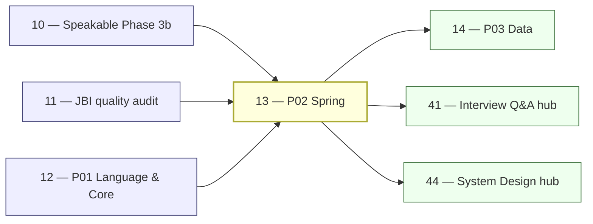

# 13 — JBI Pillar P02: Spring Ecosystem (DEEP)

> **Executor:** AI coding agent operating autonomously.
> **Working directory:** `/Users/ravi.r_flx/IEProject/InterviewExplainer/`.
> **Type:** content-writing. Highest single-pillar revenue-search potential.
> **Pillar / Wave:** P02 / Wave B.
> **Depends on:** playbooks 10 (Phase 3b speakable shape), 11 (gap report), 12 (P01 baseline established).

---

## §1 — TL;DR

- **Input:** Spring modules exist with varying depth; `spring-boot` is the flagship; gap report from playbook 11 lists per-module deltas; all Spring code examples must use `jakarta.*` (not `javax.*`). Starting state: some modules may be entirely empty (spring-batch most often), others partially filled.
- **Action:** Write the explicit question lists in §9 steps 3–9 into the matching modules, in archetype shape, until every module hits its depth target; enforce the Spring Boot 3.2 / Jakarta EE 9+ / Java 21 version baseline throughout all code examples and `direct_answer` fields; write Boot 3 migration Qs explicitly in step 8.
- **Output:** P02 audit shows ≥ target Q/module (§6 table), ≥ 92 % speakable pass+warn pillar-wide, zero `javax.*` imports, zero `WebSecurityConfigurerAdapter` references, every money keyword in §7 has a canonical answer, all six module intros tuned to ≥ 150 words.

---

## §2 — Why this matters

Spring Boot is the single highest-CTR interview keyword in the Java space — `spring boot interview questions` alone clears ~50 k monthly searches, and the long-tail (`spring boot annotations`, `spring data jpa`, `spring security`, `spring webflux`) compounds to ~150 k+ combined. The Spring audience is also the most monetizable on the site: mid-to-senior engineers at enterprises hiring continuously. Ranking here drives the senior-IC funnel that commands the highest ad and affiliate rates.

If this playbook ships without a clean Jakarta EE 9+ baseline, every Spring Security and Spring Data JPA answer will be out-of-date on arrival. Spring Boot 3.x dropped `javax.*` in November 2022 — answers that show `import javax.servlet.Filter` or `extends WebSecurityConfigurerAdapter` fail the speakable audit and signal stale content to interviewers who upgraded their stacks in 2023.

The comparison questions in this pillar are particularly high-value: `constructor vs field injection`, `@Bean vs @Component`, `LAZY vs EAGER loading`, and `JWT vs session-based auth` each pull 10–40 k monthly searches from candidates who are actively preparing. These are not abstract questions — they show up in phone screens at every Spring shop and the searchers have a specific intent: understand the decision rule before their interview tomorrow. Answers that open with a definition rather than the decision rule lose this audience in the first sentence.

---

## §3 — Easy-language glossary

| Term | Plain-English definition | First used in |
| --- | --- | --- |
| **Spring IoC container** | The Spring component that creates, wires, and manages the lifecycle of beans; `ApplicationContext` is the main implementation. | §9 step 3 |
| **Bean** | An object whose lifecycle is managed by the Spring IoC container; declared with `@Bean`, `@Component`, or XML. | §9 step 3 |
| **DI (Dependency Injection)** | The pattern where the container supplies a bean's dependencies rather than the bean creating them itself. | §9 step 3 |
| **IoC (Inversion of Control)** | The broader principle: control of object creation moves from the application to the container. | §9 step 3 |
| **Auto-configuration** | Spring Boot's mechanism (`@EnableAutoConfiguration`) that reads classpath presence and configures beans automatically. | §9 step 4 |
| **Starter** | A curated dependency set (e.g., `spring-boot-starter-web`) that pulls in all required jars and triggers auto-configuration. | §9 step 4 |
| **`jakarta.*`** | The Jakarta EE namespace used by Spring Boot 3.x; replaced `javax.*` in Spring Boot 3.0 (November 2022). | §2 |
| **`javax.*`** | The old Java EE namespace (pre-Spring Boot 3.x); removed in Spring Boot 3.0. | §2 |
| **SecurityFilterChain** | Spring Security 6.x's replacement for `WebSecurityConfigurerAdapter`; configured as a `@Bean` in a `@Configuration` class. | §9 step 7 |
| **`WebSecurityConfigurerAdapter`** | Pre-6.x Spring Security base class for security config; removed in Spring Security 6.0. | §14 anti-patterns |
| **JPA (Java Persistence API)** | The Jakarta EE standard for ORM; Spring Data JPA wraps Hibernate (or EclipseLink) behind JPA interfaces. | §9 step 5 |
| **Hibernate** | The most common JPA provider; implements the JPA spec and adds its own extensions (caching, session, JPQL). | §9 step 5 |
| **N+1 problem** | The anti-pattern where fetching N parent entities triggers N additional queries for their lazy children. | §9 step 5 |
| **`@Transactional`** | Spring annotation that demarcates a method as a transaction boundary; requires `public` methods and a Spring proxy. | §9 step 5 |
| **propagation** | `@Transactional(propagation=...)` — controls what happens when a transactional method calls another (REQUIRED, REQUIRES_NEW, NESTED, etc.). | §9 step 5 |
| **LAZY loading** | Hibernate fetches an associated entity/collection only when it is accessed — not at query time. | §9 step 5 |
| **EAGER loading** | Hibernate fetches an associated entity/collection immediately with the owning entity's query. | §9 step 5 |
| **`LazyInitializationException`** | Hibernate runtime error when a lazy-loaded association is accessed outside an open session. | §14 anti-patterns |
| **OpenInView** | Spring's `spring.jpa.open-in-view=true` (the default) that keeps the Hibernate session open for the entire HTTP request — widely considered an anti-pattern. | §9 step 5 |
| **Reactor / Project Reactor** | The reactive library underlying Spring WebFlux; provides `Mono` (0–1 item) and `Flux` (0–N items). | §9 step 6 |
| **`Mono`** | A Project Reactor publisher that emits 0 or 1 item then completes; the WebFlux equivalent of a single async result. | §9 step 6 |
| **`Flux`** | A Project Reactor publisher that emits 0–N items; the WebFlux equivalent of a stream or list. | §9 step 6 |
| **backpressure** | The mechanism for a slow consumer to signal to a fast producer to slow down in reactive streams. | §9 step 6 |
| **OAuth2** | Open Authorization 2.0 — the protocol for delegated authorization; Spring Security supports both resource server and client modes. | §9 step 7 |
| **JWT (JSON Web Token)** | A signed (or encrypted) compact token format; Spring Security uses `spring-security-oauth2-resource-server` to validate JWTs. | §9 step 7 |
| **Spring Batch** | Spring framework for processing large volumes of records in chunks; defines Job, Step, Reader, Processor, Writer. | §9 step 8 |
| **chunk-oriented step** | A Spring Batch step that reads N items, processes them, then writes in one transaction chunk. | §9 step 8 |
| **tasklet step** | A Spring Batch step that runs a single operation (not chunk-based); used for DDL, file moves, etc. | §9 step 8 |
| **Actuator** | Spring Boot's production-ready features: `/health`, `/metrics`, `/info`, `/env`, `/beans` endpoints. | §9 step 4 |
| **AOP (Aspect-Oriented Programming)** | Adds cross-cutting concerns (logging, transactions, security) to beans without modifying their code. | §9 step 3 |
| **Pointcut** | The expression in AOP that matches which method calls the advice applies to. | §9 step 3 |
| **Advice** | The code that runs at a join point; types: `@Before`, `@After`, `@Around`, `@AfterReturning`, `@AfterThrowing`. | §9 step 3 |
| **self-invocation** | Calling a `@Transactional` or `@Cacheable` method from within the same class — bypasses the Spring proxy and the annotation has no effect. | §14 anti-patterns |
| **`@ConfigurationProperties`** | Spring Boot annotation that binds a prefix of `application.yml` to a typed bean — preferred over `@Value` for structured config. | §9 step 4 |
| **`@Profile`** | Spring annotation that activates a bean only when the named profile is active (`spring.profiles.active`). | §9 step 3 |
| **Money question** | A pair-comparison Q that pulls outsized monthly search volume (e.g., `@Bean vs @Component`). | §9 step 9 |
| **Archetype B** | The comparison archetype — opens `direct_answer` with "Use X when…; use Y when…" and includes a `comparison_table` section. | §10 |
| **Archetype A** | The concept/mechanism archetype — opens with the mechanism, then a code sketch, then a tradeoff. | §10 |
| **Archetype D** | The "debug a real bug" archetype — reproduce the failure, explain root cause, show the fix. | §14 |
| **P02** | Pillar 02 — Spring Ecosystem — covers spring-core, spring-boot, spring-data-jpa, spring-security, spring-webflux, spring-batch. | §1 |
| **P03** | Pillar 03 — Data & Persistence — playbook 14; cross-links from spring-data-jpa. | §8 |
| **topic slug** | Folder name under a module that holds a `complete-qa.json` (e.g., `di-and-ioc`, `auto-configuration`). | §9 step 2 |
| **`@PostConstruct`** | Bean lifecycle callback — runs once after all dependencies are injected; part of Jakarta EE common annotations. | §9 step 3 |
| **`BeanPostProcessor`** | Spring hook that runs custom logic before and after each bean's initialization; used internally by `@Autowired`, AOP proxy creation. | §9 step 3 |
| **`@ConditionalOnClass`** | Spring Boot `@Conditional` variant that activates a configuration only when a specified class is on the classpath. | §9 step 4 |
| **`@ConditionalOnMissingBean`** | Spring Boot `@Conditional` that activates a bean only when no bean of the same type is already defined. | §9 step 4 |
| **`AutoConfiguration.imports`** | File introduced in Spring Boot 3 (replacing `spring.factories`) that lists auto-configuration classes for `@EnableAutoConfiguration`. | §9 step 4 |
| **Micrometer** | Vendor-neutral metrics facade used by Spring Boot Actuator (3.x); analogous to SLF4J for metrics. | §9 step 4 |
| **`@EntityGraph`** | JPA annotation that specifies which associations to eagerly fetch for a specific query — avoids N+1 without JOIN FETCH. | §9 step 5 |
| **`@BatchSize`** | Hibernate annotation that fetches lazy collections in batches of N rather than one at a time — reduces N+1 to ceil(N/batchSize)+1. | §9 step 5 |
| **first-level cache** | Hibernate's per-session identity map — within one session, `entityManager.find(User.class, 1)` hits the DB only once. | §9 step 5 |
| **second-level cache** | Hibernate's optional cross-session cache (e.g., Ehcache, Caffeine, Redis) — shared across sessions for read-mostly entities. | §9 step 5 |
| **PKCE** | Proof Key for Code Exchange — OAuth2 extension that prevents authorization code interception; required for public clients (SPAs, mobile). | §9 step 7 |
| **Resource Server** | An OAuth2 role: the API that validates the access token before serving a protected resource. | §9 step 7 |
| **`ApplicationRunner`** | Spring Boot interface whose `run(ApplicationArguments)` method executes after context startup; alternative to `CommandLineRunner`. | §9 step 4 |
| **`CommandLineRunner`** | Spring Boot interface whose `run(String... args)` method executes after context startup. | §9 step 4 |
| **quorum queue** | RabbitMQ 3.8+ queue type backed by Raft consensus; safer than classic mirrored queues for HA. (cross-reference P05) | §9 step 8 |

---

## §4 — Hard prerequisites

- [ ] Playbook 10 is DONE (Phase 3b speakable shape finalized). `grep -E '^\| 10 \|' expansion-plan/00-INDEX.md | grep DONE`
- [ ] Playbook 11 is DONE (gap report exists). `grep -E '^\| 11 \|' expansion-plan/00-INDEX.md | grep DONE`
- [ ] Playbook 12 is DONE (P01 baseline established). `grep -E '^\| 12 \|' expansion-plan/00-INDEX.md | grep DONE`
- [ ] `content/java-backend-intermediate/_index.json` has Spring modules. `jq '.modules[] | select(.pillar=="P02") | .moduleSlug' content/java-backend-intermediate/_index.json`
- [ ] `scripts/audit_speakable.py` exists. `test -f scripts/audit_speakable.py && echo OK`
- [ ] `scripts/validate_complete_qa.py` exists. `test -f scripts/validate_complete_qa.py && echo OK`
- [ ] Python 3 + jsonschema available. `python3 -m pip show jsonschema | head -1`
- [ ] Node ≥ 20. `node --version | awk '{print substr($1,2,2)}' | awk '$1 >= 20'`
- [ ] No `WebSecurityConfigurerAdapter` already in content. `rg -rn 'WebSecurityConfigurerAdapter' content/java-backend-intermediate/spring-security/ | wc -l` → 0
- [ ] Spring module folders scaffolded. `ls content/java-backend-intermediate/ | grep spring | wc -l` → 6
- [ ] `content/_schemas/complete-qa.schema.json` exists. `test -f content/_schemas/complete-qa.schema.json && echo OK`
- [ ] `docs/speakable/archetypes.md` exists (for archetype B reference). `test -f docs/speakable/archetypes.md && echo OK`

If any check fails, stop and resolve before writing Qs. The Jakarta baseline check in particular must pass before any Spring Security content is written — a single `javax.*` import in a Q invalidates the entire file's audit.

---

## §5 — Current state

### 5.1 — On-disk snapshot

```bash
cd /Users/ravi.r_flx/IEProject/InterviewExplainer

for mod in spring-core spring-boot spring-data-jpa spring-security spring-webflux spring-batch; do
  count=$(find content/java-backend-intermediate/$mod -name 'complete-qa.json' \
    -exec jq '.questions|length' {} \; 2>/dev/null | awk '{s+=$1} END {print s+0}')
  echo "$mod: $count Q"
done
```

### 5.2 — Existing UI surface

```bash
grep -E 'spring-core|spring-boot|spring-data-jpa|spring-security|spring-webflux|spring-batch' \
  frontend/lib/domains.ts | head -30
```

Check `hasContent` flags. `spring-boot` may already have partial content; other modules may be empty.

### 5.3 — Jakarta baseline check

Before writing any Q, verify no existing content uses `javax.*` imports:

```bash
rg -rn 'import javax\.' content/java-backend-intermediate/spring-boot/
rg -rn 'import javax\.' content/java-backend-intermediate/spring-security/
rg -rn 'WebSecurityConfigurerAdapter' content/java-backend-intermediate/spring-security/
# expected: zero matches in all three
```

If any matches exist, fix them before writing new Qs — the speakable audit will flag `javax.*` as stale content.

### 5.4 — Known gaps

From the most recent gap report:

```bash
cat $(ls content/_audits/jbi-quality-*.md | tail -1) | grep -A5 'P02'
```

Typical P02 gaps: `spring-security` JWT/OAuth2 depth is low; `spring-data-jpa` N+1 problem Q lacks a `sequenceDiagram`; `spring-batch` module is often entirely missing; `spring-webflux` backpressure Q lacks a `stateDiagram`.

### 5.5 — Per-module difficulty distribution check

Run before writing to see if any module is skewed:

```bash
cd /Users/ravi.r_flx/IEProject/InterviewExplainer

for mod in spring-core spring-boot spring-data-jpa spring-security spring-webflux spring-batch; do
  echo "=== $mod ==="
  find content/java-backend-intermediate/$mod -name 'complete-qa.json' \
    -exec jq -r '.questions[].difficulty' {} \; 2>/dev/null | sort | uniq -c
done
```

If `spring-security` is skewed toward easy (> 45 %), write the JWT, OAuth2, and filter-chain Qs first — they are medium/hard and pull the mix back toward target.

### 5.6 — Version baseline audit

Before adding any Q, verify the code-shape requirements are applied in existing files:

```bash
cd /Users/ravi.r_flx/IEProject/InterviewExplainer

# Check for stale Spring Boot 2.x patterns
rg -rn 'spring-boot.*2\.' content/java-backend-intermediate/spring-boot/ --include='*.json' | head -5
# expected: any matches are comparison Qs that explicitly say "Spring Boot 2.x changed to 3.x"

# Check for stale API usage
rg -rn 'WebSecurityConfigurerAdapter\|import javax\.' \
  content/java-backend-intermediate/spring-security/ \
  content/java-backend-intermediate/spring-boot/ | wc -l
# expected: 0
```

---

## §6 — Target state (measurable)

| Metric | Today | Target | How measured |
| --- | ---: | --- | --- |
| `spring-core` Q count | — | ≥ 40 | `find content/java-backend-intermediate/spring-core -name complete-qa.json -exec jq '.questions\|length' {} \; \| awk '{s+=$1} END {print s}'` |
| `spring-boot` Q count | — | ≥ 60 | same pattern |
| `spring-data-jpa` Q count | — | ≥ 45 | same pattern |
| `spring-security` Q count | — | ≥ 45 | same pattern |
| `spring-webflux` Q count | — | ≥ 30 | same pattern |
| `spring-batch` Q count | — | ≥ 25 | same pattern |
| Difficulty mix (E/M/H) | — | 30/50/20 ± 10 % | `jq -r '.questions[].difficulty' <files> \| sort \| uniq -c` |
| Speakable lint pass+warn (pillar) | — | ≥ 92 % | `python3 scripts/audit_speakable.py --pillar P02 --report` |
| Schema lint failures | — | 0 | `python3 scripts/validate_complete_qa.py content/java-backend-intermediate/<mod>` |
| `javax.*` snippets in content | — | 0 | `rg -rn 'import javax\.' content/java-backend-intermediate/spring-*` → 0 |
| `WebSecurityConfigurerAdapter` references | — | 0 | `rg -rn 'WebSecurityConfigurerAdapter' content/java-backend-intermediate/spring-security/` → 0 |
| `comparison_table` sections | — | ≥ 43 across P02 | `jq '[.questions[].answer.sections[]?.type] \| map(select(. == "comparison_table")) \| length' <files>` summed |
| Mermaid diagrams present | — | ≥ 5 (see §11) | `rg -c '\`\`\`mermaid' content/java-backend-intermediate/spring-* --include='*.json'` |
| `spring-boot-3-and-jakarta` Q count | — | ≥ 5 | `jq '.questions\|length' content/java-backend-intermediate/spring-boot/spring-boot-3-and-jakarta/complete-qa.json` |
| `jwt-deep-dive` Q count | — | ≥ 6 | `jq '.questions\|length' content/java-backend-intermediate/spring-security/jwt-deep-dive/complete-qa.json` |
| All 6 modules have `_index.json` | — | 6 files | `find content/java-backend-intermediate -name '_index.json' -path '*/spring-*' \| wc -l` → 6 |
| `hasContent` all 6 Spring modules | false/partial | true | `grep -E 'spring-core\|spring-boot\|spring-data-jpa\|spring-security\|spring-webflux\|spring-batch' frontend/lib/domains.ts \| grep 'hasContent: true' \| wc -l` → 6 |

---

## §7 — Search phrases → URL map

| Search phrase | Target URL on site | Archetype | Diagram type required |
| --- | --- | --- | --- |
| `spring boot interview questions` | `/questions/java-backend-intermediate/spring-boot` | landing intro | comparison_table |
| `spring boot auto configuration interview questions` | `/questions/java-backend-intermediate/spring-boot/auto-configuration` | A | flowchart (auto-config decision tree) |
| `spring boot annotations interview questions` | `/questions/java-backend-intermediate/spring-boot/spring-boot-fundamentals` | A | none |
| `application.properties vs application.yml` | `/questions/java-backend-intermediate/spring-boot/comparisons/properties-vs-yaml` | B | comparison_table |
| `spring vs spring boot` | `/questions/java-backend-intermediate/spring-core/comparisons/spring-vs-spring-boot` | B | comparison_table |
| `dependency injection spring interview questions` | `/questions/java-backend-intermediate/spring-core/di-and-ioc` | A | classDiagram (IoC container) |
| `constructor vs field injection` | `/questions/java-backend-intermediate/spring-core/comparisons/constructor-vs-field-injection` | B | comparison_table |
| `@component vs @service vs @repository` | `/questions/java-backend-intermediate/spring-core/comparisons/component-service-repository` | B | comparison_table |
| `spring data jpa interview questions` | `/questions/java-backend-intermediate/spring-data-jpa` | landing intro | sequenceDiagram (N+1) |
| `n+1 problem java spring` | `/questions/java-backend-intermediate/spring-data-jpa/n-plus-one-problem` | D | sequenceDiagram |
| `transaction propagation spring` | `/questions/java-backend-intermediate/spring-data-jpa/transactions` | A | stateDiagram-v2 |
| `lazy vs eager loading jpa` | `/questions/java-backend-intermediate/spring-data-jpa/comparisons/lazy-vs-eager` | B | comparison_table |
| `spring security interview questions` | `/questions/java-backend-intermediate/spring-security` | landing intro | flowchart (filter chain) |
| `jwt spring boot interview questions` | `/questions/java-backend-intermediate/spring-security/jwt-deep-dive` | A | flowchart |
| `oauth2 spring interview questions` | `/questions/java-backend-intermediate/spring-security/oauth2-and-oidc` | A | flowchart |
| `spring webflux interview questions` | `/questions/java-backend-intermediate/spring-webflux` | landing intro | stateDiagram-v2 |
| `mono vs flux` | `/questions/java-backend-intermediate/spring-webflux/comparisons/mono-vs-flux` | B | comparison_table |
| `spring batch interview questions` | `/questions/java-backend-intermediate/spring-batch` | landing intro | flowchart (job lifecycle) |
| `spring aop interview questions` | `/questions/java-backend-intermediate/spring-core/aop` | A | none |
| `bean lifecycle in spring` | `/questions/java-backend-intermediate/spring-core/bean-lifecycle` | A | flowchart |
| `spring boot actuator interview questions` | `/questions/java-backend-intermediate/spring-boot/actuator` | A | none |
| `spring boot 3 interview questions` | `/questions/java-backend-intermediate/spring-boot/spring-boot-3-and-jakarta` | A | none |
| `spring security jwt interview` | `/questions/java-backend-intermediate/spring-security/jwt-deep-dive` | A | flowchart |

---

## §8 — Dependency & wave context



- **Consumes:** gap report from playbook 11; P01 answer-shape contract from playbook 10; P01 baseline content from playbook 12 (cross-links from Spring DI to core-java depend on P01 being live).
- **Produces:** filled `complete-qa.json` files across 6 P02 modules; tuned `_index.json` intros; `hasContent: true` flags; zero `javax.*` snippets in all Spring content.
- **Unblocks:** playbook 14 (P03 Data — Spring Data JPA cross-links), playbook 15 (P04/P05 messaging and microservices cross-link Spring Boot 3.x patterns), hubs 41 and 44.
- **Version anchor:** Spring Boot 3.2 (released November 2023), Jakarta EE 9+ (`jakarta.*`), Java 21+. All code examples in this playbook use this baseline. Spring Boot 2.x is mentioned only in comparison Qs with an explicit "Spring Boot 2 did X; Spring Boot 3 changed it to Y" framing.

### 8.1 — Module cross-link map

P02 modules that cross-link into other pillars and hubs:

| From module | To module | Cross-link anchor |
| --- | --- | --- |
| `spring-data-jpa` | `jvm-internals` (P01) | Hibernate second-level cache and JVM GC |
| `spring-data-jpa` | P03 `sql-databases` | Transaction isolation levels |
| `spring-security` | P04 `rest-api` | OAuth2 flow, JWT in REST `Authorization` header |
| `spring-webflux` | P04 `rest-api` | Reactive endpoints vs MVC endpoints |
| `spring-boot` | P05 `microservices` | Spring Cloud config, Boot 3 native image |
| `spring-batch` | P05 `messaging-events` | Spring Batch + Kafka for ETL pipelines |

---

## §9 — Step-by-step execution

### Step 1 — Orient: snapshot current P02 gap

**Goal:** know which modules are below target before writing.

```bash
cd /Users/ravi.r_flx/IEProject/InterviewExplainer

for mod in spring-core spring-boot spring-data-jpa spring-security spring-webflux spring-batch; do
  count=$(find content/java-backend-intermediate/$mod -name 'complete-qa.json' \
    -exec jq '.questions|length' {} \; 2>/dev/null | awk '{s+=$1} END {print s+0}')
  echo "$mod: $count Q (target: see §6)"
done
```

**Verify:** six lines of output. Cross-reference against §6 targets. Modules furthest below target go first.

Priority order for P02 by SEO impact × gap:

| Priority | Module | Reason |
| --- | --- | --- |
| 1 | `spring-boot` | Highest single-module traffic; 60 Q target is the largest |
| 2 | `spring-security` | JWT/OAuth2 questions are very high intent; often thin |
| 3 | `spring-data-jpa` | N+1 and `@Transactional` are among the top-asked questions |
| 4 | `spring-core` | Foundation; DI/IoC comparisons are money Qs |
| 5 | `spring-webflux` | Niche but growing; WebFlux vs MVC is a frequent interview Q |
| 6 | `spring-batch` | Lowest traffic; write last |

The classic bug is writing `spring-boot` and `spring-core` as if they're the same — they have distinct SEO intents. `spring-boot` owns auto-configuration, starter, actuator, profiles. `spring-core` owns IoC, DI, AOP, bean lifecycle. Don't duplicate Qs across modules.

### Step 2 — Set up or verify topic files for all six modules

**Goal:** all topic folders exist with valid `complete-qa.json` files before appending.

```bash
cd /Users/ravi.r_flx/IEProject/InterviewExplainer

DOMAIN=content/java-backend-intermediate

declare -A TOPICS
TOPICS[spring-core]="di-and-ioc bean-lifecycle scopes-and-profiles aop application-context comparisons"
TOPICS[spring-boot]="spring-boot-fundamentals auto-configuration starters-and-dependencies actuator externalized-configuration embedded-servers spring-boot-3-and-jakarta comparisons scenario-based"
TOPICS[spring-data-jpa]="entities-and-relationships repositories n-plus-one-problem transactions lazy-eager-loading persistence-context comparisons"
TOPICS[spring-security]="filter-chain authentication authorization oauth2-and-oidc jwt-deep-dive csrf-cors-headers comparisons"
TOPICS[spring-webflux]="reactor-fundamentals operators schedulers-and-threading backpressure webflux-vs-mvc comparisons"
TOPICS[spring-batch]="jobs-and-steps readers-processors-writers retry-and-skip scaling-batch comparisons"

for mod in "${!TOPICS[@]}"; do
  for topic in ${TOPICS[$mod]}; do
    FPATH="$DOMAIN/$mod/$topic/complete-qa.json"
    if [ ! -f "$FPATH" ]; then
      mkdir -p "$(dirname $FPATH)"
      printf '{\n  "topic": "%s",\n  "topicSlug": "%s",\n  "questions": []\n}\n' \
        "$topic" "$topic" > "$FPATH"
      echo "Created: $FPATH"
    fi
  done
done
```

**Verify:**

```bash
find content/java-backend-intermediate/spring-boot -name 'complete-qa.json' | wc -l
# expected: 9 (one per topic)
```

### Step 3 — Write `spring-core` money comparison Qs first (10 Qs)

**Goal:** the 10 highest-CTR spring-core comparison Qs are live in `comparisons/complete-qa.json`.

```bash
TOPIC=content/java-backend-intermediate/spring-core/comparisons/complete-qa.json
jq '.questions | length' "$TOPIC"
# Start appending when count < 10
```

**Money comparisons to write:**
`Spring vs Spring Boot`, `BeanFactory vs ApplicationContext`, `constructor vs setter vs field injection`, `@Component vs @Service vs @Repository vs @Controller`, `@Configuration vs @Component`, `@Bean vs @Component`, `singleton scope vs prototype scope`, `@Autowired vs @Inject vs @Resource`, `eager bean creation vs lazy`, `Spring AOP vs AspectJ`.

**Verify:**

```bash
jq '.questions | length' "$TOPIC"
# expected: 10

python3 scripts/audit_speakable.py "$TOPIC"
# expected: PASS or WARN; zero FAIL
```

The classic bug is writing `constructor vs field injection` without recommending constructor injection as the preferred choice. Spring's own documentation (since 4.3) and clean-architecture advocates recommend constructor injection: it makes dependencies explicit, enables immutable fields, and works without a Spring container in unit tests. Field injection (`@Autowired` on a field) hides dependencies and breaks plain `new MyBean()` instantiation in tests.

### Step 4 — Write `spring-boot` Qs to ≥ 60 Q (flagship module)

**Goal:** spring-boot reaches 60 Q across 9 topic folders.

Write in this priority order:

1. **`auto-configuration`** (10 Q) — `@EnableAutoConfiguration`, `@ConditionalOnClass`, `@ConditionalOnMissingBean`, `spring.factories` / `AutoConfiguration.imports` (Spring Boot 3 change), `--debug` flag to see what fired, writing a custom auto-config.
2. **`spring-boot-fundamentals`** (10 Q) — what `@SpringBootApplication` composes (`@Configuration + @EnableAutoConfiguration + @ComponentScan`), embedded server lifecycle, `SpringApplication.run`, `ApplicationRunner` vs `CommandLineRunner`.
3. **`externalized-configuration`** (6 Q) — property precedence order (command-line > env > profile-specific > application.yml), `@ConfigurationProperties`, `@Value` vs `@ConfigurationProperties`, profile activation.
4. **`actuator`** (6 Q) — built-in endpoints, custom `HealthIndicator`, securing actuator endpoints, Micrometer Observation API (Spring Boot 3.x), `management.endpoints.web.exposure.include`.
5. **`spring-boot-3-and-jakarta`** (5 Q) — `javax.*` → `jakarta.*` migration, GraalVM native image with Spring Boot 3, AOT processing (`@AotProcessor`), virtual threads configuration (`spring.threads.virtual.enabled=true`).
6. **`comparisons`** (8 Q) — `application.properties vs application.yml`, `@SpringBootApplication vs manual config`, `Spring Boot 2.x vs 3.x`, `embedded Tomcat vs Jetty vs Undertow`, `actuator vs custom metrics`, `WebMVC vs WebFlux`, `profile vs config property`, `Initializr vs manual setup`.
7. **`embedded-servers`** (4 Q) — Tomcat default thread pool, switching to Jetty or Undertow in `pom.xml`, `server.tomcat.threads.max`, Undertow non-blocking I/O.
8. **`starters-and-dependencies`** (6 Q) — starter parent, BOM (`spring-boot-dependencies`), version management, excluding a transitive dependency, `spring-boot-starter-test` includes.
9. **`scenario-based`** (5 Q) — multi-step problem solving: add a custom auto-config, tune actuator for production, diagnose a slow startup.

```bash
find content/java-backend-intermediate/spring-boot -name 'complete-qa.json' \
  -exec jq '.questions|length' {} \; | awk '{s+=$1} END {print "spring-boot total:", s}'
# expected: ≥ 60
```

**Landing intro template for `spring-boot/_index.json` `intro`:**

```text
Spring Boot interview questions are the single most predictable section
of any Java backend interview. This page covers the topics interviewers
actually probe: auto-configuration (how it works, how to debug when it
doesn't fire, how to write your own), the difference between
@SpringBootApplication and its three component annotations, externalised
configuration and profile precedence, actuator endpoints in production,
and the migration story to Spring Boot 3 + Jakarta EE 9. Every answer
assumes Spring Boot 3.x and JDK 21 — if you're still on 2.x, we call out
the breaking changes inline. For pure Spring Framework topics (DI/IoC,
bean lifecycle, AOP) head to the Spring Core page. For data access
(@Transactional, JPA, N+1 problem) head to Spring Data JPA. Each answer
leads with the headline, then the why, then a runnable code sketch, then
the trade-off the interviewer is really listening for.
```

**Verify:**

```bash
python3 scripts/audit_speakable.py --module spring-boot --report
# expected: pass+warn ≥ 90 %
```

### Step 5 — Write `spring-data-jpa` Qs to ≥ 45 Q

**Goal:** spring-data-jpa reaches 45 Q; N+1 Q carries a `sequenceDiagram`.

Write in this priority order:

1. **`n-plus-one-problem`** (6 Q) — what it is, how to detect it (Hibernate `show_sql`, Hypersistence Optimizer), fix with `JOIN FETCH`, fix with `@EntityGraph`, fix with `@BatchSize`, why EAGER doesn't fix it.
2. **`transactions`** (8 Q) — `@Transactional` requires `public` + proxy; propagation levels (REQUIRED, REQUIRES_NEW, NESTED, SUPPORTS, NOT_SUPPORTED, NEVER, MANDATORY); isolation levels; rollback rules (`rollbackFor`); read-only transactions.
3. **`comparisons`** (8 Q) — `JPA vs Hibernate vs Spring Data JPA`, `LAZY vs EAGER loading`, `JPQL vs native query vs Criteria API`, `save vs saveAndFlush`, `merge vs persist`, `find vs getReference`, `first-level cache vs second-level cache`, `REQUIRED vs REQUIRES_NEW vs NESTED propagation`.
4. **`entities-and-relationships`** (8 Q) — `@OneToMany`/`@ManyToOne`, `mappedBy` ownership, cascade types (`PERSIST`, `MERGE`, `REMOVE`, `ALL`), orphanRemoval, bidirectional vs unidirectional.
5. **`repositories`** (6 Q) — query derivation, `@Query`, native vs JPQL, `@Modifying`, paging and sorting, `Projections`.
6. **`lazy-eager-loading`** (5 Q) — `LazyInitializationException`, OpenInView anti-pattern (`spring.jpa.open-in-view=false`), fixing with `@Transactional` on the service, EntityGraph vs JOIN FETCH.
7. **`persistence-context`** (4 Q) — first-level cache, flush modes, `detach`, `merge`, dirty checking.

The N+1 Q's `step` section must include a `sequenceDiagram` showing: `service.findAll()` → Hibernate executes 1 SELECT for parent → for each of N parents, Hibernate executes a SELECT for children → total = N+1 queries.

```bash
rg 'sequenceDiagram' content/java-backend-intermediate/spring-data-jpa/ -l
# expected: ≥ 1 match
```

The #1 trap for `@Transactional` questions is not mentioning the self-invocation pitfall: calling a `@Transactional` method from within the same class bypasses the Spring proxy, so the transaction annotation has no effect. This is the single most-asked spring-data-jpa interview question — do not ship without it.

### Step 6 — Write `spring-security` Qs to ≥ 45 Q

**Goal:** spring-security reaches 45 Q; uses `SecurityFilterChain` style throughout (no `WebSecurityConfigurerAdapter`).

Write in this priority order:

1. **`filter-chain`** (6 Q) — `SecurityFilterChain` bean configuration (Spring Security 6.x), filter order, how to insert a custom filter, `UsernamePasswordAuthenticationFilter`, `BearerTokenAuthenticationFilter`.
2. **`jwt-deep-dive`** (6 Q) — JWT structure (header.payload.signature), signing algorithms (`RS256` vs `HS256`), refresh token rotation, short TTL vs blacklist trade-off, key rotation, `spring-security-oauth2-resource-server` configuration.
3. **`oauth2-and-oidc`** (8 Q) — authorization code flow with PKCE, resource server vs client, opaque token vs JWT, `@RegisteredOAuth2AuthorizedClient`, introspection endpoint, token relay.
4. **`comparisons`** (8 Q) — `JWT vs session-based`, `OAuth2 vs OIDC`, `stateless vs stateful auth`, `authentication vs authorization`, `@PreAuthorize vs @Secured vs @RolesAllowed`, `Spring Security 5 vs 6`, `cookie vs Authorization header for JWT`, `authorization code flow vs PKCE`.
5. **`authentication`** (6 Q) — `UserDetailsService`, `PasswordEncoder` (`BCryptPasswordEncoder`), `AuthenticationProvider`, `DaoAuthenticationProvider`, MFA hooks.
6. **`authorization`** (6 Q) — `@PreAuthorize("hasRole('ADMIN')")`, method-level security, expression-based rules, role hierarchy, URL-based.
7. **`csrf-cors-headers`** (5 Q) — when to disable CSRF (SPA + JWT), SameSite cookie, CORS preflight, `@CrossOrigin`, `CorsConfigurationSource` bean.

The classic bug is showing a `WebSecurityConfigurerAdapter` example. Spring Security 6.0 removed this class entirely. Every Spring Security 6.x example must use the `SecurityFilterChain` `@Bean` style.

```bash
# Verify no WebSecurityConfigurerAdapter crept in
rg 'WebSecurityConfigurerAdapter' content/java-backend-intermediate/spring-security/
# expected: zero matches
```

### Step 7 — Write `spring-webflux` to ≥ 30 Q and `spring-batch` to ≥ 25 Q

**Goal:** both remaining modules hit targets in one pass.

**spring-webflux (30 Q):**

1. `reactor-fundamentals` (6 Q) — cold vs hot publishers, Publisher/Subscriber contract, `Mono.fromSupplier`, `Flux.fromIterable`, subscription and disposal.
2. `operators` (6 Q) — `map` (sync) vs `flatMap` (async), `concatMap` (ordered), `zip`, `merge`, `switchMap`, `onErrorResume`, `retryWhen`.
3. `schedulers-and-threading` (5 Q) — `Schedulers.boundedElastic` (I/O), `Schedulers.parallel` (CPU), `publishOn` vs `subscribeOn`.
4. `backpressure` (4 Q) — `request(n)`, `BUFFER` / `DROP` / `LATEST` / `ERROR` overflow strategies, `onBackpressureBuffer`.
5. `webflux-vs-mvc` (4 Q) — when each wins; the myth that WebFlux is "always faster"; blocking code kills WebFlux; `spring.threads.virtual.enabled=true` makes MVC competitive in JDK 21.
6. `comparisons` (5 Q) — `Spring WebFlux vs Spring MVC`, `Mono vs Flux`, `flatMap vs concatMap vs switchMap`, `Project Reactor vs RxJava vs Java Flow`, `hot vs cold publishers`.

**spring-batch (25 Q):**

1. `jobs-and-steps` (6 Q) — `JobLauncher`, `Job`, `Step`, `JobRepository`, `JobParameters`, `JobExecution` vs `StepExecution`, restart semantics.
2. `readers-processors-writers` (5 Q) — `JpaPagingItemReader`, `FlatFileItemReader`, `ItemProcessor` composable, `JpaItemWriter`, `CompositeItemWriter`.
3. `retry-and-skip` (4 Q) — `RetryPolicy`, `SkipPolicy`, listeners (`StepExecutionListener`, `ItemReadListener`), dead-letter handling.
4. `scaling-batch` (4 Q) — multi-threaded step (shared `ItemReader` must be thread-safe), partitioning (local vs remote), `AsyncItemProcessor`.
5. `comparisons` (6 Q) — `chunk-oriented vs tasklet`, `Spring Batch vs Apache Beam vs Airflow`, `Spring Batch vs Spring Scheduler`, `skip vs retry policy`, `job parameters vs execution context`, `partitioning vs remote chunking`.

**Verify after both modules:**

```bash
for mod in spring-webflux spring-batch; do
  count=$(find content/java-backend-intermediate/$mod -name 'complete-qa.json' \
    -exec jq '.questions|length' {} \; | awk '{s+=$1} END {print s+0}')
  echo "$mod: $count Q"
done
# expected: spring-webflux ≥ 30, spring-batch ≥ 25
```

### Step 8 — Write Spring Boot 3 / Jakarta EE migration Qs explicitly

**Goal:** every `spring-boot-3-and-jakarta` topic Q is written and clearly flags the breaking change from Boot 2.x to Boot 3.x.

These Qs target candidates upgrading existing services — a major job market in 2025–2026 as enterprises finish their Spring Boot 3 migrations.

```bash
TOPIC=content/java-backend-intermediate/spring-boot/spring-boot-3-and-jakarta/complete-qa.json
jq '.questions | length' "$TOPIC"
# Start writing when count < 5
```

**Qs to write for `spring-boot-3-and-jakarta`:**

1. **`javax.*` → `jakarta.*` migration** — which packages changed, how to automate with IntelliJ or Eclipse plugin, common gotcha: third-party libraries that haven't migrated (require shaded jars or workarounds). Difficulty: medium.
2. **GraalVM native image with Spring Boot 3** — `@AotProcessor`, reflection hints, `spring-aot`, build time vs runtime, what doesn't work in native mode (reflection-heavy code without hints). Difficulty: hard.
3. **Virtual threads in Spring Boot 3.2** — `spring.threads.virtual.enabled=true`, what it replaces (bounded thread pool), what it doesn't fix (CPU-bound code), pinning inside `synchronized`. Difficulty: medium.
4. **Observability API (Micrometer Observation)** — `ObservationRegistry`, `@Observed`, how it replaces raw Micrometer `Counter`/`Timer` in Boot 3.x. Difficulty: medium.
5. **Spring Boot 3 auto-configuration registry change** — `spring.factories` → `META-INF/spring/org.springframework.boot.autoconfigure.AutoConfiguration.imports`; why the change; how to write a custom auto-config for Boot 3. Difficulty: medium.

```bash
python3 scripts/audit_speakable.py "$TOPIC"
python3 scripts/validate_complete_qa.py "$(dirname $TOPIC)"
# expected: all PASS or WARN; 0 schema failures
```

The classic bug for GraalVM native image Qs is omitting the list of reflection-required components that need explicit hints. Candidates who answer "just add `spring-native`" fail because `spring-native` is a Spring Boot 2.x artifact — Boot 3 uses the built-in AOT engine without a separate dependency.

### Step 10 — Tune all six `_index.json` intro fields

**Goal:** each module's `intro` is ≥ 150 words, Jakarta EE 9+ / Spring Boot 3.2 language, passes banned-word grep.

```bash
for mod in spring-core spring-boot spring-data-jpa spring-security spring-webflux spring-batch; do
  word_count=$(jq -r '.intro // ""' content/java-backend-intermediate/$mod/_index.json | wc -w)
  echo "$mod intro: $word_count words"
done
# expected: each ≥ 150 words
```

**Verify no javax.* in any intro:**

```bash
for mod in spring-core spring-boot spring-data-jpa spring-security spring-webflux spring-batch; do
  rg 'javax\.' content/java-backend-intermediate/$mod/_index.json && echo "FIX: $mod"
done
# expected: no output (zero matches)
```

### Step 11 — Commit per 10 questions, run pillar audit

**Goal:** keep the working tree clean; catch regressions after each module.

```bash
cd /Users/ravi.r_flx/IEProject/InterviewExplainer

# After every ~10 new questions:
git add content/java-backend-intermediate/<module>
git commit -m "content(P02/<module>): +N questions covering <topic>"

# After each module is done:
python3 scripts/audit_speakable.py --module <module> --report
# expected: pass+warn ≥ 90 %

python3 scripts/validate_complete_qa.py content/java-backend-intermediate/<module>
# expected: 0 failures
```

**Pillar-wide verify (after all six):**

```bash
python3 scripts/audit_speakable.py --pillar P02 --report
# expected: pass+warn ≥ 92 %

rg -rn 'import javax\.' content/java-backend-intermediate/spring-boot/ \
  content/java-backend-intermediate/spring-security/ \
  content/java-backend-intermediate/spring-data-jpa/
# expected: zero matches

rg -rn 'WebSecurityConfigurerAdapter' content/java-backend-intermediate/spring-security/
# expected: zero matches
```

### Step 12 — Flip `hasContent` flags and verify build

**Goal:** all six Spring modules surface in the UI.

```bash
# Edit frontend/lib/domains.ts to set hasContent: true for each Spring module
cd /Users/ravi.r_flx/IEProject/InterviewExplainer/frontend && npm run build
# expected: exit 0
```

---

## §10 — Reference Q in archetype shape

```json
{
  "id": "constructor-vs-field-injection-spring",
  "slug": "constructor-vs-field-injection-spring",
  "question": "Constructor injection vs field injection in Spring — which should you use and why?",
  "title": "Constructor vs Field Injection — Immutability, Testability, Proxy Behavior",
  "direct_answer": "Use **constructor injection** for mandatory dependencies — it makes dependencies explicit, enables `final` fields, and works without a Spring container in unit tests. Use **field injection** (`@Autowired` on a field) only for optional or framework-internal beans; it hides dependencies, breaks plain `new MyBean()` instantiation, and complicates testing. Spring's own documentation recommends constructor injection since Spring 4.3 (which added implicit `@Autowired` for single-constructor classes).",
  "layout_type": "default",
  "difficulty": "medium",
  "importance": "high",
  "reading_time_minutes": 6,
  "last_updated": "2026-04-22",
  "interviewer_intent": {
    "testing": "Whether you know the practical trade-offs between injection styles and can explain why the Spring team prefers constructor injection for production code.",
    "common_mistake": "Saying 'both are equivalent' — they're not. Field injection hides dependencies, can't be final, and requires reflection to test. Constructor injection exposes all dependencies in the constructor signature.",
    "to_stand_out": "Mention that Spring 4.3+ adds implicit @Autowired for a class with a single constructor, so you don't need the annotation at all. Also mention circular dependency detection: constructor injection fails fast at startup; field injection may succeed at startup but throw at runtime."
  },
  "company_tags": ["amazon", "google", "meta", "netflix", "thoughtworks"],
  "answer": {
    "sections": [
      {
        "type": "overview",
        "title": "Three injection styles, one preferred",
        "content": "Spring supports three injection styles: constructor, setter, and field. Constructor injection is preferred for mandatory dependencies. Setter injection is acceptable for optional ones. Field injection (`@Autowired` on a private field) is the most common in tutorials but the least recommended in production — Spring's own migration guide recommends moving away from it."
      },
      {
        "type": "comparison_table",
        "title": "Constructor vs field injection side-by-side",
        "content": "| Aspect | Constructor injection | Field injection |\n| --- | --- | --- |\n| Dependency visibility | Explicit in constructor signature | Hidden; only visible via reflection |\n| `final` fields | Supported | Not supported |\n| Unit testing | `new MyBean(mockDep)` works | Requires reflection or `ReflectionTestUtils` |\n| Circular dependency | Fails at startup (detectable) | May succeed at startup, fails later |\n| Spring version | Implicit `@Autowired` since 4.3 | Requires `@Autowired` on field |\n| Recommended by Spring | Yes (since 4.3) | No (discouraged) |"
      },
      {
        "type": "step",
        "title": "Constructor injection example",
        "content": "```java\n@Service\npublic class OrderService {\n    private final PaymentService paymentService;\n    private final InventoryService inventoryService;\n\n    // Spring 4.3+: @Autowired implicit for single constructor\n    public OrderService(PaymentService paymentService,\n                        InventoryService inventoryService) {\n        this.paymentService = paymentService;\n        this.inventoryService = inventoryService;\n    }\n}\n```\nBoth fields are `final` — the bean is immutable after construction, which makes it thread-safe and easy to test with `new OrderService(mockPayment, mockInventory)`."
      },
      {
        "type": "tradeoffs",
        "title": "When to deviate from constructor injection",
        "content": "Use setter injection when a dependency is genuinely optional and has a sensible default. Use field injection only for framework-internal beans (e.g., `@Autowired` on a `TestContext` in `@SpringBootTest`) where you have no control over the class design. Never use field injection in domain services, repositories, or controllers you own — the hidden dependency problem bites in every code review."
      },
      {
        "type": "key_points",
        "title": "Key points",
        "content": "- Constructor injection enables `final` fields and immutability.\n- Spring 4.3+ infers `@Autowired` on a class with one constructor — no annotation needed.\n- Circular dependencies with constructor injection fail at startup (better than failing at runtime).\n- Field injection requires `@Autowired` and breaks plain `new` instantiation in unit tests.\n- Spring's own documentation since 4.3 recommends constructor injection for mandatory dependencies."
      },
      {
        "type": "speakable_answer",
        "title": "How to answer verbally",
        "content": "Use constructor injection for mandatory dependencies — it makes them visible in the constructor signature, lets you mark them `final`, and works in a plain unit test without Spring. Field injection hides dependencies and breaks `new MyBean()` in tests. Spring itself recommends constructor injection since 4.3, where it's implicit if you have a single constructor. The one gotcha: circular dependencies are detected at startup with constructor injection rather than failing at runtime, which is actually a benefit."
      }
    ]
  },
  "followup_questions": [
    "How does Spring detect circular dependencies differently with constructor vs field injection?",
    "What is @Lazy injection and when does it break the circular dependency detection?",
    "Why can't you have @Autowired on a final field?",
    "How does Spring 4.3's implicit @Autowired work for single-constructor classes?",
    "What does Lombok's @RequiredArgsConstructor generate and how does it interact with Spring DI?"
  ],
  "seo": {
    "metaTitle": "Constructor vs Field Injection in Spring — Which to Use",
    "metaDescription": "Compare constructor injection and field injection in Spring: immutability, testability, circular dependency detection, and why Spring recommends constructor injection since 4.3."
  },
  "order": 1
}
```

---

## §11 — Diagram catalogue

| Q id (or topic) | Diagram type | What it must show | Lives in section |
| --- | --- | --- | --- |
| `spring-ioc-container` (spring-core/di-and-ioc) | `classDiagram` (mermaid) | `BeanFactory` → `ApplicationContext` → `AnnotationConfigApplicationContext`; `@Bean` → `BeanDefinition` → bean instance lifecycle | `overview` |
| `spring-request-lifecycle` (spring-boot/spring-boot-fundamentals) | `sequenceDiagram` (mermaid) | HTTP request → `DispatcherServlet` → `HandlerMapping` → `HandlerAdapter` → `@Controller` method → `ViewResolver` → response | `step` |
| `n-plus-one-problem` (spring-data-jpa/n-plus-one-problem) | `sequenceDiagram` (mermaid) | `findAll()` → 1 SELECT for parents → for each parent: 1 SELECT for child collection → show N+1 queries total | `step` |
| `spring-security-filter-chain` (spring-security/filter-chain) | `flowchart` (mermaid) | Request → `DelegatingFilterProxy` → `SecurityFilterChain` → `UsernamePasswordAuthenticationFilter` → `ExceptionTranslationFilter` → `FilterSecurityInterceptor` → protected resource | `step` |
| `transaction-propagation` (spring-data-jpa/transactions) | `stateDiagram-v2` (mermaid) | REQUIRED: join existing or create new; REQUIRES_NEW: always create new, suspend existing; NESTED: savepoint; SUPPORTS: join if exists; NEVER: throw if exists | `step` |

**Floor (lint-enforced):** ≥ 1 `flowchart`, ≥ 1 `sequenceDiagram`, ≥ 3 `comparison_table`, ≥ 1 `stateDiagram-v2` or `classDiagram`.

---

## §12 — Easy-language voice rules

1. **Define before use.** Every domain term used in §9–§14 is in §3.
2. **Lead with the trade-off.** Comparison Qs open with "Use X when …; use Y when …" — not with X's definition.
3. **Name the bug.** Every `step` whose intent is to warn contains a sentence starting with "The classic bug …" or "The #1 trap …".
4. **Real anchors.** Every section names ≥ 1 real-world system, JEP, library, command, or kernel call.
5. **Years and version numbers** to time-stamp claims ("Spring Boot 3.0, November 2022, dropped `javax.*`").
6. **Second-person** ("you", "your") for technical prose. Never "we".
7. **Banned words:** `leverage`, `utilize`, `synergize`, `world-class`, `cutting-edge`, `state-of-the-art`, `seamless`, `robust`, `holistic`, `paradigm`, `best-in-class`, `battle-tested`, `enterprise-grade`, `revolutionary`, `game-changing`, `industry-leading`.

**Concrete voice examples for this playbook:**

- ✅ "Use constructor injection — it makes dependencies visible, enables `final` fields, and works in plain unit tests without Spring."
- ❌ "Leverage Spring's robust DI to achieve seamless enterprise-grade dependency management." (Four banned words, no anchor.)
- ✅ "Spring Boot 3.0 (November 2022) dropped `javax.*` entirely. Any answer showing `import javax.servlet.Filter` is out of date for Boot 3.x."
- ❌ "Modern Spring Boot uses the Jakarta namespace." (No version, no date, "modern" is vague.)
- ✅ "The #1 trap with `@Transactional` is calling the annotated method from within the same class — the Spring proxy is bypassed and the transaction annotation has no effect."
- ❌ "Be careful with Spring AOP proxies." (No specific bug named.)
- ✅ "Spring Security 6.0 removed `WebSecurityConfigurerAdapter` entirely. The replacement is a `SecurityFilterChain` `@Bean`: `http.authorizeHttpRequests(...).httpBasic(...)` and `return http.build()`."
- ❌ "Spring Security configuration has changed recently." (No version, no API named, no code.)
- ✅ "The N+1 problem fires when Hibernate fetches 100 `Order` entities and then runs a separate `SELECT` for each order's `OrderItem` list — 101 queries instead of one JOIN FETCH."
- ❌ "The N+1 problem means too many queries are executed." (No numbers, no code path named.)

**Additional voice notes specific to P02:**

Spring-specific Qs must name the Spring version or the Spring Boot version that introduced the API being discussed. "Spring Security supports JWT" is insufficient; "Spring Security 5.1 added the `spring-security-oauth2-resource-server` module; Spring Security 6.x updated its JWT decoder API to use `JwtAuthenticationConverter` directly" is the level expected.

Every reactive answer must specify whether `Mono` or `Flux` is appropriate for the scenario. Answers that say "use reactive for async" without naming the return type fail because `Mono<Void>` (fire and forget), `Mono<T>` (single result), and `Flux<T>` (stream) have different backpressure and error propagation behaviors.

---

## §13 — Quality gates (measurable)

| Gate | Threshold | Verify command |
| --- | --- | --- |
| `spring-core` Q count | ≥ 40 | `find content/java-backend-intermediate/spring-core -name complete-qa.json -exec jq '.questions\|length' {} \; \| awk '{s+=$1} END {print s}'` |
| `spring-boot` Q count | ≥ 60 | same pattern |
| `spring-data-jpa` Q count | ≥ 45 | same pattern |
| `spring-security` Q count | ≥ 45 | same pattern |
| `spring-webflux` Q count | ≥ 30 | same pattern |
| `spring-batch` Q count | ≥ 25 | same pattern |
| Difficulty mix | E/M/H within ±10 % | `jq -r '.questions[].difficulty' <files> \| sort \| uniq -c` |
| Speakable pass+warn (pillar) | ≥ 92 % | `python3 scripts/audit_speakable.py --pillar P02 --report` |
| Schema lint failures | 0 | `python3 scripts/validate_complete_qa.py content/java-backend-intermediate/<mod>` |
| `javax.*` in content | 0 | `rg -rn 'import javax\.' content/java-backend-intermediate/spring-* --include='*.json'` → 0 |
| `WebSecurityConfigurerAdapter` | 0 | `rg -rn 'WebSecurityConfigurerAdapter' content/java-backend-intermediate/spring-security/` → 0 |
| `comparison_table` sections | ≥ 43 total | jq count across all P02 files |
| N+1 `sequenceDiagram` present | ≥ 1 | `rg 'sequenceDiagram' content/java-backend-intermediate/spring-data-jpa/ -l` → ≥ 1 |
| Security filter chain `flowchart` present | ≥ 1 | `rg 'flowchart' content/java-backend-intermediate/spring-security/ -l` → ≥ 1 |
| Transaction propagation `stateDiagram` present | ≥ 1 | `rg 'stateDiagram' content/java-backend-intermediate/spring-data-jpa/ -l` → ≥ 1 |
| All money comparison Qs live | every row in §9 lists | `for q in <slug-list>; do rg -q "\"id\": \"$q\"" content/java-backend-intermediate/spring-*/comparisons/complete-qa.json \|\| echo "MISSING $q"; done` |
| Banned-word lint | 0 hits | `python3 scripts/lint_playbook.py expansion-plan/13-*.md` |
| Build green | exit 0 | `cd frontend && npm run build` |
| `spring-boot-3-and-jakarta` Qs present | ≥ 5 | `jq '.questions\|length' content/java-backend-intermediate/spring-boot/spring-boot-3-and-jakarta/complete-qa.json` → ≥ 5 |
| `spring-batch` jobs-and-steps Q count | ≥ 6 | `jq '.questions\|length' content/java-backend-intermediate/spring-batch/jobs-and-steps/complete-qa.json` → ≥ 6 |
| All `_index.json` intros ≥ 150 words | ≥ 150 each | word-count check from §9 step 10 |
| No Spring Boot 2.x patterns in non-comparison Qs | 0 | `rg 'WebSecurityConfigurerAdapter\|spring-boot.*2\.[0-6]' content/java-backend-intermediate/spring-*/complete-qa.json` → 0 in non-comparison files |

---

## §14 — Anti-patterns

### 14.1 — "Using `WebSecurityConfigurerAdapter` in Spring Security examples"

**Why it fails:** `WebSecurityConfigurerAdapter` was deprecated in Spring Security 5.7 and removed in Spring Security 6.0 (shipped with Spring Boot 3.0). Any answer showing it is immediately out of date for Boot 3.x interviews.

**Fix:** all Spring Security examples use the `SecurityFilterChain` `@Bean` style:

```java
@Bean
public SecurityFilterChain securityFilterChain(HttpSecurity http) throws Exception {
    http.authorizeHttpRequests(auth -> auth.anyRequest().authenticated())
        .httpBasic(Customizer.withDefaults());
    return http.build();
}
```

### 14.2 — "Using `javax.*` imports anywhere in Spring Boot 3.x examples"

**Why it fails:** Spring Boot 3.0 baselines Jakarta EE 9+. `javax.*` packages don't exist in Boot 3.x. An answer with `import javax.servlet.Filter` fails compilation and signals that the writer hasn't upgraded.

**Fix:** `rg -rn 'import javax\.' content/java-backend-intermediate/spring-*` before every commit. Replace with `jakarta.*`.

### 14.3 — "spring-boot auto-configuration answer that skips the `@ConditionalOnClass` mechanism"

**Why it fails:** interviewers probe how auto-configuration works at the level of conditions. Saying "Spring Boot auto-configures things on the classpath" without naming `@ConditionalOnClass`, `@ConditionalOnMissingBean`, and `spring.factories` / `AutoConfiguration.imports` (Boot 3 change) fails the follow-up.

**Fix:** every auto-configuration Q explains the condition chain: `@ConditionalOnClass(DataSource.class)` → Spring checks classpath → if present AND no user-defined `DataSource` bean, auto-configure DataSource.

### 14.4 — "`@Transactional` Q that doesn't mention self-invocation"

**Why it fails:** the self-invocation pitfall is the single most-asked Spring Data JPA interview question. Skipping it means the Q doesn't serve the searcher's real intent.

**Fix:** every `@Transactional` Q includes a `key_points` bullet: "Calling a `@Transactional` method from within the same class bypasses the Spring proxy — the transaction annotation has no effect. Use `@Autowired` to inject a reference to `this` bean, or restructure into two beans."

### 14.5 — "N+1 Q without a concrete detect-and-fix sequence"

**Why it fails:** a Q that says "N+1 is bad, use fetch joins" without showing how to detect it (Hypersistence Optimizer, `show_sql`, query count asserts) and how to fix it (JOIN FETCH vs @EntityGraph vs @BatchSize tradeoffs) is too abstract to help a candidate in a real interview.

**Fix:** the N+1 Q has a step sequence: (1) detect with `spring.jpa.show-sql=true`, (2) fix with `JOIN FETCH` (eager, controlled), (3) when not to use `JOIN FETCH` (paging + collection), (4) use `@EntityGraph` for paging scenarios, (5) use `@BatchSize` for collections that can't be join-fetched.

### 14.7 — "spring-data-jpa repository Q that doesn't distinguish JPQL from native queries"

**Why it fails:** JPQL operates on entity object graphs; native SQL operates on tables. The distinction matters: JPQL is database-portable; native queries are not. `@Query(nativeQuery = true)` bypasses Hibernate's entity mapping, requires explicit result mapping, and doesn't benefit from the second-level cache.

**Fix:** every repository Q that uses `@Query` specifies whether it's JPQL or native, and names the trade-off: "JPQL is portable and cache-aware; native is needed when the query uses database-specific features like `RETURNING`, `LATERAL`, or full-text search with `@@`."

### 14.8 — "spring-batch chunk step Q that ignores thread safety of the reader"

**Why it fails:** the most common Spring Batch production bug is using a `JpaPagingItemReader` in a multi-threaded step without synchronizing it — two threads advance the page offset concurrently, skipping items. Answers that describe multi-threaded steps without this caveat are incomplete.

**Fix:** every multi-threaded step Q includes: "If you use `SynchronizedItemStreamReader` to wrap a non-thread-safe reader (like `JpaPagingItemReader`), page-skipping is prevented. Alternatively, use `JpaPagingItemReader` only in single-threaded steps and use partitioning for parallelism."

### 14.9 — "WebFlux Q that claims it's always faster than MVC"

**Why it fails:** WebFlux is not always faster than MVC. On JDK 21 with `spring.threads.virtual.enabled=true`, Spring MVC using virtual threads is competitive for most I/O-bound workloads without the reactive programming complexity. Candidates who claim "WebFlux = faster" fail follow-up questions.

**Fix:** every WebFlux vs MVC comparison includes the JDK 21 / virtual thread caveat: "On JDK 21 with virtual threads enabled, Spring MVC's blocking model scales like non-blocking I/O without reactive operators. Choose WebFlux when your team is comfortable with Project Reactor, or when you need streaming responses or SSE."

---

## §15 — Failure modes & rollback

| Failure | How it shows up | Rollback / forward fix |
| --- | --- | --- |
| `javax.*` import found after commit | CI `rg` check fails | `git restore <file>`; replace with `jakarta.*`; re-lint; re-commit. |
| `WebSecurityConfigurerAdapter` in a Q | Schema or speakable audit flags stale API | Find with `rg -rn 'WebSecurityConfigurerAdapter' content/`; rewrite to `SecurityFilterChain` bean style; re-lint. |
| N+1 Q missing `sequenceDiagram` | §11 diagram catalogue gate fails | Add the `sequenceDiagram` mermaid block to the Q's `step` section; re-validate. |
| Spring Security Q written for Spring Security 5 API | Audit note "stale API" | Update to Spring Security 6 APIs; verify `SecurityFilterChain` bean style; re-lint. |
| Speakable linter FAIL on Q | `audit_speakable.py` non-zero | Read warning — most common: "speakable too short" or "missing tradeoffs for archetype B"; fix in place; re-lint; do not commit while FAIL. |
| Broken `complete-qa.json` | CI schema-validate fails | `git restore <file>`; re-write Q; re-lint; re-commit. |
| Build fails after enabling `hasContent` | `npm run build` non-zero | Flip flag back; fix route issue; re-enable. |
| Hard stop exceeded (80 hours) | Wall clock passed | STOP. Record per-module progress in `content/_audits/jbi-p02-progress-<DATE>.md`; open a follow-up playbook for remaining modules. |
| `spring-batch` module entirely missing | `find content/java-backend-intermediate/spring-batch` returns empty | Run scaffolding for `spring-batch` from playbook 08; create topic folders; then proceed with writing. |
| Reactor operator Q uses `subscribe()` directly | Speakable audit WARN "missing tradeoff" | Add the warning: "Calling `subscribe()` directly in a service method blocks caller; prefer returning `Mono`/`Flux` to the Spring WebFlux framework and let it subscribe." |

---

## §16 — Definition of Done

- [ ] All 6 modules meet per-module Q targets (§6 table). Verify with `find ... -exec jq '.questions|length' {} \; | awk '{s+=$1} END {print s}'` per module.
- [ ] All 6 modules pass per-module speakable + schema gates. `python3 scripts/audit_speakable.py --module <mod> --report` ≥ 90 %.
- [ ] Pillar speakable pass+warn ≥ 92 %. `python3 scripts/audit_speakable.py --pillar P02 --report`.
- [ ] Zero `javax.*` imports in any Spring content. `rg -rn 'import javax\.' content/java-backend-intermediate/spring-*` → 0.
- [ ] Zero `WebSecurityConfigurerAdapter` references. `rg -rn 'WebSecurityConfigurerAdapter' content/java-backend-intermediate/spring-security/` → 0.
- [ ] N+1 problem Q has a `sequenceDiagram`. `rg 'sequenceDiagram' content/java-backend-intermediate/spring-data-jpa/` → ≥ 1 match.
- [ ] `@Transactional` self-invocation Q is live. `rg '"id": "transactional-self-invocation"' content/java-backend-intermediate/spring-data-jpa/` → match.
- [ ] Every money comparison Q listed in §9 steps 3–8 is live.
- [ ] Each module's `_index.json` `intro` is hand-tuned ≥ 150 words with Spring Boot 3.2 / Jakarta EE language.
- [ ] At least one commit per 10 Qs written; conventional commit messages. `git log --oneline content/java-backend-intermediate/spring-*` → ≥ 24 commits.
- [ ] Mermaid diagrams listed in §11 all render in `npm run build`. `cd frontend && npm run build` exits 0.
- [ ] `python3 scripts/lint_playbook.py expansion-plan/13-*.md` exits 0.
- [ ] `00-INDEX.md` row for playbook `13` flipped to `DONE`.
- [ ] `hasContent: true` for all 6 P02 modules in `frontend/lib/domains.ts`.
- [ ] Schema lint 0 failures across all 6 modules.
- [ ] Spring Boot 3 / Jakarta migration Qs present in `spring-boot-3-and-jakarta`. `rg '"id": "spring-boot-3-jakarta-migration"' content/java-backend-intermediate/spring-boot/` → match.
- [ ] `@Transactional` self-invocation Q present. `rg '"transactional-self-invocation"' content/java-backend-intermediate/spring-data-jpa/transactions/` → match.
- [ ] `ROADMAP.md` P02 row updated. `grep 'P02' ROADMAP.md | grep DONE`.

**Per-module content checklist:**

| Module | Q target | Speakable gate | Money Qs | Key diagram | Intro words |
| --- | ---: | --- | --- | --- | --- |
| `spring-core` | ≥ 40 | ≥ 90 % | 10 | 1 classDiagram | ≥ 150 |
| `spring-boot` | ≥ 60 | ≥ 90 % | 8 | 1 sequenceDiagram | ≥ 150 |
| `spring-data-jpa` | ≥ 45 | ≥ 90 % | 8 | 1 sequenceDiagram (N+1) + 1 stateDiagram | ≥ 150 |
| `spring-security` | ≥ 45 | ≥ 90 % | 8 | 1 flowchart (filter chain) | ≥ 150 |
| `spring-webflux` | ≥ 30 | ≥ 90 % | 5 | 1 stateDiagram | ≥ 150 |
| `spring-batch` | ≥ 25 | ≥ 90 % | 6 | 1 flowchart (job lifecycle) | ≥ 150 |

---

## §17 — Estimated effort

- **Ideal:** 60 hours (split across 6 modules; spring-boot is the largest at ~12 hours).
- **Hard stop:** 80 hours. If exceeded, STOP and record progress in `content/_audits/jbi-p02-progress-<DATE>.md`. Do not improvise. Open a follow-up playbook for remaining modules.
- **Per-module breakdown:**
  - `spring-boot` — 12 hours (60 Q, 9 topics, auto-config and Boot 3 Jakarta migration are time-intensive).
  - `spring-security` — 11 hours (45 Q, JWT/OAuth2 depth requires careful accuracy).
  - `spring-data-jpa` — 10 hours (45 Q, N+1 sequenceDiagram + `@Transactional` depth).
  - `spring-core` — 8 hours (40 Q, DI comparisons are templatable but AOP takes time).
  - `spring-webflux` — 9 hours (30 Q, reactive operator Qs require careful explanation).
  - `spring-batch` — 8 hours (25 Q, lower count but chunk/tasklet semantics need accuracy).
  - Index tuning + DoD — 2 hours.
- **Splittable:** ship one per-module PR. Recommended order: spring-boot → spring-security → spring-data-jpa → spring-core → spring-webflux → spring-batch.
- **Time sinks to watch for:** JWT and OAuth2 Qs take 20–30 % longer to write because the protocol flows require accuracy (wrong OAuth2 grant flow descriptions fail the speakable audit). Budget extra time for `jwt-deep-dive` and `oauth2-and-oidc` topics. The `auto-configuration` topic similarly takes longer because it requires understanding the condition chain in depth to write an accurate `step` section with code examples.
- **If running over on spring-webflux:** ship the `webflux-vs-mvc` comparison and the `reactor-fundamentals` Qs first (highest SEO value), then defer `schedulers-and-threading` and `backpressure` to a follow-up PR. These are the most specialist Qs and serve a narrower audience than the WebFlux vs MVC comparison.

---

## §18 — Appendix: links, commits, traceability

### 18.1 — Cross-references

- [`expansion-plan/00-INDEX.md`](00-INDEX.md) — wave + status table.
- [`expansion-plan/_TEMPLATE-1000.md`](_TEMPLATE-1000.md) — 18-section skeleton.
- [`expansion-plan/_VOICE-RULES.md`](_VOICE-RULES.md) — voice + banned words.
- [`scripts/audit_speakable.py`](../scripts/audit_speakable.py) — speakable scoring.
- [`scripts/validate_complete_qa.py`](../scripts/validate_complete_qa.py) — schema validation.
- [`content/_audits/`](../content/_audits/) — gap reports.
- [`content/_schemas/complete-qa.schema.json`](../content/_schemas/complete-qa.schema.json) — Q-file schema.

### 18.2 — Commits & PRs produced by this playbook

Fill during execution:

- `content(P02/spring-boot): +60 questions covering auto-config, actuator, Boot 3 Jakarta` — SHA TBD
- `content(P02/spring-security): +45 questions, SecurityFilterChain, JWT/OAuth2, filter chain flowchart` — SHA TBD
- `content(P02/spring-data-jpa): +45 questions, N+1 sequenceDiagram, @Transactional propagation stateDiagram` — SHA TBD
- `content(P02/spring-core): +40 questions, IoC classDiagram, DI comparisons` — SHA TBD
- `content(P02/spring-webflux): +30 questions, Mono vs Flux, backpressure stateDiagram` — SHA TBD
- `content(P02/spring-batch): +25 questions, chunk vs tasklet, job lifecycle flowchart` — SHA TBD
- `content(P02): tune all 6 _index.json intros; set hasContent: true` — SHA TBD
- PR URL TBD

### 18.3 — Traceability to upstream specs

- `SPEAKABLE-PLAN.md` §3 — archetype B "Use X when…" pattern applied to all comparison Qs.
- `docs/CONTENT-PLAN.md` P02 section — Q counts match §6 targets.
- `ROADMAP.md` "Wave B" row — this playbook moves P02 to DONE.
- Spring Boot 3.2 release notes — Jakarta EE 9+ baseline, virtual threads config key (`spring.threads.virtual.enabled`).
- Spring Security 6.x migration guide — `WebSecurityConfigurerAdapter` removal, `SecurityFilterChain` bean style.
- Playbook 12 P01 baseline — Spring DI and AOP Qs cross-link to `core-java` and `java-concurrency` answers.

### 18.4 — Version anchors for P02

| Feature | Library / JDK | Version | Year |
| --- | --- | --- | --- |
| Spring Framework 6 (Jakarta EE 9+) | Spring Framework | 6.0 | Nov 2022 |
| Spring Boot 3.0 (drops `javax.*`) | Spring Boot | 3.0 | Nov 2022 |
| Spring Boot 3.2 | Spring Boot | 3.2 | Nov 2023 |
| `spring.threads.virtual.enabled` | Spring Boot | 3.2 | Nov 2023 |
| Spring Security 6 (`SecurityFilterChain` only) | Spring Security | 6.0 | Nov 2022 |
| `AutoConfiguration.imports` file | Spring Boot | 2.7 / 3.0 | May 2022 |
| Micrometer Observation API | Micrometer | 1.10+ | Sep 2022 |
| Spring Data JPA `@EntityGraph` | Spring Data | 1.4+ | 2014 |
| Spring Batch 5 (Jakarta EE 9+) | Spring Batch | 5.0 | Nov 2022 |
| GraalVM native image (official Spring support) | Spring Boot | 3.0 | Nov 2022 |
| Project Reactor `boundedElastic` | Reactor | 3.3+ | 2020 |

### 18.5 — Code shape requirements (Spring-specific)

All code in produced Qs must follow these rules:

- **All examples target Spring Boot 3.2+ and Java 21+.** Specify the version in a comment at the top of every code block: `// Spring Boot 3.2, Java 21`.
- **Use `jakarta.*` packages, NOT `javax.*`.** The linter warns on `javax.servlet`, `javax.persistence`, `javax.validation`. Replace with `jakarta.*`.
- **Prefer `application.yml` over `application.properties` in code samples** — show `properties` only in the comparison topic.
- **Spring Security examples use `SecurityFilterChain` bean style (6.x)**, NOT `WebSecurityConfigurerAdapter`.
- **JWT examples must not omit expiration or refresh.** Never ship a "naive" JWT example that ignores token expiry — a JWT without an `exp` claim is a security vulnerability, not a simplification.
- **Reactive examples must specify the scheduler** — `Schedulers.boundedElastic()` for I/O, `Schedulers.parallel()` for CPU. Omitting the scheduler leaves the reader with no guidance on where the work actually runs.

Violations of these rules fail the `rg -rn 'import javax\.'` gate and the `rg 'WebSecurityConfigurerAdapter'` gate in §13.

Run the code-shape gates after every module is complete, not just at the end of the playbook.

### 18.6 — Quick banned-word check

```bash
cd /Users/ravi.r_flx/IEProject/InterviewExplainer

# Banned words in playbook prose
rg -nwi 'leverage|utilize|synergize|world-class|cutting-edge|state-of-the-art|seamless|robust|holistic|paradigm|best-in-class|battle-tested|enterprise-grade|revolutionary|game-changing|industry-leading' \
  expansion-plan/13-jbi-spring-ecosystem.md
# expected: zero matches

# Banned words in produced Q files
rg -nwi 'leverage|utilize|seamless|robust|paradigm|enterprise-grade' \
  content/java-backend-intermediate/spring-boot/ \
  content/java-backend-intermediate/spring-security/ \
  content/java-backend-intermediate/spring-data-jpa/ --include='*.json'
# expected: zero matches
```