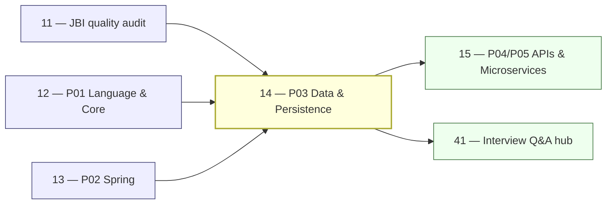

# 14 — JBI Pillar P03: Data & Persistence (DEEP)

> **Executor:** AI coding agent operating autonomously.
> **Working directory:** `/Users/ravi.r_flx/IEProject/InterviewExplainer/`.
> **Type:** content-writing. Bridge pillar connecting Java to the database layer.
> **Pillar / Wave:** P03 / Wave B.
> **Depends on:** playbooks 10 (Phase 3b speakable shape), 11 (gap report), 12 (P01 baseline), 13 (P02 Spring baseline — Spring Data JPA cross-links).

---

## §1 — TL;DR

- **Input:** P03 modules exist with uneven depth; `postgresql` was historically mis-pillared (fixed pre-Phase 3a); gap report lists per-module deltas; SQL and indexing Qs are the highest-volume searches.
- **Action:** Hit per-module depth targets using the exact question lists and comparison topics below; fix any `postgresql` module pillar-tag if still wrong; write N+1 and `@Transactional` Qs with diagrams.
- **Output:** P03 audit clean; every "indexing / N+1 / ACID / Redis cache" query has a canonical answer; all four module intros tuned; `postgresql` module carries `pillar: P03`.

---

## §2 — Why this matters

Data and persistence is the bridge pillar between Java and the rest of the stack — every Spring Boot answer eventually links to a database question, and SQL + indexing + N+1 questions appear in every interview loop from mid-IC to staff. The flagship search terms (`sql interview questions`, `database indexing interview questions`, `acid properties interview questions`) pull 6-figure monthly searches from candidates who need concrete, accurate answers fast.

Owning the canonical comparison answers (OLTP vs OLAP, optimistic vs pessimistic locking, clustered vs non-clustered index, JPA vs Hibernate vs Spring Data JPA) captures supplementary searches that funnel back into the Spring Data JPA and system-design content — the highest-RPM pages on the site. If these foundational data Qs are thin, the Spring Data JPA module has no reliable cross-link destination and the inter-page link graph weakens.

The Redis caching module additionally captures the system-design interview traffic — candidates researching "how to design a caching layer" land on `redis interview questions` and follow cross-links into the cache-pattern and eviction-policy content. A thin Redis module means losing users to system-design sites at exactly the moment they're most engaged. The `postgresql` module is similarly strategic: PostgreSQL is the default database for new services at startups and scale-ups, and experienced-hire interviews frequently include MVCC and JSONB depth questions that distinguish a mid from a senior candidate.

---

## §3 — Easy-language glossary

| Term | Plain-English definition | First used in |
| --- | --- | --- |
| **ACID** | Atomicity, Consistency, Isolation, Durability — the four properties that guarantee database transactions are processed reliably. | §9 step 3 |
| **Atomicity** | All operations in a transaction succeed together or all are rolled back — no partial commits. | §9 step 3 |
| **Isolation** | Concurrent transactions are invisible to each other until committed, to the degree specified by the isolation level. | §9 step 3 |
| **Durability** | Once a transaction commits, the data survives system crashes — guaranteed by write-ahead log (WAL). | §9 step 3 |
| **B-tree index** | The default PostgreSQL and MySQL index type; keeps keys sorted in a balanced tree for O(log N) lookups. | §9 step 3 |
| **Covering index** | An index that includes all columns a query needs, so the DB reads only the index without touching the table. | §9 step 3 |
| **Composite index** | An index on two or more columns; only useful when the query filters on a prefix of those columns. | §9 step 3 |
| **Clustered index** | An index where the table's rows are physically sorted in the same order as the index; SQL Server and MySQL InnoDB use the primary key as the clustered index. | §9 step 3 |
| **Non-clustered index** | An index that stores pointers to rows instead of the rows themselves; PostgreSQL calls all its indexes non-clustered by default. | §9 step 3 |
| **MVCC** | Multi-Version Concurrency Control — PostgreSQL stores old row versions (tuples) so readers never block writers. | §9 step 4 |
| **dead tuple** | An old row version in PostgreSQL left behind after an `UPDATE` or `DELETE`; VACUUM reclaims the space. | §9 step 4 |
| **VACUUM** | PostgreSQL maintenance command that reclaims space from dead tuples; `AUTOVACUUM` runs it automatically. | §9 step 4 |
| **GIN index** | Generalized Inverted Index — PostgreSQL index type for full-text search and JSONB containment queries. | §9 step 4 |
| **BRIN index** | Block Range Index — PostgreSQL index for naturally ordered large tables (e.g., time-series); very small, suitable when data is inserted in order. | §9 step 4 |
| **JSONB** | PostgreSQL's binary JSON storage format; indexable with GIN, supports operators like `@>` (contains) and `->>` (key extract). | §9 step 4 |
| **aggregation pipeline** | MongoDB's multi-stage query system (`$match` → `$group` → `$lookup` etc.) that transforms documents in sequence. | §9 step 5 |
| **shard key** | MongoDB's partition key that determines which shard holds a document; a poor shard key creates hotspots. | §9 step 5 |
| **write concern** | MongoDB setting that controls how many replica set members must acknowledge a write before the driver considers it successful. | §9 step 5 |
| **cache-aside** | Caching pattern: the app checks the cache first; on a miss it reads the DB and populates the cache. Application owns cache population. | §9 step 6 |
| **write-through** | Caching pattern: every write goes to both the cache and the DB simultaneously; cache is always consistent but writes are slower. | §9 step 6 |
| **write-back** | Caching pattern: writes go to the cache first and are flushed to the DB asynchronously; fastest writes but risks data loss on cache crash. | §9 step 6 |
| **eviction policy** | Redis rule for choosing which key to remove when memory is full; `allkeys-lru` evicts the least-recently-used key. | §9 step 6 |
| **RDB snapshot** | Redis persistence mode that dumps the dataset to disk at configurable intervals; fast recovery, some data loss risk. | §9 step 6 |
| **AOF (Append-Only File)** | Redis persistence mode that logs every write command; more durable than RDB but larger files and slower restart. | §9 step 6 |
| **Lettuce** | The reactive Redis Java client; supports cluster, sentinel, and pipelining; used by Spring Data Redis by default. | §9 step 6 |
| **Jedis** | The legacy synchronous Redis Java client; still widely used but does not support reactive patterns. | §9 step 6 |
| **`EXPLAIN ANALYZE`** | PostgreSQL command that executes a query and shows the actual execution plan with row counts and timing. | §9 step 3 |
| **N+1 problem** | Fetching N parent rows then running N extra queries for children; fixed by JOIN FETCH, `@EntityGraph`, or `@BatchSize`. | §9 step 7 |
| **optimistic locking** | Conflict detection at commit time — reads are lock-free; a `version` column check at update time detects conflicts. | §9 step 3 |
| **pessimistic locking** | Acquire a lock at read time (`SELECT ... FOR UPDATE`) — prevents conflicts but reduces concurrency. | §9 step 3 |
| **`@Version`** | JPA annotation that adds a version column for optimistic locking; Hibernate increments it on every update. | §9 step 7 |
| **WAL (Write-Ahead Log)** | PostgreSQL's durability mechanism: changes are written to a log before the actual data pages, ensuring crash recovery. | §9 step 4 |
| **OLTP** | Online Transaction Processing — workload characterized by many short reads/writes; row stores (PostgreSQL, MySQL) excel here. | §9 step 3 |
| **OLAP** | Online Analytical Processing — workload characterized by few large aggregation queries; columnar stores (Redshift, BigQuery) excel here. | §9 step 3 |
| **Money question** | A pair-comparison Q that pulls outsized monthly search volume. | §9 step 9 |
| **Archetype B** | The comparison archetype — opens `direct_answer` with "Use X when…; use Y when…" and requires a `comparison_table` section. | §10 |
| **P03** | Pillar 03 — Data & Persistence — covers sql-databases, postgresql, nosql-mongodb, redis-caching. | §1 |
| **`pg_stat_statements`** | PostgreSQL extension that logs all executed SQL statements with execution counts and total time — the primary tool for identifying slow queries. | §9 step 8 |
| **`pgBouncer`** | PostgreSQL connection pooler that sits between the app and Postgres, reducing the overhead of frequent connection creation. | §9 step 5 |
| **`pgvector`** | PostgreSQL extension adding a `vector` column type and approximate nearest-neighbor search — used for embedding similarity. | §9 step 5 |
| **JSON Schema validation** | MongoDB's `$jsonSchema` validator (3.6+) that enforces document structure constraints on insert/update. | §9 step 6 |
| **hot standby** | A PostgreSQL replica that accepts read queries while streaming replication from the primary. | §9 step 5 |
| **logical replication** | PostgreSQL replication mode that sends row-level changes (not WAL bytes) — usable for cross-version or cross-platform replication. | §9 step 5 |
| **`VACUUM FULL`** | PostgreSQL command that locks the table and rewrites it to reclaim space — much slower than regular VACUUM but more thorough. | §9 step 5 |
| **thundering herd** | Cache stampede problem: many requests arrive simultaneously on a cold cache and all query the DB at once — solved with mutex/lock or random TTL jitter. | §14 anti-patterns |
| **`SELECT ... FOR UPDATE SKIP LOCKED`** | PostgreSQL (9.5+) and MySQL (8.0+) `SELECT FOR UPDATE` variant that skips already-locked rows — useful for job queues. | §10 |
| **`EXPLAIN`** | PostgreSQL query plan command; `EXPLAIN ANALYZE` actually runs the query and shows real row counts and timing. | §9 step 4 |
| **TTL index** | MongoDB or Redis index/config that automatically expires documents/keys after a set time. | §9 step 7 |
| **`ZADD`** | Redis command to add a member with a score to a sorted set — used for leaderboards, rate limiting, priority queues. | §9 step 7 |
| **pipeline** | Redis batch of commands sent to the server in one TCP round-trip without waiting for replies — reduces latency for bulk operations. | §9 step 7 |

---

## §4 — Hard prerequisites

- [ ] Playbook 11 is DONE (gap report exists). `grep -E '^\| 11 \|' expansion-plan/00-INDEX.md | grep DONE`
- [ ] `postgresql` module carries `pillar: P03`. `jq '.modules[] | select(.moduleSlug=="postgresql") | .pillar' content/java-backend-intermediate/_index.json` → `"P03"`
- [ ] `content/java-backend-intermediate/_index.json` has all 4 P03 modules. `jq '.modules[] | select(.pillar=="P03") | .moduleSlug' content/java-backend-intermediate/_index.json`
- [ ] `scripts/audit_speakable.py` exists. `test -f scripts/audit_speakable.py && echo OK`
- [ ] `scripts/validate_complete_qa.py` exists. `test -f scripts/validate_complete_qa.py && echo OK`
- [ ] Python 3 + jsonschema available. `python3 -m pip show jsonschema | head -1`
- [ ] Node ≥ 20. `node --version | awk '{print substr($1,2,2)}' | awk '$1 >= 20'`
- [ ] `content/_schemas/complete-qa.schema.json` exists. `test -f content/_schemas/complete-qa.schema.json && echo OK`
- [ ] All 4 P03 module folders exist. `for m in sql-databases postgresql nosql-mongodb redis-caching; do test -d content/java-backend-intermediate/$m && echo "OK: $m" || echo "MISSING: $m"; done`
- [ ] `docs/speakable/archetypes.md` exists. `test -f docs/speakable/archetypes.md && echo OK`

If the `postgresql` module folder is missing, check whether playbook 08 scaffolded it under a different slug (`postgres`, `psql`, etc.) and rename/move before proceeding. The pillar-tag check in step 1 also catches this.

Any missing module folder should be scaffolded from playbook 08 before writing Qs. Running `mkdir` and creating an empty `complete-qa.json` is a temporary workaround but may miss `_index.json` and nav registration — prefer the playbook 08 scaffold process.

---

## §5 — Current state

### 5.1 — On-disk snapshot

```bash
cd /Users/ravi.r_flx/IEProject/InterviewExplainer

for mod in sql-databases postgresql nosql-mongodb redis-caching; do
  count=$(find content/java-backend-intermediate/$mod -name 'complete-qa.json' \
    -exec jq '.questions|length' {} \; 2>/dev/null | awk '{s+=$1} END {print s+0}')
  echo "$mod: $count Q"
done
```

### 5.2 — PostgreSQL pillar tag check

```bash
jq '.modules[] | select(.moduleSlug=="postgresql") | {moduleSlug, pillar}' \
  content/java-backend-intermediate/_index.json
# expected: pillar = "P03"
```

If output shows `"P02"` or any value other than `"P03"`, fix it before writing Qs:

```bash
# Open content/java-backend-intermediate/_index.json
# Find the postgresql module entry
# Change "pillar": "P02" to "pillar": "P03"
git add content/java-backend-intermediate/_index.json
git commit -m "fix(jbi): correct postgresql module pillar tag to P03"
```

### 5.3 — Existing UI surface

```bash
grep -E 'sql-databases|postgresql|nosql-mongodb|redis-caching' \
  frontend/lib/domains.ts | head -20
```

### 5.4 — Known gaps

From the most recent gap report:

```bash
cat $(ls content/_audits/jbi-quality-*.md | tail -1) | grep -A5 'P03'
```

Typical P03 gaps: `sql-databases` has joins but not window functions; `postgresql` MVCC/VACUUM depth is low; `nosql-mongodb` aggregation pipeline Qs are missing; `redis-caching` cache-pattern comparison table is absent.

### 5.5 — Difficulty distribution check

```bash
cd /Users/ravi.r_flx/IEProject/InterviewExplainer

for mod in sql-databases postgresql nosql-mongodb redis-caching; do
  echo "=== $mod ==="
  find content/java-backend-intermediate/$mod -name 'complete-qa.json' \
    -exec jq -r '.questions[].difficulty' {} \; 2>/dev/null | sort | uniq -c
done
```

If `sql-databases` is skewed toward easy, write the window functions and query-tuning Qs next — they are medium/hard and recalibrate the mix. If `redis-caching` is skewed toward easy, write the cluster routing and persistence durability Qs, which are medium/hard.

### 5.6 — Cross-link audit

Check that the N+1 Q in `spring-data-jpa` (P02) already cross-links to `sql-databases`:

```bash
rg 'sql-databases\|indexing' content/java-backend-intermediate/spring-data-jpa/n-plus-one-problem/ --include='*.json' | head -5
# expected: ≥ 1 cross-link to P03 sql-databases
```

If the cross-link is missing, add it to the `key_points` section: "For the raw SQL-level explanation and `EXPLAIN ANALYZE` output, see the SQL indexing section."

---

## §6 — Target state (measurable)

| Metric | Today | Target | How measured |
| --- | ---: | --- | --- |
| `sql-databases` Q count | — | ≥ 45 | `find content/java-backend-intermediate/sql-databases -name complete-qa.json -exec jq '.questions\|length' {} \; \| awk '{s+=$1} END {print s}'` |
| `postgresql` Q count | — | ≥ 30 | same pattern |
| `nosql-mongodb` Q count | — | ≥ 30 | same pattern |
| `redis-caching` Q count | — | ≥ 30 | same pattern |
| Difficulty mix (E/M/H) | — | 30/50/20 ± 10 % | `jq -r '.questions[].difficulty' <files> \| sort \| uniq -c` |
| Speakable lint pass+warn (pillar) | — | ≥ 90 % | `python3 scripts/audit_speakable.py --pillar P03 --report` |
| Schema lint failures | — | 0 | `python3 scripts/validate_complete_qa.py content/java-backend-intermediate/<mod>` |
| `postgresql` pillar tag | — | `"P03"` | `jq '.modules[] \| select(.moduleSlug=="postgresql") \| .pillar' content/java-backend-intermediate/_index.json` → `"P03"` |
| `comparison_table` sections | — | ≥ 27 across P03 | jq count across all P03 files |
| Mermaid diagrams | — | ≥ 4 (see §11) | `rg -c '\`\`\`mermaid' content/java-backend-intermediate/sql-databases content/java-backend-intermediate/postgresql --include='*.json'` |
| All money comparison Qs live | — | 100 % | per-module slug checks in §9 |

---

## §7 — Search phrases → URL map

| Search phrase | Target URL on site | Archetype | Diagram type required |
| --- | --- | --- | --- |
| `sql interview questions` | `/questions/java-backend-intermediate/sql-databases` | landing intro | comparison_table |
| `database indexing interview questions` | `/questions/java-backend-intermediate/sql-databases/indexes` | A | none |
| `clustered vs non-clustered index` | `/questions/java-backend-intermediate/sql-databases/comparisons/clustered-vs-non-clustered-index` | B | comparison_table |
| `acid properties interview questions` | `/questions/java-backend-intermediate/sql-databases/transactions-and-acid` | A | none |
| `isolation levels interview questions` | `/questions/java-backend-intermediate/sql-databases/transactions-and-acid` | A | stateDiagram-v2 |
| `joins interview questions` | `/questions/java-backend-intermediate/sql-databases/joins-and-set-operations` | A | none |
| `oltp vs olap` | `/questions/java-backend-intermediate/sql-databases/comparisons/oltp-vs-olap` | B | comparison_table |
| `optimistic vs pessimistic locking` | `/questions/java-backend-intermediate/sql-databases/comparisons/optimistic-vs-pessimistic-locking` | B | comparison_table |
| `postgresql interview questions` | `/questions/java-backend-intermediate/postgresql` | landing intro | none |
| `mvcc postgresql interview` | `/questions/java-backend-intermediate/postgresql/mvcc-and-vacuum` | A | flowchart |
| `jsonb interview questions` | `/questions/java-backend-intermediate/postgresql/jsonb-vs-json` | B | comparison_table |
| `mongodb interview questions` | `/questions/java-backend-intermediate/nosql-mongodb` | landing intro | none |
| `mongodb aggregation interview questions` | `/questions/java-backend-intermediate/nosql-mongodb/aggregation-pipeline` | A | flowchart |
| `mongodb vs postgresql` | `/questions/java-backend-intermediate/nosql-mongodb/comparisons/mongodb-vs-postgresql` | B | comparison_table |
| `redis interview questions` | `/questions/java-backend-intermediate/redis-caching` | landing intro | none |
| `redis vs memcached` | `/questions/java-backend-intermediate/redis-caching/comparisons/redis-vs-memcached` | B | comparison_table |
| `cache aside pattern interview` | `/questions/java-backend-intermediate/redis-caching/cache-patterns` | A | flowchart |
| `window functions sql interview questions` | `/questions/java-backend-intermediate/sql-databases/window-functions` | A | none |
| `sql joins interview questions` | `/questions/java-backend-intermediate/sql-databases/joins-and-set-operations` | A | none |
| `database normalization interview questions` | `/questions/java-backend-intermediate/sql-databases/normalization` | A | none |
| `redis data structures interview` | `/questions/java-backend-intermediate/redis-caching/data-types` | A | none |
| `postgresql vs mysql interview` | `/questions/java-backend-intermediate/postgresql/comparisons/postgresql-vs-mysql` | B | comparison_table |
| `sharding vs partitioning database` | `/questions/java-backend-intermediate/sql-databases/comparisons/sharding-vs-partitioning` | B | comparison_table |

---

## §8 — Dependency & wave context



- **Consumes:** gap report from playbook 11; Spring Data JPA content from playbook 13 (N+1 cross-links); P01 core-java concurrency Q shapes for transaction isolation analogy.
- **Produces:** filled `complete-qa.json` for sql-databases, postgresql, nosql-mongodb, redis-caching; tuned intros; corrected pillar tag for postgresql.
- **Unblocks:** playbook 15 (microservices/outbox cross-links into sql-databases for ACID), hub 41.
- **Does NOT gate:** playbook 15 can proceed before P03 is complete — microservices Qs don't depend on P03 content directly.

### 8.1 — Module cross-link map

| From P03 module | To module | Cross-link reason |
| --- | --- | --- |
| `sql-databases` (isolation levels) | P01 `java-concurrency` | Isolation analogy: DB isolation levels ↔ Java `synchronized`/volatile visibility |
| `sql-databases` (indexing) | P02 `spring-data-jpa` (N+1 fix) | SQL JOIN FETCh fixes N+1 at DB level; Hibernate fetch join at ORM level |
| `postgresql` (JSONB) | P04 `rest-api` | REST APIs often serialize/deserialize JSON stored in JSONB |
| `redis-caching` | P02 `spring-data-jpa` | Hibernate second-level cache vs Spring Cache abstraction vs raw Redis |
| `nosql-mongodb` | P05 `microservices` | Event-source patterns, saga state storage in MongoDB |

---

## §9 — Step-by-step execution

### Step 1 — Fix the postgresql pillar tag (if still wrong)

**Goal:** `postgresql` module carries `pillar: P03` in `_index.json` before any content is written.

```bash
cd /Users/ravi.r_flx/IEProject/InterviewExplainer

jq '.modules[] | select(.moduleSlug=="postgresql") | .pillar' \
  content/java-backend-intermediate/_index.json
```

**Verify:** output is `"P03"`. If not, open `_index.json`, find the `postgresql` entry, change `"pillar"` to `"P03"`, and commit:

```bash
git add content/java-backend-intermediate/_index.json
git commit -m "fix(jbi): correct postgresql module pillar tag to P03"
```

The classic bug is skipping this check and then having the frontend assign postgresql content to P02 dashboards, breaking the P03 hub page.

### Step 2 — Orient: snapshot current P03 gap

**Goal:** know which modules are furthest below target.

```bash
cd /Users/ravi.r_flx/IEProject/InterviewExplainer

for mod in sql-databases postgresql nosql-mongodb redis-caching; do
  count=$(find content/java-backend-intermediate/$mod -name 'complete-qa.json' \
    -exec jq '.questions|length' {} \; 2>/dev/null | awk '{s+=$1} END {print s+0}')
  echo "$mod: $count Q"
done
```

**Verify:** four lines. Cross-reference with §6 targets. Priority order for P03 by SEO traffic × gap:

| Priority | Module | Reason |
| --- | --- | --- |
| 1 | `sql-databases` | Highest search volume; 45 Q target; ACID and indexing pull 6-figure monthly |
| 2 | `postgresql` | Strong intent from Postgres shops; MVCC is a senior-IC differentiator |
| 3 | `redis-caching` | Cache-pattern questions appear in every mid-level system-design interview |
| 4 | `nosql-mongodb` | Narrower audience; aggregation pipeline Qs are specialist |

### Step 3 — Write `sql-databases` money comparison Qs (12 Qs)

**Goal:** all 12 high-CTR comparison Qs are live in `sql-databases/comparisons/complete-qa.json`.

```bash
TOPIC=content/java-backend-intermediate/sql-databases/comparisons/complete-qa.json
jq '.questions | length' "$TOPIC"
# Start when count < 12
```

**Money comparisons to write:**
`OLTP vs OLAP`, `primary key vs unique key vs index`, `WHERE vs HAVING`, `GROUP BY vs PARTITION BY`, `INNER JOIN vs LEFT JOIN`, `optimistic vs pessimistic locking`, `clustered vs non-clustered index`, `sharding vs partitioning vs replication`, `DELETE vs TRUNCATE vs DROP`, `stored procedure vs function vs trigger`, `READ COMMITTED vs REPEATABLE READ vs SERIALIZABLE`, `row store vs columnar store`.

**Verify:**

```bash
jq '.questions | length' "$TOPIC"
# expected: 12

python3 scripts/audit_speakable.py "$TOPIC"
# expected: all PASS or WARN
```

The #1 trap for the `clustered vs non-clustered index` Q is describing SQL Server behavior and presenting it as universal. PostgreSQL does not have clustered indexes in the same sense — all its indexes are heap-based non-clustered indexes. The answer must call out the database: "In SQL Server and MySQL InnoDB, the primary key IS the clustered index (table is physically sorted by it). In PostgreSQL, there is no inherent clustered index — `CLUSTER` is a one-time sort that requires maintenance."

### Step 4 — Fill `sql-databases` depth topics to ≥ 45 Q

**Goal:** sql-databases reaches 45 Q across 7 topic folders.

Write in this priority order:

1. **`transactions-and-acid`** (7 Q) — ACID properties with concrete anomaly examples (dirty read, non-repeatable read, phantom read for each isolation level), savepoints, distributed transactions 2PC overview.
2. **`indexes`** (8 Q) — B-tree internals, covering indexes, composite index prefix rule, partial index (`WHERE status='active'`), when NOT to index (low-cardinality columns, heavy-write tables), `EXPLAIN (ANALYZE, BUFFERS)` output reading.
3. **`joins-and-set-operations`** (8 Q) — INNER, LEFT, RIGHT, FULL OUTER, SELF, CROSS joins; `UNION` vs `UNION ALL`; `EXCEPT`; `INTERSECT`; anti-join pattern (`NOT EXISTS` vs `NOT IN` null safety).
4. **`window-functions`** (4 Q) — `ROW_NUMBER()`, `RANK()`, `DENSE_RANK()`, `LAG()`/`LEAD()`, frame clauses (`ROWS BETWEEN UNBOUNDED PRECEDING AND CURRENT ROW`).
5. **`normalization`** (5 Q) — 1NF, 2NF, 3NF, BCNF; denormalization trade-off; when to break normalization for read performance.
6. **`query-tuning`** (5 Q) — `EXPLAIN ANALYZE`, sequential vs index scan choice, statistics freshness (`ANALYZE`), common anti-patterns (function on indexed column, implicit type cast, `OR` breaking index use).
7. **`comparisons`** (12 Q) — already done in step 3 above; add any missing.

```bash
find content/java-backend-intermediate/sql-databases -name 'complete-qa.json' \
  -exec jq '.questions|length' {} \; | awk '{s+=$1} END {print "sql-databases total:", s}'
# expected: ≥ 45
```

**Verify per topic:**

```bash
python3 scripts/validate_complete_qa.py content/java-backend-intermediate/sql-databases
python3 scripts/audit_speakable.py --module sql-databases --report
# expected: 0 schema failures; pass+warn ≥ 90 %
```

**Key details for the hardest Qs in sql-databases:**

The **window function** Qs are the most common gap. Write these with concrete before/after SQL examples — `ROW_NUMBER() OVER (PARTITION BY customer_id ORDER BY order_date DESC)` for "most recent order per customer" is the canonical example every interviewer uses. Don't write abstract frame-clause explanations without a concrete query.

The **query-tuning** Qs must show `EXPLAIN (ANALYZE, BUFFERS)` output with annotations. Explain the difference between "rows=1000 actual rows=1" (statistics stale) and "seq scan" vs "index scan" (threshold at which the planner switches). Name `ANALYZE table_name` as the command to refresh statistics.

The **normalization** Qs must cover the denormalization trade-off explicitly: "Denormalize when reads vastly outnumber writes AND the query involves joining 3+ tables AND the JOIN cost is measurable." Don't present normalization as always good — experienced interviewers probe when you'd break it.

### Step 5 — Write `postgresql` to ≥ 30 Q

**Goal:** postgresql reaches 30 Q with MVCC flowchart and JSONB comparison table.

Write in this priority order:

1. **`mvcc-and-vacuum`** (6 Q) — tuple visibility rules (xmin, xmax, cmin, cmax), dead tuple accumulation, `VACUUM` vs `VACUUM FULL`, `AUTOVACUUM` settings (`autovacuum_vacuum_threshold`, `autovacuum_vacuum_scale_factor`), table bloat measurement (`pgstattuple`).
2. **`indexes-postgres-specific`** (5 Q) — B-tree default, GIN for JSONB/full-text, GiST for geometric/range, BRIN for time-series, partial index, expression index (`lower(email)`).
3. **`jsonb-vs-json`** (4 Q) — storage difference (binary vs text), indexing with GIN, `@>` containment, `->>` key extract, `jsonb_path_query`, when to use JSONB vs a separate normalized table.
4. **`partitioning`** (4 Q) — range/list/hash partitioning, `ATTACH PARTITION`, partition pruning, `pg_partman` extension.
5. **`replication`** (5 Q) — streaming vs logical replication, hot standby read scaling, `pg_hba.conf` for replication, failover with `pg_ctl promote`, `pgBouncer` connection pooling.
6. **`extensions`** (3 Q) — `pgvector` for vector similarity search, `PostGIS` for spatial, `pg_stat_statements` for query analytics.
7. **`comparisons`** (3 Q) — `PostgreSQL vs MySQL`, `JSONB vs hstore vs JSON`, `streaming vs logical replication`.

The MVCC Q must include a `flowchart` showing: INSERT creates tuple (xmin=current txn, xmax=null) → UPDATE creates new tuple + sets old xmax → VACUUM removes old tuple when no active txn references xmin.

```bash
rg 'flowchart' content/java-backend-intermediate/postgresql/ -l
# expected: ≥ 1 file (mvcc Q)
```

### Step 6 — Write `nosql-mongodb` to ≥ 30 Q

**Goal:** nosql-mongodb reaches 30 Q; aggregation pipeline Q carries a `flowchart`.

Write in this priority order:

1. **`aggregation-pipeline`** (7 Q) — `$match`, `$group`, `$project`, `$lookup` (left-outer join), `$facet` (multi-result), `$unwind`, `$bucket`. Include an `$explain` example. Each Q names a concrete use case.
2. **`document-modelling`** (6 Q) — embed vs reference decision rule (read:write ratio, document size limit 16 MB, atomicity), schema design patterns (outlier, bucket, computed), anti-patterns (massive arrays).
3. **`indexing-mongo`** (5 Q) — compound index prefix rule, multikey index (arrays), text index, TTL index, partial index, `explain("executionStats")`.
4. **`sharding`** (4 Q) — shard key choice (hashed vs ranged), chunk balancer, cross-shard operations, `mongos` router.
5. **`transactions-and-concerns`** (4 Q) — multi-document transactions (4.0+), read concern `majority`, write concern `w:majority`, `j:true` journaling.
6. **`comparisons`** (4 Q) — `MongoDB vs PostgreSQL`, `embedded documents vs references`, `$lookup vs application-side join`, `MongoDB vs DynamoDB`.

The classic bug for MongoDB comparison Qs is presenting MongoDB as "schema-less" without qualifying: MongoDB is schema-optional, not schema-free. Production MongoDB always has an implicit schema enforced by the application code, and from MongoDB 3.6+, you can enforce it with JSON Schema validation. Answers that say "MongoDB has no schema" fail follow-up questions.

```bash
find content/java-backend-intermediate/nosql-mongodb -name 'complete-qa.json' \
  -exec jq '.questions|length' {} \; | awk '{s+=$1} END {print "mongodb total:", s}'
# expected: ≥ 30
```

### Step 7 — Write `redis-caching` to ≥ 30 Q

**Goal:** redis-caching reaches 30 Q; cache-pattern Q carries a `flowchart`.

Write in this priority order:

1. **`cache-patterns`** (6 Q) — cache-aside (lazy loading), write-through, write-back (write-behind), read-through, refresh-ahead. Each pattern needs: when to use it, the write path, the failure mode (cache-aside: cache miss storm; write-back: data loss on crash).
2. **`data-types`** (6 Q) — String, Hash, List, Set, Sorted Set, Stream, HyperLogLog; `INCR` atomicity, `ZADD`/`ZRANGE` for leaderboards, `XADD`/`XREAD` for event streams, `PFADD` approximate cardinality.
3. **`comparisons`** (4 Q) — `Redis vs Memcached`, `Lettuce vs Jedis`, `RDB vs AOF`, `cache-aside vs write-through vs write-back`.
4. **`eviction-policies`** (3 Q) — `allkeys-lru`, `allkeys-lfu`, `volatile-lru`, `volatile-ttl`; when each; `maxmemory-policy` config.
5. **`persistence`** (4 Q) — RDB snapshot (BGSAVE), AOF (fsync always vs everysec vs no), hybrid (RDB + AOF), `redis-server --appendonly yes`.
6. **`cluster-and-sharding`** (4 Q) — hash slot mapping (16384 slots), `MOVED` vs `ASK` redirect, cross-slot operations (`MGET` with hash tags `{tag}`), `redis-cli --cluster check`.
7. **`java-clients`** (3 Q) — Lettuce (`StatefulRedisConnection`, reactor support, connection pool), Jedis (thread-safe pool), Spring `StringRedisTemplate` vs `RedisTemplate<Object,Object>`.

The cache-aside Q's `step` section must include a `flowchart` showing: request → check cache → HIT: return cached value; MISS: query DB → write to cache → return value.

```bash
rg 'flowchart' content/java-backend-intermediate/redis-caching/ -l
# expected: ≥ 1 match
```

**Verify:**

```bash
for mod in sql-databases postgresql nosql-mongodb redis-caching; do
  count=$(find content/java-backend-intermediate/$mod -name 'complete-qa.json' \
    -exec jq '.questions|length' {} \; | awk '{s+=$1} END {print s+0}')
  echo "$mod: $count Q"
done
# expected: ≥ 45, ≥ 30, ≥ 30, ≥ 30
```

### Step 8 — Write cross-pillar N+1 and transaction Qs (joint with P02)

**Goal:** ensure P03's sql-databases module has the SQL-layer explanation of N+1 and transactions, complementing the Hibernate-layer coverage in P02's spring-data-jpa.

The N+1 problem has two angles: the Hibernate level (lazy association + no fetch join → N extra Hibernate queries, covered in playbook 13) and the SQL level (N+1 raw SQL queries hitting the DB, visible in `pg_stat_statements`, fixable with a SQL `JOIN` or `LATERAL` join). P03 owns the SQL-level angle.

```bash
cd /Users/ravi.r_flx/IEProject/InterviewExplainer

# Check if N+1 SQL-level Q exists
rg '"n-plus-one-sql"' content/java-backend-intermediate/sql-databases/ 2>/dev/null || echo "MISSING"

# Check if transaction isolation Q covers all four anomaly types
rg '"dirty-read"\|"non-repeatable-read"\|"phantom-read"' \
  content/java-backend-intermediate/sql-databases/transactions-and-acid/complete-qa.json | wc -l
# expected: ≥ 3 (one Q per anomaly type, or one Q covering all three)
```

**Qs to write for this cross-pillar step:**

1. **N+1 at the SQL layer** — show `EXPLAIN ANALYZE` output for N+1 vs a single JOIN; name `pg_stat_statements` as the production detection tool; show how a SQL JOIN eliminates N+1 without Hibernate/JPA context.
2. **Dirty read / non-repeatable read / phantom read** — one Q that defines each anomaly with a concrete two-transaction example (Transaction A reads, Transaction B writes between reads). Include a `stateDiagram-v2` matching the isolation level to which anomalies it prevents.
3. **Savepoints** — `SAVEPOINT sp1; ROLLBACK TO SAVEPOINT sp1;` — when you need partial rollback within a transaction; Spring's `NESTED` propagation maps to a JDBC savepoint.

**Verify:**

```bash
python3 scripts/audit_speakable.py content/java-backend-intermediate/sql-databases/transactions-and-acid/complete-qa.json
python3 scripts/validate_complete_qa.py content/java-backend-intermediate/sql-databases/transactions-and-acid
# expected: all PASS or WARN; 0 schema failures
```

### Step 9 — Write PostgreSQL JSONB deep-dive Q with operators

**Goal:** the `jsonb-vs-json` topic has a Q that teaches `@>`, `->>`, `#>>`, `jsonb_path_query`, and GIN index usage — this is a growing interview topic as teams store semi-structured data.

```bash
TOPIC=content/java-backend-intermediate/postgresql/jsonb-vs-json/complete-qa.json
jq '.questions | length' "$TOPIC"
# Start when count < 4
```

**JSONB Qs to write:**

1. **JSONB vs JSON storage** — binary decomposed vs text; `jsonb` normalizes key order and removes whitespace; disk size trade-off; write speed (json slightly faster; jsonb adds parsing overhead on write but faster reads and indexable).
2. **GIN index on JSONB** — `CREATE INDEX ON events USING gin(payload);` enables `@>` containment queries; `gin_trgm_ops` for partial-string search inside JSONB.
3. **JSONB operators** — `->` (returns JSON), `->>` (returns text), `#>` (path returns JSON), `#>>` (path returns text), `@>` (containment), `?` (key exists), `jsonb_path_query` (jsonpath expressions).
4. **When to use JSONB vs a normalized table** — JSONB for variable-schema data (event payloads, user preferences); normalized table when you JOIN, GROUP BY, or enforce constraints on individual fields.

```bash
python3 scripts/audit_speakable.py "$TOPIC"
python3 scripts/validate_complete_qa.py "$(dirname $TOPIC)"
# expected: all PASS or WARN; 0 failures
```

The classic bug for JSONB index Qs is recommending a GIN index for all JSONB columns. GIN indexes are large and slow down writes — they're only worth it for columns that are frequently searched with `@>` or `?` operators. A JSONB column used only for storage (never queried) needs no index.

### Step 10 — Tune all four `_index.json` intro fields

**Goal:** each module's `intro` is ≥ 150 words, passes banned-word grep.

```bash
for mod in sql-databases postgresql nosql-mongodb redis-caching; do
  word_count=$(jq -r '.intro // ""' content/java-backend-intermediate/$mod/_index.json | wc -w)
  echo "$mod intro: $word_count words"
done
# expected: each ≥ 150 words
```

Note that `sql-databases` intro must not reference PostgreSQL-specific syntax — that lives in the `postgresql` module. Use ANSI SQL examples in `sql-databases`.

**Intro guidance per module:**

- `sql-databases` intro: cover ACID, indexing, joins, window functions, normalization. State the scope explicitly: "This page uses ANSI SQL syntax applicable to PostgreSQL, MySQL, and SQL Server. For PostgreSQL-specific features (MVCC, JSONB, GIN indexes), see the PostgreSQL page."
- `postgresql` intro: emphasize MVCC, JSONB, and the advanced indexing types. Target readers who are specifically using PostgreSQL and want to differentiate from generic SQL knowledge.
- `nosql-mongodb` intro: lead with the document model design decision (when to embed vs reference). Address the `MongoDB vs PostgreSQL` question directly in the first paragraph — that's the question most readers arrive with.
- `redis-caching` intro: lead with cache patterns (cache-aside is the most common interview question). Mention data types briefly; focus on when Redis is the right choice vs a DB-level cache (Hibernate second-level cache) or an in-process cache (Caffeine).

**Verify intro word counts:**

```bash
for mod in sql-databases postgresql nosql-mongodb redis-caching; do
  wc=$(jq -r '.intro // ""' content/java-backend-intermediate/$mod/_index.json | wc -w)
  echo "$mod: $wc words"
done
# expected: each ≥ 150 words
```

### Step 11 — Write Redis cluster and Lettuce integration Qs

**Goal:** redis-caching has at least 3 cluster Qs and 3 Java client Qs that interviewers ask at senior level.

Redis cluster is tested at companies where Redis is a critical path component (Uber, Netflix, Stripe). The Java client Qs (Lettuce vs Jedis) appear in Spring Data Redis interviews.

```bash
cd /Users/ravi.r_flx/IEProject/InterviewExplainer

# Check existing cluster Q count
jq '.questions | length' content/java-backend-intermediate/redis-caching/cluster-and-sharding/complete-qa.json 2>/dev/null || echo 0
# Start when count < 4

jq '.questions | length' content/java-backend-intermediate/redis-caching/java-clients/complete-qa.json 2>/dev/null || echo 0
# Start when count < 3
```

**Redis cluster Qs to write:**

1. **Hash slot routing** — 16384 total slots; `CRC16(key) % 16384` maps each key to a slot; a `CLUSTER KEYSLOT key` command shows the slot; client receives `MOVED` redirect to correct node.
2. **`MOVED` vs `ASK` redirect** — `MOVED`: the slot has permanently moved; client updates its slot map. `ASK`: the slot is migrating; ask the new node this once but don't update the map.
3. **Cross-slot operations** — `MGET key1 key2 key3` fails if keys are on different slots. Solution: hash tags `{user:1}:orders` and `{user:1}:profile` share the same slot because only the `{}` content is hashed.
4. **`redis-cli --cluster check`** — verifies cluster health, finds empty slots, detects inconsistencies.

**Java client Qs to write:**

1. **Lettuce vs Jedis** — Lettuce: async/reactive, single thread-safe connection, Reactor publisher support; Jedis: synchronous, JedisPool for thread safety. Use Lettuce with Spring Data Redis (default since Spring Data 2.0).
2. **`StringRedisTemplate` vs `RedisTemplate<Object, Object>`** — `StringRedisTemplate` serializes keys and values as UTF-8 strings; `RedisTemplate<Object, Object>` uses Java serialization by default (danger: serialization format tightly coupled). Prefer `StringRedisTemplate` + JSON serialization.
3. **Connection pool config** — `LettuceConnectionFactory` with `LettucePoolingClientConfiguration`; `maxTotal`, `maxIdle`, `minIdle`; pool exhaustion throws `PoolExhaustedException` without a timeout.

**Verify:**

```bash
python3 scripts/audit_speakable.py content/java-backend-intermediate/redis-caching/cluster-and-sharding/complete-qa.json
python3 scripts/audit_speakable.py content/java-backend-intermediate/redis-caching/java-clients/complete-qa.json
# expected: all PASS or WARN
```

The #1 trap for Lettuce Qs is recommending a connection pool by default — Lettuce is designed to share a single non-blocking connection across threads. Pooling is only needed for blocking commands or thread-local state. Spring Data Redis uses a single Lettuce connection unless you configure `LettucePoolingClientConfiguration` explicitly.

### Step 12 — Commit per 10 questions, run pillar audit

**Goal:** clean working tree; catch regressions early.

```bash
# After every ~10 questions:
git add content/java-backend-intermediate/<module>
git commit -m "content(P03/<module>): +N questions covering <topic>"

# After full module:
python3 scripts/audit_speakable.py --module <module> --report
# expected: pass+warn ≥ 90 %

python3 scripts/validate_complete_qa.py content/java-backend-intermediate/<module>
# expected: 0 failures
```

**Pillar-wide after all four:**

```bash
python3 scripts/audit_speakable.py --pillar P03 --report
# expected: pass+warn ≥ 90 %
```

### Step 12 — Flip `hasContent` flags and verify build

**Goal:** all four P03 modules are live in the UI.

```bash
# Verify or set hasContent: true for each module
grep -E 'sql-databases|postgresql|nosql-mongodb|redis-caching' frontend/lib/domains.ts

cd frontend && npm run build
# expected: exit 0
```

---

## §10 — Reference Q in archetype shape

```json
{
  "id": "optimistic-vs-pessimistic-locking",
  "slug": "optimistic-vs-pessimistic-locking",
  "question": "Optimistic vs pessimistic locking in databases — when do you reach for each?",
  "title": "Optimistic vs Pessimistic Locking — Conflict Detection vs Prevention",
  "direct_answer": "Use **optimistic locking** when conflicts are rare — reads are lock-free; a version check at commit time detects conflicts and retries. Use **pessimistic locking** (`SELECT ... FOR UPDATE`) when conflicts are frequent or the cost of retry is high — it prevents conflicts at the cost of reduced concurrency. JPA's `@Version` implements optimistic locking; `em.lock(entity, LockModeType.PESSIMISTIC_WRITE)` implements pessimistic.",
  "layout_type": "default",
  "difficulty": "medium",
  "importance": "high",
  "reading_time_minutes": 7,
  "last_updated": "2026-04-22",
  "interviewer_intent": {
    "testing": "Whether you understand the concurrency trade-off and can name the JPA/Hibernate implementation for each.",
    "common_mistake": "Saying 'optimistic is always better because it's lock-free' — optimistic locking fails under high contention with frequent retries, potentially performing worse than pessimistic.",
    "to_stand_out": "Mention that `@Version` works across all JPA providers, that PostgreSQL's `SELECT ... FOR UPDATE SKIP LOCKED` is useful for job-queue patterns, and that optimistic locking in a distributed system requires a version stored in the DB — not just in-memory."
  },
  "company_tags": ["amazon", "google", "stripe", "uber", "booking"],
  "answer": {
    "sections": [
      {
        "type": "overview",
        "title": "Two strategies for concurrent writes",
        "content": "Optimistic locking assumes conflicts are rare. It reads without locks, tracks a version, and fails at commit time if the version changed. Pessimistic locking assumes conflicts are common. It acquires a row lock at read time and holds it until the transaction commits."
      },
      {
        "type": "comparison_table",
        "title": "Optimistic vs pessimistic side-by-side",
        "content": "| Aspect | Optimistic locking | Pessimistic locking |\n| --- | --- | --- |\n| Lock at read? | No | Yes (`SELECT FOR UPDATE`) |\n| Conflict detection | At commit (version check) | At read (lock wait or skip) |\n| Concurrency | High (no read locks) | Lower (blocked readers) |\n| Best for | Low-contention, read-heavy | High-contention, write-heavy |\n| JPA API | `@Version` field | `LockModeType.PESSIMISTIC_WRITE` |\n| Retry needed? | Yes (on `OptimisticLockException`) | No (waits for lock) |\n| Deadlock risk | None | Yes (need lock ordering) |"
      },
      {
        "type": "step",
        "title": "Optimistic locking with JPA @Version",
        "content": "```java\n@Entity\npublic class Order {\n    @Id private Long id;\n    @Version private Long version;  // auto-incremented by Hibernate on each update\n    private OrderStatus status;\n}\n\n// Concurrent update: Hibernate generates:\n// UPDATE orders SET status=?, version=2 WHERE id=1 AND version=1\n// If version mismatch: throws OptimisticLockException — caller must retry\n```"
      },
      {
        "type": "tradeoffs",
        "title": "Choose based on contention level",
        "content": "Under low contention (most inventory updates, profile edits), optimistic locking is faster — no lock acquisition overhead. Under high contention (flash-sale inventory countdown, seat booking), pessimistic locking prevents starvation from retry loops. The classic bug is choosing optimistic locking for a queue-drain pattern — multiple workers all grab the same row, all fail, and the retry storm is worse than the original lock."
      },
      {
        "type": "key_points",
        "title": "Key points",
        "content": "- Optimistic: `@Version` column; Hibernate increments it on each UPDATE; throws `OptimisticLockException` on version mismatch.\n- Pessimistic: `SELECT ... FOR UPDATE`; blocks other writers until the transaction commits or rolls back.\n- PostgreSQL's `SELECT ... FOR UPDATE SKIP LOCKED` is useful for job-queue workers (each worker skips already-locked rows).\n- Deadlocks are only possible with pessimistic locking — prevent them by acquiring locks in consistent order."
      },
      {
        "type": "speakable_answer",
        "title": "How to answer verbally",
        "content": "Use optimistic locking when conflicts are rare — you add a `@Version` field and JPA checks it at commit time. If two writers clash, one gets an `OptimisticLockException` and retries. Use pessimistic locking, like `SELECT FOR UPDATE`, when conflicts are frequent or retries are expensive — it blocks other writers upfront. The classic mistake is using optimistic locking for a high-contention queue where every worker grabs the same row and the retry storm is worse than the original lock contention."
      }
    ]
  },
  "followup_questions": [
    "How does @Version work under the hood in Hibernate — what SQL does it generate?",
    "What is SELECT FOR UPDATE SKIP LOCKED and when would you use it?",
    "How do you handle OptimisticLockException in a Spring @Transactional service?",
    "Can you use optimistic locking across distributed services without a shared database?",
    "What is a deadlock and how do you prevent it with pessimistic locking?"
  ],
  "seo": {
    "metaTitle": "Optimistic vs Pessimistic Locking — When to Use Each",
    "metaDescription": "Compare optimistic and pessimistic locking: JPA @Version, SELECT FOR UPDATE, conflict detection vs prevention, and when each strategy wins."
  },
  "order": 1
}
```

---

## §11 — Diagram catalogue

| Q id (or topic) | Diagram type | What it must show | Lives in section |
| --- | --- | --- | --- |
| `mvcc-tuple-visibility` (postgresql/mvcc-and-vacuum) | `flowchart` (mermaid) | INSERT → tuple with xmin=txn/xmax=null; UPDATE → new tuple + old xmax set; VACUUM → dead tuple removed when no active reader references old xmin | `step` |
| `cache-aside-flow` (redis-caching/cache-patterns) | `flowchart` (mermaid) | Request → cache lookup → HIT: return; MISS: query DB → write to cache with TTL → return | `step` |
| `isolation-level-anomalies` (sql-databases/transactions-and-acid) | `stateDiagram-v2` (mermaid) | READ UNCOMMITTED → dirty read possible; READ COMMITTED → dirty read prevented; REPEATABLE READ → non-repeatable prevented; SERIALIZABLE → phantom prevented | `step` |
| `n-plus-one-problem` (cross-link to spring-data-jpa) | `sequenceDiagram` (mermaid) | (cross-links to playbook 13 diagram; P03 sql-databases owns the SQL-level explanation; spring-data-jpa owns the Hibernate-level diagram) | `step` |
| `mongodb-aggregation-pipeline` (nosql-mongodb/aggregation-pipeline) | `flowchart` (mermaid) | Input documents → `$match` filter → `$group` aggregate → `$project` shape → `$sort` → output | `step` |

**Floor (lint-enforced):** ≥ 1 `flowchart`, ≥ 1 `stateDiagram-v2` or `sequenceDiagram`, ≥ 3 `comparison_table`.

---

## §12 — Easy-language voice rules

1. **Define before use.** Every domain term used in §9–§14 is in §3.
2. **Lead with the trade-off.** Comparison Qs open with "Use X when …; use Y when …".
3. **Name the bug.** Every warning step starts with "The classic bug …" or "The #1 trap …".
4. **Real anchors.** Every section names ≥ 1 real system, RFC, command, or tool: `EXPLAIN ANALYZE`, `pg_stat_statements`, Lettuce, `SELECT ... FOR UPDATE SKIP LOCKED`.
5. **Years and version numbers** — "PostgreSQL 9.4 introduced JSONB", "MongoDB 4.0 added multi-document transactions".
6. **Second-person** ("you", "your") for technical prose.
7. **Banned words:** `leverage`, `utilize`, `synergize`, `world-class`, `cutting-edge`, `state-of-the-art`, `seamless`, `robust`, `holistic`, `paradigm`, `best-in-class`, `battle-tested`, `enterprise-grade`.

**Concrete voice examples for this playbook:**

- ✅ "Use a covering index when a query fetches only the indexed columns — the DB reads only the index without touching the heap, cutting I/O by half or more."
- ❌ "Utilize appropriate indexing strategies to achieve robust query performance." (Two banned words, no anchor.)
- ✅ "PostgreSQL's MVCC means `UPDATE` never overwrites a row in place — it writes a new tuple and marks the old one dead (xmax set). VACUUM reclaims dead tuples."
- ❌ "PostgreSQL uses MVCC for concurrency management." (No mechanism explained, no anchor.)
- ✅ "The classic bug with cache-aside is the thundering herd: 1000 requests arrive simultaneously, all find a cold cache, and all query the DB at once. Set a random jitter on TTL to spread cache misses."
- ❌ "Be careful of cache invalidation issues." (No bug named, no fix.)
- ✅ "Use optimistic locking (`@Version`) when conflicts are rare — no lock overhead at read time. Use `SELECT FOR UPDATE` when conflicts are frequent and retry cost exceeds lock wait cost."
- ❌ "Optimistic locking is better for performance." (No anchor, no qualifier on when it stops being better.)
- ✅ "Lettuce is the default Redis client in Spring Data Redis since 2.0 — it uses a single non-blocking connection shared across threads. Add `LettucePoolingClientConfiguration` only if you use blocking commands (`BLPOP`, `SUBSCRIBE`)."
- ❌ "Use the best Redis client for your use case." (No names, no version, no decision rule.)

**Additional voice notes specific to P03:**

Every SQL query in a code block must be syntactically correct for the database it targets. `sql-databases` uses ANSI SQL only. `postgresql` can use PostgreSQL-specific syntax but must call it out: "PostgreSQL 9.5+ supports `ON CONFLICT DO UPDATE` (upsert) — this is not ANSI SQL." MongoDB examples use the JavaScript Shell syntax unless the question is specifically about the Java driver.

Every benchmark claim ("GIN index is faster than BTREE for containment queries") must be qualified with the specific operator or query type it applies to — not as a general statement.

---

## §13 — Quality gates (measurable)

| Gate | Threshold | Verify command |
| --- | --- | --- |
| `sql-databases` Q count | ≥ 45 | `find content/java-backend-intermediate/sql-databases -name complete-qa.json -exec jq '.questions\|length' {} \; \| awk '{s+=$1} END {print s}'` |
| `postgresql` Q count | ≥ 30 | same pattern |
| `nosql-mongodb` Q count | ≥ 30 | same pattern |
| `redis-caching` Q count | ≥ 30 | same pattern |
| Difficulty mix | E/M/H within ±10 % | `jq -r '.questions[].difficulty' <files> \| sort \| uniq -c` |
| Speakable pass+warn (pillar) | ≥ 90 % | `python3 scripts/audit_speakable.py --pillar P03 --report` |
| Schema lint failures | 0 | `python3 scripts/validate_complete_qa.py content/java-backend-intermediate/<mod>` (repeat per mod) |
| `postgresql` pillar tag | `"P03"` | `jq '.modules[] \| select(.moduleSlug=="postgresql") \| .pillar' content/java-backend-intermediate/_index.json` |
| All money-comparison Qs live | every row | per-slug `rg` check |
| MVCC `flowchart` present | ≥ 1 | `rg 'flowchart' content/java-backend-intermediate/postgresql/ -l` → ≥ 1 |
| Cache-aside `flowchart` present | ≥ 1 | `rg 'flowchart' content/java-backend-intermediate/redis-caching/ -l` → ≥ 1 |
| Isolation levels `stateDiagram` present | ≥ 1 | `rg 'stateDiagram' content/java-backend-intermediate/sql-databases/ -l` → ≥ 1 |
| `comparison_table` sections | ≥ 27 | jq count across all P03 files |
| Banned-word lint | 0 hits | `python3 scripts/lint_playbook.py expansion-plan/14-*.md` |
| Build green | exit 0 | `cd frontend && npm run build` |
| `hasContent` all 4 modules | true | `grep -E 'sql-databases\|postgresql\|nosql-mongodb\|redis-caching' frontend/lib/domains.ts \| grep 'hasContent: true' \| wc -l` → 4 |
| No PostgreSQL syntax in `sql-databases` | 0 | `rg 'RETURNING\|DISTINCT ON\|ON CONFLICT\|::' content/java-backend-intermediate/sql-databases/ --include='*.json' \| grep -v '"topic": "comparisons"'` → 0 |
| MongoDB Qs use Java driver syntax | — | `rg 'pymongo\|python' content/java-backend-intermediate/nosql-mongodb/ --include='*.json'` → 0 (not a polyglot module) |
| Redis Jedis only in comparisons | — | `rg 'Jedis' content/java-backend-intermediate/redis-caching/ --include='*.json' \| grep -v comparisons` → 0 |
| Window functions Q present | ≥ 1 | `rg '"window-function"' content/java-backend-intermediate/sql-databases/window-functions/` → ≥ 1 |
| All 4 `_index.json` intros ≥ 150 words | ≥ 150 each | word-count check from §9 step 10 |

---

## §14 — Anti-patterns

### 14.1 — "Describing clustered index as a PostgreSQL feature"

**Why it fails:** PostgreSQL does not have clustered indexes in the SQL Server / MySQL InnoDB sense. All PostgreSQL indexes are heap-based. The `CLUSTER` command physically sorts the heap by an index once, but it's not maintained automatically. Answers that say "PostgreSQL's clustered index" get flagged by interviewers.

**Fix:** every clustered vs non-clustered index Q clearly states: "In SQL Server and MySQL InnoDB, the primary key IS the clustered index. In PostgreSQL, there is no automatically-maintained clustered index — all indexes are non-clustered (heap-based), and `CLUSTER` is a manual one-time sort."

### 14.2 — "Presenting MongoDB as schema-less without qualification"

**Why it fails:** MongoDB is schema-optional, not schema-free. Production MongoDB always has an implicit application-level schema. From MongoDB 3.6+, you can enforce a JSON Schema with `$jsonSchema` validators. Interviewers who work on MongoDB ask about schema design patterns — saying "there's no schema" fails these questions.

**Fix:** every MongoDB comparison Q's `direct_answer` notes: "MongoDB has no enforced schema by default (as of MongoDB 5.0+ you can add JSON Schema validation), but production code always has an implicit schema driven by application code."

### 14.3 — "Redis Q that doesn't cover the eviction/persistence trade-off"

**Why it fails:** Redis caching answers that only cover data types and commands miss the operational questions interviewers probe: what happens when Redis runs out of memory? What does eviction policy mean? What is the durability trade-off with AOF vs RDB? These appear in every staff-level interview.

**Fix:** every Redis Q that discusses caching includes at least one of: eviction policy (`maxmemory-policy`), persistence mode (RDB vs AOF trade-off), or cluster slot routing. Don't write a pure "data types" answer without operational context.

### 14.4 — "sql-databases Q with PostgreSQL-specific syntax"

**Why it fails:** `sql-databases` is ANSI SQL. `RETURNING`, `LATERAL`, `DISTINCT ON`, `ON CONFLICT` are PostgreSQL-specific. Mixing them into ANSI SQL answers confuses candidates whose interview uses MySQL, SQL Server, or Oracle.

**Fix:** ANSI SQL syntax only in `sql-databases` topic files. PostgreSQL-specific syntax lives exclusively in `postgresql` topic files. Cross-link from `sql-databases` to `postgresql` where relevant.

### 14.5 — "Indexing Q that doesn't mention when NOT to add an index"

**Why it fails:** over-indexing is a common production anti-pattern — each index slows down writes, takes disk space, and requires vacuum work in PostgreSQL. Answers that list index types without covering the cost of having too many indexes are incomplete.

**Fix:** every indexing Q's `tradeoffs` section includes: "Indexes slow writes and add storage overhead. Don't index low-cardinality columns (boolean, status enum), columns in write-heavy tables with no reads on that column, or columns never used in WHERE/JOIN/ORDER BY."

### 14.6 — "Redis write-back answer that omits the data-loss risk"

**Why it fails:** write-back (write-behind) caching writes to the cache first and flushes to the DB asynchronously. This is the fastest write pattern but carries a data loss risk if the cache crashes before flushing. Answers that present write-back as "just faster write-through" miss this.

**Fix:** every write-back Q includes: "The classic bug is treating write-back as equivalent to write-through — if the cache node crashes before flushing to the DB, unflushed writes are lost. Use write-back only when the data can be re-derived or approximate (analytics counters, recommendation scores), not for transactional data."

---

## §15 — Failure modes & rollback

| Failure | How it shows up | Rollback / forward fix |
| --- | --- | --- |
| `postgresql` pillar tag still wrong after step 1 | Hub page assigns postgresql content to P02 | Re-run step 1 fix; verify with `jq` command; commit; re-check UI. |
| SQL with Postgres-specific syntax in `sql-databases` Q | Speakable audit WARN "syntax not ANSI"; or reviewer catches it | Find with `rg 'RETURNING\|DISTINCT ON\|LATERAL' content/java-backend-intermediate/sql-databases/`; move Qs to `postgresql` module or rewrite to ANSI SQL. |
| MVCC Q missing `flowchart` | §11 diagram gate fails | Add the mermaid flowchart block to the Q's step section; re-validate; re-lint. |
| Speakable linter FAIL on Q | `audit_speakable.py` non-zero | Read warning; fix in place; do not commit while FAIL. |
| `redis-caching` write-back Q ships without data-loss caveat | Audit WARN "missing tradeoff" | Add the data-loss risk paragraph to `tradeoffs` section; re-lint. |
| Build fails after enabling `hasContent` | `npm run build` non-zero | Flip flag back; fix route; re-enable. |
| Hard stop exceeded (40 hours) | Wall clock passed | STOP. Record progress in `content/_audits/jbi-p03-progress-<DATE>.md`; open follow-up playbook for remaining modules. |
| Schema lint failures | `validate_complete_qa.py` non-zero | Check the error message; most common is missing required keys (`id`, `slug`, `direct_answer`) or wrong section `type`; fix in place; re-validate. |

---

## §16 — Definition of Done

- [ ] All 4 modules meet per-module Q targets (§6 table).
- [ ] `postgresql` pillar tag is `"P03"`. Verify with jq command from §4.
- [ ] All 4 modules pass per-module speakable + schema gates.
- [ ] Pillar speakable pass+warn ≥ 90 %. `python3 scripts/audit_speakable.py --pillar P03 --report`.
- [ ] Every money comparison Q listed in §9 steps 3–7 is live.
- [ ] MVCC `flowchart` present in `postgresql/mvcc-and-vacuum`. `rg 'flowchart' content/java-backend-intermediate/postgresql/ -l` → ≥ 1.
- [ ] Cache-aside `flowchart` present in `redis-caching/cache-patterns`. `rg 'flowchart' content/java-backend-intermediate/redis-caching/ -l` → ≥ 1.
- [ ] Isolation levels `stateDiagram` present in `sql-databases/transactions-and-acid`.
- [ ] All four module intros tuned ≥ 150 words.
- [ ] At least one commit per 10 Qs; conventional commit messages.
- [ ] `python3 scripts/lint_playbook.py expansion-plan/14-*.md` exits 0.
- [ ] `00-INDEX.md` row for playbook `14` flipped to `DONE`.
- [ ] `hasContent: true` for all 4 P03 modules.

**Per-module content checklist:**

| Module | Q target | Money Qs | Key diagram | ANSI-only restriction |
| --- | ---: | --- | --- | --- |
| `sql-databases` | ≥ 45 | 12 | stateDiagram (isolation levels) | Yes — no PostgreSQL-specific syntax |
| `postgresql` | ≥ 30 | 3 | flowchart (MVCC) | No — PostgreSQL-specific OK |
| `nosql-mongodb` | ≥ 30 | 4 | flowchart (aggregation) | N/A |
| `redis-caching` | ≥ 30 | 4 | flowchart (cache-aside) | N/A |

**Additional DoD items specific to P03:**

- [ ] `sql-databases` contains no PostgreSQL-specific syntax outside comparison Qs. `rg 'RETURNING\|DISTINCT ON\|ON CONFLICT\|LATERAL' content/java-backend-intermediate/sql-databases/ --include='*.json' | grep -v comparisons` → 0.
- [ ] MongoDB Qs are written for Mongo Shell + Java driver (sync). `rg 'kotlin\|python\|pymongo' content/java-backend-intermediate/nosql-mongodb/ --include='*.json'` → 0 (unless explicitly a polyglot comparison Q).
- [ ] Redis Qs use Lettuce via `StringRedisTemplate` for Spring Boot context. `rg 'Jedis\b' content/java-backend-intermediate/redis-caching/ --include='*.json' | grep -v comparisons` → 0 (Jedis only in comparison Qs).
- [ ] `ROADMAP.md` P03 row updated. `grep 'P03' ROADMAP.md | grep DONE`.

---

## §17 — Estimated effort

- **Ideal:** 30 hours (sql-databases is the largest module).
- **Hard stop:** 40 hours. If exceeded, STOP and record progress. Do not improvise.
- **Per-module breakdown:**
  - `sql-databases` — 9 hours (45 Q, 7 topics; window functions and query-tuning Qs require research).
  - `postgresql` — 7 hours (30 Q; MVCC and index types are deep but templatable once you have the source).
  - `nosql-mongodb` — 7 hours (30 Q; aggregation pipeline Qs need concrete use-case examples).
  - `redis-caching` — 6 hours (30 Q; cache-pattern and data-type Qs are largely templatable).
  - Index tuning + DoD — 1 hour.
- **Splittable:** ship one per-module PR. Recommended order: sql-databases → redis-caching → postgresql → nosql-mongodb.
- **Time sinks to watch for:**
  - `sql-databases` window functions require writing concrete SQL examples for each function (`ROW_NUMBER`, `RANK`, `LAG`, `LEAD`, `SUM OVER`) — budget an extra 90 minutes.
  - `postgresql` MVCC questions require accuracy on xmin/xmax semantics — verify against the PostgreSQL documentation on tuple visibility rules before writing.
  - `nosql-mongodb` aggregation pipeline Qs with `$lookup` require writing a concrete example schema (e.g., `orders` → `customers`) — budget time to set up the example data model first, then write 3–4 Qs that use the same schema.
  - `redis-caching` cluster Qs require understanding hash slot routing — if unfamiliar, read the Redis cluster spec first.
- **If running over budget:** ship sql-databases and redis-caching first (highest SEO impact), then postgresql, then mongodb. The full pillar DoD requires all four, but partial shipping of the two highest-traffic modules unblocks hub pages faster.

---

## §18 — Appendix: links, commits, traceability

### 18.1 — Cross-references

- [`expansion-plan/00-INDEX.md`](00-INDEX.md) — wave + status table.
- [`expansion-plan/_TEMPLATE-1000.md`](_TEMPLATE-1000.md) — 18-section skeleton.
- [`expansion-plan/_VOICE-RULES.md`](_VOICE-RULES.md) — voice + banned words.
- [`scripts/audit_speakable.py`](../scripts/audit_speakable.py) — speakable scoring.
- [`scripts/validate_complete_qa.py`](../scripts/validate_complete_qa.py) — schema validation.
- [`content/_audits/`](../content/_audits/) — gap reports.

### 18.2 — Commits & PRs produced

- `fix(jbi): correct postgresql module pillar tag to P03` — SHA TBD
- `content(P03/sql-databases): +45 questions covering joins, indexes, ACID, window functions` — SHA TBD
- `content(P03/postgresql): +30 questions, MVCC flowchart, JSONB comparison table` — SHA TBD
- `content(P03/nosql-mongodb): +30 questions, aggregation pipeline flowchart` — SHA TBD
- `content(P03/redis-caching): +30 questions, cache-aside flowchart, cache-pattern comparison table` — SHA TBD
- `content(P03): tune all 4 _index.json intros; set hasContent: true` — SHA TBD
- `content(P03/postgresql): +4 JSONB deep-dive questions with GIN index examples` — SHA TBD
- `content(P03/redis-caching): +4 cluster routing + Lettuce integration questions` — SHA TBD
- `content(P03/sql-databases): +3 cross-pillar N+1 SQL + savepoint questions` — SHA TBD
- PR URL TBD

Commit messages follow conventional format: `content(P03/<module>): <short summary>`. One commit per ~10 Qs is the target cadence — don't batch more than 15 Qs in a single commit (too hard to roll back if a schema validation error surfaces).

### 18.3 — Traceability

- `SPEAKABLE-PLAN.md` §3 — archetype B "Use X when…" pattern applied to all comparison Qs.
- `docs/CONTENT-PLAN.md` P03 section — Q counts match §6 targets.
- `ROADMAP.md` "Wave B" row — this playbook moves P03 to DONE.
- Playbook 13 §9 step 5 — Spring Data JPA N+1 Q cross-links to `sql-databases` indexing answers.

### 18.4 — Version anchors for P03

| Feature | DB / Library | Version | Year |
| --- | --- | --- | --- |
| JSONB in PostgreSQL | PostgreSQL | 9.4 | 2014 |
| `ON CONFLICT DO UPDATE` (upsert) | PostgreSQL | 9.5 | 2016 |
| `SELECT FOR UPDATE SKIP LOCKED` | PostgreSQL | 9.5 | 2016 |
| Logical replication | PostgreSQL | 10 | 2017 |
| Hash partitioning | PostgreSQL | 11 | 2018 |
| Multi-document transactions | MongoDB | 4.0 | 2018 |
| JSON Schema validation | MongoDB | 3.6 | 2017 |
| `$jsonSchema` validator | MongoDB | 3.6 | 2017 |
| Redis Cluster GA | Redis | 3.0 | 2015 |
| Redis Streams (`XADD`, `XREAD`) | Redis | 5.0 | 2018 |
| Redis Sorted Set (`ZADD`) | Redis | 1.0 | 2009 |
| AOF rewrite + RDB hybrid | Redis | 4.0 | 2017 |
| Lettuce as Spring Data Redis default client | Spring Data Redis | 2.0 | 2017 |
| `pgvector` extension | PostgreSQL (extension) | 0.1 | 2021 |
| `pg_stat_statements` auto-load | PostgreSQL | 9.6+ | 2016 |

Every Q that references a version-sensitive feature must include the version and year in its `direct_answer`. "PostgreSQL 9.4 introduced JSONB (2014)" — not "modern PostgreSQL supports JSONB."

### 18.5 — Code shape requirements (P03-specific)

- SQL examples in `sql-databases` use ANSI SQL only. PostgreSQL-specific syntax (`RETURNING`, `DISTINCT ON`, `::` cast, `ON CONFLICT`) goes exclusively in the `postgresql` module.
- MongoDB examples use Mongo Shell syntax for readability, with a note when the Java driver syntax differs (`db.collection.find()` in shell becomes `collection.find(new Document(...))` in Java).
- Redis examples show `redis-cli` commands for conceptual Qs and Lettuce / `StringRedisTemplate` for Java integration Qs.
- Show actual `EXPLAIN (ANALYZE, BUFFERS)` output in query-tuning answers — copy from a real database or fabricate plausible output with realistic numbers. Do not describe what EXPLAIN shows without showing it.
- For Redis cluster Qs, show `redis-cli --cluster info` output alongside the conceptual explanation.

### 18.6 — Quick banned-word check

```bash
cd /Users/ravi.r_flx/IEProject/InterviewExplainer

rg -nwi 'leverage|utilize|synergize|world-class|cutting-edge|seamless|robust|holistic|paradigm|best-in-class|battle-tested|enterprise-grade' \
  expansion-plan/14-jbi-data-persistence.md
# expected: zero matches

rg -nwi 'leverage|utilize|seamless|robust|paradigm' \
  content/java-backend-intermediate/sql-databases/ \
  content/java-backend-intermediate/postgresql/ \
  content/java-backend-intermediate/nosql-mongodb/ \
  content/java-backend-intermediate/redis-caching/ --include='*.json'
# expected: zero matches
```