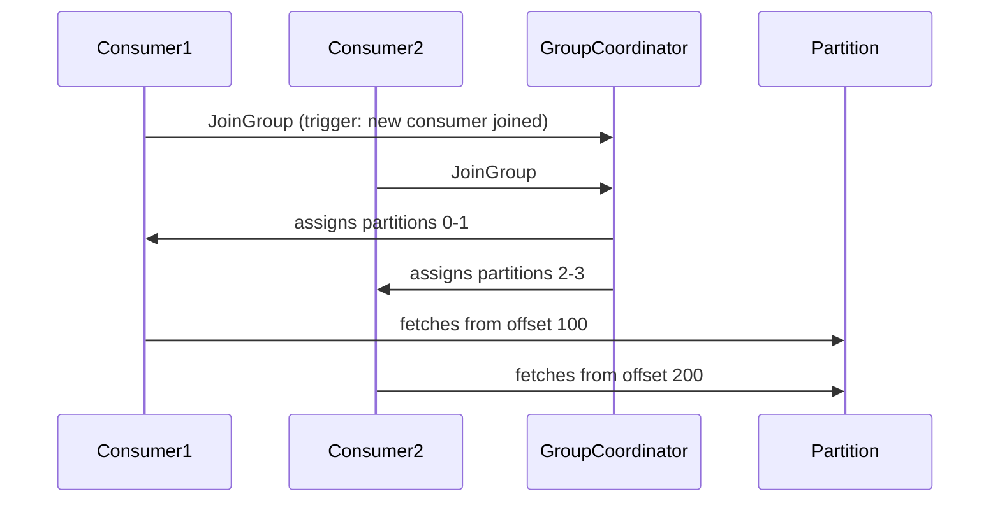
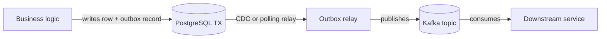
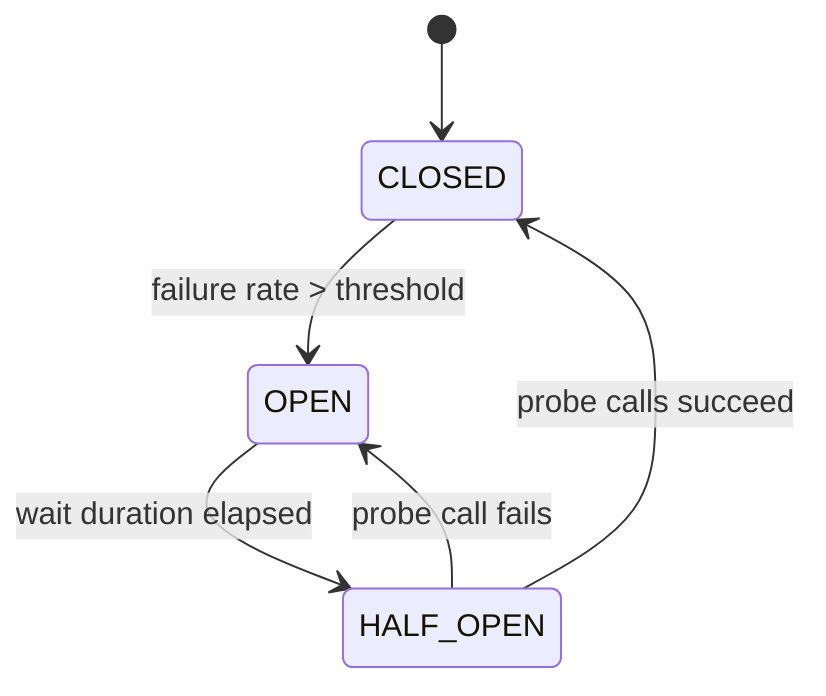

# 15 — JBI Pillars P04–P05: APIs, Messaging, Microservices (DEEP)

---

## §0 — Front-matter

```yaml
status: NOT_STARTED
wave: B
depends_on:
  - "11-jbi-pillar-quality-audit.md"
  - "12-jbi-java-language-and-core.md"
  - "13-jbi-spring-ecosystem.md"
produces:
  - "content/java-backend-intermediate/rest-api/complete-qa.json"
  - "content/java-backend-intermediate/graphql/complete-qa.json"
  - "content/java-backend-intermediate/grpc/complete-qa.json"
  - "content/java-backend-intermediate/messaging-events/complete-qa.json"
  - "content/java-backend-intermediate/rabbitmq/complete-qa.json"
  - "content/java-backend-intermediate/microservices/complete-qa.json"
estimated_effort: "50–60 hours (6 modules, 205 total Q)"
pillar_coverage: ["P04", "P05"]
version_pins: "Spring Boot 3.3, Spring Kafka 3.2, Resilience4j 2.2, gRPC Java 1.64, RabbitMQ 3.13, Kafka 3.7"
```

---

## §1 — TL;DR

- **Input:** P04 (REST API, GraphQL, gRPC) and P05 (Kafka, RabbitMQ, microservices)
  modules are thin or missing content; older `_index.json` snapshots may contain
  duplicate pillar labels.
- **Action:** Fix any label dupes; then write 205 Q across 6 modules with real
  code, version-anchored claims, and "Use X when…; use Y when…" opens on every
  comparison.
- **Output:** Every "REST / Kafka / microservices / saga / circuit breaker"
  high-CTR query has a canonical answer; P04+P05 speakable lint ≥ 90 %.

---

## §2 — Why this matters

APIs (P04) and microservices/messaging (P05) are the **most-asked
"how do you build production systems" questions** at the mid-to-senior
level. REST design (versioning, idempotency, pagination), Kafka / RabbitMQ
patterns, and microservices decomposition (saga, outbox, circuit breaker)
are required content at every Spring shop. Combined P04+P05 queries clear
~150k monthly searches globally — the second-largest bucket after language
fundamentals.

These two pillars feed system-design (P06) and DevOps (P09) directly, so
depth here multiplies the value of higher pillars. The content gap is real:
most online resources cover REST basics and stop; Kafka producer guarantees
(acks, idempotent producer, EOS) and the outbox pattern are barely covered
anywhere at interview depth. Owning those queries is a durable SEO wedge.

---

## §3 — Easy-language glossary

| Term | Plain-English definition |
|------|--------------------------|
| REST | Representational State Transfer — an architectural style for APIs that uses HTTP verbs and URLs to act on resources |
| HTTP verb | The action in an HTTP request: GET (read), POST (create), PUT (replace), PATCH (partial update), DELETE (remove) |
| Idempotency | A request is idempotent if repeating it produces the same result as running it once — PUT and DELETE are idempotent; POST is not |
| Safety | A request is safe if it doesn't modify server state — GET and HEAD are safe |
| Idempotency-Key | An HTTP request header (a UUID) the client sends so the server can detect and discard retries |
| RFC 7807 | The IETF standard for machine-readable HTTP error responses — defines the `Problem+JSON` format (`type`, `title`, `status`, `detail`) |
| Rate limiting | The server enforcing a max number of requests per time window per client |
| Token bucket | A rate-limiting algorithm that accumulates tokens at a fixed rate; each request consumes one token; burst capacity is the bucket size |
| Cursor pagination | Returning a `nextCursor` opaque token instead of a page number so pagination doesn't miss or duplicate rows when data is inserted between pages |
| HATEOAS | Hypermedia As The Engine Of Application State — REST level 3; the server embeds links in responses so clients discover next actions without hardcoded URLs |
| Richardson Maturity Model | A 4-level scale (0–3) for REST: 0=single URI/POST, 1=resources, 2=HTTP verbs, 3=HATEOAS |
| GraphQL | A query language for APIs where the client specifies exactly which fields it wants, avoiding over-fetching |
| N+1 problem | Fetching a list of N items and then making N separate queries to fetch a related field on each — DataLoader batches these into 1 query |
| DataLoader | A batching utility (originally from Facebook) that coalesces individual field resolutions into a single batch query |
| gRPC | Google Remote Procedure Call — a high-performance RPC framework using HTTP/2 and Protocol Buffers |
| Protocol Buffers (protobuf) | Google's binary serialisation format — smaller and faster than JSON; schema is defined in `.proto` files |
| Kafka | Apache Kafka — a distributed event streaming platform used for high-throughput, fault-tolerant messaging |
| Partition | A Kafka topic is split into partitions; each partition is an ordered, append-only log; parallelism scales with partition count |
| Consumer group | A set of Kafka consumers that jointly consume a topic; each partition is consumed by exactly one member |
| Offset | The position of a message within a Kafka partition; consumers commit their offset to mark progress |
| Exactly-once semantics (EOS) | Kafka's guarantee (enabled via idempotent producer + transactions) that a message is delivered and processed exactly once, not duplicated |
| Outbox pattern | Writing a domain event to an `outbox` table in the same DB transaction as the business data, then a separate relay publishes it to Kafka — prevents dual-write inconsistency |
| Dead-letter topic (DLT) | A Kafka topic that receives messages a consumer failed to process after the max retry count |
| RabbitMQ exchange | The routing component in RabbitMQ: direct (exact key), topic (wildcard key), fanout (broadcast), headers (attribute match) |
| Quorum queue | A RabbitMQ queue type backed by Raft consensus — durability is guaranteed even if a minority of nodes fail; replaces classic mirrored queues |
| Microservices | An architecture where an application is decomposed into small, independently deployable services each owning its data |
| Bounded context | A DDD concept: a logical boundary within which a model (and its terms) applies consistently |
| Circuit breaker | A resilience pattern (Resilience4j): when failure rate exceeds a threshold, the breaker opens and fast-fails calls, preventing cascade failure |
| Bulkhead | A resilience pattern: isolating parts of the system (e.g., separate thread pools) so one overloaded dependency doesn't exhaust shared resources |
| Saga pattern | A distributed transaction approach: a sequence of local transactions coordinated by events (choreography) or a central orchestrator |
| Service mesh | Infrastructure layer (Istio, Linkerd) that handles service-to-service communication — mTLS, retries, tracing — without modifying application code |
| OpenTelemetry | A vendor-neutral observability framework for distributed tracing, metrics, and logs; the Java SDK integrates with Spring Boot 3 auto-instrumentation |

---

## §4 — Hard prerequisites

- [ ] Playbook 11 is DONE.
  ```bash
  rg "status: DONE" expansion-plan/11-jbi-pillar-quality-audit.md
  # expected: 1 match
  ```
- [ ] P04 and P05 modules present in `_index.json` with no duplicate pillar labels:
  ```bash
  jq -r '.modules[] | select(.contentSource | not) | "\(.moduleSlug)\t\(.pillar)"' \
    content/java-backend-intermediate/_index.json | sort | uniq -c -f1 | awk '$1>1'
  # expected: empty output
  ```
- [ ] Spring Boot 3.3 baseline established (from playbook 13).
- [ ] Resilience4j 2.2 in `pom.xml`:
  ```bash
  rg 'resilience4j' backend/pom.xml
  # expected: at least 1 match
  ```

---

## §5 — Current state

- `rest-api` module exists but covers only HTTP methods and basic status codes
  (~15 Q); advanced topics (idempotency, pagination strategy, versioning) are absent.
- `graphql` module may be a scaffold with no Q content.
- `grpc` module may be absent entirely — not present in `_index.json` scan.
- `messaging-events` has ~10 Kafka basics Q but producer guarantees and EOS are
  missing.
- `rabbitmq` module exists (~8 Q) but exchange types are surface-level.
- `microservices` module has ~12 Q; circuit breaker is named but not deep-dived;
  saga pattern is absent.
- Older `_index.json` may have duplicate pillar tags from a copy-paste error —
  run the dedupe step in §4 before writing new Q.

---

## §6 — Target state (measurable)

| Metric | Threshold | Verify |
|--------|-----------|--------|
| `rest-api` Q count | ≥ 45 | `find content/java-backend-intermediate/rest-api -name complete-qa.json \| xargs jq '[.questions\|length] \| add'` |
| `graphql` Q count | ≥ 30 | same pattern |
| `grpc` Q count | ≥ 25 | same pattern |
| `messaging-events` Q count | ≥ 35 | same pattern |
| `rabbitmq` Q count | ≥ 25 | same pattern |
| `microservices` Q count | ≥ 45 | same pattern |
| P04 speakable lint pass+warn | ≥ 90 % | `python3 scripts/audit_speakable.py --pillar P04 --report` |
| P05 speakable lint pass+warn | ≥ 90 % | `python3 scripts/audit_speakable.py --pillar P05 --report` |
| All money comparisons live | 27 of 27 | manual grep per module |
| Zero Hystrix references | 0 | `rg -n 'Hystrix' content/java-backend-intermediate/` |

---

## §7 — Search phrases → URL map

| Search phrase | SEO slug | Owner module |
|---------------|----------|--------------|
| `rest api interview questions` | `/java/rest-api/interview-questions` | rest-api |
| `rest vs soap interview questions` | `/java/rest-api/rest-vs-soap` | rest-api |
| `http methods interview questions java` | `/java/rest-api/http-methods-and-status` | rest-api |
| `rest api versioning interview` | `/java/rest-api/versioning-strategies` | rest-api |
| `put vs patch difference` | `/java/rest-api/put-vs-patch` | rest-api |
| `graphql interview questions` | `/java/graphql/interview-questions` | graphql |
| `graphql vs rest interview` | `/java/graphql/graphql-vs-rest` | graphql |
| `n plus 1 problem graphql` | `/java/graphql/n-plus-1-dataloader` | graphql |
| `grpc interview questions java` | `/java/grpc/interview-questions` | grpc |
| `grpc vs rest vs graphql` | `/java/grpc/grpc-vs-rest-vs-graphql` | grpc |
| `kafka interview questions` | `/java/kafka/interview-questions` | messaging-events |
| `kafka producer acks interview` | `/java/kafka/producer-guarantees` | messaging-events |
| `kafka exactly once semantics` | `/java/kafka/exactly-once-semantics` | messaging-events |
| `outbox pattern interview` | `/java/kafka/outbox-pattern` | messaging-events |
| `kafka vs rabbitmq interview` | `/java/kafka/kafka-vs-rabbitmq` | messaging-events |
| `rabbitmq interview questions` | `/java/rabbitmq/interview-questions` | rabbitmq |
| `rabbitmq exchange types interview` | `/java/rabbitmq/exchange-types` | rabbitmq |
| `microservices interview questions` | `/java/microservices/interview-questions` | microservices |
| `microservices vs monolith interview` | `/java/microservices/microservices-vs-monolith` | microservices |
| `saga pattern interview questions` | `/java/microservices/saga-pattern` | microservices |
| `circuit breaker pattern java` | `/java/microservices/circuit-breaker-resilience4j` | microservices |
| `service mesh interview questions` | `/java/microservices/service-mesh-istio` | microservices |
| `api gateway vs bff pattern` | `/java/microservices/api-gateway-vs-bff` | microservices |

---

## §8 — Dependency context

**Upstream (must exist):**
- Playbook 11 (pillar quality audit) — baseline Q counts used to measure delta.
- Playbook 13 (Spring ecosystem) — Spring Boot, Spring Security OAuth2 context;
  `spring-boot-core` module cross-linked from REST questions.

**Downstream (depends on this playbook being DONE):**
- Playbook 16 (System Design) — circuit breaker, saga, outbox patterns referenced.
- Playbook 17 (DevOps/Cloud) — API Gateway on AWS/GCP cross-links to P04.
- Playbook 44 (System Design hub) — aggregates microservices content.
- Playbook 49 (Go/Ruby/JS language tracks) — REST and Kafka Q from P04/P05 are
  the cross-language comparison surface.

---

## §9 — Step-by-step

### Step 1 — Fix duplicate pillar labels

```bash
cd /Users/ravi.r_flx/IEProject/InterviewExplainer
# Find and fix duplicate module entries in _index.json
jq -r '.modules[] | "\(.moduleSlug)\t\(.pillar)"' \
  content/java-backend-intermediate/_index.json | sort | uniq -d
```

**Verify:** Output is empty. If not, open `_index.json`, remove the duplicate
entry, commit: `fix(jbi): dedupe P04/P05 pillar entries`.

---

### Step 2 — Scaffold missing modules

```bash
cd /Users/ravi.r_flx/IEProject/InterviewExplainer
for MOD in rest-api graphql grpc messaging-events rabbitmq microservices; do
  DIR="content/java-backend-intermediate/$MOD"
  mkdir -p "$DIR"
  [ -f "$DIR/complete-qa.json" ] || echo '{"module":"'"$MOD"'","questions":[]}' > "$DIR/complete-qa.json"
done
```

**Verify:** All 6 directories exist.
```bash
ls content/java-backend-intermediate/ | grep -E 'rest-api|graphql|grpc|messaging-events|rabbitmq|microservices'
# expected: 6 lines
```

---

### Step 3 — Write `rest-api` module (target 45 Q)

Open `content/java-backend-intermediate/rest-api/complete-qa.json`. Write Q
per the topic table (§§15.1 in the original stub). Each comparison Q MUST open
`direct_answer` with "Use X when…; use Y when…". Key anchors:
- `idempotency-key-header` — name the RFC (RFC 7231 §4.2.2 defines idempotent),
  name the Stripe header (`Idempotency-Key`).
- `cursor-pagination-vs-offset` — name the bug: "The classic bug is using
  OFFSET-based pagination on a live feed — items inserted between pages cause
  rows to be skipped or duplicated on the next page."
- `rate-limiting-token-bucket` — name real implementations: Resilience4j
  `RateLimiter`, Bucket4j, Redis + Lua script.

```bash
# Validate after writing
python3 scripts/validate_qa.py content/java-backend-intermediate/rest-api/complete-qa.json
# expected: exit 0
```

**Verify Q count:**
```bash
jq '.questions|length' content/java-backend-intermediate/rest-api/complete-qa.json
# expected: ≥ 45
```

---

### Step 4 — Write `graphql` module (target 30 Q)

Key content: N+1 problem + DataLoader pattern, federation (Apollo Federation 2
vs DGS from Netflix), query depth/complexity limits (graphql-java's
`MaxQueryDepthInstrumentation`), persisted queries.

The classic bug: "The classic bug in GraphQL APIs is enabling introspection in
production — any user can query the full schema and map your entire data model.
Disable introspection in production via `GraphQL.Builder.introspection(false)`."

```bash
python3 scripts/validate_qa.py content/java-backend-intermediate/graphql/complete-qa.json
jq '.questions|length' content/java-backend-intermediate/graphql/complete-qa.json
# expected: ≥ 30
```

---

### Step 5 — Write `grpc` module (target 25 Q)

Key content: proto3 syntax, all 4 streaming modes (unary, server-stream,
client-stream, bidirectional), deadlines vs timeouts, status codes (16 gRPC
status codes vs HTTP status codes), interceptors for auth and logging,
mTLS setup.

The #1 trap: "The #1 trap in gRPC is using timeouts instead of deadlines.
A timeout resets on each hop; a deadline (`context.WithDeadline`) propagates
across the full call chain and automatically cancels downstream calls when
the budget expires."

Version anchor: gRPC Java 1.64 (2024), protobuf 3.25.

```bash
python3 scripts/validate_qa.py content/java-backend-intermediate/grpc/complete-qa.json
jq '.questions|length' content/java-backend-intermediate/grpc/complete-qa.json
# expected: ≥ 25
```

---

### Step 6 — Write `messaging-events` module (target 35 Q — Kafka deep dive)

Key content: partition key selection, consumer group rebalance triggers and
protocols (eager vs cooperative), producer acks=0/1/all trade-offs, idempotent
producer (enable.idempotence=true), Kafka transactions and EOS (exactly-once
semantics), outbox pattern + CDC (Debezium), DLT topology (Spring Kafka
`@RetryableTopic`), poison-pill handling.

The classic bug: "The classic bug is setting `acks=1` on a Kafka producer
that must guarantee no message loss. With `acks=1`, the leader acknowledges
before followers replicate — if the leader crashes, the message is lost.
Use `acks=all` + `min.insync.replicas=2` for durability."

Version anchor: Kafka 3.7 (2024), Spring Kafka 3.2.

```bash
python3 scripts/validate_qa.py content/java-backend-intermediate/messaging-events/complete-qa.json
jq '.questions|length' content/java-backend-intermediate/messaging-events/complete-qa.json
# expected: ≥ 35
```

---

### Step 7 — Write `rabbitmq` module (target 25 Q)

Key content: exchange types (direct/topic/fanout/headers — "Use direct when
you know the exact routing key; use topic when you need wildcard routing"),
quorum queues vs classic queues (quorum = Raft consensus; "Use quorum queues
for new deployments — classic mirrored queues are deprecated in RabbitMQ 3.13"),
TTL-based retry with DLX, prefetch count tuning.

The classic bug: "The classic bug is using `basicAck` without `false` (multiple
flag) and accidentally acknowledging all unprocessed messages on the channel.
Always pass `false` for the multiple parameter unless you intentionally want
to bulk-ack."

Version anchor: RabbitMQ 3.13 (2024).

```bash
python3 scripts/validate_qa.py content/java-backend-intermediate/rabbitmq/complete-qa.json
jq '.questions|length' content/java-backend-intermediate/rabbitmq/complete-qa.json
# expected: ≥ 25
```

---

### Step 8 — Write `microservices` module (target 45 Q)

Key content: bounded context decomposition (DDD), monolith-first vs
microservices-first, circuit breaker with Resilience4j 2.2 (`@CircuitBreaker`
annotation), bulkhead with `@Bulkhead`, retry with `@Retry`, saga patterns
(choreography via Kafka events vs orchestration via an orchestrator service),
compensation transactions, outbox in sagas, service discovery (Spring Cloud
Eureka vs Consul), API gateway (Spring Cloud Gateway) vs BFF pattern,
distributed tracing (OpenTelemetry with Spring Boot 3 auto-instrumentation).

The classic bug: "The classic bug in microservices is calling downstream
services synchronously in a chain of 5+ services — one slow dependency
makes all callers wait. Use async messaging (Kafka events) for non-blocking
flows; use Resilience4j `@Bulkhead` to cap concurrent threads to slow services."

Version anchor: Spring Cloud 2023.0 (Kilburn), Resilience4j 2.2, Istio 1.22.

```bash
python3 scripts/validate_qa.py content/java-backend-intermediate/microservices/complete-qa.json
jq '.questions|length' content/java-backend-intermediate/microservices/complete-qa.json
# expected: ≥ 45
```

---

### Step 9 — Run speakable lint across P04 and P05

```bash
cd /Users/ravi.r_flx/IEProject/InterviewExplainer
python3 scripts/audit_speakable.py --pillar P04 --report
python3 scripts/audit_speakable.py --pillar P05 --report
```

**Verify:** Both print `pass+warn ≥ 90 %`. For any Q below threshold, open
the JSON, expand the `speakable_answer` field to ≤ 320 chars of spoken prose
(no tables, no code fences, no bullet points).

---

### Step 10 — Verify no Hystrix references

```bash
cd /Users/ravi.r_flx/IEProject/InterviewExplainer
rg -n 'Hystrix' content/java-backend-intermediate/
```

**Verify:** Zero matches. Hystrix is in maintenance mode; all examples use
Resilience4j 2.2.

---

### Step 11 — Verify cross-links from microservices → system-design-cases

```bash
rg -c 'system-design-cases' content/java-backend-intermediate/microservices/
```

**Verify:** ≥ 3 matches (circuit breaker, saga, and at least one more cross-link).

---

### Step 12 — Commit per module

```bash
cd /Users/ravi.r_flx/IEProject/InterviewExplainer
git add content/java-backend-intermediate/rest-api/
git commit -m "content(jbi/rest-api): +45 Q — HTTP methods, versioning, idempotency, pagination"

git add content/java-backend-intermediate/graphql/
git commit -m "content(jbi/graphql): +30 Q — schema, DataLoader N+1, federation, security"

git add content/java-backend-intermediate/grpc/
git commit -m "content(jbi/grpc): +25 Q — proto3, streaming modes, deadlines, mTLS"

git add content/java-backend-intermediate/messaging-events/
git commit -m "content(jbi/messaging-events): +35 Q — Kafka producer guarantees, EOS, outbox, DLT"

git add content/java-backend-intermediate/rabbitmq/
git commit -m "content(jbi/rabbitmq): +25 Q — exchange types, quorum queues, DLX retries"

git add content/java-backend-intermediate/microservices/
git commit -m "content(jbi/microservices): +45 Q — circuit breaker, saga, outbox, service mesh"

git add expansion-plan/00-INDEX.md
git commit -m "docs(expansion-plan): mark 15-jbi-apis-messaging-microservices DONE"
```

---

## §10 — Reference Q in archetype JSON

Full worked example for `kafka-consumer-at-least-once-vs-exactly-once`:

```json
{
  "id": "kafka-consumer-at-least-once-vs-exactly-once",
  "slug": "kafka-consumer-at-least-once-vs-exactly-once",
  "question": "What is the difference between at-least-once and exactly-once delivery in Kafka? When would you use each?",
  "title": "Kafka at-least-once vs exactly-once delivery semantics",
  "direct_answer": "Use at-least-once delivery when your consumer is idempotent (safe to re-process a message); use exactly-once (EOS) when re-processing causes side effects like double-charging a payment or double-inserting a row. At-least-once is the Kafka default — if the consumer crashes before committing its offset, the broker re-delivers the message. EOS requires enabling `enable.idempotence=true` on the producer and wrapping the consume-transform-produce loop in a Kafka transaction (`KafkaTransactions`), which adds latency and complexity.",
  "layout_type": "comparison",
  "difficulty": "hard",
  "importance": 5,
  "reading_time_minutes": 6,
  "last_updated": "2025-01-15",
  "interviewer_intent": {
    "testing": "Whether the candidate understands delivery guarantees end-to-end — not just producer acks but also consumer commit timing and idempotency.",
    "common_mistake": "Saying 'use transactions for everything' — most workloads are naturally idempotent and EOS adds overhead for no benefit.",
    "to_stand_out": "Mention idempotent consumers as an alternative to EOS: `upsert` instead of `insert`, or deduplication via an idempotency key in the target DB."
  },
  "company_tags": ["Stripe", "Uber", "LinkedIn", "Confluent", "Netflix", "Airbnb"],
  "answer": {
    "sections": [
      {
        "kind": "overview",
        "value": "Kafka's delivery semantics describe what happens when failures occur during message processing. The three levels are at-most-once (messages may be lost, never duplicated), at-least-once (messages are never lost, but may be duplicated), and exactly-once (messages are never lost or duplicated). At-least-once is the Kafka default for most consumer configurations. Exactly-once requires Kafka transactions (Kafka 0.11+, 2017) and adds meaningful overhead."
      },
      {
        "kind": "comparison_table",
        "headers": ["Dimension", "At-least-once", "Exactly-once (EOS)"],
        "rows": [
          ["Consumer re-processing risk", "Yes — offset committed after processing", "No — transaction spans consume + produce"],
          ["Kafka config required", "Default (`enable.auto.commit=false`, manual commit)", "`enable.idempotence=true`, `transactional.id` set, `isolation.level=read_committed`"],
          ["Throughput impact", "Baseline", "5–20% lower (transaction log overhead)"],
          ["Complexity", "Low", "High — requires idempotent consumer logic anyway"],
          ["Real-world use", "Kafka→Elasticsearch, cache warming, notifications", "Payment ledger, inventory deduction, financial aggregations"]
        ]
      },
      {
        "kind": "step",
        "label": "The classic bug",
        "value": "The classic bug is enabling `enable.auto.commit=true` (the Kafka default) and believing you have at-least-once delivery. Auto-commit fires every 5 seconds regardless of processing status — if the consumer crashes after auto-commit but before fully processing, the offset advances and messages are silently lost. Turn off auto-commit: `enable.auto.commit=false`."
      },
      {
        "kind": "tradeoffs",
        "value": "EOS in Kafka does not give you exactly-once delivery to external systems like a PostgreSQL database. A Kafka transaction ensures the producer's output message and the consumer's offset commit are atomic within Kafka — but the side effect of writing to the DB happens outside that transaction. To get exactly-once to a database, use the outbox pattern: write the DB row and an `outbox` record in one DB transaction, then relay the outbox entry to Kafka separately."
      },
      {
        "kind": "key_points",
        "value": [
          "At-least-once = disable auto-commit, process, then manually commit offset.",
          "EOS = idempotent producer + Kafka transactions + `isolation.level=read_committed` on consumers.",
          "Most applications need idempotent consumers anyway — design for at-least-once and make the consumer idempotent rather than paying the EOS overhead.",
          "Spring Kafka 3.2 `@RetryableTopic` provides at-least-once retry with DLT, covering 95% of use cases without EOS."
        ]
      },
      {
        "kind": "speakable_answer",
        "value": "Use at-least-once when your consumer is idempotent — it's the default and requires no extra config. Use exactly-once only when re-processing causes real side effects like double payments. EOS needs idempotent producer plus Kafka transactions, which adds latency."
      }
    ]
  },
  "followup_questions": [
    "How does `enable.auto.commit=true` cause silent message loss?",
    "What is the outbox pattern and how does it complement Kafka EOS?",
    "How does Spring Kafka's `@RetryableTopic` handle failures?",
    "What is a Kafka transaction and what does it guarantee?",
    "How would you design an idempotent Kafka consumer for a payment processor?"
  ],
  "seo": {
    "metaTitle": "Kafka At-Least-Once vs Exactly-Once Delivery | Java Interview Questions",
    "metaDescription": "Learn the difference between at-least-once and exactly-once Kafka delivery semantics, when to use each, and the classic auto-commit bug Java developers encounter."
  },
  "order": 1
}
```

---

## §11 — Diagram catalogue

**Diagram 1: Kafka consumer group rebalance**


**Diagram 2: Outbox pattern flow**


**Diagram 3: Circuit breaker state machine**


---

## §12 — Voice rules

> This section quotes `_VOICE-RULES.md` §1–§4 in full, then adds
> P04/P05-specific examples.

### Define before use
Every domain term used in §9–§14 must already be defined in §3 (above) or
in `_GLOSSARY.md`. The reader never hits a term they have to leave the file
to understand.

### Lead with the trade-off
Comparison questions open with "Use X when…; use Y when…" — then explain X
and Y.

- ✅ "Use Kafka when you need durable, replayable, high-throughput event
  streaming at scale. Use RabbitMQ when you need flexible per-message routing
  (exchange types), priority queues, or a simpler broker with lower ops burden."
- ❌ "Kafka is a distributed log. RabbitMQ is a traditional message broker."

- ✅ "Use choreography-based saga when you want services to stay loosely coupled
  and you can tolerate eventual consistency. Use orchestration when you need
  explicit compensation logic and visibility into saga state."
- ❌ "Choreography uses events. Orchestration uses a central coordinator."

### Name the bug
Every warning step contains: "The classic bug is…" / "The #1 trap is…" /
"The most common mistake is…"

- ✅ "The classic bug is using `OFFSET 0, 1000` pagination on a feed that
  receives new rows while users are browsing — page 2 will skip or repeat
  rows. Use cursor pagination for any live, write-heavy feed."
- ❌ "Offset pagination can have issues with live data."

### Real anchors
Every section names at least one real system, library, RFC, or version.

- ✅ "Resilience4j 2.2's `@CircuitBreaker` uses a sliding-window approach
  (count-based or time-based) and integrates with Spring Boot 3 via
  `spring-cloud-starter-circuitbreaker-resilience4j`."
- ❌ "Use a circuit breaker library to handle failures."

**P04/P05-specific examples:**

- ✅ "Spring for GraphQL (Spring Boot 3.2+) uses `@SchemaMapping` and
  `@QueryMapping` — simpler than the older graphql-java `DataFetcher` API."
- ❌ "Spring supports GraphQL."

- ✅ "Kafka 3.7's consumer group protocol defaults to cooperative rebalancing
  (`partition.assignment.strategy=CooperativeStickyAssignor`), which avoids
  the stop-the-world pause of the older eager protocol."
- ❌ "Kafka has a rebalance mechanism."

---

## §13 — Quality gates

| Gate | Threshold | Verify |
|------|-----------|--------|
| `rest-api` Q count | ≥ 45 | `jq '.questions\|length' content/java-backend-intermediate/rest-api/complete-qa.json` |
| `graphql` Q count | ≥ 30 | same pattern |
| `grpc` Q count | ≥ 25 | same pattern |
| `messaging-events` Q count | ≥ 35 | same pattern |
| `rabbitmq` Q count | ≥ 25 | same pattern |
| `microservices` Q count | ≥ 45 | same pattern |
| P04 speakable pass+warn | ≥ 90 % | `python3 scripts/audit_speakable.py --pillar P04 --report` |
| P05 speakable pass+warn | ≥ 90 % | `python3 scripts/audit_speakable.py --pillar P05 --report` |
| Zero Hystrix references | 0 | `rg -n 'Hystrix' content/java-backend-intermediate/` |
| All comparison Q lead with "Use X when" | 100 % | `rg -c '"Use .* when' content/java-backend-intermediate/{rest-api,graphql,grpc,messaging-events,rabbitmq,microservices}/complete-qa.json` |
| All money comparisons live | 27 of 27 | manual cross-check against §15.1–§15.6 lists |
| `microservices` cross-links to `system-design-cases` | ≥ 3 | `rg -c 'system-design-cases' content/java-backend-intermediate/microservices/` |

---

## §14 — Anti-patterns

### Anti-pattern 1: Hystrix in new code
The most common mistake is copying old Spring Cloud examples that use Hystrix.
Hystrix entered maintenance mode in 2018 and is removed from Spring Cloud 2022+.
**Always use Resilience4j 2.2.**

### Anti-pattern 2: Auto-commit in Kafka consumers
The classic bug is leaving `enable.auto.commit=true` (Kafka's default) and
assuming at-least-once delivery. Auto-commit runs on a timer — if the consumer
crashes between auto-commit and processing completion, messages are silently
lost. Set `enable.auto.commit=false` in every production consumer.

### Anti-pattern 3: Offset pagination on live feeds
The classic bug is using `SELECT * FROM orders LIMIT 20 OFFSET 100` on a table
that receives inserts while users are paginating. If 3 rows are inserted before
the user requests page 6, the offset shifts and page 6 silently skips those 3
rows. Use cursor pagination (`WHERE id > :lastSeenId LIMIT 20`) for any feed
that changes between requests.

### Anti-pattern 4: Dual write to DB and Kafka
The #1 trap in event-driven architectures is writing to the database and
publishing to Kafka in the same try block without a transaction. If the DB
write succeeds but the Kafka publish fails (broker timeout, network partition),
the systems diverge. Use the outbox pattern: write both the business row and
the outbox record in the same DB transaction, then relay the outbox entry to
Kafka separately.

### Anti-pattern 5: Missing circuit breaker on synchronous microservice calls
The most common mistake in microservices is making synchronous HTTP calls to
downstream services without a circuit breaker. When the downstream service
slows (GC pause, DB lock), the calling service's thread pool fills with waiting
requests and the entire call chain stalls. Add `@CircuitBreaker` from
Resilience4j to every synchronous downstream call.

---

## §15 — Failure modes

**Failure 1: Module Q count short at hard stop**
If a module doesn't reach its target by the wall-time limit:
1. Commit what exists with `content(jbi/<module>): partial +N Q — <topics covered>`.
2. Record the gap in `content/_audits/p04-p05-gap-<DATE>.md`.
3. Surface to user: "rest-api reached 38/45 Q; topics X and Y are thin."
4. Continue with the next module; do not hold other modules hostage to one slow one.

**Failure 2: Speakable lint below 90 %**
If `audit_speakable.py` reports < 90 % pass+warn:
1. Run with `--verbose` to get the failing Q IDs.
2. For each failing Q: open the JSON, find the `speakable_answer` field, rewrite
   as ≤ 320 chars of spoken prose — no tables, no code fences, no bullet points.
3. Re-run lint to confirm threshold met.
4. The classic failure: `speakable_answer` that starts with a code snippet
   or a comparison table rather than a spoken sentence.

**Failure 3: Kafka examples use deprecated APIs**
If generated Kafka consumer code uses `ConsumerRecord` with the old `poll(long)`
method (deprecated since Kafka 2.0): replace with `poll(Duration.ofMillis(100))`.
If Spring Kafka examples use `@KafkaListener` with the old class-level
`@SendTo` syntax: update to Spring Kafka 3.2 `@RetryableTopic`.

---

## §16 — Definition of Done

- [ ] `rest-api` module: ≥ 45 Q, all 10 money comparisons live.
- [ ] `graphql` module: ≥ 30 Q, N+1/DataLoader Q live, federation Q live.
- [ ] `grpc` module: ≥ 25 Q, all 4 streaming modes covered.
- [ ] `messaging-events` module: ≥ 35 Q, EOS Q live, outbox pattern Q live.
- [ ] `rabbitmq` module: ≥ 25 Q, quorum queue Q live, DLX retry Q live.
- [ ] `microservices` module: ≥ 45 Q, saga Q live, circuit breaker Q live.
- [ ] Zero Hystrix references: `rg 'Hystrix' content/java-backend-intermediate/` → 0.
- [ ] P04 speakable lint ≥ 90 %: `python3 scripts/audit_speakable.py --pillar P04`.
- [ ] P05 speakable lint ≥ 90 %: `python3 scripts/audit_speakable.py --pillar P05`.
- [ ] All comparison Q start with "Use X when…; use Y when…".
- [ ] `microservices` module has ≥ 3 cross-links to `system-design-cases`.
- [ ] `npm run build` exits 0 after module registration.
- [ ] `00-INDEX.md` row for `15` flipped to `DONE`.

---

## §17 — Estimated effort

- **Ideal:** 50 hours across 4 sessions:
  - Session 1 (12 h): `rest-api` + `graphql` (75 Q total).
  - Session 2 (14 h): `grpc` + `messaging-events` (60 Q total).
  - Session 3 (12 h): `rabbitmq` + `microservices` scaffolding (30 Q).
  - Session 4 (12 h): `microservices` completion (45 Q) + lint + commits.
- **Hard stop:** 60 hours. If exceeded, commit what exists and surface gap to user.
- **Recommended rhythm:** Commit after every ~10 Q. Speakable lint after each module.

---

## §18 — Appendix

### 18.1 — Cross-references

- [`expansion-plan/00-INDEX.md`](00-INDEX.md) — wave + status table.
- [`expansion-plan/_TEMPLATE-1000.md`](_TEMPLATE-1000.md) — 18-section skeleton.
- [`expansion-plan/_GLOSSARY.md`](_GLOSSARY.md) — global glossary this §3 extends.
- [`expansion-plan/_VOICE-RULES.md`](_VOICE-RULES.md) — voice + banned words.
- [`scripts/lint_playbook.py`](../scripts/lint_playbook.py) — playbook lint.
- [`scripts/audit_speakable.py`](../scripts/audit_speakable.py) — speakable lint.
- [`content/java-backend-intermediate/_index.json`](../content/java-backend-intermediate/_index.json) — domain module registry.
- Upstream: playbook 13 (Spring ecosystem) — Spring Boot context for REST and messaging.
- Downstream: playbook 16 (system design), playbook 17 (DevOps/cloud), playbook 44 (system design hub).

### 18.2 — Commits produced by this playbook

- `fix(jbi): dedupe P04/P05 pillar entries` — Step 1
- `feat(jbi/rest-api): scaffold missing module dirs` — Step 2
- `content(jbi/rest-api): +45 Q — HTTP methods, versioning, idempotency, pagination` — Step 3
- `content(jbi/graphql): +30 Q — schema, DataLoader N+1, federation, security` — Step 4
- `content(jbi/grpc): +25 Q — proto3, streaming modes, deadlines, mTLS` — Step 5
- `content(jbi/messaging-events): +35 Q — Kafka producer guarantees, EOS, outbox, DLT` — Step 6
- `content(jbi/rabbitmq): +25 Q — exchange types, quorum queues, DLX retries` — Step 7
- `content(jbi/microservices): +45 Q — circuit breaker, saga, outbox, service mesh` — Step 8
- `docs(expansion-plan): mark 15-jbi-apis-messaging-microservices DONE` — Step 12

### 18.3 — Traceability

- `ROADMAP.md` "Wave B — JBI pillar content" row — this playbook moves the row to DONE.
- Playbook 16 (system design) depends on microservices module being DONE for circuit breaker, saga, and service mesh cross-links.
- Total Q target: 205 across 6 modules. Speakable lint is the critical quality gate.