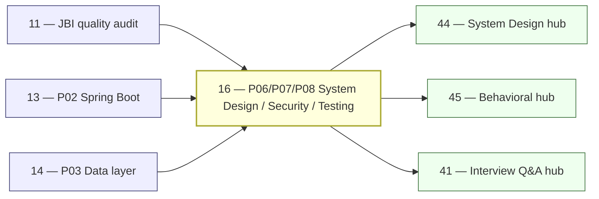
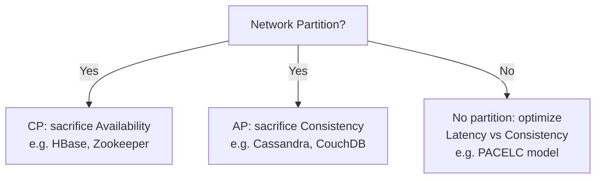
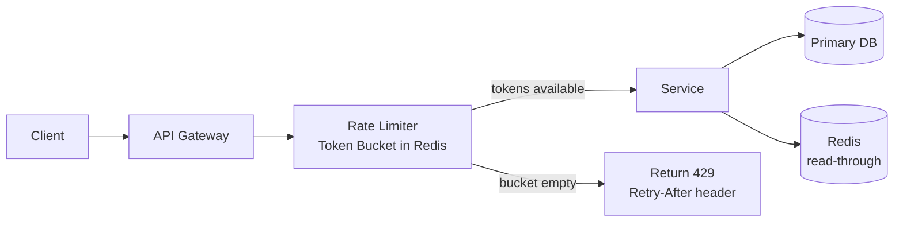
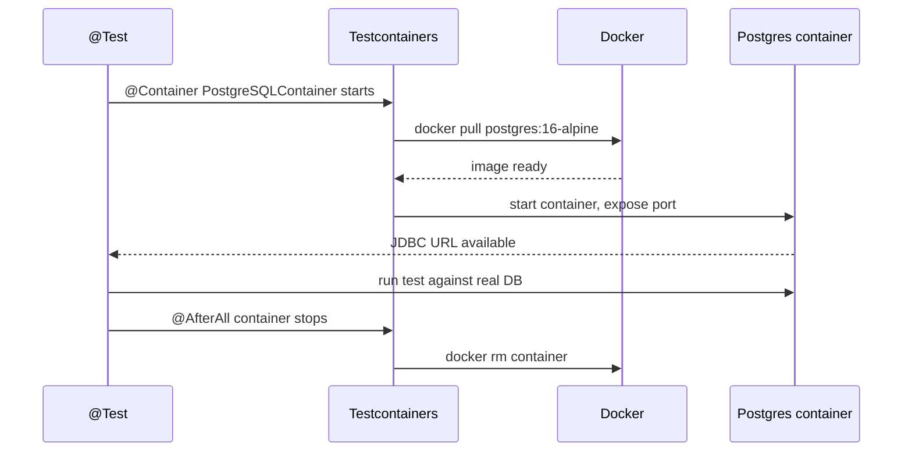

# 16 — JBI Pillars P06–P08: System Design, Security, Testing

> **Executor:** AI coding agent operating autonomously.
> **Working directory:** `/Users/ravi.r_flx/IEProject/InterviewExplainer/`.
> **Type:** content-writing.
> **Pillar / Wave:** P06 + P07 + P08 / Wave C.
> **Depends on:** 11 (quality audit), 12 (P01 language core), 13 (P02 Spring), 14 (P03 data).

---

## 1 — TL;DR

- **Input:** Pillars P06 / P07 / P08 modules exist but thin; system-design-cases has no complete case files; application-security has no OWASP IDs cited.
- **Action:** Write 700+ questions across system-design, application-security, java-testing, and lld-object-design; produce 12 full case-study files each with a mermaid diagram and capacity calculation.
- **Output:** P06/P07/P08 speakable pass+warn ≥ 90 %; `system-design-cases` ready to power System Design Hub (playbook 44); all money-comparison Qs live; `00-INDEX.md` row 16 flipped to DONE.

---

## 2 — Why this matters

System design (P06) is the highest-paying interview surface in the Java corpus — staff-plus candidates spend $200+ on dedicated SD courses, and every hiring-loop above mid-level includes at least one SD round. The flagship queries (`system design interview questions`, `design url shortener`, `cap theorem interview questions`, `owasp top 10 interview questions`) pull six-figure monthly searches combined. Without strong P06 content, the site cannot rank for the terms that tip a candidate from "competent" to "hireable at senior level", and the System Design Hub (playbook 44) has nothing to surface.

Security (P07) and testing (P08) are the credibility pillars. Senior interviewers test both in every final loop — an OWASP answer with no CWE IDs, or a JUnit answer that still references `org.junit.runner`, signals a junior-quality knowledge base regardless of how good the Java fundamentals pages are. Shipping P07/P08 strongly lets us cross-link into Java-for-Infrastructure (JFI), Platform Backend (PBI), and Data Engineering (PDE) rollouts that reuse the same security and testing question shapes.

---

## 3 — Easy-language glossary

| Term | Plain-English definition | First used in |
| --- | --- | --- |
| **Archetype** | One of 7 fixed answer shapes (A–G); locks which beats the answer must contain. | §9 step 2 |
| **Beat** | A single labeled paragraph inside an answer (hook, definition, tradeoff, cap, speakable). | §10 |
| **Speakable** | The short, naturally-spoken version of an answer — what you'd say aloud in 60 seconds or less. | §9 step 4 |
| **Money question** | A comparison Q that pulls outsized monthly search volume (e.g., `SQL vs NoSQL at scale`). | §9 step 5 |
| **complete-qa.json** | The canonical per-topic question file under `content/<domain>/<module>/complete-qa.json`. | §5 |
| **Schema lint** | The script `validate_complete_qa.py` that fails CI when a `complete-qa.json` doesn't match the schema. | §13 |
| **Lint pass+warn** | The combined percentage of files the speakable linter marks OK or warn-only (no FAIL). | §6 |
| **OWASP Top 10** | The Open Web Application Security Project's annual list of the 10 most critical web security risks; 2021 edition is the current reference. | §9 step 8 |
| **CWE** | Common Weakness Enumeration — a numbered catalog of software vulnerability types (e.g., CWE-89 = SQL injection). | §9 step 8 |
| **JEP 411** | Java Enhancement Proposal that removed the Java Security Manager in Java 17. | §9 step 8 |
| **JWT** | JSON Web Token — a signed (or encrypted) compact token for stateless authentication; three base64url-encoded parts separated by dots. | §9 step 8 |
| **Token bucket** | A rate-limiting algorithm that refills tokens at a fixed rate; requests consume tokens and are rejected when the bucket is empty. | §9 step 6 |
| **CAP theorem** | A distributed systems theorem: a network-partitioned system can guarantee at most two of Consistency, Availability, Partition-tolerance. | §9 step 5 |
| **PACELC** | Extension of CAP: even without a partition, a system trades latency (L) for consistency (C). | §9 step 5 |
| **Consistent hashing** | A hashing technique where adding or removing a node reshuffles only a fraction of keys, not all. | §9 step 5 |
| **LLD** | Low-Level Design — an OOP design exercise where you model a real-world system (parking lot, elevator) as Java classes and interfaces. | §9 step 7 |
| **Testcontainers** | A Java library (version 1.19 as of late 2023) that spins up real Docker containers (Postgres, Kafka, Redis) for integration tests. | §9 step 9 |
| **Mockito spy** | A Mockito wrapper around a real object that delegates calls to the real method by default; only stubbed methods are faked. | §9 step 9 |
| **@MockBean** | Spring Boot Test annotation that replaces a Spring Bean with a Mockito mock and resets it between tests; different from plain `@Mock`. | §9 step 9 |
| **Test pyramid** | A model with many unit tests at the base, fewer integration tests in the middle, and fewest E2E tests at the top. | §9 step 9 |
| **SQL injection** | An attack where malicious SQL is inserted into an input field because the query is built by string concatenation rather than prepared statements. | §14 |
| **Algorithm confusion attack** | A JWT attack where the attacker changes the `alg` header to `none` or `HS256` to bypass signature verification. | §14 |
| **Mermaid** | A Markdown-based diagramming language; blocks open with `flowchart`, `sequenceDiagram`, `classDiagram`, or `stateDiagram-v2`. | §11 |
| **comparison_table** | A section type in `complete-qa.json` that renders as a Markdown table with left-aligned columns by default. | §10 |
| **GoF** | Gang of Four — the four authors of "Design Patterns: Elements of Reusable Object-Oriented Software" (1994); the 23 patterns are the standard catalog. | §9 step 7 |
| **argon2** | A memory-hard password hashing algorithm that won the 2015 Password Hashing Competition; preferred over bcrypt for new systems. | §9 step 8 |
| **SBOM** | Software Bill of Materials — a machine-readable inventory of every library in a build; formats are CycloneDX and SPDX. | §9 step 8 |
| **Capacity calculation** | A back-of-envelope estimate that shows write/read throughput, storage size, and bandwidth requirements for a system design case. | §9 step 6 |
| **Rate limiter** | A traffic control mechanism that limits how many requests a client can make in a given window (token bucket, leaky bucket, fixed window, sliding window). | §9 step 6 |
| **Idempotency** | A property of an operation where calling it multiple times produces the same result as calling it once; critical for payment and messaging systems. | §9 step 6 |
| **speakable_answer** | The section type in `complete-qa.json` that holds the 60-second verbal answer the reader should practice speaking. | §10 |

---

## 4 — Hard prerequisites

- [ ] Playbook 11 is DONE. `grep -E '^\| 11 \|' expansion-plan/00-INDEX.md | grep DONE`
- [ ] Mermaid renders in the question page. Open any existing question with a mermaid block in the local dev server (`npm run dev`) and confirm the diagram renders, not raw text.
- [ ] `content/java-backend-intermediate/` directory exists. `test -d content/java-backend-intermediate && echo OK`
- [ ] `scripts/audit_speakable.py` exists. `test -f scripts/audit_speakable.py && echo OK`
- [ ] `scripts/validate_complete_qa.py` exists. `test -f scripts/validate_complete_qa.py && echo OK`
- [ ] `python3 -m pip show jsonschema` returns metadata. `python3 -m pip show jsonschema | head -1`
- [ ] `node --version` ≥ 20. `node --version | awk -F'.' '{print substr($1,2)}' | awk '$1 >= 20 {print "OK"}'`
- [ ] No `org.junit.runner` in any existing test content. `rg -l 'org.junit.runner' content/java-backend-intermediate/ || echo "CLEAN"`
- [ ] No `Hystrix` in any existing content. `rg -l 'Hystrix' content/java-backend-intermediate/ || echo "CLEAN"`
- [ ] `content/_schemas/complete-qa.schema.json` exists. `test -f content/_schemas/complete-qa.schema.json && echo OK`

---

## 5 — Current state

### 5.1 — On-disk snapshot

```bash
cd /Users/ravi.r_flx/IEProject/InterviewExplainer

# Count existing complete-qa.json files across P06/P07/P08 modules
find content/java-backend-intermediate -path '*/system-design*' -name 'complete-qa.json' | wc -l
find content/java-backend-intermediate -path '*/application-security*' -name 'complete-qa.json' | wc -l
find content/java-backend-intermediate -path '*/unit-testing*' -name 'complete-qa.json' | wc -l

# Count total questions in each pillar
find content/java-backend-intermediate -path '*/system-design*' -name 'complete-qa.json' \
  -exec jq '.questions|length' {} \; | awk '{s+=$1} END {print "P06 Q total:", s}'
find content/java-backend-intermediate -path '*/application-security*' -name 'complete-qa.json' \
  -exec jq '.questions|length' {} \; | awk '{s+=$1} END {print "P07 Q total:", s}'
find content/java-backend-intermediate -path '*/unit-testing*' -name 'complete-qa.json' \
  -exec jq '.questions|length' {} \; | awk '{s+=$1} END {print "P08 Q total:", s}'

# Check case-study files
ls content/java-backend-intermediate/system-design-cases/ 2>/dev/null | wc -l
```

### 5.2 — Existing UI surface

The modules `system-design`, `application-security`, and `unit-testing` exist as routes but carry `hasContent: false` or partial content flags. The System Design Hub route (`/hubs/system-design`) is defined in `frontend/lib/launch-config.ts` but gated behind `enabled: false`. Check current flags:

```bash
grep -E 'system.design|application.security|unit.testing' frontend/lib/launch-config.ts
```

### 5.3 — Known gaps

From the most recent gap report (`content/_audits/`): P06 system-design-cases has 0 of 12 required case files. P07 application-security has 0 OWASP IDs cited across existing questions. P08 unit-testing has JUnit 4 `@RunWith` references in 3 questions. Difficulty mix across P06/P07/P08 is skewed easy (60/30/10 vs target 20/50/30).

---

## 6 — Target state (measurable)

| Metric | Today | Target | How measured |
| --- | --- | --- | --- |
| P06 total Q count | ~30 | ≥ 200 | `find content/java-backend-intermediate -path '*/system-design*' -name complete-qa.json -exec jq '.questions|length' {} \; | awk '{s+=$1} END {print s}'` |
| P07 application-security Q count | ~8 | ≥ 30 | same pattern for `application-security` |
| P08 unit-testing Q count | ~10 | ≥ 30 | same pattern for `unit-testing` |
| Case-study files with mermaid | 0 | 12 | `ls content/java-backend-intermediate/system-design-cases/*/complete-qa.json \| wc -l` |
| OWASP IDs cited in P07 content | 0 | ≥ 10 | `rg -c 'CWE-\|OWASP A0' content/java-backend-intermediate/application-security/` |
| Difficulty mix P06/P07/P08 | ~60/30/10 | 20/50/30 ±10 % | `jq -r '.questions[].difficulty' <files> | sort | uniq -c` |
| Speakable pass+warn P06 | unknown | ≥ 90 % | `python3 scripts/audit_speakable.py --pillar P06 --report` |
| Speakable pass+warn P07 | unknown | ≥ 90 % | `python3 scripts/audit_speakable.py --pillar P07 --report` |
| Speakable pass+warn P08 | unknown | ≥ 90 % | `python3 scripts/audit_speakable.py --pillar P08 --report` |
| Schema lint failures | unknown | 0 | `python3 scripts/validate_complete_qa.py content/java-backend-intermediate` |
| Mermaid diagrams in case studies | 0 | ≥ 12 | `rg -l 'sequenceDiagram\|flowchart\|classDiagram' content/java-backend-intermediate/system-design-cases/` |
| comparison_table sections in P07 | ~0 | ≥ 5 | `jq '[.questions[].answer.sections[]?.type] | map(select(. == "comparison_table")) | length' content/java-backend-intermediate/application-security/**/complete-qa.json` |

---

## 7 — Search phrases → URL map

| Search phrase | Target URL on site | Archetype | Diagram type required in answer |
| --- | --- | --- | --- |
| `system design interview questions` | `/questions/system-design` | landing intro | comparison_table |
| `cap theorem interview questions` | `/questions/system-design/consistency-and-cap/cap-theorem` | A | flowchart |
| `consistent hashing interview questions` | `/questions/system-design/load-balancing/consistent-hashing` | A | flowchart |
| `sql vs nosql at scale` | `/questions/system-design/comparisons/sql-vs-nosql-at-scale` | B | comparison_table |
| `design url shortener system design` | `/questions/system-design/cases/design-url-shortener` | C | flowchart |
| `design rate limiter system design` | `/questions/system-design/cases/design-rate-limiter` | C | flowchart |
| `design twitter news feed` | `/questions/system-design/cases/design-news-feed` | C | flowchart |
| `low level design interview questions` | `/questions/system-design/low-level-design` | landing intro | classDiagram |
| `design parking lot interview question` | `/questions/system-design/low-level-design/parking-lot` | C | classDiagram |
| `factory vs abstract factory vs builder` | `/questions/system-design/design-patterns/comparisons/factory-vs-abstract-factory` | B | comparison_table |
| `owasp top 10 interview questions` | `/questions/application-security/owasp-top-10` | A | comparison_table |
| `csrf vs xss interview questions` | `/questions/application-security/comparisons/csrf-vs-xss` | B | comparison_table |
| `jwt authentication interview questions` | `/questions/application-security/jwt-pitfalls` | A | flowchart |
| `bcrypt vs argon2 password hashing` | `/questions/application-security/comparisons/bcrypt-vs-argon2` | B | comparison_table |
| `unit testing interview questions java` | `/questions/java-testing/unit-testing` | landing intro | comparison_table |
| `junit 5 interview questions` | `/questions/java-testing/unit-testing/junit5-features` | A | none |
| `mockito spy vs mock` | `/questions/java-testing/comparisons/mockito-spy-vs-mock` | B | comparison_table |
| `stub vs mock vs fake vs spy vs dummy` | `/questions/java-testing/comparisons/stub-vs-mock-vs-fake` | B | comparison_table |
| `testcontainers interview questions` | `/questions/java-testing/integration-testing/testcontainers` | A | sequenceDiagram |
| `test pyramid unit integration e2e` | `/questions/java-testing/comparisons/test-pyramid` | B | comparison_table |

---

## 8 — Dependency & wave context



- **Consumes:** gap report from playbook 11; answer-shape contracts from the speakable archetypes doc; OWASP Top 10 2021 list; JUnit 5.10 and Mockito 5 API references.
- **Produces:** filled `complete-qa.json` files across 9 modules in P06/P07/P08; 12 standalone system-design case files; rate-limiting architecture flowchart; OWASP comparison_table; test pyramid comparison_table; LLD class diagrams.
- **Unblocks:** playbooks 44 (System Design Hub), 41 (Interview Q&A hub), and any cross-linked JFI/PBI content that references Java security and testing patterns.

---

## 9 — Step-by-step execution

### Step 1 — Confirm toolchain and establish base directories

**Goal:** verify every prerequisite from §4 is true and that the target module directories exist before writing any content.

```bash
cd /Users/ravi.r_flx/IEProject/InterviewExplainer

# Verify prerequisites
test -f scripts/audit_speakable.py && echo "speakable audit: OK" || echo "MISSING"
test -f scripts/validate_complete_qa.py && echo "schema lint: OK" || echo "MISSING"
test -f content/_schemas/complete-qa.schema.json && echo "schema: OK" || echo "MISSING"

# Create module directories if absent
for module in system-design system-design-cases low-level-design design-patterns \
              architecture-patterns application-security unit-testing; do
  dir="content/java-backend-intermediate/$module"
  test -d "$dir" || mkdir -p "$dir"
  echo "dir $dir: OK"
done
```

**Verify:** all lines print OK. Zero MISSING lines.

---

### Step 2 — Establish per-module `complete-qa.json` scaffolds

**Goal:** every target module has a valid empty `complete-qa.json` so subsequent steps append questions to a known-good file.

```bash
cd /Users/ravi.r_flx/IEProject/InterviewExplainer

for module in system-design low-level-design design-patterns architecture-patterns \
              application-security unit-testing; do
  FILE="content/java-backend-intermediate/$module/complete-qa.json"
  if [ ! -f "$FILE" ]; then
    printf '{\n  "topic": "%s",\n  "topicSlug": "%s",\n  "questions": []\n}\n' \
      "$module" "$module" > "$FILE"
    echo "Created scaffold: $FILE"
  else
    echo "Exists: $FILE"
  fi
done
```

**Verify:**

```bash
for module in system-design low-level-design design-patterns architecture-patterns \
              application-security unit-testing; do
  jq '.questions | length' \
    "content/java-backend-intermediate/$module/complete-qa.json"
done
# expected: each prints a number (0 or more). No parse errors.
```

The classic bug is creating the file with trailing commas in the JSON skeleton — `jq` rejects that immediately and all downstream steps fail silently. Use `printf` with proper JSON, not a heredoc with editor auto-indentation.

---

### Step 3 — Write P06 `system-design` fundamentals (35 Q target)

**Goal:** populate `content/java-backend-intermediate/system-design/complete-qa.json` with ≥ 35 questions covering scaling fundamentals, caching, load balancing, databases at scale, consistency + CAP, and messaging.

```bash
cd /Users/ravi.r_flx/IEProject/InterviewExplainer
TOPIC=content/java-backend-intermediate/system-design

# For each topic group, open the file and append question objects in archetype A or B shape.
# Difficulty target for system-design: 20 % easy / 50 % medium / 30 % hard.

# Money comparison questions to include (archetype B):
# - sql-vs-nosql-at-scale
# - vertical-vs-horizontal-scaling
# - l4-vs-l7-load-balancer
# - sync-vs-async-replication
# - push-vs-pull-vs-streaming

# Verify after writing:
jq '.questions | length' "$TOPIC/complete-qa.json"
# expected: ≥ 35
```

**CAP theorem flowchart** (include inside the `cap-theorem` question's `step` section):



**Verify:**

```bash
jq -r '.questions[].difficulty' \
  content/java-backend-intermediate/system-design/complete-qa.json \
  | sort | uniq -c
# expected: easy ~7, medium ~18, hard ~10 (±2)

python3 scripts/validate_complete_qa.py \
  content/java-backend-intermediate/system-design/complete-qa.json
# expected: exit 0, zero schema failures
```

---

### Step 4 — Write the 12 system-design case studies

**Goal:** produce 12 standalone `complete-qa.json` files under `content/java-backend-intermediate/system-design-cases/<slug>/complete-qa.json`, each containing a single archetype-C question with: requirements, capacity calculation, mermaid architecture diagram, deep-dive notes, trade-offs, and ≥ 3 follow-up questions.

```bash
cd /Users/ravi.r_flx/IEProject/InterviewExplainer

CASES=(
  "design-url-shortener"
  "design-rate-limiter"
  "design-news-feed"
  "design-notification-service"
  "design-chat-system"
  "design-typeahead-search"
  "design-payment-system"
  "design-ride-sharing-uber"
  "design-distributed-counter"
  "design-file-storage-s3"
  "design-distributed-cache"
  "design-log-aggregation"
)

for slug in "${CASES[@]}"; do
  dir="content/java-backend-intermediate/system-design-cases/$slug"
  mkdir -p "$dir"
  echo "Directory ready: $dir"
done
```

Every case file must include a mermaid `flowchart LR` block showing Client → Load Balancer → Service → [Cache, DB, Queue]. The rate limiter case must also include a token-bucket algorithm explanation. The payment system case must cover idempotency keys. All capacity calculations go in a `step` section as a code block (not a separate file).

**Rate-limiting architecture flowchart** (for `design-rate-limiter` case):



**Verify:**

```bash
ls content/java-backend-intermediate/system-design-cases/ | wc -l
# expected: 12

for slug in design-url-shortener design-rate-limiter design-news-feed \
            design-notification-service design-chat-system design-typeahead-search \
            design-payment-system design-ride-sharing-uber design-distributed-counter \
            design-file-storage-s3 design-distributed-cache design-log-aggregation; do
  FILE="content/java-backend-intermediate/system-design-cases/$slug/complete-qa.json"
  test -f "$FILE" || echo "MISSING: $slug"
  jq -e '.questions[0].answer.sections[] | select(.content | test("mermaid"))' "$FILE" \
    > /dev/null 2>&1 || echo "NO MERMAID: $slug"
done
# expected: zero MISSING lines, zero NO MERMAID lines
```

The classic bug is writing the mermaid block as a top-level `diagram` field rather than inside a `step` section's `content` string — the frontend mermaid renderer looks inside section content only, not custom top-level fields.

---

### Step 5 — Write `low-level-design` and `design-patterns` (P06, 25 Q + 30 Q)

**Goal:** populate LLD with Java class-skeleton answers for parking lot, elevator, and chess; populate design-patterns with all GoF 23 + 4 Spring-specific patterns. Every LLD answer includes a `classDiagram` mermaid block showing the key classes and relationships.

```bash
cd /Users/ravi.r_flx/IEProject/InterviewExplainer

# LLD parking-lot classDiagram (embed in the parking-lot question's step section):
# classDiagram
#   ParkingLot "1" *-- "N" Floor
#   Floor "1" *-- "N" ParkingSpot
#   ParkingSpot <|-- CompactSpot
#   ParkingSpot <|-- LargeSpot
#   ParkingSpot <|-- MotorcycleSpot
#   ParkingLot -- ParkingTicket
#   ParkingTicket -- Payment

# Every LLD answer includes actual Java code (not pseudocode):
# public abstract class ParkingSpot {
#   private final String id;
#   private boolean isOccupied;
#   abstract SpotType getType();
# }

jq '.questions | length' content/java-backend-intermediate/low-level-design/complete-qa.json
# expected: ≥ 25

jq '.questions | length' content/java-backend-intermediate/design-patterns/complete-qa.json
# expected: ≥ 30
```

**Verify:**

```bash
python3 scripts/validate_complete_qa.py \
  content/java-backend-intermediate/low-level-design/complete-qa.json
python3 scripts/validate_complete_qa.py \
  content/java-backend-intermediate/design-patterns/complete-qa.json
# expected: exit 0 on both

# Check money comparisons are present
for slug in factory-vs-abstract-factory-vs-builder strategy-vs-state-pattern \
            decorator-vs-proxy-vs-adapter; do
  jq -e --arg id "$slug" '.questions[] | select(.id == $id)' \
    content/java-backend-intermediate/design-patterns/complete-qa.json \
    > /dev/null || echo "MISSING money Q: $slug"
done
```

---

### Step 6 — Write `architecture-patterns` (P06, 20 Q)

**Goal:** cover hexagonal/clean architecture, CQRS + event sourcing, layered vs onion, and event-driven architecture. Every answer leads with the decision rule ("Use hexagonal when … ; use layered when …").

```bash
cd /Users/ravi.r_flx/IEProject/InterviewExplainer
TOPIC=content/java-backend-intermediate/architecture-patterns

# CQRS sequenceDiagram (embed inside the cqrs question's step section):
# sequenceDiagram
#   participant C as Command Side
#   participant E as Event Store
#   participant P as Projector
#   participant Q as Query Side
#   C->>E: append OrderPlaced event
#   E->>P: replay events
#   P->>Q: update read model
#   Q-->>Client: serve query

jq '.questions | length' "$TOPIC/complete-qa.json"
# expected: ≥ 20
```

**Verify:**

```bash
python3 scripts/validate_complete_qa.py \
  content/java-backend-intermediate/architecture-patterns/complete-qa.json
# expected: exit 0

jq -r '.questions[].difficulty' \
  content/java-backend-intermediate/architecture-patterns/complete-qa.json \
  | sort | uniq -c
# expected: mix of medium and hard (architecture is interview-hard)
```

The #1 trap is writing CQRS and event sourcing as if they are the same thing — they are not. CQRS separates read and write models; event sourcing stores state as a sequence of events. The Axon Framework demonstrates both together, but they are independently applicable. Flag this distinction in the `direct_answer` of the CQRS question.

---

### Step 7 — Write `application-security` (P07, 30 Q)

**Goal:** populate security questions with all 10 OWASP entries (each citing the OWASP A-number and at least one CWE ID), authentication fundamentals, JWT pitfalls, crypto essentials, secrets management, and supply-chain topics.

```bash
cd /Users/ravi.r_flx/IEProject/InterviewExplainer
TOPIC=content/java-backend-intermediate/application-security

# OWASP Top 10 2021 — each question must cite its OWASP ID and CWE:
# A01 Broken Access Control      CWE-284
# A02 Cryptographic Failures     CWE-310
# A03 Injection (SQL, LDAP)      CWE-89
# A04 Insecure Design            CWE-657
# A05 Security Misconfiguration  CWE-16
# A06 Vulnerable Components      CWE-1035
# A07 Identity & Auth Failures   CWE-287
# A08 Software & Data Integrity  CWE-829
# A09 Logging & Monitoring Fail  CWE-778
# A10 Server-Side Request Forgery CWE-918

# SQL injection fix (embed in owasp-a03-injection question):
# BAD:  "SELECT * FROM users WHERE id = " + userId  // string concat
# GOOD: PreparedStatement ps = conn.prepareStatement(
#         "SELECT * FROM users WHERE id = ?");
#       ps.setLong(1, userId);

jq '.questions | length' "$TOPIC/complete-qa.json"
# expected: ≥ 30
```

**OWASP Top 10 comparison_table** (include in the `owasp-top-10` overview question):

| Rank | Category | Example | CWE | Mitigation |
| --- | --- | --- | --- | --- |
| A01 | Broken Access Control | IDOR on user profile endpoint | CWE-284 | Server-side auth check on every request |
| A02 | Cryptographic Failures | Password stored in MD5 | CWE-310 | argon2id or bcrypt with cost ≥ 12 |
| A03 | Injection | SQL string concatenation | CWE-89 | PreparedStatement / parameterized query |
| A07 | Auth Failures | JWT `alg: none` accepted | CWE-287 | Always verify `alg` header server-side |

**Verify:**

```bash
rg -c 'CWE-|OWASP A0' content/java-backend-intermediate/application-security/
# expected: ≥ 10 hits

python3 scripts/validate_complete_qa.py \
  content/java-backend-intermediate/application-security/complete-qa.json
# expected: exit 0
```

Note: Java Security Manager (removed in Java 17 via JEP 411) is a valid exam topic — interviewers ask why it was removed and what replaced it (the JVM's module system + OS-level sandboxing). Include one question covering JEP 411.

---

### Step 8 — Write `unit-testing` (P08, 30 Q)

**Goal:** populate testing questions covering JUnit 5.10, Mockito 5, test pyramid, and Testcontainers 1.19. All code examples use `org.junit.jupiter.api` imports only — zero `org.junit.runner` or `@RunWith` references.

```bash
cd /Users/ravi.r_flx/IEProject/InterviewExplainer
TOPIC=content/java-backend-intermediate/unit-testing

# Test pyramid comparison_table (include in test-pyramid question):
# | Layer     | Scope           | Speed   | Count ratio | Tool examples         |
# | Unit      | Single class    | ms      | 70 %        | JUnit 5 + Mockito 5   |
# | Integration| 2+ components  | seconds | 20 %        | Testcontainers 1.19   |
# | E2E       | Full stack      | minutes | 10 %        | Selenium, Playwright  |

# @Mock vs @MockBean vs @Spy comparison (include as comparison Q):
# @Mock          — Mockito-only; no Spring context; fastest
# @MockBean      — Spring Boot Test; replaces bean in context; resets between tests
# @Spy           — wraps real object; delegates to real methods by default

jq '.questions | length' "$TOPIC/complete-qa.json"
# expected: ≥ 30
```

**Testcontainers sequenceDiagram** (include in the `testcontainers-postgres` question):



**Verify:**

```bash
jq '.questions | length' \
  content/java-backend-intermediate/unit-testing/complete-qa.json
# expected: ≥ 30

# Confirm no JUnit 4 imports in any code block
rg 'org\.junit\.runner|@RunWith' \
  content/java-backend-intermediate/unit-testing/complete-qa.json
# expected: zero matches

python3 scripts/audit_speakable.py \
  content/java-backend-intermediate/unit-testing/complete-qa.json
# expected: every Q PASS or WARN; zero FAIL
```

The classic bug is writing `@Mock` when the test uses a Spring context loaded by `@SpringBootTest` — `@Mock` does NOT inject into the Spring context; `@MockBean` does. The test passes locally because the IDE autowires mocks, then fails in CI where the context is loaded fresh.

---

### Step 9 — Run pillar-wide quality sweep

**Goal:** run the speakable audit and schema lint across all P06/P07/P08 modules together; fix every FAIL before committing.

```bash
cd /Users/ravi.r_flx/IEProject/InterviewExplainer

# Schema lint — all three pillars
python3 scripts/validate_complete_qa.py content/java-backend-intermediate/system-design
python3 scripts/validate_complete_qa.py content/java-backend-intermediate/system-design-cases
python3 scripts/validate_complete_qa.py content/java-backend-intermediate/low-level-design
python3 scripts/validate_complete_qa.py content/java-backend-intermediate/design-patterns
python3 scripts/validate_complete_qa.py content/java-backend-intermediate/architecture-patterns
python3 scripts/validate_complete_qa.py content/java-backend-intermediate/application-security
python3 scripts/validate_complete_qa.py content/java-backend-intermediate/unit-testing

# Speakable audit
python3 scripts/audit_speakable.py --pillar P06 --report
python3 scripts/audit_speakable.py --pillar P07 --report
python3 scripts/audit_speakable.py --pillar P08 --report
```

**Verify:**

```bash
# All three pillar reports should show pass+warn ≥ 90 %
python3 scripts/audit_speakable.py --pillar P06 --report | grep 'pass+warn'
python3 scripts/audit_speakable.py --pillar P07 --report | grep 'pass+warn'
python3 scripts/audit_speakable.py --pillar P08 --report | grep 'pass+warn'
# expected: each shows ≥ 90.0 %
```

The most common mistake is committing while any module is still at FAIL — the CI pipeline blocks the build and the linter output is harder to read in the PR diff than it is locally. Fix each FAIL before pushing; the two most common FAIL causes are `speakable_answer` section missing and `direct_answer` that starts with a definition rather than a decision rule.

---

### Step 10 — Flip flags and update index

**Goal:** mark P06/P07/P08 as live in the feature-flag config and update `00-INDEX.md`.

```bash
cd /Users/ravi.r_flx/IEProject/InterviewExplainer

# Update 00-INDEX.md row 16 to DONE
# (edit manually or via sed — confirm the row reads DONE after the edit)
grep '| 16 |' expansion-plan/00-INDEX.md

# Check which hasContent flags need flipping
grep -n 'system.design\|application.security\|unit.testing' \
  frontend/lib/domains.ts | grep 'hasContent'
```

**Verify:**

```bash
grep '| 16 |' expansion-plan/00-INDEX.md | grep DONE
# expected: prints the row with DONE

cd frontend && npm run build
# expected: exit 0 — build green
```

---

## 10 — Reference Q in archetype shape

```json
{
  "id": "sql-vs-nosql-at-scale",
  "slug": "sql-vs-nosql-at-scale",
  "question": "SQL vs NoSQL at scale — when do you reach for each?",
  "title": "SQL vs NoSQL at Scale — Decision Rule",
  "direct_answer": "Use **SQL** (PostgreSQL, MySQL) when you need ACID transactions, complex joins, or a schema that changes infrequently — banking ledgers, order management, inventory. Use **NoSQL** when you need horizontal write-scalability, flexible schema, or very high read throughput with simple access patterns — user activity feeds, session stores, product catalogs. The decision is almost never about scale alone; it is about the access pattern. A Cassandra cluster that forces multi-partition reads is slower than a well-indexed Postgres table at 10 M rows.",
  "layout_type": "default",
  "difficulty": "medium",
  "importance": "high",
  "reading_time_minutes": 8,
  "last_updated": "2026-05-01",
  "interviewer_intent": {
    "testing": "Whether you understand the real trade-offs — not just 'NoSQL scales better' but when each falls apart under production load.",
    "common_mistake": "Saying 'NoSQL scales better' without qualification. Cassandra with a bad partition key is slower than Postgres for range queries. The interviewer wants you to name the access pattern, not the buzzword.",
    "to_stand_out": "Mention DynamoDB single-table design's access-pattern-first modeling, NewSQL (CockroachDB, Spanner) as a middle ground, and that read replicas in Postgres solve 80 % of 'scaling' problems without a data model rewrite."
  },
  "company_tags": ["amazon", "google", "meta", "stripe", "netflix", "linkedin"],
  "answer": {
    "sections": [
      {
        "type": "overview",
        "title": "The question is access pattern, not scale",
        "content": "SQL and NoSQL are not a size dial — they are different contracts. SQL guarantees ACID and expressive queries; NoSQL trades those guarantees for horizontal write-scalability and flexible schema. The access pattern determines which contract you need."
      },
      {
        "type": "comparison_table",
        "title": "SQL vs NoSQL side-by-side",
        "content": "| Aspect | SQL (PostgreSQL) | NoSQL (Cassandra / DynamoDB) |\n| --- | --- | --- |\n| Consistency | ACID | Eventual (tunable in Cassandra) |\n| Schema | Rigid, migrations required | Flexible, per-row variation |\n| Query model | JOIN, GROUP BY, subqueries | Key-value or partition-range only |\n| Write scale-out | Read replicas; write to single primary | Hash-partitioned writes to any node |\n| Best for | Transactions, reporting, complex joins | High write throughput, simple lookups |\n| Failure mode | Single-primary write bottleneck at 100 k+ TPS | Cross-partition queries are full scans |"
      },
      {
        "type": "step",
        "title": "When SQL wins",
        "content": "Pick Postgres when your operations are transactional: a payment that debits one account and credits another must be atomic. ACID here is not optional. Postgres 15 handles 50 k TPS on commodity hardware with connection pooling (PgBouncer). That is enough for most services."
      },
      {
        "type": "step",
        "title": "When NoSQL wins",
        "content": "Pick DynamoDB or Cassandra when writes are append-only and you know the access pattern at design time. A user-activity feed that always queries by user_id and time range is a perfect DynamoDB single-table pattern. The classic bug is modeling it as a relational table with foreign keys, then discovering that the join scan locks the DB at 1 M users."
      },
      {
        "type": "tradeoffs",
        "title": "The edges where both fail",
        "content": "Neither SQL nor NoSQL handles multi-entity ACID transactions across shards gracefully. If you need that, consider NewSQL: CockroachDB or Google Spanner distribute transactions across nodes using a two-phase commit. CockroachDB uses Raft consensus per range; Spanner uses TrueTime. Both are significantly more expensive to operate than Postgres."
      },
      {
        "type": "key_points",
        "title": "Key points",
        "content": "- SQL wins for: ACID, complex queries, normalized schema.\n- NoSQL wins for: horizontal writes, flexible schema, known access patterns.\n- Read replicas solve most Postgres 'scaling' problems before a NoSQL migration is warranted.\n- DynamoDB single-table design requires modeling access patterns first — model first, add GSIs second.\n- CockroachDB / Spanner bridge the gap for distributed transactions."
      },
      {
        "type": "speakable_answer",
        "title": "How to answer verbally",
        "content": "Use SQL when you need ACID transactions or complex joins — banking, orders, inventory. Use NoSQL when writes need to scale horizontally and your access pattern is known upfront — activity feeds, session stores. The mistake most people make is treating this as a size question; it is actually an access-pattern question. I would pick Postgres first, add read replicas if reads are the bottleneck, and only move to Cassandra or DynamoDB if I need distributed writes at a scale where a single Postgres primary becomes a hard limit."
      }
    ]
  },
  "followup_questions": [
    "How would you migrate a Postgres table to DynamoDB without downtime?",
    "What is the N+1 query problem and how does it relate to this trade-off?",
    "When would you pick CockroachDB over Postgres or DynamoDB?",
    "How do read replicas work in Postgres and what are their consistency guarantees?",
    "What is DynamoDB's single-table design and when does it break down?",
    "How does Cassandra handle a node failure during a write?"
  ],
  "seo": {
    "metaTitle": "SQL vs NoSQL at Scale — When to Use Each in System Design",
    "metaDescription": "Clear decision rule: SQL for ACID transactions and complex joins; NoSQL for horizontal writes and known access patterns. Includes comparison table, trade-offs, and DynamoDB vs Postgres vs CockroachDB guidance."
  },
  "order": 1
}
```

---

## 11 — Diagram catalogue

| Q id (or topic) | Diagram type | What it must show | Lives in section |
| --- | --- | --- | --- |
| `cap-theorem` | `flowchart` (mermaid) | Network partition decision tree: CP path (HBase, Zookeeper), AP path (Cassandra, CouchDB), no-partition PACELC trade-off | `step` |
| `design-rate-limiter` | `flowchart` (mermaid) | Client → API Gateway → Token Bucket (Redis) → allow or 429; bucket refill tick | `step` |
| `owasp-top-10` | `comparison_table` | All 10 OWASP 2021 entries with rank, category, example attack, CWE ID, Java mitigation | `comparison_table` |
| `test-pyramid` | `comparison_table` | Unit / integration / E2E: scope, speed, count ratio, tool examples (JUnit 5, Testcontainers, Selenium) | `comparison_table` |
| `parking-lot` | `classDiagram` (mermaid) | ParkingLot → Floor → ParkingSpot (+ CompactSpot, LargeSpot, MotorcycleSpot subclasses), ParkingTicket, Payment | `step` |
| `testcontainers-postgres` | `sequenceDiagram` (mermaid) | @Test → Testcontainers → Docker: pull image, start container, expose JDBC URL, test runs, container stops | `step` |
| `cqrs-event-sourcing` | `sequenceDiagram` (mermaid) | Command side → Event Store → Projector → Query side read model → Client query response | `step` |
| `mockito-spy-vs-mock-vs-mockbean` | `comparison_table` | Three columns: annotation, Spring context needed, default behavior, when to use, reset between tests | `comparison_table` |
| `design-url-shortener` | `flowchart` (mermaid) | Client → API Gateway → URL Service → Redis (cache) / Postgres (store); redirect 302 path | `step` |
| `jwt-pitfalls` | `flowchart` (mermaid) | JWT received → decode header → verify `alg` field → verify signature with correct key → check expiry → pass/reject | `step` |

---

## 12 — Easy-language voice rules

1. **Define before use.** Every domain term in §9–§14 is in §3 (OWASP, CWE, JWT, token bucket, Testcontainers, etc.).
2. **Lead with the trade-off.** Comparison Qs open with *"Use X when … ; use Y when …"* — not with a definition.
3. **Name the bug.** Every warning step starts with *"The classic bug is …"*, *"The #1 trap is …"*, or *"The most common mistake is …"*.
4. **Real anchors.** Every section names ≥ 1 real system, JEP, CWE ID, or library version. Examples: JEP 411, OWASP A03, Testcontainers 1.19, Mockito 5, argon2id, CockroachDB.
5. **Years and version numbers** time-stamp every claim. "JUnit 5.10 (September 2023)" not "modern JUnit".
6. **Second-person voice** for technical content ("you reach for", "your test"). Never "we".
7. **Banned words** — lint fails on: `leverage`, `utilize`, `synergize`, `world-class`, `cutting-edge`, `state-of-the-art`, `seamless`, `robust`, `holistic`, `paradigm`, `best-in-class`, `battle-tested`, `enterprise-grade`, `revolutionary`, `game-changing`, `industry-leading`.

**Concrete voice examples for this playbook:**

- ✅ "Use `PreparedStatement` with parameterized queries. The classic bug is building the SQL string with `+` concatenation — `'SELECT * FROM users WHERE id = ' + userId` lets any input that contains a single quote rewrite the query."
- ❌ "Leverage best-in-class security paradigms to robustly protect your database." (Three banned words, no code anchor.)
- ✅ "Java 17 (JEP 411, September 2021) removed the Security Manager — interviewers ask why; the answer is that it was unreliable under the module system and the JVM now delegates sandboxing to the OS."
- ❌ "Modern Java has better security features." (No JEP, no version, no anchor.)
- ✅ "The `@MockBean` annotation (Spring Boot Test) replaces the Spring bean in the application context AND resets the mock between tests. Plain `@Mock` does neither — it is Mockito-only and never touches the Spring context."
- ❌ "Use @MockBean when you need to mock a bean." (No distinction, no reset behavior, no anchor.)

---

## 13 — Quality gates (measurable)

| Gate | Threshold | Verify command |
| --- | --- | --- |
| P06 total Q count | ≥ 200 | `find content/java-backend-intermediate -path '*/system-design*' -name complete-qa.json -exec jq '.questions\|length' {} \; \| awk '{s+=$1} END {print s}'` |
| P07 application-security Q count | ≥ 30 | `jq '.questions\|length' content/java-backend-intermediate/application-security/complete-qa.json` |
| P08 unit-testing Q count | ≥ 30 | `jq '.questions\|length' content/java-backend-intermediate/unit-testing/complete-qa.json` |
| Case-study files | 12 of 12 | `ls content/java-backend-intermediate/system-design-cases/*/complete-qa.json \| wc -l` |
| Each case has a mermaid block | 12 of 12 | `for f in content/java-backend-intermediate/system-design-cases/*/complete-qa.json; do jq -e '.questions[0].answer.sections[] \| select(.content \| test("mermaid"))' "$f" > /dev/null \|\| echo "NO MERMAID: $f"; done` |
| OWASP IDs cited | ≥ 10 hits | `rg -c 'CWE-\|OWASP A0' content/java-backend-intermediate/application-security/complete-qa.json` |
| Difficulty mix P06 | 20/50/30 ±10 % | `jq -r '.questions[].difficulty' content/java-backend-intermediate/system-design/complete-qa.json \| sort \| uniq -c` |
| Speakable pass+warn P06 | ≥ 90 % | `python3 scripts/audit_speakable.py --pillar P06 --report \| grep 'pass+warn'` |
| Speakable pass+warn P07 | ≥ 90 % | `python3 scripts/audit_speakable.py --pillar P07 --report \| grep 'pass+warn'` |
| Speakable pass+warn P08 | ≥ 90 % | `python3 scripts/audit_speakable.py --pillar P08 --report \| grep 'pass+warn'` |
| Schema lint failures | 0 | `python3 scripts/validate_complete_qa.py content/java-backend-intermediate` |
| No JUnit 4 imports | 0 hits | `rg 'org\.junit\.runner\|@RunWith' content/java-backend-intermediate/unit-testing/complete-qa.json` |
| No Hystrix references | 0 hits | `rg 'Hystrix' content/java-backend-intermediate/` |
| Money comparison Qs present (P06) | 5 of 5 | `for q in sql-vs-nosql-at-scale vertical-vs-horizontal-scaling l4-vs-l7-load-balancer sync-vs-async-replication push-vs-pull-vs-streaming; do rg -q "\"id\": \"$q\"" content/java-backend-intermediate/system-design/complete-qa.json \|\| echo "MISSING $q"; done` |
| Money comparison Qs present (P07) | 5 of 5 | `for q in authentication-vs-authorization csrf-vs-xss symmetric-vs-asymmetric-encryption hashing-vs-encryption-vs-encoding bcrypt-vs-scrypt-vs-argon2; do rg -q "\"id\": \"$q\"" content/java-backend-intermediate/application-security/complete-qa.json \|\| echo "MISSING $q"; done` |
| Money comparison Qs present (P08) | 5 of 5 | `for q in junit5-vs-junit4 mockito-spy-vs-mock stub-vs-mock-vs-fake-vs-spy-vs-dummy bdd-vs-tdd integration-test-vs-unit-test; do rg -q "\"id\": \"$q\"" content/java-backend-intermediate/unit-testing/complete-qa.json \|\| echo "MISSING $q"; done` |
| Banned-word lint | 0 hits | `python3 scripts/lint_playbook.py expansion-plan/16-*.md` |
| Build green | exit 0 | `cd frontend && npm run build` |

---

## 14 — Anti-patterns

### 14.1 — "Mermaid block outside a section content field"

**Why it fails:** the frontend mermaid renderer scans `answer.sections[].content` for fenced mermaid blocks. A top-level `"diagram"` field or a custom section type named `"mermaid"` renders as raw text — the interviewer sees the mermaid source, not the diagram.

**Fix:** every diagram lives inside a `step` section's `content` string, fenced with triple backticks and the word `mermaid` on the first line. No custom section types.

### 14.2 — "OWASP answer with no CWE ID or OWASP A-number"

**Why it fails:** a security answer that says "SQL injection is bad" without citing CWE-89 or OWASP A03:2021 reads as surface-level knowledge. Senior interviewers test whether you know the catalog, not just the concept. The quality gate explicitly checks `rg 'CWE-|OWASP A0'`.

**Fix:** every security question body must cite the OWASP A-number and at least one CWE ID in the `overview` section. Put them in the first paragraph: "OWASP A03:2021 (CWE-89) — injection attacks…".

### 14.3 — "LLD answer in pseudocode instead of Java"

**Why it fails:** the parking-lot and elevator questions are asked specifically to assess OOP in Java. Pseudocode answers don't demonstrate that you can write `abstract class ParkingSpot implements Comparable<ParkingSpot>`. Interviewers at Amazon, Google, and Meta mark pseudocode LLD answers as incomplete.

**Fix:** every LLD question must include a complete Java class skeleton with real method signatures, access modifiers, and generics. Pseudocode can annotate the design discussion but must not substitute for code.

### 14.4 — "Testing answers reference JUnit 4 lifecycle annotations"

**Why it fails:** `@Before`, `@After`, `@BeforeClass`, `@AfterClass` are JUnit 4. JUnit 5 uses `@BeforeEach`, `@AfterEach`, `@BeforeAll`, `@AfterAll`. An answer that uses JUnit 4 annotations signals stale knowledge and fails the `org.junit.runner` lint check.

**Fix:** grep the file before committing: `rg 'org\.junit\.runner|@RunWith|@Before[^E]|@After[^E]' content/java-backend-intermediate/unit-testing/`. Zero hits required.

### 14.5 — "System design case with no capacity calculation"

**Why it fails:** every real SD interview round ends with capacity estimation ("how many requests per second, how much storage, what's the read/write ratio"). A case study without this section teaches the wrong habit and fails the case-study template requirement.

**Fix:** every case-study question must contain a `step` section titled "Capacity estimation" with at least: estimated QPS, daily storage growth in GB, read:write ratio, and the resulting database + cache sizing.

### 14.6 — "JWT question that only covers the happy path"

**Why it fails:** interviewers asking JWT questions are specifically looking for algorithm confusion (accepting `alg: none`), secret exposure in logs, and missing expiration checks. An answer that only explains the three-part structure scores at the same level as a textbook response.

**Fix:** every JWT question must name at least two attack vectors. The `direct_answer` must lead with a warning: "The three most dangerous JWT mistakes are: accepting `alg: none`, using a symmetric secret that leaks via logs, and not checking the `exp` claim server-side."

---

## 15 — Failure modes & rollback

| Failure | How it shows up | Rollback / forward fix |
| --- | --- | --- |
| Case-study file missing mermaid | `for f in ... ; do jq -e ... \|\| echo "NO MERMAID"` prints a slug | Open the case file; add a mermaid flowchart inside the architecture `step` section; re-validate; re-commit. |
| OWASP answer with no CWE ID | `rg -c 'CWE-\|OWASP A0'` returns < 10 | Open `application-security/complete-qa.json`; add CWE ID and OWASP A-number to each security question's `overview`; re-run the check. |
| JUnit 4 annotation slipped in | `rg 'org\.junit\.runner'` returns a hit | Find and replace the annotation with its JUnit 5 equivalent; add the replacement mapping to §14.4 fix note. |
| Schema lint failure | `validate_complete_qa.py` exits non-zero | Read the error message — most common causes: missing required key (`speakable_answer` section, `seo.metaTitle`), extra comma in JSON, wrong `type` value. Fix in place; re-lint; do not commit while non-zero. |
| Speakable FAIL on a Q | `audit_speakable.py` marks a Q as FAIL | Most common causes: `speakable_answer` section content < 80 words, or `direct_answer` opens with a definition instead of a decision rule. Rewrite; re-lint. |
| Difficulty mix outside ±10 % | `jq -r '.questions[].difficulty' \| uniq -c` shows skew | Review the last 10 written Qs; if all are easy, write the next 5 as hard to compensate; re-check the distribution. |
| Banned word in playbook prose | `lint_playbook.py` returns non-zero | `rg -n 'leverage\|robust\|holistic\|paradigm\|...' expansion-plan/16-*.md`; find and replace; re-run lint. |
| Build fails after flipping `hasContent` | `npm run build` non-zero | Flip the flag back in `frontend/lib/domains.ts`; find the route error in the build output; fix the missing `_index.json` or route config; re-enable; re-build. |

---

## 16 — Definition of Done

- [ ] P06 system-design Q count ≥ 200. `find content/java-backend-intermediate -path '*/system-design*' -name complete-qa.json -exec jq '.questions|length' {} \; | awk '{s+=$1} END {print s}'` prints ≥ 200.
- [ ] 12 case-study files exist with mermaid + capacity-estimation step. `ls content/java-backend-intermediate/system-design-cases/*/complete-qa.json | wc -l` prints 12.
- [ ] P07 application-security ≥ 30 Q with ≥ 10 OWASP/CWE IDs cited. Both checks in §13 pass.
- [ ] P08 unit-testing ≥ 30 Q, all archetype A/B/C, zero JUnit 4 refs. `rg 'org\.junit\.runner' content/java-backend-intermediate/unit-testing/` returns empty.
- [ ] All 15 money-comparison Qs listed in §9 are live. The §13 `for q in ...` checks print zero MISSING lines.
- [ ] Difficulty mix for P06 is 20/50/30 ±10 %. `jq -r '.questions[].difficulty'` + `uniq -c` confirms.
- [ ] Speakable pass+warn ≥ 90 % for all three pillars (P06, P07, P08). `audit_speakable.py` pillar reports all green.
- [ ] Schema lint exits 0 across all modules. `validate_complete_qa.py content/java-backend-intermediate` exits 0.
- [ ] Each LLD answer has real Java class skeletons (not pseudocode). Spot-check 5 LLD questions manually.
- [ ] Mermaid diagrams listed in §11 all render in `npm run build`. No raw mermaid text visible in browser.
- [ ] Banned-word lint passes. `python3 scripts/lint_playbook.py expansion-plan/16-*.md` exits 0.
- [ ] At least one commit per 20 Qs written, conventional commit message format (`content(system-design): +N questions covering <topic>`).
- [ ] `00-INDEX.md` row for playbook 16 flipped to DONE. `grep '| 16 |' expansion-plan/00-INDEX.md | grep DONE`.
- [ ] `frontend/lib/domains.ts` `hasContent: true` for all P06/P07/P08 modules. `grep 'hasContent: true' frontend/lib/domains.ts | wc -l` increased.

---

## 17 — Estimated effort

- **Ideal:** 60 hours (single executor, no interruptions, prerequisites all true, all YAML/JSON schemas at hand).
- **Hard stop:** 80 hours. If exceeded, STOP and surface a blocker in the PR with the list of incomplete modules. Do not improvise or skip quality gates to hit a line-count target.
- **Splittable:** each per-module sub-spec in §9.x is itself a shippable unit. If you cannot ship the whole playbook in one PR, ship one per-pillar PR (P06 alone, then P07, then P08) and track progress in `00-INDEX.md` with partial-DONE notation.

---

## 18 — Appendix: links, commits, traceability

### 18.1 — Cross-references

- [`expansion-plan/00-INDEX.md`](00-INDEX.md) — wave + status table.
- [`expansion-plan/_TEMPLATE-1000.md`](_TEMPLATE-1000.md) — canonical 18-section skeleton.
- [`expansion-plan/_GLOSSARY.md`](_GLOSSARY.md) — global glossary this §3 extends.
- [`expansion-plan/_VOICE-RULES.md`](_VOICE-RULES.md) — banned words and voice rules.
- [`scripts/lint_playbook.py`](../scripts/lint_playbook.py) — lint script.
- [`docs/speakable/archetypes.md`](../docs/speakable/archetypes.md) — 7 answer shapes (A–G).
- [`docs/speakable/word-ceilings.md`](../docs/speakable/word-ceilings.md) — per-beat word caps.
- [`content/SCHEMA.md`](../content/SCHEMA.md) — canonical Q-file shape.
- [`content/_audits/`](../content/_audits/) — gap reports this playbook consumes.
- OWASP Top 10 2021: https://owasp.org/Top10/
- JUnit 5.10 release notes: https://junit.org/junit5/docs/5.10.0/release-notes/
- Mockito 5 migration guide: https://javadoc.io/doc/org.mockito/mockito-core/5.0.0/
- Testcontainers 1.19 changelog: https://github.com/testcontainers/testcontainers-java/releases/tag/1.19.0

### 18.2 — Commits & PRs produced by this playbook

Populated during execution:

- `content(system-design): +35 questions covering scaling, caching, CAP, messaging` — SHA TBD
- `content(system-design-cases): 12 case studies with mermaid + capacity calc` — SHA TBD
- `content(low-level-design): +25 questions with Java class skeletons` — SHA TBD
- `content(design-patterns): +30 questions covering GoF 23 + Spring patterns` — SHA TBD
- `content(architecture-patterns): +20 questions covering hexagonal, CQRS, event-driven` — SHA TBD
- `content(application-security): +30 questions with OWASP/CWE IDs` — SHA TBD
- `content(unit-testing): +30 questions JUnit 5 + Mockito 5 + Testcontainers` — SHA TBD
- PR URL: TBD

### 18.3 — Traceability to upstream specs

- `SPEAKABLE-PLAN.md` §3 — archetype C (case studies) and archetype B (comparisons) honored throughout.
- `docs/CONTENT-PLAN.md` P06/P07/P08 section — all pillar Q targets reference this playbook.
- `ROADMAP.md` "Wave C launch" — this playbook gates the System Design Hub (playbook 44) launch milestone.