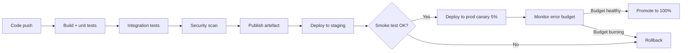
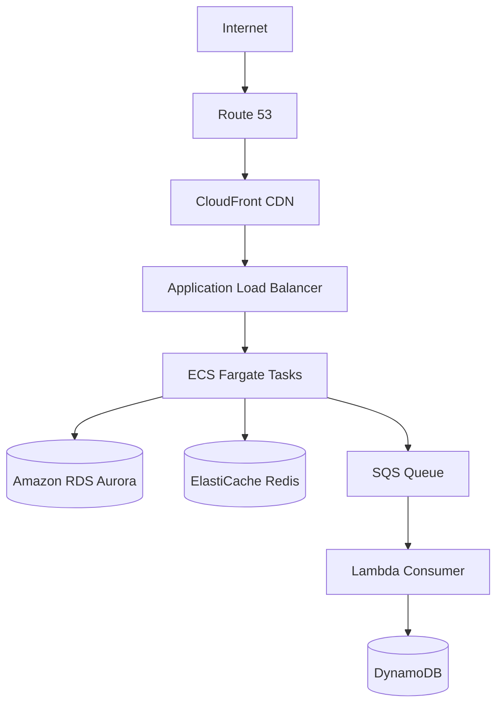

# 17 — JBI Pillars P09–P11: DevOps, Cloud, Production (DEEP)

---

## §0 — Front-matter

```yaml
status: NOT_STARTED
wave: B
depends_on:
  - "11-jbi-pillar-quality-audit.md"
  - "13-jbi-spring-ecosystem.md"
  - "14-jbi-data-persistence.md"
produces:
  - "content/java-backend-intermediate/docker/complete-qa.json"
  - "content/java-backend-intermediate/kubernetes/complete-qa.json"
  - "content/java-backend-intermediate/cicd/complete-qa.json"
  - "content/java-backend-intermediate/terraform/complete-qa.json"
  - "content/java-backend-intermediate/aws-cloud/complete-qa.json"
  - "content/java-backend-intermediate/observability/complete-qa.json"
  - "content/java-backend-intermediate/production-sre/complete-qa.json"
estimated_effort: "80–100 hours (13 modules, ~295 total Q)"
pillar_coverage: ["P09", "P10", "P11"]
version_pins: "Docker Engine 26, Kubernetes 1.30, Terraform 1.8, AWS SDK for Java 2.x, OpenTelemetry Java 1.38, Spring Boot 3.3"
```

---

## §1 — TL;DR

- **Input:** P09 (DevOps), P10 (Cloud), P11 (Production/SRE) modules are thin
  to mid-depth; many Docker, K8s, and AWS queries return zero JBI content.
- **Action:** Hit per-module Q targets for 13 modules; ALL Kubernetes YAML and
  Terraform snippets must pass `kubectl apply --dry-run=client` and
  `terraform validate`.
- **Output:** Every "Docker / K8s / AWS / SRE / observability" high-CTR
  query has a canonical answer; P09–P11 speakable lint ≥ 90 %.

---

## §2 — Why this matters

DevOps + Cloud is the **largest single search bucket outside language
fundamentals** — Docker, K8s, and AWS interview queries together clear
~100k monthly globally. The content gap is severe: most online content is
tutorial-style (how to run Docker for the first time), not interview-shaped
(what is the difference between a Deployment and a StatefulSet, and when
would you choose each). Shipping production-grade YAML and Terraform that
actually validates is a quality differentiator against LeetCode/GfG, which
barely cover this space.

P11 (Production/SRE) is a career-level differentiator — SLO, error budget,
chaos engineering, and incident post-mortem questions separate candidates who
have been on call from those who haven't. No major competitor covers this at
interview depth.

---

## §3 — Easy-language glossary

| Term | Plain-English definition |
|------|--------------------------|
| Container | A lightweight, isolated process that packages an application and its dependencies; uses Linux namespaces and cgroups; shares the host kernel |
| Docker image | A read-only template (a stack of layers) used to create containers; built from a `Dockerfile` |
| Dockerfile | A text file with instructions (`FROM`, `RUN`, `COPY`, `CMD`) that define how to build a Docker image |
| Layer cache | Docker caches each instruction in a Dockerfile as a layer; if the instruction hasn't changed, Docker reuses the cached layer |
| Multi-stage build | A Dockerfile that uses multiple `FROM` statements to separate build-time dependencies from the final runtime image — makes images smaller |
| Distroless image | A minimal base image with no shell, no package manager, and no OS tools — only the runtime (JRE, glibc); reduces attack surface |
| cgroups | Linux kernel feature that limits CPU, memory, and I/O for a process group — Docker uses cgroups to enforce container resource limits |
| Kubernetes (K8s) | An open-source container orchestration system for automating deployment, scaling, and management of containerised applications |
| Pod | The smallest deployable unit in Kubernetes — wraps one or more containers that share network and storage |
| Deployment | A K8s controller that manages a set of identical Pods; handles rolling updates and rollbacks |
| StatefulSet | A K8s controller for stateful applications (databases, Kafka brokers) — gives each Pod a stable hostname and persistent storage |
| DaemonSet | A K8s controller that runs exactly one Pod on every node — used for node-level agents (logging, monitoring, networking) |
| Service | A K8s object that exposes a set of Pods as a stable network endpoint; types: ClusterIP, NodePort, LoadBalancer |
| Ingress | A K8s object that routes external HTTP/S traffic to internal Services based on hostname and path rules |
| HPA | Horizontal Pod Autoscaler — automatically scales the number of Pod replicas based on CPU, memory, or custom metrics |
| ConfigMap | A K8s object that stores non-secret configuration as key-value pairs, injected into Pods as environment variables or volume files |
| PersistentVolume (PV) | A piece of storage in the cluster provisioned by the admin or dynamically via a StorageClass |
| CI/CD | Continuous Integration / Continuous Deployment — automating build, test, and deploy pipelines triggered by code commits |
| Blue-green deployment | Running two identical environments (blue = current, green = new); traffic is switched atomically; rollback = switch back |
| Canary deployment | Routing a small percentage of production traffic to a new version; monitors error rate; gradually increases percentage if healthy |
| Feature flag | A runtime toggle that enables/disables a code path without a deploy — allows "dark launches" and instant rollback |
| Terraform | HashiCorp's infrastructure-as-code tool; declarative HCL syntax; plan/apply/destroy workflow |
| Infrastructure as Code (IaC) | Managing infrastructure (VMs, VPCs, databases) via version-controlled code files instead of manual clicks |
| AWS IAM | Identity and Access Management — the AWS system for controlling who (users, roles, services) can do what (actions) on which resources |
| VPC | Virtual Private Cloud — an isolated network within AWS where you place your resources; define subnets, route tables, security groups |
| Lambda | AWS serverless function — runs code without provisioning servers; billed per invocation and duration |
| SLO | Service Level Objective — the target percentage of time a service should meet its SLI (e.g., 99.9% of requests < 200ms) |
| SLI | Service Level Indicator — the actual measured metric (e.g., request latency at p99) |
| SLA | Service Level Agreement — a contractual commitment to customers, with financial penalties if SLOs are not met |
| Error budget | The allowed downtime per SLO period: (1 - SLO target) × time window. If the budget is exhausted, freeze risky changes |
| RED method | Rate, Errors, Duration — the three metrics to monitor for every service request path |
| USE method | Utilisation, Saturation, Errors — the three metrics to monitor for every resource (CPU, disk, network) |
| OpenTelemetry | Vendor-neutral observability SDK; instruments traces, metrics, and logs; Spring Boot 3 auto-instrumentation via the Java agent |
| Prometheus | A time-series metrics database with a pull model; scrapes `/actuator/prometheus` endpoints; PromQL for queries |
| Grafana | A dashboarding tool that visualises Prometheus/Loki/Tempo data; alert rules via Alertmanager |
| Chaos engineering | Deliberately injecting failures (kill a pod, add network latency) to verify the system's resilience before they happen in production |

---

## §4 — Hard prerequisites

- [ ] Playbook 11 (pillar quality audit) is DONE.
- [ ] `docker --version` works on the agent machine:
  ```bash
  docker --version
  # expected: Docker version 26.x or higher
  ```
- [ ] `kubectl version --client=true` works:
  ```bash
  kubectl version --client=true
  # expected: Client Version: v1.30.x or higher
  ```
- [ ] `terraform --version` ≥ 1.5:
  ```bash
  terraform --version
  # expected: Terraform v1.5.x or higher
  ```
- [ ] Spring Boot 3.3 baseline from playbook 13 established.

---

## §5 — Current state

- `docker` module: ~15 Q covering basics (run, pull, ps); Dockerfile best
  practices, multi-stage builds, and distroless images are absent.
- `kubernetes` module: ~12 Q; only Pod and Deployment covered; StatefulSet,
  DaemonSet, HPA, and networking types are missing.
- `cicd` module: ~8 Q; pipeline stages present; deployment strategies
  (blue-green, canary, feature flags) are absent.
- `terraform` module: ~5 Q stub; plan/apply workflow only.
- `aws-cloud` module: ~10 Q; EC2 and S3 present; Lambda, EKS, IAM, and
  SQS/SNS are absent.
- `observability` module: ~8 Q; SLO/SLI/SLA section missing; OpenTelemetry
  integration with Spring Boot 3 missing.
- `production-sre` module: absent — not in `_index.json`.
- `jenkins`, `gcp`, `azure`, `cloud-native`, `git-build-tools`, `java-build-tools`:
  vary from absent to 5 Q stubs.

---

## §6 — Target state (measurable)

| Module | Q target | Verify |
|--------|----------|--------|
| `docker` | ≥ 35 | `jq '.questions\|length' content/java-backend-intermediate/docker/complete-qa.json` |
| `kubernetes` | ≥ 40 | same pattern |
| `cicd` | ≥ 25 | same pattern |
| `jenkins` | ≥ 20 | same pattern |
| `terraform` | ≥ 20 | same pattern |
| `git-build-tools` | ≥ 20 | same pattern |
| `java-build-tools` | ≥ 20 | same pattern |
| `aws-cloud` | ≥ 40 | same pattern |
| `gcp` | ≥ 25 | same pattern |
| `azure` | ≥ 25 | same pattern |
| `cloud-native` | ≥ 25 | same pattern |
| `observability` | ≥ 30 | same pattern |
| `production-sre` | ≥ 30 | same pattern |
| P09 speakable pass+warn | ≥ 90 % | `python3 scripts/audit_speakable.py --pillar P09 --report` |
| P10 speakable pass+warn | ≥ 90 % | `python3 scripts/audit_speakable.py --pillar P10 --report` |
| P11 speakable pass+warn | ≥ 90 % | `python3 scripts/audit_speakable.py --pillar P11 --report` |

---

## §7 — Search phrases → URL map

| Search phrase | SEO slug | Owner module |
|---------------|----------|--------------|
| `docker interview questions java` | `/java/docker/interview-questions` | docker |
| `dockerfile best practices interview` | `/java/docker/dockerfile-best-practices` | docker |
| `docker vs virtual machine` | `/java/docker/docker-vs-vm` | docker |
| `kubernetes interview questions java` | `/java/kubernetes/interview-questions` | kubernetes |
| `kubernetes deployment vs statefulset` | `/java/kubernetes/deployment-vs-statefulset` | kubernetes |
| `kubernetes ingress vs service` | `/java/kubernetes/ingress-vs-service` | kubernetes |
| `kubernetes hpa interview` | `/java/kubernetes/horizontal-pod-autoscaler` | kubernetes |
| `ci cd interview questions java` | `/java/cicd/interview-questions` | cicd |
| `blue green vs canary deployment` | `/java/cicd/blue-green-vs-canary` | cicd |
| `github actions java interview` | `/java/cicd/github-actions` | cicd |
| `terraform interview questions` | `/java/terraform/interview-questions` | terraform |
| `terraform vs cloudformation` | `/java/terraform/terraform-vs-cloudformation` | terraform |
| `maven vs gradle interview` | `/java/java-build-tools/maven-vs-gradle` | java-build-tools |
| `aws interview questions java developer` | `/java/aws/interview-questions` | aws-cloud |
| `ec2 vs ecs vs eks vs lambda` | `/java/aws/compute-comparison` | aws-cloud |
| `slo sli sla interview questions` | `/java/observability/slo-sli-sla` | observability |
| `opentelemetry spring boot interview` | `/java/observability/opentelemetry-spring-boot` | observability |
| `prometheus vs datadog interview` | `/java/observability/prometheus-vs-datadog` | observability |
| `sre interview questions java` | `/java/production-sre/interview-questions` | production-sre |
| `chaos engineering interview` | `/java/production-sre/chaos-engineering` | production-sre |
| `12 factor app interview` | `/java/cloud-native/12-factor-app` | cloud-native |

---

## §8 — Dependency context

**Upstream (must exist):**
- Playbook 11 (pillar quality audit) — baseline scan.
- Playbook 13 (Spring ecosystem) — Spring Boot actuator cross-links to
  `/actuator/prometheus` and `/actuator/health` endpoints.
- Playbook 14 (data persistence) — RDS/Aurora/DynamoDB Q cross-link to
  database module.
- Playbook 15 (APIs/messaging) — Kafka on AWS/MSK, API Gateway cross-links.

**Downstream (depends on this playbook being DONE):**
- Playbook 44 (system design hub) — container and cloud architecture Q.
- Playbook 49 (Go/Ruby/JS tracks) — Docker and K8s Q are language-agnostic
  and cross-linked from every language track.

---

## §9 — Step-by-step

### Step 1 — Scaffold missing modules

```bash
cd /Users/ravi.r_flx/IEProject/InterviewExplainer
for MOD in docker kubernetes cicd jenkins terraform git-build-tools java-build-tools \
           aws-cloud gcp azure cloud-native observability production-sre; do
  DIR="content/java-backend-intermediate/$MOD"
  mkdir -p "$DIR"
  [ -f "$DIR/complete-qa.json" ] || echo '{"module":"'"$MOD"'","questions":[]}' > "$DIR/complete-qa.json"
done
```

**Verify:**
```bash
ls content/java-backend-intermediate/ | grep -E 'docker|kubernetes|cicd|jenkins|terraform|aws|gcp|azure|cloud-native|observability|production-sre|build-tools' | wc -l
# expected: 13
```

---

### Step 2 — Write `docker` module (target 35 Q)

Key content: Docker vs VM (namespace/cgroup distinction), image layer cache
(ordering instructions from least to most frequently changing), multi-stage
build (builder stage with JDK, runtime stage with JRE only), distroless vs
alpine vs slim ("Use distroless when security is paramount; use alpine when
you need a shell for debugging"), non-root USER instruction, HEALTHCHECK,
volume vs bind mount vs tmpfs, CMD vs ENTRYPOINT.

The classic bug: "The classic bug is putting `COPY . .` before `RUN mvn package`
in a Dockerfile. Every source code change invalidates the dependency-download
layer and triggers a full `mvn package`. Move `COPY pom.xml .` and
`RUN mvn dependency:go-offline` before `COPY src .` to cache dependencies."

Version anchor: Docker Engine 26 (2024), OCI image spec 1.0.

```bash
python3 scripts/validate_qa.py content/java-backend-intermediate/docker/complete-qa.json
jq '.questions|length' content/java-backend-intermediate/docker/complete-qa.json
# expected: ≥ 35
```

---

### Step 3 — Write `kubernetes` module (target 40 Q)

Key content: Pod lifecycle (Pending, Running, Succeeded, Failed, Unknown),
Deployment rolling update (maxSurge, maxUnavailable), StatefulSet stable
hostname pattern (`pod-0.service.namespace.svc.cluster.local`), DaemonSet use
cases (fluentd, node-exporter), Service types (ClusterIP internal, NodePort
fixed port, LoadBalancer cloud LB), Ingress (NGINX controller, path/host rules),
HPA (`kubectl autoscale deployment --cpu-percent=50 --min=2 --max=10`),
ConfigMap vs Secret, node affinity vs taints/tolerations, CrashLoopBackOff
diagnosis, OOMKilled (limit memory in container spec).

The classic bug: "The classic bug is not setting resource `requests` and
`limits` on containers. Without `requests`, the scheduler places Pods
arbitrarily and nodes get overcommitted. Without `limits`, a single noisy
neighbour Pod consumes all node memory and triggers OOMKilled on neighbouring
Pods."

All YAML snippets must pass dry-run:
```bash
cat <<'EOF' | kubectl apply --dry-run=client -f -
apiVersion: apps/v1
kind: Deployment
metadata:
  name: example-app
spec:
  replicas: 3
  selector:
    matchLabels:
      app: example
  template:
    metadata:
      labels:
        app: example
    spec:
      containers:
      - name: app
        image: openjdk:21-jre-slim
        resources:
          requests:
            cpu: "100m"
            memory: "256Mi"
          limits:
            cpu: "500m"
            memory: "512Mi"
EOF
```

**Verify:**
```bash
jq '.questions|length' content/java-backend-intermediate/kubernetes/complete-qa.json
# expected: ≥ 40
```

---

### Step 4 — Write `cicd` module (target 25 Q)

Key content: CI vs CD vs CD (Continuous Integration / Delivery / Deployment),
pipeline stages (build, unit test, integration test, security scan, publish artefact,
deploy to staging, deploy to prod), deployment strategies (blue-green, canary,
rolling, recreate — "Use blue-green when you need atomic traffic switching and
can afford double infrastructure cost; use canary when you want gradual rollout
with real-traffic validation"), feature flags (LaunchDarkly, Unleash), GitHub Actions
workflow syntax (triggers, jobs, steps, matrix, reusable workflows, OIDC to AWS).

The classic bug: "The classic bug in CI pipelines is running integration tests
without a test database, using production or staging DB credentials committed to
the YAML. Use GitHub Actions secrets and a per-job ephemeral database
(postgres service container in GitHub Actions)."

Version anchor: GitHub Actions (2024), GitLab CI 17, Jenkins LTS 2.452.

---

### Step 5 — Write `jenkins`, `terraform`, `git-build-tools`, `java-build-tools` (20 Q each)

**jenkins:** Declarative vs scripted pipeline, Jenkinsfile structure, shared
libraries, agents (docker agent), Blue Ocean, credentials management.

**terraform:** `plan/apply/destroy` workflow, state file (why it's sensitive,
remote state in S3), modules, data sources, `terraform import`, workspace.
"Use Terraform when managing cloud infrastructure declaratively; use
CloudFormation when you're AWS-only and want native drift detection."
All HCL snippets must `terraform validate` in a temp dir.

**git-build-tools:** git rebase vs merge ("Use rebase for feature branches
before PR to produce a clean linear history; use merge for main branch
integration to preserve branch topology"), git bisect, cherry-pick,
interactive rebase, reflog.

**java-build-tools:** Maven vs Gradle ("Use Maven when the project follows
convention-over-configuration and you want a stable, widely-understood build;
use Gradle for multi-project builds, incremental compilation, or
Android"). Maven lifecycle (validate/compile/test/package/install/deploy),
Gradle tasks, dependency management, local Maven repo, Gradle build cache.

---

### Step 6 — Write `aws-cloud` module (target 40 Q)

Key content: compute comparison (EC2 reserved + spot, ECS Fargate, EKS,
Lambda — "Use Lambda for event-driven workloads ≤15 min; use ECS Fargate
for long-running services without managing nodes; use EKS when you need
full Kubernetes control"), S3 storage classes (Standard, Intelligent-Tiering,
Glacier — "Use S3 Standard for frequently accessed data; use Intelligent-Tiering
when access patterns are unpredictable"), RDS vs Aurora vs DynamoDB
("Use RDS/Aurora for relational workloads; use DynamoDB for single-table
access patterns at any scale"), SQS vs SNS vs EventBridge, IAM roles vs users
vs policies (least-privilege principle), VPC (public vs private subnet, NAT
gateway, security group vs NACL).

The classic bug: "The classic bug is attaching an overly permissive IAM policy
(e.g., `Action: '*'`, `Resource: '*'`) to a Lambda function. If that function is
compromised, the attacker has full AWS account access. Always use least-privilege
IAM roles with only the specific actions and resource ARNs required."

Version anchor: AWS SDK for Java 2.x (2024), AWS Lambda SnapStart (2022), Aurora v3 (MySQL 8 compatible).

---

### Step 7 — Write `gcp`, `azure`, `cloud-native` modules (25 Q each)

**gcp:** GKE (Autopilot vs Standard), Cloud Run (vs Lambda), BigQuery (column-store,
partitioning), Cloud Pub/Sub (vs Kafka), IAM (service accounts), VPC peering.

**azure:** AKS, Azure Functions, Azure Service Bus (queues vs topics),
Azure SQL vs Cosmos DB, Azure AD (service principals, managed identities),
ARM templates vs Bicep vs Pulumi.

**cloud-native:** 12-factor app (each factor with a Spring Boot example),
sidecar pattern (Envoy proxy, logging sidecar), service mesh (Istio data plane
vs control plane, mTLS between services), GitOps (Argo CD, Flux).

---

### Step 8 — Write `observability` module (target 30 Q)

Key content: three pillars of observability (logs, metrics, traces),
RED method (Rate, Errors, Duration — per-service), USE method (Utilisation,
Saturation, Errors — per-resource), SLO/SLI/SLA distinction and error budgets
("An error budget is `(1 - SLO target) × window`. Once exhausted, freeze
non-critical deploys"), OpenTelemetry with Spring Boot 3 auto-instrumentation
(Java agent, `otel.exporter.otlp.endpoint`), PromQL basics
(`rate(http_requests_total[5m])`), Grafana alerting.

The classic bug: "The classic bug is setting an SLO of 100% availability. A
100% SLO has a zero error budget — any incident, even planned maintenance,
immediately violates it. Start at 99.9% (8.7h downtime/year) and tighten
based on measured customer impact."

Version anchor: OpenTelemetry Java 1.38 (2024), Prometheus 2.53, Grafana 11.

---

### Step 9 — Write `production-sre` module (target 30 Q)

Key content: incident severity levels (SEV1–4 definitions), blameless
postmortems (timeline, contributing factors, action items — not blame),
on-call rotation and paging hygiene (alert fatigue, runbooks, escalation policy),
chaos engineering (Chaos Monkey, game days, Netflix CHAOS principle),
capacity planning (load testing with Gatling/k6, headroom targets),
release engineering (feature flags, gradual rollouts, kill switches).

The classic bug: "The classic bug in on-call rotations is alerting on
low-severity symptoms like disk at 60% or CPU at 70%. Alert only on
SLO burn rate — `burn_rate > 1` means the error budget is being consumed
faster than it's replenished. Alert fatigue from low-severity pages makes
engineers ignore pages, including the critical ones."

---

### Step 10 — Validate all YAML and Terraform snippets

```bash
cd /Users/ravi.r_flx/IEProject/InterviewExplainer

# Extract and dry-run 5 K8s YAML snippets
python3 - <<'PY'
import json, re, subprocess
from pathlib import Path

yamls_found = 0
for f in Path("content/java-backend-intermediate").rglob("complete-qa.json"):
    data = json.loads(f.read_text())
    for q in data.get("questions", []):
        for s in q.get("answer", {}).get("sections", []):
            if s.get("kind") == "code" and s.get("language") == "yaml":
                yamls_found += 1
                if yamls_found <= 5:
                    result = subprocess.run(
                        ["kubectl", "apply", "--dry-run=client", "-f", "-"],
                        input=s["value"], capture_output=True, text=True
                    )
                    print(f"YAML {yamls_found}: {'OK' if result.returncode == 0 else 'FAIL'}")
                    if result.returncode != 0:
                        print(result.stderr[:200])
PY
```

**Verify:** 5 of 5 YAML snippets print `OK`.

---

### Step 11 — Run speakable lint across P09, P10, P11

```bash
cd /Users/ravi.r_flx/IEProject/InterviewExplainer
for PILLAR in P09 P10 P11; do
  echo "=== $PILLAR ==="
  python3 scripts/audit_speakable.py --pillar $PILLAR --report
done
```

**Verify:** All three print `pass+warn ≥ 90 %`.

---

### Step 12 — Commit per module batch

```bash
cd /Users/ravi.r_flx/IEProject/InterviewExplainer
git add content/java-backend-intermediate/docker/ content/java-backend-intermediate/kubernetes/
git commit -m "content(jbi/p09): docker +35 Q, kubernetes +40 Q — containers, K8s lifecycle"

git add content/java-backend-intermediate/cicd/ content/java-backend-intermediate/jenkins/ \
        content/java-backend-intermediate/terraform/ content/java-backend-intermediate/git-build-tools/ \
        content/java-backend-intermediate/java-build-tools/
git commit -m "content(jbi/p09): cicd +25, jenkins +20, terraform +20, build-tools +40 Q"

git add content/java-backend-intermediate/aws-cloud/ content/java-backend-intermediate/gcp/ \
        content/java-backend-intermediate/azure/ content/java-backend-intermediate/cloud-native/
git commit -m "content(jbi/p10): aws +40, gcp +25, azure +25, cloud-native +25 Q"

git add content/java-backend-intermediate/observability/ content/java-backend-intermediate/production-sre/
git commit -m "content(jbi/p11): observability +30, production-sre +30 Q — SLO, OTel, chaos"

git add expansion-plan/00-INDEX.md
git commit -m "docs(expansion-plan): mark 17-jbi-devops-cloud-production DONE"
```

---

## §10 — Reference Q in archetype JSON

Full worked example for `kubernetes-deployment-vs-statefulset`:

```json
{
  "id": "kubernetes-deployment-vs-statefulset",
  "slug": "kubernetes-deployment-vs-statefulset",
  "question": "What is the difference between a Kubernetes Deployment and a StatefulSet? When would you use each?",
  "title": "Kubernetes Deployment vs StatefulSet",
  "direct_answer": "Use a Deployment for stateless applications (web servers, APIs, microservices) where Pod identity doesn't matter — Kubernetes can kill and replace any Pod. Use a StatefulSet for stateful applications (databases, Kafka brokers, Elasticsearch nodes) where each Pod needs a stable, unique hostname and persistent storage that survives restarts. StatefulSet Pods are named sequentially (pod-0, pod-1) and are created, scaled, and deleted in order.",
  "layout_type": "comparison",
  "difficulty": "medium",
  "importance": 5,
  "reading_time_minutes": 5,
  "last_updated": "2025-01-15",
  "interviewer_intent": {
    "testing": "Whether the candidate knows when statelessness breaks down and what K8s provides for stateful workloads.",
    "common_mistake": "Saying 'just use Deployment for everything' — a database in a Deployment loses its data on Pod restart because PVC binding is random.",
    "to_stand_out": "Mention headless Services (`clusterIP: None`) — StatefulSets use them to give each Pod a DNS-resolvable stable hostname like `mysql-0.mysql.default.svc.cluster.local`."
  },
  "company_tags": ["Google", "Amazon", "Microsoft", "Spotify", "Cloudflare", "Datadog"],
  "answer": {
    "sections": [
      {
        "kind": "overview",
        "value": "Kubernetes has two main controllers for running sets of Pods: Deployment (stateless) and StatefulSet (stateful). The key difference is identity: Deployment Pods are fungible — their names and storage are randomly assigned and not preserved across restarts. StatefulSet Pods have stable names (mysql-0, mysql-1), stable storage (each Pod always gets the same PVC), and are created/deleted in a defined order."
      },
      {
        "kind": "comparison_table",
        "headers": ["Dimension", "Deployment", "StatefulSet"],
        "rows": [
          ["Pod identity", "Random (app-7d9c8f-xk2v1)", "Ordered + stable (mysql-0, mysql-1)"],
          ["Pod DNS name", "Via Service (random pod)", "Stable: pod-N.service.namespace.svc.cluster.local"],
          ["PVC assignment", "Random / shared", "Each Pod gets its own PVC, retained on restart"],
          ["Scale-up order", "Parallel (all at once)", "Sequential (pod-0, then pod-1, then pod-2)"],
          ["Scale-down order", "Random", "Reverse sequential (pod-N first)"],
          ["Use case", "Stateless: web servers, APIs, workers", "Stateful: MySQL, PostgreSQL, Kafka, Elasticsearch, Zookeeper"]
        ]
      },
      {
        "kind": "step",
        "label": "The classic bug",
        "value": "The classic bug is running a PostgreSQL database in a Kubernetes Deployment. Each time the Pod restarts (node failure, rolling update), it may land on a different node and bind a different PVC — or no PVC at all if storage class isn't set up correctly — resulting in data loss. Always use StatefulSet for any workload that writes data to disk."
      },
      {
        "kind": "tradeoffs",
        "value": "StatefulSets are more complex to operate. Rolling updates are sequential (one Pod at a time), making them slower. Deleting a StatefulSet does NOT delete its PVCs — you must delete PVCs separately, which is intentional (prevents accidental data loss) but can surprise operators. For databases in Kubernetes, consider using a cloud-managed database (RDS, Cloud SQL) instead of running StatefulSet yourself — the operational burden is high."
      },
      {
        "kind": "key_points",
        "value": [
          "Deployment = stateless; StatefulSet = stateful (stable identity + storage).",
          "StatefulSet Pods are ordered: mysql-0 must be Running before mysql-1 starts.",
          "Use headless Service (`clusterIP: None`) with StatefulSet for stable DNS names.",
          "Kubernetes 1.27+ has StatefulSet PVC retention policies to auto-delete PVCs on scale-down."
        ]
      },
      {
        "kind": "speakable_answer",
        "value": "Use a Deployment for stateless apps where Pod identity doesn't matter. Use a StatefulSet for stateful apps like databases — each Pod gets a stable hostname and its own persistent storage that survives restarts. StatefulSet Pods are created and deleted in order."
      }
    ]
  },
  "followup_questions": [
    "What is a DaemonSet and when would you use it over a Deployment?",
    "How does Kubernetes handle rolling updates for a StatefulSet?",
    "What is a headless Service and why does StatefulSet need one?",
    "How do you debug a Pod stuck in CrashLoopBackOff?",
    "What is the difference between a PersistentVolume and a PersistentVolumeClaim?"
  ],
  "seo": {
    "metaTitle": "Kubernetes Deployment vs StatefulSet | Java Interview Questions",
    "metaDescription": "Learn when to use a Kubernetes Deployment vs StatefulSet, with a comparison table, real YAML examples, and the classic database-in-Deployment mistake Java developers make."
  },
  "order": 1
}
```

---

## §11 — Diagram catalogue

**Diagram 1: Kubernetes Pod scheduling and lifecycle**

```mermaid
stateDiagram-v2
    [*] --> Pending
    Pending --> Running: scheduler assigns node; containers start
    Running --> Succeeded: all containers exit 0
    Running --> Failed: container exits non-zero; restartPolicy=Never
    Running --> Running: container restarts (restartPolicy=Always)
    Running --> Unknown: node loses contact with API server
```


**Diagram 2: CI/CD pipeline stages**


**Diagram 3: AWS well-architected Java service**


---

## §12 — Voice rules

> Quoting `_VOICE-RULES.md` §1–§4 in full, plus P09/P10/P11 examples.

### Define before use
Every domain term in §9–§14 must be in §3 (above) or `_GLOSSARY.md`.

### Lead with the trade-off
- ✅ "Use Lambda for event-driven workloads under 15 minutes with sporadic
  traffic. Use ECS Fargate for long-running services where cold start latency
  is unacceptable. Use EKS when you need full Kubernetes capability and have
  the ops maturity to run it."
- ❌ "Lambda is a serverless compute service. ECS is a container orchestration
  service. EKS is managed Kubernetes."

### Name the bug
- ✅ "The classic bug is putting `COPY . .` before `RUN mvn package` in a
  Dockerfile — every source change invalidates the dependency cache and
  triggers a full rebuild. Move `COPY pom.xml .` and
  `RUN mvn dependency:go-offline` before `COPY src .`."
- ❌ "Optimise Dockerfile layer ordering for better caching."

### Real anchors
- ✅ "Kubernetes 1.30 (April 2024) made `kubectl rollout` the standard
  way to watch rolling update progress: `kubectl rollout status deployment/myapp`."
- ❌ "You can monitor Kubernetes deployments using kubectl."

**P09/P10/P11-specific examples:**
- ✅ "OpenTelemetry Java 1.38 auto-instrumentation agent patches Spring Boot 3
  at JVM load time — no code changes needed. Add
  `-javaagent:opentelemetry-javaagent.jar` to `JAVA_TOOL_OPTIONS`."
- ❌ "You can add OpenTelemetry to Spring Boot."

---

## §13 — Quality gates

| Gate | Threshold | Verify |
|------|-----------|--------|
| All 13 module Q counts met | per §6 table | `jq '.questions\|length'` per module |
| 5 K8s YAML snippets pass dry-run | 5 of 5 | Step 10 script |
| 3 Terraform HCL snippets validate | 3 of 3 | `terraform validate` in tmp dir |
| P09 speakable pass+warn | ≥ 90 % | `python3 scripts/audit_speakable.py --pillar P09` |
| P10 speakable pass+warn | ≥ 90 % | `python3 scripts/audit_speakable.py --pillar P10` |
| P11 speakable pass+warn | ≥ 90 % | `python3 scripts/audit_speakable.py --pillar P11` |
| All money comparisons live | 100 % | manual cross-check against §per-module tables |
| No `sudo` in Docker examples | 0 | `rg -n 'sudo' content/java-backend-intermediate/docker/` |
| No deprecated kubectl flags | 0 | `rg -n '\-\-show-all\|\-\-export' content/java-backend-intermediate/kubernetes/` |

---

## §14 — Anti-patterns

### Anti-pattern 1: Running containers as root
The classic bug is not adding `USER nonroot` to a Dockerfile. A container
running as root and breached by a vulnerability gives the attacker root access
to the container filesystem. Use a non-root user: `RUN groupadd -r app && useradd -r -g app app` then `USER app`.

### Anti-pattern 2: Kubernetes resources without limits
The most common mistake is deploying Pods without `resources.limits` in the
container spec. Without limits, one misbehaving Pod consumes all node memory,
triggering OOMKilled on healthy Pods. Always set both `requests` (for
scheduling) and `limits` (for enforcement).

### Anti-pattern 3: IAM over-permission on Lambda
The classic bug is attaching `Action: '*'` IAM policies to Lambda functions
"for simplicity". If that function is exploited (event injection, supply
chain attack on a dependency), the attacker gains full AWS account access.
Use least-privilege: enumerate only the specific actions and resource ARNs
the function actually calls.

### Anti-pattern 4: Alerting on symptoms instead of SLO burn rate
The #1 trap in on-call setups is alerting on raw metrics (CPU > 70%, disk > 60%)
instead of SLO burn rate. Symptom-based alerts generate constant low-severity
noise, training engineers to ignore pages. Alert only when the error budget is
burning faster than 1× (it will be exhausted within the window). This requires
defining an SLO first.

### Anti-pattern 5: Terraform state in a local file
The most common mistake in Terraform setups is keeping `terraform.tfstate` in
the git repository. The state file contains sensitive values (passwords, secret
ARNs). Use a remote backend (S3 + DynamoDB for AWS, Terraform Cloud) with
state encryption and locking.

---

## §15 — Failure modes

**Failure 1: K8s YAML dry-run fails**
If `kubectl apply --dry-run=client` returns an error:
1. Read the error message — it names the field and the problem.
2. Most common: wrong `apiVersion` for the resource (K8s 1.25+ removed
   `extensions/v1beta1`; use `apps/v1`).
3. Fix the YAML in the `complete-qa.json` code block, re-run dry-run.
4. Never ship K8s YAML that doesn't pass dry-run.

**Failure 2: Terraform validate fails**
1. Create a temp dir, copy the HCL snippet, run `terraform init && terraform validate`.
2. Most common: provider version constraint syntax error, or a resource
   attribute that was renamed in the provider's latest version.
3. Pin provider version explicitly: `version = "~> 5.0"`.

**Failure 3: Speakable lint below 90 % for P10 (cloud modules)**
Cloud modules often include YAML snippets in `speakable_answer` fields — TTS
can't read YAML. Run `audit_speakable.py --verbose`, find failing Q, replace
YAML in `speakable_answer` with spoken prose:
"Set the S3 bucket policy to allow `s3:GetObject` for all principals — that
makes it publicly readable." rather than a JSON policy document.

---

## §16 — Definition of Done

- [ ] All 13 module Q targets met (verify with `jq '.questions|length'` per module).
- [ ] 5 K8s YAML snippets pass `kubectl apply --dry-run=client`.
- [ ] 3 Terraform HCL snippets pass `terraform validate`.
- [ ] P09 speakable lint ≥ 90 %.
- [ ] P10 speakable lint ≥ 90 %.
- [ ] P11 speakable lint ≥ 90 %.
- [ ] Zero `sudo` in Docker examples: `rg -n 'sudo' content/java-backend-intermediate/docker/` → 0.
- [ ] Zero deprecated kubectl flags (`--show-all`, `--export`).
- [ ] All comparison Q start with "Use X when…; use Y when…".
- [ ] All SLO Q contain a concrete threshold (e.g., "99.9% of requests < 200ms").
- [ ] `npm run build` exits 0 after module registration.
- [ ] `00-INDEX.md` row for `17` flipped to `DONE`.

---

## §17 — Estimated effort

- **Ideal:** 80 hours across 6 sessions:
  - Session 1 (14 h): `docker` + `kubernetes` (75 Q).
  - Session 2 (14 h): `cicd` + `jenkins` + `terraform` (65 Q).
  - Session 3 (10 h): `git-build-tools` + `java-build-tools` + `cloud-native` (65 Q).
  - Session 4 (16 h): `aws-cloud` + `gcp` + `azure` (90 Q).
  - Session 5 (12 h): `observability` + `production-sre` (60 Q).
  - Session 6 (14 h): YAML/HCL validation, speakable lint, commits.
- **Hard stop:** 100 hours. Commit partial work if exceeded; surface gap to user.
- **Recommended rhythm:** Commit after every 10 Q; validate YAML/HCL inline, not at the end.

---

## §18 — Appendix

### 18.1 — Cross-references

- [`expansion-plan/00-INDEX.md`](00-INDEX.md) — wave + status table.
- [`expansion-plan/_TEMPLATE-1000.md`](_TEMPLATE-1000.md) — 18-section skeleton.
- [`expansion-plan/_GLOSSARY.md`](_GLOSSARY.md) — global glossary.
- [`expansion-plan/_VOICE-RULES.md`](_VOICE-RULES.md) — voice + banned words.
- [`scripts/audit_speakable.py`](../scripts/audit_speakable.py) — speakable lint.
- [`scripts/validate_qa.py`](../scripts/validate_qa.py) — Q JSON validator.
- Upstream: playbooks 11, 13, 14, 15.
- Downstream: playbook 44 (system design hub), playbook 49 (language tracks).

### 18.2 — Commits produced by this playbook

- `feat(jbi/p09): scaffold 13 DevOps/Cloud/SRE module dirs` — Step 1
- `content(jbi/p09): docker +35 Q, kubernetes +40 Q` — Step 2+3
- `content(jbi/p09): cicd +25, jenkins +20, terraform +20, build-tools +40 Q` — Step 4+5
- `content(jbi/p10): aws +40, gcp +25, azure +25, cloud-native +25 Q` — Step 6+7
- `content(jbi/p11): observability +30, production-sre +30 Q` — Step 8+9
- `docs(expansion-plan): mark 17-jbi-devops-cloud-production DONE` — Step 12

### 18.3 — Traceability

- `ROADMAP.md` "Wave B — JBI pillar content" row — this playbook moves the row to DONE.
- Total Q target: 295 across 13 modules; P09–P11 speakable lint is the critical quality gate.
- P11 (production-sre) is the most unique content — no competitor covers SLO,
  error budget, and blameless postmortem at interview depth. Prioritise if pressed for time.