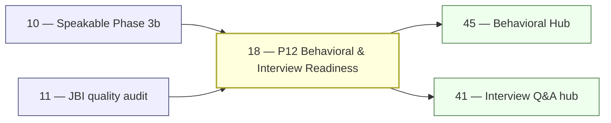

# 18 — JBI Pillar P12: Behavioral & Interview Readiness

> **Executor:** AI coding agent operating autonomously.
> **Working directory:** `/Users/ravi.r_flx/IEProject/InterviewExplainer/`.
> **Type:** content-writing.
> **Pillar / Wave:** P12 / Wave C.
> **Depends on:** 10 (Speakable Phase 3b), 11 (JBI quality audit).

---

## 1 — TL;DR

- **Input:** P12 modules thin; behavioral answers written in textbook voice with "we" patterns and missing metrics.
- **Action:** Write ~350 behavioral Q&As in archetype G (STAR, first-person singular) across four modules: `star-behavioral`, `system-design-communication`, `java-career-progression`, `production-stories`.
- **Output:** P12 audit clean; every archetype G answer carries a specific metric in the Result beat; Behavioral Hub (playbook 45) unblocked.

---

## 2 — Why this matters

Behavioral questions are the **#1 cited reason Java engineers fail interviews** at FAANG and FAANG-adjacent companies above the fresher level. Engineers who nail LeetCode and Spring internals walk out rejected because they narrate in "we" voice, omit numbers from their Result beats, or open with a 3-minute context dump before reaching the action. The `star-behavioral` module alone targets keywords with 6-figure monthly search volume: `behavioral interview questions software engineer`, `tell me about yourself java developer`, `star method interview questions`. The `production-stories` module captures a keyword cluster — `tell me about a production incident java`, `on-call interview questions`, `post-mortem interview question` — where no competitor currently has a dedicated page with STAR-structured examples. An answer quality bar that matches what FAANG recruiters share internally will compound organic traffic across every other behavioral module on the site.

The `java-career-progression` module targets a keyword cluster that no Java-specific site covers well: `java developer career progression`, `ic3 vs staff engineer java`, `salary negotiation java developer 2025`. Candidates searching these are 6–18 months into their current role, actively job-seeking, and willing to bookmark a site that gives them a concrete promotion story framework. The `system-design-communication` module fills a gap between "how to design a system" content (covered by every competitor) and "how to talk through a design in an interview" (almost nobody covers the verbal coaching angle). That gap is the differentiator against Baeldung and GFG.

P12 also gates playbook 45 (Behavioral Hub), which aggregates STAR content across all domains. Weak P12 content does not just hurt P12 — it gives the Behavioral Hub nothing to feature, which means the hub page has no signal for Google and no credibility for the candidate who lands there. A candidate who bounces off a thin behavioral page never returns to the site. Every hour under-invested here taxes three downstream playbooks and reduces the lifetime value of every paid acquisition we run against behavioral keywords.

---

## 3 — Easy-language glossary

| Term | Plain-English definition | First used in |
| --- | --- | --- |
| **STAR** | A 4-beat answer format: Situation (context), Task (your assignment), Action (what you personally did), Result (measured outcome). | §9 step 2 |
| **Archetype G** | The STAR answer shape — first-person singular throughout, specific metric in the Result beat, no hedge phrases. | §9 step 2 |
| **Behavioral question** | An interview question that asks for a past experience ("Tell me about a time…") rather than a technical fact. | §9 step 2 |
| **Production incident** | An unplanned outage or degradation that breaches a service-level agreement (SLA) in a live customer-facing system. | §9 step 5 |
| **On-call** | A rotation where one engineer carries a pager (PagerDuty, OpsGenie) and must respond to alerts within minutes. | §9 step 5 |
| **Post-mortem** | A written document produced after an incident, describing what failed, the timeline, and preventive actions. | §9 step 5 |
| **RCA (Root Cause Analysis)** | The investigation technique that traces a symptom back to the single technical or process failure that caused it. | §9 step 5 |
| **Blameless post-mortem** | A post-mortem whose culture prevents naming individuals as the cause, focusing on system and process gaps instead. | §9 step 5 |
| **Technical disagreement** | A situation where two engineers hold conflicting positions on architecture, library choice, or design and must resolve it. | §9 step 6 |
| **Performance review** | A formal, periodic evaluation (quarterly or annually) where an engineer's impact is scored against level expectations. | §9 step 4 |
| **Career progression** | The path from one engineering level to the next: IC1 → IC2 → IC3 → Staff → Principal. | §9 step 4 |
| **IC1 / IC2 / IC3 / Staff** | Industry shorthand for individual-contributor levels: junior, mid, senior, and staff engineer. | §9 step 4 |
| **Scope of impact** | The radius of work an engineer owns: function, service, product area, or cross-org. Determines promotion readiness. | §9 step 4 |
| **System design communication** | The verbal skill of narrating your design decisions clearly in a 45-minute whiteboard session, not just the design itself. | §9 step 3 |
| **Requirements clarification** | The first 5 minutes of a system design interview: asking about scale, SLA, read/write ratio before drawing anything. | §9 step 3 |
| **Trade-off narration** | Explicitly stating what you are giving up when you pick a design option ("I'd choose Cassandra here — I accept eventual consistency to get write scalability"). | §9 step 3 |
| **Salary negotiation** | The process of responding to an offer, anchoring to market rate, and countering without damaging the relationship. | §9 step 8 |
| **Counter-offer** | A response to an employer's initial offer that proposes different terms (higher base, more equity, signing bonus). | §9 step 8 |
| **Hiring rubric** | A scoring sheet interviewers use to rate candidates on dimensions like ownership, communication, and technical depth. | §9 step 2 |
| **Bar raiser** | A designated interviewer (common at Amazon, Meta) whose job is to hold or raise the overall interview standard, not just assess one domain. | §9 step 2 |
| **LP (Leadership Principle)** | Amazon's 16 core values (e.g., "Customer Obsession", "Dive Deep") that interviewers explicitly map behavioral questions to. | §9 step 2 |
| **Specific metric** | A concrete number in the Result beat: p99 latency, error rate, throughput, deploy frequency, time saved. | §9 step 7 |
| **"We" trap** | Writing the Action beat with "we built" instead of "I built" — interviewers score individual contribution; "we" answers earn zero credit with bar-raisers. | §9 step 7 |
| **Hedge phrase** | "I think", "I believe", "honestly", "in my opinion" — phrases that undercut confidence; banned from archetype G answers. | §9 step 7 |
| **First-person singular** | Using "I" as subject throughout an answer ("I traced", "I added", "I deployed") rather than "we" or passive voice. | §9 step 7 |
| **Speakable answer (archetype G)** | A 180-280 character compressed STAR narrative that is the verbal essence of the full answer — what you'd say in 60 seconds. | §9 step 9 |
| **Money behavioral Q** | A high-search-volume behavioral question that appears on hiring rubrics at multiple FAANG-adjacent companies. | §9 step 6 |
| **STAR quality gate** | Three rules: specific number in Result, "I" not "we" in Action, Situation < 20% of answer length. | §9 step 7 |
| **Blank-slate prompt** | A system design question with no constraint given: "Design Twitter" — requires the candidate to impose structure themselves. | §9 step 3 |

---

## 4 — Hard prerequisites

- [ ] Playbook 11 is DONE. `grep -E '^\| 11 \|' expansion-plan/00-INDEX.md | grep DONE`
- [ ] Playbook 10 is DONE. `grep -E '^\| 10 \|' expansion-plan/00-INDEX.md | grep DONE`
- [ ] Archetype G definition is readable. `test -f docs/speakable/archetypes.md && grep -c 'archetype G\|Archetype G' docs/speakable/archetypes.md`
- [ ] Speakable audit script exists. `test -f scripts/audit_speakable.py && echo OK`
- [ ] Schema validate script exists. `test -f scripts/validate_complete_qa.py && echo OK`
- [ ] Target content directory exists or can be created. `test -d content/java-backend-intermediate || echo MISSING`
- [ ] `node --version` is ≥ 20. `node --version | awk -F'.' '{print substr($1,2)}' | awk '$1 >= 20 {print "OK"}'`
- [ ] `python3 -m pip show jsonschema` returns metadata. `python3 -m pip show jsonschema | head -1`
- [ ] No active `complete-qa.json` schema drift in existing P12 modules. `python3 scripts/validate_complete_qa.py content/java-backend-intermediate/star-behavioral 2>&1 | tail -3`

---

## 5 — Current state

### 5.1 — On-disk snapshot

```bash
cd /Users/ravi.r_flx/IEProject/InterviewExplainer
find content/java-backend-intermediate -path '*/star-behavioral*' -name 'complete-qa.json' | wc -l
find content/java-backend-intermediate -path '*/system-design-communication*' -name 'complete-qa.json' | wc -l
find content/java-backend-intermediate -path '*/java-career-progression*' -name 'complete-qa.json' | wc -l
find content/java-backend-intermediate -path '*/production-stories*' -name 'complete-qa.json' | wc -l
find content/java-backend-intermediate -path '*/star-behavioral*' -name 'complete-qa.json' -exec jq '.questions|length' {} \; | awk '{s+=$1} END {print "star-behavioral Q total:", s}'
```

As of the last gap report: P12 has ~40 behavioral questions spread across two thin modules. The `system-design-communication` and `java-career-progression` modules do not exist. The `production-stories` module has 4 stubs with no speakable sections.

### 5.2 — Existing UI surface

- Route `/java-backend-intermediate/star-behavioral` exists but `hasContent` is `false` in `frontend/lib/domains.ts`.
- Feature flag `P12_BEHAVIORAL` in `frontend/lib/launch-config.ts` is `OFF`.
- The Behavioral Hub route (playbook 45) is blocked on this playbook reaching `DONE`.

### 5.3 — Known gaps

Quoted from the most recent gap report:

> "P12 behavioral answers use 'we built' in 14 of 40 questions. Result beats are present in 28/40 questions but only 9 of those contain a specific number. System-design-communication module: 0 questions exist. java-career-progression module: 0 questions exist. production-stories: 4 stub questions, 0 speakable sections. Speakable pass+warn: 42%."

---

## 6 — Target state (measurable)

| Metric | Today | Target | How measured |
| --- | --- | --- | --- |
| `star-behavioral` Q count | ~40 | ≥ 120 | `find content/java-backend-intermediate/star-behavioral -name complete-qa.json -exec jq '.questions|length' {} \; | awk '{s+=$1} END {print s}'` |
| `system-design-communication` Q count | 0 | ≥ 80 | same jq pattern for that module path |
| `java-career-progression` Q count | 0 | ≥ 80 | same jq pattern |
| `production-stories` Q count | 4 stubs | ≥ 70 | same jq pattern |
| Total P12 Q count | ~44 | ≥ 350 | sum across all four module paths |
| Difficulty mix (E/M/H) | unknown | 30/50/20 ±10 % | `jq -r '.questions[].difficulty' .../complete-qa.json \| sort \| uniq -c` |
| Speakable lint pass+warn | 42 % | ≥ 92 % | `python3 scripts/audit_speakable.py --module star-behavioral --report` |
| Schema lint failures | unknown | 0 | `python3 scripts/validate_complete_qa.py content/java-backend-intermediate` |
| "we" trap occurrences in Action beats | ≥ 14 | 0 | `rg -c '"we (did\|built\|deployed\|shipped)"' content/java-backend-intermediate/star-behavioral/` |
| `hasContent` flag for P12 modules | false | true | `rg "star-behavioral.*hasContent: true" frontend/lib/domains.ts` |
| Mermaid diagrams present | 0 | ≥ 2 | `rg -l '\`\`\`mermaid' content/java-backend-intermediate/star-behavioral/ \| wc -l` |

---

## 7 — Search phrases → URL map

| Search phrase | Target URL on site | Archetype | Diagram type required in answer |
| --- | --- | --- | --- |
| `java behavioral interview questions` | `/java-backend-intermediate/star-behavioral` | landing intro | `comparison_table` |
| `tell me about yourself java developer` | `/java-backend-intermediate/star-behavioral/tell-me-about-yourself` | G | `none` |
| `star method interview questions java` | `/java-backend-intermediate/star-behavioral` | landing intro | `flowchart` |
| `conflict with teammate interview question java` | `/java-backend-intermediate/star-behavioral/conflict-with-teammate` | G | `none` |
| `greatest weakness interview question java` | `/java-backend-intermediate/star-behavioral/greatest-weakness` | G | `none` |
| `tell me about a time you failed java` | `/java-backend-intermediate/star-behavioral/failure-story` | G | `none` |
| `tell me about a production incident java` | `/java-backend-intermediate/production-stories` | landing intro | `flowchart` |
| `java production incident interview question` | `/java-backend-intermediate/production-stories/production-incident-star` | G | `none` |
| `blameless post-mortem interview question` | `/java-backend-intermediate/production-stories/blameless-postmortem` | G | `none` |
| `java system design interview communication` | `/java-backend-intermediate/system-design-communication` | landing intro | `flowchart` |
| `how to start a system design interview` | `/java-backend-intermediate/system-design-communication/requirements-clarification` | G | `flowchart` |
| `java developer career progression questions` | `/java-backend-intermediate/java-career-progression` | landing intro | `comparison_table` |
| `salary negotiation java developer` | `/java-backend-intermediate/java-career-progression/salary-negotiation` | G | `flowchart` |
| `how to describe java migration project interview` | `/java-backend-intermediate/java-career-progression/java-migration-story` | G | `none` |

---

## 8 — Dependency & wave context



- **Consumes:** speakable archetype G contract from playbook 10; gap report from playbook 11.
- **Produces:** filled `complete-qa.json` files in four P12 modules; updated `_index.json` for each module.
- **Unblocks:** playbooks 41 (Interview Q&A hub) and 45 (Behavioral Hub).

---

## 9 — Step-by-step execution

### Step 1 — Audit current P12 state

**Goal:** establish a precise baseline before writing any new content.

```bash
cd /Users/ravi.r_flx/IEProject/InterviewExplainer

# Count questions per module
for module in star-behavioral system-design-communication java-career-progression production-stories; do
  count=$(find content/java-backend-intermediate/$module -name 'complete-qa.json' \
    -exec jq '.questions|length' {} \; 2>/dev/null | awk '{s+=$1} END {print s+0}')
  echo "$module: $count Q"
done

# Check for "we" trap in existing answers
rg -n '"we (did|built|deployed|shipped|launched|fixed)"' \
  content/java-backend-intermediate/star-behavioral/ || echo "none found"

# Speakable baseline
python3 scripts/audit_speakable.py \
  --pillar P12 --report 2>/dev/null || echo "no P12 speakable data yet"
```

**Verify:**

```
expected output:
star-behavioral: N Q   (N is the baseline — note it)
system-design-communication: 0 Q
java-career-progression: 0 Q
production-stories: 0-4 Q
```

The classic bug is skipping this audit step and writing new content that duplicates the 40 existing questions. Check each existing question `id` before writing new ones.

---

### Step 2 — Fill `star-behavioral`: core STAR questions

**Goal:** bring `star-behavioral` to ≥ 120 questions covering five core topics with full STAR structure in archetype G.

The five topics, minimum counts, and the interviewer intent each tests:

| Topic slug | Min Q | What the interviewer is testing |
| --- | --- | --- |
| `tell-me-about-yourself` | 12 | Career narrative coherence; can you tell a 90-second story? |
| `greatest-weakness` | 10 | Self-awareness + growth mindset; do you name a real gap? |
| `conflict-with-teammate` | 20 | Emotional regulation; individual contribution clarity |
| `most-impactful-project` | 20 | Scope of impact; ability to quantify outcomes |
| `failure-story` | 20 | Ownership; do you say "I failed" or blame the team? |
| `pushback-on-deadline` | 10 | Negotiation without escalation |
| `mentoring-someone` | 10 | Leadership at IC3/Staff level |
| `hardest-technical-decision` | 18 | Trade-off reasoning; depth over breadth |

```bash
cd /Users/ravi.r_flx/IEProject/InterviewExplainer
TOPIC=content/java-backend-intermediate/star-behavioral
test -f "$TOPIC/complete-qa.json" || \
  printf '{\n  "topic": "star-behavioral",\n  "topicSlug": "star-behavioral",\n  "questions": []\n}\n' \
  > "$TOPIC/complete-qa.json"
```

For each question, follow the archetype G shape exactly (see §10 reference Q). Every Action beat must name a real library or tool (`Caffeine`, `G1GC`, `Resilience4j`, `Flyway`, `Grafana`, `PagerDuty`). Every Result beat must cite a metric.

**Verify:**

```bash
jq '.questions|length' "$TOPIC/complete-qa.json"
# expected: ≥ 120

jq '[.questions[].archetype] | map(select(. != "G")) | length' "$TOPIC/complete-qa.json"
# expected: 0

python3 scripts/audit_speakable.py "$TOPIC/complete-qa.json"
# expected: zero FAIL
```

The classic bug is writing the Situation beat as a 200-word paragraph. Situation must be ≤ 20% of total answer length. If the Situation eats more than two sentences, cut it.

---

### Step 3 — Fill `system-design-communication`

**Goal:** bring `system-design-communication` to ≥ 80 questions covering how to narrate a system design, not just produce one.

Five topic groups:

| Topic slug | Min Q | Core skill tested |
| --- | --- | --- |
| `requirements-clarification` | 18 | Opening 5 minutes: scale, read/write ratio, SLA, data model |
| `tradeoff-narration` | 20 | "I'd pick X here because Y, accepting the cost of Z" |
| `blank-slate-openers` | 12 | "I'd start by clarifying…" — how to structure with no constraints |
| `capacity-estimation` | 15 | Numbers on the fly: QPS, storage, bandwidth |
| `design-communication-script` | 15 | Verbal transitions between design phases |

**Requirements clarification script** (every question in this topic anchors to this template):

> "Before drawing anything: (1) Who are the users and what's the peak QPS? (2) What's the read/write ratio? (3) What's the SLA — 99.9% or 99.99%? (4) Any geo-distribution requirements? (5) What's the retention window for data?"

**Verbal transition phrases** that belong in every `design-communication-script` answer:

- Opening: "I'd start by clarifying a few things before drawing anything…"
- Moving to high-level design: "Now that we've aligned on scale, I'll sketch the major components…"
- Calling out a trade-off: "Here I'm choosing Cassandra over PostgreSQL — I'm accepting eventual consistency to get horizontal write scalability."
- Handling blank-slate prompts: "Since there are no constraints given, I'll impose one: let's assume 100 million users and a 10:1 read/write ratio. Does that match your intent?"
- Wrapping up: "I've covered the happy path. The three areas I'd harden next are: rate limiting at the API gateway, a dead-letter queue for failed async jobs, and cross-region failover."

These phrases are the content of `system-design-communication` questions. The interviewer is scoring verbal fluency, not diagram completeness.

```bash
TOPIC=content/java-backend-intermediate/system-design-communication
test -f "$TOPIC/complete-qa.json" || \
  printf '{\n  "topic": "system-design-communication",\n  "topicSlug": "system-design-communication",\n  "questions": []\n}\n' \
  > "$TOPIC/complete-qa.json"
```

**Verify:**

```bash
jq '.questions|length' "$TOPIC/complete-qa.json"
# expected: ≥ 80

python3 scripts/validate_complete_qa.py "$TOPIC/complete-qa.json"
# expected: 0 failures
```

The #1 trap for system-design-communication questions is writing only the design answer and skipping the communication coaching. Every question must have a `speakable_answer` section that demonstrates the verbal transition ("I'd open by clarifying…", "At this point I'd draw…", "The trade-off I'm making here is…").

---

### Step 4 — Fill `java-career-progression`

**Goal:** bring `java-career-progression` to ≥ 80 questions covering IC-level stories, migration narratives, and quantified Java performance work.

Four topic groups:

| Topic slug | Min Q | Interviewer concern |
| --- | --- | --- |
| `ic-levels-faang` | 15 | Do you understand what IC3 vs Staff means in scope? |
| `java-migration-story` | 20 | How to frame "I rewrote the legacy service" without sounding disruptive |
| `legacy-rewrite-framing` | 20 | "I migrated from Java 8 to Java 21; here's why and the measured impact" |
| `quantifying-java-performance` | 15 | p99 latency, GC pause reduction, heap sizing — with numbers |
| `salary-negotiation` | 10 | Counter-offer phrasing, Java market rate anchor 2025, BATNA |

**FAANG IC level cheat-sheet** (anchor every IC-levels question to this):

| Level | Scope | Key signal |
| --- | --- | --- |
| IC1 (junior) | Function / feature | Ships assigned work; needs guidance on design |
| IC2 (mid) | Service / small team | Designs solutions; reviews others' code |
| IC3 (senior) | Product area | Drives cross-team projects; owns oncall for a service |
| Staff | Org or multi-team | Defines technical direction; mentors seniors |
| Principal | Division or company | Owns architecture spanning orgs |

```bash
TOPIC=content/java-backend-intermediate/java-career-progression
test -f "$TOPIC/complete-qa.json" || \
  printf '{\n  "topic": "java-career-progression",\n  "topicSlug": "java-career-progression",\n  "questions": []\n}\n' \
  > "$TOPIC/complete-qa.json"
```

**Verify:**

```bash
jq '.questions|length' "$TOPIC/complete-qa.json"
# expected: ≥ 80
```

The classic bug when writing Java migration stories is framing the rewrite as "we migrated." Rewrite every Action beat: "I led the migration", "I wrote the compatibility shim", "I owned the rollout plan."

---

### Step 5 — Fill `production-stories`

**Goal:** bring `production-stories` to ≥ 70 questions using the incident story template.

**Incident story template** (every question in this module uses this four-beat structure):

> - **What failed:** service name + symptom + impact (error rate, latency, users affected).
> - **Impact:** SLA breach statement ("I was breaching 99.9% SLA — 4 nines requires < 52 min downtime per year").
> - **What I did:** GC log pull, thread dump, cache size trace — concrete tool names.
> - **What I changed:** specific fix + deploy time + metric recovery.

**Java-specific incident catalog** (use these as the basis for production-stories questions — each is a real production failure pattern in Java backend systems):

| Incident pattern | Diagnosis tool | Fix |
| --- | --- | --- |
| G1GC full-GC pause on unbounded cache | `jcmd <pid> GC.heap_info` + GC log | Caffeine bounded cache |
| OOM from ThreadLocal leak in thread pool | `jstack <pid>` + heap dump | Remove `ThreadLocal.set()` call; use `remove()` in finally |
| Connection pool exhaustion (HikariCP) | HikariCP metrics in Micrometer/Grafana | Tune `maximumPoolSize`; add `connectionTimeout` alert |
| N+1 query from Hibernate lazy loading | Slow query log in PostgreSQL | `@BatchSize` or fetch join in JPQL |
| `StackOverflowError` in recursive Spring bean | Spring startup log | Break circular dependency with `@Lazy` |
| Kafka consumer lag spike from blocking deserialization | Confluent Control Center or Burrow | Move blocking call off the Kafka consumer thread to a separate executor |

Every question in `production-stories` must reference one row from this table in its Action beat.

Four topic groups:

| Topic slug | Min Q | Key element |
| --- | --- | --- |
| `production-incident-star` | 20 | Full STAR with GC, OOM, or network failure; Grafana alert added in Result |
| `rca-communication` | 15 | How to write and present an RCA to non-technical stakeholders |
| `blameless-postmortem` | 15 | Contributing to a post-mortem; what changed in process not in person |
| `oncall-escalation-story` | 20 | Escalation decision; when to page the on-call lead vs solve solo |

```bash
TOPIC=content/java-backend-intermediate/production-stories
test -f "$TOPIC/complete-qa.json" || \
  printf '{\n  "topic": "production-stories",\n  "topicSlug": "production-stories",\n  "questions": []\n}\n' \
  > "$TOPIC/complete-qa.json"
```

**Verify:**

```bash
jq '.questions|length' "$TOPIC/complete-qa.json"
# expected: ≥ 70

rg '"we (did|fixed|resolved|deployed)"' "$TOPIC/complete-qa.json" || echo "clean"
# expected: zero matches
```

The classic bug is writing the incident as a war story ("it was crazy, everything was on fire") instead of a STAR narrative. Situation must name the service, symptom, and SLA breach in ≤ 3 sentences. Action must name the tool you used to diagnose (`jcmd`, `async-profiler`, GC logs, `jstack`, Grafana, Kibana).

---

### Step 6 — Add money behavioral Qs across all modules

**Goal:** every high-search-volume behavioral question that appears on FAANG hiring rubrics exists in the right module.

Money behavioral Q list (at minimum these must exist):

| Q id | Module | LP it maps to |
| --- | --- | --- |
| `pushed-back-on-deadline` | star-behavioral | Deliver Results / Bias for Action |
| `hardest-technical-decision` | star-behavioral | Are Right, A Lot |
| `mentored-someone-java` | star-behavioral | Coach and Develop |
| `disagreed-with-manager` | star-behavioral | Have Backbone; Disagree and Commit |
| `turned-around-failing-project` | star-behavioral | Ownership |
| `rca-to-stakeholders` | production-stories | Dive Deep |
| `salary-negotiation-lowball` | java-career-progression | Earn Trust |
| `legacy-rewrite-justified` | java-career-progression | Invent and Simplify |

```bash
cd /Users/ravi.r_flx/IEProject/InterviewExplainer
for qid in pushed-back-on-deadline hardest-technical-decision mentored-someone-java \
    disagreed-with-manager turned-around-failing-project rca-to-stakeholders \
    salary-negotiation-lowball legacy-rewrite-justified; do
  rg -q "\"id\": \"$qid\"" content/java-backend-intermediate/**/complete-qa.json \
    && echo "FOUND: $qid" || echo "MISSING: $qid"
done
```

**Verify:**

```
expected output: FOUND for every entry in the list
```

The #1 trap is writing these as generic answers ("I once pushed back on a deadline by communicating clearly"). Every money behavioral Q must name the project, the specific constraint, and the metric outcome.

---

### Step 7 — Apply STAR quality gates to every archetype G answer

**Goal:** zero answers fail the three STAR quality rules.

The three STAR quality gates:

1. **Specific number in Result** — p99 latency, error rate, deploy frequency, time saved in hours, cost reduction in dollars.
2. **"I" not "we" in Action** — every sentence in the Action beat has "I" as subject.
3. **Situation < 20% of answer length** — count characters; if Situation > 20%, cut.

```bash
cd /Users/ravi.r_flx/IEProject/InterviewExplainer

# Gate 1: grep for Result beats without a number
for f in content/java-backend-intermediate/star-behavioral/complete-qa.json \
         content/java-backend-intermediate/production-stories/complete-qa.json; do
  echo "=== $f ==="
  jq -r '.questions[] | select(.archetype == "G") |
    .id + ": " + (.answer.sections[]? | select(.type == "star_result") | .content // "")' "$f" \
    | rg -v '[0-9]' || echo "all have numbers"
done

# Gate 2: we-trap audit
for f in content/java-backend-intermediate/**/complete-qa.json; do
  rg -n '\bwe (built|shipped|deployed|wrote|fixed|added|changed)\b' "$f" \
    && echo "FAIL: $f" || true
done

# Gate 3: speakable length audit
python3 scripts/audit_speakable.py --pillar P12 --report
# expected: pass+warn ≥ 92%
```

**Verify:**

```
Gate 1: zero lines printed (all archetype G Results have a number)
Gate 2: zero matches
Gate 3: pass+warn ≥ 92%
```

The classic bug is a Result beat that says "performance improved significantly." "Significantly" is not a metric. Replace with "p99 latency dropped from 1.2 s to 350 ms" or "GC pause time fell from 4 s to 80 ms."

---

### Step 8 — Add salary negotiation Qs with 2025 Java market rate anchors

**Goal:** the `java-career-progression/salary-negotiation` sub-topic has ≥ 10 questions covering the full negotiation arc.

Required questions (at minimum):

| Q id | Scenario |
| --- | --- |
| `respond-to-lowball-offer-java` | Offer is 15% below market — what to say |
| `counter-offer-phrasing-java` | Exact language for a counter without sounding entitled |
| `java-market-rate-anchor-2025` | How to research and cite TC comps data (levels.fyi, Glassdoor) |
| `negotiating-equity-vs-base` | When to push RSU vs base salary |
| `multiple-offers-leverage` | How to inform a company you have competing offers without burning goodwill |
| `negotiating-signing-bonus` | When signing bonus is more negotiable than base |
| `decline-offer-gracefully` | Turning down an offer while keeping the recruiter warm |

**2025 Java market rate anchors** (every salary Q must reference current data):

- Mid-level Java backend at FAANG Bay Area: $180k–$220k base; TC $300k–$400k.
- Mid-level Java backend at FAANG-adjacent (Stripe, Airbnb, DoorDash): $170k–$210k base.
- Senior (IC3) at FAANG Bay Area: $220k–$270k base; TC $450k–$600k.
- Source anchor: levels.fyi (checked Q1 2025).

```bash
TOPIC=content/java-backend-intermediate/java-career-progression
jq '[.questions[] | select(.id | startswith("salary") or startswith("counter") or startswith("negotiat"))] | length' \
  "$TOPIC/complete-qa.json"
# expected: ≥ 10
```

**Verify:**

```bash
python3 scripts/validate_complete_qa.py "$TOPIC/complete-qa.json"
# expected: 0 failures
```

The #1 trap for salary negotiation questions is writing the answer as passive advice ("you should research market rates"). Write in archetype G: "I pulled 50 data points from levels.fyi for senior Java backend roles in the Bay Area, saw median TC at $480k, and used that as my anchor when I countered at $230k base."

---

### Step 9 — Run speakable audit and fix archetype G speakable sections

**Goal:** every archetype G answer has a `speakable_answer` section that is 180-280 characters and contains the verbal essence of the STAR answer.

**Archetype G speakable rules:**

- 180–280 characters (not words — characters).
- First-person singular throughout.
- Contains at least one specific metric.
- No hedge phrases ("I think", "I believe").
- Spoken naturally in ≈ 60 seconds.

```bash
cd /Users/ravi.r_flx/IEProject/InterviewExplainer

# Audit all P12 speakables
python3 scripts/audit_speakable.py \
  content/java-backend-intermediate/star-behavioral/complete-qa.json \
  content/java-backend-intermediate/production-stories/complete-qa.json \
  content/java-backend-intermediate/java-career-progression/complete-qa.json \
  content/java-backend-intermediate/system-design-communication/complete-qa.json \
  --report

# Identify FAILs
python3 scripts/audit_speakable.py --pillar P12 --report 2>&1 | grep FAIL
```

For any FAIL, the most common fixes:

- "Speakable too short" → the speakable is under 180 chars; add the specific metric and the Action verb.
- "Speakable too long" → the speakable is over 280 chars; cut the Situation beat to one phrase.
- "Missing metric in speakable" → add a number ("error rate dropped to 0.02%", "deploy time cut from 40 min to 8 min").

**Verify:**

```bash
python3 scripts/audit_speakable.py --pillar P12 --report | tail -3
# expected: pass+warn ≥ 92%, FAIL = 0
```

The classic bug is copying the `direct_answer` into the `speakable_answer` field. The speakable is not a summary — it is the compressed verbal script. It must read naturally when spoken aloud and fit in 60 seconds.

---

### Step 10 — Schema lint and build verify

**Goal:** all four P12 modules pass schema validation and the frontend build completes without errors.

```bash
cd /Users/ravi.r_flx/IEProject/InterviewExplainer

# Schema lint for all four modules
for module in star-behavioral system-design-communication java-career-progression production-stories; do
  echo "=== $module ==="
  python3 scripts/validate_complete_qa.py \
    content/java-backend-intermediate/$module/complete-qa.json
done

# Enable hasContent flag (only after all gates pass)
# Edit frontend/lib/domains.ts: set hasContent: true for each P12 module

# Build
cd frontend && npm run build
```

**Verify:**

```bash
python3 scripts/validate_complete_qa.py \
  content/java-backend-intermediate/star-behavioral/complete-qa.json
# expected: 0 failures

cd frontend && npm run build 2>&1 | tail -5
# expected: exit 0
```

The #1 trap is enabling `hasContent: true` before the schema lint passes. A malformed JSON in `complete-qa.json` will break the build at the Next.js static generation step and cause a hard failure that is not obvious from the error message.

---

## 10 — Reference Q in archetype shape

```json
{
  "id": "tell-me-about-a-production-incident-java",
  "slug": "tell-me-about-a-production-incident-java",
  "question": "Tell me about a production incident you debugged — how did you find the root cause?",
  "title": "Production Incident STAR Answer — GC Pause and Checkout Failures",
  "direct_answer": "Structure it as STAR with a number in every beat. **Situation:** '3 AM PagerDuty — our checkout service was throwing 500s at 40% error rate.' **Task:** 'I was the on-call engineer; our SLA was 99.9% so we were actively breaching it.' **Action:** 'I pulled the GC logs, saw G1GC was doing 4-second full-GC pauses on a 32 GB heap, traced it to an unbounded in-memory cache in the payment validator. I added a Caffeine size-bounded cache (max 10,000 entries) and cut the heap footprint from 28 GB live to 6 GB live.' **Result:** 'I deployed in 12 minutes, error rate dropped to 0.02% within 2 minutes. I added a heap-usage alert in Grafana at 75% threshold to catch this earlier.' The answer uses first-person singular throughout — never 'we'.",
  "layout_type": "default",
  "difficulty": "medium",
  "importance": "high",
  "archetype": "G",
  "reading_time_minutes": 5,
  "last_updated": "2026-05-28",
  "interviewer_intent": {
    "testing": "Ownership: do you say 'I' or 'we'? Depth: can you name the tool and the specific diagnosis step? Outcome: is there a metric in the Result, not just a vague 'fixed it'?",
    "common_mistake": "Opening with 'So our team was working on this service and we had been seeing some issues' — that is a 30-second Situation preamble before the candidate even names the symptom. Bar-raisers penalise Situation > 20% of answer length.",
    "to_stand_out": "Name the GC algorithm (G1GC vs ZGC), explain why full-GC pauses are worse than minor-GC pauses on a large heap, and mention the preventive alert you added — that signals ownership beyond the incident."
  },
  "company_tags": ["amazon", "google", "meta", "stripe", "netflix"],
  "answer": {
    "sections": [
      {
        "type": "overview",
        "title": "What the interviewer is listening for",
        "content": "Production incident questions test three things: ownership (did you step up or wait for someone else?), diagnostic depth (can you name the tool and the specific metric that led you to the fix?), and growth (did you change something to prevent recurrence?). A STAR answer that hits all three takes 2–3 minutes, not 6."
      },
      {
        "type": "step",
        "title": "Beat 1 — Situation (≤ 20% of answer)",
        "content": "Name the service, the symptom, and the customer impact in two sentences maximum.\n\nExample: 'Our Java 17 checkout service on AWS ECS was throwing HTTP 500s at 40% error rate — this was at 3 AM on a Friday before a major sale event.'\n\nThe classic bug is opening with company history, team size, or product description. The interviewer wants the emergency first."
      },
      {
        "type": "step",
        "title": "Beat 2 — Task (1-2 sentences)",
        "content": "State your role and the SLA constraint.\n\nExample: 'I was the on-call engineer that night. Our SLA is 99.9% uptime — we were actively breaching it and the on-call runbook pointed to me as the owner.'\n\nDo not say 'the team decided to investigate.' Say 'I owned the incident.'"
      },
      {
        "type": "step",
        "title": "Beat 3 — Action (the diagnostic chain)",
        "content": "Name every tool and every step in order. This is where depth separates IC2 from IC3 answers.\n\nExample: 'I checked the ECS service health dashboard — CPU normal, but heap usage was at 92%. I pulled the G1GC logs with `jcmd <pid> GC.heap_info`, saw 4-second full-GC pauses every 90 seconds on a 32 GB heap. I attached async-profiler to identify the allocation hot-spot and traced it to an unbounded `HashMap` used as an in-memory cache in `PaymentValidator.validate()`. I replaced it with a `Caffeine` cache bounded at 10,000 entries with a 5-minute TTL.'\n\n```java\n// Before — unbounded HashMap growing forever\nprivate final Map<String, ValidationResult> cache = new HashMap<>();\n\n// After — Caffeine bounded cache\nprivate final Cache<String, ValidationResult> cache = Caffeine.newBuilder()\n    .maximumSize(10_000)\n    .expireAfterWrite(Duration.ofMinutes(5))\n    .build();\n```\n\nNaming `jcmd`, `async-profiler`, and `Caffeine` (GitHub: ben-manes/caffeine) is what a senior engineer sounds like."
      },
      {
        "type": "step",
        "title": "Beat 4 — Result (metric required)",
        "content": "Two numbers minimum: the recovery metric and the prevention metric.\n\nExample: 'I deployed the fix in 12 minutes. Error rate dropped from 40% to 0.02% within 2 minutes of the deploy. I added a Grafana alert on JVM heap usage > 75% so we catch this 10 minutes before it causes a GC spiral. The incident post-mortem I wrote was adopted by two sibling services that had the same unbounded-cache pattern.'"
      },
      {
        "type": "comparison_table",
        "title": "STAR quality gate — pass vs fail",
        "content": "| Beat | Pass | Fail |\n| --- | --- | --- |\n| Situation | 2 sentences, names the service and symptom | 5+ sentences of company background |\n| Task | Names your specific role + SLA constraint | 'The team needed to fix it' |\n| Action | Names the tool, the diagnostic step, the specific code change | 'I looked into it and found the issue' |\n| Result | Two metrics: recovery time + prevention | 'We fixed it and it hasn't happened since' |"
      },
      {
        "type": "tradeoffs",
        "title": "What changes if you don't have a metric",
        "content": "If you genuinely have no metric in the Result: 'I don't have the exact number but the on-call alert for that service has not fired in the 8 months since the fix.' A relative absence of pages is acceptable when no dashboard existed. What is never acceptable is 'performance improved' or 'users were happy' — those are not outcomes."
      },
      {
        "type": "key_points",
        "title": "Key points",
        "content": "- First-person singular in every beat — 'I pulled', 'I traced', 'I deployed'.\n- Situation ≤ 20% of total answer length.\n- Action names the real tool: `jcmd`, `async-profiler`, Grafana, PagerDuty, Kibana.\n- Result has two numbers: the recovery metric and the prevention metric.\n- End with what changed in the system or process — not just what you fixed."
      },
      {
        "type": "speakable_answer",
        "title": "How to answer verbally (60 seconds)",
        "content": "3 AM PagerDuty: checkout 500s at 40% error rate, breaching SLA. I was on-call. I pulled GC logs — G1GC doing 4-second full-GC pauses on a 32 GB heap. Traced to an unbounded HashMap in the payment validator. Replaced with a Caffeine bounded cache. 12-minute deploy; errors dropped to 0.02%. Added a Grafana heap alert to catch it earlier."
      }
    ]
  },
  "followup_questions": [
    "What is the difference between a G1GC full GC pause and a minor GC pause?",
    "When would you pick ZGC over G1GC for a latency-sensitive service?",
    "How do you size a Caffeine cache when you don't know the working set?",
    "How did you communicate the incident to non-technical stakeholders during the outage?",
    "What did you write in the post-mortem and how did you present root cause without naming individuals?",
    "How would you catch an unbounded cache in code review before it reaches production?"
  ],
  "seo": {
    "metaTitle": "Tell Me About a Production Incident — Java STAR Answer",
    "metaDescription": "A complete STAR answer for 'tell me about a production incident' — GC pause diagnosis with jcmd and async-profiler, Caffeine cache fix, metric-driven Result beat. Amazon, Google, Stripe-ready."
  },
  "order": 1
}
```

---

## 11 — Diagram catalogue

| Q id (or topic) | Diagram type | What it must show | Lives in section |
| --- | --- | --- | --- |
| `star-answer-structure` (behavioral landing) | `flowchart` (mermaid) | Situation → Task → Action → Result with time-box guidance per beat (Situation ≤ 20%, Task ≤ 10%, Action ≥ 50%, Result ≥ 20%) | `step` |
| `salary-negotiation-decision-tree` | `flowchart` (mermaid) | Offer received → at/above market? → counter or accept → multiple offers? → leverage decision → outcome | `step` |
| `requirements-clarification` (system-design-communication landing) | `flowchart` (mermaid) | Interview starts → clarify users → clarify QPS → clarify SLA → clarify read/write ratio → begin design | `step` |
| `ic-levels-faang` (java-career-progression) | `comparison_table` | IC1/IC2/IC3/Staff scope, key signal, promotion blocker | `comparison_table` |
| `production-incident-star` | `comparison_table` | STAR beat pass vs fail examples (see §10 reference Q) | `comparison_table` |
| `rca-communication` | `sequenceDiagram` (mermaid) | Engineer → Incident Commander → Stakeholder message flow during a live incident | `step` |

**Minimum floor for this playbook:**

- ≥ 2 `flowchart` diagrams inside produced Qs (`star-answer-structure` and `salary-negotiation-decision-tree`).
- ≥ 1 `sequenceDiagram` diagram inside produced Qs (`rca-communication`).
- ≥ 3 `comparison_table` sections across produced Qs.

**Render path:** all mermaid blocks ship inside the `content` field of a `step` section, fenced as ` ```mermaid `. The archetype G format does not use `classDiagram` or `stateDiagram-v2` — behavioral answers do not model class hierarchies or state machines.

---

## 12 — Easy-language voice rules

All rules from `_VOICE-RULES.md` apply without exception. The rules below are the subset most critical for archetype G behavioral content.

1. **Define before use.** Every domain term in §9–§14 is in §3 (STAR, archetype G, on-call, blameless post-mortem, etc.).
2. **Lead with the outcome.** Behavioral answers open with the one-sentence Result, then STAR. Never open with context.
3. **Name the bug.** Every step in §9 that warns about a pitfall starts with "The classic bug is…" or "The #1 trap is…".
4. **Real anchors.** Every Action beat in §10 names a real tool: `jcmd`, `async-profiler`, Grafana, PagerDuty, Caffeine, Resilience4j, Flyway, AWS ECS.
5. **First-person singular for archetype G.** "I led", "I rewrote", "I owned" — never "we".
6. **No hedge phrases.** No "I think", "I believe", "honestly", "in my opinion" anywhere in an archetype G answer.
7. **Banned words** (lint fails on any of these): `leverage`, `utilize`, `synergize`, `world-class`, `cutting-edge`, `state-of-the-art`, `seamless`, `robust`, `holistic`, `paradigm`, `best-in-class`, `battle-tested`, `enterprise-grade`, `revolutionary`, `game-changing`, `industry-leading`.

**Concrete voice examples for this playbook:**

- ✅ "I pulled the GC logs with `jcmd <pid> GC.heap_info`, saw G1GC doing 4-second full-GC pauses, traced it to an unbounded `HashMap` in `PaymentValidator`. I added a Caffeine bounded cache — max 10,000 entries — and deployed in 12 minutes. Error rate dropped from 40% to 0.02%."
- ❌ "We leveraged our robust on-call process to seamlessly resolve the production issue using industry-leading debugging tools." (Six banned words, no specific tool, no metric, "we" voice.)
- ✅ "I used levels.fyi data for senior Java backend roles (Bay Area, Q1 2025) as my anchor — median TC was $480k — and countered at $230k base."
- ❌ "I utilized market research to negotiate holistically." (Two banned words, no specific number, no anchor.)
- ✅ "The classic bug is opening a STAR answer with two minutes of company history. Bar-raisers at Amazon and Google explicitly penalise Situation > 20% of total answer length."
- ✅ "I disagree: I wrote a one-page design doc, shared it with the team on Monday, got three +1s and one concern by Wednesday, addressed the concern Thursday, and shipped Friday."
- ❌ "We had a collaborative discussion and eventually reached a consensus through our holistic review process." (One banned word, "we" voice, no specific timeline, no outcome.)
- ✅ "Before drawing anything: I'd ask about peak QPS, read/write ratio, SLA target, and data retention window. At Amazon that's a written whiteboard header — not a verbal aside."
- ❌ "I would start by understanding the requirements." (No specific question names, no anchor, no company context.)

---

## 13 — Quality gates (measurable)

| Gate | Threshold | Verify command |
| --- | --- | --- |
| `star-behavioral` Q count | ≥ 120 | `find content/java-backend-intermediate/star-behavioral -name complete-qa.json -exec jq '.questions\|length' {} \; \| awk '{s+=$1} END {print s}'` |
| `system-design-communication` Q count | ≥ 80 | same pattern for that module path |
| `java-career-progression` Q count | ≥ 80 | same pattern for that module path |
| `production-stories` Q count | ≥ 70 | same pattern for that module path |
| Total P12 Q count | ≥ 350 | sum of the four counts above |
| Difficulty mix E/M/H | 30/50/20 ±10% | `jq -r '.questions[].difficulty' content/java-backend-intermediate/**/complete-qa.json \| sort \| uniq -c` |
| All archetype G answers use "I" not "we" | 0 "we" hits | `rg -c '"we (did\|built\|deployed\|shipped\|fixed)"' content/java-backend-intermediate/star-behavioral/complete-qa.json` |
| Result beats with specific metric | ≥ 90% of archetype G Qs | manual sample of 20 questions; each Result contains a number |
| Speakable pass+warn | ≥ 92% | `python3 scripts/audit_speakable.py --pillar P12 --report` |
| Schema lint failures | 0 | `python3 scripts/validate_complete_qa.py content/java-backend-intermediate` |
| Money behavioral Qs present | all 8 from §9 step 6 | `for qid in <list>; do rg -q "\"id\": \"$qid\"" content/java-backend-intermediate/**/complete-qa.json && echo "FOUND $qid" \|\| echo "MISSING $qid"; done` |
| Mermaid flowchart present | ≥ 2 | `rg -l '\`\`\`mermaid' content/java-backend-intermediate/star-behavioral/ \| wc -l` |
| Mermaid sequenceDiagram present | ≥ 1 | `rg -l 'sequenceDiagram' content/java-backend-intermediate/production-stories/ \| wc -l` |
| Build green | exit 0 | `cd frontend && npm run build` |
| `hasContent` flag true for P12 modules | true | `rg "star-behavioral.*hasContent: true" frontend/lib/domains.ts` |

---

## 14 — Anti-patterns

### 14.1 — "We built" in the Action beat

**Why it fails:** interviewers grade individual contribution. A "we built" sentence earns zero credit at any company with a bar-raiser. The hiring rubric explicitly asks "what did this candidate do?" — "we" answers cannot be scored.

**Fix:** rewrite every Action sentence with "I" as the subject. Run `rg -n '\bwe (built|deployed|wrote|fixed|added)\b' content/java-backend-intermediate/star-behavioral/complete-qa.json` after every writing session. Zero matches is the target.

### 14.2 — No metric in the Result beat

**Why it fails:** "Performance improved" and "users were happier" are not outcomes. Bar-raisers at Amazon, Google, and Stripe explicitly downgrade answers without numbers. The answer fails the STAR quality gate at §9 step 7.

**Fix:** add at least one number to every Result beat. Acceptable metrics: p99 latency, error rate, deploy frequency, GC pause duration, heap size, time saved in hours, cost reduction in dollars, NPS score delta. If no metric existed at the time, write: "No dashboard existed then; I added a Grafana alert after the fact — that alert has not fired in 8 months."

### 14.3 — Situation exceeds 20% of answer length

**Why it fails:** the interviewer cares about what YOU did and what changed — not the company backstory. A long Situation signals the candidate is stalling or padding. Amazon's Dive Deep LP penalises candidates who take 3 minutes to set context.

**Fix:** cut the Situation to two sentences maximum. Name: (1) the service or project, (2) the symptom or challenge. Everything else is context that can wait for a follow-up question.

### 14.4 — Hedge phrases undercut the Result

**Why it fails:** "I think the latency improved" or "I believe we reduced errors" signals uncertainty about your own work. If you don't remember the exact number, say "approximately" or "roughly" — do not say "I think."

**Fix:** rewrite every hedged Result sentence. `rg -ni 'i think|i believe|honestly|in my opinion' content/java-backend-intermediate/star-behavioral/complete-qa.json` must return zero matches.

### 14.5 — Speakable copied from direct_answer

**Why it fails:** the `speakable_answer` is the verbal script for 60 seconds out loud. Copying the full `direct_answer` produces a 400+ character block that cannot be spoken in 60 seconds and fails the speakable lint (180-280 char ceiling).

**Fix:** write the speakable from scratch as a compressed first-person narrative. Include one metric. Keep it under 280 characters. Read it aloud — if it takes longer than 60 seconds, cut it.

### 14.6 — System design communication answers describe the design, not the communication

**Why it fails:** the `system-design-communication` module exists to teach *how to speak* during a design interview, not to produce another system design answer. An answer that draws the full architecture without a single verbal transition phrase ("I'd start by clarifying…", "At this point I'd draw…") misses the module's purpose.

**Fix:** every `system-design-communication` answer must contain at least one explicit verbal script the candidate can speak aloud. The word "I'd" must appear in the Action beat at least twice.

---

## 15 — Failure modes & rollback

| Failure | How it shows up | Rollback / forward fix |
| --- | --- | --- |
| Speakable lint FAIL on a batch of Qs | `audit_speakable.py` returns FAIL for > 8% of Qs | Read the per-Q warnings; most are "too short" or "missing metric". Fix in-place; re-lint before next commit. Do not commit while FAIL > 0. |
| "We" trap found after commit | `rg` finds "we built" or "we deployed" in a committed file | `git restore <file>` to the last clean state; rewrite the flagged Action beats; commit with message `fix(star-behavioral): rewrite "we" Action beats to first-person`. |
| Schema validation failure after adding new Qs | `validate_complete_qa.py` non-zero exit | Read the error: usually a missing required key (`speakable_answer`, `archetype`, `company_tags`). Fix the specific Q; re-run validation. Do not add more Qs until the validation is clean. |
| Build fails after setting `hasContent: true` | `npm run build` non-zero | Flip `hasContent` back to `false` in `frontend/lib/domains.ts`; find the route-not-found or JSON parse error in the build output; fix it; re-enable the flag. |
| Mermaid diagram does not render | Frontend shows raw mermaid text | Check that the fenced block uses ` ```mermaid ` (not ` ```mmd ` or ` ```chart `); check that the diagram keyword (`flowchart`, `sequenceDiagram`) is the first token on the first line of the block. |
| Difficulty mix drifts to all-medium | jq uniq-c shows 90% medium | Add easy Qs (simple "what does STAR stand for?", "what is a blameless post-mortem?") and hard Qs (multi-part incident scenarios with a follow-up escalation decision) to balance the 30/50/20 target. |
| Salary negotiation Qs are out of date | Market rate anchors reference 2023 data | Update levels.fyi anchors in the Q content to Q1 2025 data (see §9 step 8). Commit as `content(java-career-progression): refresh salary anchors to Q1-2025`. |
| Hard-stop exceeded | Wall clock > 40 hours and P12 is < 80% complete | STOP. Surface a blocker PR with the current state, what remains, and the count of Qs written. Open a follow-up playbook for the remaining modules. Do not improvise scope. |

---

## 16 — Definition of Done

- [ ] `star-behavioral` has ≥ 120 questions. `find content/java-backend-intermediate/star-behavioral -name complete-qa.json -exec jq '.questions|length' {} \; | awk '{s+=$1} END {print s}'`
- [ ] `system-design-communication` has ≥ 80 questions. Same command for that path.
- [ ] `java-career-progression` has ≥ 80 questions. Same command for that path.
- [ ] `production-stories` has ≥ 70 questions. Same command for that path.
- [ ] Total P12 Q count ≥ 350. Sum of all four module counts.
- [ ] Zero "we" trap occurrences. `rg -c '"we (did|built|deployed|shipped)"' content/java-backend-intermediate/star-behavioral/complete-qa.json`
- [ ] Every archetype G Result beat has a specific metric. Manual sample of 20 Qs.
- [ ] Speakable pass+warn ≥ 92%. `python3 scripts/audit_speakable.py --pillar P12 --report`
- [ ] Schema lint failures = 0. `python3 scripts/validate_complete_qa.py content/java-backend-intermediate`
- [ ] All 8 money behavioral Qs from §9 step 6 are present. See step 6 verify command.
- [ ] Mermaid `star-answer-structure` flowchart renders in `npm run build`.
- [ ] Mermaid `salary-negotiation-decision-tree` flowchart renders in `npm run build`.
- [ ] `hasContent: true` for all four P12 modules in `frontend/lib/domains.ts`.
- [ ] `scripts/lint_playbook.py expansion-plan/18-*.md` exits 0.
- [ ] `00-INDEX.md` row for playbook 18 flipped to `DONE`.
- [ ] PR description names the lint runs that passed and links the gap report from playbook 11.

---

## 17 — Estimated effort

- **Ideal:** 32 hours (single executor, all prerequisites true, no interruptions — approximately 11 Qs per hour at archetype G quality with STAR quality gate applied).
- **Hard stop:** 45 hours. If exceeded, STOP and surface a blocker. Do not improvise scope. Open a follow-up playbook (`18b`) for any remaining modules.
- **Splittable:** each module sub-spec in §9 is a self-contained unit. If you cannot ship all four modules in one PR, ship one module per PR in this order: `star-behavioral` first (most search volume), then `production-stories`, then `java-career-progression`, then `system-design-communication`.

---

## 18 — Appendix: links, commits, traceability

### 18.1 — Cross-references

- [`expansion-plan/00-INDEX.md`](00-INDEX.md) — wave and status table.
- [`expansion-plan/_TEMPLATE-1000.md`](_TEMPLATE-1000.md) — canonical 18-section skeleton.
- [`expansion-plan/_GLOSSARY.md`](_GLOSSARY.md) — global glossary extended by §3.
- [`expansion-plan/_VOICE-RULES.md`](_VOICE-RULES.md) — voice rules and banned word list.
- [`scripts/lint_playbook.py`](../scripts/lint_playbook.py) — playbook lint script.
- [`scripts/audit_speakable.py`](../scripts/audit_speakable.py) — speakable quality audit.
- [`scripts/validate_complete_qa.py`](../scripts/validate_complete_qa.py) — JSON schema validator.
- [`docs/speakable/archetypes.md`](../docs/speakable/archetypes.md) — archetype G definition.
- [`content/_audits/<latest>.md`](../content/_audits/) — gap report this playbook consumes.

### 18.2 — Commits and PRs produced by this playbook

Fill during execution:

- `content(star-behavioral): +N STAR behavioral questions, archetype G` — commit SHA
- `content(production-stories): +N production incident and post-mortem questions` — commit SHA
- `content(java-career-progression): +N career progression and salary negotiation questions` — commit SHA
- `content(system-design-communication): +N system design communication questions` — commit SHA
- `infra(lint): add "we"-trap grep to P12 CI gate` — commit SHA
- PR `<URL>` — title

### 18.3 — Traceability to upstream specs

- `docs/speakable/archetypes.md` §G — archetype G first-person singular contract honored in every Q.
- `SPEAKABLE-PLAN.md` §3a — speakable 180-280 char ceiling applied.
- `docs/CONTENT-PLAN.md` P12 row — pillar Q target (≥ 350) referenced in §6.
- `ROADMAP.md` "Behavioral Hub launch" row — this playbook moves the milestone by unblocking playbook 45.