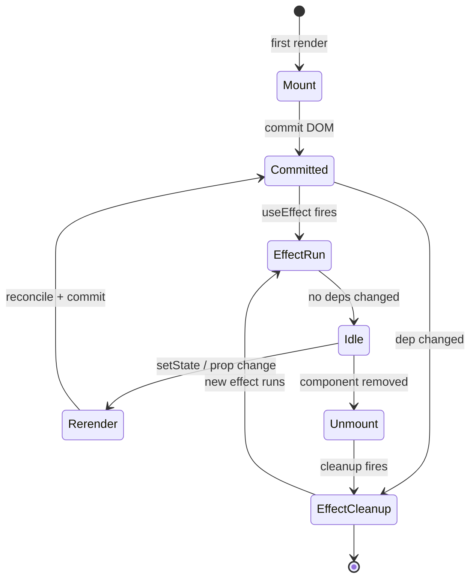
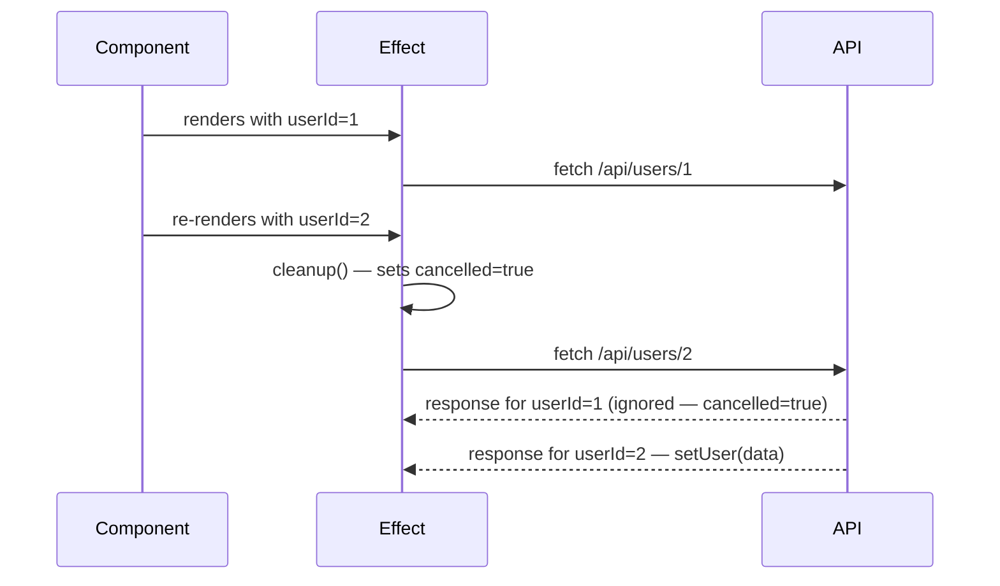
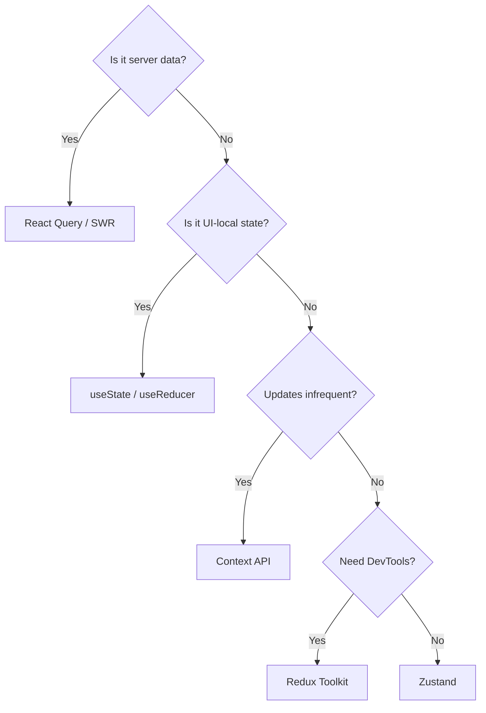

# 24 — JFI: React Module Depth (DEEP)

> **Executor:** AI coding agent.
> **Working directory:** `/Users/ravi.r_flx/IEProject/InterviewExplainer/`.
> **Type:** content writing in the existing `java-fullstack-intermediate`
> locked domain.

---

## §0 — Front-matter

```yaml
playbook:    24
version:     1.0
status:      ready
wave:        C
domain:      java-fullstack-intermediate
module:      react
q_target:    60
archetypes:  A:20 B:30 C:5 G:5
difficulty:  E:30 M:55 H:15
version_pins:
  react: "18.3"
  react_router: "6.22"
  typescript: "5.4"
  vite: "5.2"
  testing_library: "14.0"
  msw: "2.3"
  vitest: "1.5"
  spring_boot: "3.3"
```

---

## §1 — TL;DR

- **Input:** JFI domain exists; React module thin / outdated; needs to
  reflect React 18+ (concurrent rendering) and Java + React fullstack
  realism (not pure-frontend React).
- **Action:** Hit a 60-Q depth target with canonical questions tuned for
  Java backend devs who must own the frontend.
- **Output:** JFI React module ranks for "fullstack java react interview
  questions" and "java spring boot react interview questions".

---

## §2 — Hard prerequisites

- [ ] `java-fullstack-intermediate` is a known locked domain
      (verify: `rg "'java-fullstack-intermediate'" frontend/lib/content-reader.ts`).
- [ ] React module declared in `content/java-fullstack-intermediate/_index.json`.
- [ ] Playbook 12–17 (JBI pillars) DONE — JBI is the source we cross-link
      to for Spring-side answers.
- [ ] Scaffolder already created topic folder skeletons.

---

## §3 — Glossary

| Term | Definition |
| --- | --- |
| **JSX** | Syntax extension that compiles to `React.createElement()` calls; HTML-like syntax in `.tsx` files. |
| **Virtual DOM** | React's in-memory copy of the DOM; React diffs the virtual tree before committing changes to the real DOM. |
| **Reconciliation** | React's process of finding the diff between two virtual DOM trees and applying the minimum set of real DOM mutations. |
| **Fiber** | React's incremental reconciler (React 16+) that can pause, resume, and prioritise rendering work. |
| **Concurrent rendering** | React 18+ feature that lets React interrupt and resume renders, enabling transitions and deferred updates. |
| **hook** | A function whose name starts with `use` that lets function components use React state and lifecycle features. |
| **`useState`** | Hook that returns a state value and a setter; triggers a re-render when the setter is called with a new value. |
| **`useEffect`** | Hook for side effects (fetch, subscribe, sync DOM); runs after every render unless a dependency array gates it. |
| **`useMemo`** | Hook that memoizes an expensive computed value; recomputes only when a listed dependency changes. |
| **`useCallback`** | Hook that memoizes a function reference; re-creates the function only when listed dependencies change. |
| **`useRef`** | Hook that holds a mutable container that survives re-renders without causing one; also used for DOM refs. |
| **`useReducer`** | Hook for complex state transitions; accepts a `(state, action) => newState` reducer. |
| **stale closure** | Bug where a closure captures an old value of a variable from a previous render cycle. |
| **dependency array** | The second argument to `useEffect` / `useMemo` / `useCallback` listing values the hook depends on. |
| **`React.memo`** | HOC that memoizes a component; skips re-render if props are shallowly equal. |
| **`Suspense`** | Component boundary that shows a fallback while children are loading data or lazy-loading code. |
| **`lazy()`** | API that code-splits a component to a separate chunk loaded on demand. |
| **React Server Components (RSC)** | Components that render on the server with no JS shipped to the client; introduced in React 18 with framework support. |
| **transitions** | `useTransition` / `startTransition` — mark a state update as non-urgent so it doesn't block the UI. |
| **automatic batching** | React 18 feature that batches `setState` calls across `setTimeout`, `Promise`, and native events, reducing extra renders. |
| **Redux Toolkit (RTK)** | Official opinionated wrapper for Redux; includes `createSlice`, `createAsyncThunk`, and immer-based mutations. |
| **Context API** | React's built-in mechanism to pass data through the component tree without prop drilling. |
| **Zustand** | Lightweight state library using a closure-based store; no boilerplate, no Provider required. |
| **React Query** | Server-state management library; handles caching, deduplication, stale-while-revalidate for async data. |
| **React Router 6** | Declarative, component-based router for React; uses `<Routes>` / `<Route>` and the `useNavigate` hook. |
| **RTL (React Testing Library)** | Testing utilities built on `@testing-library/dom`; selects elements the way a user would. |
| **msw (Mock Service Worker)** | API mocking library that intercepts at the network layer (Service Worker in browser, `node:http` in Node). |
| **Vite** | Next-generation frontend build tool; native-ESM dev server + Rollup for production bundles. |
| **CORS** | Cross-Origin Resource Sharing — browser security policy governing cross-origin HTTP requests; configured on the Spring backend. |
| **JWT** | JSON Web Token — compact signed token for stateless authentication between the React SPA and Spring Boot API. |
| **SPA hosting** | Serving a React build from Spring Boot's `src/main/resources/static` so the frontend and API ship as one JAR. |

---

## §4 — Why this matters

React is the dominant **fullstack frontend stack at Java shops worldwide**
— Spring Boot + React is the single most-searched fullstack combo in
the US/UK/India job markets. Owning React content tuned for Java devs
(TypeScript-first, Spring-integration realistic) is a defensible wedge
because most React content online is JS-only and ignores backend
realities.

---

## §5 — Current state

- JFI `react` module may exist as a scaffold; topic folders may be empty.
- Where content exists, it likely targets React 16/17 (class components,
  legacy hooks) — modernise to React 18+ before adding new Qs.
- Cross-links to JBI `spring-boot` and `spring-security` may be missing.

---

## §6 — Target state (measurable)

- 60 Q across 9 topics with archetype mix 30/55/15 E/M/H.
- All examples React 18+ + TypeScript (no class components outside the comparison Q).
- ≥ 6 questions in `spring-boot-react-integration` topic with both Java AND TS code.
- Speakable lint module pass+warn ≥ 90 %.
- All 10 money comparisons live.

---

## §7 — Search phrases → topic map

| Search phrase | Owner topic |
| --- | --- |
| `react interview questions for java developers` | (module landing) |
| `react hooks interview questions` | `hooks-deep-dive` |
| `useeffect interview questions` | `hooks-deep-dive` |
| `usememo vs usecallback` | `hooks-deep-dive` / `comparisons` |
| `react state management interview questions` | `state-management` |
| `redux vs context api` | `state-management` / `comparisons` |
| `react performance optimization interview questions` | `performance` |
| `react server components interview questions` | `react-18-and-rsc` |
| `react testing library interview questions` | `testing-react` |
| `react router interview questions` | `routing-and-data-fetching` |
| `react with spring boot interview questions` | `spring-boot-react-integration` |

---

## §8 — Topic specification (target 60 Q)

| Topic slug | Min Q | Archetypes | Notes |
| --- | --- | --- | --- |
| `react-fundamentals` | 8 | A:5 B:3 | JSX, props, components, virtual DOM, reconciliation |
| `hooks-deep-dive` | 12 | A:6 B:5 C:1 | useState, useEffect deps, useMemo, useCallback, useRef, useReducer, custom hooks |
| `state-management` | 8 | A:3 B:5 | Context, Redux Toolkit, Zustand, React Query, when each |
| `performance` | 6 | A:2 B:3 C:1 | Re-render causes, memo, lazy + Suspense, code-splitting |
| `react-18-and-rsc` | 6 | A:4 B:2 | Automatic batching, transitions, RSC vs CSR vs SSR, Suspense data |
| `routing-and-data-fetching` | 5 | A:3 B:2 | React Router 6, Next.js basics, useQuery patterns |
| `testing-react` | 5 | A:2 B:2 C:1 | RTL, user-event, msw, vitest vs jest |
| `spring-boot-react-integration` | 6 | A:2 C:4 | CORS, JWT auth, SPA hosting from Spring, build pipeline |
| `comparisons` | 4 | B:4 | Hot pair comparisons |

---

## §9 — Execution steps

### Step 1 — Verify the React module is scaffolded

```bash
cd /Users/ravi.r_flx/IEProject/InterviewExplainer

# React module declared in JFI index
jq '.modules[] | select(.slug == "react")' \
  content/java-fullstack-intermediate/_index.json

# Topic folders exist
ls content/java-fullstack-intermediate/react/
```

Expected: 9 topic slugs present. If the module is missing, run the JFI
scaffolder (see playbook 21) before continuing.

**Verify:**
```bash
ls content/java-fullstack-intermediate/react/ | wc -l  # ≥ 9
```

---

### Step 2 — Audit existing content for staleness

React 16/17 patterns to purge before adding new Qs:

```bash
# Class component leaks (should only appear in the comparison Q)
rg -l 'class.*extends.*Component' \
  content/java-fullstack-intermediate/react/

# Legacy lifecycle names
rg -n 'componentDidMount\|componentWillReceiveProps\|componentWillMount' \
  content/java-fullstack-intermediate/react/

# JS files (all examples must be TypeScript)
find content/java-fullstack-intermediate/react -name '*.ts' -o -name '*.js' \
  | grep -v complete-qa.json
```

For each hit outside the `comparisons` topic: open the file, rewrite the
example as a function component with hooks.

**Verify:**
```bash
rg 'class.*extends.*Component' \
  content/java-fullstack-intermediate/react/ --ignore-case | wc -l
# Expected: lines only from react/comparisons/complete-qa.json
```

---

### Step 3 — Write `react-fundamentals` (8 Q)

Cover: JSX mechanics, props vs state, virtual DOM, reconciliation key
prop, component purity, React 18 strict-mode double-invoke.

Classic bugs to name in this topic:
- **"The classic bug is using array index as the `key` prop."** With
  `key={index}`, React reuses DOM nodes across reorders, causing stale
  input values, animation glitches, and missed mount effects. Use a
  stable identifier from the data.
- **"The classic bug is mutating state directly (`state.count++`).**
  React compares object references to detect changes; mutation bypasses
  the setter and silently prevents re-render."

```bash
# After writing, validate
python3 scripts/validate_qa.py \
  content/java-fullstack-intermediate/react/react-fundamentals/complete-qa.json

python3 scripts/audit_speakable.py \
  --topic react-fundamentals --module react --report
```

---

### Step 4 — Write `hooks-deep-dive` (12 Q)

Must-have Qs:
1. `useEffect` dependency array mechanics (see §10 worked example)
2. Stale closure in `useEffect` + `useRef` escape hatch
3. `useMemo` vs `useCallback` — when each
4. `useReducer` vs `useState` — when each
5. Custom hook rules and the `use` prefix contract
6. Cleanup function — what it is, when React calls it
7. `useRef` for DOM access vs mutable value storage
8. Batching in React 18 automatic batching
9. `useTransition` — what it does and when to use it
10. `useId` — why it exists and how it prevents hydration mismatches
11. Race condition in `useEffect` + cancellation pattern
12. Infinite loop in `useEffect` — how it happens, how to fix

**The #1 trap is the exhaustive-deps lint violation.** When developers
ignore the ESLint `react-hooks/exhaustive-deps` rule to "avoid re-runs",
they produce stale closures that read first-render values for the
lifetime of the component. The fix is to either include the dep, wrap
a stable value in `useRef`, or use `useCallback`/`useMemo` to memoize
what the effect reads.

```bash
python3 scripts/validate_qa.py \
  content/java-fullstack-intermediate/react/hooks-deep-dive/complete-qa.json

# Speakable check — summaries must be ≤ 320 chars
python3 scripts/audit_speakable.py \
  --topic hooks-deep-dive --module react --report
```

---

### Step 5 — Write `state-management` (8 Q)

Lead with the decision rule: *use Context when state is global and
updates are infrequent (theme, auth user, locale). Use Redux Toolkit
when updates are frequent, need middleware (thunks/sagas), or require
DevTools time-travel. Use Zustand when you want Redux-level power
without the boilerplate. Use React Query when the state is server data.*

Money comparison to include:
- `Redux Toolkit vs Context API vs Zustand` — comparison_table with
  columns: bundle size, DevTools, boilerplate, re-render control,
  async support.

```bash
python3 scripts/validate_qa.py \
  content/java-fullstack-intermediate/react/state-management/complete-qa.json
```

---

### Step 6 — Write `performance` (6 Q)

Must-have Qs:
1. What triggers a re-render in React?
2. `React.memo` — what it does, when it helps, when it doesn't
3. `useMemo` for expensive computation
4. `useCallback` for stable function props
5. `lazy` + `Suspense` for code-splitting
6. `React.Profiler` and the React DevTools Profiler — how to identify
   slow components

**The classic bug is wrapping every component in `React.memo` and every
function in `useCallback` "for performance".** This adds shallow-equality
checks on every render; for cheap components the overhead exceeds the
saving. Profile first with React DevTools Profiler; memo only what the
profiler shows as a bottleneck.

---

### Step 7 — Write `react-18-and-rsc` (6 Q)

Cover: automatic batching, `startTransition`, streaming SSR with
`renderToPipeableStream`, React Server Components vs client components,
`use()` hook, `Suspense` for data.

Lead with the decision rule: *Use RSC when the component fetches from a
database or filesystem and needs no interactivity — it ships zero JS to
the client. Use client components (`'use client'`) when the component
needs event handlers, browser APIs, or React hooks.*

---

### Step 8 — Write `routing-and-data-fetching` (5 Q)

Target React Router 6 API: `<Routes>`, `<Route>`, nested routes,
`useNavigate`, `useParams`, `useSearchParams`, `loader` functions.

Also cover React Query `useQuery` / `useMutation` as the recommended
data-fetching layer over raw `useEffect` + `fetch`.

---

### Step 9 — Write `testing-react` (5 Q)

Must-have Qs:
1. RTL's `getBy` vs `queryBy` vs `findBy` queries — when each
2. `userEvent` vs `fireEvent` — why userEvent is preferred
3. msw (Mock Service Worker) setup for integration tests
4. Async rendering — `waitFor`, `screen.findBy`
5. `vitest` vs `jest` for a Vite + React project

---

### Step 10 — Write `spring-boot-react-integration` (6 Q)

Mandatory Java + TS dual-code coverage:

1. **CORS config on Spring Boot** — `@CrossOrigin` vs `CorsRegistry` in
   `WebMvcConfigurer`. Show the `allowedOrigins` pattern for
   `http://localhost:5173` (Vite dev server).
2. **JWT auth flow** — Spring Security `JwtFilter` + React Axios
   interceptor that attaches `Authorization: Bearer <token>`.
3. **Proxy in Vite dev** — `vite.config.ts` `server.proxy` to forward
   `/api/**` to `http://localhost:8080`.
4. **SPA hosting from Spring** — `src/main/resources/static`,
   `ResourceHandlerRegistry` catch-all for `/**` returning `index.html`.
5. **Environment variables** — `import.meta.env.VITE_API_URL` in React,
   `@Value("${api.cors.allowed-origins}")` in Spring.
6. **Build pipeline** — `npm run build` → `dist/` → Maven copy plugin
   into `src/main/resources/static` for single-JAR deployment.

```bash
# Verify dual-code presence
rg -l 'java\|Spring\|@Bean' \
  content/java-fullstack-intermediate/react/spring-boot-react-integration/complete-qa.json
```

---

### Step 11 — Write `comparisons` (4 Q)

From the money comparisons list, the four that best suit archetype B:
1. `useMemo vs useCallback`
2. `Redux vs Context API vs Zustand`
3. `Server-side rendering vs client-side rendering vs static generation`
4. `React Server Components vs traditional components`

Each comparison Q must open with *"Use X when … ; use Y when …"* per
voice rule §2 of `_VOICE-RULES.md`.

---

### Step 12 — Module-level lint

```bash
cd /Users/ravi.r_flx/IEProject/InterviewExplainer

# Q count
find content/java-fullstack-intermediate/react \
  -name complete-qa.json \
  -exec jq '.questions | length' {} \; \
  | awk '{s+=$1} END {print "Total Q:", s}'
# Expected: ≥ 60

# Speakable audit
python3 scripts/audit_speakable.py \
  --module react \
  --domain java-fullstack-intermediate \
  --report
# Expected: pass+warn ≥ 90 %

# Schema validation
find content/java-fullstack-intermediate/react -name complete-qa.json \
  | xargs -I{} python3 scripts/validate_qa.py {}

# Banned words
rg -ni 'leverage|utilize|seamless|robust|holistic|paradigm|battle-tested|enterprise-grade' \
  content/java-fullstack-intermediate/react/
# Expected: zero matches
```

---

## §10 — Reference Q JSON

Paste into `hooks-deep-dive/complete-qa.json`:

```json
{
  "id": "use-effect-dependency-array",
  "slug": "use-effect-dependency-array",
  "title": "What is the dependency array in useEffect and how does it work?",
  "question": "What is the dependency array in useEffect and how does it work?",
  "difficulty": "medium",
  "importance": "critical",
  "archetype": "A",
  "reading_time_minutes": 4,
  "last_updated": "2024-06-01",
  "interviewer_intent": "Tests whether the candidate understands React's render-cycle model and the rules for side-effect dependencies — the most common source of React bugs.",
  "company_tags": ["Meta", "Airbnb", "Shopify", "Netflix", "Stripe"],
  "direct_answer": "The dependency array is the second argument to `useEffect`. React re-runs the effect whenever any listed value is referentially different from the previous render. **Empty array** → run only on mount. **Omit array** → run after every render. **Non-empty array** → run when any listed dep changes.",
  "layout_type": "concept",
  "tags": ["react", "hooks", "useEffect", "side-effects"],
  "order": 3,
  "seo": {
    "title": "useEffect dependency array — React hooks interview question",
    "description": "What the dependency array in useEffect does, how React compares deps, and the stale closure bug caused by missing deps."
  },
  "answer": {
    "sections": [
      {
        "kind": "headline",
        "value": "The dependency array tells React which values the effect reads from props or state; React re-runs the effect whenever any of those values is referentially different from the previous render."
      },
      {
        "kind": "why",
        "value": "Effects are how function components do side work — fetching, subscribing, syncing the DOM. Without a deps array the effect runs after every render; with an empty deps array it runs only once (after mount). The non-empty deps array lets you opt in to the values the effect cares about, so React can skip work when nothing changed."
      },
      {
        "kind": "code",
        "language": "typescript",
        "value": "function UserCard({ userId }: { userId: string }) {\n  const [user, setUser] = useState<User | null>(null);\n\n  useEffect(() => {\n    let cancelled = false;\n    fetch(`/api/users/${userId}`)\n      .then(r => r.json())\n      .then(data => { if (!cancelled) setUser(data); });\n    return () => { cancelled = true; }; // cleanup on dep change or unmount\n  }, [userId]); // re-runs only when userId changes\n\n  return user ? <h2>{user.name}</h2> : <p>Loading…</p>;\n}"
      },
      {
        "kind": "pitfall",
        "value": "The classic bug is omitting a dep that the effect reads — the ESLint `react-hooks/exhaustive-deps` rule flags this. You get a stale closure: the effect captures the first-render value and silently ignores every later change. Don't suppress the lint rule; if re-running the effect is expensive, memoize the dep instead."
      },
      {
        "kind": "tradeoffs",
        "value": "If you need the latest value without re-running, store it in a `useRef` and read `ref.current` inside the effect. If the effect reads an object/array that is re-created every render, wrap it in `useMemo` so the reference stays stable."
      },
      {
        "kind": "followups",
        "value": [
          "What is a stale closure in useEffect and how do you fix it?",
          "When would you use useLayoutEffect instead of useEffect?",
          "How would you cancel an in-flight fetch when the dependency changes?",
          "Why does the empty dependency array cause bugs when the effect reads props?"
        ]
      }
    ]
  },
  "speakable": {
    "summary": "The useEffect dependency array tells React which values the effect reads. React re-runs the effect when any listed value is referentially different from the previous render. Empty array runs only on mount; omitting the array runs after every render.",
    "isCanonical": true
  }
}
```

---

## §11 — Diagrams

### 11.1 — React render lifecycle (stateDiagram-v2)



### 11.2 — useEffect cleanup for async fetch (sequenceDiagram)



### 11.3 — State management decision tree (flowchart)



---

## §12 — Voice rules

Opens from `_VOICE-RULES.md` (locked source of truth). Three
React-module-specific examples:

| ✅ JBI voice | ❌ Textbook voice |
| --- | --- |
| "The classic bug is omitting a dep that the effect reads. The ESLint `react-hooks/exhaustive-deps` rule flags this; ignore it and you get a stale closure that silently reads the first-render value." | "Be careful with the dependency array; missing dependencies can cause bugs." |
| "Use Context when state is global and updates are infrequent. Use Redux Toolkit when updates are frequent, need middleware, or require DevTools time-travel. Use Zustand when you want Redux-level power without the boilerplate." | "Context, Redux, and Zustand are all state management solutions for React." |
| "React 18 (March 2022) introduced automatic batching — `setState` calls inside `setTimeout` and native events now batch, reducing extra re-renders." | "React 18 has improved batching behavior." |

Additional module rules:
- Every hook explanation must include a concrete TypeScript example with
  explicit types (no `any`, no implicit `any` from missing annotations).
- Every `useEffect` example must include a cleanup function or explicitly
  state why no cleanup is needed.
- Every comparison Q must open with *"Use X when …; use Y when …"* before
  defining either option.

---

## §13 — Anti-patterns checklist

| Anti-pattern | Why it fails | Fix |
| --- | --- | --- |
| Array index as `key` prop | Causes DOM node reuse across reorders → stale input values, missed mount effects | Use stable data ID as key |
| Mutating state directly | React compares references; mutation skips setter → no re-render | Always call the setter function |
| Missing `useEffect` cleanup for subscriptions | Memory leak; component receives events after unmount | Return cleanup function that unsubscribes |
| Ignoring exhaustive-deps lint warning | Stale closure silently reads first-render values | Fix deps or use `useRef` escape hatch |
| Wrapping every component in `React.memo` | Adds shallow-comparison overhead on cheap components | Profile first; memo only measured bottlenecks |
| Passing inline objects/arrays as props to memoized component | New reference each render defeats `React.memo` | Memoize with `useMemo`; define constants outside component |
| Class component examples in modern content | Signals stale knowledge in interviews | Rewrite as function component with hooks |
| Missing `Suspense` fallback around `lazy()` | Throws uncaught promise | Always wrap `lazy()` in `<Suspense fallback={…}>` |
| Fetching in `useEffect` without abort | In-flight request writes to unmounted component state → React warning | Cancel with `AbortController` or boolean flag |

---

## §14 — Money Q checklist

All 10 must exist as questions in the module:

- [ ] `React class components vs function components`
- [ ] `useEffect vs useLayoutEffect`
- [ ] `useMemo vs useCallback`
- [ ] `Redux vs Context API vs Zustand`
- [ ] `Server-side rendering vs client-side rendering vs static generation`
- [ ] `React Server Components vs traditional components`
- [ ] `useState vs useReducer`
- [ ] `Controlled vs uncontrolled components`
- [ ] `CRA vs Vite vs Next.js`
- [ ] `Jest vs Vitest`

Verify:
```bash
rg -i 'useMemo.*useCallback\|useCallback.*useMemo' \
  content/java-fullstack-intermediate/react/ | head -3
# Each comparison Q slug should match the list above
```

---

## §15 — Regression tests

After any content edit:

```bash
cd /Users/ravi.r_flx/IEProject/InterviewExplainer

# 1. Schema
find content/java-fullstack-intermediate/react -name complete-qa.json \
  | xargs -I{} python3 scripts/validate_qa.py {}

# 2. Speakable ≤ 320 chars check (included in audit)
python3 scripts/audit_speakable.py \
  --module react --domain java-fullstack-intermediate --report

# 3. Banned word grep
rg -ni 'leverage|utilize|seamless|robust|holistic|paradigm|battle-tested' \
  content/java-fullstack-intermediate/react/

# 4. No free-floating `any` outside the comparison topic
rg ': any\b' content/java-fullstack-intermediate/react/ \
  --ignore-path '*/comparisons/*'

# 5. Class component leak check
rg 'class.*extends.*Component' content/java-fullstack-intermediate/react/ \
  | grep -v '/comparisons/'
# Expected: zero matches
```

---

## §16 — Cross-link map

JFI React → JBI cross-links (mandatory):

| JFI React topic | Cross-links into JBI |
| --- | --- |
| `spring-boot-react-integration` | `spring-boot/spring-boot-basics`, `spring-security/jwt-auth` |
| `testing-react` | `testing/spring-boot-testing` |
| `routing-and-data-fetching` | `spring-mvc/rest-controllers` |

Verify:
```bash
rg -c '/interview/java-backend-intermediate' \
  content/java-fullstack-intermediate/react/ | awk -F: '$2>0'
```

---

## §17 — Rollout notes

- Do not flip the React module to `visible: true` in `_index.json` until
  all 9 topics have content and Step 12 lint passes.
- If the module is already visible and being edited, set a `last_updated`
  field on each file to today's date.
- Commit cadence: `content(jfi/react/<topic>): +N questions` per ~10 Q.

---

## §18 — Quality gates

| Gate | Threshold | Verify with |
| --- | --- | --- |
| React module Q count | ≥ 60 | `find content/java-fullstack-intermediate/react -name complete-qa.json -exec jq '.questions\|length' {} \; \| awk '{s+=$1} END {print s}'` |
| All 10 money comparisons live | 10 of 10 | manual grep |
| Class components only in comparison Q | yes | `rg 'class.*extends Component' content/java-fullstack-intermediate/react/` → only comparisons/ |
| No free-floating `any` | 0 | `rg ': any\b' content/java-fullstack-intermediate/react/ --ignore-path '*/comparisons/*'` |
| Speakable module pass+warn | ≥ 90 % | `python3 scripts/audit_speakable.py --module react --report` |
| Spring Boot integration topic has ≥ 6 Q with Java AND TS code | ≥ 6 | jq + manual |
| `00-INDEX.md` row for `24` | DONE | manual |

---

## Definition of Done

- [ ] React module ≥ 60 Q at archetype + difficulty mix.
- [ ] All 10 money comparisons live.
- [ ] `spring-boot-react-integration` topic has ≥ 6 Q with realistic
      examples (CORS, JWT, SPA hosting).
- [ ] Speakable lint ≥ 90 % pass+warn.
- [ ] No class components outside the comparison Q.
- [ ] `00-INDEX.md` row for `24` flipped to `DONE`.

## Estimated effort

- **Ideal:** 24 hours.
- **Hard stop:** 36 hours.