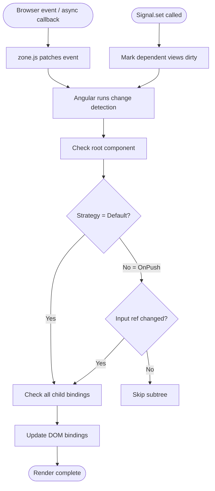
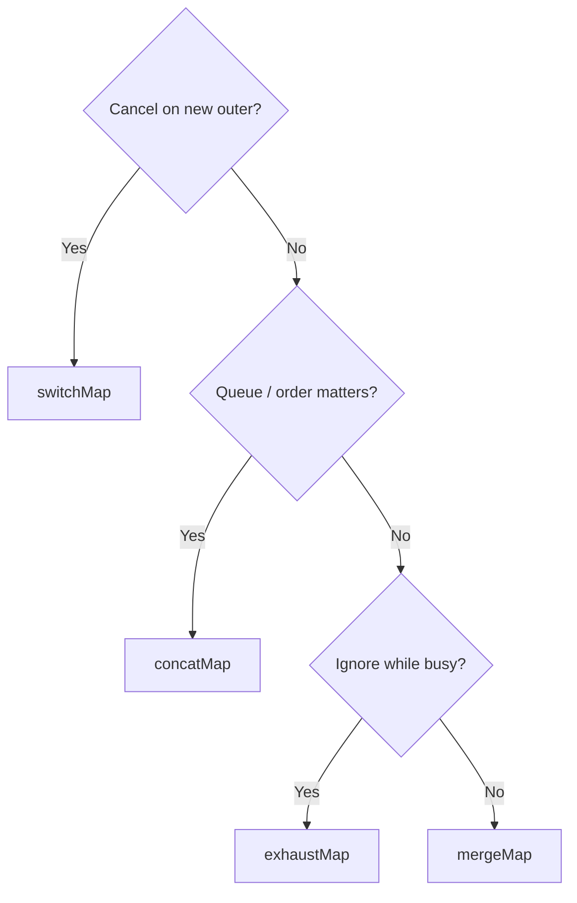
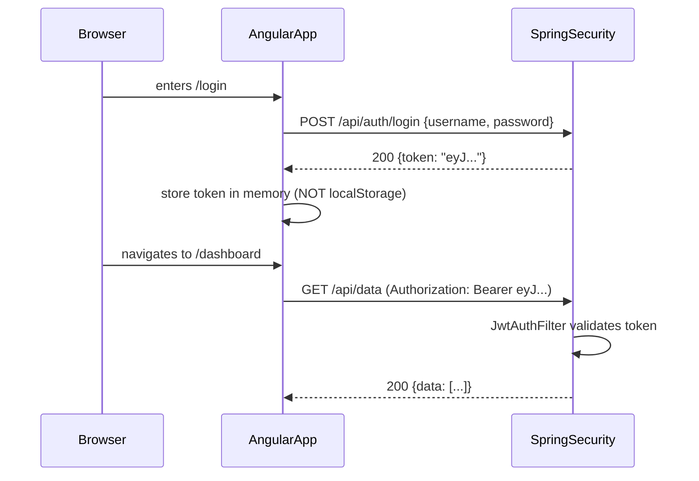

# 25 — JFI: Angular Module Depth (DEEP)

> **Executor:** AI coding agent.
> **Working directory:** `/Users/ravi.r_flx/IEProject/InterviewExplainer/`.
> **Type:** content writing in `java-fullstack-intermediate / angular`.

---

## §0 — Front-matter

```yaml
playbook:    25
version:     1.0
status:      ready
wave:        C
domain:      java-fullstack-intermediate
module:      angular
q_target:    50
archetypes:  A:18 B:25 C:5 G:2
difficulty:  E:30 M:55 H:15
version_pins:
  angular: "17.3"
  rxjs: "7.8"
  typescript: "5.4"
  zone_js: "0.14"
  angular_cdk: "17.3"
  spring_boot: "3.3"
  ngrx: "17.2"
```

---

## §1 — TL;DR

- **Input:** Angular module thin; Indian / European Java enterprise market
  is heavily Angular (vs React-dominant US market). Strategic to do well.
- **Action:** 50-Q depth target for Angular 17+ (signals, standalone APIs,
  control flow `@if/@for/@switch`).
- **Output:** Ranks for "angular interview questions for java developers"
  and "java spring boot angular interview questions".

---

## §2 — Hard prerequisites

- [ ] `java-fullstack-intermediate` exists (verify: `rg "'java-fullstack-intermediate'" frontend/lib/content-reader.ts`).
- [ ] `angular` module declared in JFI `_index.json`.
- [ ] Playbook 12–17 (JBI pillars) DONE — for Spring-side cross-links.
- [ ] Playbook 24 (React module) at least scaffolded (TS definitions shared).

---

## §3 — Glossary

| Term | Definition |
| --- | --- |
| **Component** | Decorated TypeScript class (`@Component`) with a template and optional styles; the basic UI building block in Angular. |
| **standalone component** | Angular 14+ component that does not belong to an `NgModule`; imports its own dependencies directly. Angular 17 makes standalone the default. |
| **NgModule** | Pre-17 Angular container that declares components, imports other modules, and specifies providers; still valid but no longer the default. |
| **`@if / @for / @switch`** | Angular 17+ built-in template control flow syntax that replaces structural directives `*ngIf / *ngFor`. |
| **change detection** | Angular's mechanism to check component bindings for changes and update the DOM. Runs by default on every browser event via zone.js. |
| **zone.js** | Library that monkey-patches browser async APIs to notify Angular when async work completes, triggering change detection. |
| **OnPush** | `ChangeDetectionStrategy.OnPush` — instructs Angular to check a component only when an `@Input` reference changes, an event fires inside the component, or `markForCheck()` / `detectChanges()` is called. |
| **signal** | Angular 16+ fine-grained reactive primitive: a getter function that tracks its dependencies and notifies subscribers synchronously when updated. |
| **`computed()`** | Angular signal that derives a value from other signals; recalculates only when a source signal changes. |
| **`effect()`** | Angular side-effect primitive that runs whenever the signals it reads change; equivalent to `useEffect` but signal-based. |
| **`toSignal()` / `toObservable()`** | Interop utilities from `@angular/core/rxjs-interop` to convert between RxJS Observables and Angular signals. |
| **Observable** | RxJS lazy push-based data stream; can emit zero or more values asynchronously. |
| **Subject** | Observable that is also an Observer; emits values by calling `.next()`. |
| **BehaviorSubject** | Subject that holds the latest value and replays it to new subscribers. |
| **ReplaySubject(n)** | Subject that buffers the last `n` values and replays them to new subscribers. |
| **AsyncSubject** | Subject that emits only the last value, and only on `complete()`. |
| **pipe()** | RxJS composition API: `observable.pipe(op1, op2, …)` — chains operators without mutating the source. |
| **`switchMap`** | RxJS operator that cancels the inner Observable when a new outer value arrives; the correct operator for autocomplete / search. |
| **`mergeMap`** | RxJS operator that subscribes to every inner Observable concurrently; use for parallel HTTP calls. |
| **`concatMap`** | RxJS operator that queues inner Observables and subscribes to each only after the previous completes. |
| **Dependency Injection (DI)** | Angular's built-in IoC container; services are registered via `providedIn` or `providers` and injected by type token. |
| **`providedIn: 'root'`** | Service registration that creates a singleton at the application root injector. |
| **InjectionToken** | Typed token for injecting non-class values (strings, functions, config objects). |
| **guard** | Angular Router hook (`CanActivate`, `CanDeactivate`, `CanMatch`) that runs before navigation. |
| **resolver** | Angular Router hook that pre-fetches data before a route activates. |
| **lazy loading** | Loading a route's module/component bundle only when the route is navigated to; reduces initial bundle size. |
| **reactive forms** | Angular form model created in TypeScript (`FormControl`, `FormGroup`, `FormArray`); all validation and state tracked in code. |
| **template-driven forms** | Angular form model built via `ngModel` directives in the template; simpler but harder to test and share. |
| **CORS** | Cross-Origin Resource Sharing; configured on the Spring Boot backend (`CorsRegistry`) to allow the Angular dev server origin. |
| **proxy.conf.json** | Angular CLI configuration file that proxies `/api/**` requests to the Spring Boot backend during local development. |
| **deferrable views (`@defer`)** | Angular 17+ syntax that lazily loads a block of the template when a trigger condition is met (viewport, interaction, timer). |

---

## §4 — Why this matters

Angular is the **dominant fullstack frontend stack at Java enterprises**
in India, Europe, and finance — Spring Boot + Angular is the canonical
stack at most banks, insurers, and large IT services firms. Owning
Angular 17+ content (signals, standalone APIs, control flow) tuned
for Java backend devs is a high-RPM SEO surface where the competing
content online is overwhelmingly stale (Angular 8–12 era).

---

## §5 — Current state

- JFI `angular` module is a scaffold; topic folders likely empty.
- Public Angular interview content online targets pre-17 era — fresh
  content is a clear differentiation lever.
- Cross-links from `spring-boot-angular-integration` to JBI
  `spring-boot` and `spring-security` may be missing.

---

## §6 — Target state (measurable)

- 50 Q across 10 topics with archetype mix 30/55/15 E/M/H.
- All examples Angular 17+ standalone components + signals.
  NgModules only in the explicit comparison Q.
- ≥ 5 questions in `spring-boot-angular-integration` topic with both
  Java AND TypeScript code.
- Speakable lint module pass+warn ≥ 90 %.
- All 8 money comparisons live.

---

## §7 — Search phrases → topic map

| Search phrase | Owner topic |
| --- | --- |
| `angular interview questions for java developers` | (module landing) |
| `angular signals interview questions` | `signals-and-reactivity` |
| `rxjs interview questions` | `rxjs-and-observables` |
| `angular forms interview questions` | `forms` |
| `angular routing interview questions` | `routing` |
| `angular dependency injection interview questions` | `di-and-services` |
| `change detection interview questions angular` | `change-detection` |
| `angular standalone components` | `standalone-and-modern-angular` |
| `angular vs react` | `comparisons` |
| `angular with spring boot` | `spring-boot-angular-integration` |

---

## §8 — Topic specification (target 50 Q)

| Topic slug | Min Q | Archetypes | Notes |
| --- | --- | --- | --- |
| `angular-fundamentals` | 6 | A:4 B:2 | Component, template, NgModule legacy vs standalone |
| `standalone-and-modern-angular` | 6 | A:4 B:2 | Angular 17+ control flow `@if/@for`, deferrable views, hydration |
| `di-and-services` | 6 | A:4 B:2 | `providedIn: 'root'`, hierarchical injectors, `InjectionToken` |
| `change-detection` | 6 | A:3 B:3 | Default vs OnPush, zone.js, signals impact |
| `signals-and-reactivity` | 6 | A:3 B:3 | `signal`, `computed`, `effect`, signals + RxJS interop |
| `rxjs-and-observables` | 8 | A:4 B:4 | Subject types, operators, error handling, hot vs cold |
| `forms` | 5 | A:2 B:3 | Template-driven vs reactive, validators, async validators |
| `routing` | 4 | A:2 B:2 | Guards, resolvers, lazy loading |
| `spring-boot-angular-integration` | 5 | A:1 C:4 | CORS, JWT, `proxy.conf.json`, build to Spring static |
| `comparisons` | 4 | B:4 | Hot pair comparisons |

---

## §9 — Execution steps

### Step 1 — Verify Angular module is scaffolded

```bash
cd /Users/ravi.r_flx/IEProject/InterviewExplainer

jq '.modules[] | select(.slug == "angular")' \
  content/java-fullstack-intermediate/_index.json

ls content/java-fullstack-intermediate/angular/
```

Expected: 10 topic folder slugs. If missing, run the JFI scaffolder
(playbook 21) first.

**Verify:**
```bash
ls content/java-fullstack-intermediate/angular/ | wc -l  # ≥ 10
```

---

### Step 2 — Audit existing content for Angular pre-17 patterns

```bash
# NgModule usage outside the comparison Q (should be zero)
rg -l '@NgModule' content/java-fullstack-intermediate/angular/ \
  | grep -v '/comparisons/'

# Chained RxJS operators (pre-RxJS 6 style) — should be zero
rg -n '\.(map|filter|catchError)\.' \
  content/java-fullstack-intermediate/angular/

# Structural directives outside fundamentals/comparison
rg -n '\*ngIf\|\*ngFor\|\*ngSwitch' \
  content/java-fullstack-intermediate/angular/ \
  | grep -v 'angular-fundamentals\|comparisons'
```

Rewrite any matches to use Angular 17+ `@if`/`@for`/`@switch` and
standalone components.

---

### Step 3 — Write `angular-fundamentals` (6 Q)

Cover: component anatomy, `@Input` / `@Output`, template binding syntax,
pipes, ViewChild, content projection (`ng-content`).

**The classic bug is forgetting to declare a component in an NgModule
(or import it in the standalone component's `imports` array) and getting
a blank element with no error.** Angular silently ignores unknown elements
unless `CUSTOM_ELEMENTS_SCHEMA` is absent. Fix: check the browser console
for "NG0304: ComponentA is not a known element" and add the component to
`imports`.

```bash
python3 scripts/validate_qa.py \
  content/java-fullstack-intermediate/angular/angular-fundamentals/complete-qa.json
```

---

### Step 4 — Write `standalone-and-modern-angular` (6 Q)

Must-have Qs:
1. What are standalone components and why Angular 17 made them the default
2. `@if` / `@for` / `@switch` vs `*ngIf` / `*ngFor` — comparison
3. `@defer` — deferrable views and trigger conditions
4. Angular 17 partial hydration — what changes and when it helps
5. Migrating an `NgModule`-based app to standalone — strategy
6. `provideRouter()` vs `RouterModule.forRoot()` in standalone context

---

### Step 5 — Write `di-and-services` (6 Q)

Lead with the decision rule: *Use `providedIn: 'root'` when the service
is a singleton shared across the app (HTTP clients, auth, logging). Use
component-level `providers` when each component instance needs its own
service instance (e.g. a form-scoped validator). Use `InjectionToken`
when injecting primitives (string config, factory functions).*

**The #1 DI trap is providing a service at the component level by
accident — listing a singleton service in `providers: [MyService]` inside
a component creates a new instance for that subtree, silently breaking
shared state.** The `providedIn: 'root'` metadata approach avoids this:
the service is tree-shakable and always singleton.

---

### Step 6 — Write `change-detection` (6 Q)

Must-have Qs:
1. How Angular's default change detection works (zone.js + dirty-check)
2. `ChangeDetectionStrategy.OnPush` — what triggers a check
3. `markForCheck()` vs `detectChanges()` — when each
4. How signals reduce the need for `zone.js`
5. Zoneless Angular (Angular 17 experimental) — what it means
6. `async` pipe and why it auto-unsubscribes

**The classic bug is triggering change detection inside a `NgZone.runOutsideAngular()` callback and then updating a component property — the view doesn't update.** Call `this.cdr.markForCheck()` when you update a bound property from outside Angular's zone.

---

### Step 7 — Write `signals-and-reactivity` (6 Q)

See §10 for the worked example Q (`what-is-an-angular-signal`).

Other must-have Qs:
1. `signal` vs `BehaviorSubject` (see worked example)
2. `computed()` — when it recalculates, how it avoids circular deps
3. `effect()` — lifecycle, cleanup, when to use vs when to avoid
4. `toSignal()` — converting an Observable to a signal in a template
5. Signal-based component with `input()` and `output()` (Angular 17.1+)
6. Signals + `OnPush` — why signals make `OnPush` simpler

---

### Step 8 — Write `rxjs-and-observables` (8 Q)

Must-have Qs:
1. Hot vs cold Observable — definition, examples of each
2. `Subject` vs `BehaviorSubject` vs `ReplaySubject` vs `AsyncSubject`
3. `switchMap` vs `mergeMap` vs `concatMap` vs `exhaustMap`
4. Error handling in RxJS — `catchError`, `retry`, `retryWhen`
5. Memory leak from unsubscribed Observables — detection and fix
6. `takeUntilDestroyed()` (Angular 16+) — replacing `ngOnDestroy` unsubscribe
7. `combineLatest` vs `forkJoin` vs `zip`
8. `share` vs `shareReplay` — when each

**The classic bug is subscribing to an Observable in `ngOnInit` without
unsubscribing, then navigating away and back — the subscription
accumulates, calling the callback twice, four times, eight times.** Use
`takeUntilDestroyed()` (Angular 16+) or the `async` pipe to auto-unsubscribe.

---

### Step 9 — Write `forms` (5 Q)

Lead with the decision rule: *Use reactive forms when the form is complex
(dynamic fields, async validation, sharing the form model between
components, unit testing). Use template-driven forms only for simple,
static forms where no TypeScript logic is needed.*

Comparison Q must include a table:

| Dimension | Reactive | Template-driven |
| --- | --- | --- |
| Model location | TypeScript | Template (`ngModel`) |
| Testability | Unit-testable without DOM | Requires TestBed |
| Dynamic fields | `FormArray` — easy | Manual `ngModel` juggling |
| Async validators | First-class | Supported but verbose |

---

### Step 10 — Write `routing` (4 Q)

Cover: `CanActivate` guard (function guard in Angular 14+), route
resolver, lazy-loaded routes with `loadComponent`, `loadChildren`, route
params with `ActivatedRoute`, scroll restoration.

---

### Step 11 — Write `spring-boot-angular-integration` (5 Q)

Mandatory Java + TypeScript dual-code coverage:

1. **CORS on Spring Boot** — `WebMvcConfigurer.addCorsMappings()` to allow
   `http://localhost:4200`. Show Java code + Angular `HttpClient` call.
2. **JWT auth** — Spring Security `JwtAuthFilter` + Angular `HttpInterceptor`
   that attaches `Authorization: Bearer <token>`.
3. **`proxy.conf.json`** for Angular CLI dev server:
   ```json
   { "/api": { "target": "http://localhost:8080", "changeOrigin": true } }
   ```
4. **Production build to Spring static** — `ng build --output-path
   src/main/resources/static` → serve from Spring Boot.
5. **Environment configuration** — `environment.ts` API URL vs
   `@Value("${angular.api.base-url}")` in Spring, wired via CI env vars.

```bash
rg -l 'java\|Spring\|@Bean' \
  content/java-fullstack-intermediate/angular/spring-boot-angular-integration/complete-qa.json
```

---

### Step 12 — Write `comparisons` (4 Q)

1. `Angular vs React vs Vue` — archetype B
2. `Template-driven forms vs reactive forms` — archetype B
3. `Default change detection vs OnPush` — archetype B
4. `Signals vs RxJS observables` — archetype B

Each must open with *"Use X when … ; use Y when …"*.

---

### Step 13 — Module-level lint

```bash
cd /Users/ravi.r_flx/IEProject/InterviewExplainer

# Q count
find content/java-fullstack-intermediate/angular \
  -name complete-qa.json \
  -exec jq '.questions | length' {} \; \
  | awk '{s+=$1} END {print "Total Q:", s}'
# Expected: ≥ 50

# Speakable audit
python3 scripts/audit_speakable.py \
  --module angular \
  --domain java-fullstack-intermediate \
  --report
# Expected: pass+warn ≥ 90 %

# NgModule leak check
rg '@NgModule' content/java-fullstack-intermediate/angular/ \
  | grep -v '/comparisons/'
# Expected: zero matches

# Chained RxJS operators (must be zero)
rg -n '\.(map|filter|catchError)\.' \
  content/java-fullstack-intermediate/angular/

# Banned words
rg -ni 'leverage|utilize|seamless|robust|holistic|paradigm|battle-tested' \
  content/java-fullstack-intermediate/angular/
```

---

## §10 — Reference Q JSON

Paste into `signals-and-reactivity/complete-qa.json`:

```json
{
  "id": "what-is-an-angular-signal",
  "slug": "what-is-an-angular-signal",
  "title": "What is an Angular signal and how does it differ from a BehaviorSubject?",
  "question": "What is an Angular signal and how does it differ from a BehaviorSubject?",
  "difficulty": "medium",
  "importance": "critical",
  "archetype": "B",
  "reading_time_minutes": 4,
  "last_updated": "2024-06-01",
  "interviewer_intent": "Tests whether the candidate understands Angular 17's new reactivity model vs the RxJS push-based model that dominated Angular for years.",
  "company_tags": ["Google", "Accenture", "Infosys", "TCS", "Capgemini"],
  "direct_answer": "**Use signals for UI-bound state and derived values.** A signal is a synchronous reactive primitive that holds a value and triggers fine-grained change detection. **Use BehaviorSubject for cross-component async event streams** where you need RxJS operators. Interop via `toSignal()` and `toObservable()`.",
  "layout_type": "comparison",
  "tags": ["angular", "signals", "rxjs", "reactivity", "change-detection"],
  "order": 1,
  "seo": {
    "title": "Angular signal vs BehaviorSubject — interview question",
    "description": "When to use Angular signals vs RxJS BehaviorSubject, with comparison table and Angular 17 code examples."
  },
  "answer": {
    "sections": [
      {
        "kind": "headline",
        "value": "Use signals for UI-bound state that the template directly reads. Use BehaviorSubject for async event streams shared across services. Interop via `toSignal()` and `toObservable()`."
      },
      {
        "kind": "why",
        "value": "Signals were added in Angular 16 (stable in 17) to give Angular fine-grained reactivity without zone.js. With a signal, Angular knows precisely which expressions to re-evaluate when the value changes — no full component-tree dirty check. BehaviorSubject is great for streaming async values but relies on zone.js or the `async` pipe to drive change detection."
      },
      {
        "kind": "code",
        "language": "typescript",
        "value": "import { Component, signal, computed } from '@angular/core';\n\n@Component({\n  standalone: true,\n  selector: 'app-counter',\n  template: `\n    <p>Count: {{ count() }}</p>\n    <p>Doubled: {{ doubled() }}</p>\n    <button (click)=\"increment()\">+1</button>\n  `,\n})\nexport class CounterComponent {\n  count   = signal(0);\n  doubled = computed(() => this.count() * 2);\n  increment() { this.count.update(v => v + 1); }\n}"
      },
      {
        "kind": "comparison_table",
        "columns": ["Dimension", "signal", "BehaviorSubject"],
        "rows": [
          ["Sync vs async", "Synchronous read/write", "Async stream"],
          ["Triggers change detection", "Yes — fine-grained", "No (needs zone.js or async pipe)"],
          ["Composition", "computed()", "RxJS operators via pipe()"],
          ["Cleanup needed", "No", "Yes — unsubscribe or takeUntilDestroyed()"],
          ["Best for", "Component-local state, derived UI", "Cross-app event/data streams"]
        ]
      },
      {
        "kind": "tradeoffs",
        "value": "Mixing the two is fine and common: `toSignal(observable$)` wraps an Observable into a signal so a template can read it without the `async` pipe. `toObservable(mySignal)` emits whenever the signal changes, so you can pipe it through RxJS operators."
      },
      {
        "kind": "followups",
        "value": [
          "How does an Angular signal trigger fine-grained change detection without zone.js?",
          "When would you choose RxJS over a signal?",
          "How would you migrate a service from BehaviorSubject to signals?",
          "What is effect() and when should you avoid it?"
        ]
      }
    ]
  },
  "speakable": {
    "summary": "A signal is a synchronous reactive primitive that holds a value and triggers fine-grained change detection. BehaviorSubject is an RxJS async stream with no direct change-detection integration. Use signals for UI state, BehaviorSubject for cross-app event streams. Interop via toSignal and toObservable.",
    "isCanonical": true
  }
}
```

---

## §11 — Diagrams

### 11.1 — Angular change detection flow (flowchart)



### 11.2 — RxJS operator choice (flowchart)



### 11.3 — Spring Boot + Angular auth flow (sequenceDiagram)



---

## §12 — Voice rules

Opens from `_VOICE-RULES.md` (locked source of truth). Three
Angular-module-specific examples:

| ✅ JBI voice | ❌ Textbook voice |
| --- | --- |
| "The classic bug is subscribing in `ngOnInit` without unsubscribing — navigate away and back and the callback fires twice, four times, eight times. Use `takeUntilDestroyed()` (Angular 16+, `@angular/core/rxjs-interop`) to auto-unsubscribe." | "Remember to unsubscribe from Observables to avoid memory leaks." |
| "Use reactive forms when the form is complex, dynamic, or needs unit testing. Use template-driven forms only for simple static forms with no TypeScript logic." | "Angular has two form strategies: reactive and template-driven." |
| "Angular 17 (November 2023) made standalone components the default. `NgModule` is still supported but new projects and components no longer need it." | "Angular now has a new component model." |

Additional module rules:
- All code examples target Angular 17+ standalone components and `@if/@for` syntax.
- `NgModule` appears only in the `comparisons` topic.
- RxJS examples use `pipe()` syntax — no chained operators.
- Every comparison Q opens with *"Use X when …; use Y when …"*.

---

## §13 — Anti-patterns checklist

| Anti-pattern | Why it fails | Fix |
| --- | --- | --- |
| `@NgModule` outside comparison Q | Marks the content as pre-17 Angular | Rewrite as standalone component with `imports: [...]` |
| Chained RxJS operators (`obs.map().filter()`) | Removed in RxJS 6 | Rewrite as `obs.pipe(map(...), filter(...))` |
| `*ngIf` / `*ngFor` outside fundamentals/comparison | Pre-17 directive syntax | Replace with `@if` / `@for` control flow |
| Subscribe without unsubscribe | Memory leak, duplicate callbacks | `takeUntilDestroyed()`, `async` pipe, or `takeUntil` + `Subject` |
| `any` TypeScript type | Defeats the purpose of TypeScript | Use precise types or `unknown` + type guard |
| Providing a singleton service in component `providers` | Creates a new instance per component, breaks shared state | Use `providedIn: 'root'` for singletons |
| `@Injectable()` without `providedIn` | Not tree-shakable; must be declared in a module | Always use `providedIn: 'root'` or `'any'` |
| Calling `detectChanges()` in a loop | Performance bomb; excessive zone checks | Batch updates, use signals, or use `OnPush` + `markForCheck()` |

---

## §14 — Money Q checklist

All 8 must exist as questions in the module:

- [ ] `Angular vs React vs Vue`
- [ ] `Template-driven forms vs reactive forms`
- [ ] `Default change detection vs OnPush`
- [ ] `Signals vs RxJS observables`
- [ ] `BehaviorSubject vs Subject vs ReplaySubject vs AsyncSubject`
- [ ] `providedIn: 'root' vs providers array`
- [ ] `Standalone components vs NgModules`
- [ ] `Eager loading vs lazy loading routes`

Verify:
```bash
rg -i 'OnPush\|changedetection' \
  content/java-fullstack-intermediate/angular/change-detection/complete-qa.json \
  | head -5
```

---

## §15 — Regression tests

```bash
cd /Users/ravi.r_flx/IEProject/InterviewExplainer

# 1. Schema validation
find content/java-fullstack-intermediate/angular -name complete-qa.json \
  | xargs -I{} python3 scripts/validate_qa.py {}

# 2. Speakable audit
python3 scripts/audit_speakable.py \
  --module angular --domain java-fullstack-intermediate --report

# 3. NgModule leak
rg '@NgModule' content/java-fullstack-intermediate/angular/ \
  | grep -v '/comparisons/'

# 4. Chained operators
rg -n '\.(map|filter|catchError|switchMap)\.' \
  content/java-fullstack-intermediate/angular/

# 5. TypeScript any leak
rg ': any\b' content/java-fullstack-intermediate/angular/ \
  --ignore-path '*/comparisons/*'

# 6. Banned words
rg -ni 'leverage|utilize|seamless|robust|holistic|paradigm|battle-tested' \
  content/java-fullstack-intermediate/angular/
```

---

## §16 — Cross-link map

| JFI Angular topic | Cross-links into JBI |
| --- | --- |
| `spring-boot-angular-integration` | `spring-boot/spring-boot-basics`, `spring-security/jwt-auth` |
| `routing` | `spring-mvc/rest-controllers` (relates to API routes) |
| `forms` | `spring-mvc/validation` (server-side complement) |

Verify:
```bash
rg -c '/interview/java-backend-intermediate' \
  content/java-fullstack-intermediate/angular/ | awk -F: '$2>0'
```

---

## §17 — Rollout notes

- Do not flip module to `visible: true` in `_index.json` until all 10
  topics have content and Step 13 lint passes.
- Commit cadence: `content(jfi/angular/<topic>): +N questions` per ~10 Q.

---

## §18 — Quality gates

| Gate | Threshold | Verify with |
| --- | --- | --- |
| Angular module Q count | ≥ 50 | `find content/java-fullstack-intermediate/angular -name complete-qa.json -exec jq '.questions\|length' {} \; \| awk '{s+=$1} END {print s}'` |
| All 8 money comparisons live | 8 of 8 | manual grep |
| NgModule only in comparison Q | yes | `rg '@NgModule' content/java-fullstack-intermediate/angular/ \| grep -v comparisons` → zero |
| Chained RxJS operators | 0 | `rg '\.(map\|filter\|catchError)\.' content/java-fullstack-intermediate/angular/` |
| Speakable module pass+warn | ≥ 90 % | `python3 scripts/audit_speakable.py --module angular --report` |
| `00-INDEX.md` row for `25` | DONE | manual |

---

## Definition of Done

- [ ] Angular module ≥ 50 Q.
- [ ] All 8 money comparisons live.
- [ ] No `@NgModule` outside comparison Q.
- [ ] No chained RxJS operators.
- [ ] Speakable pass+warn ≥ 90 %.
- [ ] `00-INDEX.md` row for `25` flipped to `DONE`.

## Estimated effort

- **Ideal:** 20 hours.
- **Hard stop:** 30 hours.