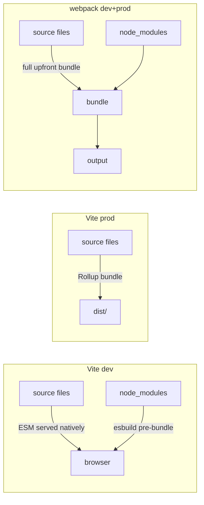
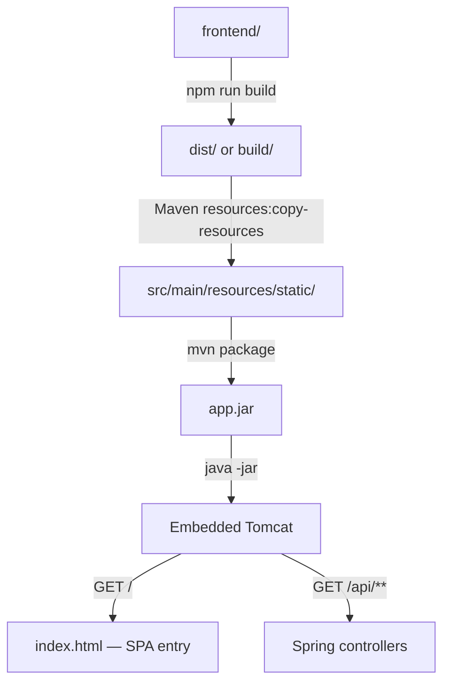

# 26 — JFI: TypeScript + Tailwind + Build Tools (DEEP)

> **Executor:** AI coding agent.
> **Working directory:** `/Users/ravi.r_flx/IEProject/InterviewExplainer/`.
> **Type:** content writing for three JFI modules:
> `typescript`, `tailwind-and-css`, `build-tools-frontend`.

---

## §0 — Front-matter

```yaml
playbook:    26
version:     1.0
status:      ready
wave:        C
domain:      java-fullstack-intermediate
modules:
  - typescript
  - tailwind-and-css
  - build-tools-frontend
q_targets:
  typescript: 40
  tailwind_and_css: 30
  build_tools_frontend: 25
archetypes:  A:35 B:45 C:5 G:0
difficulty:  E:30 M:55 H:15
version_pins:
  typescript: "5.4"
  tailwind: "3.4"
  vite: "5.2"
  webpack: "5.91"
  rollup: "4.14"
  esbuild: "0.21"
  swc: "1.4"
  pnpm: "9.1"
  node: "20 LTS"
```

---

## §1 — TL;DR

- **Input:** `typescript`, `tailwind-and-css`, `build-tools-frontend`
  modules thin.
- **Action:** Hit the depth targets below; tie examples back to Java/Spring
  Boot fullstack realism wherever natural.
- **Output:** Ranks for "typescript interview questions for java
  developers", "tailwind css interview questions", "vite vs webpack".

---

## §2 — Hard prerequisites

- [ ] JFI domain exists.
- [ ] Three module slugs declared in JFI `_index.json`.
- [ ] Playbooks 24–25 (React + Angular) at least scaffolded — TS examples
      cross-link both.

---

## §3 — Glossary

### TypeScript terms

| Term | Definition |
| --- | --- |
| **structural typing** | TypeScript's type system checks shape (property names and types), not nominal identity. An object is compatible with a type if it has at least the required members — it doesn't matter what class it came from. |
| **nominal typing** | Java/C#'s type system: compatibility is based on declared class/interface identity, not shape. A Java `Cat` is not a `Dog` even if both have `name: String`. |
| **`type`** | TypeScript alias: can represent a union, intersection, primitive, tuple, or mapped type; cannot be re-opened (merged). |
| **`interface`** | TypeScript structural contract; can be re-opened (declaration merging); preferred for object shapes and class contracts. |
| **generic** | Type parameter (`<T>`) that makes a function, class, or type work for any type while preserving type information. |
| **constraint** | `T extends SomeType` restricts the range of a generic type parameter. |
| **conditional type** | `T extends U ? X : Y` — a type that branches based on assignability; used in utility types like `NonNullable`. |
| **mapped type** | `{ [K in keyof T]: ... }` — iterates over a type's keys to produce a new type; foundation of `Partial`, `Required`, `Readonly`. |
| **`Partial<T>`** | Utility type that makes all properties of `T` optional. |
| **`Required<T>`** | Utility type that makes all properties of `T` required (removes `?`). |
| **`Pick<T, K>`** | Utility type that extracts a subset of properties `K` from `T`. |
| **`Omit<T, K>`** | Utility type that removes properties `K` from `T`. |
| **`Record<K, V>`** | Utility type for a dictionary with keys of type `K` and values of type `V`. |
| **`Awaited<T>`** | Unwraps the resolved type of a `Promise<T>`, recursively. |
| **type narrowing** | Restricting a union type to a specific branch via `typeof`, `instanceof`, `in`, discriminant, or user-defined type guard. |
| **user-defined type guard** | Function returning `value is T`; tells TypeScript that after the function returns `true`, the value is of type `T`. |
| **`any`** | Opts out of type checking entirely — any operation is allowed. |
| **`unknown`** | Type-safe alternative to `any`; forces narrowing before use. |
| **`never`** | A type that can never occur; used for exhaustive type checks and unreachable code. |
| **strict mode** | TypeScript compiler flag (`"strict": true`) enabling `noImplicitAny`, `strictNullChecks`, `strictFunctionTypes`, and others. |
| **`enum`** | TypeScript nominal constant set; compiles to a runtime JS object and a reverse-mapping object. |
| **union of literals** | `type Status = 'pending' \| 'active' \| 'closed'` — zero runtime overhead, composable, preferred over `enum`. |
| **decorator** | TypeScript experimental annotation (`@Injectable()`, `@Component()`) that runs at class/method/property definition time; Angular uses them extensively. |

### Tailwind / CSS terms

| Term | Definition |
| --- | --- |
| **utility-first CSS** | Styling approach using small, single-purpose classes (`flex`, `p-4`, `text-xl`) directly in HTML/JSX, avoiding custom CSS files. |
| **JIT (Just-in-Time) engine** | Tailwind v3's on-demand compiler that scans source files and generates only the CSS classes actually used. |
| **`content` config** | Tailwind configuration that lists the file paths the JIT scanner reads to detect used class names. |
| **purge (pre-v3)** | Old Tailwind mechanism that stripped unused classes in production; replaced by JIT in v3. |
| **arbitrary value** | Tailwind escape hatch: `w-[37px]` compiles to `width: 37px` — for one-off values not in the design system. |
| **plugin** | Tailwind extension that adds new utility classes or variants to the framework. |
| **BEM (Block Element Modifier)** | CSS naming convention: `.block__element--modifier`; avoids cascade conflicts without utility classes. |
| **CSS modules** | Scoped CSS where class names are hashed at build time; avoids global scope collisions. |
| **CSS-in-JS** | Libraries (Emotion, styled-components) that write CSS in JavaScript strings/objects; scoped by default but adds runtime cost. |

### Build tool terms

| Term | Definition |
| --- | --- |
| **bundler** | Tool that combines multiple JS/TS/CSS files and their dependencies into output chunks for the browser. |
| **chunk** | A unit of output from a bundler; may be eagerly loaded (entry chunk) or lazily loaded (async chunk). |
| **tree-shaking** | Bundler technique that removes dead-code exports not reachable from entry points; requires ES module syntax (`import`/`export`). |
| **dynamic import** | `import('./module')` — loads a module asynchronously at runtime, enabling code-splitting. |
| **HMR (Hot Module Replacement)** | Dev-server feature that patches changed modules in the running page without a full reload. |
| **Vite** | Build tool using native ESM in dev (no bundling) and Rollup for production; esbuild pre-bundles `node_modules`. |
| **esbuild** | Go-based JS/TS bundler/transpiler; Vite uses it to pre-bundle dependencies and transform TypeScript. |
| **Rollup** | JS bundler focused on ES module output and tree-shaking; Vite uses Rollup for production builds. |
| **webpack** | Battle-hardened bundler with the largest plugin ecosystem; slower dev-server startup than Vite due to full upfront bundling. |
| **loader (webpack)** | Transform applied to a file type before it's added to the webpack dependency graph (e.g. `ts-loader`, `css-loader`). |
| **plugin (webpack)** | More powerful hook that can modify the bundle, inject environment variables, generate extra files, etc. |
| **pnpm** | Package manager that uses a content-addressable store and hard links; avoids duplicate `node_modules` across projects. |
| **workspace** | monorepo feature in npm/pnpm/yarn that links local packages together and hoists shared dependencies. |
| **`proxy.conf.json`** | Angular CLI and Vite configuration that forwards matching requests to a backend server during local development. |

---

## §4 — Why this matters

TypeScript is **mandatory** at every Java shop doing fullstack today —
Java devs read TS more comfortably than plain JS, so investing here
moves the JFI domain from "we have React content" to "we have
production-shape fullstack content". Tailwind + build-tools are the
**other 30 %** of interview surface area that React/Angular guides
typically omit — owning those queries (e.g. "vite vs webpack",
"tailwind vs bootstrap") captures supplementary intent searches that
funnel back into the JFI modules.

---

## §5 — Current state

- `typescript`, `tailwind-and-css`, and `build-tools-frontend` modules
  may be scaffolded but largely empty.
- TS content online is plentiful but rarely targets Java devs (no
  comparison to Java's nominal typing, no Spring-context examples).

---

## §6 — Target state (measurable)

- `typescript`: 40 Q, all strict mode, no free-floating `any`.
- `tailwind-and-css`: 30 Q with ≥ 1 Java-shop example per topic.
- `build-tools-frontend`: 25 Q with comparison-heavy archetype B mix.
- Speakable per-module pass+warn ≥ 90 % for all three.
- All money comparisons live.

---

## §7 — Search phrases → topic map

| Search phrase | Module | Owner topic |
| --- | --- | --- |
| `typescript interview questions for java developers` | typescript | (module landing) |
| `type vs interface typescript` | typescript | `types-and-interfaces` |
| `typescript generics interview questions` | typescript | `generics` |
| `any vs unknown vs never typescript` | typescript | `comparisons` |
| `tailwind css interview questions` | tailwind-and-css | (module landing) |
| `tailwind vs bootstrap` | tailwind-and-css | `comparisons` |
| `flexbox vs grid` | tailwind-and-css | `flexbox-and-grid` |
| `vite vs webpack interview questions` | build-tools-frontend | `comparisons` |
| `npm vs pnpm vs yarn` | build-tools-frontend | `package-managers` |
| `react with spring boot build pipeline` | build-tools-frontend | `tooling-with-spring-boot` |

---

## §8 — Topic specifications

### 26.1 — `typescript` (target 40 Q)

| Topic slug | Min Q | Archetypes | Notes |
| --- | --- | --- | --- |
| `ts-fundamentals` | 6 | A:5 B:1 | Type vs value space, structural typing, type inference |
| `types-and-interfaces` | 6 | A:3 B:3 | `type` vs `interface`, intersection vs union |
| `generics` | 6 | A:4 B:2 | Constraints, conditional types, mapped types |
| `narrowing-and-guards` | 5 | A:4 B:1 | `typeof`, `instanceof`, `in`, user-defined guards |
| `utility-types` | 5 | A:5 | `Partial`, `Required`, `Pick`, `Omit`, `Record`, `Awaited` |
| `advanced-features` | 5 | A:3 B:2 | Decorators, declaration merging, module augmentation |
| `comparisons` | 7 | B:7 | Hot pair comparisons |

**Money comparisons (all 7 must be present):**
1. `type vs interface`
2. `any vs unknown vs never`
3. `enum vs union of literals`
4. `Generics vs any`
5. `Nominal typing vs structural typing (TS vs Java)`
6. `Strict mode vs loose TypeScript config`
7. `tsc vs Babel vs swc for TS compilation`

### 26.2 — `tailwind-and-css` (target 30 Q)

| Topic slug | Min Q | Archetypes | Notes |
| --- | --- | --- | --- |
| `tailwind-fundamentals` | 6 | A:5 B:1 | Utility-first, JIT engine, content config |
| `tailwind-customization` | 5 | A:4 B:1 | Theme, plugins, presets |
| `responsive-design` | 4 | A:3 B:1 | Breakpoints, mobile-first |
| `accessibility-and-semantics` | 4 | A:4 | sr-only, aria, focus states |
| `flexbox-and-grid` | 4 | A:2 B:2 | When each, common patterns |
| `css-architecture` | 4 | A:2 B:2 | BEM, CSS-in-JS, CSS modules, utility-first |
| `comparisons` | 3 | B:3 | Hot pair comparisons |

**Money comparisons (all 3 must be present):**
1. `Tailwind vs Bootstrap vs Material UI`
2. `CSS modules vs CSS-in-JS vs utility-first`
3. `Flexbox vs Grid (when each)`

### 26.3 — `build-tools-frontend` (target 25 Q)

| Topic slug | Min Q | Archetypes | Notes |
| --- | --- | --- | --- |
| `bundler-fundamentals` | 5 | A:5 | Bundle, chunk, dynamic import, tree-shaking |
| `vite-deep-dive` | 5 | A:4 B:1 | ESM dev server, esbuild prebundling, Rollup prod build |
| `webpack` | 5 | A:3 B:2 | Loaders, plugins, configuration |
| `package-managers` | 5 | A:2 B:3 | npm vs pnpm vs yarn; workspaces / monorepos |
| `tooling-with-spring-boot` | 3 | C:3 | `proxy.conf.json`, `npm run build` → Spring static |
| `comparisons` | 2 | B:2 | Hot comparisons |

**Money comparisons (both must be present):**
1. `Vite vs Webpack vs Parcel`
2. `npm vs pnpm vs yarn`

---

## §9 — Execution steps

### Step 1 — Verify three modules are scaffolded

```bash
cd /Users/ravi.r_flx/IEProject/InterviewExplainer

jq '.modules[] | select(.slug | IN("typescript","tailwind-and-css","build-tools-frontend"))' \
  content/java-fullstack-intermediate/_index.json

ls content/java-fullstack-intermediate/typescript/
ls content/java-fullstack-intermediate/tailwind-and-css/
ls content/java-fullstack-intermediate/build-tools-frontend/
```

**Verify:**
```bash
for m in typescript tailwind-and-css build-tools-frontend; do
  echo "$m: $(ls content/java-fullstack-intermediate/$m/ | wc -l) topics"
done
```

---

### Step 2 — Write `typescript` module (40 Q)

#### 2a — `ts-fundamentals` (6 Q)

Cover: type inference, type widening, `const` assertion (`as const`),
the difference between a value-level and type-level declaration,
`tsconfig.json` key flags (`strict`, `noImplicitAny`, `target`,
`moduleResolution`).

**The classic bug is using `Object.assign(target, source)` in TypeScript
and assuming the return type includes both. TypeScript infers only the
`target` type; the merged properties are invisible to the compiler unless
you use an intersection `T & U` or explicit cast.** The fix is to type
the result explicitly or use object spread `{ ...target, ...source }`,
which TypeScript infers correctly.

#### 2b — `types-and-interfaces` (6 Q)

Lead with the decision rule: *Use `interface` for object shapes and class
contracts where declaration merging may be needed (e.g. extending library
types). Use `type` when you need a union, intersection, tuple, or mapped
type. Either works for simple object shapes — `interface` is marginally
more readable in IDE hover and error messages.*

```typescript
// Declaration merging — only interfaces support this
interface Window {
  myPlugin: () => void;   // augments the global Window interface
}

// Union — only type supports this
type Result<T> = { ok: true; data: T } | { ok: false; error: string };
```

#### 2c — `generics` (6 Q)

Must-have Qs:
1. Generic function that extracts a property — `<T, K extends keyof T>(obj: T, key: K): T[K]`
2. Conditional type — `NonNullable<T>` written out, explained
3. Mapped type — building `Readonly<T>` from scratch
4. Generic constraint with interface — `T extends Serializable`
5. `infer` keyword — extracting the return type of a function with `ReturnType<T>`
6. Generic class — `class Stack<T>` with push/pop

#### 2d — `narrowing-and-guards` (5 Q)

Cover: `typeof`, `instanceof`, `in` operator, discriminant union
narrowing, user-defined type guard (`value is T`), exhaustiveness check
with `never`.

**The #1 narrowing trap is using `typeof` to narrow a class instance:**
`typeof myDate === 'object'` is always true for any object — it doesn't
distinguish `Date` from `User`. Use `instanceof Date` or a discriminant
field for class instances.

#### 2e — `utility-types` (5 Q)

Cover: `Partial`, `Required`, `Pick`, `Omit`, `Record`, `Awaited`,
`ReturnType`, `Parameters`. Each Q should show a before/after with and
without the utility type.

#### 2f — `advanced-features` (5 Q)

Cover: decorators (class, method, parameter — relevant for Angular and
Spring-like IoC), declaration merging, module augmentation (adding
properties to `express.Request`), `satisfies` operator (TS 4.9).

#### 2g — `comparisons` (7 Q)

All 7 money comparisons from §8. Each opens with *"Use X when …; use Y
when …"*. Key examples:

- `any vs unknown vs never` must include the safety table:

| Type | Assignment | Read / use | Use case |
| --- | --- | --- | --- |
| `any` | Anything | Anything — no checking | Last resort / migration escape hatch |
| `unknown` | Anything | Only after narrowing | Safe alternative to `any`; forces guard |
| `never` | Nothing | Has no value | Exhaustive switch, unreachable code, empty union |

---

### Step 3 — Write `tailwind-and-css` module (30 Q)

#### 3a — `tailwind-fundamentals` (6 Q)

Cover: utility-first philosophy (why it works, why CSS bloat happens),
Tailwind 3's JIT engine (on-demand, no purge step needed), configuring
`content` paths to detect class names in JSX/HTML/TS templates.

**The classic bug is forgetting to add a source path to `content` in
`tailwind.config.ts` — classes used in a new file are purged from the
output because the scanner never sees them.** Fix: add the glob pattern
for all templates that use Tailwind classes.

```typescript
// tailwind.config.ts
export default {
  content: [
    './src/**/*.{html,ts,tsx}',
    './public/index.html',
  ],
  // ...
};
```

#### 3b — `tailwind-customization` (5 Q)

Cover: extending the theme (`extend` vs root override), custom color
palette, custom spacing scale, plugins, `@layer` directive for component
classes that need to coexist with utilities.

#### 3c — `responsive-design` (4 Q)

Cover: mobile-first breakpoint philosophy (`sm:` means "at sm and above"),
container queries (Tailwind 3.3+), dark mode (`dark:` variant), print
styles.

#### 3d — `accessibility-and-semantics` (4 Q)

Cover: `sr-only` class for screen-reader text, focus rings (`focus-visible:ring`),
`aria-*` attributes alongside Tailwind classes, contrast ratios and WCAG AA.

#### 3e — `flexbox-and-grid` (4 Q)

Lead with the decision rule: *Use Flexbox (`flex`) for one-dimensional
layouts — rows or columns of items with alignment. Use Grid (`grid`) for
two-dimensional layouts — you need rows AND columns simultaneously, or
you need items to align across both axes.*

#### 3f — `css-architecture` (4 Q)

Compare utility-first, BEM, CSS Modules, CSS-in-JS:

| Approach | Scope | Colocation | Runtime overhead |
| --- | --- | --- | --- |
| Utility-first (Tailwind) | Global (but purged) | Yes (in markup) | None |
| CSS Modules | File-scoped (hashed) | Yes (`.module.css`) | None |
| CSS-in-JS (Emotion) | Component-scoped | Yes (same file) | Styles generated at runtime |
| BEM | Convention-scoped | No (separate files) | None |

#### 3g — `comparisons` (3 Q)

All 3 money comparisons from §8. Each opens with decision rule.

---

### Step 4 — Write `build-tools-frontend` module (25 Q)

#### 4a — `bundler-fundamentals` (5 Q)

Cover: what a bundler does, ES module graph resolution, static vs dynamic
import, tree-shaking requirements (ESM only — CommonJS `require()` blocks
tree-shaking), chunk splitting strategies.

#### 4b — `vite-deep-dive` (5 Q)

Cover: native ESM dev server (no upfront bundling → instant start),
esbuild pre-bundling of `node_modules` (CommonJS → ESM + caches),
Rollup for production build (smaller, better tree-shaking), Vite's
`server.proxy` for API forwarding, `vite.config.ts` structure.

**The #1 Vite gotcha is `node_modules` that don't export ESM.** Vite's
dev server expects ESM. Libraries that only export CommonJS (`require()`)
must be pre-bundled by esbuild (listed in `optimizeDeps.include`).
Missing this causes "SyntaxError: The requested module is not an ESModule".

```typescript
// vite.config.ts — Vite dev proxy for Spring Boot
import { defineConfig } from 'vite';
export default defineConfig({
  server: {
    proxy: {
      '/api': {
        target: 'http://localhost:8080',
        changeOrigin: true,
      },
    },
  },
});
```

#### 4c — `webpack` (5 Q)

Cover: entry / output / loader / plugin concepts, `webpack.config.js`
structure, HMR with webpack-dev-server, `MiniCssExtractPlugin`, code
splitting with `SplitChunksPlugin`.

#### 4d — `package-managers` (5 Q)

Cover: `npm` hoisting and phantom dependencies, `pnpm` content-addressable
store + hard links (each package installed once globally), `yarn` PnP
(Plug'n'Play) — no `node_modules`, monorepo workspaces with each tool.

Lead with the decision rule: *Use pnpm in monorepos or disk-constrained
environments — it deduplicates packages across projects via hard links.
Use npm when simplicity matters and the project is standalone. Use yarn
only if the team already has Yarn muscle memory; pnpm supersedes it for
new projects.*

#### 4e — `tooling-with-spring-boot` (3 Q)

These are scenario (C-archetype) Qs covering the full fullstack build:

1. **Local dev proxy setup** — `proxy.conf.json` for Angular CLI or
   `vite.config.ts` for React; shows how the frontend calls `/api/**`
   without CORS issues during development.
2. **Single-JAR deployment** — `npm run build` → Maven `resources:copy`
   → `src/main/resources/static` → Spring Boot serves SPA from the
   embedded Tomcat.
3. **CI/CD pipeline** — GitHub Actions job: `npm ci` + `npm run build`
   → Maven `package` → Docker build → push.

#### 4f — `comparisons` (2 Q)

Both money comparisons from §8.

---

### Step 5 — Module-level lint (all three modules)

```bash
cd /Users/ravi.r_flx/IEProject/InterviewExplainer

# Q counts
for m in typescript tailwind-and-css build-tools-frontend; do
  total=$(find content/java-fullstack-intermediate/$m \
    -name complete-qa.json \
    -exec jq '.questions | length' {} \; \
    | awk '{s+=$1} END {print s}')
  echo "$m: $total Q"
done
# Expected: typescript ≥ 40, tailwind-and-css ≥ 30, build-tools-frontend ≥ 25

# Speakable audit
for m in typescript tailwind-and-css build-tools-frontend; do
  python3 scripts/audit_speakable.py \
    --module $m --domain java-fullstack-intermediate --report
done
# Expected: pass+warn ≥ 90 % each

# Free-floating `any` in typescript module (only in comparisons topic)
rg ': any\b' content/java-fullstack-intermediate/typescript/ \
  --ignore-path '*/comparisons/*'
# Expected: zero

# Schema validation
find content/java-fullstack-intermediate/typescript \
     content/java-fullstack-intermediate/tailwind-and-css \
     content/java-fullstack-intermediate/build-tools-frontend \
  -name complete-qa.json \
  | xargs -I{} python3 scripts/validate_qa.py {}

# Banned words
rg -ni 'leverage|utilize|seamless|robust|holistic|paradigm|battle-tested|enterprise-grade' \
  content/java-fullstack-intermediate/typescript/ \
  content/java-fullstack-intermediate/tailwind-and-css/ \
  content/java-fullstack-intermediate/build-tools-frontend/
# Expected: zero
```

---

## §10 — Reference Q JSON

Paste into `types-and-interfaces/complete-qa.json`:

```json
{
  "id": "type-vs-interface-typescript",
  "slug": "type-vs-interface-typescript",
  "title": "type vs interface in TypeScript — when to use each",
  "question": "What is the difference between `type` and `interface` in TypeScript, and when should you use each?",
  "difficulty": "medium",
  "importance": "critical",
  "archetype": "B",
  "reading_time_minutes": 4,
  "last_updated": "2024-06-01",
  "interviewer_intent": "Tests whether the candidate understands TypeScript's structural type system deeply enough to make an informed choice — not just parrot 'they're mostly the same'.",
  "company_tags": ["Google", "Stripe", "Shopify", "Atlassian", "Thoughtworks"],
  "direct_answer": "**Use `interface` for object shapes and class contracts** — it can be re-opened (declaration merging), is the idiomatic choice for library types, and produces cleaner IDE hover text. **Use `type` when you need a union, intersection, mapped type, or tuple** — things `interface` cannot express. For simple object shapes, either works; prefer `interface` for consistency.",
  "layout_type": "comparison",
  "tags": ["typescript", "type", "interface", "structural-typing"],
  "order": 1,
  "seo": {
    "title": "type vs interface TypeScript — interview question",
    "description": "When to use type vs interface in TypeScript, with examples of declaration merging, union types, and mapped types."
  },
  "answer": {
    "sections": [
      {
        "kind": "headline",
        "value": "Use `interface` for object shapes and class contracts. Use `type` for unions, intersections, tuples, and mapped types. For plain object shapes, both work — `interface` is the idiomatic default."
      },
      {
        "kind": "code",
        "language": "typescript",
        "value": "// interface: re-openable (declaration merging)\ninterface User { id: number; name: string; }\ninterface User { email: string; }  // merges — User now has id, name, email\n\n// type: cannot be re-opened, but can express unions and mapped types\ntype Status = 'pending' | 'active' | 'closed';        // union — interface can't do this\ntype Readonly<T> = { readonly [K in keyof T]: T[K] };  // mapped type — interface can't do this\ntype Point = [number, number];                          // tuple — interface can't do this\n\n// Both can describe an object shape:\ninterface Product { id: number; price: number; }\ntype Product2 = { id: number; price: number; };  // equivalent for most purposes"
      },
      {
        "kind": "comparison_table",
        "columns": ["Capability", "interface", "type"],
        "rows": [
          ["Object shape", "Yes", "Yes"],
          ["Class contract (implements)", "Yes", "Yes"],
          ["Declaration merging", "Yes", "No"],
          ["Union type", "No", "Yes"],
          ["Intersection type", "Extends", "& operator"],
          ["Mapped type", "No", "Yes"],
          ["Tuple", "No", "Yes"],
          ["IDE hover readability", "Better (shows name)", "Shows expanded shape"]
        ]
      },
      {
        "kind": "tradeoffs",
        "value": "Compared to Java, TypeScript uses structural typing — a `Cat` is assignable to `Animal` as long as `Cat` has all `Animal`'s properties, regardless of class hierarchy. This is why `interface` and `type` can both describe the same shape interchangeably for object literals."
      },
      {
        "kind": "followups",
        "value": [
          "What is declaration merging and when is it useful?",
          "Can a class implement a `type`?",
          "How does TypeScript's structural typing differ from Java's nominal typing?",
          "What is a mapped type and how is Partial<T> implemented?"
        ]
      }
    ]
  },
  "speakable": {
    "summary": "Use interface for object shapes and class contracts — it supports declaration merging and is idiomatic for library types. Use type for unions, intersections, mapped types, and tuples. For simple object shapes, either works; prefer interface for consistency.",
    "isCanonical": true
  }
}
```

---

## §11 — Diagrams

### 11.1 — TypeScript narrowing decision tree (flowchart)

```mermaid
flowchart TD
  V[value: string | number | Date | null] --> N1{null/undefined?}
  N1 -->|if v == null| Null[type: null]
  N1 -->|else| N2{typeof === 'string'?}
  N2 -->|Yes| Str[type: string]
  N2 -->|No| N3{typeof === 'number'?}
  N3 -->|Yes| Num[type: number]
  N3 -->|No| N4{instanceof Date?}
  N4 -->|Yes| Dt[type: Date]
  N4 -->|No| NV[type: never — exhaustive]
```

### 11.2 — Vite vs webpack build pipeline (flowchart)



### 11.3 — Spring Boot + frontend single-JAR build (flowchart)



---

## §12 — Voice rules

Opens from `_VOICE-RULES.md` (locked source of truth). Three
module-specific examples:

| ✅ JBI voice | ❌ Textbook voice |
| --- | --- |
| "The classic bug is using `Object.assign(target, source)` and assuming TypeScript infers the merged type — it only infers `target`'s type. Use `{ ...target, ...source }` (spread) for correct inference." | "Be careful with Object.assign in TypeScript." |
| "Use `interface` for object shapes and class contracts. Use `type` for unions, intersections, and mapped types. For plain object shapes, either works." | "`interface` and `type` are both used to define shapes in TypeScript." |
| "Tailwind v3's JIT engine (released March 2021) scans your source files on demand and emits only the classes you use. The old `purge` step is gone; classes are never emitted if they're not in a scanned file." | "Tailwind is utility-first CSS." |

Additional rules:
- TypeScript code examples must use `strict: true` semantics — no implicit `any`.
- Comparison Qs must include a `comparison_table`.
- Build-tool comparisons must cite concrete metrics: dev-server start
  time, HMR latency, or bundle-size difference (e.g. "Vite's dev server
  starts in < 300 ms for a medium React app vs webpack's 10–30 s").

---

## §13 — Anti-patterns checklist

### TypeScript anti-patterns

| Anti-pattern | Why it fails | Fix |
| --- | --- | --- |
| Using `any` instead of `unknown` | Disables type checking downstream | Narrow with `typeof` / `instanceof` first |
| `@ts-ignore` without a comment | Hides real bugs silently | Use `@ts-expect-error` with explanation |
| Widening to `object` type | `object` allows any object — no property access | Use specific type or `Record<string, unknown>` |
| `enum` for string constants | Emits extra runtime code, not tree-shakable | Use `const` enum or union of string literals |
| Intersection types for form inputs | Intersection applies structurally; adding optional fields doesn't enforce them | Use `Required<Pick<T, K>>` or explicit types |

### Tailwind anti-patterns

| Anti-pattern | Why it fails | Fix |
| --- | --- | --- |
| Dynamically constructing class strings (`"text-" + color`) | JIT scanner can't statically detect the class; it's purged from output | Use full class names; store in a map keyed by value |
| Missing `content` path for new file type | Classes in those files are purged | Add the glob to `content` in `tailwind.config.ts` |
| Overriding Tailwind base with global CSS | Conflicts with utility classes; specificity wars | Use `@layer base` and `@apply` or use arbitrary values |

### Build tool anti-patterns

| Anti-pattern | Why it fails | Fix |
| --- | --- | --- |
| `import * as Foo from 'big-library'` | Defeats tree-shaking; entire library bundled | Import named exports only |
| `require()` in ESM project | Blocks Vite's ESM dev server | Add to `optimizeDeps.include` for esbuild pre-bundling |
| `devDependencies` listed under `dependencies` | Ships test tools to production; larger deployment | Audit and move correctly |

---

## §14 — Money Q checklist

### TypeScript (7 comparisons)

- [ ] `type vs interface`
- [ ] `any vs unknown vs never`
- [ ] `enum vs union of literals`
- [ ] `Generics vs any`
- [ ] `Nominal typing vs structural typing (TS vs Java)`
- [ ] `Strict mode vs loose TypeScript config`
- [ ] `tsc vs Babel vs swc`

### Tailwind (3 comparisons)

- [ ] `Tailwind vs Bootstrap vs Material UI`
- [ ] `CSS modules vs CSS-in-JS vs utility-first`
- [ ] `Flexbox vs Grid`

### Build tools (2 comparisons)

- [ ] `Vite vs Webpack vs Parcel`
- [ ] `npm vs pnpm vs yarn`

---

## §15 — Regression tests

```bash
cd /Users/ravi.r_flx/IEProject/InterviewExplainer

# Schema validation
for m in typescript tailwind-and-css build-tools-frontend; do
  find content/java-fullstack-intermediate/$m -name complete-qa.json \
    | xargs -I{} python3 scripts/validate_qa.py {}
done

# Free-floating `any` in typescript module
rg ': any\b' content/java-fullstack-intermediate/typescript/ \
  --ignore-path '*/comparisons/*'

# Speakable per module
for m in typescript tailwind-and-css build-tools-frontend; do
  python3 scripts/audit_speakable.py \
    --module $m --domain java-fullstack-intermediate --report
done

# Banned words
rg -ni 'leverage|utilize|seamless|robust|holistic|paradigm|battle-tested' \
  content/java-fullstack-intermediate/typescript/ \
  content/java-fullstack-intermediate/tailwind-and-css/ \
  content/java-fullstack-intermediate/build-tools-frontend/

# All money comparisons present (spot-check typescript)
rg -i 'type.*interface\|interface.*type' \
  content/java-fullstack-intermediate/typescript/types-and-interfaces/complete-qa.json
```

---

## §16 — Cross-link map

| JFI module / topic | Cross-links into |
| --- | --- |
| `typescript/ts-fundamentals` | JFI `react/react-fundamentals`, `angular/angular-fundamentals` |
| `typescript/comparisons` (TS vs Java nominal typing) | JBI `core-java/oop` |
| `build-tools-frontend/tooling-with-spring-boot` | JBI `spring-boot/spring-boot-basics` |
| `tailwind-and-css/css-architecture` | JFI `react/performance` (CSS-in-JS runtime overhead) |

Verify:
```bash
rg -c '/interview/java' \
  content/java-fullstack-intermediate/typescript/ \
  content/java-fullstack-intermediate/build-tools-frontend/ \
  | awk -F: '$2>0'
```

---

## §17 — Rollout notes

- Flip modules to `visible: true` one at a time after each passes
  Step 5 lint.
- `typescript` first (highest search volume), then `build-tools-frontend`,
  then `tailwind-and-css`.
- Commit cadence: `content(jfi/<module>/<topic>): +N questions` per ~10 Q.

---

## §18 — Quality gates

| Gate | Threshold | Verify with |
| --- | --- | --- |
| `typescript` Q count | ≥ 40 | jq aggregate |
| `tailwind-and-css` Q count | ≥ 30 | jq aggregate |
| `build-tools-frontend` Q count | ≥ 25 | jq aggregate |
| All 12 money comparisons live | 12 of 12 | manual grep |
| No free-floating `any` in TypeScript module | 0 | `rg ': any\b' content/.../typescript/ --ignore-path '*/comparisons/*'` |
| Speakable per-module pass+warn | ≥ 90 % each | `audit_speakable.py` |
| `00-INDEX.md` row for `26` | DONE | manual |

---

## Definition of Done

- [ ] All 3 modules at target Q + lint clean.
- [ ] All 12 money comparisons live.
- [ ] No `any` outside comparison Q in typescript module.
- [ ] Speakable ≥ 90 % per module.
- [ ] `00-INDEX.md` row for `26` flipped to `DONE`.

## Estimated effort

- **Ideal:** 20 hours.
- **Hard stop:** 30 hours.