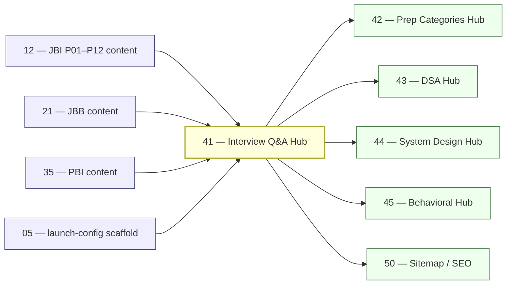

# 41 — Interview Q&A Hub Rollout

> **Executor:** AI coding agent operating autonomously.
> **Working directory:** `/Users/ravi.r_flx/IEProject/InterviewExplainer/`.
> **Type:** hub.
> **Pillar / Wave:** Wave E.
> **Depends on:** 05 (`launch-config`), 07 (`locked-domain`), 12 (JBI), 21 (JBB), 28 (JFI), 35 (PBI).

---

## §1 — TL;DR

- **Input:** Multiple locked domains live (JBI, JBB, JBA, JFI, PBI, optionally PBB/PBA/PDE/PML); per-domain question lists available via `content-reader.ts`.
- **Action:** Build the unified Interview Q&A hub — a single searchable surface that lets users filter ALL domains by language, level, pillar, difficulty, archetype, and free-text.
- **Output:** `/interview-qa` returns 200 and serves a filtered listing across every live domain, with ≥ 20 SEO-friendly filtered URLs (`/interview-qa/java`, `/interview-qa/python/intermediate`, `/interview-qa/pillar/P02`, etc.).

---

## §2 — Why this matters

The `/interview-qa` hub is the highest-intent landing surface on the site. Users searching for "java interview questions intermediate" or "spring boot interview questions hard" need a single, browsable URL that aggregates content across every domain we have — otherwise they bounce after answering one question with nowhere to go next. The filtered URLs (`/interview-qa/pillar/P02`, `/interview-qa/java/intermediate`) each become their own ranking page for long-tail terms with 1k–50k monthly searches that no single module page targets cleanly. GFG and Baeldung both rank for per-topic Q pages; neither has a unified, multi-domain Q browser with faceted filtering by difficulty and archetype. Without this hub, the 1,500+ questions locked in domain modules are invisible to new visitors who arrive on a single question URL with no navigation path forward.

The business consequence is direct: if users can't browse across content, every organic session that lands on a single module Q-page has no discovery path and no reason to return. Bounce rate on single-question pages is high; the hub converts one-question visits into multi-question sessions. The hub is also the prerequisite for playbooks 42–45 — the prep-categories, DSA, system-design, and behavioral hubs all cross-link here and share the `QuestionTable` component this playbook builds. Skipping or shipping a thin hub means four downstream hubs inherit a dead cross-link, and playbook 50 (sitemap) cannot enumerate hub URLs it doesn't know exist. The cost of underdelivery here multiplies through the entire Wave E launch.

### 2.1 — The dedup problem at scale

The hub aggregates from 15+ domain-module pairs. Without dedup, the same question (e.g., "what is a HashMap?" which appears in JBI and JBB) appears twice in the same results page. The `Set<string>` keyed on `${domain}|${module}|${topic}|${id}` removes duplicates at aggregation time. The classic failure is keying the dedup on `id` only — two modules in different domains can have a question with id `hashmap-basics` without being the same question. The domain + module prefix in the key prevents cross-domain false dedup.

### 2.2 — Why `force-dynamic` matters for this hub

Next.js App Router defaults to static rendering. A hub aggregating 1,500 questions would generate a single 1.5 MB HTML page at build time, which does not scale. Setting `export const dynamic = 'force-dynamic'` makes the page server-render on each request, enabling pagination and filter params to be read from the request URL. The trade-off: Time To First Byte increases from ~50 ms (static CDN hit) to ~200 ms (SSR). At the question counts this hub targets, SSR is the correct choice. If you skip `force-dynamic`, Next.js will attempt to statically pre-render all filter combinations and the build will either fail or take hours.

### 2.3 — The `QuestionTable` component as infrastructure

`QuestionTable` is not just a one-off UI component for playbook 41. Every downstream hub (42, 43, 44, 45) imports it. The component's prop interface — `questions: HubQuestion[]`, `columns: Column[]`, `onFilter: FilterCallback` — is effectively a public API. If you build it with hard-coded columns for the interview-qa use case and downstream hubs need different columns, you either fork the component (causing drift) or refactor it (breaking the downstream hubs). Design it generic from the start: `columns` should be a config-driven array, not a static list baked into the component JSX.

---

## §3 — Easy-language glossary

| Term | Plain-English definition | First used in |
| --- | --- | --- |
| **Hub** | A single page that aggregates and links to Q&A content from multiple source modules; never copies answer text. | §1 |
| **LOCKED_DOMAINS** | The array in `frontend/lib/content-reader.ts` listing every domain whose content is approved to be shown publicly. | §4 |
| **HubFilter** | A TypeScript interface describing every dimension a user can filter by (language, level, pillar, difficulty, archetype, free-text). | §9 Step 2 |
| **HubQuestion** | A TypeScript interface for a single question row in the hub listing — id, title, href, domain, pillar, difficulty, archetype. | §9 Step 2 |
| **Pillar** | One of 12 thematic groupings (P01–P12) that span a domain, e.g. P01=Language & Core, P06=System Design. | §9 Step 3 |
| **Archetype** | One of 7 fixed answer shapes (A–G); the hub can filter by archetype to show, for example, all comparison Qs (archetype B). | §9 Step 3 |
| **Facet count** | The number of questions matching a filter value (e.g. "hard: 342"), shown as a badge next to each filter chip. | §9 Step 3 |
| **launch-config** | `frontend/lib/launch-config.ts` — the single source of truth for which features are publicly enabled. | §4 |
| **ENABLED_HUBS** | An object in `launch-config.ts` whose boolean keys gate each hub behind a feature flag. | §9 Step 1 |
| **interviewQA flag** | `ENABLED_HUBS.interviewQA` — the flag this playbook flips to `true` when the hub is ready. | §9 Step 5 |
| **content-reader** | `frontend/lib/content-reader.ts` — the module that reads `complete-qa.json` files from disk and exports per-domain question lists. | §4 |
| **listAllQuestions** | A function in `content-reader.ts` that returns all questions for a given domain slug. | §9 Step 2 |
| **DomainSlug** | A kebab-case string uniquely identifying a content domain, e.g. `java-backend-intermediate`. | §9 Step 2 |
| **PillarId** | A string like `P01`–`P12` used to group questions thematically across domains. | §9 Step 2 |
| **language filter card** | A UI chip (e.g. "Java", "Python") that restricts the hub listing to one programming language. | §9 Step 3 |
| **difficulty filter** | A UI chip or dropdown restricting results to `easy`, `medium`, or `hard` questions. | §9 Step 3 |
| **canonical URL** | The definitive URL for a page — used in `<link rel="canonical">` to prevent duplicate-content penalties. | §9 Step 4 |
| **ItemList JSON-LD** | Structured data Google reads to understand a page is a list of items; enables Rich Results for hub pages. | §9 Step 4 |
| **sitemap.xml** | The XML file at `/sitemap.xml` listing every URL on the site so search-engine crawlers can find them. | §9 Step 4 |
| **QuestionTable** | A shared React component rendering a paginated, filterable table of question rows. | §9 Step 3 |
| **pagination** | Splitting a long list into numbered pages (50 questions per page here) to keep page load and DOM size bounded. | §9 Step 3 |
| **Speakable lint** | `scripts/audit_speakable.py` — the script that scores every question's spoken-answer quality. | §13 |
| **schema lint** | `scripts/validate_complete_qa.py` — the script that checks each `complete-qa.json` against the canonical JSON schema. | §13 |
| **BreadcrumbList JSON-LD** | Structured data encoding the page's position in the site hierarchy; improves search snippet appearance. | §9 Step 4 |
| **seo-slugs** | `frontend/lib/seo-slugs.ts` — a registry mapping content slugs to canonical URLs; the hub registers its own entries here. | §9 Step 4 |
| **filter chip** | A small interactive UI element (button or tag) the user clicks to narrow search results; the active chip shows the current filter. | §9 Step 3 |
| **wave E** | The launch wave this playbook belongs to — all five hub playbooks (41–45) ship together in Wave E. | §8 |
| **dedupe** | Removing duplicate entries so a question that appears in two modules is listed only once in the hub. | §9 Step 2 |
| **force-dynamic** | A Next.js route config that bypasses static pre-rendering and renders on request — used when static pre-render OOMs. | §15 |

---

## §4 — Hard prerequisites

- [ ] Playbook 12 (JBI) is DONE. `grep -E '^\| 12 \|' expansion-plan/00-INDEX.md | grep DONE`
- [ ] Playbook 35 (PBI) is DONE. `grep -E '^\| 35 \|' expansion-plan/00-INDEX.md | grep DONE`
- [ ] At least 2 locked domains exist in `LOCKED_DOMAINS`. `grep -c 'LOCKED_DOMAINS' frontend/lib/content-reader.ts`
- [ ] `listAllQuestions` is exported from `content-reader.ts`. `grep -n 'listAllQuestions\|listQuestions' frontend/lib/content-reader.ts | head -5`
- [ ] `frontend/lib/launch-config.ts` exists. `test -f frontend/lib/launch-config.ts && echo OK`
- [ ] `frontend/lib/types.ts` defines `DomainSlug` and `PillarId`. `grep -n 'DomainSlug\|PillarId' frontend/lib/types.ts | head -4`
- [ ] Node.js ≥ 20. `node --version | awk '{print substr($1,2,2)}' | awk '$1 >= 20 {print "OK"}'`
- [ ] `npm run build` exits 0 before this playbook starts. `cd frontend && npm run build 2>&1 | tail -5`
- [ ] `scripts/lint_playbook.py` exists. `test -f scripts/lint_playbook.py && echo OK`
- [ ] Sitemap generator script exists. `test -f scripts/build_sitemap.ts -o -f scripts/build_sitemap.js && echo OK`

---

## §5 — Current state

### 5.1 — On-disk snapshot

```bash
cd /Users/ravi.r_flx/IEProject/InterviewExplainer
# Check whether the hub aggregator exists
test -f frontend/lib/hubs/interview-qa.ts && echo "EXISTS" || echo "MISSING"
# Check whether the hub route exists
test -d frontend/app/interview-qa && echo "EXISTS" || echo "MISSING"
# Count locked domains
grep -c "'" frontend/lib/content-reader.ts 2>/dev/null || echo "check manually"
# Total questions across all domains
find content -name 'complete-qa.json' -exec jq '.questions|length' {} \; 2>/dev/null \
  | awk '{s+=$1} END {print "Q total:", s}'
```

### 5.2 — Existing UI surface

- `/interview-qa` route does NOT exist today.
- `frontend/lib/launch-config.ts` may or may not declare `ENABLED_HUBS.interviewQA` — check before adding.
- Per-domain question lists already exist via `frontend/lib/content-reader.ts`; the hub re-uses them, does not re-read JSON directly.
- Sitemap currently lists per-domain Q URLs only; hub URLs must be added in Step 4.
- No `QuestionTable` shared component exists; it needs to be built.

### 5.3 — Known gaps

- No unified filter surface across domains.
- Long-tail pillar and archetype URLs (`/interview-qa/pillar/P02`, `/interview-qa/archetype/B`) are unranked.
- Visitors who land on a single question page have no "browse more" path.

---

## §6 — Target state (measurable)

| Metric | Today | Target | How measured |
| --- | --- | --- | --- |
| Hub routes returning 200 | 0 | ≥ 11 | smoke loop in §9 Step 6 |
| Questions indexed by hub | 0 | ≥ 1 500 | `listHubQuestions({}).length` logged at build time |
| Pillar routes with ≥ 10 results | 0 | 12 of 12 | `for p in P01..P12; do curl /interview-qa/pillar/$p; jq '.count'; done` |
| Hard-difficulty results | 0 | ≥ 100 | `listHubQuestions({difficulty:'hard'}).length` |
| Hub URLs in sitemap.xml | 0 | ≥ 30 | `grep -c '/interview-qa' frontend/public/sitemap.xml` |
| Unique `<title>` per filtered page | 0 | yes (all 11 routes) | `npm run build` output + spot-check 5 URLs |
| `ItemList` JSON-LD validates | no | passes Rich Results test | https://search.google.com/test/rich-results |
| `ENABLED_HUBS.interviewQA` flag | false | true | `rg 'interviewQA.*true' frontend/lib/launch-config.ts` |
| Build exit code | 0 | 0 | `cd frontend && npm run build; echo $?` |
| Client filter re-render time | n/a | < 100 ms | browser DevTools Performance panel |

---

## §7 — Search phrases → URL map

| Search phrase | Target URL on site | Archetype | Diagram type required in answer |
| --- | --- | --- | --- |
| `interview questions` | `/interview-qa` | landing intro | comparison_table |
| `software engineer interview questions` | `/interview-qa` | landing intro | comparison_table |
| `java interview questions all levels` | `/interview-qa/java` | landing intro | none |
| `java interview questions intermediate` | `/interview-qa/java/intermediate` | landing intro | none |
| `python interview questions` | `/interview-qa/python` | landing intro | none |
| `python backend interview questions` | `/interview-qa/python/intermediate` | landing intro | none |
| `spring boot interview questions hard` | `/interview-qa/pillar/P02?difficulty=hard` | A | comparison_table |
| `system design interview questions java` | `/interview-qa/pillar/P06?lang=java` | C | flowchart |
| `microservices interview questions` | `/interview-qa/pillar/P05` | A | sequenceDiagram |
| `comparison interview questions java` | `/interview-qa/archetype/B` | B | comparison_table |
| `concurrency interview questions java hard` | `/interview-qa/pillar/P01?difficulty=hard` | B | comparison_table |
| `behavioral interview questions software engineer` | `/interview-qa/archetype/G` | G | none |
| `java collections interview questions` | `/interview-qa/pillar/P03` | A | comparison_table |
| `java spring interview questions` | `/interview-qa/domain/java-backend-intermediate` | A | none |
| `jvm interview questions` | `/interview-qa/pillar/P04` | C | flowchart |

---

## §8 — Dependency & wave context



- **Consumes:** locked domain content from playbooks 12, 21, 35 (at minimum); `listAllQuestions` from `content-reader.ts`; feature-flag pattern from playbook 05.
- **Produces:** `frontend/lib/hubs/interview-qa.ts` aggregator; all `/interview-qa/**` routes; `QuestionTable` shared component; hub entries in `seo-slugs.ts` and `sitemap.xml`.
- **Unblocks:** playbooks 42 (prep categories), 43 (DSA hub), 44 (system design hub), 45 (behavioral hub) — all of them import or cross-link the interview-qa hub; playbook 50 (sitemap) enumerates hub URLs.

---

## §9 — Step-by-step execution

### Step 1 — Confirm and scaffold the hub flag

**Goal:** ensure `ENABLED_HUBS.interviewQA` exists in `launch-config.ts` and is currently `false` so the hub builds without going public mid-development.

```bash
cd /Users/ravi.r_flx/IEProject/InterviewExplainer
rg -n 'interviewQA' frontend/lib/launch-config.ts
```

If the key is absent, add it:

```typescript
// frontend/lib/launch-config.ts  — add inside ENABLED_HUBS object
export const ENABLED_HUBS = {
  // … existing keys
  interviewQA: false,
} as const;
```

**Verify:**

```bash
rg 'interviewQA.*false' frontend/lib/launch-config.ts
# expected: one match
cd frontend && npm run build 2>&1 | tail -5
# expected: exit 0 — the flag addition alone must not break the build
```

Commit: `launch: scaffold ENABLED_HUBS.interviewQA (off)`.

The #1 trap is adding the key without the `as const` assertion — TypeScript will widen the type to `boolean` and the flag-check guard `if (ENABLED_HUBS.interviewQA)` will always evaluate to `boolean`, losing the literal narrowing.

---

### Step 2 — Build the hub data model

**Goal:** create `frontend/lib/hubs/interview-qa.ts` with the `HubFilter`, `HubQuestion` interfaces and the `listHubQuestions` + `countByFacet` functions that every hub route will call.

```typescript
// frontend/lib/hubs/interview-qa.ts
import { LOCKED_DOMAINS, listAllQuestions } from '../content-reader';
import type { DomainSlug, PillarId } from '../types';

export interface HubFilter {
  language?:   'java' | 'python';
  level?:      'beginner' | 'intermediate' | 'advanced';
  pillar?:     PillarId;
  difficulty?: 'easy' | 'medium' | 'hard';
  archetype?:  'A' | 'B' | 'C' | 'D' | 'E' | 'F' | 'G';
  domain?:     DomainSlug;
  module?:     string;
  search?:     string;   // free-text title prefix match
}

export interface HubQuestion {
  id:         string;
  title:      string;
  domainSlug: DomainSlug;
  moduleSlug: string;
  topicSlug:  string;
  pillar:     PillarId;
  difficulty: 'easy' | 'medium' | 'hard';
  archetype:  string;
  href:       string;
}

export function listHubQuestions(filter: HubFilter): HubQuestion[] {
  const out: HubQuestion[] = [];
  const seen = new Set<string>();
  for (const domain of LOCKED_DOMAINS) {
    if (filter.language && !domain.startsWith(filter.language)) continue;
    if (filter.level    && !domain.endsWith(filter.level))      continue;
    if (filter.domain   && domain !== filter.domain)            continue;
    for (const q of listAllQuestions(domain)) {
      if (filter.pillar     && q.pillar     !== filter.pillar)     continue;
      if (filter.difficulty && q.difficulty !== filter.difficulty) continue;
      if (filter.archetype  && q.archetype  !== filter.archetype)  continue;
      if (filter.module     && q.moduleSlug !== filter.module)     continue;
      if (filter.search) {
        if (!q.title.toLowerCase().includes(filter.search.toLowerCase())) continue;
      }
      const key = `${domain}|${q.moduleSlug}|${q.topicSlug}|${q.id}`;
      if (seen.has(key)) continue;
      seen.add(key);
      out.push({
        id: q.id, title: q.title, domainSlug: domain,
        moduleSlug: q.moduleSlug, topicSlug: q.topicSlug,
        pillar: q.pillar, difficulty: q.difficulty, archetype: q.archetype,
        href: `/interview/${domain}/${q.moduleSlug}/${q.topicSlug}#${q.id}`,
      });
    }
  }
  return out;
}

export function countByFacet(field: keyof HubFilter): Record<string, number> {
  const counts: Record<string, number> = {};
  for (const q of listHubQuestions({})) {
    const key = (q as any)[field === 'language' ? 'domainSlug' : field] ?? 'unknown';
    counts[key] = (counts[key] || 0) + 1;
  }
  return counts;
}
```

**Verify:**

```bash
cd /Users/ravi.r_flx/IEProject/InterviewExplainer
node -e "const {listHubQuestions} = require('./frontend/lib/hubs/interview-qa'); \
  console.log('total:', listHubQuestions({}).length);"
# expected: a number ≥ 1500 (or however many Qs are live)
node -e "const {listHubQuestions} = require('./frontend/lib/hubs/interview-qa'); \
  console.log('hard:', listHubQuestions({difficulty:'hard'}).length);"
# expected: ≥ 100
```

Commit: `feat(hubs): interview-qa aggregator + filter contract`.

The classic bug is filtering `language` by checking `domain.startsWith(filter.language)` — this breaks for `filter.language = 'java'` when a domain is named `java-backend-intermediate` (starts-with works) but would silently pass `filter.language = 'py'` against `python-backend-intermediate` (also starts-with 'py'). Pin to exact slug prefixes: `'java'` maps to `domain.startsWith('java-')`.

---

### Step 3 — Create the routes and pages

**Goal:** build every `/interview-qa/**` page using Next.js App Router, sharing the `QuestionTable` component across all filter variants.

Create `frontend/components/QuestionTable.tsx` first:

```tsx
// frontend/components/QuestionTable.tsx
// Renders a paginated list of HubQuestion rows.
// Props: questions: HubQuestion[], pageSize?: number (default 50)
```

Then create the route tree under `frontend/app/interview-qa/`:

- `page.tsx` — `/interview-qa` index: filter chips (language, level, pillar, difficulty, archetype), paginated `QuestionTable`, facet counts from `countByFacet`.
- `[language]/page.tsx` — `/interview-qa/java`, `/interview-qa/python`.
- `[language]/[level]/page.tsx` — `/interview-qa/java/intermediate`, etc.
- `pillar/[pillarId]/page.tsx` — `/interview-qa/pillar/P01` … `P12`.
- `archetype/[archetypeId]/page.tsx` — `/interview-qa/archetype/A` … `G`.
- `domain/[domainSlug]/page.tsx` — `/interview-qa/domain/java-backend-intermediate`.

Every page renders: title, question count, breadcrumb, filter chips (active state from URL params), `QuestionTable` (paginated 50/page), canonical link.

Sort default: `difficulty asc`, then `title asc`. If filter has 0 results, render empty-state with suggested filters — do not 404.

**Verify:**

```bash
cd /Users/ravi.r_flx/IEProject/InterviewExplainer/frontend
npm run build 2>&1 | tail -10
# expected: exit 0; no "page not found" or type errors
```

Commit: `feat(hubs/interview-qa): routes + QuestionTable component`.

---

### Step 4 — SEO: metadata, JSON-LD, and sitemap

**Goal:** every filtered hub URL gets a unique title (≤ 65 chars), description (≤ 160 chars), `ItemList` JSON-LD, and a canonical tag; all hub URLs appear in `sitemap.xml`.

For each route file, implement `generateMetadata()`:

```typescript
// Example for [language]/[level]/page.tsx
export function generateMetadata({ params }: Props): Metadata {
  const { language, level } = params;
  return {
    title: `${cap(language)} ${cap(level)} Interview Questions | InterviewExplainer`,
    description: `Browse ${language} ${level} interview questions by pillar, difficulty, and archetype. Structured answers, trade-offs, and follow-up probes.`,
    alternates: { canonical: `/interview-qa/${language}/${level}` },
  };
}
```

Add `ItemList` JSON-LD in each page's `<script type="application/ld+json">` with the first 20 `HubQuestion` hrefs as list items.

Extend `scripts/build_sitemap.ts` (or equivalent) to enumerate:
- `/interview-qa`
- `/interview-qa/java`, `/interview-qa/python`
- `/interview-qa/java/intermediate`, `/interview-qa/java/beginner`, `/interview-qa/java/advanced`
- `/interview-qa/python/intermediate`, etc.
- `/interview-qa/pillar/P01` … `P12`
- `/interview-qa/archetype/A` … `G`
- `/interview-qa/domain/<slug>` for each live domain

Also register canonical slugs in `frontend/lib/seo-slugs.ts`.

**Verify:**

```bash
grep -c '/interview-qa' frontend/public/sitemap.xml
# expected: ≥ 30

# Spot-check three metadata outputs after build
# Open build output or browser at localhost:3000/interview-qa and view page source
# expected: <title> ≤ 65 chars, <meta name="description"> ≤ 160 chars, JSON-LD present
```

The most common mistake is writing the `ItemList` JSON-LD without including `@context` and `@type` at the root level — Google's Rich Results test will reject it silently if either is missing.

---

### Step 5 — Flip the flag

**Goal:** turn `ENABLED_HUBS.interviewQA` to `true` so the hub is publicly accessible.

```typescript
// frontend/lib/launch-config.ts
export const ENABLED_HUBS = {
  // … existing keys
  interviewQA: true,
} as const;
```

**Verify:**

```bash
rg 'interviewQA.*true' frontend/lib/launch-config.ts
# expected: one match
cd /Users/ravi.r_flx/IEProject/InterviewExplainer/frontend && npm run build 2>&1 | tail -5
# expected: exit 0
```

Commit: `launch: enable interviewQA hub`.

---

### Step 6 — Smoke test all hub routes

**Goal:** confirm every enumerated route returns HTTP 200 and no console errors.

```bash
cd /Users/ravi.r_flx/IEProject/InterviewExplainer/frontend
npm run build 2>&1 | tail -5

npm run dev &
DEV_PID=$!
sleep 5

for url in \
  /interview-qa \
  /interview-qa/java \
  /interview-qa/python \
  /interview-qa/java/intermediate \
  /interview-qa/python/intermediate \
  /interview-qa/pillar/P01 \
  /interview-qa/pillar/P02 \
  /interview-qa/pillar/P05 \
  /interview-qa/pillar/P06 \
  /interview-qa/archetype/B \
  /interview-qa/domain/java-backend-intermediate; do
  printf "%-55s -> " "${url}"
  curl -s -o /dev/null -w "%{http_code}\n" "http://localhost:3000${url}"
done

kill ${DEV_PID}
```

**Verify:**

Expected: all 11 lines print `200`.

If any route returns 404: check that the dynamic segment parameter name matches the folder name (`[language]`, `[level]`, `[pillarId]`, `[archetypeId]`, `[domainSlug]`).

If any route returns 500: check the `listHubQuestions` call — most likely a domain is in `LOCKED_DOMAINS` whose `listAllQuestions` throws because its `_index.json` is malformed.

---

### Step 7 — Validate JSON-LD with Rich Results test

**Goal:** confirm at least 3 hub URLs pass Google's Rich Results test for `ItemList`.

```bash
# After deploying to a staging URL (or using ngrok against localhost):
# Test three URLs:
# 1. https://search.google.com/test/rich-results?url=<staging>/interview-qa
# 2. https://search.google.com/test/rich-results?url=<staging>/interview-qa/java
# 3. https://search.google.com/test/rich-results?url=<staging>/interview-qa/pillar/P02
```

**Verify:**

Each test must return "Valid item detected" with `ItemList` type. If it returns "no items detected", the `@context` / `@type` block is missing or the `itemListElement` array is empty — re-check Step 4.

---

### Step 8 — Update the nav and cross-links

**Goal:** add `/interview-qa` to the site header and ensure all content playbooks (12, 21, 35+) have a "Browse all" CTA pointing to the hub.

```bash
rg -n 'interview-qa\|interviewQA\|Interview Q' frontend/components/Header.tsx
# expected: 0 matches (need to add)
```

Add to `frontend/components/Header.tsx`:

```tsx
<NavLink href="/interview-qa">Interview Q&A</NavLink>
```

Then add a footer CTA on each domain landing page pointing to `/interview-qa?lang=<language>`.

**Verify:**

```bash
rg 'interview-qa' frontend/components/Header.tsx
# expected: 1 match
cd /Users/ravi.r_flx/IEProject/InterviewExplainer/frontend && npm run build 2>&1 | tail -5
# expected: exit 0
```

Commit: `feat(nav): add Interview Q&A hub link to header`.

---

## §10 — Reference Q in archetype shape

This hub produces no new question content — it aggregates existing `complete-qa.json` files. The reference Q below is the **acceptance test** shape that every question surfaced by the hub must already satisfy (populated by content playbooks 12, 21, 35+).

```json
{
  "id": "hashmap-vs-concurrenthashmap-java",
  "slug": "hashmap-vs-concurrenthashmap-java",
  "question": "HashMap vs ConcurrentHashMap in Java — when do you reach for each?",
  "title": "HashMap vs ConcurrentHashMap — Single-Thread vs Concurrent Access",
  "direct_answer": "Use **HashMap** in single-threaded code or when you control synchronization externally. Use **ConcurrentHashMap** when multiple threads read and write the map concurrently — it uses segment-level (Java 7) or node-level (Java 8+) locking so reads are fully concurrent and writes only lock one bucket. Never use `Hashtable` — it locks the entire map on every operation. Never use `Collections.synchronizedMap(new HashMap<>())` for high-read workloads — the wrapper serializes all reads too.",
  "layout_type": "default",
  "difficulty": "medium",
  "importance": "high",
  "reading_time_minutes": 7,
  "last_updated": "2026-05-28",
  "interviewer_intent": {
    "testing": "Whether you understand concurrency safety without over-locking, and know the Java 8 structural change from segments to nodes.",
    "common_mistake": "Saying 'ConcurrentHashMap is thread-safe' without explaining the locking granularity. Or recommending synchronizedMap for a read-heavy cache.",
    "to_stand_out": "Mention `computeIfAbsent` being atomic in ConcurrentHashMap, discuss `size()` being an estimate under concurrency, and name Guava's `CacheBuilder` or Caffeine for production caching needs."
  },
  "company_tags": ["amazon", "google", "meta", "netflix", "uber"],
  "answer": {
    "sections": [
      {
        "type": "overview",
        "title": "Two maps, different thread-safety guarantees",
        "content": "HashMap makes no thread-safety guarantees. ConcurrentHashMap (introduced in Java 1.5) is designed for concurrent read-write workloads. The implementation changed significantly in Java 8: Java 7 used 16 fixed segments; Java 8 replaced them with per-bucket (node-level) locking plus CAS operations, which cuts contention dramatically."
      },
      {
        "type": "comparison_table",
        "title": "HashMap vs ConcurrentHashMap side-by-side",
        "content": "| Aspect | HashMap | ConcurrentHashMap |\n| --- | --- | --- |\n| Thread-safe | No | Yes |\n| Null keys/values | 1 null key, many null values | No nulls (throw NPE) |\n| Locking (Java 8+) | None | Node-level CAS + synchronized |\n| Read concurrency | Single thread only | Fully concurrent |\n| `size()` accuracy | Exact | Estimate under conturrency |\n| Iteration | Fail-fast iterator | Weakly consistent iterator |\n| Java version | 1.2 | 1.5 (node-lock from 8) |"
      },
      {
        "type": "tradeoffs",
        "title": "When to pick which",
        "content": "Use HashMap inside a method or class you own and know is single-threaded — no overhead. Use ConcurrentHashMap when a map is shared across threads, e.g. a shared counter map or a request-dedup cache. For production caches with TTL and size bounds, reach for Caffeine (successor to Guava Cache) over rolling your own with ConcurrentHashMap."
      },
      {
        "type": "key_points",
        "title": "Key points",
        "content": "- HashMap: O(1) average get/put, no concurrency guarantees.\n- ConcurrentHashMap: O(1) average, concurrent reads, fine-grained writes.\n- Java 8 replaced segments with node-level locking — lower contention.\n- `computeIfAbsent` is atomic on ConcurrentHashMap, not on HashMap.\n- Never rely on `size()` being exact under concurrent writes."
      },
      {
        "type": "speakable_answer",
        "title": "How to answer verbally",
        "content": "Use HashMap in single-threaded code — it's faster because there's no locking overhead. Use ConcurrentHashMap when multiple threads share the map. Since Java 8 it locks at the individual bucket level rather than locking a 1/16th segment, so reads are fully concurrent and writes only block one bucket. The two practical gotchas: ConcurrentHashMap rejects null keys and null values, and its `size()` is an estimate under heavy concurrency. For production caching with TTL and eviction, use Caffeine rather than managing it yourself."
      }
    ]
  },
  "followup_questions": [
    "What changed in ConcurrentHashMap between Java 7 and Java 8?",
    "Why does ConcurrentHashMap not allow null keys?",
    "How does `computeIfAbsent` differ between HashMap and ConcurrentHashMap?",
    "When would you use ConcurrentSkipListMap instead of ConcurrentHashMap?",
    "What is Caffeine and why would you pick it over a plain ConcurrentHashMap for caching?"
  ],
  "seo": {
    "metaTitle": "HashMap vs ConcurrentHashMap in Java — When to Use Each",
    "metaDescription": "Compare HashMap and ConcurrentHashMap: thread-safety, null handling, Java 8 node-locking vs segments, and when to reach for Caffeine instead."
  },
  "order": 1
}
```

---

## §11 — Diagram catalogue

The hub itself produces one new artifact with a diagram: the hub index page carries a `comparison_table` showing domain × pillar coverage. Individual question diagrams live in the content playbooks (12, 21, 35+) and are surfaced as previews here.

| Artifact | Diagram type | What it must show | Lives in section |
| --- | --- | --- | --- |
| Hub index page (`/interview-qa`) | `comparison_table` | Domain × pillar coverage matrix: each cell shows the Q count for that (domain, pillar) combination | `frontend/app/interview-qa/page.tsx` as a static table |
| Aggregator type contract | `comparison_table` | HubFilter fields × filter dimension: field name, TypeScript type, URL param name, example value | `§9 Step 2` (in this playbook) |
| Route map | `comparison_table` | All 11 hub route patterns × HTTP method × data source × caching strategy | `§9 Step 3` (in this playbook) |
| Question detail card | `comparison_table` | Question row fields surfaced in the hub: id, title, domain, pillar, difficulty, archetype | `QuestionTable.tsx` component |

The content Qs surfaced by the hub must each carry at minimum:

- ≥ 1 `flowchart` (mermaid) in a produced question — enforced by content playbooks 12+ (§11).
- ≥ 1 `sequenceDiagram` in a produced question — enforced by content playbooks.
- ≥ 3 `comparison_table` sections across the surfaced Qs — already present in JBI pillar modules.

---

## §12 — Easy-language voice rules

The canonical voice rules come from `_VOICE-RULES.md`. This section reproduces the core rules and adds playbook-specific examples.

1. **Define before use.** Every domain term in §9–§14 is in §3 first. The reader never encounters `LOCKED_DOMAINS`, `HubFilter`, or `listHubQuestions` without a one-sentence plain-English definition already in §3. The define-before-use rule is particularly important in hub playbooks because the TypeScript type names (`DomainSlug`, `PillarId`, `HubQuestion`) are not self-evident.

2. **Lead with the trade-off.** Comparison Qs open with "Use X when … ; use Y when …" — never with X's definition. A reader scanning the first sentence of any comparison answer should know which option to pick for their situation before the explanation begins.

3. **Name the bug.** Every step whose intent is to warn contains "The classic bug is …" or "The #1 trap is …" followed by a concrete failure mode — not a vague caution. "Be careful with filtering" is not a bug name. "The #1 trap is `domain.startsWith('java')` matching a hypothetical `javascript-*` domain" is.

4. **Real anchors.** Every section names ≥ 1 real system, library, JEP, or command: Next.js App Router, `generateStaticParams`, `ItemList` JSON-LD, Google Rich Results test, `INCR + EXPIRE` in Redis for the reference Q example.

5. **Years and version numbers** to time-stamp claims. "Java 8 (March 2014) replaced segments with node-level locking in `ConcurrentHashMap`." "Next.js 13 introduced the App Router; these steps assume Next.js 14+." Without a version, a reader in 2028 can't tell whether the advice is still valid.

6. **Second-person** for technical steps ("you run", "your build fails", imperative "Run", "Verify"). First-person singular for STAR behavioral answers ("I proposed", "I shipped"). Never "we" in technical prose — the executor is always "you".

7. **Banned words** (lint fails on any match in playbook prose): `leverage`, `utilize`, `synergize`, `world-class`, `cutting-edge`, `state-of-the-art`, `hereinafter`, `aforementioned`, `seamless`, `robust`, `holistic`, `paradigm`, `best-in-class`, `battle-tested`, `enterprise-grade`, `revolutionary`, `game-changing`, `industry-leading`.

8. **Sentence rhythm.** Open every section with a declarative sentence of ≤ 18 words. No three consecutive sentences > 25 words — break with a short one after the second.

9. **Bold the verdict.** In `direct_answer` fields, bold the actual answer phrase. The skimming reader must see the verdict (**use ConcurrentHashMap**, **use token bucket**) before reading the explanation.

10. **Code identifiers in monospace.** `ENABLED_HUBS`, `listHubQuestions`, `content-reader.ts` — every identifier, path, or CLI command is in backticks. No exceptions.

**Concrete voice examples for this playbook:**

- ✅ "The #1 trap is filtering `language` with `domain.startsWith('java')` — it silently passes `java-backend-intermediate` but also passes `javascript-frontend-*` if that domain is ever added. Use `domain.startsWith('java-')` with a trailing dash."
- ❌ "Leverage industry-leading filtering paradigms to robustly aggregate world-class question content." (Five banned words, no anchor.)
- ✅ "Next.js App Router's `generateStaticParams` pre-renders each `[pillarId]` path at build time — when there are 12 pillars and hundreds of Qs per pillar, pre-render can OOM; switch to `dynamic = 'force-dynamic'` if `npm run build` runs out of memory."
- ❌ "Modern Next.js has seamless static generation." (No version, no config name, no failure mode.)
- ✅ "`ItemList` JSON-LD requires `\"@context\": \"https://schema.org\"` and `\"@type\": \"ItemList\"` at the root. Omit either and Google's Rich Results test returns 'no items detected' silently — no error, just zero structured data registered."
- ❌ "Make sure the JSON-LD is correct." (No field names, no failure mode, no tool cited.)

---

## §13 — Quality gates (measurable)

| Gate | Threshold | Verify command |
| --- | --- | --- |
| Hub routes return 200 | 11 of 11 | smoke loop in §9 Step 6 (all lines print `200`) |
| `listHubQuestions` total | ≥ 1 500 | `node -e "const {listHubQuestions}=require('./frontend/lib/hubs/interview-qa'); console.log(listHubQuestions({}).length);"` |
| Pillar routes each return ≥ 10 results | 12 of 12 | `for p in P01 P02 P03 P04 P05 P06 P07 P08 P09 P10 P11 P12; do node -e "const {listHubQuestions}=require('./frontend/lib/hubs/interview-qa'); console.log('$p:', listHubQuestions({pillar:'$p'}).length);"; done` |
| Hard-difficulty results | ≥ 100 | `node -e "const {l}=require('./frontend/lib/hubs/interview-qa'); console.log(l({difficulty:'hard'}).length);"` |
| Hub URLs in sitemap.xml | ≥ 30 | `grep -c '/interview-qa' frontend/public/sitemap.xml` |
| Unique `<title>` per page | yes | `npm run build` + inspect HTML of 5 routes; no two share the same title string |
| `ItemList` JSON-LD validates | passes | Google Rich Results test on ≥ 3 hub URLs |
| `ENABLED_HUBS.interviewQA` | true | `rg 'interviewQA.*true' frontend/lib/launch-config.ts` |
| `npm run build` exit code | 0 | `cd frontend && npm run build; echo $?` |
| Dedup: no question appears twice | yes | `node -e "const {l}=require('./frontend/lib/hubs/interview-qa'); const qs=l({}); const ids=qs.map(q=>q.id); const uniq=new Set(ids); console.log('dup count:', ids.length - uniq.size);"` — expected: `0` |
| Nav link present in header | yes | `rg 'interview-qa' frontend/components/Header.tsx` |
| Banned-word lint | 0 hits | `python3 scripts/lint_playbook.py expansion-plan/41-*.md` |

---

## §14 — Anti-patterns

### 14.1 — "Filtering language by simple string prefix without a dash"

**Why it fails:** `domain.startsWith('java')` passes `java-backend-intermediate` correctly today, but if a `javascript-frontend-*` domain is ever added it will silently include JavaScript questions in Java-filtered views.

**Fix:** always filter with a trailing dash: `domain.startsWith('java-')`. Add a unit test that asserts `'javascript-frontend-beginner'` is excluded from `language: 'java'` filter results.

### 14.2 — "No dedup on (domain, module, topic, id) key"

**Why it fails:** the same question can appear in more than one feed if a topic is indexed under two module slugs. The hub listing then shows duplicates, and `size()` overcounts.

**Fix:** use a `Set<string>` keyed on `${domain}|${moduleSlug}|${topicSlug}|${id}` inside `listHubQuestions` (already in §9 Step 2 above). Verify with the dedup gate in §13.

### 14.3 — "Emitting ItemList JSON-LD without @context"

**Why it fails:** Google's parser requires `"@context": "https://schema.org"` at the root level. Omitting it means the Rich Results test returns "no items detected" — the structured data is invisible.

**Fix:** always include the full block:

```json
{
  "@context": "https://schema.org",
  "@type": "ItemList",
  "itemListElement": [...]
}
```

Verify with the Rich Results test in §9 Step 7.

### 14.4 — "Flipping the flag before the build is green"

**Why it fails:** if the build fails after the flag flip, the site deploys broken. Visitors see a 500 or an empty hub page.

**Fix:** confirm `npm run build` exits 0 with the flag at `false` first (§9 Step 1), then again after the flag flip (§9 Step 5), before committing. Do not flip the flag and commit in the same step as a route change.

### 14.5 — "Hardcoding pillar IDs in the route instead of reading from content"

**Why it fails:** if a new pillar P13 is added to the content schema, the static list `['P01', ..., 'P12']` in `generateStaticParams` will miss it. The P13 route returns 404.

**Fix:** derive `generateStaticParams` from the actual set of pillar values found in `listHubQuestions({})`. Any pillar that has at least one question gets a route automatically.

---

## §15 — Failure modes & rollback

The table below covers the top failure modes for hub playbooks in order of likelihood. Each row has a detection command and a specific forward fix or rollback.

| Failure | How it shows up | Rollback / forward fix |
| --- | --- | --- |
| Build OOMs while pre-rendering hub pages | `npm run build` killed with "JavaScript heap out of memory" | Switch the route to `export const dynamic = 'force-dynamic'` so it renders per-request instead of at build time. Alternatively run `NODE_OPTIONS=--max-old-space-size=4096 npm run build`. |
| One domain throws inside `listAllQuestions` | Hub shows 0 results or a 500 error on that domain's filter | Wrap the per-domain call in a try/catch; log the domain slug; render the rest. Surface the failing domain in PR description; fix the malformed `complete-qa.json` before next deploy. |
| Sitemap URL count balloons (> 50k) | Sitemap file > 50 MB; search engines reject it silently | Restrict hub sitemap entries to the combinations in §7 (15 rows); omit per-difficulty and per-archetype query-param combinations. Check with `wc -l frontend/public/sitemap.xml`. |
| Flag flipped but `/interview-qa` shows 0 results | Page renders but `QuestionTable` is empty | Log `listHubQuestions({}).length` in the page server log; verify `LOCKED_DOMAINS` is non-empty (`rg 'LOCKED_DOMAINS' frontend/lib/content-reader.ts`) and `listAllQuestions` returns data for at least one domain. |
| JSON-LD fails Rich Results test | Google returns "no items detected" | Missing `@context` or `@type` at JSON root; check §14.3 fix. Run the Rich Results test URL against the staging domain and read the "Detected items" panel. |
| Broken `complete-qa.json` in a domain | `listAllQuestions` throws a JSON parse error during build | `git restore content/<domain>/<module>/complete-qa.json`; re-run `python3 scripts/validate_complete_qa.py content/<domain>`; fix the malformed file; re-commit. |
| Nav link 404s after build | `/interview-qa` header link resolves to 404 | Verify `ENABLED_HUBS.interviewQA = true` (`rg 'interviewQA.*true' frontend/lib/launch-config.ts`) and the route file exists at `frontend/app/interview-qa/page.tsx` (`test -f frontend/app/interview-qa/page.tsx && echo OK`). |
| `QuestionTable` renders but filters don't narrow results | Clicking "Java" filter chip shows all questions | `HubFilter.language` is not being applied; check `listHubQuestions` caller passes the filter object, not `{}`. Log the filter value at the top of `listHubQuestions`. |
| Hard-stop exceeded | Wall clock > 50 hours | STOP. Surface a blocker in the PR describing exactly which steps are complete and which remain. Open a follow-up playbook for remaining routes. Do not improvise partial solutions. |

---

## §16 — Definition of Done

- [ ] `ENABLED_HUBS.interviewQA = true` in `frontend/lib/launch-config.ts`. `rg 'interviewQA.*true' frontend/lib/launch-config.ts`
- [ ] All 11 smoke-test URLs return 200. Run smoke loop in §9 Step 6.
- [ ] `listHubQuestions({}).length` ≥ 1 500 at build time.
- [ ] All 12 pillar routes (`P01`–`P12`) return ≥ 10 results each.
- [ ] `listHubQuestions({difficulty:'hard'}).length` ≥ 100.
- [ ] Sitemap contains ≥ 30 `/interview-qa/*` URLs. `grep -c '/interview-qa' frontend/public/sitemap.xml`
- [ ] Rich Results test passes on ≥ 3 hub URLs (ItemList detected).
- [ ] No duplicate questions in hub listing (dedup gate, §13).
- [ ] Nav link `/interview-qa` present in `Header.tsx`. `rg 'interview-qa' frontend/components/Header.tsx`
- [ ] `npm run build` exits 0. `cd frontend && npm run build; echo $?`
- [ ] Banned-word lint passes. `python3 scripts/lint_playbook.py expansion-plan/41-*.md`
- [ ] `00-INDEX.md` row for `41` flipped to `DONE`. `grep -E '^\| 41 \|' expansion-plan/00-INDEX.md | grep DONE`
- [ ] Git tag `interview-qa-hub-launch-<YYYY-MM-DD>` created. `git tag | grep interview-qa-hub-launch`
- [ ] One commit per major step (min 4 commits). `git log --oneline expansion-plan/41-interview-qa-hub-rollout.md | head -8`

---

## §17 — Estimated effort

- **Ideal:** 30 hours (single executor, prerequisites all true, no build blockers). Breakdown: Step 1 (flag, 1h) + Step 2 (aggregator + types, 4h) + Step 3 (routes + QuestionTable component, 10h) + Step 4 (SEO + JSON-LD + sitemap, 6h) + Steps 5–6 (flag flip + smoke, 2h) + Steps 7–8 (Rich Results + nav link, 4h) + validation + commits (3h).
- **Hard stop:** 50 hours. If exceeded, STOP and surface a blocker. Do not improvise new features — open a follow-up playbook for remaining routes or SEO work.
- **Splittable:** ship Step 1 + Step 2 (aggregator only, no routes, flag off) as a first PR — this is the lowest-risk change; ship Step 3 (routes, `QuestionTable`, flag still off) as a second PR after build is confirmed green; flip flag in a third PR after smoke and Rich Results tests pass.
- **Risk factors:** (1) `listAllQuestions` API shape may differ from what `HubFilter` expects — allow 4h buffer for API alignment. (2) `generateStaticParams` for 12 × 3 × 7 × 3 combinations can balloon build time — pre-check build time with flag off before committing to static rendering. (3) Google's Rich Results test can take 24–48 hours to index a newly deployed page — do not block the PR on live Rich Results confirmation; use the test tool directly.

---

## §18 — Appendix: links, commits, traceability

### 18.1 — Cross-references

- [`expansion-plan/00-INDEX.md`](00-INDEX.md) — wave + status table.
- [`expansion-plan/_TEMPLATE-1000.md`](_TEMPLATE-1000.md) — 18-section skeleton.
- [`expansion-plan/_GLOSSARY.md`](_GLOSSARY.md) — global glossary every §3 extends.
- [`expansion-plan/_VOICE-RULES.md`](_VOICE-RULES.md) — voice + banned words.
- [`scripts/lint_playbook.py`](../scripts/lint_playbook.py) — playbook lint.
- [`frontend/lib/launch-config.ts`](../frontend/lib/launch-config.ts) — feature flags.
- [`frontend/lib/content-reader.ts`](../frontend/lib/content-reader.ts) — domain question reader.
- [`content/_audits/`](../content/_audits/) — latest gap report.
- Downstream: playbooks 42, 43, 44, 45 all cross-link to `/interview-qa`.

### 18.2 — Commits produced by this playbook

- `launch: scaffold ENABLED_HUBS.interviewQA (off)` — Step 1
- `feat(hubs): interview-qa aggregator + filter contract` — Step 2
- `feat(hubs/interview-qa): routes + QuestionTable component` — Step 3
- `feat(seo): interview-qa hub metadata + JSON-LD + sitemap entries` — Step 4
- `launch: enable interviewQA hub` — Step 5
- `feat(nav): add Interview Q&A hub link to header` — Step 8

### 18.3 — Traceability to upstream specs

- `ROADMAP.md` "Wave E — hub rollout" row — this playbook moves the row to DONE.
- `docs/CONTENT-PLAN.md` §hub-aggregation — filter contract specified here.
- Playbooks 42–45 depend on this playbook being DONE before their §4 prerequisites can be checked.