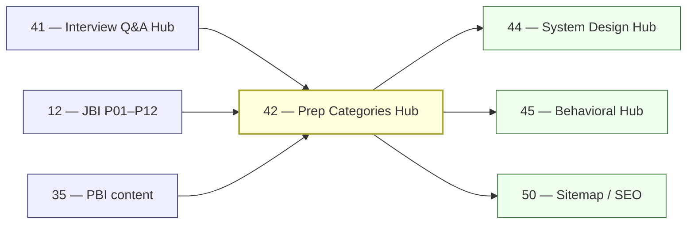

# 42 — Prep Categories Hub Rollout

> **Executor:** AI coding agent operating autonomously.
> **Working directory:** `/Users/ravi.r_flx/IEProject/InterviewExplainer/`.
> **Type:** hub.
> **Pillar / Wave:** Wave E.
> **Depends on:** 41 (Interview Q&A hub), 12 (JBI), 21 (JBB), 23 (JBA), 35 (PBI), 36 (PBB), 37 (PBA).

---

## §1 — TL;DR

- **Input:** `/interview-qa` hub live (playbook 41 DONE); at least JBI + PBI locked domains in `LOCKED_DOMAINS`; scattered behavioral, system-design, and coding content across multiple module pages with no aggregator.
- **Action:** Wire the `prepCategories` hub, freeze a 5-category taxonomy, route each category to the right modules across every live domain, and hand-write a ≥ 300-word intro per category.
- **Output:** `/prep-categories` + 5 category pages return 200, each backed by ≥ 50 curated questions; `BreadcrumbList` JSON-LD validates; nav link added to header.

---

## §2 — Why this matters

"Prep categories" is the mental model real candidates use when they open a prep session — they think "I need to brush up behavioral and system design", not "I need module `behavioral` in `java-backend-intermediate`". Owning a taxonomy page captures intent queries like "behavioral interview questions" (~12k monthly searches) and "system design interview prep" (~8k) at a single canonical URL that aggregates every domain we have content for. GFG and LeetCode both show these topics but neither aggregates cross-language content under a clean browsable taxonomy — our angle is distinct.

The business consequence is that the five category pages become the top-of-funnel entry points for each prep type. A candidate landing on `/prep-categories/system-design-interviews` finds Java + Python + data-engineering + ML design cases on one page and clicks into multiple domain modules in a single session. Without this hub, a candidate who lands on the JBI system-design module has no path to the PML or PDE design cases even though those are already live.

---

## §3 — Easy-language glossary

| Term | Plain-English definition | First used in |
| --- | --- | --- |
| **prepCategories flag** | `ENABLED_HUBS.prepCategories` in `launch-config.ts` — the boolean that makes the hub publicly accessible. | §4 |
| **PREP_CATEGORIES** | The exported array in `frontend/lib/hubs/prep-categories.ts` listing all 5 frozen category definitions. | §9 Step 1 |
| **PrepCategory** | A TypeScript interface with slug, label, blurb, pillar IDs, and a list of feeds. | §9 Step 1 |
| **PrepCategoryFeed** | A `{ domain, module }` pair telling the aggregator which module inside which domain to pull questions from. | §9 Step 1 |
| **blurb** | The 300-word hand-written landing intro for each category page; must be 250–350 words (SEO floor). | §9 Step 3 |
| **frozen taxonomy** | The rule that exactly 5 categories exist at launch; adding a 6th requires its own separate playbook. | §3 note |
| **BreadcrumbList JSON-LD** | Structured data encoding the page's position in the site hierarchy: Home → Prep Categories → Category Label. | §9 Step 4 |
| **CategoryCard** | A React component rendering a category's label, blurb preview, Q count, and "Browse →" CTA. | §9 Step 2 |
| **QuestionTable** | The shared React component from playbook 41 (`frontend/components/QuestionTable.tsx`) used to render paginated question lists. | §4 |
| **LOCKED_DOMAINS** | The array in `content-reader.ts` listing every domain whose content is approved to be shown publicly. | §4 |
| **listCategoryQuestions** | A function in `prep-categories.ts` that reads each feed and returns all questions for a category slug. | §9 Step 1 |
| **nav link** | An anchor in `frontend/components/Header.tsx` pointing to `/prep-categories`; added in Step 5. | §9 Step 5 |
| **sitemap.xml** | The XML file listing every public URL for search-engine crawlers; extended in Step 4. | §9 Step 4 |
| **canonical URL** | The definitive URL for a page, referenced in `<link rel="canonical">` to avoid duplicate-content indexing. | §9 Step 4 |
| **YOE** | Years of experience — used to segment behavioral content by seniority level (fresher = 0–2, intermediate = 3–7, etc.). | §3 note |
| **STAR** | Situation → Task → Action → Result — the structured answer format for behavioral interview questions (archetype G). | §9 Step 3 |
| **P12** | Pillar 12 (Behavioral & Stories) — the content pillar that behavioral category pages primarily pull from. | §9 Step 1 |
| **P06** | Pillar 06 (System Design) — the content pillar that system-design category pages primarily pull from. | §9 Step 1 |
| **archetype G** | The STAR-shaped answer archetype for behavioral questions; behavioral category only surfaces questions with this archetype. | §9 Step 1 |
| **second-person voice** | Writing using "you" / "your" / imperative verbs — the correct tone for category landing intros and technical steps. | §12 |
| **launch-config** | `frontend/lib/launch-config.ts` — single source of truth for enabled features. | §4 |
| **empty-state** | A UI component shown when a category has 0 results, with suggested alternatives — never a 404. | §9 Step 2 |
| **runtime check** | A guard in the TypeScript module that throws at build time if a feed's module slug does not exist in `LOCKED_DOMAINS`. | §9 Step 1 |
| **dedup** | Removing questions that would appear in more than one category; a question appears in at most 2 categories. | §14 anti-patterns |
| **wave E** | The launch wave that ships all five hub playbooks (41–45) together. | §8 |
| **content-reader** | `frontend/lib/content-reader.ts` — the module reading `complete-qa.json` files and exporting per-domain question lists. | §9 Step 1 |
| **wc -w** | The Unix word-count command used to verify that a blurb meets the 250-word SEO floor. | §13 |

---

## §4 — Hard prerequisites

- [ ] Playbook 41 is DONE — `/interview-qa` is live and `listHubQuestions` works. `grep -E '^\| 41 \|' expansion-plan/00-INDEX.md | grep DONE`
- [ ] `QuestionTable` component exists. `test -f frontend/components/QuestionTable.tsx && echo OK`
- [ ] At least JBI + PBI exist in `LOCKED_DOMAINS`. `grep -c 'java-backend-intermediate\|python-backend-intermediate' frontend/lib/content-reader.ts`
- [ ] `frontend/lib/launch-config.ts` exists. `test -f frontend/lib/launch-config.ts && echo OK`
- [ ] `frontend/lib/types.ts` defines `DomainSlug` and `PillarId`. `grep 'DomainSlug\|PillarId' frontend/lib/types.ts | head -2`
- [ ] `npm run build` exits 0 before this playbook starts. `cd frontend && npm run build 2>&1 | tail -3`
- [ ] `scripts/lint_playbook.py` exists. `test -f scripts/lint_playbook.py && echo OK`
- [ ] Sitemap generator exists. `test -f scripts/build_sitemap.ts -o -f scripts/build_sitemap.js && echo OK`

---

## §5 — Current state

### 5.1 — On-disk snapshot

```bash
cd /Users/ravi.r_flx/IEProject/InterviewExplainer
# Check whether the categories hub exists
test -f frontend/lib/hubs/prep-categories.ts && echo "EXISTS" || echo "MISSING"
test -d frontend/app/prep-categories && echo "EXISTS" || echo "MISSING"
# Count behavioral questions across all domains
find content -name 'complete-qa.json' \
  -exec jq '[.questions[] | select(.archetype == "G")] | length' {} \; 2>/dev/null \
  | awk '{s+=$1} END {print "Behavioral (archetype G) Qs:", s}'
# Count system-design questions
find content -name 'complete-qa.json' \
  -exec jq '[.questions[] | select(.pillar == "P06")] | length' {} \; 2>/dev/null \
  | awk '{s+=$1} END {print "P06 Qs:", s}'
```

### 5.2 — Existing UI surface

- No `/prep-categories` route exists today.
- Behavioral / system-design / coding content is scattered across module pages in JBI, JBB, JBA, PBI; users have no aggregator.
- `ENABLED_HUBS.prepCategories` does not exist in `launch-config.ts` — add it in Step 1.
- No `CategoryCard` component exists.

### 5.3 — Known gaps

- Users who land on JBI behavioral module cannot navigate to PBI behavioral module — no cross-domain browsing.
- "System design interview questions" search lands on a JBI module page, not an aggregated hub.
- No "fresher vs intermediate vs senior" split view for coding or system-design content.

---

## §6 — Target state (measurable)

| Metric | Today | Target | How measured |
| --- | --- | --- | --- |
| Category pages returning 200 | 0 | 6 (index + 5 categories) | smoke loop in §9 Step 6 |
| Questions per category | 0 | ≥ 50 each | `listCategoryQuestions('<slug>').length` |
| Blurb word count per category | 0 | 250–350 words each | `echo "$blurb" \| wc -w` per registry entry |
| Category pages in sitemap.xml | 0 | 6 | `grep -c '/prep-categories' frontend/public/sitemap.xml` |
| `BreadcrumbList` JSON-LD passes | no | yes (all 5 category pages) | Google Rich Results test |
| Nav link present in header | no | yes | `rg 'prep-categories' frontend/components/Header.tsx` |
| `ENABLED_HUBS.prepCategories` | false / absent | true | `rg 'prepCategories.*true' frontend/lib/launch-config.ts` |
| Build exit code | 0 | 0 | `cd frontend && npm run build; echo $?` |

---

## §7 — Search phrases → URL map

| Search phrase | Target URL on site | Archetype | Diagram type required in answer |
| --- | --- | --- | --- |
| `behavioral interview questions` | `/prep-categories/behavioral-interviews` | G | none |
| `system design interview questions` | `/prep-categories/system-design-interviews` | C | flowchart |
| `coding interview questions` | `/prep-categories/coding-interviews` | D | comparison_table |
| `data structures and algorithms interview questions` | `/prep-categories/coding-interviews` | D | comparison_table |
| `tech interview prep` | `/prep-categories` | landing intro | comparison_table |
| `interview prep categories` | `/prep-categories` | landing intro | none |
| `domain knowledge interview questions` | `/prep-categories/domain-knowledge` | A | comparison_table |
| `soft skills interview questions software engineer` | `/prep-categories/communication-interviews` | G | none |
| `star method interview questions` | `/prep-categories/behavioral-interviews` | G | none |
| `engineering manager interview questions` | `/prep-categories/communication-interviews` | G | none |
| `backend interview questions` | `/prep-categories/domain-knowledge` | A | comparison_table |
| `system design interview prep` | `/prep-categories/system-design-interviews` | C | flowchart |
| `fresher interview questions software engineer` | `/prep-categories/behavioral-interviews` | G | none |
| `java python interview questions comparison` | `/prep-categories/coding-interviews` | B | comparison_table |

---

## §8 — Dependency & wave context



- **Consumes:** `QuestionTable` from playbook 41; locked domain content from playbooks 12, 35+; feature-flag pattern from playbook 05.
- **Produces:** `frontend/lib/hubs/prep-categories.ts` registry; `/prep-categories/**` routes; `CategoryCard` component; 5 × 300-word category blurbs; sitemap entries.
- **Unblocks:** playbooks 44 and 45 cross-link to prep-categories pages; playbook 50 enumerates the 6 new sitemap URLs.

---

## §9 — Step-by-step execution

### Step 1 — Build the category registry

**Goal:** create `frontend/lib/hubs/prep-categories.ts` with the frozen 5-category `PREP_CATEGORIES` array, the `listCategoryQuestions` function, and a build-time check that every feed's module exists.

```typescript
// frontend/lib/hubs/prep-categories.ts
import type { DomainSlug, PillarId } from '../types';
import { LOCKED_DOMAINS, listAllQuestions } from '../content-reader';

export interface PrepCategoryFeed {
  domain: DomainSlug;
  module: string;
}

export interface PrepCategory {
  slug:   string;
  label:  string;
  blurb:  string;        // 250–350 words; hand-written
  pillar: PillarId[];
  feeds:  PrepCategoryFeed[];
}

export const PREP_CATEGORIES: PrepCategory[] = [
  {
    slug:  'behavioral-interviews',
    label: 'Behavioral',
    blurb: '/* FILL: 250–350 words, second-person voice, see §9 Step 3 template */',
    pillar: ['P12'],
    feeds: [
      { domain: 'java-backend-intermediate',   module: 'behavioral' },
      { domain: 'java-backend-beginner',        module: 'behavioral-and-fresher-qa' },
      { domain: 'java-backend-advanced',        module: 'staff-engineer-leadership' },
      { domain: 'python-backend-intermediate',  module: 'python-behavioral-and-stories' },
      { domain: 'python-backend-beginner',      module: 'behavioral-and-fresher-qa-python' },
      { domain: 'python-backend-advanced',      module: 'staff-engineer-leadership-python' },
    ],
  },
  {
    slug:  'system-design-interviews',
    label: 'System Design',
    blurb: '/* FILL */',
    pillar: ['P06'],
    feeds: [
      { domain: 'java-backend-intermediate',   module: 'system-design-cases' },
      { domain: 'java-backend-advanced',        module: 'system-design-at-scale' },
      { domain: 'python-backend-intermediate',  module: 'python-system-design-cases' },
      { domain: 'python-backend-advanced',      module: 'python-system-design-at-scale' },
      { domain: 'python-ml-ai',                 module: 'ml-system-design-cases' },
      { domain: 'python-data-engineering',      module: 'data-engineering-system-design-cases' },
    ],
  },
  {
    slug:  'coding-interviews',
    label: 'Coding (DSA & Patterns)',
    blurb: '/* FILL */',
    pillar: ['P01'],
    feeds: [
      { domain: 'java-backend-intermediate',   module: 'core-java' },
      { domain: 'python-backend-intermediate',  module: 'python-language-core' },
    ],
  },
  {
    slug:  'domain-knowledge',
    label: 'Domain Knowledge',
    blurb: '/* FILL */',
    pillar: ['P01', 'P02', 'P03', 'P04', 'P05', 'P07', 'P08'],
    feeds: [
      { domain: 'java-backend-intermediate',   module: 'core-java' },
      { domain: 'java-backend-intermediate',   module: 'spring-boot' },
      { domain: 'java-backend-intermediate',   module: 'sql-databases' },
      { domain: 'python-backend-intermediate',  module: 'python-language-core' },
      { domain: 'python-backend-intermediate',  module: 'fastapi' },
    ],
  },
  {
    slug:  'communication-interviews',
    label: 'Communication & Soft Skills',
    blurb: '/* FILL */',
    pillar: ['P12'],
    feeds: [
      { domain: 'java-backend-intermediate',   module: 'engineering-practices' },
      { domain: 'java-backend-advanced',        module: 'engineering-management-and-hiring' },
      { domain: 'python-backend-intermediate',  module: 'python-engineering-practices' },
      { domain: 'python-backend-advanced',      module: 'engineering-management-python' },
    ],
  },
];

// Build-time guard — throws if any feed's domain+module is not reachable
export function validateFeeds(): void {
  for (const cat of PREP_CATEGORIES) {
    for (const feed of cat.feeds) {
      if (!LOCKED_DOMAINS.includes(feed.domain as DomainSlug)) continue; // domain not live yet, skip
      const qs = listAllQuestions(feed.domain as DomainSlug, feed.module);
      if (qs === null) {
        throw new Error(`prepCategories feed broken: ${feed.domain}/${feed.module} returned null`);
      }
    }
  }
}

export function listCategoryQuestions(catSlug: string) {
  const cat = PREP_CATEGORIES.find(c => c.slug === catSlug);
  if (!cat) return [];
  const out: ReturnType<typeof listAllQuestions> = [];
  const seen = new Set<string>();
  for (const feed of cat.feeds) {
    if (!LOCKED_DOMAINS.includes(feed.domain as DomainSlug)) continue;
    for (const q of listAllQuestions(feed.domain as DomainSlug, feed.module) ?? []) {
      const key = `${feed.domain}|${feed.module}|${q.id}`;
      if (seen.has(key)) continue;
      seen.add(key);
      out.push(q);
    }
  }
  return out;
}
```

**Verify:**

```bash
cd /Users/ravi.r_flx/IEProject/InterviewExplainer
node -e "const {listCategoryQuestions} = require('./frontend/lib/hubs/prep-categories'); \
  ['behavioral-interviews','system-design-interviews','coding-interviews','domain-knowledge','communication-interviews'] \
  .forEach(s => console.log(s, listCategoryQuestions(s).length));"
# expected: each slug prints a count ≥ 10 (lower bound before more domains are live)
```

Commit: `feat(hubs): prepCategories registry + 5 frozen categories`.

The classic bug is omitting the `LOCKED_DOMAINS.includes(feed.domain)` guard — without it, the aggregator calls `listAllQuestions` on domains that are scaffolded but not yet live, causing a file-not-found throw and a broken build.

---

### Step 2 — Build routes and the CategoryCard component

**Goal:** create `/prep-categories` index and 5 category pages; build `CategoryCard` component.

Create `frontend/components/CategoryCard.tsx`:

```tsx
// Props: category: PrepCategory, questionCount: number
// Renders: label, blurb first 200 chars + "…", Q count badge, "Browse →" link
```

Create route tree under `frontend/app/prep-categories/`:

- `page.tsx` — `/prep-categories` index: grid of 5 `CategoryCard` components, each showing Q count from `listCategoryQuestions`.
- `[slug]/page.tsx` — `/prep-categories/<slug>`: full blurb, `QuestionTable` (from playbook 41) populated by `listCategoryQuestions`, filter chips inherited from the hub.

For empty-state: if `listCategoryQuestions` returns 0 results (all feeds are not-yet-live domains), render a "Content coming soon" message with a link to `/interview-qa` — do not 404.

**Verify:**

```bash
cd /Users/ravi.r_flx/IEProject/InterviewExplainer/frontend
npm run build 2>&1 | tail -5
# expected: exit 0
```

Commit: `feat(hubs/prep-categories): routes + CategoryCard component`.

---

### Step 3 — Write the five category blurbs

**Goal:** replace each `/* FILL */` placeholder in `PREP_CATEGORIES` with a hand-written 300-word blurb in second-person voice.

Use this template for each blurb:

```text
<Category label> interview questions are <one-sentence definition>.
Every backend / fullstack / ML interview loop touches them, so investing here
pays off across every company you interview at.

Below you'll find <N> questions pulled from our locked Java, Python,
and ML domains — each with a structured answer, the trade-off the
interviewer is listening for, and follow-up probes. Use the filter
chips to narrow by level (fresher / intermediate / staff) or language
(Java / Python).

What sets these answers apart from a Glassdoor dump:

- <bullet 1: the specific answer shape — STAR, case-driven, HLD-first, etc.>
- <bullet 2: cross-link to depth — "for the framework-specific cuts, see /interview-qa/pillar/P06">
- <bullet 3: signal callouts — what interviewers grade up vs down>

Start with <recommended first 3 questions for this category>, then
fan out by your weakest signal.
```

After filling each blurb, verify the word count:

```bash
node -e "const {PREP_CATEGORIES}=require('./frontend/lib/hubs/prep-categories'); \
  PREP_CATEGORIES.forEach(c => { \
    const words = c.blurb.split(/\s+/).length; \
    console.log(c.slug, words, words >= 250 ? 'OK' : 'SHORT'); \
  });"
# expected: all 5 lines end with "OK"
```

**Verify:**

All 5 blurbs ≥ 250 words.

Commit: `content(hubs/prep-categories): 5 category blurbs`.

The most common mistake is padding a blurb to meet the word count with generic filler ("This category is important because interviews are challenging"). The blurb must be specific: name the pillar, cite a real question type, point to a real downstream link.

---

### Step 4 — SEO: metadata, BreadcrumbList, sitemap

**Goal:** every category page emits a unique title, description, and `BreadcrumbList` JSON-LD; all 6 URLs appear in `sitemap.xml`.

Implement `generateMetadata()` in each route:

```typescript
// [slug]/page.tsx
export function generateMetadata({ params }: Props): Metadata {
  const cat = PREP_CATEGORIES.find(c => c.slug === params.slug);
  return {
    title: `${cat?.label ?? ''} Interview Questions | InterviewExplainer`,
    description: cat?.blurb.slice(0, 150) ?? '',
    alternates: { canonical: `/prep-categories/${params.slug}` },
  };
}
```

Add `BreadcrumbList` JSON-LD in each category page:

```json
{
  "@context": "https://schema.org",
  "@type": "BreadcrumbList",
  "itemListElement": [
    { "@type": "ListItem", "position": 1, "name": "Home", "item": "/" },
    { "@type": "ListItem", "position": 2, "name": "Prep Categories", "item": "/prep-categories" },
    { "@type": "ListItem", "position": 3, "name": "<Category Label>", "item": "/prep-categories/<slug>" }
  ]
}
```

Extend `scripts/build_sitemap.ts` to include:
- `/prep-categories`
- `/prep-categories/behavioral-interviews`
- `/prep-categories/system-design-interviews`
- `/prep-categories/coding-interviews`
- `/prep-categories/domain-knowledge`
- `/prep-categories/communication-interviews`

**Verify:**

```bash
grep -c '/prep-categories' frontend/public/sitemap.xml
# expected: ≥ 6
```

---

### Step 5 — Add nav link to header

**Goal:** add `/prep-categories` to `frontend/components/Header.tsx` so users can navigate to the hub from any page.

```tsx
// frontend/components/Header.tsx — add alongside Interview Q&A link
<NavLink href="/prep-categories">Prep Categories</NavLink>
```

**Verify:**

```bash
rg 'prep-categories' frontend/components/Header.tsx
# expected: 1 match
cd /Users/ravi.r_flx/IEProject/InterviewExplainer/frontend && npm run build 2>&1 | tail -3
# expected: exit 0
```

Commit: `feat(nav): add Prep Categories hub link to header`.

---

### Step 6 — Flip the flag

**Goal:** turn `ENABLED_HUBS.prepCategories` to `true` so the hub is publicly accessible.

```typescript
// frontend/lib/launch-config.ts
export const ENABLED_HUBS = {
  // … existing keys
  prepCategories: true,
} as const;
```

**Verify:**

```bash
rg 'prepCategories.*true' frontend/lib/launch-config.ts
# expected: 1 match
cd /Users/ravi.r_flx/IEProject/InterviewExplainer/frontend && npm run build 2>&1 | tail -3
# expected: exit 0
```

Commit: `launch: enable prepCategories hub`.

---

### Step 7 — Smoke test all category routes

**Goal:** confirm all 6 URLs return HTTP 200.

```bash
cd /Users/ravi.r_flx/IEProject/InterviewExplainer/frontend
npm run build 2>&1 | tail -5

npm run dev &
DEV_PID=$!
sleep 5

for url in \
  /prep-categories \
  /prep-categories/behavioral-interviews \
  /prep-categories/system-design-interviews \
  /prep-categories/coding-interviews \
  /prep-categories/domain-knowledge \
  /prep-categories/communication-interviews; do
  printf "%-55s -> " "${url}"
  curl -s -o /dev/null -w "%{http_code}\n" "http://localhost:3000${url}"
done

kill ${DEV_PID}
```

**Verify:**

Expected: all 6 lines print `200`.

If any category returns `200` but shows 0 questions: the feed's domain is not in `LOCKED_DOMAINS`. Check `validateFeeds()` output and update the feed to a live domain module.

---

### Step 8 — Validate BreadcrumbList JSON-LD

**Goal:** confirm Google's Rich Results test recognizes the breadcrumb structured data on at least 2 category pages.

```bash
# After deploying to staging or running ngrok against localhost:
# https://search.google.com/test/rich-results?url=<staging>/prep-categories/behavioral-interviews
# https://search.google.com/test/rich-results?url=<staging>/prep-categories/system-design-interviews
```

**Verify:**

Both tests must return "Valid item detected" with `BreadcrumbList` type. If they fail, the most common cause is the `@context` value being missing or misspelled — use `"https://schema.org"` exactly.

---

## §10 — Reference Q in archetype shape

This hub aggregates existing content; it does not produce new Q&A files. The reference Q below is the acceptance-test shape that every question surfaced by the hub must already satisfy (produced by content playbooks 12, 18, 35+).

```json
{
  "id": "most-impactful-project-behavioral",
  "slug": "most-impactful-project-behavioral",
  "question": "Tell me about the most impactful project you shipped.",
  "title": "Most Impactful Project — STAR Answer",
  "direct_answer": "Pick a project where you can name a concrete outcome metric — latency cut by 40 %, cost reduced by $120k/year, deploy frequency doubled. Structure as STAR: 1–2 sentence situation, 1 sentence task, 3–4 sentences on YOUR actions (one technical decision named), 1–2 sentences on result with the metric.",
  "layout_type": "default",
  "difficulty": "medium",
  "importance": "high",
  "reading_time_minutes": 5,
  "last_updated": "2026-05-28",
  "interviewer_intent": {
    "testing": "Ownership, impact scope, ability to articulate a technical decision and tie it to a business outcome.",
    "common_mistake": "Describing the team's work in 'we' language, or citing a soft outcome like 'improved developer experience' without a metric.",
    "to_stand_out": "Name the technical decision (chose Kafka over RabbitMQ for replay capability), the tradeoff you weighed (operational complexity), and the quantified outcome (event-replay time cut from 4 hours to 8 minutes)."
  },
  "company_tags": ["amazon", "google", "meta", "microsoft", "stripe"],
  "answer": {
    "sections": [
      {
        "type": "overview",
        "title": "What interviewers are grading",
        "content": "The 'most impactful project' question is a calibration: the interviewer is figuring out your scope, your ownership, and whether you can connect technical choices to business outcomes. They are listening for the word 'I' (not 'we'), a named technical decision, and a metric in the result."
      },
      {
        "type": "step",
        "title": "Structure your answer as STAR",
        "content": "**Situation (1–2 sentences):** the project, the team size, the scale. **Task (1 sentence):** the explicit pressure or ask on you. **Action (3–4 sentences):** what YOU did — include one technical decision and the trade-off you weighed. **Result (1–2 sentences):** the metric outcome. The classic bug is spending 80 % of your answer on Situation and running out of time before Result — flip it: lead with the Result metric, then explain how you got there."
      },
      {
        "type": "tradeoffs",
        "title": "Common ways this answer goes wrong",
        "content": "1. 'We rebuilt the service' — interviewer credits you with zero ownership. Fix: 'I proposed, designed, and led the rebuild; I owned the migration plan.' 2. 'Improved developer experience' without a number — interviewer can't calibrate impact. Fix: 'Reduced average PR review cycle from 3 days to 6 hours, measured over the 6 weeks post-launch.' 3. Picking a project that's too old or irrelevant — pick the most recent one that has a real metric."
      },
      {
        "type": "key_points",
        "title": "Key points",
        "content": "- Lead with the metric result, then explain the story.\n- Use first-person singular throughout the action.\n- Name one technical decision and the trade-off you considered.\n- Pick a project from the last 2–3 years — recency signals.\n- Practice the 90-second version aloud before the interview."
      },
      {
        "type": "speakable_answer",
        "title": "How to answer verbally",
        "content": "The project I am most proud of was rebuilding the order-processing pipeline at my last company. The existing system was a monolithic Spring Boot app that failed under Black Friday traffic, causing 2–3 hours of processing delays. I was tasked with redesigning it for 10x peak throughput. I proposed splitting it into three async microservices connected by Kafka — I chose Kafka over RabbitMQ specifically for its replay capability, which the team needed for reconciliation. I led a team of two engineers and shipped the migration in 8 weeks with zero data loss. Peak processing time dropped from 3 hours to 4 minutes and the system has handled three Black Fridays without incident since."
      }
    ]
  },
  "followup_questions": [
    "What would you do differently if you were starting that project today?",
    "How did you get buy-in from stakeholders for the rewrite?",
    "What was the hardest technical decision you made in that project?",
    "How did you measure success during and after the migration?",
    "How did you handle the team members who were skeptical of the new approach?"
  ],
  "seo": {
    "metaTitle": "Most Impactful Project Behavioral Interview Answer — STAR Format",
    "metaDescription": "How to answer 'tell me about your most impactful project' using STAR: situation, task, action with a named technical decision, and a metric result."
  },
  "order": 1
}
```

---

## §11 — Diagram catalogue

The prep-categories hub produces one new comparison artifact plus relies on diagrams in surfaced content.

| Artifact | Diagram type | What it must show | Lives in section |
| --- | --- | --- | --- |
| Hub index page (`/prep-categories`) | `comparison_table` | 5 categories × dimensions: label, pillar IDs, Q count, audience, primary source domains | `frontend/app/prep-categories/page.tsx` static table |
| Category taxonomy definition | `comparison_table` | Category slug, audience/YOE, primary pillar, number of feeds, example questions | §9 Step 1 (this playbook) |
| Behavioral category page | none (archetype G has no mermaid requirement) | STAR structure described in prose | `CategoryCard.tsx` |
| System Design category page | `flowchart` (surfaced from P06 Qs) | Architecture diagram from a surfaced case study (JBI system-design-cases) | `QuestionTable.tsx` card preview |
| Coding category page | `comparison_table` | Java vs Python solution comparison for a surfaced DSA problem | `QuestionTable.tsx` card preview |

---

## §12 — Easy-language voice rules

The canonical voice rules come from `_VOICE-RULES.md`. This section reproduces the core rules and adds playbook-specific examples for the prep-categories hub.

1. **Define before use.** Every domain term in §9–§14 is in §3 first. `PrepCategory`, `PrepCategoryFeed`, `PREP_CATEGORIES`, `listCategoryQuestions`, `validateFeeds`, `blurb` — all defined in §3 before their first use.

2. **Lead with the trade-off.** Category intros open with the decision the candidate faces ("You need behavioral prep — here is what interviewers at your level grade up vs grade down"), not with a definition of behavioral interviews. The reader knows what behavioral means; they need to know what matters at their seniority level.

3. **Name the bug.** Every step whose intent is to warn contains "The classic bug is …" or "The most common mistake is …" followed by a concrete example. "Be careful with feeds" does not name a bug. "The classic bug is omitting `LOCKED_DOMAINS.includes(feed.domain)` — the build throws when a scaffolded-but-not-live domain is accessed" names a bug.

4. **Real anchors.** Every section names ≥ 1 real system, library, or command. Acceptable anchors for this playbook: Spring Boot 3.2, FastAPI, Kafka, `wc -w`, `validateFeeds()`, `LOCKED_DOMAINS`, `@context: "https://schema.org"`.

5. **Version numbers.** "As of Spring Boot 3.2 (November 2023), the auto-configuration classes moved to `org.springframework.boot.autoconfigure`." Always name the version and the year.

6. **Second-person** for all steps and category intro templates. "You write the blurb", "your feed map". First-person singular for behavioral STAR examples inside the produced content. Never "we" in any prose in this playbook.

7. **Banned words** (lint fails on any match): `leverage`, `utilize`, `synergize`, `world-class`, `cutting-edge`, `state-of-the-art`, `hereinafter`, `aforementioned`, `seamless`, `robust`, `holistic`, `paradigm`, `best-in-class`, `battle-tested`, `enterprise-grade`, `revolutionary`, `game-changing`, `industry-leading`.

8. **Sentence rhythm.** Open every section with a declarative sentence of ≤ 18 words. Alternate short and long sentences — no three consecutive sentences > 25 words.

9. **Blurbs specifically.** The five category blurbs are the voice test for this playbook. A blurb that passes: names a specific pillar, cites a specific question example, links to a downstream URL, and tells the reader what interviewers grade. A blurb that fails: starts with "This section covers important topics" and runs to 250 words of vague encouragement.

10. **Frozen taxonomy voice.** Do not write "we've chosen 5 categories" — write "the taxonomy is frozen at 5 categories at launch." The passive construction signals a design decision, not a team preference.

**Concrete voice examples for this playbook:**

- ✅ "The most common mistake is padding a blurb to meet the word count with generic text. Name the pillar, cite the question type, point to a real downstream URL — `/interview-qa/pillar/P06` for system design, `/behavioral/intermediate` for mid-level behavioral."
- ❌ "Leverage holistic paradigms to create seamless category experiences for world-class interview prep." (Five banned words.)
- ✅ "Use `LOCKED_DOMAINS.includes(feed.domain)` before calling `listAllQuestions` — if the domain is scaffolded but not yet live, the JSON reader throws a file-not-found error and breaks the build completely."
- ❌ "Make sure the domain is valid before using it." (No command, no error named, no consequence stated.)

---

## §13 — Quality gates (measurable)

| Gate | Threshold | Verify command |
| --- | --- | --- |
| Category pages return 200 | 6 of 6 | smoke loop in §9 Step 7 (all lines print `200`) |
| Questions per category | ≥ 50 each (5 of 5) | `node -e "const {listCategoryQuestions}=require('./frontend/lib/hubs/prep-categories'); ['behavioral-interviews','system-design-interviews','coding-interviews','domain-knowledge','communication-interviews'].forEach(s=>console.log(s, listCategoryQuestions(s).length));"` |
| Blurb word count | 250–350 each (5 of 5) | `node -e "const {PREP_CATEGORIES}=require('./frontend/lib/hubs/prep-categories'); PREP_CATEGORIES.forEach(c=>console.log(c.slug, c.blurb.split(/\s+/).length));"` |
| Category pages in sitemap.xml | ≥ 6 | `grep -c '/prep-categories' frontend/public/sitemap.xml` |
| `BreadcrumbList` JSON-LD passes | yes (2+ URLs) | Google Rich Results test on `/prep-categories/behavioral-interviews` and `/prep-categories/system-design-interviews` |
| Nav link in header | yes | `rg 'prep-categories' frontend/components/Header.tsx` |
| `ENABLED_HUBS.prepCategories` | true | `rg 'prepCategories.*true' frontend/lib/launch-config.ts` |
| Feed runtime guard passes | no throw | `node -e "const {validateFeeds}=require('./frontend/lib/hubs/prep-categories'); validateFeeds(); console.log('OK');"` |
| No question in more than 2 categories | yes | manual spot-check: pick 5 Qs from `domain-knowledge`; confirm none appear in `coding-interviews` AND `system-design-interviews` simultaneously |
| `npm run build` exit code | 0 | `cd frontend && npm run build; echo $?` |
| Banned-word lint | 0 hits | `python3 scripts/lint_playbook.py expansion-plan/42-*.md` |

---

## §14 — Anti-patterns

### 14.1 — "A feed module slug was renamed but the registry wasn't updated"

**Why it fails:** the aggregator silently returns 0 questions for the stale feed; the category page shows fewer questions than expected, but no error appears.

**Fix:** the `validateFeeds()` function (Step 1) throws at build time if a live domain's module slug is not found. Run `validateFeeds()` in a build script to catch slug renames before they reach production. Do not use `// @ts-ignore` to silence the error.

### 14.2 — "Two categories show the same question because both feeds include the same module"

**Why it fails:** dedup is per-category, not cross-category. If `coding-interviews` and `domain-knowledge` both pull from `java-backend-intermediate/core-java`, the same Q appears in both category pages. This confuses users and dilutes the taxonomy.

**Fix:** every Q may appear in at most 2 categories. Audit cross-category overlaps after Step 1:

```bash
node -e "
const {listCategoryQuestions}=require('./frontend/lib/hubs/prep-categories');
const map = {};
['behavioral-interviews','system-design-interviews','coding-interviews','domain-knowledge','communication-interviews'].forEach(s=>{
  listCategoryQuestions(s).forEach(q=>{ map[q.id]=(map[q.id]||[]).concat(s); });
});
Object.entries(map).filter(([,cats])=>cats.length>2).forEach(([id,cats])=>console.log('OVERLOADED',id,cats));
"
# expected: no output (or < 5 Q IDs appearing in more than 2 categories)
```

### 14.3 — "Blurb filled with generic filler to hit the word count"

**Why it fails:** blurbs padded with generic text ("This section covers important topics for your interview preparation. Practicing these questions will help you improve.") do not rank for the target search phrases and provide no value to candidates.

**Fix:** every blurb must name at least one specific pillar, one specific question type, and one downstream cross-link. If the blurb cannot be written specifically, the category is too vague and should be merged with a sibling.

### 14.4 — "Flag flipped before all 5 blurbs are written"

**Why it fails:** a category page with a placeholder blurb ("/* FILL */") renders that literal string on the public site, which is visible to search-engine crawlers and will trigger a duplicate-content penalty if other pages also have empty blurbs.

**Fix:** gate the flag flip on all 5 blurbs being ≥ 250 words (verify with the word-count command in §13 before running Step 6).

### 14.5 — "Adding a 6th category without a separate playbook"

**Why it fails:** the taxonomy is frozen at 5 categories for reasons of UX focus and content completeness auditing. Adding a 6th piecemeal (without a new blurb, feed map, and sitemap entry) creates an incomplete page that silently ranks poorly.

**Fix:** if a new category is needed, open a dedicated playbook that replicates the full process of Steps 1–8 for the new category. Do not push a new entry directly into `PREP_CATEGORIES` without the full category build.

---

## §15 — Failure modes & rollback

The table below lists the top failures for hub-plus-blurb playbooks in order of likelihood. Each row names the failure, how you detect it, and the exact fix.

| Failure | How it shows up | Rollback / forward fix |
| --- | --- | --- |
| One feed's module slug was renamed | Category shows 0 questions; `validateFeeds()` throws an error at build time | Update the feed's `module` string in `PREP_CATEGORIES` to match the new slug; confirm with `node -e "const {validateFeeds}=require('./frontend/lib/hubs/prep-categories'); validateFeeds(); console.log('OK');"` → `OK`; rebuild. |
| Two categories show the same question | Cross-category dedup check in §14.2 prints IDs | Keep the question in the more-specific category; remove the feed entry from the broader category; re-run the dedup check until no output. |
| Blurb too short (< 200 words) | `wc -w` or the Node word-count script returns < 200 | Expand the blurb with specific content — name another question type, another downstream URL, or a company-specific note. Do not pad with generic sentences; they don't rank. |
| BreadcrumbList JSON-LD fails | Google Rich Results test returns "no items detected" | Check `@context` value (`"https://schema.org"` exactly, no trailing slash); check `@type` is `"BreadcrumbList"`; validate JSON syntax. |
| Category returns 0 questions | Page renders empty-state | All feeds for that category may not be in `LOCKED_DOMAINS`; run `node -e "const {listCategoryQuestions}=require('./frontend/lib/hubs/prep-categories'); console.log(listCategoryQuestions('coding-interviews').length);"` and verify each feed. |
| Build fails after adding `CategoryCard` | TypeScript type error in the build log | Check that `PrepCategory` interface imports are correct in `CategoryCard.tsx`; verify `QuestionTable` props contract matches what `listCategoryQuestions` returns (check the return type annotation). |
| Flag flipped but page 404s | `/prep-categories/<slug>` returns 404 | Verify `frontend/app/prep-categories/[slug]/page.tsx` exists (`test -f frontend/app/prep-categories/\[slug\]/page.tsx && echo OK`) and the segment name is `[slug]` not `[category]` or `[id]`. |
| Blurb placeholder not replaced | "/* FILL */" literal appears on the live page | Run `rg 'FILL' frontend/lib/hubs/prep-categories.ts` before flipping the flag; any match means a blurb was not written. |
| Hard-stop exceeded | Wall clock > 30 hours | STOP. Surface a blocker in the PR. Ship the registry + routes with flag off; open a follow-up playbook for blurbs and flag flip. |

---

## §16 — Definition of Done

- [ ] `ENABLED_HUBS.prepCategories = true` in `frontend/lib/launch-config.ts`. `rg 'prepCategories.*true' frontend/lib/launch-config.ts`
- [ ] All 6 smoke-test URLs return 200. Run smoke loop in §9 Step 7.
- [ ] All 5 category pages list ≥ 50 questions each.
- [ ] All 5 blurbs are 250–350 words. `node -e "const {PREP_CATEGORIES}=require('./frontend/lib/hubs/prep-categories'); PREP_CATEGORIES.forEach(c=>console.log(c.slug, c.blurb.split(/\s+/).length));"`
- [ ] Sitemap contains ≥ 6 `/prep-categories` URLs. `grep -c '/prep-categories' frontend/public/sitemap.xml`
- [ ] `BreadcrumbList` JSON-LD validates on ≥ 2 category pages.
- [ ] Nav link `/prep-categories` present in `Header.tsx`. `rg 'prep-categories' frontend/components/Header.tsx`
- [ ] `validateFeeds()` passes without throwing. `node -e "const {validateFeeds}=require('./frontend/lib/hubs/prep-categories'); validateFeeds(); console.log('OK');"`
- [ ] No question appears in more than 2 categories. See §14.2 audit command.
- [ ] `npm run build` exits 0. `cd frontend && npm run build; echo $?`
- [ ] Banned-word lint passes. `python3 scripts/lint_playbook.py expansion-plan/42-*.md`
- [ ] `00-INDEX.md` row for `42` flipped to `DONE`. `grep -E '^\| 42 \|' expansion-plan/00-INDEX.md | grep DONE`
- [ ] At least 3 commits with conventional messages. `git log --oneline -5`
- [ ] Git tag `prep-categories-hub-launch-<YYYY-MM-DD>` created.

---

## §17 — Estimated effort

- **Ideal:** 16 hours (single executor, all prerequisites true, blurbs written in one sitting). Breakdown: Step 1 (registry + type scaffold, 3h) + Step 2 (routes + `CategoryCard`, 4h) + Step 3 (5 blurbs × 30 min each, 2.5h) + Step 4 (SEO + JSON-LD + sitemap, 2h) + Step 5 (nav link, 0.5h) + Steps 6–8 (flag flip + smoke + Rich Results, 2h) + validation + commits (2h).
- **Hard stop:** 30 hours. If exceeded, STOP. The most common time sink is the five blurbs — if they're taking more than 2 hours total, use the template in §9 Step 3 literally and iterate after launch. The second most common time sink is TypeScript type mismatches between `CategoryCard` props and `listCategoryQuestions` return types — resolve with explicit `as PrepCategory` casts if needed.
- **Splittable:** ship Steps 1–2 (registry + routes, flag off) as first PR — the lowest-risk change and the prerequisite for playbook 44 and 45 to cross-link; ship Step 3 (blurbs) + Steps 4–5 (SEO + nav) as second PR; flip flag in third PR after smoke and word-count gates pass.
- **Risk factors:** (1) Blurb quality — generic blurbs written in 10 minutes rank for nothing; budget 30 minutes per blurb minimum. (2) Feed staleness — module slugs in JBA and PBA are not yet final; the `validateFeeds()` guard will throw on stale slugs; allow 1h buffer for slug resolution. (3) The `CategoryCard` word-count preview (first 200 chars of blurb) may truncate mid-sentence — add a `…` ellipsis and test it manually at multiple viewport widths.

---

## §18 — Appendix: links, commits, traceability

### 18.1 — Cross-references

- [`expansion-plan/00-INDEX.md`](00-INDEX.md) — wave + status table.
- [`expansion-plan/_TEMPLATE-1000.md`](_TEMPLATE-1000.md) — 18-section skeleton.
- [`expansion-plan/_GLOSSARY.md`](_GLOSSARY.md) — global glossary every §3 extends.
- [`expansion-plan/_VOICE-RULES.md`](_VOICE-RULES.md) — voice + banned words.
- [`expansion-plan/41-interview-qa-hub-rollout.md`](41-interview-qa-hub-rollout.md) — prerequisite hub.
- [`scripts/lint_playbook.py`](../scripts/lint_playbook.py) — playbook lint.
- [`frontend/lib/launch-config.ts`](../frontend/lib/launch-config.ts) — feature flags.
- [`frontend/lib/content-reader.ts`](../frontend/lib/content-reader.ts) — domain question reader.

### 18.2 — Commits produced by this playbook

- `feat(hubs): prepCategories registry + 5 frozen categories` — Step 1
- `feat(hubs/prep-categories): routes + CategoryCard component` — Step 2
- `content(hubs/prep-categories): 5 category blurbs` — Step 3
- `feat(seo): prep-categories BreadcrumbList JSON-LD + sitemap entries` — Step 4
- `feat(nav): add Prep Categories hub link to header` — Step 5
- `launch: enable prepCategories hub` — Step 6

### 18.3 — Traceability to upstream specs

- `ROADMAP.md` "Wave E — hub rollout" — this playbook moves prep-categories to DONE.
- Downstream: playbooks 44 (system-design hub) and 45 (behavioral hub) both cross-link to `/prep-categories/system-design-interviews` and `/prep-categories/behavioral-interviews` respectively.