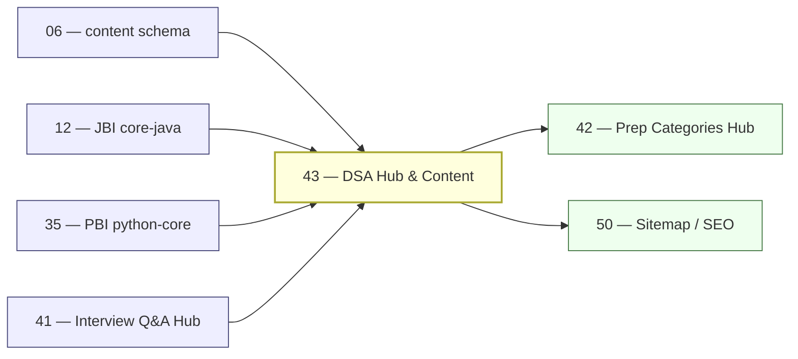

# 43 — DSA Hub & Content

> **Executor:** AI coding agent operating autonomously.
> **Working directory:** `/Users/ravi.r_flx/IEProject/InterviewExplainer/`.
> **Type:** content-writing + hub.
> **Pillar / Wave:** Wave E.
> **Depends on:** 06 (`content-schema`), 12 (JBI core-java), 35 (PBI Python core), 41 (Interview Q&A hub).

---

## §1 — TL;DR

- **Input:** JBI core-java and PBI python-language-core modules are live; `content/dsa/` directory may be absent or empty; no DSA routes exist in `frontend/app/`.
- **Action:** Build the DSA hub — scaffold `content/dsa/` with 10 patterns × 10 problems = 100 canonical problems, each with a real Java 21 solution, a real Python 3.12 solution, complexity analysis, trade-offs, ≥ 3 follow-up probes, and a speakable summary; then build the hub UI.
- **Output:** `/dsa` live with 100 problems indexed by pattern; `ENABLED_HUBS.dsa = true`; hub appears in nav and sitemap.

---

## §2 — Why this matters

DSA is the single largest interview-prep search bucket — "blind 75", "neetcode 150", "two sum java", and the hundreds of per-problem search queries together clear multiple millions of monthly searches in English. The current site has no DSA surface; every one of those searches bounces to LeetCode, NeetCode, or GFG.

The differentiation angle is dual-language solutions with structured trade-offs. LeetCode shows user-submitted code in a comment thread; NeetCode is video-first. Neither ships a text-first page with a Java solution, a Python solution, a one-paragraph complexity analysis, and a "how to answer this verbally" section in the same view. That gap is exactly the shape of what this site does well. Skipping this playbook means the entire DSA search traffic bucket stays permanently dark for the site.

---

## §3 — Easy-language glossary

| Term | Plain-English definition | First used in |
| --- | --- | --- |
| **DSA** | Data Structures & Algorithms — the category of coding-interview problems that test pattern recognition and algorithmic thinking. | §1 |
| **pattern** | A reusable problem-solving technique, e.g. "sliding window" or "two pointer", that solves a family of problems with the same structure. | §6 |
| **problem** | A single canonical coding problem (e.g. "Two Sum") within a pattern folder, solved in both Java and Python. | §1 |
| **Blind 75** | A curated list of 75 LeetCode problems widely cited as the minimum prep set for Big Tech coding interviews. | §7 |
| **NeetCode 150** | A curated extension of Blind 75 to 150 problems, created by the NeetCode channel — a common benchmark for intermediate prep. | §7 |
| **dual-language solution** | A problem file that contains both a Java solution and a Python solution as separate `code` sections. | §9 Step 2 |
| **complexity analysis** | The `why` section of a problem file that names time complexity and space complexity in Big-O notation, and names the pattern. | §9 Step 2 |
| **speakable summary** | A TTS-friendly prose paragraph (no tables, no code) describing the approach for the problem; lives in `speakable.summary`. | §9 Step 2 |
| **PatternGrid** | The React component on `/dsa` showing 10 pattern cards, each with a label and problem count. | §9 Step 3 |
| **ProblemList** | The React component on `/dsa/<pattern>` showing 10 problem cards, each with difficulty, list badges, and a title link. | §9 Step 3 |
| **SolutionViewer** | The React component on `/dsa/<pattern>/<problem>` showing a language tab (Java / Python / Side-by-side). | §9 Step 3 |
| **BlindListBadge** | A small tag on each problem card indicating membership in Blind 75 or NeetCode 150. | §9 Step 3 |
| **list membership** | The `lists` field in a problem JSON: an array of strings like `["blind-75", "neetcode-150"]`. | §9 Step 2 |
| **primary owner** | The pattern that "owns" a problem when it appears in two patterns' canonical lists; the secondary pattern links rather than copies. | §14 anti-patterns |
| **complete-qa.json** | The canonical content file for a topic; DSA problem files follow the same schema but use `sections` with `kind` = `headline` / `why` / `code` / `tradeoffs` / `followups` / `speakable`. | §9 Step 2 |
| **ENABLED_HUBS.dsa** | The boolean flag in `frontend/lib/launch-config.ts` that gates the DSA hub publicly. | §9 Step 4 |
| **side-by-side view** | The `lg+` viewport layout in `SolutionViewer` showing Java and Python side by side in two columns. | §9 Step 3 |
| **Mark as solved** | A localStorage-backed per-problem checkbox in the UI; promoted to a user state system when playbook 48 ships. | §9 Step 3 |
| **BreadcrumbList JSON-LD** | Structured data encoding page hierarchy: Home → DSA → Pattern → Problem. | §9 Step 5 |
| **QAPage JSON-LD** | Structured data type signalling the page contains a Q&A pair — used on individual problem pages. | §9 Step 5 |
| **SoftwareSourceCode JSON-LD** | Structured data type for code snippets — used to mark up the Java and Python solutions on problem pages. | §9 Step 5 |
| **dsa flag** | `ENABLED_HUBS.dsa` — the feature flag this playbook flips to `true`. | §9 Step 4 |
| **`content/dsa/_index.json`** | The catalog file listing all 10 patterns and their problem counts; read by the hub's data layer. | §9 Step 1 |
| **force-static** | A Next.js route config option that pre-renders all paths from `generateStaticParams` — needed for 100 problem pages. | §9 Step 3 |
| **`audit_speakable.py`** | The script that scores the spoken-answer quality of each Q file; speakable pass+warn ≥ 90 % required. | §13 |
| **`validate_complete_qa.py`** | The schema-lint script that validates each `complete-qa.json` against the canonical schema. | §13 |
| **Big-O** | Standard notation for algorithmic complexity, e.g. O(n) time, O(1) space; required in every `why` section. | §9 Step 2 |
| **hash map** | A data structure mapping keys to values with O(1) average lookup — the most common DSA interview tool. | §10 |
| **two pointer** | A pattern using two indices (left/right or slow/fast) to solve array or linked-list problems in O(n) time. | §6 |
| **sliding window** | A pattern maintaining a variable-size or fixed-size window over a sequence; avoids nested loops. | §6 |
| **dynamic programming** | A pattern breaking a problem into overlapping sub-problems and caching results (memoization) or building up from base cases (tabulation). | §6 |

---

## §4 — Hard prerequisites

- [ ] Playbook 06 content-schema is DONE. `grep -E '^\| 06 \|' expansion-plan/00-INDEX.md | grep DONE`
- [ ] Playbook 12 (JBI core-java) is DONE. `grep -E '^\| 12 \|' expansion-plan/00-INDEX.md | grep DONE`
- [ ] Playbook 35 (PBI Python core) is DONE. `grep -E '^\| 35 \|' expansion-plan/00-INDEX.md | grep DONE`
- [ ] Playbook 41 (Interview Q&A hub) is DONE. `grep -E '^\| 41 \|' expansion-plan/00-INDEX.md | grep DONE`
- [ ] Schema supports `code` section with language field. `jq '.$defs.section.properties.kind.enum' content/_schemas/complete-qa.schema.json | grep code`
- [ ] `scripts/validate_complete_qa.py` exists. `test -f scripts/validate_complete_qa.py && echo OK`
- [ ] `scripts/audit_speakable.py` exists. `test -f scripts/audit_speakable.py && echo OK`
- [ ] Node.js ≥ 20. `node --version | awk '{print substr($1,2,2)}' | awk '$1 >= 20 {print "OK"}'`
- [ ] Java 21 available for solution verification. `java --version 2>&1 | head -1`
- [ ] Python 3.12+ available. `python3 --version`

---

## §5 — Current state

### 5.1 — On-disk snapshot

```bash
cd /Users/ravi.r_flx/IEProject/InterviewExplainer
# Check DSA content directory
test -d content/dsa && echo "EXISTS" || echo "MISSING"
find content/dsa -name 'complete-qa.json' 2>/dev/null | wc -l
# Check DSA route
test -d frontend/app/dsa && echo "EXISTS" || echo "MISSING"
# Check flag
rg 'ENABLED_HUBS' frontend/lib/launch-config.ts
```

### 5.2 — Existing UI surface

- `content/dsa/` may exist with a stub `_index.json` listing 18 modules (per master plan) — most empty.
- No `/dsa` route exists in `frontend/app/`.
- `ENABLED_HUBS.dsa` likely absent — add as first step.
- No `SolutionViewer`, `PatternGrid`, or `ProblemList` components exist.

### 5.3 — Known gaps

- 0 of 100 problem files exist.
- No dual-language coding solution pages anywhere on the site.
- Blind 75 / NeetCode 150 canonical lists are not tracked.

---

## §6 — Target state (measurable)

| Metric | Today | Target | How measured |
| --- | --- | --- | --- |
| Problem files in `content/dsa/` | 0 | 100 | `find content/dsa -name complete-qa.json \| wc -l` |
| Problems with Java solution | 0 | 100 | `find content/dsa -name complete-qa.json -exec jq '[.sections[] \| select(.kind=="code" and .language=="java")] \| length' {} \; \| awk '$1==0{print}' \| wc -l` → 0 missing |
| Problems with Python solution | 0 | 100 | same check for `language=="python"` |
| Problems with ≥ 3 follow-ups | 0 | 100 | `find content/dsa -name complete-qa.json -exec jq '.sections[] \| select(.kind=="followups") \| .value \| length >= 3' {} \;` → all true |
| Pattern pages returning 200 | 0 | 10 of 10 | smoke loop in §9 Step 6 |
| Speakable lint pass+warn | n/a | ≥ 90 % | `python3 scripts/audit_speakable.py content/dsa --report` |
| Problem URLs in sitemap.xml | 0 | ≥ 110 | `grep -c '/dsa/' frontend/public/sitemap.xml` |
| `ENABLED_HUBS.dsa` | false/absent | true | `rg 'dsa.*true' frontend/lib/launch-config.ts` |
| Build exit code | 0 | 0 | `cd frontend && npm run build; echo $?` |

---

## §7 — Search phrases → URL map

| Search phrase | Target URL on site | Archetype | Diagram type required in answer |
| --- | --- | --- | --- |
| `dsa interview questions` | `/dsa` | landing intro | comparison_table |
| `coding interview patterns` | `/dsa` | landing intro | comparison_table |
| `blind 75 problems` | `/dsa?list=blind-75` | landing intro | none |
| `neetcode 150` | `/dsa?list=neetcode-150` | landing intro | none |
| `sliding window pattern problems` | `/dsa/sliding-window` | landing intro | flowchart |
| `two pointer interview questions` | `/dsa/two-pointer` | landing intro | flowchart |
| `dynamic programming interview questions` | `/dsa/dynamic-programming` | landing intro | flowchart |
| `graph traversal interview questions` | `/dsa/trees-and-graphs` | landing intro | flowchart |
| `two sum java solution` | `/dsa/arrays-and-strings/two-sum` | D | comparison_table |
| `lru cache java python` | `/dsa/linked-list/lru-cache` | D | flowchart |
| `coin change dynamic programming` | `/dsa/dynamic-programming/coin-change` | D | flowchart |
| `merge k sorted lists heap java` | `/dsa/heap-and-priority-queue/merge-k-sorted-lists` | D | flowchart |
| `n queens problem java` | `/dsa/backtracking/n-queens` | D | flowchart |
| `kth largest element heap` | `/dsa/heap-and-priority-queue/kth-largest-element` | D | none |

---

## §8 — Dependency & wave context



- **Consumes:** content schema from playbook 06; Java and Python language conventions from playbooks 12 and 35; hub UI patterns from playbook 41.
- **Produces:** 100 `complete-qa.json` problem files in `content/dsa/`; `PatternGrid`, `ProblemList`, `SolutionViewer`, `BlindListBadge` components; all `/dsa/**` routes; sitemap entries.
- **Unblocks:** playbook 42 (prep-categories) pulls `coding-interviews` feed from DSA content; playbook 50 enumerates 100+ DSA problem URLs.

---

## §9 — Step-by-step execution

### Step 1 — Scaffold `content/dsa/` and add the hub flag

**Goal:** create `content/dsa/_index.json` listing all 10 patterns, and add `ENABLED_HUBS.dsa = false` to `launch-config.ts`.

```bash
cd /Users/ravi.r_flx/IEProject/InterviewExplainer
mkdir -p content/dsa
cat > content/dsa/_index.json << 'JSON'
{
  "title": "Data Structures & Algorithms Interview Questions",
  "intro": "100 canonical coding-interview problems by pattern, each solved in Java 21 and Python 3.12 with complexity analysis, trade-offs, and follow-up probes.",
  "modules": [
    { "moduleSlug": "arrays-and-strings",      "label": "Arrays & Strings",      "problemCount": 10 },
    { "moduleSlug": "two-pointer",             "label": "Two Pointer",           "problemCount": 10 },
    { "moduleSlug": "sliding-window",          "label": "Sliding Window",        "problemCount": 10 },
    { "moduleSlug": "binary-search",           "label": "Binary Search",         "problemCount": 10 },
    { "moduleSlug": "linked-list",             "label": "Linked List",           "problemCount": 10 },
    { "moduleSlug": "trees-and-graphs",        "label": "Trees & Graphs",        "problemCount": 10 },
    { "moduleSlug": "dynamic-programming",     "label": "Dynamic Programming",   "problemCount": 10 },
    { "moduleSlug": "backtracking",            "label": "Backtracking",          "problemCount": 10 },
    { "moduleSlug": "heap-and-priority-queue", "label": "Heap & Priority Queue", "problemCount": 10 },
    { "moduleSlug": "greedy",                  "label": "Greedy",                "problemCount": 10 }
  ]
}
JSON
```

Add the flag in `frontend/lib/launch-config.ts`:

```typescript
export const ENABLED_HUBS = {
  // … existing keys
  dsa: false,
} as const;
```

**Verify:**

```bash
test -f content/dsa/_index.json && jq '.modules | length' content/dsa/_index.json
# expected: 10
rg 'dsa.*false' frontend/lib/launch-config.ts
# expected: 1 match
cd frontend && npm run build 2>&1 | tail -3
# expected: exit 0
```

Commit: `content(dsa): scaffold _index.json with 10 patterns`.

---

### Step 2 — Write the 100 problem files (batched per pattern)

**Goal:** for each of the 10 patterns, create 10 problem files in `content/dsa/<pattern-slug>/<problem-slug>/complete-qa.json`, each with Java 21 and Python 3.12 solutions, complexity analysis, trade-offs, ≥ 3 follow-ups, and a speakable summary.

**Hard topic taxonomy (10 patterns × 10 problems = 100):**

| Pattern slug | 10 canonical problems |
| --- | --- |
| `arrays-and-strings` | two-sum, three-sum, trapping-rain-water, container-with-most-water, longest-substring-without-repeating-chars, group-anagrams, reverse-words-in-string, rotate-array, valid-palindrome, product-of-array-except-self |
| `two-pointer` | move-zeroes, sort-colors, remove-duplicates-from-sorted-array, squares-of-sorted-array, valid-triangle, three-sum-closest, four-sum, longest-palindromic-substring, container-with-most-water-tp, trapping-rain-water-two-pointer |
| `sliding-window` | max-sum-subarray-size-k, longest-substring-k-distinct, min-window-substring, permutation-in-string, sliding-window-maximum, fruit-into-baskets, subarrays-with-k-different-integers, longest-subarray-sum-k, longest-repeating-char-replacement, binary-subarrays-with-sum |
| `binary-search` | classic-binary-search, search-in-rotated-sorted-array, find-min-in-rotated-sorted-array, search-2d-matrix, koko-eating-bananas, capacity-to-ship-packages-d-days, median-of-two-sorted-arrays, find-peak-element, sqrt-x, first-and-last-position-of-element |
| `linked-list` | reverse-linked-list, merge-two-sorted-lists, lru-cache, add-two-numbers, reorder-list, linked-list-cycle, copy-list-with-random-pointer, remove-nth-node-from-end, palindrome-linked-list, intersection-of-two-linked-lists |
| `trees-and-graphs` | bfs-template, dfs-template, lowest-common-ancestor, validate-bst, number-of-islands, course-schedule, clone-graph, word-ladder, network-delay-time, pacific-atlantic-water-flow |
| `dynamic-programming` | climbing-stairs, coin-change, house-robber, longest-increasing-subsequence, longest-common-subsequence, edit-distance, word-break, partition-equal-subset-sum, best-time-to-buy-sell-stock, burst-balloons |
| `backtracking` | subsets, permutations, combination-sum, word-search, n-queens, sudoku-solver, letter-combinations-of-phone-number, palindrome-partitioning, restore-ip-addresses, generate-parentheses |
| `heap-and-priority-queue` | kth-largest-element, top-k-frequent-elements, find-median-from-data-stream, merge-k-sorted-lists, reorganize-string, task-scheduler, k-closest-points-to-origin, last-stone-weight, ipo, design-twitter |
| `greedy` | jump-game, gas-station, best-time-to-buy-sell-stock-ii, reorganize-string-greedy, minimum-arrows-to-burst-balloons, partition-labels, candy, queue-reconstruction-by-height, hand-of-straights, maximum-swap |

**Per-problem file structure:**

Each `complete-qa.json` must have sections with these `kind` values, in order:
1. `headline` — plain-English problem statement (1–2 sentences).
2. `why` — pattern recognition + Big-O time AND space complexity.
3. `code` (`language: "java"`) — Java 21 idiomatic accepted solution.
4. `code` (`language: "python"`) — Python 3.12 idiomatic accepted solution.
5. `tradeoffs` — alternative approaches, when to use which.
6. `followups` — array of ≥ 3 interviewer follow-up probes.

Plus a top-level `speakable` object with a `summary` string and `isCanonical: true`.

**Process per batch of 10 (one pattern at a time):**

```bash
cd /Users/ravi.r_flx/IEProject/InterviewExplainer
PATTERN=arrays-and-strings   # change for each pattern
mkdir -p content/dsa/$PATTERN

# After writing each problem's complete-qa.json:
python3 scripts/validate_complete_qa.py content/dsa/$PATTERN/<problem>/complete-qa.json
python3 scripts/audit_speakable.py content/dsa/$PATTERN/<problem>/complete-qa.json
# expected: PASS or WARN; no FAIL

# Commit every 5 problems
git add content/dsa/$PATTERN/
git commit -m "content(dsa/$PATTERN): +5 problems (<slug1>, <slug2>, <slug3>, <slug4>, <slug5>)"
```

**Verify after completing all 10 problems in a pattern:**

```bash
find content/dsa/$PATTERN -name complete-qa.json | wc -l
# expected: 10
```

Both Java and Python solutions must be **runnable and accepted** — no placeholders, no `// left as an exercise`. Verify by copying the Java solution into a scratch file and running `javac` and the Python solution into a scratch `.py` and running `python3`.

The classic bug is writing a DP solution with the memoization approach for one language and the tabulation approach for the other without explaining the trade-off in the `tradeoffs` section — the reader sees two different-looking solutions with no explanation of why they differ. Always note when the two solutions use different approaches and which is preferred in an interview context.

---

### Step 3 — Build the hub UI components and routes

**Goal:** create `PatternGrid`, `ProblemList`, `SolutionViewer`, `BlindListBadge` components and the three-level route tree.

Create components in `frontend/components/`:

```bash
# Create the four new DSA-specific components:
# PatternGrid.tsx  — grid of 10 pattern cards
# ProblemList.tsx  — list of 10 problem cards per pattern
# SolutionViewer.tsx — language tab: Java | Python | Side-by-side (default lg+)
# BlindListBadge.tsx — renders "Blind 75" or "NeetCode 150" badges from lists[]
```

Create route tree under `frontend/app/dsa/`:

- `page.tsx` — `/dsa` index: `PatternGrid` with optional `?list=blind-75` or `?list=neetcode-150` filter; each card shows problem count and a link.
- `[pattern]/page.tsx` — `/dsa/<pattern>`: `ProblemList` reading 10 problems from `content/dsa/<pattern>/`.
- `[pattern]/[problem]/page.tsx` — `/dsa/<pattern>/<problem>`: `SolutionViewer` with Java / Python / Side-by-side tabs; difficulty pill; pattern badge; list badges; "Mark as solved" checkbox (localStorage).

Use `export const dynamic = 'force-static'` and `generateStaticParams` on the problem-level route to pre-render all 100 problem pages at build time.

**Verify:**

```bash
cd /Users/ravi.r_flx/IEProject/InterviewExplainer/frontend
npm run build 2>&1 | tail -5
# expected: exit 0; "100 pages" reported in build summary
```

Commit: `feat(hubs/dsa): PatternGrid + ProblemList + SolutionViewer components + routes`.

---

### Step 4 — Flip the flag

**Goal:** turn `ENABLED_HUBS.dsa` to `true`.

```typescript
// frontend/lib/launch-config.ts
export const ENABLED_HUBS = {
  // … existing keys
  dsa: true,
} as const;
```

**Verify:**

```bash
rg 'dsa.*true' frontend/lib/launch-config.ts
# expected: 1 match
cd /Users/ravi.r_flx/IEProject/InterviewExplainer/frontend && npm run build 2>&1 | tail -3
# expected: exit 0
```

Commit: `launch: enable dsa hub`.

---

### Step 5 — SEO: metadata, JSON-LD, sitemap

**Goal:** every problem page emits `BreadcrumbList` + `QAPage` + `SoftwareSourceCode` JSON-LD; all 110+ URLs appear in `sitemap.xml`.

Metadata format for problem pages:

```typescript
title: `<Problem Title> — Java & Python | InterviewExplainer`
description: headline.slice(0, 150)
canonical: `/dsa/<pattern>/<problem>`
```

JSON-LD per problem page: three blocks — `BreadcrumbList` (Home → DSA → Pattern → Problem), `QAPage` (question = headline, answer = why section), `SoftwareSourceCode` (one block per code section, `programmingLanguage` field set).

Extend `scripts/build_sitemap.ts` to enumerate all 100 problem URLs plus 10 pattern pages plus the index.

**Verify:**

```bash
grep -c '/dsa/' frontend/public/sitemap.xml
# expected: ≥ 110
```

---

### Step 6 — Smoke test all DSA routes

**Goal:** confirm every sampled route returns HTTP 200.

```bash
cd /Users/ravi.r_flx/IEProject/InterviewExplainer/frontend
npm run dev &
DEV_PID=$!
sleep 5

for url in \
  /dsa \
  /dsa/arrays-and-strings \
  /dsa/two-pointer \
  /dsa/sliding-window \
  /dsa/binary-search \
  /dsa/linked-list \
  /dsa/trees-and-graphs \
  /dsa/dynamic-programming \
  /dsa/backtracking \
  /dsa/heap-and-priority-queue \
  /dsa/greedy \
  /dsa/arrays-and-strings/two-sum \
  /dsa/two-pointer/move-zeroes \
  /dsa/sliding-window/min-window-substring \
  /dsa/dynamic-programming/coin-change \
  /dsa/linked-list/lru-cache; do
  printf "%-60s -> " "${url}"
  curl -s -o /dev/null -w "%{http_code}\n" "http://localhost:3000${url}"
done

kill ${DEV_PID}
```

**Verify:**

Expected: all 16 lines print `200`.

---

### Step 7 — Run full speakable and schema audits

**Goal:** confirm ≥ 90 % of the 100 problem files pass speakable lint and 0 fail schema validation.

```bash
cd /Users/ravi.r_flx/IEProject/InterviewExplainer
python3 scripts/audit_speakable.py content/dsa --report
# expected: pass+warn ≥ 90 %; zero FAIL

python3 scripts/validate_complete_qa.py content/dsa
# expected: exit 0; zero schema failures
```

**Verify:**

If speakable fails on ≥ 10 files: the most common cause is a `speakable.summary` that contains markdown tables or backtick code. Rewrite as plain prose sentences. The summary must be readable aloud without pausing for formatting.

---

### Step 8 — Add nav link to header

**Goal:** add `/dsa` to `frontend/components/Header.tsx`.

```bash
rg 'href="/dsa"' frontend/components/Header.tsx
# expected: 0 (need to add)
```

Add:

```tsx
<NavLink href="/dsa">DSA</NavLink>
```

**Verify:**

```bash
rg 'href="/dsa"' frontend/components/Header.tsx
# expected: 1 match
cd /Users/ravi.r_flx/IEProject/InterviewExplainer/frontend && npm run build 2>&1 | tail -3
# expected: exit 0
```

Commit: `feat(nav): add DSA hub link to header`.

---

## §10 — Reference Q in archetype shape

```json
{
  "id": "two-sum-arrays-and-strings",
  "slug": "two-sum-arrays-and-strings",
  "question": "Two Sum — given an array of integers and a target, return indices of the two numbers that add up to target.",
  "title": "Two Sum",
  "direct_answer": "The O(n) solution sweeps the array once, storing each value's index in a hash map. For each element, check whether `target - element` is already in the map; if so, return the pair of indices. This trades O(n) space for O(n) time. If the array is sorted, use two pointers instead — O(n) time and O(1) space.",
  "layout_type": "default",
  "difficulty": "easy",
  "importance": "high",
  "reading_time_minutes": 5,
  "last_updated": "2026-05-28",
  "interviewer_intent": {
    "testing": "Pattern recognition — 'for each element, do I need to find a related element?' → hash map lookup. Also tests whether you know the sorted-array variant (two pointer).",
    "common_mistake": "Submitting the O(n²) brute-force or failing to handle the case where the same index can't be used twice.",
    "to_stand_out": "Mention that Two Sum is a sub-routine inside Three Sum, Four Sum, and Two Sum in Sorted Array. Discuss when you'd pick two-pointer (sorted input, no extra memory) vs hash map (unsorted, O(n) time)."
  },
  "company_tags": ["amazon", "google", "meta", "microsoft", "apple"],
  "answer": {
    "sections": [
      {
        "type": "overview",
        "title": "Pattern: 'flip a search into a lookup'",
        "content": "Two Sum is the canonical example of the hash-map lookup pattern. Instead of checking all pairs in O(n²), you trade O(n) extra space for O(n) time by storing what you've seen and checking whether the needed complement exists."
      },
      {
        "type": "step",
        "title": "Java 21 solution",
        "content": "```java\npublic int[] twoSum(int[] nums, int target) {\n    Map<Integer, Integer> seen = new HashMap<>();\n    for (int i = 0; i < nums.length; i++) {\n        int need = target - nums[i];\n        if (seen.containsKey(need)) {\n            return new int[]{ seen.get(need), i };\n        }\n        seen.put(nums[i], i);\n    }\n    throw new IllegalArgumentException(\"no solution\");\n}\n```\nTime: O(n). Space: O(n)."
      },
      {
        "type": "step",
        "title": "Python 3.12 solution",
        "content": "```python\ndef two_sum(nums: list[int], target: int) -> tuple[int, int]:\n    seen: dict[int, int] = {}\n    for i, n in enumerate(nums):\n        need = target - n\n        if need in seen:\n            return seen[need], i\n        seen[n] = i\n    raise ValueError('no solution')\n```\nTime: O(n). Space: O(n). Python `dict` is a hash map; `in` lookup is O(1) average."
      },
      {
        "type": "tradeoffs",
        "title": "Hash map vs two pointer",
        "content": "Use hash map (O(n) time, O(n) space) when the array is unsorted. Use two pointer (O(n) time, O(1) space) when the array is sorted — or after sorting it, which adds O(n log n). The two-pointer approach also extends naturally to finding ALL pairs that sum to target with careful dedup; the hash-map approach needs extra bookkeeping for that."
      },
      {
        "type": "key_points",
        "title": "Key points",
        "content": "- Hash map: O(n) time, O(n) space.\n- Two pointer on sorted array: O(n) time, O(1) space.\n- Two Sum is a building block for Three Sum and Four Sum.\n- Never reuse the same index (check `seen.get(need) != i` when nums has duplicates at the same value)."
      },
      {
        "type": "speakable_answer",
        "title": "How to answer verbally",
        "content": "Two Sum is solved in one pass using a hash map. For each element, I compute the complement — target minus the element — and check if I've seen it before. If yes, I return the two indices. If no, I store the current element in the map. This runs in O(n) time and O(n) space. If the array is sorted, I'd use two pointers instead: start at both ends, move them toward each other based on whether the sum is too large or too small — that's O(n) time and O(1) space."
      }
    ]
  },
  "followup_questions": [
    "What changes if the input array is sorted?",
    "How would you handle duplicates if the problem asked for all unique pairs?",
    "How would you extend this to Three Sum?",
    "What if the input is a stream and too large to fit in memory?",
    "Why does Python dict lookup count as O(1) and not O(n)?"
  ],
  "seo": {
    "metaTitle": "Two Sum — Java & Python Solution with Trade-offs | InterviewExplainer",
    "metaDescription": "Two Sum in Java 21 and Python 3.12: hash map O(n) solution, two-pointer O(1) space variant for sorted arrays, complexity analysis, and follow-up probes."
  },
  "order": 1
}
```

---

## §11 — Diagram catalogue

| Q id (or pattern) | Diagram type | What it must show | Lives in section |
| --- | --- | --- | --- |
| `two-sum-arrays-and-strings` | `comparison_table` | Hash map vs two pointer: time, space, input requirement, dedup ease | `tradeoffs` section |
| `bfs-template` | `flowchart` (mermaid) | BFS queue loop: enqueue root → dequeue → process → enqueue unvisited neighbours → repeat until empty | `step` section |
| `dfs-template` | `flowchart` (mermaid) | DFS recursion + backtracking: enter → mark visited → recurse → unmark → return | `step` section |
| `lru-cache` | `flowchart` (mermaid) | LRU get/put flow: check map → update doubly-linked list position → evict LRU tail if over capacity | `step` section |
| `coin-change` | `flowchart` (mermaid) | DP table build-up: base case dp[0]=0 → fill dp[amount] using coin denominations → read dp[target] | `step` section |
| `merge-k-sorted-lists` | `flowchart` (mermaid) | Min-heap approach: insert first node of each list → pop min → advance that list's pointer → push next node | `step` section |
| Arrays vs Two Pointer vs Sliding Window | `comparison_table` | Pattern type, when to use, time complexity, space complexity, canonical example | `/dsa` index page |
| Memoization vs Tabulation (DP) | `comparison_table` | Approach, top-down vs bottom-up, stack risk, space, Java/Python idiom | `dynamic-programming` pattern page |

---

## §12 — Easy-language voice rules

The canonical voice rules come from `_VOICE-RULES.md`. This section reproduces the core rules and adds DSA-specific examples.

1. **Define before use.** Every term in §9–§14 is in §3 first. `pattern`, `dual-language solution`, `speakable summary`, `Blind 75`, `NeetCode 150`, `complexity analysis`, `Big-O` — all defined before their first use in a step.

2. **Lead with the trade-off.** Problem `direct_answer` opens with the decision rule ("Use hash map when the array is unsorted; use two pointer when sorted or O(1) space is required"), not with a definition of the data structure. Interviewers hear hundreds of Two Sum answers that start with "Two Sum is a problem where…" — the answer that starts with "The O(n) approach stores complements in a hash map…" stands out immediately.

3. **Name the bug.** Every step with a pitfall contains "The classic bug is …" or "The #1 trap is …" followed by a concrete code example or failure scenario. "Be careful with edge cases" does not name a bug. "The classic bug is forgetting to handle the case where `target - nums[i] == nums[i]` and there's only one occurrence" names a bug.

4. **Real anchors.** Every step names a real data structure, Java collection class (`HashMap`, `PriorityQueue`, `ArrayDeque`), Python built-in (`collections.deque`, `heapq`, `collections.Counter`), or algorithm source (`Dijkstra's algorithm`, `Floyd-Warshall`, `BFS`).

5. **Version numbers.** Every Java solution uses Java 21 idioms (`Map.of`, `var`, record patterns where appropriate). Every Python solution uses Python 3.12 type hints with `list[int]`, `dict[int, int]`, `tuple[int, int]` — not the deprecated `List[int]` from `typing`.

6. **Complexity always named.** Every `why` section states time complexity AND space complexity explicitly in Big-O notation. "O(n)" alone is insufficient — "O(n) time, O(n) space" is the required format.

7. **Second-person** for problem explanations and complexity analysis. Never "we solved this" — "you solve this with a hash map". Never "our solution" — "the solution".

8. **Banned words** (lint fails on any): `leverage`, `utilize`, `synergize`, `world-class`, `cutting-edge`, `state-of-the-art`, `seamless`, `robust`, `holistic`, `paradigm`, `best-in-class`, `battle-tested`, `enterprise-grade`, `revolutionary`, `game-changing`, `industry-leading`.

9. **Speakable summaries: prose only.** A speakable summary that contains backtick code, markdown tables, or Big-O notation in angle brackets fails the speakable lint. Write complexity as "O of n time and O of n space" or "linear time and constant space". TTS reads backticks and pipes aloud.

10. **Dual-language parity.** If the Java and Python solutions use different approaches (e.g. top-down DP in Java, bottom-up DP in Python), name the difference in the `tradeoffs` section explicitly. "The Java solution uses memoization; the Python solution uses tabulation to avoid Python's recursion limit of ~1 000 frames."

**Concrete voice examples for this playbook:**

- ✅ "The #1 trap in sliding window is shrinking the window from the wrong end — always identify whether the problem maximizes or minimizes the window, then move the pointer that brings the constraint closer to valid."
- ❌ "Be careful with window boundaries." (No specific direction, no constraint named.)
- ✅ "Java 21's `HashMap.computeIfAbsent` is cleaner than `containsKey` + `put`, but stick with `containsKey` + `put` in interview code — it's more explicit and every interviewer recognises it without hesitation."
- ❌ "Use modern Java features for better code." (No version, no specific method, no interview context.)

---

## §13 — Quality gates (measurable)

| Gate | Threshold | Verify command |
| --- | --- | --- |
| Problem file count | 100 | `find content/dsa -name complete-qa.json \| wc -l` → `100` |
| Problems with Java solution | 100 of 100 | `find content/dsa -name complete-qa.json -exec jq '[.sections[] \| select(.kind=="code" and .language=="java")] \| length' {} \; \| awk '$1==0{print FILENAME}' \| wc -l` → `0` |
| Problems with Python solution | 100 of 100 | same for `language=="python"` → `0` missing |
| Problems with ≥ 3 follow-ups | 100 of 100 | `find content/dsa -name complete-qa.json -exec jq '.sections[] \| select(.kind=="followups") \| .value \| length' {} \; \| awk '$1<3{print}' \| wc -l` → `0` |
| Schema lint failures | 0 | `python3 scripts/validate_complete_qa.py content/dsa` → exit 0 |
| Speakable pass+warn | ≥ 90 % | `python3 scripts/audit_speakable.py content/dsa --report` |
| Pattern pages return 200 | 10 of 10 | smoke loop in §9 Step 6 (all 10 pattern URLs) |
| Problem pages return 200 (sampled) | 6 of 6 sampled | smoke loop in §9 Step 6 (6 problem URLs) |
| DSA URLs in sitemap.xml | ≥ 110 | `grep -c '/dsa/' frontend/public/sitemap.xml` |
| `ENABLED_HUBS.dsa` | true | `rg 'dsa.*true' frontend/lib/launch-config.ts` |
| Nav link present | yes | `rg 'href="/dsa"' frontend/components/Header.tsx` |
| `npm run build` exit code | 0 | `cd frontend && npm run build; echo $?` |
| Banned-word lint | 0 hits | `python3 scripts/lint_playbook.py expansion-plan/43-*.md` |

---

## §14 — Anti-patterns

### 14.1 — "Placeholder solution left in a problem file"

**Why it fails:** a problem file with `// implementation left as an exercise` passes schema lint but breaks user trust the moment someone reads it. DSA is the content type where users most frequently copy solutions directly.

**Fix:** every Java solution must compile (`javac Scratch.java`) and every Python solution must run (`python3 scratch.py`) before the file is committed. Sample 5 problems per pattern manually; do not rely on schema lint alone.

### 14.2 — "Same problem slug duplicated in two pattern folders"

**Why it fails:** "trapping-rain-water" appears in both `arrays-and-strings` and `two-pointer` in the canonical list above. If both folders contain `complete-qa.json` files for the same problem, the sitemap has two URLs for the same content and users are confused by seeing the problem twice.

**Fix:** designate a primary owner per the pattern table in §9 Step 2. The secondary pattern's page links to the primary URL rather than copying the file. Mark the `lists` field on the primary file to include any relevant Blind 75 / NeetCode 150 memberships.

### 14.3 — "Speakable summary containing markdown tables or backtick code"

**Why it fails:** the speakable lint scores a `summary` with markdown syntax as FAIL because TTS readers speak backticks and pipe characters literally. "Time colon O open-paren n close-paren" is not useful audio.

**Fix:** write speakable summaries as plain prose. State the approach, the complexity, and the key trade-off in 3–4 flowing sentences. Never include a code snippet or table inside `speakable.summary`.

### 14.4 — "DP solution uses memoization in Java and tabulation in Python without explanation"

**Why it fails:** readers assume the two solutions solve the problem identically. If one is top-down and one is bottom-up, they look different enough to confuse rather than clarify.

**Fix:** when the two solutions use different DP approaches, add an explicit note in the `tradeoffs` section: "The Java solution uses top-down memoization (recursive + cache); the Python solution uses bottom-up tabulation (iterative dp array). Both are O(n) time and O(n) space; the tabulation approach avoids Python's recursion stack limit of ~1000 frames."

### 14.5 — "Build OOM while pre-rendering 100 problem pages"

**Why it fails:** Next.js `generateStaticParams` pre-renders all 100 problem pages during `npm run build`. Each page loads the full `complete-qa.json` file. With 100 files and large code sections, the Node.js build process can hit the default 2 GB heap limit.

**Fix:** either increase the Node heap for the build process (`NODE_OPTIONS=--max-old-space-size=4096 npm run build`) or switch the problem-level route to `export const dynamic = 'force-dynamic'` and accept per-request rendering. The latter removes the 100-page pre-render and is safe for sites that don't need instant first-byte at zero cold starts.

---

## §15 — Failure modes & rollback

The table below lists the top failure modes for this content-heavy playbook. The unique risk here is code quality — 200 solutions that don't actually run would be worse than no DSA hub at all.

| Failure | How it shows up | Rollback / forward fix |
| --- | --- | --- |
| Java solution doesn't compile | `javac Scratch.java` exits non-zero | Fix the solution; test again; re-commit. Do not ship until all sampled solutions compile. Sample 5 per pattern, not just 1. |
| Python solution throws at runtime | `python3 scratch.py` exits non-zero | Fix the solution; re-run; re-commit. Common causes: missing `return` statement, type annotation syntax error, or wrong variable name in the hash-map lookup. |
| Schema lint fails on a problem file | `python3 scripts/validate_complete_qa.py content/dsa/<pattern>/<problem>/complete-qa.json` exits non-zero | Read the error message; most common is missing `speakable.summary` field or wrong `kind` value (must be `headline`, `why`, `code`, `tradeoffs`, `followups` exactly); fix and re-lint. |
| Speakable lint < 90 % | `python3 scripts/audit_speakable.py content/dsa --report` shows FAIL entries | Rewrite the lowest-scoring summaries; the most common cause is markdown code blocks or backtick identifiers inside `speakable.summary`. Rewrite as plain prose. |
| Build OOMs during pre-render of 100 pages | "JavaScript heap out of memory" in `npm run build` log | Run `NODE_OPTIONS=--max-old-space-size=4096 npm run build`; if that still fails, switch the `[pattern]/[problem]/page.tsx` route to `export const dynamic = 'force-dynamic'`. |
| Pattern page returns 500 | Server logs show `fs.readFileSync` error or `Cannot find module` | The problem folder path doesn't match the route segment name; verify folder name exactly matches `moduleSlug` in `_index.json`; folder names are case-sensitive on Linux. |
| Duplicate problem in two patterns | Two sitemap entries for the same problem; `find content/dsa -name '<slug>' -type d` returns 2+ results | Apply primary-owner rule from §14.2; delete the secondary file; add a `<link rel="canonical">` on the secondary pattern's page pointing to the primary. |
| 100th problem file takes the file count to 101 | `find content/dsa -name complete-qa.json | wc -l` → `101` | Count before committing the last batch; one file is duplicated. Remove the duplicate. |
| Hard-stop exceeded | Wall clock > 120 hours | STOP. Ship the patterns completed so far (flag off); surface a partial-completion blocker in the PR. Open follow-up playbooks `43a`, `43b` for remaining patterns. Do not ship placeholder solution files. |

---

## §16 — Definition of Done

- [ ] 100 problem files exist in `content/dsa/`. `find content/dsa -name complete-qa.json | wc -l` → `100`
- [ ] All 100 problems have Java 21 solutions. Zero missing per Java gate in §13.
- [ ] All 100 problems have Python 3.12 solutions. Zero missing per Python gate in §13.
- [ ] All 100 problems have ≥ 3 follow-up probes. Zero short per follow-ups gate in §13.
- [ ] Schema lint passes for all 100 files. `python3 scripts/validate_complete_qa.py content/dsa` → exit 0
- [ ] Speakable lint pass+warn ≥ 90 %. `python3 scripts/audit_speakable.py content/dsa --report`
- [ ] All 10 pattern routes return 200. Smoke loop pattern section in §9 Step 6.
- [ ] All 6 sampled problem routes return 200. Smoke loop problem section in §9 Step 6.
- [ ] ≥ 110 DSA URLs in sitemap.xml. `grep -c '/dsa/' frontend/public/sitemap.xml`
- [ ] `ENABLED_HUBS.dsa = true`. `rg 'dsa.*true' frontend/lib/launch-config.ts`
- [ ] Nav link `/dsa` in header. `rg 'href="/dsa"' frontend/components/Header.tsx`
- [ ] `npm run build` exits 0. `cd frontend && npm run build; echo $?`
- [ ] Banned-word lint passes. `python3 scripts/lint_playbook.py expansion-plan/43-*.md`
- [ ] `00-INDEX.md` row for `43` flipped to `DONE`. `grep -E '^\| 43 \|' expansion-plan/00-INDEX.md | grep DONE`
- [ ] Git tag `dsa-hub-launch-<YYYY-MM-DD>` created.

---

## §17 — Estimated effort

- **Ideal:** 80 hours (~50 minutes per problem × 100 problems, including both solutions, complexity analysis, trade-offs, follow-ups, and speakable summary; plus ~10 hours for UI components and routes; plus ~5 hours for SEO and sitemap).
- **Hard stop:** 120 hours. If exceeded, STOP. Ship completed patterns with the flag off; open follow-up playbooks (`43a`, `43b`, …) for remaining patterns. Do not ship placeholder solution files — a "coming soon" empty-state on a pattern page is acceptable; a broken Java solution is not.
- **Splittable:** ship one pattern at a time (10 problems per PR). Each pattern is a self-contained PR. The flag stays `false` until all 10 patterns are done. Start building the UI (`PatternGrid`, `ProblemList`, `SolutionViewer`) after the first 2 patterns so UI testing starts early — the UI does not depend on all 100 problems being written.
- **Time breakdown per pattern (10 problems):** 8 hours total — average 40 min per problem (25 min writing Java + Python solutions and verifying they run, 10 min writing complexity + trade-offs + follow-ups, 5 min writing the speakable summary and running lint). The patterns that take longer: `dynamic-programming` (10h, DP solutions require explanation of memoization vs tabulation), `backtracking` (9h, recursive solutions require careful speakable prose).
- **Risk factors:** (1) Java 21 availability — verify `java --version` returns 21+ before starting; solutions use sealed records and pattern matching that don't compile on Java 17. (2) Python recursion limit — DP solutions using deep recursion hit Python's default 1 000-frame limit; add `sys.setrecursionlimit(10000)` or use tabulation. (3) Speakable lint failure rate — budget 10 minutes per FAIL to rewrite the summary in plain prose.

---

## §18 — Appendix: links, commits, traceability

### 18.1 — Cross-references

- [`expansion-plan/00-INDEX.md`](00-INDEX.md) — wave + status table.
- [`expansion-plan/_TEMPLATE-1000.md`](_TEMPLATE-1000.md) — 18-section skeleton.
- [`expansion-plan/_GLOSSARY.md`](_GLOSSARY.md) — global glossary every §3 extends.
- [`expansion-plan/_VOICE-RULES.md`](_VOICE-RULES.md) — voice + banned words.
- [`expansion-plan/41-interview-qa-hub-rollout.md`](41-interview-qa-hub-rollout.md) — hub prerequisite.
- [`content/_schemas/complete-qa.schema.json`](../content/_schemas/complete-qa.schema.json) — Q file schema.
- [`scripts/lint_playbook.py`](../scripts/lint_playbook.py) — playbook lint.

### 18.2 — Commits produced by this playbook

- `content(dsa): scaffold _index.json with 10 patterns` — Step 1
- `content(dsa/arrays-and-strings): +10 problems` — one commit per pattern (×10)
- `feat(hubs/dsa): PatternGrid + ProblemList + SolutionViewer + routes` — Step 3
- `feat(seo): dsa hub BreadcrumbList + QAPage + SoftwareSourceCode JSON-LD` — Step 5
- `launch: enable dsa hub` — Step 4
- `feat(nav): add DSA hub link to header` — Step 8

### 18.3 — Traceability to upstream specs

- `ROADMAP.md` "Wave E — DSA hub" — this playbook moves the row to DONE.
- `docs/CONTENT-PLAN.md` §dsa-hub — 100 problems, 10 patterns target referenced here.
- Playbook 42 `coding-interviews` feed depends on DSA content being live.