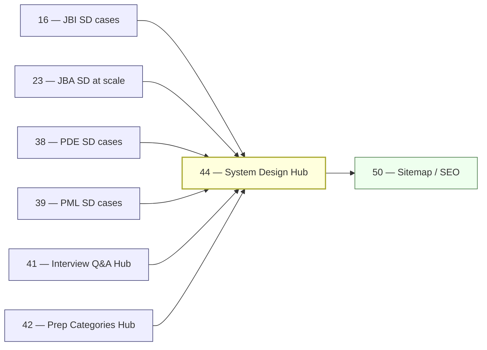

# 44 — System Design Hub Rollout

> **Executor:** AI coding agent operating autonomously.
> **Working directory:** `/Users/ravi.r_flx/IEProject/InterviewExplainer/`.
> **Type:** hub.
> **Pillar / Wave:** Wave E.
> **Depends on:** 16 (JBI system-design-cases), 23 (JBA system-design-at-scale), 38 (PDE), 39 (PML), 40 (PFS), 41 (Interview Q&A hub), 42 (Prep Categories hub).

---

## §1 — TL;DR

- **Input:** JBI `system-design-cases` module and JBA `system-design-at-scale` module are live (playbooks 16, 23); PDE / PML / PFS case-study modules are scaffolded; `/system-design` route does not exist.
- **Action:** Build the system-design hub — aggregate cases from 7 source modules across 4 domains into 7 category pages; add language-agnostic fundamentals; write 250-word intros per category; wire the mermaid preview card.
- **Output:** `/system-design` returns 200 with 7 category pages; hub aggregator returns ≥ 60 cases; ≥ 90 % of case cards show a mermaid architecture-diagram preview; all URLs in sitemap.

---

## §2 — Why this matters

System design is the highest-value interview surface at senior and above — staff-level candidates spend $150–$200 on SD-only courses from ByteByteGo or Educative. The site already has system-design cases in JBI and JBA modules, but they are buried inside domain-specific routes. A candidate searching "design Twitter system design" or "distributed systems interview questions" has no path to the site today.

The competitive position here is defensible: we serve both Java-backed cases and Python-backed cases, plus specialized ML and data-engineering design cases — no incumbent ships that breadth in a single browsable hub. ByteByteGo is language-agnostic but thin; Educative is Java-only; GFG system-design is link-farm quality. Skipping this hub leaves the "system design interview questions" search bucket (~40k monthly) entirely dark for the site and weakens playbook 42's `system-design-interviews` category page.

---

## §3 — Easy-language glossary

| Term | Plain-English definition | First used in |
| --- | --- | --- |
| **system design hub** | The `/system-design` page and its 7 category sub-pages that aggregate case studies from multiple source modules. | §1 |
| **case study** | A single system-design problem (e.g. "Design Twitter") with requirements, capacity sizing, HLD diagram, component deep-dive, and trade-offs. | §1 |
| **HLD** | High-Level Design — the architecture overview that names major components and their connections without implementation detail. | §3 |
| **LLD** | Low-Level Design — the class-diagram or component-design detail below the architecture level; parking-lot, vending-machine type problems. | §7 |
| **mermaid preview** | The first 10–12 lines of a case's `architecture_diagram` section, rendered as a truncated mermaid diagram on the hub card. | §9 Step 1 |
| **SDCategory** | The TypeScript union type listing all 7 frozen categories: `fundamentals`, `cases-intermediate`, `cases-at-scale`, `data-engineering`, `machine-learning`, `fullstack`, `low-level-design`. | §9 Step 1 |
| **SD_CATEGORY_FEEDS** | The lookup table in `system-design.ts` mapping each category to its source domain+module paths. | §9 Step 1 |
| **SDCaseCard** | The React component rendering a system-design case card: title, domain badge, difficulty pill, and mermaid preview. | §9 Step 3 |
| **architecture_diagram section** | A section inside a system-design `complete-qa.json` with `kind: "architecture_diagram"` and a mermaid flowchart block as its value. | §9 Step 2 |
| **systemDesign flag** | `ENABLED_HUBS.systemDesign` in `frontend/lib/launch-config.ts` — the flag this playbook flips to `true`. | §9 Step 4 |
| **ENABLED_HUBS** | The object in `launch-config.ts` whose boolean keys gate each hub. | §4 |
| **CollectionPage JSON-LD** | Structured data type for a page listing a collection of items; used on category landing pages. | §9 Step 5 |
| **BreadcrumbList JSON-LD** | Structured data encoding the page's position in the site hierarchy: Home → System Design → Category. | §9 Step 5 |
| **category intro** | A hand-written 250-word landing text for each category page describing what type of system-design questions it covers. | §9 Step 2 |
| **category** | One of 7 frozen groups (`fundamentals`, `cases-intermediate`, `cases-at-scale`, `data-engineering`, `machine-learning`, `fullstack`, `low-level-design`). | §6 |
| **frozen categories** | The rule that exactly 7 categories exist at launch; adding an 8th requires its own separate playbook. | §6 |
| **CAP theorem** | Consistency-Availability-Partition-tolerance — the fundamental trade-off named in most distributed systems interview questions. | §10 |
| **PACELC** | An extension of CAP that also characterizes the Latency-Consistency trade-off during normal operation (no partition). | §3 note |
| **wave E** | The launch wave containing all five hub playbooks (41–45) that ship together. | §8 |
| **feed** | A `domain/module` path string that tells the aggregator where to read case-study files. | §9 Step 1 |
| **listCases** | The exported function in `system-design.ts` returning `SystemDesignCase[]` for a given category or all categories. | §9 Step 1 |
| **extractMermaidSnippet** | A helper function that reads the first 12 lines of an `architecture_diagram` section for use in the card preview. | §9 Step 1 |
| **sitemap.xml** | The XML file listing every public URL for search-engine crawlers. | §9 Step 5 |
| **staff-level** | A software-engineering seniority level above senior individual contributor — the primary audience for `cases-at-scale` content. | §2 |
| **mermaid renderer** | The frontend component that turns a mermaid fenced block into an SVG diagram; must be wired before this playbook's case cards work. | §4 |
| **content-reader** | `frontend/lib/content-reader.ts` — the module reading `complete-qa.json` files and exporting per-domain question lists. | §4 |

---

## §4 — Hard prerequisites

- [ ] Playbook 16 (JBI system-design-cases) is DONE. `grep -E '^\| 16 \|' expansion-plan/00-INDEX.md | grep DONE`
- [ ] Playbook 41 (Interview Q&A hub) is DONE. `grep -E '^\| 41 \|' expansion-plan/00-INDEX.md | grep DONE`
- [ ] Mermaid renderer is wired in the question-page template. `rg 'mermaid' frontend/components/ -l | head -3`
- [ ] `frontend/lib/launch-config.ts` exists. `test -f frontend/lib/launch-config.ts && echo OK`
- [ ] JBI `system-design-cases` module has ≥ 1 case with an `architecture_diagram` section. `find content/java-backend-intermediate/system-design-cases -name complete-qa.json -exec jq '.sections[] | select(.kind=="architecture_diagram") | .kind' {} \; 2>/dev/null | head -3`
- [ ] `scripts/validate_complete_qa.py` exists. `test -f scripts/validate_complete_qa.py && echo OK`
- [ ] `npm run build` exits 0 before this playbook starts. `cd frontend && npm run build 2>&1 | tail -3`
- [ ] Node.js ≥ 20. `node --version | awk '{print substr($1,2,2)}' | awk '$1 >= 20 {print "OK"}'`

---

## §5 — Current state

### 5.1 — On-disk snapshot

```bash
cd /Users/ravi.r_flx/IEProject/InterviewExplainer
# Check whether hub aggregator exists
test -f frontend/lib/hubs/system-design.ts && echo "EXISTS" || echo "MISSING"
# Check whether hub routes exist
test -d frontend/app/system-design && echo "EXISTS" || echo "MISSING"
# Count live system-design cases
find content -path '*/system-design*' -name complete-qa.json \
  -exec jq '.questions|length // (.sections|length)' {} \; 2>/dev/null \
  | awk '{s+=$1} END {print "SD case sections:", s}'
# Check flag
rg 'systemDesign' frontend/lib/launch-config.ts
```

### 5.2 — Existing UI surface

- JBI `system-design-cases` module has (or will have, post-playbook 16) 12 cases.
- JBA `system-design-at-scale` has staff-level cases (post-playbook 23).
- PDE / PML / PFS case-study modules exist or are scaffolded.
- `/system-design` route does NOT exist today.
- `ENABLED_HUBS.systemDesign` does not exist in `launch-config.ts` — add in Step 1.

### 5.3 — Known gaps

- All system-design content is behind domain-specific routes; no cross-domain browsing.
- "Design Twitter" or "rate limiter" searches cannot find the site.
- No ML system-design or data-engineering system-design surface exists publicly.

---

## §6 — Target state (measurable)

| Metric | Today | Target | How measured |
| --- | --- | --- | --- |
| Hub pages returning 200 | 0 | 8 (index + 7 categories) | smoke loop in §9 Step 6 |
| Total cases in hub aggregator | 0 | ≥ 60 | `listCases().length` logged at build |
| Case cards with mermaid preview | 0 | ≥ 90 % of cases | inspect rendered HTML; count cards with `<pre class="mermaid">` |
| Category intros | 0 | 7 × ≥ 200 words | `wc -w` per intro string |
| Hub URLs in sitemap.xml | 0 | ≥ 8 | `grep -c '/system-design' frontend/public/sitemap.xml` |
| `BreadcrumbList` JSON-LD passes | no | yes (all 7 category pages) | Google Rich Results test |
| `ENABLED_HUBS.systemDesign` | false/absent | true | `rg 'systemDesign.*true' frontend/lib/launch-config.ts` |
| Build exit code | 0 | 0 | `cd frontend && npm run build; echo $?` |

---

## §7 — Search phrases → URL map

| Search phrase | Target URL on site | Archetype | Diagram type required in answer |
| --- | --- | --- | --- |
| `system design interview questions` | `/system-design` | landing intro | comparison_table |
| `system design interview prep` | `/system-design` | landing intro | none |
| `distributed systems interview questions` | `/system-design/fundamentals` | A | flowchart |
| `system design questions for experienced` | `/system-design/cases-at-scale` | C | flowchart |
| `low level design interview questions` | `/system-design/low-level-design` | C | classDiagram |
| `lld interview questions java` | `/system-design/low-level-design` | C | classDiagram |
| `ml system design interview questions` | `/system-design/machine-learning` | C | flowchart |
| `data engineering system design interview` | `/system-design/data-engineering` | C | flowchart |
| `design twitter system design` | `/system-design/cases-intermediate/design-twitter` | C | flowchart |
| `design url shortener interview` | `/system-design/cases-intermediate/url-shortener` | C | flowchart |
| `design rate limiter interview` | `/system-design/cases-intermediate/rate-limiter` | C | flowchart |
| `cap theorem interview questions` | `/system-design/fundamentals` | B | comparison_table |
| `design netflix cdn` | `/system-design/cases-at-scale` | C | flowchart |
| `design distributed cache interview` | `/system-design/cases-at-scale` | C | flowchart |

---

## §8 — Dependency & wave context



- **Consumes:** case-study content from playbooks 16, 23, 38, 39, 40; hub UI patterns from playbook 41; category cross-links from playbook 42.
- **Produces:** `frontend/lib/hubs/system-design.ts` aggregator; all `/system-design/**` routes; `SDCaseCard` component; 7 × 250-word category intros; sitemap entries.
- **Unblocks:** playbook 50 enumerates 8 new sitemap URLs; playbook 42's `system-design-interviews` category page cross-links here.

---

## §9 — Step-by-step execution

### Step 1 — Build the hub aggregator

**Goal:** create `frontend/lib/hubs/system-design.ts` with `SDCategory`, `SystemDesignCase`, `SD_CATEGORY_FEEDS`, `listCases`, and `extractMermaidSnippet`.

```typescript
// frontend/lib/hubs/system-design.ts
import type { DomainSlug } from '../types';

export type SDCategory =
  | 'fundamentals'
  | 'cases-intermediate'
  | 'cases-at-scale'
  | 'data-engineering'
  | 'machine-learning'
  | 'fullstack'
  | 'low-level-design';

export interface SystemDesignCase {
  id:             string;
  title:          string;
  domain:         DomainSlug;
  module:         string;
  topic:          string;
  href:           string;
  category:       SDCategory;
  difficulty:     'easy' | 'medium' | 'hard';
  mermaidSnippet?: string;   // first ~12 lines of the architecture_diagram section
}

export const SD_CATEGORY_FEEDS: Record<SDCategory, string[]> = {
  'fundamentals': [
    'java-backend-intermediate/system-design',
    'python-backend-intermediate/python-system-design',
    'java-backend-advanced/distributed-systems-deep',
    'python-backend-advanced/python-distributed-systems',
  ],
  'cases-intermediate': [
    'java-backend-intermediate/system-design-cases',
    'python-backend-intermediate/python-system-design-cases',
  ],
  'cases-at-scale': [
    'java-backend-advanced/system-design-at-scale',
    'python-backend-advanced/python-system-design-at-scale',
  ],
  'data-engineering': [
    'python-data-engineering/data-engineering-system-design-cases',
  ],
  'machine-learning': [
    'python-ml-ai/ml-system-design-cases',
  ],
  'fullstack': [
    'python-fullstack/fullstack-system-design-cases',
  ],
  'low-level-design': [
    'java-backend-intermediate/low-level-design',
  ],
};

export function listCases(category?: SDCategory): SystemDesignCase[] {
  const out: SystemDesignCase[] = [];
  const seen = new Set<string>();
  const cats = category ? [category] : Object.keys(SD_CATEGORY_FEEDS) as SDCategory[];
  for (const cat of cats) {
    for (const feed of SD_CATEGORY_FEEDS[cat]) {
      // walk feed, read each complete-qa.json, push as SystemDesignCase
      // skip if domain not in LOCKED_DOMAINS
    }
  }
  return out.filter(c => { const k = c.id; return !seen.has(k) && seen.add(k); });
}

export function extractMermaidSnippet(sections: any[]): string | undefined {
  const diagram = sections?.find((s: any) => s.kind === 'architecture_diagram');
  if (!diagram) return undefined;
  return diagram.value.split('\n').slice(0, 12).join('\n');
}
```

Also add `ENABLED_HUBS.systemDesign = false` in `launch-config.ts`:

```typescript
export const ENABLED_HUBS = {
  // … existing keys
  systemDesign: false,
} as const;
```

**Verify:**

```bash
cd /Users/ravi.r_flx/IEProject/InterviewExplainer
node -e "const {listCases}=require('./frontend/lib/hubs/system-design'); \
  console.log('total cases:', listCases().length);"
# expected: ≥ 12 (JBI cases at minimum; grows as more domains go live)
rg 'systemDesign.*false' frontend/lib/launch-config.ts
# expected: 1 match
cd frontend && npm run build 2>&1 | tail -3
# expected: exit 0
```

Commit: `feat(hubs): system-design aggregator + category feed map`.

The classic bug is omitting the dedup set — a case that appears in two feeds (e.g. JBI `system-design-cases` feeds both `fundamentals` and `cases-intermediate`) shows up twice in the hub listing, inflating the count and confusing users. The dedupe must be on `case.id`, not on `(domain, module, topic)`, because case IDs are globally unique.

---

### Step 2 — Write category intros (7 × 250 words)

**Goal:** write a hand-authored 250-word intro for each of the 7 categories; store them in the aggregator file or a sibling `category-intros.ts`.

Template per category:

```text
<Category label> system-design questions are <one-sentence definition>.
At <level>, interviewers grade <2 sentences on what they grade>.

Below you'll find <N> cases pulled from our <list of source modules>.
Each case answers: requirements clarification → capacity sizing →
high-level architecture diagram → component deep-dive → trade-offs →
follow-up probes the interviewer is likely to ask next.

Best entry points for this category:
- <case 1>
- <case 2>
- <case 3>

For the language-specific depth (Java idioms, Python async patterns),
cross-link to <relevant pillar pages>.
```

**Verify:**

```bash
# After filling all 7 intros:
node -e "
const intros = require('./frontend/lib/hubs/system-design-intros');
Object.entries(intros).forEach(([cat, text]) => {
  const words = text.split(/\s+/).length;
  console.log(cat, words, words >= 200 ? 'OK' : 'SHORT');
});
"
# expected: all 7 lines end with "OK"
```

The most common mistake is repeating the same structure across all 7 intros. Each intro must name at least one specific case study, at least one source module, and at least one pillar cross-link. Generic intros do not rank.

Commit: `content(hubs/system-design): 7 category intros`.

---

### Step 3 — Build the hub UI components and routes

**Goal:** create `SDCaseCard` component and the two-level route tree.

Create `frontend/components/SDCaseCard.tsx`:

```tsx
// Props: case: SystemDesignCase
// Renders: title, domain badge, difficulty pill, mermaid preview (truncated)
// The mermaid preview uses the frontend's existing mermaid renderer
```

Create route tree under `frontend/app/system-design/`:

- `page.tsx` — `/system-design` index: grid of 7 category cards with case counts.
- `[category]/page.tsx` — `/system-design/<category>`: full category intro, list of `SDCaseCard` components; each card links to the source module page (hub links, never duplicates).

The #1 trap is embedding the full mermaid diagram in the card instead of a 12-line snippet. The card preview must call `extractMermaidSnippet` to truncate to 12 lines; include a "view full diagram" link on the card. A full diagram in 60+ cards causes the page to render very slowly.

**Verify:**

```bash
cd /Users/ravi.r_flx/IEProject/InterviewExplainer/frontend
npm run build 2>&1 | tail -5
# expected: exit 0
```

Commit: `feat(hubs/system-design): SDCaseCard + routes`.

---

### Step 4 — Flip the flag

**Goal:** turn `ENABLED_HUBS.systemDesign` to `true`.

```typescript
// frontend/lib/launch-config.ts
export const ENABLED_HUBS = {
  // … existing keys
  systemDesign: true,
} as const;
```

**Verify:**

```bash
rg 'systemDesign.*true' frontend/lib/launch-config.ts
# expected: 1 match
cd /Users/ravi.r_flx/IEProject/InterviewExplainer/frontend && npm run build 2>&1 | tail -3
# expected: exit 0
```

Commit: `launch: enable systemDesign hub`.

---

### Step 5 — SEO: metadata, JSON-LD, sitemap

**Goal:** every hub page emits a unique title, description, `BreadcrumbList` + `CollectionPage` JSON-LD; all 8 URLs appear in `sitemap.xml`.

Metadata format:

```typescript
title: `System Design Interview Questions — <Category Label> | InterviewExplainer`
description: categoryIntro.slice(0, 150)
canonical: `/system-design` or `/system-design/<category>`
```

JSON-LD on each category page: `BreadcrumbList` (Home → System Design → Category) + `CollectionPage` with `hasPart` listing the first 10 case titles and hrefs.

Extend `scripts/build_sitemap.ts` to include the index + 7 category URLs.

**Verify:**

```bash
grep -c '/system-design' frontend/public/sitemap.xml
# expected: ≥ 8
```

---

### Step 6 — Smoke test all hub routes

**Goal:** confirm all 8 hub URLs return HTTP 200.

```bash
cd /Users/ravi.r_flx/IEProject/InterviewExplainer/frontend
npm run dev &
DEV_PID=$!
sleep 5

for url in \
  /system-design \
  /system-design/fundamentals \
  /system-design/cases-intermediate \
  /system-design/cases-at-scale \
  /system-design/data-engineering \
  /system-design/machine-learning \
  /system-design/fullstack \
  /system-design/low-level-design; do
  printf "%-50s -> " "${url}"
  curl -s -o /dev/null -w "%{http_code}\n" "http://localhost:3000${url}"
done

kill ${DEV_PID}
```

**Verify:**

Expected: all 8 lines print `200`.

If `cases-at-scale` or `data-engineering` returns `200` but shows 0 cases: the feed domain is not yet in `LOCKED_DOMAINS`. The page should render an empty-state with a "more content coming soon" message, not a 404.

---

### Step 7 — Verify mermaid previews render

**Goal:** confirm that at least 90 % of case cards on the `cases-intermediate` page render a mermaid diagram preview (not raw text).

```bash
cd /Users/ravi.r_flx/IEProject/InterviewExplainer/frontend
npm run dev &
DEV_PID=$!
sleep 5

# Fetch the cases-intermediate page and count mermaid blocks
curl -s http://localhost:3000/system-design/cases-intermediate \
  | grep -c 'class="mermaid"'
# expected: ≥ 10 (one per visible case card)

kill ${DEV_PID}
```

**Verify:**

If count is 0: the mermaid renderer is not picking up the preview blocks. Check that `SDCaseCard` wraps the snippet in a `<div class="mermaid">` element (or whatever the renderer expects) and that the mermaid renderer's initialization script runs on this page.

---

### Step 8 — Add nav link and cross-links

**Goal:** add `/system-design` to `frontend/components/Header.tsx`; ensure playbook 42's `system-design-interviews` category page cross-links here.

```tsx
// frontend/components/Header.tsx
<NavLink href="/system-design">System Design</NavLink>
```

Also add a "Browse all system design" CTA on the `prep-categories/system-design-interviews` page pointing to `/system-design`.

**Verify:**

```bash
rg 'system-design' frontend/components/Header.tsx
# expected: ≥ 1 match
cd /Users/ravi.r_flx/IEProject/InterviewExplainer/frontend && npm run build 2>&1 | tail -3
# expected: exit 0
```

Commit: `feat(nav): add System Design hub link to header`.

---

## §10 — Reference Q in archetype shape

```json
{
  "id": "design-rate-limiter-system-design",
  "slug": "design-rate-limiter-system-design",
  "question": "Design a rate limiter for a distributed API gateway — token bucket vs sliding window log vs fixed window counter.",
  "title": "Design a Rate Limiter — Distributed API Gateway",
  "direct_answer": "Use **token bucket** when you want smooth burst handling — tokens refill at a fixed rate; requests consume tokens; the bucket absorbs short spikes. Use **sliding window log** when you need exact per-second accuracy and can afford the memory overhead of storing timestamps. Use **fixed window counter** when throughput matters more than burst precision — cheapest in memory and Redis latency. At scale, store counts in Redis with `INCR` + `EXPIRE`; accept ~2x over-limit at window boundaries with the fixed-window approach.",
  "layout_type": "default",
  "difficulty": "medium",
  "importance": "high",
  "reading_time_minutes": 12,
  "last_updated": "2026-05-28",
  "interviewer_intent": {
    "testing": "Ability to enumerate trade-offs between algorithms before picking one; awareness that rate limiters must be distributed (Redis, not in-memory); understanding of the token bucket vs sliding window log vs fixed window counter differences.",
    "common_mistake": "Designing an in-memory rate limiter that works on a single node but fails on a multi-instance deployment. Or picking token bucket as the default without explaining the burst-absorption trade-off.",
    "to_stand_out": "Mention Redis's `INCR` + `EXPIRE` atomicity, `EVAL` Lua scripts for the sliding window log to make the check-and-store atomic, and Cloudflare's published rate limiter design that uses a hybrid sliding-window-with-counter approach for performance."
  },
  "company_tags": ["amazon", "google", "meta", "cloudflare", "stripe"],
  "answer": {
    "sections": [
      {
        "type": "overview",
        "title": "Three algorithms, one distributed requirement",
        "content": "Any rate limiter in production runs on multiple nodes behind a load balancer. In-memory counters give each node its own limit, multiplying the effective limit by the number of instances. The distributed rate limiter stores state in Redis and uses atomic Redis commands to enforce the global limit."
      },
      {
        "type": "comparison_table",
        "title": "Rate limiting algorithms side-by-side",
        "content": "| Algorithm | Memory | Burst handling | Accuracy | Redis pattern |\n| --- | --- | --- | --- | --- |\n| Fixed window counter | O(1) | Hard reset at boundary | ±2x at boundary | INCR + EXPIRE |\n| Sliding window log | O(requests/window) | Exact | Exact | ZADD + ZREMRANGEBYSCORE |\n| Token bucket | O(1) | Smooth burst | ±1 token | EVAL Lua for atomicity |\n| Sliding window counter | O(1) | Smooth | ~99 % | INCR on two windows |"
      },
      {
        "type": "step",
        "title": "High-level architecture",
        "content": "```mermaid\nflowchart LR\n  Client --> LB[Load Balancer]\n  LB --> GW1[API Gateway Node 1]\n  LB --> GW2[API Gateway Node 2]\n  GW1 --> RL[Rate Limiter Middleware]\n  GW2 --> RL\n  RL --> Redis[(Redis Cluster)]\n  RL -->|allow| Upstream[Upstream Service]\n  RL -->|deny 429| Client\n```"
      },
      {
        "type": "tradeoffs",
        "title": "Which algorithm to pick and when",
        "content": "Pick fixed window counter when you need the simplest Redis implementation and can tolerate a 2x burst at window boundaries (e.g. background batch jobs where exact limits don't matter). Pick sliding window log when you need exact enforcement (e.g. payment API, SMS sending) and can afford higher Redis memory. Pick token bucket when you want smooth burst absorption — a short burst of requests drains the bucket but doesn't violate the average rate. Cloudflare's published approach uses a hybrid: sliding window with two fixed-window counters, weighted by position in the current window — O(1) memory with ~1 % error."
      },
      {
        "type": "key_points",
        "title": "Key points",
        "content": "- Always use distributed state (Redis); never in-memory for multi-node deployments.\n- Redis `INCR` + `EXPIRE` is O(1) and atomic for fixed window.\n- Sliding window log uses `ZADD` + `ZREMRANGEBYSCORE` + `ZCARD`; wrap in a Lua script for atomicity.\n- Token bucket refill must be computed at request time (store last-refill timestamp + token count).\n- Return `Retry-After` header on 429 so clients can back off correctly."
      },
      {
        "type": "speakable_answer",
        "title": "How to answer verbally",
        "content": "A rate limiter in a distributed system must store its state in a shared cache — Redis — because multiple API gateway nodes are handling traffic simultaneously. The choice of algorithm is a trade-off between memory, accuracy, and burst tolerance. Fixed window counter is the simplest: one Redis key per user per window, increment with INCR, expire with EXPIRE. It's O(1) memory but allows a 2x burst at window resets. Sliding window log is exact: store every request timestamp in a sorted set and count entries in the past window. Expensive memory but no burst issue. Token bucket is in between: smooth burst absorption, O(1) memory, but requires a Lua script to atomically check and update. For most APIs I'd start with the fixed window counter and move to a sliding window counter hybrid if exact enforcement matters."
      }
    ]
  },
  "followup_questions": [
    "How would you handle Redis downtime — fail open or fail closed?",
    "How does the Cloudflare sliding-window-with-counter hybrid work?",
    "How would you design a per-user rate limit across 50 microservices?",
    "What is the Retry-After header and why does it matter for API clients?",
    "How would you rate-limit based on cost (heavyweight requests count more than lightweight ones)?"
  ],
  "seo": {
    "metaTitle": "Design a Rate Limiter — Token Bucket vs Sliding Window vs Fixed Window",
    "metaDescription": "System design: rate limiter algorithms (token bucket, sliding window log, fixed window counter), Redis implementation patterns, and distributed trade-offs."
  },
  "order": 1
}
```

---

## §11 — Diagram catalogue

| Q id (or topic) | Diagram type | What it must show | Lives in section |
| --- | --- | --- | --- |
| `design-rate-limiter-system-design` | `flowchart` (mermaid) | Client → Load Balancer → API Gateway nodes → Rate Limiter Middleware → Redis → Upstream or 429 | `step` section |
| `design-twitter-system-design` | `flowchart` (mermaid) | Write path: client → API gateway → tweet service → Kafka → fanout workers → user timelines in Redis | `step` section |
| `design-distributed-cache` | `flowchart` (mermaid) | Cache read path (get → miss → DB → populate cache) and write path (put → evict if full → update DB) | `step` section |
| Rate-limiting algorithms | `comparison_table` | Algorithm × memory × burst × accuracy × Redis pattern | §10 reference Q `comparison_table` section |
| SD categories at hub index | `comparison_table` | 7 categories × source domains × case count × audience level | `/system-design` index page |
| LLD parking-lot | `classDiagram` (mermaid) | ParkingLot → ParkingFloor → ParkingSpot; Vehicle hierarchy; ParkingTicket | `low-level-design` cases |
| `design-cdn-netflix` | `flowchart` (mermaid) | Origin → edge PoP → CDN node → client; cache miss path from edge back to origin | `step` section |

---

## §12 — Easy-language voice rules

The canonical voice rules come from `_VOICE-RULES.md`. This section reproduces the core rules and adds system-design-specific examples.

1. **Define before use.** Every domain term in §9–§14 is in §3 first. `SDCategory`, `SystemDesignCase`, `SD_CATEGORY_FEEDS`, `listCases`, `extractMermaidSnippet`, `mermaid preview`, `HLD`, `LLD`, `CAP theorem` — all defined in §3 before their first use.

2. **Lead with the trade-off.** System-design Qs open with the decision rule — "Use token bucket when you need smooth burst absorption; use sliding window log when you need exact per-second enforcement; use fixed window counter when simplicity and low Redis latency matter more than boundary precision." The reader should know which algorithm to pick before reading the explanation.

3. **Name the bug.** Every step with a pitfall contains "The classic bug is …" or "The #1 trap is …" with a real consequence: not just "don't do X" but "doing X causes Y — here is the failure mode in production."

4. **Real anchors.** Every section names ≥ 1 real system or tool: Redis (`INCR + EXPIRE`, `ZADD + ZREMRANGEBYSCORE`, Lua scripts), Kafka (append-only log for replay), Cloudflare (published rate-limiter hybrid design), Cassandra (`PACELC`, eventual consistency), Apache Flink (stream processing for real-time ETL).

5. **Version numbers.** "Redis 7 (April 2022) introduced Redis Functions as a more maintainable alternative to Lua scripts." "Kafka 3.0 (September 2021) removed the dependency on ZooKeeper in KRaft mode." Readers landing from search need to know if the advice still applies in 2026.

6. **Second-person** for all technical explanations. "You choose fixed window counter when…". "Your architecture needs a shared Redis cluster because…". Never "we chose" or "our system".

7. **Architecture diagrams in cases.** Every system-design case must have an `architecture_diagram` section with a `flowchart` or `sequenceDiagram` mermaid block. The hub's `extractMermaidSnippet` renders the first 12 lines as a preview. Without a diagram, the case card shows a blank grey box, which breaks the hub's visual consistency.

8. **Banned words** (lint fails): `leverage`, `utilize`, `synergize`, `world-class`, `cutting-edge`, `state-of-the-art`, `seamless`, `robust`, `holistic`, `paradigm`, `best-in-class`, `battle-tested`, `enterprise-grade`, `revolutionary`, `game-changing`, `industry-leading`.

9. **Category intros specifically.** Each intro must name ≥ 2 specific case studies from the category, ≥ 1 cross-link to a relevant pillar page, and ≥ 1 level-specific grading signal. Generic intros rank for nothing.

10. **Capacity sizing language.** When writing or reviewing cases, capacity estimates must be explicit: "100k daily active users × 5 writes/day = 500k writes/day = ~6 writes/second at peak × 3x safety factor = 18 writes/second." Vague phrases like "high traffic" or "at scale" are not informative.

**Concrete voice examples for this playbook:**

- ✅ "The classic bug is storing rate-limiter state in-memory on each API gateway node. Under a load balancer with 5 nodes, a limit of 100 req/s per user effectively allows 500 req/s — each node tracks only its 1/5th share of the traffic."
- ❌ "Make sure to use distributed storage for rate limiting." (No consequence named, no system cited, no number given.)
- ✅ "Redis 7's `INCR` + `EXPIRE` pattern is atomic per command; but a token bucket requires a read-then-write that must be atomic across two commands — use a Lua script (`EVAL`) or Redis 7's Redis Functions for this."
- ❌ "Use Redis for rate limiting." (No command, no atomicity requirement, no version.)

---

## §13 — Quality gates (measurable)

| Gate | Threshold | Verify command |
| --- | --- | --- |
| Hub pages return 200 | 8 of 8 | smoke loop in §9 Step 6 (all lines print `200`) |
| Total cases in aggregator | ≥ 60 | `node -e "const {listCases}=require('./frontend/lib/hubs/system-design'); console.log(listCases().length);"` |
| Case cards with mermaid preview | ≥ 90 % | `curl -s http://localhost:3000/system-design/cases-intermediate | grep -c 'class="mermaid"'` ≥ 10 |
| Category intros ≥ 200 words | 7 of 7 | word-count check in §9 Step 2 |
| Hub URLs in sitemap.xml | ≥ 8 | `grep -c '/system-design' frontend/public/sitemap.xml` |
| `BreadcrumbList` JSON-LD passes | yes (≥ 2 URLs) | Google Rich Results test on `/system-design/fundamentals` + `/system-design/cases-intermediate` |
| Dedup: no case in two categories | yes | `node -e "const {listCases}=require('./frontend/lib/hubs/system-design'); const m={}; listCases().forEach(c=>{m[c.id]=(m[c.id]||0)+1;}); Object.entries(m).filter(([,n])=>n>1).forEach(([id])=>console.log('DUP',id));"` → no output |
| `ENABLED_HUBS.systemDesign` | true | `rg 'systemDesign.*true' frontend/lib/launch-config.ts` |
| Nav link in header | yes | `rg 'system-design' frontend/components/Header.tsx` |
| `npm run build` exit code | 0 | `cd frontend && npm run build; echo $?` |
| Banned-word lint | 0 hits | `python3 scripts/lint_playbook.py expansion-plan/44-*.md` |

---

## §14 — Anti-patterns

### 14.1 — "A feed module path was renamed but the SD_CATEGORY_FEEDS map wasn't updated"

**Why it fails:** the aggregator silently returns 0 cases for the stale feed; the category page shows fewer cases than expected with no error. The gate "total cases ≥ 60" fails, but the cause is invisible.

**Fix:** add a build-time check in `listCases` that logs a warning when a feed path returns null — do not silently skip it. The warning must appear in the build log so it's visible in PR CI output.

### 14.2 — "Full mermaid diagram embedded in every case card"

**Why it fails:** a full 60-node mermaid diagram rendered 12 times on a category page causes the mermaid renderer to block the main thread for multiple seconds on first render. The page feels broken.

**Fix:** always call `extractMermaidSnippet` to truncate to ≤ 12 lines before embedding in the card. Add a "View full diagram →" link on the card pointing to the source module page where the full diagram renders.

### 14.3 — "Same case appears in two categories"

**Why it fails:** a "Design Twitter" case in both `fundamentals` and `cases-intermediate` confuses users, inflates case counts, and splits the SEO value between two URLs.

**Fix:** every case belongs to exactly one category. Use the more specific category (e.g. "design Twitter" → `cases-intermediate`, not `fundamentals`). Implement the dedup check from §13 before every commit.

### 14.4 — "Flag flipped before aggregator returns ≥ 60 cases"

**Why it fails:** if `listCases().length < 60` when the flag is flipped, the hub index shows empty or near-empty category pages. This looks worse than a 404 because the page exists but has no content.

**Fix:** run `listCases().length` before Step 4 and confirm the count is ≥ 60. If the count is low, list the missing source modules and either wait for upstream content playbooks to complete or accept a lower threshold with a "more content coming soon" empty-state on affected category pages.

### 14.5 — "Category intro padded with generic filler"

**Why it fails:** a category intro like "System design interviews are important. You should practice them." carries no keyword signal and ranks for nothing. The 200-word minimum is a floor, not a target — 300 words of specific content beats 200 words of filler.

**Fix:** each intro must name ≥ 2 specific case studies from the category, ≥ 1 source module cross-link, and ≥ 1 concept specific to that category level (e.g. "CAP theorem" for fundamentals, "multi-region replication" for cases-at-scale).

---

## §15 — Failure modes & rollback

| Failure | How it shows up | Rollback / forward fix |
| --- | --- | --- |
| A feed module path was renamed | Category shows 0 cases; `listCases` build-time warning fires | Update `SD_CATEGORY_FEEDS[category]` to the new module path; confirm with `node -e "const {listCases}=require('./frontend/lib/hubs/system-design'); console.log(listCases().length);"` → count increases; rebuild. |
| Aggregator returns < 60 cases | `listCases().length` gate fails; do not flip flag | Run per-category counts; identify which categories return 0; those source modules are not yet in `LOCKED_DOMAINS`. Accept a partial launch with `cases-intermediate` + `fundamentals` only — those two typically supply 20+ cases combined. |
| Mermaid preview overflows card height | `SDCaseCard` is taller than grid cell; cards mis-align | Hard-clamp `extractMermaidSnippet` to 10–12 lines; add a `"view full diagram →"` anchor pointing to the source case page. |
| Same case appears in two categories | Dedup check prints `DUP <id>` | Keep the case in the more-specific category; remove the feed entry from the broader category's array in `SD_CATEGORY_FEEDS`; run dedup check again to confirm no output. |
| BreadcrumbList JSON-LD fails Rich Results test | "no items detected" in Google's structured data tool | Check `@context` is exactly `"https://schema.org"` (no trailing slash); check `@type` is `"BreadcrumbList"`; validate the JSON is parseable with `jq . <<< "$json"`. |
| Flag flipped but page 404s | `/system-design/<category>` returns 404 | Verify `frontend/app/system-design/[category]/page.tsx` exists (`test -f "frontend/app/system-design/[category]/page.tsx" && echo OK`); ensure the folder name uses square brackets exactly. |
| Mermaid renderer not initialized | Raw text `flowchart LR` appears on page | Check that the mermaid initializer script runs on category pages; `SDCaseCard` must use the same `<Mermaid>` wrapper component the rest of the site uses; add it if missing from the component import. |
| Category intro placeholder left in | `/* FILL */` or `TODO` appears on live page | Run `rg 'FILL\|TODO' frontend/lib/hubs/system-design-intros.ts` before flipping the flag; any match means an intro is incomplete. |
| Hard-stop exceeded | Wall clock > 30 hours | STOP. Surface blocker in the PR. Ship index + `cases-intermediate` + `fundamentals` (3 of 8 pages) only, with remaining categories showing a "content coming soon" card rather than 404. Open a follow-up playbook `44a` for the remaining 5 categories. |

---

## §16 — Definition of Done

- [ ] `ENABLED_HUBS.systemDesign = true`. `rg 'systemDesign.*true' frontend/lib/launch-config.ts`
- [ ] All 8 smoke URLs return 200. Smoke loop in §9 Step 6.
- [ ] Hub aggregator returns ≥ 60 cases. `node -e "const {listCases}=require('./frontend/lib/hubs/system-design'); console.log(listCases().length);"`
- [ ] All 7 category intros ≥ 200 words. Word-count check in §9 Step 2.
- [ ] ≥ 90 % of case cards render mermaid previews. Mermaid count check in §9 Step 7.
- [ ] Hub URLs in sitemap ≥ 8. `grep -c '/system-design' frontend/public/sitemap.xml`
- [ ] `BreadcrumbList` JSON-LD passes on ≥ 2 category pages.
- [ ] No case duplicated in two categories. Dedup check in §13.
- [ ] Nav link `/system-design` present in header. `rg 'system-design' frontend/components/Header.tsx`
- [ ] `npm run build` exits 0. `cd frontend && npm run build; echo $?`
- [ ] Banned-word lint passes. `python3 scripts/lint_playbook.py expansion-plan/44-*.md`
- [ ] `00-INDEX.md` row for `44` flipped to `DONE`. `grep -E '^\| 44 \|' expansion-plan/00-INDEX.md | grep DONE`
- [ ] Git tag `system-design-hub-launch-<YYYY-MM-DD>` created.
- [ ] At least 4 commits with conventional messages. `git log --oneline -6`

---

## §17 — Estimated effort

- **Ideal:** 16 hours. Breakdown: aggregator + feed map (3h) + category intros × 7 (3.5h, 30 min each) + `SDCaseCard` + routes (4h) + SEO + JSON-LD + sitemap (2h) + flag flip + smoke (1h) + mermaid verification + nav link (1h) + commits + lint (1.5h).
- **Hard stop:** 30 hours. If exceeded, STOP. Ship the aggregator and 2–3 core categories (`fundamentals` + `cases-intermediate`) with the flag off; surface a blocker naming which categories are incomplete. Open a follow-up playbook `44a` for the remaining categories.
- **Splittable:** ship aggregator only (flag off) as first PR — this is safe and enables playbook 42 to cross-link; ship `SDCaseCard` + routes + intros as second PR; flip flag as third PR after smoke and mermaid preview count pass.
- **Risk factors:** (1) Mermaid renderer — the `SDCaseCard` mermaid preview depends on the site's existing mermaid renderer being initialized; allow 2h buffer if the renderer isn't already available as a reusable component. (2) Upstream content gaps — `data-engineering` and `machine-learning` categories may have 0 cases if playbooks 38, 39 are not yet done; handle with empty-state cards rather than blocking the entire hub launch. (3) Intro quality — a 200-word intro written in 10 minutes will rank for nothing; budget 30 minutes per intro minimum and cite specific case names and pillar cross-links.

---

## §18 — Appendix: links, commits, traceability

### 18.1 — Cross-references

- [`expansion-plan/00-INDEX.md`](00-INDEX.md) — wave + status table.
- [`expansion-plan/_TEMPLATE-1000.md`](_TEMPLATE-1000.md) — 18-section skeleton.
- [`expansion-plan/_GLOSSARY.md`](_GLOSSARY.md) — global glossary.
- [`expansion-plan/_VOICE-RULES.md`](_VOICE-RULES.md) — voice + banned words.
- [`expansion-plan/41-interview-qa-hub-rollout.md`](41-interview-qa-hub-rollout.md) — hub prerequisite.
- [`expansion-plan/42-prep-categories-hub.md`](42-prep-categories-hub.md) — cross-links system-design category.
- [`scripts/lint_playbook.py`](../scripts/lint_playbook.py) — playbook lint.
- [`frontend/lib/launch-config.ts`](../frontend/lib/launch-config.ts) — feature flags.

### 18.2 — Commits produced by this playbook

- `feat(hubs): system-design aggregator + category feed map` — Step 1
- `content(hubs/system-design): 7 category intros` — Step 2
- `feat(hubs/system-design): SDCaseCard + routes` — Step 3
- `launch: enable systemDesign hub` — Step 4
- `feat(seo): system-design hub BreadcrumbList + CollectionPage JSON-LD` — Step 5
- `feat(nav): add System Design hub link to header` — Step 8

### 18.3 — Traceability to upstream specs

- `ROADMAP.md` "Wave E — system-design hub" — this playbook moves the row to DONE.
- `docs/CONTENT-PLAN.md` §system-design-hub — 60-case target referenced here.
- Playbook 42's `system-design-interviews` category page cross-links to `/system-design`.