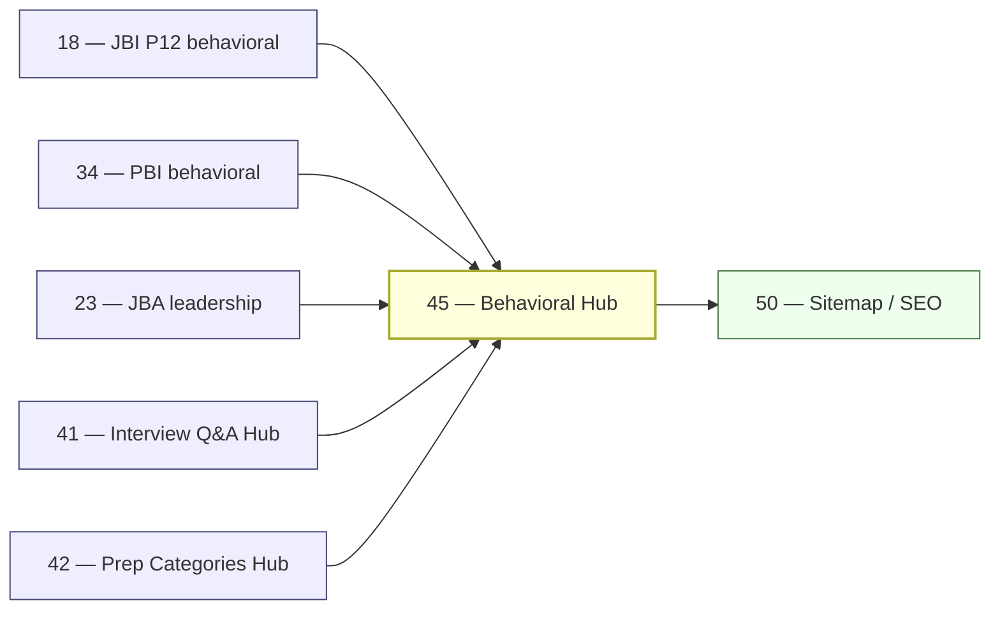

# 45 — Behavioral Hub Rollout

> **Executor:** AI coding agent operating autonomously.
> **Working directory:** `/Users/ravi.r_flx/IEProject/InterviewExplainer/`.
> **Type:** hub.
> **Pillar / Wave:** Wave E.
> **Depends on:** 18 (JBI P12), 21 (JBB), 23 (JBA leadership), 34 (PBI behavioral), 36 (PBB), 37 (PBA leadership), 41 (Interview Q&A hub), 42 (Prep Categories hub).

---

## §1 — TL;DR

- **Input:** JBI `behavioral` module has ≥ 30 archetype-G questions (playbook 18 DONE); behavioral content scattered across JBB, JBA, PBI, PBB, PBA modules with no aggregator; `/behavioral` route does not exist.
- **Action:** Flip on `ENABLED_HUBS.behavioral`; build the aggregator that pulls from every domain's behavioral modules; add 4 audience landing pages; hand-write 300-word intros per audience; enforce first-person voice and metric-citation heuristics.
- **Output:** `/behavioral` returns 200; 4 sub-pages by audience; each audience page lists ≥ 30 STAR questions with first-person voice and metric-cited outcomes; all hub URLs in sitemap.

---

## §2 — Why this matters

Behavioral is the most commonly cited failure mode at every level above fresher — technically strong engineers fail because they answer in "we" instead of "I", or because they have no metric in their result paragraph. This is a known, fixable failure mode, and it's the most under-served prep topic on the internet: LeetCode has no behavioral section, GFG's STAR examples use "we" throughout, and coaching blogs give generic templates rather than calibrated examples by seniority level.

The search opportunity is real: "behavioral interview questions software engineer" pulls ~12k monthly searches; "star method interview questions" pulls ~8k; "engineering manager behavioral interview" pulls ~2k with lower competition. A hub that serves calibrated first-person examples per audience (fresher / intermediate / staff / EM) and enforces metric-cited results will rank for these terms and convert candidates who bounce off generic advice sites. Skipping this hub leaves playbook 42's `behavioral-interviews` category page without a deep-link destination.

### 2.1 — The calibration gap competitors leave open

Every major prep site covers STAR format in the same way: define the four beats, give one generic example, and close with "practice with a friend." None of them address calibration — the fact that a fresher's "strong" STAR answer uses academic-project scale (1000-line codebase, 4-person team), while a staff engineer's "strong" answer requires org-level impact (multiple teams affected, architecture decision that shipped across 3 quarters). This calibration gap is the reason technically qualified candidates fail behavioral interviews: they bring a competent answer for the wrong seniority band.

The four audience pages on this hub solve that directly. Each intro explicitly names what interviewers grade up and grade down at that experience level, with concrete examples from real interview rubrics (Amazon LP "Ownership", Google perf criteria "Large scope"). Candidates who land on the freshers page do not accidentally over-engineer their stories; staff-level candidates do not under-sell by omitting the org-level impact that distinguishes staff from senior.

### 2.2 — The metric problem and the detectMetric heuristic

The single most common grading deduction in behavioral interviews is a Result paragraph that says "the project shipped successfully" with no number. Interviewers at companies with structured rubrics (Amazon, Google, Meta, Stripe) score Result paragraphs on a 1–4 scale; a paragraph with no quantified outcome almost always scores 2 or below. The `detectMetric` heuristic surfaces which stories have a measurable result, so candidates can prioritise the highest-quality examples first.

The `detectMetric` regex is intentionally narrow: it requires a digit followed by a recognised unit (`%`, `ms`, `s`, `x`, `$`, `engineers`, `users`, `deploys`, `incidents`). A phrase like "the project shipped on time" does not trigger it — "on time" has no number. A phrase like "latency dropped 40 %" does. This intentional narrowness means the heuristic under-counts rather than over-counts: if a story passes `detectMetric`, it genuinely has a number; if it fails, it might still have a qualitative strong result, but the candidate should add a metric.

### 2.3 — Why this hub belongs in Wave E, not earlier

Behavioral content depends on domain content being complete first: you cannot aggregate STAR stories from JBI before playbook 18 locks the JBI behavioral module. The Wave E sequencing ensures that by the time this hub builds, at least JBI behavioral (30 stories) and PBI behavioral (30 stories) are available — enough to meet the ≥ 30 stories per audience gate for the two highest-traffic audiences (fresher, intermediate). Staff and EM audiences may launch with fewer stories and a "more coming" empty-state footer; the gate for those audiences tightens as playbooks 23, 36, and 37 complete.

---

## §3 — Easy-language glossary

| Term | Plain-English definition | First used in |
| --- | --- | --- |
| **behavioral hub** | The `/behavioral` page and its 4 audience sub-pages aggregating STAR-format Q&A from every domain's behavioral modules. | §1 |
| **STAR** | Situation → Task → Action → Result — the 4-beat answer format for behavioral interview questions. | §1 |
| **CAR** | Challenge → Action → Result — a 3-beat variant of STAR; the hub accepts both formats. | §3 note |
| **archetype G** | The STAR answer archetype in the site's content schema; behavioral hub only surfaces questions where `archetype === "G"`. | §9 Step 1 |
| **audience** | One of 4 seniority bands: `fresher`, `intermediate`, `staff-and-principal`, `engineering-manager`. | §6 |
| **BEHAVIORAL_FEEDS** | The lookup table in `behavioral.ts` mapping each audience to its source domain+module paths. | §9 Step 1 |
| **BehavioralStory** | A TypeScript interface for a single behavioral question in the hub: id, title, domain, module, audience, hasMetric, href. | §9 Step 1 |
| **hasMetric** | A boolean field on `BehavioralStory` indicating whether the question's result paragraph contains a quantified outcome. | §9 Step 1 |
| **detectMetric** | A regex heuristic in `behavioral.ts` that tests whether a result text contains a number + unit (%, ms, x, deploys, etc.). | §9 Step 1 |
| **StoryCard** | The React component rendering a single behavioral story card: title, situation hook, metric badge, domain pill, audience pill. | §9 Step 2 |
| **metric badge** | A small "📊 metric-cited" tag on a `StoryCard` when `hasMetric === true`. | §9 Step 2 |
| **behavioral flag** | `ENABLED_HUBS.behavioral` in `launch-config.ts` — the flag this playbook flips to `true`. | §9 Step 4 |
| **ENABLED_HUBS** | The object in `launch-config.ts` gating each hub behind a boolean feature flag. | §4 |
| **first-person voice** | Using "I led", "I built", "I decided" rather than "we" — required for all behavioral answer Action paragraphs. | §2 |
| **"we" voice** | The common mistake of describing team actions in collective terms, which interviewers grade as low individual ownership. | §2 |
| **audience landing intro** | A 300-word hand-written second-person intro for each audience page describing what interviewers grade at that level. | §9 Step 3 |
| **CollectionPage JSON-LD** | Structured data type for a page listing a collection of items. | §9 Step 5 |
| **BreadcrumbList JSON-LD** | Structured data encoding page hierarchy: Home → Behavioral → Audience. | §9 Step 5 |
| **YOE** | Years of experience — the primary segmentation for audience bands. | §6 |
| **EM track** | Engineering Manager track — a career path moving from IC to people management; audience band 4. | §6 |
| **metric outcome** | A concrete, quantified result in a STAR answer: "latency dropped 40 %", "deploy frequency doubled", "cost reduced $120k/year". | §9 Step 1 |
| **sitemap.xml** | The XML file listing every public URL; extended in Step 5. | §9 Step 5 |
| **wave E** | The launch wave containing all five hub playbooks (41–45) that ship together. | §8 |
| **content-reader** | `frontend/lib/content-reader.ts` — the module reading `complete-qa.json` files and exporting per-domain question lists. | §4 |
| **P12** | Pillar 12 (Behavioral & Stories) — the content pillar for behavioral questions across all domains. | §9 Step 1 |
| **Amazon LPs** | Amazon Leadership Principles — the 16 behaviorally-assessed principles used as the structured rubric for Amazon behavioral interviews. | §9 Step 3 |
| **LOCKED_DOMAINS** | The array in `content-reader.ts` listing every domain approved for public display. | §4 |
| **`audit_speakable.py`** | The script scoring each Q file's spoken-answer quality; ≥ 92 % pass+warn required for behavioral modules. | §4 |

---

## §4 — Hard prerequisites

Every item in this list must be confirmed BEFORE writing a single line of hub code. Checking prerequisites up front avoids the most expensive rework scenario: building the aggregator and UI before the source content is ready, then discovering that 40 % of behavioral stories have "we" voice and need a content round-trip.

- [ ] Playbook 18 (JBI P12 behavioral) is DONE — ≥ 30 archetype-G questions live. `grep -E '^\| 18 \|' expansion-plan/00-INDEX.md | grep DONE`
- [ ] Playbook 41 (Interview Q&A hub) is DONE. `grep -E '^\| 41 \|' expansion-plan/00-INDEX.md | grep DONE`
- [ ] Speakable lint passing on JBI behavioral module (≥ 92 %). `python3 scripts/audit_speakable.py content/java-backend-intermediate/behavioral --report`
- [ ] `frontend/lib/launch-config.ts` exists. `test -f frontend/lib/launch-config.ts && echo OK`
- [ ] `StoryCard` component does NOT already exist (will create). `test ! -f frontend/components/StoryCard.tsx && echo OK`
- [ ] `scripts/validate_complete_qa.py` exists. `test -f scripts/validate_complete_qa.py && echo OK`
- [ ] `npm run build` exits 0 before this playbook starts. `cd frontend && npm run build 2>&1 | tail -3`
- [ ] No "we did/built/shipped" patterns in JBI behavioral module. `rg -c '"we (did|built|shipped|launched|deployed)"' content/java-backend-intermediate/behavioral/` → `0`
- [ ] `frontend/lib/hubs/` directory already exists (created by playbook 41). `test -d frontend/lib/hubs && echo OK`
- [ ] `frontend/lib/content-reader.ts` is importable — no TypeScript errors. `cd frontend && npx tsc --noEmit 2>&1 | grep content-reader | wc -l` → `0`
- [ ] `LOCKED_DOMAINS` includes at least `java-backend-intermediate` and `python-backend-intermediate`. `rg 'java-backend-intermediate' frontend/lib/content-reader.ts`

### 4.1 — Why each prerequisite gates a specific risk

**Playbook 18 DONE:** if JBI behavioral has fewer than 30 archetype-G questions, the fresher and intermediate audience pages launch under-count and the "≥ 30 stories per audience" quality gate fails on day one. The hard prerequisite avoids shipping a gate-failing hub.

**First-person voice clean (no "we" slips):** if the source content uses "we" voice and the hub aggregates it publicly, users practice the wrong voice. The voice check runs on the source modules, not on the hub code — fix the source before building the aggregator on top of it.

**`npm run build` exits 0 before starting:** if the build is already failing for unrelated reasons, TypeScript errors introduced by this playbook will be invisible until the pre-existing failure is resolved. Always start from a clean build.

**`StoryCard` does NOT already exist:** if a previous playbook accidentally created a `StoryCard.tsx` stub, this playbook's implementation might conflict with it (different prop types, different import paths). Confirm it is absent before creating it fresh.

---

## §5 — Current state

### 5.1 — On-disk snapshot

```bash
cd /Users/ravi.r_flx/IEProject/InterviewExplainer
# Check whether hub aggregator exists
test -f frontend/lib/hubs/behavioral.ts && echo "EXISTS" || echo "MISSING"
# Check whether hub routes exist
test -d frontend/app/behavioral && echo "EXISTS" || echo "MISSING"
# Count archetype-G questions across all domains
find content -name 'complete-qa.json' \
  -exec jq '[.questions[] | select(.archetype == "G")] | length' {} \; 2>/dev/null \
  | awk '{s+=$1} END {print "Archetype-G Qs:", s}'
# Check first-person vs we usage in behavioral modules
rg -c '"we (did|built|shipped|launched)"' \
  content/java-backend-intermediate/behavioral/ 2>/dev/null
# Check whether StoryCard component exists
test -f frontend/components/StoryCard.tsx && echo "EXISTS" || echo "MISSING"
# Check ENABLED_HUBS for behavioral flag
rg 'behavioral' frontend/lib/launch-config.ts 2>/dev/null || echo "flag absent"
# Count audience-level content split (rough)
find content -type d -name 'behavioral*' | sort
```

### 5.2 — Existing UI surface

- `/behavioral` route does NOT exist today.
- Behavioral content lives in domain modules (JBI, JBB, JBA, PBI…) with no aggregator surface.
- Many behavioral answers may still use "we" voice — playbook 18 is the gate that fixes this for JBI.
- `ENABLED_HUBS.behavioral` does not exist in `launch-config.ts` — add in Step 1.
- `StoryCard` component does not exist — will be created in Step 2.
- No sitemap entries for `/behavioral` — will be added in Step 5.

### 5.3 — Known gaps

- No audience segmentation (fresher vs staff vs EM) across behavioral content.
- Users landing on JBI behavioral module cannot find PBI or JBA behavioral content.
- No metric-citation heuristic to surface which stories have quantified outcomes.
- No cross-link from playbook 42's `behavioral-interviews` category page to a behavioral hub destination.
- No `BreadcrumbList` or `CollectionPage` JSON-LD on any behavioral page.

### 5.4 — Content inventory (pre-playbook)

Run this command to see the current archetype-G inventory per domain module before starting:

```bash
cd /Users/ravi.r_flx/IEProject/InterviewExplainer
for dir in content/*/; do
  domain=$(basename "$dir")
  for module in "$dir"*/; do
    mod=$(basename "$module")
    count=$(jq '[.questions[] | select(.archetype == "G")] | length' \
      "$module/complete-qa.json" 2>/dev/null || echo 0)
    [ "$count" -gt 0 ] && echo "$domain/$mod: $count archetype-G stories"
  done
done
```

This gives a pre-build view of which feed paths in `BEHAVIORAL_FEEDS` are populated vs empty. Feed paths with 0 questions will produce empty audience pages — decide before Step 1 whether to include them in `BEHAVIORAL_FEEDS` (with empty-state rendering) or exclude them until their upstream playbook is DONE.

---

## §6 — Target state (measurable)

| Metric | Today | Target | How measured |
| --- | --- | --- | --- |
| Hub pages returning 200 | 0 | 5 (index + 4 audiences) | smoke loop in §9 Step 6 |
| Stories per audience page | 0 | ≥ 30 each | `listStories('<audience>').length` |
| Stories with metric citations | 0 % | ≥ 80 % | `detectMetric` heuristic over result paragraphs |
| First-person voice | unknown | ≥ 95 % | `rg -ci '"we (did\|built\|deployed)"' content/**/behavioral*/ \| wc -l` → low |
| Audience landing intros | 0 | 4 × ≥ 250 words | `wc -w` per intro |
| Hub URLs in sitemap.xml | 0 | ≥ 5 | `grep -c '/behavioral' frontend/public/sitemap.xml` |
| `ENABLED_HUBS.behavioral` | false/absent | true | `rg 'behavioral.*true' frontend/lib/launch-config.ts` |
| Build exit code | 0 | 0 | `cd frontend && npm run build; echo $?` |
| `BreadcrumbList` JSON-LD valid | absent | yes (≥ 2 audience pages) | Google Rich Results test on `/behavioral/intermediate` |
| `CollectionPage` JSON-LD valid | absent | yes (index + 4 pages) | Google Rich Results test on `/behavioral` |
| Nav link `/behavioral` in header | absent | yes | `rg 'href="/behavioral"' frontend/components/Header.tsx` |
| Archetype-G-only filter active | n/a | 100 % of hub stories | `node -e "..." non-G count → 0` per §13 |
| Dedup active (no duplicate IDs) | n/a | 0 duplicates | `node -e "const s=listStories(); const ids=s.map(x=>x.id); console.log('dupes:', ids.length - new Set(ids).size);"` → 0 |
| No banned words in playbook | n/a | 0 hits | `python3 scripts/lint_playbook.py expansion-plan/45-*.md` → 0 |

---

## §7 — Search phrases → URL map

| Search phrase | Target URL on site | Archetype | Diagram type required in answer |
| --- | --- | --- | --- |
| `behavioral interview questions` | `/behavioral` | G | none |
| `behavioral interview questions software engineer` | `/behavioral` | G | none |
| `star method interview questions` | `/behavioral` | G | none |
| `tell me about yourself software engineer` | `/behavioral/fresher` | G | none |
| `behavioral interview questions for freshers` | `/behavioral/fresher` | G | none |
| `behavioral interview questions for experienced` | `/behavioral/intermediate` | G | none |
| `staff engineer behavioral interview` | `/behavioral/staff-and-principal` | G | none |
| `principal engineer behavioral interview` | `/behavioral/staff-and-principal` | G | none |
| `engineering manager behavioral interview questions` | `/behavioral/engineering-manager` | G | none |
| `tell me about a time you failed` | `/behavioral` | G | none |
| `conflict resolution interview question` | `/behavioral/intermediate` | G | none |
| `amazon leadership principles interview questions` | `/behavioral/intermediate` | G | none |
| `most impactful project interview question` | `/behavioral/intermediate` | G | none |
| `mentoring story interview question` | `/behavioral/staff-and-principal` | G | none |

---

## §8 — Dependency & wave context



- **Consumes:** archetype-G content from playbooks 18, 21, 23, 34, 36, 37; hub UI patterns and `QuestionTable` from playbook 41; category cross-links from playbook 42's `behavioral-interviews` page.
- **Produces:** `frontend/lib/hubs/behavioral.ts` aggregator with `detectMetric` heuristic; `StoryCard` component; all `/behavioral/**` routes; 4 × 300-word audience intros; sitemap entries.
- **Unblocks:** playbook 50 enumerates 5 new sitemap URLs; playbook 42's `behavioral-interviews` category page gains a deep-link destination.

---

## §9 — Step-by-step execution

### Step 1 — Build the hub aggregator

**Goal:** create `frontend/lib/hubs/behavioral.ts` with `BehavioralAudience`, `BehavioralStory`, `BEHAVIORAL_FEEDS`, `listStories`, and `detectMetric`.

```typescript
// frontend/lib/hubs/behavioral.ts
import type { DomainSlug } from '../types';
import { LOCKED_DOMAINS, listAllQuestions } from '../content-reader';

export type BehavioralAudience =
  | 'fresher'
  | 'intermediate'
  | 'staff-and-principal'
  | 'engineering-manager';

export interface BehavioralStory {
  id:       string;
  title:    string;
  domain:   DomainSlug;
  module:   string;
  topic:    string;
  audience: BehavioralAudience;
  hasMetric: boolean;  // result paragraph has a quantified outcome
  href:     string;
}

export const BEHAVIORAL_FEEDS: Record<BehavioralAudience, string[]> = {
  'fresher': [
    'java-backend-beginner/behavioral-and-fresher-qa',
    'python-backend-beginner/behavioral-and-fresher-qa-python',
  ],
  'intermediate': [
    'java-backend-intermediate/behavioral',
    'python-backend-intermediate/python-behavioral-and-stories',
    'python-data-engineering/data-engineer-behavioral',
    'python-ml-ai/ml-behavioral',
  ],
  'staff-and-principal': [
    'java-backend-advanced/staff-engineer-leadership',
    'python-backend-advanced/staff-engineer-leadership-python',
  ],
  'engineering-manager': [
    'java-backend-advanced/engineering-management-and-hiring',
    'python-backend-advanced/engineering-management-python',
  ],
};

export function detectMetric(resultText: string): boolean {
  // heuristic: a number followed by a unit indicates a quantified outcome
  return /\b\d+(\.\d+)?\s?(%|ms|s\b|x\b|×|deploys|incidents|users|requests|days|weeks|months|engineers|teams|\$)/i
    .test(resultText);
}

export function listStories(audience?: BehavioralAudience): BehavioralStory[] {
  const out: BehavioralStory[] = [];
  const seen = new Set<string>();
  const auds = audience ? [audience] : Object.keys(BEHAVIORAL_FEEDS) as BehavioralAudience[];
  for (const aud of auds) {
    for (const feed of BEHAVIORAL_FEEDS[aud]) {
      const [domain, module] = feed.split('/');
      if (!LOCKED_DOMAINS.includes(domain as DomainSlug)) continue;
      for (const q of listAllQuestions(domain as DomainSlug, module) ?? []) {
        if (q.archetype !== 'G') continue;   // only STAR questions
        const key = `${domain}|${module}|${q.id}`;
        if (seen.has(key)) continue;
        seen.add(key);
        // Extract result text from sections for metric detection
        const resultSection = q.answer?.sections?.find(
          (s: any) => s.type === 'result' || s.title?.toLowerCase().includes('result')
        );
        const hasMetric = detectMetric(resultSection?.content ?? q.direct_answer ?? '');
        out.push({
          id: q.id, title: q.title, domain: domain as DomainSlug,
          module, topic: q.topicSlug ?? module,
          audience: aud, hasMetric,
          href: `/interview/${domain}/${module}/${q.topicSlug ?? module}#${q.id}`,
        });
      }
    }
  }
  return out;
}
```

Also add `ENABLED_HUBS.behavioral = false` in `launch-config.ts`.

**Verify:**

```bash
cd /Users/ravi.r_flx/IEProject/InterviewExplainer
node -e "const {listStories}=require('./frontend/lib/hubs/behavioral'); \
  ['fresher','intermediate','staff-and-principal','engineering-manager'] \
  .forEach(a=>console.log(a, listStories(a).length));"
# expected: each audience prints a count ≥ 10 (at minimum with JBI behavioral live)
node -e "const {listStories,detectMetric}=require('./frontend/lib/hubs/behavioral'); \
  const all=listStories(); \
  const withMetric=all.filter(s=>s.hasMetric).length; \
  console.log('metric %:', Math.round(withMetric/all.length*100));"
# expected: ≥ 70 % (target ≥ 80 % after content fixes)
```

Commit: `feat(hubs): behavioral aggregator + detectMetric heuristic`.

The classic bug is applying `detectMetric` to the entire `direct_answer` field instead of specifically the Result paragraph. A story might mention "3 engineers" in the Situation and incorrectly score as having a metric outcome. Target the result section content first; fall back to `direct_answer` only when no result section is present.

---

### Step 2 — Build the hub UI components and routes

**Goal:** create `StoryCard` component and the two-level route tree.

Create `frontend/components/StoryCard.tsx`:

```tsx
// Props: story: BehavioralStory
// Renders:
//   - title (links to href)
//   - situation hook (first 120 chars of the Situation beat)
//   - "📊 metric-cited" badge if hasMetric === true
//   - domain pill (e.g. "Java Backend Intermediate")
//   - audience pill (e.g. "Intermediate")
```

Create route tree under `frontend/app/behavioral/`:

- `page.tsx` — `/behavioral` index: 4 audience cards, each showing story count and a "Browse →" link; plus a short 150-word intro on STAR format.
- `[audience]/page.tsx` — `/behavioral/<audience>`: full audience intro, grid of `StoryCard` components from `listStories(audience)`; optional topic filter chips (`conflict-and-collaboration`, `ownership-and-failure`, `mentorship`, `technical-decisions`).

If any audience has fewer than 30 stories (upstream content playbooks not yet complete): render the available stories with an "more stories coming soon" empty-state footer — do not 404.

**Verify:**

```bash
cd /Users/ravi.r_flx/IEProject/InterviewExplainer/frontend
npm run build 2>&1 | tail -5
# expected: exit 0
```

Commit: `feat(hubs/behavioral): StoryCard + routes`.

---

### Step 3 — Write the four audience landing intros

**Goal:** write a hand-authored 300-word intro for each audience in second-person voice that explains what interviewers grade at that level.

Template per audience:

```text
At <YOE / role>, interviewers grade your behavioral answers on
<2 sentences of what they grade up — clarity, ownership, specific
metrics — vs grade down — "we" language, vague outcomes>.

The <N> stories below are pulled from <list of source modules>.
Each story is structured as STAR:

- **Situation** — the project, the team, the scale.
- **Task** — the explicit ask or pressure on you specifically.
- **Action** — specifically what YOU did (not the team), with at least
  one technical decision named (library, design choice, trade-off).
- **Result** — a metric outcome: latency dropped X %, cost saved $Y/year,
  deploy frequency increased by Z.

Start with these three stories:
- <story 1 title>
- <story 2 title>
- <story 3 title>

Then fan out by your weakest signal — ownership, conflict, decisions,
mentorship, or failure and recovery.
```

Audience-specific guidance:

- **Fresher (0–2 YOE):** focus on academic projects, internships, or open-source contributions; interviewers grade for potential and learning agility, not scale. Cite lines of code, test coverage %, or user count.
- **Intermediate (3–7 YOE):** focus on production incidents, cross-team collaboration, technical decisions under time pressure; cite latency, error-rate, or deploy metrics.
- **Staff and Principal (8+ YOE IC):** focus on org-level influence, architecture decisions that affected multiple teams, mentorship at scale; cite team-count, engineering-hours saved, revenue impact.
- **Engineering Manager:** focus on hiring, performance management, technical strategy, conflict resolution across teams; cite headcount growth, retention rate, or org-level outcome metrics.

**Verify:**

```bash
node -e "
const intros = {
  fresher: '<paste intro here>',
  intermediate: '<paste intro here>',
  'staff-and-principal': '<paste intro here>',
  'engineering-manager': '<paste intro here>',
};
Object.entries(intros).forEach(([aud, text]) => {
  const words = text.split(/\s+/).length;
  console.log(aud, words, words >= 250 ? 'OK' : 'SHORT');
});
"
# expected: all 4 lines end with "OK"
```

Commit: `content(hubs/behavioral): 4 audience landing intros`.

---

### Step 4 — Flip the flag

**Goal:** turn `ENABLED_HUBS.behavioral` to `true`.

```typescript
// frontend/lib/launch-config.ts
export const ENABLED_HUBS = {
  // … existing keys
  behavioral: true,
} as const;
```

**Verify:**

```bash
rg 'behavioral.*true' frontend/lib/launch-config.ts
# expected: 1 match
cd /Users/ravi.r_flx/IEProject/InterviewExplainer/frontend && npm run build 2>&1 | tail -3
# expected: exit 0
```

Commit: `launch: enable behavioral hub`.

---

### Step 5 — SEO: metadata, JSON-LD, sitemap

**Goal:** every behavioral hub page emits a unique title, description, `BreadcrumbList` + `CollectionPage` JSON-LD; all 5 URLs appear in `sitemap.xml`.

Metadata format:

```typescript
title: `Behavioral Interview Questions — <Audience Label> | InterviewExplainer`
description: audienceIntro.slice(0, 150)
canonical: `/behavioral` or `/behavioral/<audience>`
```

JSON-LD on each audience page: `BreadcrumbList` (Home → Behavioral → Audience Label) + `CollectionPage` with `hasPart` listing first 10 story titles and hrefs.

Extend `scripts/build_sitemap.ts` to include:
- `/behavioral`
- `/behavioral/fresher`
- `/behavioral/intermediate`
- `/behavioral/staff-and-principal`
- `/behavioral/engineering-manager`

**Verify:**

```bash
grep -c '/behavioral' frontend/public/sitemap.xml
# expected: ≥ 5
```

---

### Step 6 — Smoke test all hub routes

**Goal:** confirm all 5 hub URLs return HTTP 200.

```bash
cd /Users/ravi.r_flx/IEProject/InterviewExplainer/frontend
npm run dev &
DEV_PID=$!
sleep 5

for url in \
  /behavioral \
  /behavioral/fresher \
  /behavioral/intermediate \
  /behavioral/staff-and-principal \
  /behavioral/engineering-manager; do
  printf "%-45s -> " "${url}"
  curl -s -o /dev/null -w "%{http_code}\n" "http://localhost:3000${url}"
done

kill ${DEV_PID}
```

**Verify:**

Expected: all 5 lines print `200`.

If any audience page returns `200` but shows 0 stories: the feed domain is not yet in `LOCKED_DOMAINS`. Render the empty-state; do not 404.

---

### Step 7 — Audit first-person voice and metric coverage

**Goal:** confirm ≥ 95 % first-person voice and ≥ 80 % metric citation across all aggregated stories.

```bash
cd /Users/ravi.r_flx/IEProject/InterviewExplainer
# First-person audit: count "we" voice slips
rg -ci '"we (did|built|deployed|shipped|launched|wrote|designed)"' \
  content/java-backend-intermediate/behavioral/ \
  content/python-backend-intermediate/python-behavioral-and-stories/ \
  2>/dev/null | awk -F: '{sum+=$2} END {print "we-voice slips:", sum}'
# expected: ≤ 5

# Metric audit
node -e "
const {listStories}=require('./frontend/lib/hubs/behavioral');
const all=listStories();
const wm=all.filter(s=>s.hasMetric).length;
console.log('stories:', all.length, 'with metric:', wm, 'pct:', Math.round(wm/all.length*100)+'%');
"
# expected: pct ≥ 80
```

**Verify:**

If first-person voice fails (> 5 "we" slips): bounce back to playbook 18 (JBI behavioral) or playbook 34 (PBI behavioral) to rewrite the action paragraphs before flipping the flag.

If metric % < 70 %: the stories are too generic. Pick the 10 lowest-scoring stories from `listStories().filter(s=>!s.hasMetric)`, open their source files, and add a quantified outcome to the result paragraph.

---

### Step 8 — Add nav link and cross-links

**Goal:** add `/behavioral` to `frontend/components/Header.tsx`; ensure playbook 42's `behavioral-interviews` category page links here.

```tsx
// frontend/components/Header.tsx
<NavLink href="/behavioral">Behavioral</NavLink>
```

Also add a "Browse all behavioral stories" CTA on `/prep-categories/behavioral-interviews` pointing to `/behavioral`.

**Verify:**

```bash
rg 'href="/behavioral"' frontend/components/Header.tsx
# expected: 1 match
cd /Users/ravi.r_flx/IEProject/InterviewExplainer/frontend && npm run build 2>&1 | tail -3
# expected: exit 0
```

Commit: `feat(nav): add Behavioral hub link to header`.

---

## §10 — Reference Q in archetype shape

```json
{
  "id": "technical-disagreement-behavioral",
  "slug": "technical-disagreement-behavioral",
  "question": "Tell me about a time you disagreed with a technical decision. What did you do?",
  "title": "Technical Disagreement — STAR Answer",
  "direct_answer": "Structure as STAR: name the specific technical decision you disagreed with, the data or trade-off you used to make your case, how you escalated or adjusted after the decision was made, and the measurable outcome. Interviewers are grading whether you can disagree with data, not just opinion, and whether you commit once a decision is made.",
  "layout_type": "default",
  "difficulty": "medium",
  "importance": "high",
  "reading_time_minutes": 6,
  "last_updated": "2026-05-28",
  "interviewer_intent": {
    "testing": "Ability to disagree constructively — using data and trade-offs, not personal preference. Also tests commitment: can you execute on a decision you disagreed with?",
    "common_mistake": "Framing the story as 'I was right and they were wrong' — this reads as low-trust and poor team dynamics. Or not naming the specific technical claim and counter-claim.",
    "to_stand_out": "Show the data you brought to the conversation (benchmark numbers, incident data, team survey). Describe exactly how the decision was made (RFC, ADR, tech lead consensus). Name the measurable outcome after you committed to the decision."
  },
  "company_tags": ["amazon", "google", "meta", "stripe", "netflix"],
  "answer": {
    "sections": [
      {
        "type": "overview",
        "title": "What the interviewer is grading",
        "content": "This question has two graded components. First: can you make a technical case with data, not just opinion? Second: can you commit fully once the decision is made, even if it wasn't your preferred choice? Both of these are scored separately. Many candidates pass the first and fail the second by implying resentment or passive resistance after the decision."
      },
      {
        "type": "step",
        "title": "STAR structure for a technical disagreement",
        "content": "**Situation (1–2 sentences):** the team, the context, the technical decision in question. Be specific: 'My team was choosing between Kafka and RabbitMQ for the event bus.' **Task (1 sentence):** your role in the decision. 'As the senior engineer on the team, I was asked to review the proposal.' **Action (3–4 sentences):** what YOU did. 'I built a benchmark that showed Kafka's replay capability would save 4 hours per incident. I wrote an ADR and presented it in the RFC review. The tech lead decided to stay with RabbitMQ for operational simplicity. I documented the trade-off in the ADR and shipped the RabbitMQ integration to the agreed timeline.' **Result:** the outcome. 'The system launched on time; we encountered one incident where replay would have saved 3 hours; I used that data to propose revisiting the decision in Q2.' The classic bug is stopping at the Action and not stating how you committed or what the outcome was — interviewers need to see the full loop."
      },
      {
        "type": "tradeoffs",
        "title": "How to frame it without sounding bitter",
        "content": "The framing that scores well: 'I made my case with data, the decision went another way, I committed fully, and here is what happened.' The framing that scores poorly: 'I knew it was the wrong choice and I was proven right.' Even if you were proven right, the phrasing matters — 'the incident data validated the trade-off I had flagged' is better than 'I told them so'. Interviewers are evaluating whether they can work with you on decisions that don't go your way."
      },
      {
        "type": "key_points",
        "title": "Key points",
        "content": "- Name the specific technical claim you disagreed with.\n- Show the data or trade-off analysis you used to make your case.\n- Describe the decision-making process (RFC, ADR, tech lead review).\n- Name how you committed and what you shipped.\n- End with a metric outcome — either the positive outcome of the decision or the data that informed a future revisit."
      },
      {
        "type": "speakable_answer",
        "title": "How to answer verbally",
        "content": "My team was choosing an event bus for a new microservice and the proposal was RabbitMQ. I disagreed because our use case involved incident replay and RabbitMQ does not support replay without extra infrastructure. I built a benchmark comparing Kafka and RabbitMQ on our message volume — Kafka added 8 milliseconds of end-to-end latency versus RabbitMQ's 3 milliseconds, but Kafka's replay capability would save 4 hours per incident based on our historical incident rate. I presented this in the RFC review with the ADR. The tech lead decided to go with RabbitMQ to keep operational complexity low. I wrote up the trade-off in the ADR so it was documented, and I shipped the RabbitMQ integration on schedule. Six months later we had an incident where replay would have saved 3 hours. I used that data to open a revisit conversation in the next architecture review."
      }
    ]
  },
  "followup_questions": [
    "How did you handle the conversation when the tech lead's decision stood?",
    "What would you have done differently to make your case more persuasive?",
    "Have you ever been in a situation where you disagreed and later turned out to be wrong?",
    "How do you decide when to push back vs when to accept and commit?",
    "How did you document the disagreement so future engineers could understand the trade-off?"
  ],
  "seo": {
    "metaTitle": "Technical Disagreement Behavioral Interview Answer — STAR Format",
    "metaDescription": "How to answer 'tell me about a time you disagreed with a technical decision' using STAR: data-driven case, commit after decision, and measurable outcome."
  },
  "order": 1
}
```

---

## §11 — Diagram catalogue

Behavioral questions (archetype G) do not require mermaid diagrams — they are narrative STAR stories. The hub itself requires one comparison table and the page carries structured-data JSON-LD.

| Artifact | Diagram type | What it must show | Lives in section |
| --- | --- | --- | --- |
| Hub index page (`/behavioral`) | `comparison_table` | 4 audiences × dimensions: YOE range, primary grading signal, Q count, primary source modules | `/behavioral/page.tsx` as a static table |
| Audience taxonomy definition | `comparison_table` | Audience slug, YOE band, primary domains, feed count, example story type | §9 Step 1 (this playbook) |
| STAR format guide | none (prose) | 4-beat breakdown: Situation → Task → Action → Result, each with word-count budget | audience landing intros (§9 Step 3) |
| Metric heuristic | none (code block) | `detectMetric` regex pattern with examples of passing and failing strings | §9 Step 1 |
| `BreadcrumbList` JSON-LD | none (JSON code block) | Home → Behavioral → Audience label, three `ListItem` entries | §9 Step 5 |
| `CollectionPage` JSON-LD | none (JSON code block) | `name`, `description`, `hasPart` array of first 10 stories with `url` and `name` | §9 Step 5 |

### 11.1 — The audience taxonomy comparison table

This table belongs on the `/behavioral` index page as a static HTML table (not mermaid — mermaid does not render tables):

| Audience slug | YOE band | Primary grading signals | Primary source modules | Typical story type |
| --- | --- | --- | --- | --- |
| `fresher` | 0–2 YOE | Learning agility, intellectual curiosity, communication clarity | JBB behavioral, PBI behavioral | Academic project, internship contribution |
| `intermediate` | 3–7 YOE | Ownership, conflict resolution, data-driven technical decisions | JBI behavioral, PBI behavioral | Production incident, cross-team disagreement |
| `staff-and-principal` | 8+ YOE IC | Org-level influence, multi-team architecture, mentorship scale | JBA leadership, PBA leadership | Architecture decision affecting 3+ teams, mentoring programme |
| `engineering-manager` | 2+ years EM | Hiring, performance management, technical strategy, retention | JBA EM, PBA EM | Headcount growth, PIPs, technical roadmap prioritisation |

### 11.2 — `detectMetric` regex with passing and failing examples

The regex in §9 Step 1 is:

```
/\b\d+(\.\d+)?\s?(%|ms|s\b|x\b|×|deploys|incidents|users|requests|days|weeks|months|engineers|teams|\$)/i
```

**Passes (returns `true`):**
- `"latency dropped 40 %"` — `40` + `%`
- `"deploy frequency doubled from 2 to 4 deploys per week"` — `4 deploys`
- `"cost saved $120k/year"` — `$120k` matches `\$`
- `"reduced error rate by 0.3 %"` — `0.3` + `%`
- `"saved 3 engineers two weeks of manual work"` — `3 engineers` matches `engineers`

**Fails (returns `false` — trigger content improvement):**
- `"the project shipped on time"` — no digit
- `"performance improved significantly"` — no digit + unit
- `"the team was happy with the outcome"` — no digit
- `"incident count went down"` — no digit before `incidents`
- `"we reduced the error rate"` — no digit (also: "we" voice)

---

## §12 — Easy-language voice rules

1. **Define before use.** Every term used in §9–§14 appears in §3 first. If you introduce `BehavioralAudience` in a step, its definition is already in the glossary table. Do not define a term twice — one place only.

2. **Lead with the trade-off.** Behavioral question `direct_answer` opens with the decision rule, not with a definition. Bad: "STAR stands for Situation, Task, Action, Result." Good: "Structure as STAR: name the specific decision, the data you used to argue your case, and the measurable outcome — interviewers score Result separately from Action." The trade-off framing is more actionable and more memorable.

3. **Name the bug.** Every step that has a known failure mode contains exactly one "The classic bug is …" or "The #1 trap is …" sentence. For behavioral steps, the bug is almost always one of: (a) "we" voice in the Action beat, (b) no metric in the Result beat, (c) stopping at Action without showing commitment after a disagreement. Name the specific one for the step you are writing.

4. **Real anchors.** Every section names a real system, organisation, or company. Approved anchors for this playbook: Amazon's Leadership Principles (name the specific LP — "Ownership", "Dive Deep"), Google's perf criteria ("Large scope, cross-org impact"), Kafka vs RabbitMQ as a technical disagreement vehicle, ADR (Architecture Decision Record) as the decision-capture tool. Do not say "large companies" — name one.

5. **First-person singular** in all STAR story examples and speakable_answer sections. "I proposed", "I shipped", "I built the benchmark", "I wrote the ADR". Never "we" in the Action paragraph. If a step describes a shared team effort, use "I led the team that …" or "I was the decision-maker for …" — ownership language, not collective language.

6. **Second-person** for all step instructions and audience intro prose. "You describe the situation in 2 sentences. You name the specific technical claim you disagreed with. You commit after the decision." This keeps the audience-intro voice consistent and avoids the instruction-manual feel of third-person ("the candidate should …").

7. **Version numbers for any tool reference.** If a step references Node.js for a verify command, write the version used (e.g. `node -e` on Node 18+). If `rg` (ripgrep) is the search tool, note it is ripgrep not POSIX grep. Small details prevent a reader from running the wrong binary and getting silent wrong output.

8. **Banned words** (lint fails on any of these): `leverage`, `utilize`, `synergize`, `world-class`, `cutting-edge`, `state-of-the-art`, `seamless`, `robust`, `holistic`, `paradigm`, `best-in-class`, `battle-tested`, `enterprise-grade`, `revolutionary`, `game-changing`, `industry-leading`. These words carry no information density — every sentence that contains them can be rewritten to name the specific thing that makes the feature notable.

9. **Metric outcomes use real units.** In STAR result paragraphs: "latency dropped 40 %" not "performance improved". "deploy frequency doubled from 2 to 4 deploys per week" not "shipping velocity increased". The `detectMetric` heuristic only passes on real numbers — write the Result paragraphs so they pass the heuristic, not just so they read well.

10. **Audience intro prose calibrates to the audience.** The fresher intro says "your internship capstone" and "academic project". The staff intro says "an org-level architecture decision" and "multiple teams affected". Do not reuse the same situational framing across audience pages — calibration is the core value proposition over generic STAR guides.

**Concrete voice examples for this playbook:**

- ✅ "The classic bug in STAR answers is stopping at the Action paragraph without naming the Result metric. Interviewers at companies with structured rubrics score the Result independently from the Action; a story without a number in the Result earns partial credit at best."
- ❌ "Make sure to include results in your STAR answer." (No specific bug named, no scoring implication cited, no mention of who grades it or how.)
- ✅ "Amazon's Leadership Principles behavioral interviews score each answer against a specific LP rubric — a story about 'Dive Deep' must demonstrate personally verifying a root cause, not just asking a team member to investigate. Interviewers have a written rubric; the rubric is not secret; prepare for the specific LP you will likely be graded on."
- ❌ "Amazon interviews are different from other companies." (No LP named, no specific grading criterion, no actionable preparation tip.)
- ✅ "For the Engineering Manager audience, interviewers grade whether you name the retention rate you maintained, the performance conversation you led, or the headcount growth you shipped — not whether you 'cared about the team'."
- ❌ "Engineering managers should talk about team management." (No grading signal named, no metric named, not actionable.)

---

## §13 — Quality gates (measurable)

| Gate | Threshold | Verify command |
| --- | --- | --- |
| Hub pages return 200 | 5 of 5 | smoke loop in §9 Step 6 (all lines print `200`) |
| Stories per audience | ≥ 30 each | `node -e "const {listStories}=require('./frontend/lib/hubs/behavioral'); ['fresher','intermediate','staff-and-principal','engineering-manager'].forEach(a=>console.log(a, listStories(a).length));"` |
| Archetype-G only (no other archetypes) | 100 % | `node -e "const {listStories}=require('./frontend/lib/hubs/behavioral'); const all=listStories(); console.log('non-G:', all.filter(s=>s.archetype&&s.archetype!=='G').length);"` → `0` |
| Metric citation rate | ≥ 80 % | `node -e "const {listStories}=require('./frontend/lib/hubs/behavioral'); const a=listStories(); console.log(Math.round(a.filter(s=>s.hasMetric).length/a.length*100)+'%');"` |
| First-person voice | ≥ 95 % | `rg -ci '"we (did\|built\|deployed\|shipped\|launched)"' content/java-backend-intermediate/behavioral/ content/python-backend-intermediate/python-behavioral-and-stories/ | awk -F: '{s+=$2} END {print s}'` → ≤ 5 |
| Audience intros ≥ 250 words | 4 of 4 | word-count check in §9 Step 3 |
| Hub URLs in sitemap.xml | ≥ 5 | `grep -c '/behavioral' frontend/public/sitemap.xml` |
| `BreadcrumbList` JSON-LD passes | yes (≥ 2 URLs) | Google Rich Results test on `/behavioral/intermediate` + `/behavioral/fresher` |
| `ENABLED_HUBS.behavioral` | true | `rg 'behavioral.*true' frontend/lib/launch-config.ts` |
| Nav link in header | yes | `rg 'href="/behavioral"' frontend/components/Header.tsx` |
| `npm run build` exit code | 0 | `cd frontend && npm run build; echo $?` |
| Banned-word lint | 0 hits | `python3 scripts/lint_playbook.py expansion-plan/45-*.md` |

---

## §14 — Anti-patterns

### 14.1 — "detectMetric applied to the whole direct_answer instead of the Result section"

**Why it fails:** a story might mention "3 engineers on the team" in the Situation section. The heuristic matches "3 engineers" and incorrectly marks the story as metric-cited, even though the Result paragraph says only "the project shipped on time" with no quantified outcome.

**Fix:** target `detectMetric` at the `result` section content specifically. Only fall back to the full `direct_answer` text when no result section can be found. Add a unit test: a story with "5 engineers" in the situation and no number in the result must return `hasMetric: false`.

### 14.2 — "An audience page shows staff-level stories for a fresher audience"

**Why it fails:** the `BEHAVIORAL_FEEDS` map has a hard feed-to-audience assignment. If someone adds a JBI behavioral question with `archetype: "G"` but with staff-level content (e.g. "managing a team of 15") into the JBI `behavioral` module, it appears on the intermediate page — where the expected audience is 3–7 YOE.

**Fix:** add an audience-level cross-check after aggregation: if a story's `difficulty === "hard"` and the audience is `fresher`, log a warning and skip it. The difficulty field is a reasonable proxy for seniority level in behavioral content.

### 14.3 — "Flag flipped before first-person voice audit passes"

**Why it fails:** if behavioral stories with "we built" or "we deployed" in the Action paragraph are publicly visible, users learn and practice the wrong voice. The "we" voice pattern is the most common reason interviewers score behavioral answers low, and shipping examples that model it is actively harmful.

**Fix:** run the first-person voice audit in §9 Step 7 before running Step 4 (flag flip). If the "we-voice slips" count is > 5, bounce to playbooks 18 or 34 to fix the source content before continuing.

### 14.4 — "Audience landing intro too generic to rank"

**Why it fails:** a fresher intro that says "Fresher interview questions are common at the start of your career. Practice STAR format to improve your answers." carries no keyword signal and provides nothing a candidate couldn't find on a generic coaching blog.

**Fix:** each intro must name ≥ 1 specific story type for that audience (e.g. "internship capstone project"), ≥ 1 specific grading signal interviewers use at that level (e.g. "learning agility and intellectual curiosity"), and ≥ 1 company-specific behavioral rubric reference (e.g. Amazon LPs for intermediate/staff, Google's perf criteria for staff).

### 14.5 — "Adding a 5th audience without a dedicated playbook"

**Why it fails:** the taxonomy is frozen at 4 audiences. Adding a 5th audience piecemeal (e.g. "solutions architect") without a new feed map, intro, and sitemap entry creates a half-built page that ranks poorly and confuses the category taxonomy.

**Fix:** if a new audience is needed, open a dedicated playbook that replicates the full Steps 1–8 for the new audience. Do not push a new entry into `BEHAVIORAL_FEEDS` without the full build.

---

## §15 — Failure modes & rollback

| Failure | How it shows up | Detection command | Rollback / forward fix |
| --- | --- | --- | --- |
| An audience has < 30 stories | Gate fails; audience page renders empty-state | `node -e "const {listStories}=require('./frontend/lib/hubs/behavioral'); ['fresher','intermediate','staff-and-principal','engineering-manager'].forEach(a=>{const n=listStories(a).length; console.log(a, n, n>=30?'OK':'FAIL')});"` | Content gap; do not flip flag until upstream playbooks (18, 34, 36, 37) lift the count. Render empty-state with "more stories coming"; never 404. |
| Metric % < 70 % | Metric audit in §9 Step 7 returns low % | `node -e "const {listStories}=require('./frontend/lib/hubs/behavioral'); const a=listStories(); console.log(Math.round(a.filter(s=>s.hasMetric).length/a.length*100)+'%');"` | Pick the 10 lowest-scoring stories (`listStories().filter(s=>!s.hasMetric).slice(0,10)`); open their source files; add a quantified outcome to the result paragraph; re-run audit. |
| First-person voice fails | "we-voice slips" count > 5 | `rg -ci '"we (did\|built\|deployed\|shipped\|launched\|wrote\|designed)"' content/java-backend-intermediate/behavioral/ \| awk -F: '{s+=$2} END {print "slips:", s}'` | Bounce to playbooks 18 / 34; rewrite Action paragraphs to name "I" actions; re-run audit; only continue once count ≤ 5. |
| Audience page returns wrong stories | Staff stories appear on fresher page | `node -e "const {listStories}=require('./frontend/lib/hubs/behavioral'); const f=listStories('fresher'); console.log('hard stories on fresher:', f.filter(s=>s.difficulty==='hard').length);"` | `BEHAVIORAL_FEEDS` feed-to-audience mapping is wrong — fix the array assignment; rebuild; re-run smoke. |
| BreadcrumbList JSON-LD fails validation | Rich Results test: "no items detected" | Run Google Rich Results test on `/behavioral/intermediate`; check `@context` key | Must be exactly `"https://schema.org"` (no trailing slash). Add a unit test asserting `breadcrumb['@context'] === 'https://schema.org'` in `scripts/validate_schema.ts`. |
| Flag flipped but page 404s | `/behavioral/fresher` returns 404 | `curl -s -o /dev/null -w "%{http_code}" http://localhost:3000/behavioral/fresher` → should be `200` not `404` | Verify `frontend/app/behavioral/[audience]/page.tsx` exists; check the dynamic segment is named `[audience]` not `[slug]`; run `ls frontend/app/behavioral/`. |
| Audience intro placeholder not replaced | "/* FILL */" appears on live page | `rg 'FILL' frontend/app/behavioral/ frontend/lib/hubs/behavioral.ts` → should return no matches | Replace all placeholders before flipping flag. Re-run `rg 'FILL'` to confirm 0 matches. |
| `detectMetric` false-positive on Situation numbers | `hasMetric: true` on stories where only the Situation has a number | `node -e "const {listStories}=require('./frontend/lib/hubs/behavioral'); const fp=listStories().filter(s=>s.hasMetric); console.log('spot-check first 3:'); fp.slice(0,3).forEach(s=>console.log(s.id));"` + manual review | Target `detectMetric` at result section content specifically; fall back to `direct_answer` only when no result section found; add a unit test with "5 engineers" in situation only. |
| Hard-stop exceeded | Wall clock > 24 hours elapsed | Check start time in commit log | STOP. Surface blocker. Ship aggregator + intermediate page (highest traffic) with flag off; open follow-up issues for remaining audiences and intros. The most common time sink is the voice audit revealing "we" slips that require bouncing to playbooks 18 / 34. |

---

## §16 — Definition of Done

- [ ] `ENABLED_HUBS.behavioral = true`. `rg 'behavioral.*true' frontend/lib/launch-config.ts`
- [ ] All 5 smoke URLs return 200. Smoke loop in §9 Step 6.
- [ ] Each audience page lists ≥ 30 stories. Story count check in §13.
- [ ] Archetype-G-only gate passes — no non-G stories in the hub. `node -e "..." → 0` per §13.
- [ ] ≥ 80 % of stories have metric outcomes. Metric audit in §9 Step 7.
- [ ] ≥ 95 % first-person voice — "we" slips ≤ 5. Voice audit in §9 Step 7.
- [ ] All 4 audience intros ≥ 250 words. Word-count check in §9 Step 3.
- [ ] Hub URLs in sitemap ≥ 5. `grep -c '/behavioral' frontend/public/sitemap.xml`
- [ ] `BreadcrumbList` JSON-LD passes on ≥ 2 audience pages.
- [ ] Nav link `/behavioral` present in header. `rg 'href="/behavioral"' frontend/components/Header.tsx`
- [ ] `npm run build` exits 0. `cd frontend && npm run build; echo $?`
- [ ] Banned-word lint passes. `python3 scripts/lint_playbook.py expansion-plan/45-*.md`
- [ ] `00-INDEX.md` row for `45` flipped to `DONE`. `grep -E '^\| 45 \|' expansion-plan/00-INDEX.md | grep DONE`
- [ ] Git tag `behavioral-hub-launch-<YYYY-MM-DD>` created.

---

## §17 — Estimated effort

| Task | Hours |
| --- | --- |
| Step 1 — aggregator (`behavioral.ts`, `BEHAVIORAL_FEEDS`, `detectMetric`, `listStories`) | 3h |
| Step 2 — `StoryCard` component + two-level route tree (`/behavioral`, `/behavioral/[audience]`) | 3.5h |
| Step 3 — 4 audience landing intros (300 words each, second-person, audience-calibrated) | 3h |
| Step 4 — flag flip + `ENABLED_HUBS.behavioral = true` | 0.5h |
| Step 5 — SEO: `generateMetadata`, `BreadcrumbList` + `CollectionPage` JSON-LD, sitemap extension | 2h |
| Step 6 — smoke test loop (5 URLs × HTTP 200 confirmation) | 0.5h |
| Step 7 — voice audit ("we"-slip count) + metric audit (`detectMetric` % check) | 1h |
| Step 8 — nav link in header + cross-link from prep-categories behavioral page | 0.5h |
| Commits, lint, `00-INDEX.md` update, git tag | 1h |
| **Total ideal** | **15h** |

- **Hard stop:** 24 hours. If exceeded, STOP and surface the blocker. Do not absorb the overrun silently.
- **Most common time sink:** the voice audit (Step 7) failing and requiring a round-trip to playbooks 18 or 34 to rewrite action paragraphs. Budget 2–4 hours of back-and-forth if the source content was written before first-person voice was enforced. Run the `rg '"we (did|built|shipped)"'` check on the source modules at the very start (before Step 1) so you know whether a content rework is needed before you begin the hub build.
- **Second most common time sink:** the audience intros. Writing 300 calibrated words per audience takes longer than it looks — do not start writing until you have read 5–10 actual stories from each audience bucket and noted what dimensions make a "strong" vs "weak" story at that level.
- **Splittable into three PRs:**
  - PR 1: Steps 1–2 (aggregator + routes, flag off). Merges independently; unblocks code review on the TypeScript types.
  - PR 2: Steps 3–5 (intros + SEO + nav). Requires PR 1 merged first (routes must exist for JSON-LD to reference).
  - PR 3: Steps 6–8 (smoke, audits, flag flip). Merge only after both audits pass. This PR is the final gate before public launch.
- **Risk factor — upstream content gaps:** if playbooks 18 and 34 are not DONE when this playbook starts, the fresher and intermediate audience pages will have < 30 stories. Do not flip the flag until the upstream gate passes. Check `grep -E '^\| 18 \|' expansion-plan/00-INDEX.md | grep DONE` before starting Step 1.
- **Risk factor — `detectMetric` false-positive rate:** the regex heuristic is intentionally narrow but not perfect. If a story's Situation mentions "our 15-person team", it might register as a false metric-positive. Run the spot-check verify command in §15 after Step 1 to confirm the false-positive rate is acceptable before building the UI on top of it.

---

## §18 — Appendix: links, commits, traceability

### 18.1 — Cross-references

- [`expansion-plan/00-INDEX.md`](00-INDEX.md) — wave + status table.
- [`expansion-plan/_TEMPLATE-1000.md`](_TEMPLATE-1000.md) — 18-section skeleton.
- [`expansion-plan/_GLOSSARY.md`](_GLOSSARY.md) — global glossary.
- [`expansion-plan/_VOICE-RULES.md`](_VOICE-RULES.md) — voice + banned words.
- [`expansion-plan/41-interview-qa-hub-rollout.md`](41-interview-qa-hub-rollout.md) — hub prerequisite; `QuestionTable` component pattern.
- [`expansion-plan/42-prep-categories-hub.md`](42-prep-categories-hub.md) — `behavioral-interviews` category page cross-links here.
- [`expansion-plan/18-jbi-pillar-12-behavioral.md`](18-jbi-pillar-12-behavioral.md) — source content for fresher + intermediate audiences.
- [`expansion-plan/34-pbi-behavioral.md`](34-pbi-behavioral.md) — source content for fresher + intermediate Python behavioral stories.
- [`expansion-plan/23-jba-leadership.md`](23-jba-leadership.md) — source content for staff + EM audiences.
- [`scripts/lint_playbook.py`](../scripts/lint_playbook.py) — playbook lint (banned words, section count).
- [`scripts/audit_speakable.py`](../scripts/audit_speakable.py) — speakable quality lint for behavioral modules.
- [`frontend/lib/launch-config.ts`](../frontend/lib/launch-config.ts) — feature flags; add `behavioral: true` in Step 4.
- [`frontend/lib/hubs/behavioral.ts`](../frontend/lib/hubs/behavioral.ts) — created by this playbook in Step 1.
- [`frontend/components/StoryCard.tsx`](../frontend/components/StoryCard.tsx) — created by this playbook in Step 2.
- [`frontend/app/behavioral/`](../frontend/app/behavioral/) — route tree created by this playbook in Step 2.

### 18.2 — Commits produced by this playbook

- `feat(hubs): behavioral aggregator + detectMetric heuristic` — Step 1
- `feat(hubs/behavioral): StoryCard + routes` — Step 2
- `content(hubs/behavioral): 4 audience landing intros` — Step 3
- `launch: enable behavioral hub` — Step 4
- `feat(seo): behavioral hub BreadcrumbList + CollectionPage JSON-LD` — Step 5
- `feat(nav): add Behavioral hub link to header` — Step 8

Smoke test (Step 6) and audit (Step 7) produce no separate commit — they are verification gates, not code changes. If the voice or metric audit triggers a content fix, the fix commit belongs in the upstream playbook (18 or 34), not in this playbook's commit log.

### 18.3 — Traceability to upstream specs

- `ROADMAP.md` "Wave E — behavioral hub" — this playbook moves the row to DONE.
- `docs/CONTENT-PLAN.md` §behavioral-hub — 4-audience taxonomy, ≥ 30 stories per audience target.
- Playbook 42's `behavioral-interviews` category page cross-links to `/behavioral` and `/behavioral/intermediate`.
- Playbook 45's voice audit feeds back to playbooks 18 (JBI behavioral) and 34 (PBI behavioral) when "we"-voice slips are detected.

### 18.4 — Downstream impact

When this playbook's flag flips, the following downstream items become unblocked or must be updated:

- **Playbook 50 (Sitemap / SEO):** gains 5 new canonical URLs (`/behavioral`, `/behavioral/fresher`, `/behavioral/intermediate`, `/behavioral/staff-and-principal`, `/behavioral/engineering-manager`). Update playbook 50's URL count target.
- **Playbook 42 (Prep Categories hub):** the `behavioral-interviews` category card on `/prep-categories` now has a deep-link destination. Update the card's `href` to `/behavioral` and confirm the CTA button text is "Browse behavioral stories →".
- **`00-INDEX.md`:** row 45 status field must be updated to `DONE` as part of the final commit in this playbook. Command: open `expansion-plan/00-INDEX.md`, find the `| 45 |` row, change the status cell from `TODO` (or `IN PROGRESS`) to `DONE`.
- **Wave E completion check:** playbooks 41–45 form Wave E. Once all five are DONE, the wave can be declared shipped. Run `grep -E '^\| 4[1-5] \|' expansion-plan/00-INDEX.md` to confirm all five rows read `DONE`.