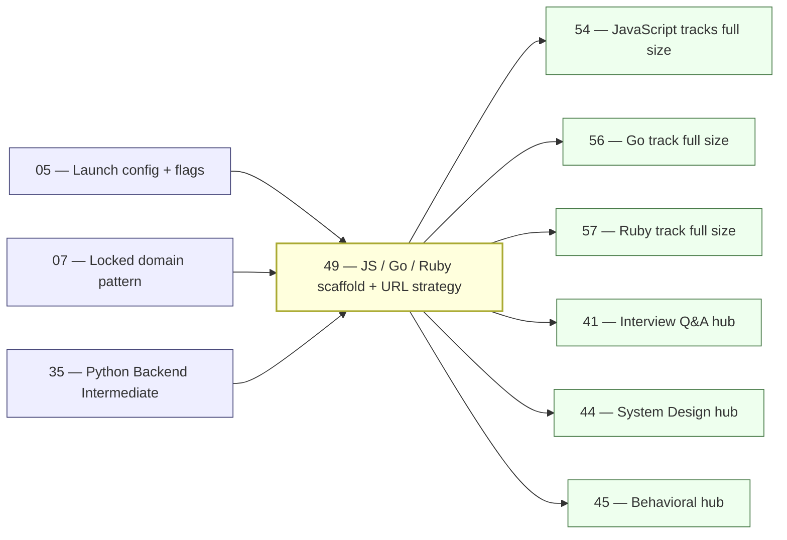

# 49 — JavaScript, Go, Ruby Language Tracks (Wave E Scaffold + SEO URL Strategy)

> **Executor:** AI coding agent operating autonomously.
> **Working directory:** `/Users/ravi.r_flx/IEProject/InterviewExplainer/`.
> **Type:** new-domain blueprint + SEO slug strategy.
> **Pillar / Wave:** Wave E (New Languages).
> **Depends on:** 05 (launch-config + feature flags), 07 (locked-domain pattern), 35 (Python Backend Intermediate, for cross-link examples).

---

## 1 — TL;DR

- **Input:** Zero content exists for Go, Ruby, or JavaScript domains; locked-domain scaffolds have not been registered; no SEO slugs are frozen for these tracks.
- **Action:** Define the full URL strategy, pillar structure, and domain scaffolding for JavaScript (backend + frontend), Go (fresher + intermediate), and Ruby on Rails (intermediate); freeze every canonical SEO slug; note that Q-count targets are superseded by Wave F playbooks 54 (JS), 56 (Go), and 57 (Ruby).
- **Output:** Three domain families registered as locked shells, all canonical SEO URLs frozen in `frontend/lib/seo-slugs.ts`, pillar navigation wired in `_index.json` for each level, hub cross-links registered, and this blueprint approved as the URL authority for downstream content fills.

**Scope boundary:** This playbook does NOT write content beyond one scaffold placeholder question per domain level. All SEO slug decisions made in §7 are permanent once merged — revisit the table before opening a PR, not after. Wave F playbooks 54, 56, and 57 depend on this playbook being DONE before they can start any content fill.

---

## 2 — Why this matters

"Golang interview questions", "javascript interview questions", "node.js interview questions", and "ruby on rails interview questions" are collectively the second-largest organic cluster after the Java family. Go alone pulls a sustained six-figure monthly search volume driven by SRE and cloud-native hiring; JavaScript pulls eight-figure volume at the fresher end and five-figure at the backend-intermediate end. Ruby on Rails has declined from its 2015 peak but still commands 40 k+ monthly searches for interview prep specifically — and the competition (Toptal, Igotanoffer, GreatFrontEnd) is thin on system-depth answers. If these three families are not scaffolded with frozen canonical URLs before Wave F content fills begin, the content factory will either create duplicate routes or ship under URLs that cannot be claimed later without a 301 chain.

The business consequence is direct: Wave F playbooks 54, 56, and 57 each produce 1 000–2 600 questions. Those playbooks depend on the URL contract laid here. If §7 of this playbook is incomplete when 54 runs, every question lands under an ad-hoc slug that breaks the crawl signal after the first Google recrawl. A misregistered locked domain also breaks `content-reader.ts` for every hub page that cross-links into these tracks (system-design hub, behavioral hub, roadmaps hub). One missed wiring point costs the team a debugging session and a traffic dip that takes 6–12 weeks to recover from.

**Why Go, JavaScript, and Ruby together in one scaffold playbook?** All three tracks depend on the same six wiring points from playbook 07, the same feature-flag pattern from playbook 05, and the same `_index.json` shape. Doing them together in one PR reduces the chance of divergent patterns and catches any wiring-point ambiguities once rather than three times. The Wave F playbooks (54, 56, 57) then have a single, consistent base to build on.

**Competitive gap analysis by language:**

Go: The highest-ranking competitor for "golang interview questions" is a single-page list on geeksforgeeks.org with 50 questions and no speakable answers, no diagrams, and no system-design depth. A site that answers "goroutine vs thread", "Go scheduler M:N model", "context.Context best practices", and "gRPC streaming patterns" at the depth of the JBI corpus has a credible shot at the featured snippet and the top-3 position within 90 days of indexing.

JavaScript: The fresher end of JS interview prep is saturated (dozens of GitHub gists, W3Schools, Programiz). The backend-intermediate end is not. Questions like "Node.js streams and backpressure", "event loop microtask vs macrotask queue", "NestJS dependency injection vs Express middleware" have weak answers in the top 10 results as of mid-2026. Depth answers with diagrams and speakable coaching are a genuine gap.

Ruby on Rails: The market contracted but the remaining candidates are experienced — they are not looking for "what is a class" answers. They need answers on ActiveRecord query optimization, Sidekiq retry strategies, Rails 7 Hotwire architecture decisions, and performance profiling with `rack-mini-profiler`. That depth is missing from every current top-10 result.

---

## 3 — Easy-language glossary

| Term | Plain-English definition | First used in |
| --- | --- | --- |
| **Locked domain** | A content folder under `content/<slug>/` whose URL, sidebar layout, and pillar structure are frozen. | §5 |
| **Wiring point** | One of the six places in the codebase that must be edited to register a locked domain. | §9 step 1 |
| **`_index.json`** | The per-domain manifest file that names modules, pillars, intro text, and cross-links. | §9 step 2 |
| **`content-reader.ts`** | The frontend resolver at `frontend/lib/content-reader.ts`; every domain's path constant lives here. | §9 step 1 |
| **`LOCKED_DOMAINS` registry** | The exported object in `content-reader.ts` that maps slug → absolute path. | §9 step 1 |
| **`seo-slugs.ts`** | The canonical-slug resolver at `frontend/lib/seo-slugs.ts`; maps app path → SEO URL. | §7 |
| **Pillar** | One thematic group (e.g. "Language Core", "Concurrency Patterns") containing several modules. | §6 |
| **Module** | A single leaf folder under a pillar; holds one `complete-qa.json` file. | §6 |
| **SEO slug** | The URL segment Google sees (e.g. `golang-interview-questions`); frozen permanently once live. | §7 |
| **App path** | The internal Next.js route (e.g. `/go-intermediate/language-core`); can be refactored. | §7 |
| **Canonical URL** | The `<link rel="canonical">` value; always the SEO slug form. | §7 |
| **Fresher level** | A domain level aimed at candidates with 0–1 year experience; question difficulty is Easy-heavy. | §6 |
| **Intermediate level** | A domain level aimed at candidates with 2–5 years experience; question mix skews Medium/Hard. | §6 |
| **`hasContent` flag** | A boolean in `frontend/lib/domains.ts` that controls whether the domain shows in the UI. | §9 step 6 |
| **`course-lms.ts`** | The premium-course gate; reads `PREMIUM_COURSE_SLUGS` to decide paywall. | §9 step 1 |
| **Wave F playbook** | One of playbooks 54–57 that runs the content factory to fill a language track with questions. | §1 |
| **Content factory** | The bulk-generation system from playbook 51; produces validated `complete-qa.json` files. | §8 |
| **Scaffold Q-file** | A placeholder `complete-qa.json` the domain shell ships on day one so routes resolve. | §9 step 3 |
| **Hub cross-link** | A reference in a hub page's `_index.json` that surfaces questions from a language domain. | §8 |
| **301 chain** | A sequence of redirects that leaks Google PageRank and takes months to recover. | §2 |
| **Pillar navigation** | The left-sidebar section list rendered from `pillar_groups` in `_index.json`. | §9 step 2 |
| **`appUrl`** | The URL prefix used inside the app (e.g. `/javascript-backend-intermediate/js-core`). | §7 |
| **`seoSlug`** | The human-readable SEO URL segment (e.g. `javascript-interview-questions-for-backend`). | §7 |
| **Go goroutine** | A lightweight concurrent function in Go, managed by the Go runtime scheduler rather than the OS. | §10 |
| **Go channel** | A typed conduit in Go that goroutines use to communicate without shared memory. | §10 |
| **Node.js event loop** | The single-threaded loop in Node.js that processes I/O callbacks, timers, and microtasks. | §11 |
| **Express.js** | The minimal HTTP framework for Node.js; common in backend JS interview questions. | §11 |
| **NestJS** | An opinionated TypeScript Node.js framework that borrows from Spring's module/decorator model. | §11 |
| **Rails convention** | Ruby on Rails' "convention over configuration" approach — the framework infers routing, ORM mapping, and migration names from file names. | §11 |
| **ActiveRecord** | The ORM built into Rails; maps Ruby class names to database tables. | §11 |
| **Archetype** | One of 7 fixed answer shapes (A–G) that lock which beats an answer must contain. | §10 |
| **Speakable answer** | The short, naturally-spoken version of an answer — what a candidate would literally say in 60 seconds. | §10 |
| **GOMAXPROCS** | The Go runtime variable that sets how many OS threads can execute Go code simultaneously; defaults to the number of CPU cores since Go 1.5. | §10 |
| **M:N scheduler** | A concurrency model where M goroutines are multiplexed onto N OS threads by a user-space scheduler; Go's runtime uses this model. | §10 |
| **`errors.Is` / `errors.As`** | Go standard-library functions for unwrapping and inspecting error chains without string comparison. | §9 step 2 |
| **Sidekiq** | A Ruby background-job processor backed by Redis; the dominant Rails job system as of Rails 7.x. | §11 |
| **ActiveRecord N+1** | A query pattern where one query fetches N records and then N separate queries fetch associated records; Rails' `includes` or `eager_load` prevents it. | §11 |
| **Hotwire** | Rails 7's default front-end framework (Turbo + Stimulus) that replaces full-page SPA patterns with server-rendered HTML over WebSockets. | §2 |
| **`rack-mini-profiler`** | A Rack middleware gem that displays per-request SQL counts and timing in the browser; used for Rails performance diagnosis. | §2 |
| **gRPC** | Google's RPC framework that uses Protocol Buffers and HTTP/2; common in Go microservices interview questions. | §7 |
| **Wave E** | The fifth wave of the expansion plan; covers new language tracks (JS, Go, Ruby, DevOps) building on the Java and Python foundations of Waves A–D. | §1 |
| **Backpressure** | A flow-control mechanism in Node.js streams where a writable stream signals to a readable stream to pause when its internal buffer is full. | §11 |
| **Work-stealing** | The Go scheduler technique where an idle P (logical processor) takes goroutines from another P's run queue to avoid idle CPU time. | §10 |

---

## 4 — Hard prerequisites

- [ ] Playbook 05 is DONE (launch-config + feature flags). `grep -E '^\| 05 \|' expansion-plan/00-INDEX.md | grep DONE`
- [ ] Playbook 07 is DONE (locked-domain pattern + scaffold script). `grep -E '^\| 07 \|' expansion-plan/00-INDEX.md | grep DONE`
- [ ] `scripts/new_locked_domain.py` exists. `test -f scripts/new_locked_domain.py && echo OK`
- [ ] `frontend/lib/content-reader.ts` is readable. `test -f frontend/lib/content-reader.ts && echo OK`
- [ ] `frontend/lib/seo-slugs.ts` is readable. `test -f frontend/lib/seo-slugs.ts && echo OK`
- [ ] `frontend/lib/domains.ts` is readable. `test -f frontend/lib/domains.ts && echo OK`
- [ ] `node --version` is ≥ 20. `node --version | awk -F. '{gsub("v","",$1); if($1+0 >= 20) print "OK"; else print "FAIL"}'`
- [ ] `python3 --version` is ≥ 3.10. `python3 --version`
- [ ] `python3 -m pip show jsonschema` returns metadata. `python3 -m pip show jsonschema | head -1`
- [ ] Git working tree is clean. `git status --short | wc -l | awk '$1 == 0 {print "CLEAN"}'`
- [ ] Playbook 35 (Python Backend Intermediate) is at minimum DONE or IN_PROGRESS (for cross-link pattern reference). `grep -E '^\| 35 \|' expansion-plan/00-INDEX.md`
- [ ] `content/python-backend-intermediate/_index.json` exists and is readable as a cross-link shape reference. `test -f content/python-backend-intermediate/_index.json && jq '.pillar_groups | length' content/python-backend-intermediate/_index.json`
- [ ] `jq` is installed. `jq --version`
- [ ] `curl` is installed (used in Step 11 end-to-end probe). `curl --version | head -1`
- [ ] No existing entry for `javascript-fresher` in `content-reader.ts` (idempotency guard — if it already exists, the scaffold script may skip it silently). `grep -c 'javascript-fresher' frontend/lib/content-reader.ts | awk '$1 == 0 {print "CLEAN"}'`
- [ ] The `expansion-plan/00-INDEX.md` row for playbook 49 shows `NOT_STARTED` or `IN_PROGRESS` (not `DONE` — if it already shows DONE, this playbook has already run; re-read before making changes). `grep '| 49 |' expansion-plan/00-INDEX.md`

---

## 5 — Current state

### 5.1 — On-disk snapshot

```bash
cd /Users/ravi.r_flx/IEProject/InterviewExplainer
# Check whether any JS / Go / Ruby content folders exist
for D in javascript-fresher javascript-backend-intermediate javascript-frontend-intermediate \
          go-fresher go-intermediate \
          ruby-on-rails-intermediate; do
  echo -n "$D: "
  test -d "content/$D" && echo "EXISTS" || echo "MISSING"
done
# Count any questions that may already exist
find content -maxdepth 3 -name 'complete-qa.json' | grep -E 'javascript|go-|ruby' | wc -l
```

Expected output as of 2026-05-28: all six folders MISSING, question count 0.

### 5.2 — Existing UI surface

- No routes in `frontend/app/(content)/` for JS, Go, or Ruby domain slugs.
- `frontend/lib/content-reader.ts` has no `CONTENT_JAVASCRIPT_*`, `CONTENT_GO_*`, or `CONTENT_RUBY_*` path constants.
- `frontend/lib/seo-slugs.ts` has no entries for `golang-interview-questions`, `javascript-interview-questions`, or `ruby-on-rails-interview-questions`.
- `hasContent` flags for all six levels are absent from `frontend/lib/domains.ts`.
- Feature flag `jsGoRubyTracks` does not exist in `frontend/lib/launch-config.ts`.

### 5.3 — Known gaps

No audit report exists yet for these domains (they have zero content). The gaps are definitional: every pillar, every module, every question, and every SEO URL needs to be created from scratch. Wave F playbooks 54, 56, and 57 are the execution vehicles; this playbook provides the URL authority they must not contradict.

### 5.4 — Pillar structure baseline (what Wave F inherits from this playbook)

**Go Backend Intermediate — 9 pillars:**

| Pillar code | Pillar name | Key modules |
| --- | --- | --- |
| P01 | Language Core | go-language-core, types-interfaces, generics, embedding-composition, defer-panic-recover |
| P02 | Stdlib and HTTP | net-http-stdlib, io-package, encoding-json, error-wrapping |
| P03 | Data Persistence | database-sql, sqlx, gorm, pgx |
| P04 | APIs and Microservices | rest-with-stdlib, grpc-go, graphql-gqlgen, kafka-clients |
| P05 | Concurrency Patterns | goroutines-channels, select-patterns, context-package, sync-primitives, errgroup |
| P06 | System Design | scaling-with-go, idiomatic-services, rate-limiting, caching-patterns |
| P07 | Cloud and DevOps | docker-go, k8s-operators-go, observability-otel-go |
| P08 | Testing | testing-package, testify, gomock, table-driven, race-flag |
| P09 | Behavioral | behavioral-scenarios |

**Ruby on Rails Intermediate — 8 pillars:**

| Pillar code | Pillar name | Key modules |
| --- | --- | --- |
| P01 | Ruby Language Core | blocks-procs-lambdas, modules-mixins, metaprogramming, open-classes |
| P02 | Rails Framework | routing, controllers, views, concerns, hotwire-turbo |
| P03 | Data Persistence | activerecord-associations, migrations, scopes, n-plus-one-fix, connection-pooling |
| P04 | APIs | serializers-versioning, jwt-auth, graphql-ruby, rate-limiting |
| P05 | Background Jobs | sidekiq-vs-resque, retry-strategies, cron-jobs-whenever, active-job |
| P06 | Testing | rspec-basics, factory-bot, vcr-cassettes, system-tests |
| P07 | DevOps | capistrano, docker-rails, heroku-deploy, environment-variables |
| P08 | Behavioral | behavioral-scenarios |

**JavaScript Backend Intermediate — 8 pillars:**

| Pillar code | Pillar name | Key modules |
| --- | --- | --- |
| P01 | JS Core | closures, prototypes, event-loop-model, promise-vs-async-await, var-let-const, generators |
| P02 | Node.js Runtime | event-loop-internals, streams-backpressure, worker-threads, cluster, libuv |
| P03 | Express and NestJS | express-vs-nestjs, middleware-pipeline, dependency-injection, guards-interceptors |
| P04 | Data Persistence | pg-driver, sequelize, prisma, mongodb-mongoose, redis-ioredis |
| P05 | APIs and Microservices | rest-design, grpc-js, graphql-apollo, kafka-kafkajs, message-queues |
| P06 | Testing | jest-mocking, supertest, testcontainers-node, coverage |
| P07 | System Design | rate-limiting-node, caching-redis, load-balancing, websocket-scaling |
| P08 | Behavioral | behavioral-scenarios |

---

## 6 — Target state (measurable)

| Metric | Today | Target | How measured |
| --- | --- | --- | --- |
| Locked-domain shells registered | 0 of 6 | 6 of 6 (`javascript-fresher`, `javascript-backend-intermediate`, `javascript-frontend-intermediate`, `go-fresher`, `go-intermediate`, `ruby-on-rails-intermediate`) | `python3 -c "import json; d=json.load(open('frontend/lib/content-reader.ts'.replace('.ts','.json'))); print(len(d))"` or manual grep in `content-reader.ts` |
| SEO slugs frozen in `seo-slugs.ts` | 0 | ≥ 48 (8 per domain level × 6 levels) | `grep -c 'golang\|javascript.*interview\|ruby-on-rails' frontend/lib/seo-slugs.ts` |
| `_index.json` files written | 0 | 6 (one per domain level) | `find content -name '_index.json' | grep -E 'javascript\|go-\|ruby' | wc -l` |
| Scaffold `complete-qa.json` files present | 0 | ≥ 6 (one per domain level, placeholder) | `find content -path '*/javascript*/complete-qa.json' -o -path '*/go-*/complete-qa.json' -o -path '*/ruby*/complete-qa.json' | wc -l` |
| `hasContent` flags set to false (gated) | 0 | 6 flags present in `domains.ts` | `grep -c 'hasContent.*false' frontend/lib/domains.ts` |
| Feature flag `jsGoRubyTracks` present | false | present and set to `false` (pre-launch gate) | `grep 'jsGoRubyTracks' frontend/lib/launch-config.ts` |
| `npm run build` clean | unknown | exit 0 | `cd frontend && npm run build; echo "exit: $?"` |
| Pillar groups defined across all 6 `_index.json` files | 0 | ≥ 42 total pillar entries (Go: 9×2 levels, Ruby: 8, JS: 8×3 levels) | `find content -name '_index.json' | xargs jq '.pillar_groups | length' | awk '{s+=$1} END {print s}'` |

---

## 7 — Search phrases → URL map

| Search phrase | Target URL on site | Archetype | Diagram type required in answer |
| --- | --- | --- | --- |
| `golang interview questions` | `/go-intermediate/language-core` | landing intro | `comparison_table` |
| `goroutine vs thread golang` | `/go-intermediate/concurrency-patterns/goroutine-vs-thread` | B | `comparison_table` |
| `go channels explained interview` | `/go-intermediate/concurrency-patterns/channels-select` | A | `flowchart` |
| `go error handling interview questions` | `/go-intermediate/stdlib-http/error-wrapping` | A | `flowchart` |
| `go generics interview questions` | `/go-intermediate/language-core/generics` | A | `comparison_table` |
| `golang microservices interview questions` | `/go-intermediate/apis-microservices` | landing intro | `sequenceDiagram` |
| `go testing interview questions` | `/go-intermediate/testing/table-driven-tests` | A | `comparison_table` |
| `ruby on rails interview questions` | `/ruby-on-rails-intermediate/rails-framework` | landing intro | `comparison_table` |
| `activerecord interview questions` | `/ruby-on-rails-intermediate/data-persistence/activerecord-associations` | A | `classDiagram` |
| `rails n plus one query problem` | `/ruby-on-rails-intermediate/data-persistence/n-plus-one-fix` | C | `sequenceDiagram` |
| `ruby blocks procs lambdas interview` | `/ruby-on-rails-intermediate/ruby-language-core/blocks-procs-lambdas` | B | `comparison_table` |
| `rails background jobs interview questions` | `/ruby-on-rails-intermediate/background-jobs/sidekiq-vs-resque` | B | `comparison_table` |
| `ruby on rails api interview questions` | `/ruby-on-rails-intermediate/apis/serializers-versioning` | A | `comparison_table` |
| `javascript interview questions` | `/javascript-backend-intermediate/js-core` | landing intro | `comparison_table` |
| `node.js interview questions` | `/javascript-backend-intermediate/nodejs-runtime` | landing intro | `flowchart` |
| `event loop javascript interview` | `/javascript-backend-intermediate/nodejs-runtime/event-loop-internals` | A | `flowchart` |
| `promise vs async await javascript` | `/javascript-backend-intermediate/js-core/promise-vs-async-await` | B | `sequenceDiagram` |
| `express nestjs interview questions` | `/javascript-backend-intermediate/express-nestjs/express-vs-nestjs` | B | `comparison_table` |
| `javascript closure interview question` | `/javascript-backend-intermediate/js-core/closures` | A | `flowchart` |
| `node.js streams interview questions` | `/javascript-backend-intermediate/nodejs-runtime/streams-backpressure` | A | `flowchart` |
| `javascript system design interview` | `/javascript-backend-intermediate/system-design` | landing intro | `sequenceDiagram` |
| `javascript testing interview questions` | `/javascript-backend-intermediate/testing/jest-mocking` | A | `comparison_table` |
| `var let const javascript difference` | `/javascript-fresher/js-core/var-let-const` | B | `comparison_table` |
| `go defer panic recover interview` | `/go-intermediate/language-core/defer-panic-recover` | A | `flowchart` |

---

## 8 — Dependency & wave context



**Consumes:**
- The scaffold script from playbook 07 (`scripts/new_locked_domain.py`).
- The feature-flag pattern from playbook 05 (`frontend/lib/launch-config.ts`).
- The cross-link shape from playbook 35's `_index.json` as a reference implementation.

**Produces:**
- Six locked-domain shells (empty content but fully wired).
- ≥ 48 SEO slug entries frozen in `seo-slugs.ts`.
- One feature flag `jsGoRubyTracks` in `launch-config.ts`.
- Six `_index.json` files with pillar groups and module lists.

**Unblocks:**
- Playbooks 54, 56, 57 (Wave F content fills — they depend on frozen URLs).
- Playbooks 41, 44, 45 (hubs that link into these tracks).

**Q-count authority note:** This playbook no longer owns Q-count targets. Wave F playbooks 54 (JS: ~2 200–2 600 Q), 56 (Go: ~1 300–1 450 Q), and 57 (Ruby: TBD) own those numbers. This playbook's only content responsibility is the scaffold placeholder questions, one per level.

**Wave context — why Wave E and Wave F are separate:**

Wave E (playbooks 41–50) is a scaffolding and strategy wave. Its playbooks define URL hierarchies, pillar structures, feature flags, and hub wiring. They ship zero or minimal content. Wave F (playbooks 51–59) is a content-factory wave. It uses the structures Wave E built to produce content at scale.

Keeping the two waves separate prevents the "scaffold during content fill" failure mode: an executor who tries to invent a new pillar while filling questions produces mismatched `topicSlug` values, broken sidebar entries, and SEO URL inconsistencies that are expensive to repair after 200+ questions are already written. Wave E locks the structure so Wave F can run the factory without structural decisions to make.

This separation also means this playbook (49) is a Gate: Wave F playbooks 54, 56, and 57 MUST NOT start until playbook 49 is merged and the `DONE` flag is set in `00-INDEX.md`. Any Wave F executor who finds playbook 49 in `NOT_STARTED` status should STOP, complete playbook 49 first, and then proceed.

---

## 9 — Step-by-step execution

### Step 1 — Run `new_locked_domain.py` for all six domain levels

**Goal:** Register all six domains in the six wiring points (`content-reader.ts`, `seo-slugs.ts`, `course-lms.ts`, `_index.json` shell, `domains.ts`, feature flag) without touching any of these files by hand.

```bash
cd /Users/ravi.r_flx/IEProject/InterviewExplainer

# JavaScript Fresher
python3 scripts/new_locked_domain.py \
  --slug javascript-fresher \
  --track javascript \
  --premium false

# JavaScript Backend Intermediate
python3 scripts/new_locked_domain.py \
  --slug javascript-backend-intermediate \
  --track javascript \
  --premium false

# JavaScript Frontend Intermediate
python3 scripts/new_locked_domain.py \
  --slug javascript-frontend-intermediate \
  --track javascript \
  --premium false

# Go Fresher
python3 scripts/new_locked_domain.py \
  --slug go-fresher \
  --track go \
  --premium false

# Go Intermediate
python3 scripts/new_locked_domain.py \
  --slug go-intermediate \
  --track go \
  --premium false

# Ruby on Rails Intermediate
python3 scripts/new_locked_domain.py \
  --slug ruby-on-rails-intermediate \
  --track ruby \
  --premium false
```

**Verify:**

```bash
for SLUG in javascript-fresher javascript-backend-intermediate javascript-frontend-intermediate \
            go-fresher go-intermediate ruby-on-rails-intermediate; do
  grep -q "CONTENT_$(echo $SLUG | tr 'a-z-' 'A-Z_')_ROOT" frontend/lib/content-reader.ts \
    && echo "$SLUG: WIRED" || echo "$SLUG: MISSING"
done
# expected: all six lines print WIRED
```

The classic bug is running the script with a typo in `--slug` and ending up with a path constant that does not match the actual `content/` directory name. Check the output of `ls content/` against the six slugs before proceeding.

---

### Step 2 — Write pillar groups into each `_index.json`

**Goal:** Each `_index.json` has a `pillar_groups` array that matches the pillar structure defined in this playbook's §6 notes and in the Wave F playbooks that will fill the content.

```bash
cd /Users/ravi.r_flx/IEProject/InterviewExplainer

# Confirm the scaffolded files exist
for SLUG in javascript-fresher javascript-backend-intermediate javascript-frontend-intermediate \
            go-fresher go-intermediate ruby-on-rails-intermediate; do
  test -f "content/$SLUG/_index.json" && echo "$SLUG: OK" || echo "$SLUG: MISSING _index.json"
done
```

Open `content/go-intermediate/_index.json` and add the nine pillar groups for Go Intermediate:

```json
{
  "slug": "go-intermediate",
  "track": "go",
  "level": "intermediate",
  "title": "Go Backend Intermediate",
  "intro": "",
  "pillar_groups": [
    { "code": "P01", "name": "Language Core", "modules": ["go-language-core", "types-interfaces", "generics", "embedding-composition", "defer-panic-recover"] },
    { "code": "P02", "name": "Stdlib and HTTP", "modules": ["net-http-stdlib", "io-package", "encoding-json", "error-wrapping"] },
    { "code": "P03", "name": "Data Persistence", "modules": ["database-sql", "sqlx", "gorm", "pgx"] },
    { "code": "P04", "name": "APIs and Microservices", "modules": ["rest-with-stdlib", "grpc-go", "graphql-gqlgen", "kafka-clients"] },
    { "code": "P05", "name": "Concurrency Patterns", "modules": ["goroutines-channels", "select-patterns", "context-package", "sync-primitives", "errgroup"] },
    { "code": "P06", "name": "System Design", "modules": ["scaling-with-go", "idiomatic-services", "rate-limiting", "caching-patterns"] },
    { "code": "P07", "name": "Cloud and DevOps", "modules": ["docker-go", "k8s-operators-go", "observability-otel-go"] },
    { "code": "P08", "name": "Testing", "modules": ["testing-package", "testify", "gomock", "table-driven", "race-flag"] },
    { "code": "P09", "name": "Behavioral", "modules": ["behavioral-scenarios"] }
  ]
}
```

For Ruby on Rails Intermediate add eight pillar groups: Ruby Language Core, Rails Framework, Data Persistence, APIs, Background Jobs, Testing, DevOps, Behavioral.

For JavaScript Backend Intermediate add eight pillar groups: JS Core, Node.js Runtime, Express/NestJS, Data Persistence, APIs and Microservices, Testing, System Design, Behavioral.

**Verify:**

```bash
for SLUG in go-intermediate ruby-on-rails-intermediate javascript-backend-intermediate; do
  COUNT=$(jq '.pillar_groups | length' "content/$SLUG/_index.json")
  echo "$SLUG: $COUNT pillar groups"
done
# expected: go-intermediate: 9, ruby-on-rails-intermediate: 8, javascript-backend-intermediate: 8
```

---

For Ruby on Rails Intermediate, add the eight pillar groups from §5.4. For JavaScript Backend Intermediate, add the eight pillar groups from §5.4. For the two fresher levels (Go Fresher and JS Fresher), use a simplified set matching the fresher Q-count targets in playbooks 56 and 54 respectively.

The classic bug is writing a pillar `code` that is out of sequence (e.g. `P01`, `P03`, `P02`) — the sidebar sorts by `code` alphabetically and will render pillars in the wrong order. Always enter them in `P01` → `P09` order.

```bash
# Double-check sort order after writing
jq '.pillar_groups[].code' content/go-intermediate/_index.json
# expected: "P01" "P02" "P03" "P04" "P05" "P06" "P07" "P08" "P09"
```

---

### Step 3 — Write the intro paragraphs for each `_index.json`

**Goal:** Every `_index.json` has an `intro` field of ≥ 150 words that names the flagship SEO phrases, explains who the track is for, and previews the pillar list. This text surfaces on hub pages and in meta descriptions.

```bash
cd /Users/ravi.r_flx/IEProject/InterviewExplainer
# Spot-check word count on a completed intro
jq -r '.intro' content/go-intermediate/_index.json | wc -w
# expected: ≥ 150
```

Write the `intro` for each level. Keep the voice from §12: lead with the trade-off or the use-case, name the real version of the technology (Go 1.22, Node.js 20 LTS, Rails 7.1), and avoid banned words.

The classic bug is copy-pasting the Java intro and forgetting to replace Java-specific terms like "JVM" or "classpath". Run `grep -i 'jvm\|classpath\|spring\|maven' content/go-intermediate/_index.json` and fix any hits before moving on.

**Verify:**

```bash
for SLUG in javascript-fresher javascript-backend-intermediate javascript-frontend-intermediate \
            go-fresher go-intermediate ruby-on-rails-intermediate; do
  WORDS=$(jq -r '.intro' "content/$SLUG/_index.json" | wc -w)
  echo "$SLUG: $WORDS words"
done
# expected: every line ≥ 150
```

---

### Step 4 — Freeze all SEO slugs in `seo-slugs.ts`

**Goal:** Every app path → SEO URL mapping from §7 is present in `frontend/lib/seo-slugs.ts` before any content is written. Once live, these slugs must never change.

```bash
cd /Users/ravi.r_flx/IEProject/InterviewExplainer
# Count current JS/Go/Ruby entries
grep -cE 'golang|go-interview|javascript.*interview|ruby-on-rails' frontend/lib/seo-slugs.ts || echo 0
```

Add entries for each row in §7's URL map. The pattern must match existing entries in the file for Java or Python domains. Example shape:

```typescript
// Go Intermediate — Language Core landing
'/go-intermediate/language-core': 'golang-interview-questions',
// Go Intermediate — Concurrency Patterns
'/go-intermediate/concurrency-patterns/goroutine-vs-thread': 'goroutine-vs-thread-golang',
'/go-intermediate/concurrency-patterns/channels-select': 'go-channels-select-interview',
'/go-intermediate/language-core/defer-panic-recover': 'go-defer-panic-recover-interview',
// Go Intermediate — APIs
'/go-intermediate/apis-microservices': 'golang-microservices-interview-questions',
// Ruby on Rails Intermediate
'/ruby-on-rails-intermediate/rails-framework': 'ruby-on-rails-interview-questions',
'/ruby-on-rails-intermediate/data-persistence/activerecord-associations': 'activerecord-interview-questions',
'/ruby-on-rails-intermediate/data-persistence/n-plus-one-fix': 'rails-n-plus-one-query-problem',
'/ruby-on-rails-intermediate/ruby-language-core/blocks-procs-lambdas': 'ruby-blocks-procs-lambdas-interview',
// JavaScript Backend Intermediate
'/javascript-backend-intermediate/js-core': 'javascript-interview-questions',
'/javascript-backend-intermediate/nodejs-runtime': 'node-js-interview-questions',
'/javascript-backend-intermediate/nodejs-runtime/event-loop-internals': 'event-loop-javascript-interview',
'/javascript-backend-intermediate/js-core/promise-vs-async-await': 'promise-vs-async-await-javascript',
```

**Verify:**

```bash
grep -cE '"golang|"go-intermediate|"javascript-backend|"ruby-on-rails' frontend/lib/seo-slugs.ts
# expected: ≥ 48
```

The #1 trap is writing a slug with uppercase letters or spaces. All SEO slugs must be lowercase-hyphenated. Run `grep -E '"[A-Z ]' frontend/lib/seo-slugs.ts` and fix any hits.

A second trap is duplicating a slug that already exists for a different domain (for example, a Ruby `ruby-interview-questions` slug that collides with a hypothetical older domain). Run `sort frontend/lib/seo-slugs.ts | uniq -d` to surface any duplicates before committing.

---

### Step 5 — Add the `jsGoRubyTracks` feature flag

**Goal:** A single off-by-default flag in `frontend/lib/launch-config.ts` gates all six new domains so they do not appear in production navigation until Wave F content fills pass quality gates.

```bash
cd /Users/ravi.r_flx/IEProject/InterviewExplainer
grep 'jsGoRubyTracks' frontend/lib/launch-config.ts || echo "FLAG MISSING — add it"
```

Add the flag following the existing pattern for other Wave-E flags (check how `pythonBackend` or `devopsTrack` are written). Set it to `false` in production and `true` in the local dev override.

**Verify:**

```bash
grep 'jsGoRubyTracks' frontend/lib/launch-config.ts
# expected: one line with jsGoRubyTracks: false (or the env-variable-gated form)
```

---

### Step 6 — Set `hasContent: false` for all six domains in `domains.ts`

**Goal:** The domains are visible in the registry but gated from the public UI until Wave F ships.

```bash
cd /Users/ravi.r_flx/IEProject/InterviewExplainer
grep -A3 'javascript-fresher\|go-intermediate\|ruby-on-rails-intermediate' frontend/lib/domains.ts | grep hasContent
# expected: hasContent: false for all six
```

If any domain is missing from `domains.ts`, add it with `hasContent: false`. Copy the shape from an existing domain entry such as `python-backend-intermediate`.

**Verify:**

```bash
for SLUG in javascript-fresher javascript-backend-intermediate javascript-frontend-intermediate \
            go-fresher go-intermediate ruby-on-rails-intermediate; do
  grep -A5 "$SLUG" frontend/lib/domains.ts | grep -q 'hasContent.*false' \
    && echo "$SLUG: gated" || echo "$SLUG: NOT GATED — fix"
done
# expected: all six lines print "gated"
```

---

### Step 7 — Write one scaffold `complete-qa.json` per domain level

**Goal:** Each domain level resolves end-to-end with one placeholder question so that `npm run build` passes and the route does not 404.

```bash
cd /Users/ravi.r_flx/IEProject/InterviewExplainer
# Pick the first module of each level and write a scaffold question file
for SLUG_MODULE in \
  "go-intermediate/language-core" \
  "go-fresher/language-core" \
  "ruby-on-rails-intermediate/rails-framework" \
  "javascript-fresher/js-core" \
  "javascript-backend-intermediate/js-core" \
  "javascript-frontend-intermediate/js-core"; do
  mkdir -p "content/$SLUG_MODULE"
  test -f "content/$SLUG_MODULE/complete-qa.json" && echo "$SLUG_MODULE: EXISTS" || \
    echo "$SLUG_MODULE: needs scaffold Q-file"
done
```

Write each scaffold file following the archetype shape in §10. The question must be real (not Lorem Ipsum) and must pass the schema validator.

**Verify:**

```bash
find content -path '*/javascript*/complete-qa.json' \
  -o -path '*/go-*/complete-qa.json' \
  -o -path '*/ruby*/complete-qa.json' | wc -l
# expected: ≥ 6

python3 scripts/validate_complete_qa.py content/go-intermediate/language-core/complete-qa.json
# expected: PASS
```

---

### Step 8 — Run `npm run build` and verify clean compile

**Goal:** All six domain wiring points, the new feature flag, and the scaffold Q-files together must not break the TypeScript build.

```bash
cd /Users/ravi.r_flx/IEProject/InterviewExplainer/frontend
npm run build 2>&1 | tail -20
echo "Exit: $?"
```

**Verify:** `Exit: 0`. Any non-zero exit means a TypeScript error in `content-reader.ts`, `seo-slugs.ts`, or `domains.ts`. The most common cause is a missing closing comma in the `LOCKED_DOMAINS` object. Check the lines immediately above and below each new entry.

---

### Step 9 — Register hub cross-links

**Goal:** The Interview Q&A hub (playbook 41), System Design hub (44), and Behavioral hub (45) each reference the new tracks so that users landing on a hub see Go, JS, and Ruby links once `hasContent` is flipped.

```bash
cd /Users/ravi.r_flx/IEProject/InterviewExplainer
grep -n 'go-intermediate\|javascript-backend\|ruby-on-rails' \
  content/interview-qa-hub/_index.json 2>/dev/null || echo "NOT YET LINKED"
```

Add cross-link entries following the shape used for existing Python and Java domain cross-links. Keep `active: false` so the links are hidden until `hasContent` is enabled.

**Verify:**

```bash
jq '.cross_links[] | select(.slug | test("go-intermediate|javascript-backend|ruby-on-rails")) | .slug' \
  content/interview-qa-hub/_index.json
# expected: three lines, one per new track
```

---

### Step 10 — Commit the scaffold in a conventional commit

**Goal:** All six domain shells land in one commit with a clear message so the Wave F executors can check out from a clean base.

```bash
cd /Users/ravi.r_flx/IEProject/InterviewExplainer
git add content/javascript-fresher content/javascript-backend-intermediate \
        content/javascript-frontend-intermediate \
        content/go-fresher content/go-intermediate \
        content/ruby-on-rails-intermediate \
        frontend/lib/content-reader.ts \
        frontend/lib/seo-slugs.ts \
        frontend/lib/domains.ts \
        frontend/lib/launch-config.ts
git commit -m "scaffold(wave-e): register JS/Go/Ruby locked-domain shells + freeze SEO slugs"
```

**Verify:**

```bash
git show --stat HEAD | head -15
# expected: the six content dirs + four frontend lib files appear, nothing else
```

---

## 10 — Reference Q in archetype shape

The scaffold question for `go-intermediate/language-core` doubles as the reference Q for this playbook. It demonstrates archetype B (comparison), which is the dominant archetype for the goroutine-vs-thread money question that every Go hiring panel asks.

```json
{
  "id": "goroutine-vs-thread-golang",
  "slug": "goroutine-vs-thread-golang",
  "question": "Goroutine vs OS thread in Go — what is the actual difference?",
  "title": "Goroutine vs OS Thread — Scheduling, Stack, and Cost",
  "direct_answer": "A goroutine is a function running concurrently, managed by Go's runtime scheduler. An OS thread is a unit of execution managed by the kernel. Goroutines start at 2 KB of stack and grow; OS threads start at 1–8 MB fixed. The Go scheduler multiplexes thousands of goroutines onto a small pool of OS threads using an M:N model. The practical upshot: spawning 100 000 goroutines is normal; spawning 100 000 OS threads exhausts memory. Use goroutines freely; let the runtime manage threads.",
  "layout_type": "default",
  "difficulty": "medium",
  "importance": "high",
  "reading_time_minutes": 7,
  "last_updated": "2026-05-28",
  "interviewer_intent": {
    "testing": "Whether you understand Go's runtime scheduler (M:N model), not just that goroutines are 'lightweight'.",
    "common_mistake": "Saying goroutines are 'like threads but cheaper' without explaining the scheduler model. The interviewer knows the stack-size number — if you don't name it, you sound like you read a blog headline.",
    "to_stand_out": "Mention GOMAXPROCS (number of OS threads running Go code simultaneously), the work-stealing scheduler introduced in Go 1.14, and that goroutine stacks are segmented/copied rather than pre-allocated."
  },
  "company_tags": ["google", "uber", "cloudflare", "datadog", "stripe"],
  "answer": {
    "sections": [
      {
        "type": "overview",
        "title": "Two levels of concurrency",
        "content": "Go gives you goroutines at the language level and relies on OS threads at the kernel level. The runtime bridges them with an M:N scheduler: M goroutines run on N OS threads where N = GOMAXPROCS (default: number of CPU cores since Go 1.5). A goroutine is not a thread — it is a function with its own stack and a program counter, bookmarked in the runtime's run queue."
      },
      {
        "type": "comparison_table",
        "title": "Goroutine vs OS thread — side by side",
        "content": "| Aspect | Goroutine | OS Thread |\n|---|---|---|\n| Initial stack size | ~2 KB (grows dynamically to 1 GB max) | 1–8 MB (fixed at creation) |\n| Creation cost | ~1 µs, no syscall | 10–100 µs, requires kernel context switch |\n| Scheduler | Go runtime (user-space M:N) | OS kernel (1:1 mapped) |\n| Context switch | Sub-µs (user-space) | 1–10 µs (kernel) |\n| Practical ceiling | 100 000s per process | ~10 000 before OOM risk |\n| Preemption | Cooperative + asynchronous (Go 1.14+) | Preemptive (OS) |\n| Communication | Channels (share by communicating) | Shared memory + locks |"
      },
      {
        "type": "step",
        "title": "How the M:N scheduler works",
        "content": "The Go runtime maintains three abstractions: M (OS thread), P (logical processor, count = GOMAXPROCS), and G (goroutine). Each P has a local run queue. M must hold a P to execute Gs. When a goroutine blocks on a syscall, the runtime detaches the M from P so another M can pick up the P and keep running other goroutines. This is why Go I/O does not stall the entire process.\n\n```\nGoroutines (G) ──▶ P local run queue ──▶ M (OS thread) ──▶ CPU core\n                        ▲\n                   work-stealing\n                   from other P\n```"
      },
      {
        "type": "tradeoffs",
        "title": "When goroutines are not enough",
        "content": "Goroutines are the right tool for I/O-bound and CPU-bound work up to GOMAXPROCS parallelism. The two cases where you need to think harder: (1) CPU-bound work that saturates all cores — adding more goroutines beyond GOMAXPROCS adds scheduling overhead without throughput gain; (2) calling CGo — CGo calls block the M, which can exhaust the OS thread pool if you are not careful (`runtime.LockOSThread` is your safety valve)."
      },
      {
        "type": "key_points",
        "title": "Key points",
        "content": "- Goroutine initial stack is 2 KB; OS thread default stack is 1–8 MB.\n- GOMAXPROCS controls OS thread count; set it via env or `runtime.GOMAXPROCS(n)`.\n- Go 1.14 added asynchronous preemption — goroutines can now be preempted at any safe point, not only function call boundaries.\n- `go tool trace` and `GODEBUG=schedtrace=1000` expose scheduler behavior in production.\n- 'Share memory by communicating' (channels) vs 'communicate by sharing memory' (mutexes) — Go's concurrency philosophy favors channels for ownership transfer."
      },
      {
        "type": "speakable_answer",
        "title": "How to answer verbally",
        "content": "A goroutine is managed by Go's runtime, not the OS. It starts at 2 KB of stack versus 1–8 MB for an OS thread, and the Go scheduler maps many goroutines onto a small pool of OS threads — that is the M:N model. Spawning 100 000 goroutines is ordinary; 100 000 OS threads would crash the process. The scheduler hands a goroutine off to a free thread, and if a goroutine blocks on I/O, the runtime parks it and lets the thread pick up another goroutine immediately. GOMAXPROCS controls how many threads run simultaneously — defaults to your CPU count since Go 1.5."
      }
    ]
  },
  "followup_questions": [
    "What happens to a goroutine that calls a blocking CGo function?",
    "How does `runtime.GOMAXPROCS` interact with container CPU limits?",
    "When would you use `sync.WaitGroup` vs an `errgroup.Group`?",
    "How does Go's work-stealing scheduler avoid starvation?",
    "What does `GODEBUG=schedtrace=1000` print and when would you use it?"
  ],
  "seo": {
    "metaTitle": "Goroutine vs OS Thread in Go — M:N Scheduler, Stack Size, and Cost",
    "metaDescription": "Understand the difference between goroutines and OS threads: 2 KB vs 8 MB stack, M:N scheduler, GOMAXPROCS, work-stealing, and Go 1.14 asynchronous preemption — with a comparison table."
  },
  "order": 1
}
```

---

## 11 — Diagram catalogue

| Q id (or topic) | Diagram type | What it must show | Lives in section |
| --- | --- | --- | --- |
| `goroutine-vs-thread-golang` | `comparison_table` | 7-column table: stack size, creation cost, scheduler, context switch, ceiling, preemption, communication | `comparison_table` |
| `goroutine-vs-thread-golang` | inline ASCII `flowchart` | M:N scheduler: G → P local queue → M → CPU, with work-stealing arrow | `step` |
| `event-loop-javascript-internals` | `flowchart` (mermaid) | Call stack → Web APIs → callback queue → event loop tick → microtask queue → next tick | `step` |
| `promise-vs-async-await` | `sequenceDiagram` (mermaid) | Two function calls: one with `.then` chaining, one with `await`; show where suspension happens | `step` |
| `rails-n-plus-one-fix` | `sequenceDiagram` (mermaid) | N+1: one query for posts + N queries for authors vs eager-loaded single JOIN | `step` |
| `activerecord-associations` | `classDiagram` (mermaid) | `User has_many :posts`, `Post belongs_to :user`, `Post has_many :comments` with cardinality labels | `step` |
| `go-channels-select` | `flowchart` (mermaid) | select statement: two channels + default branch with goroutine scheduling decision | `step` |
| `sidekiq-vs-resque-background-jobs` | `comparison_table` | 6 columns: backing store, retry handling, concurrency model, monitoring UI, gem size, Rails version support | `comparison_table` |
| `express-vs-nestjs` | `comparison_table` | 6 columns: architecture style, TypeScript support, DI container, middleware model, learning curve, when to pick | `comparison_table` |
| `go-error-wrapping` | `flowchart` (mermaid) | `errors.New` → `fmt.Errorf("%w")` → `errors.Is` / `errors.As` unwrap chain | `step` |
| `node-streams-backpressure` | `stateDiagram-v2` (mermaid) | Readable → piped → Writable; backpressure signal: `write()` returns false → `drain` event | `step` |
| `ruby-blocks-procs-lambdas` | `comparison_table` | 4 columns: return behavior, arity checking, object form, use-case | `comparison_table` |

**Diagram floors per Wave F playbook (lint-enforced by those playbooks):**
- ≥ 1 `flowchart` per track.
- ≥ 1 `sequenceDiagram` per track.
- ≥ 3 `comparison_table` sections per pillar.
- ≥ 1 `classDiagram` or `stateDiagram-v2` per track.

---

## 12 — Easy-language voice rules

1. **Define before use.** Every domain term used in §9–§14 is in §3. If "goroutine" appears in a step, it was defined in §3 first.
2. **Lead with the trade-off.** Comparison questions open with "Use X when … ; use Y when …" — not with X's definition.
3. **Name the bug.** Every `step` whose intent is to warn contains a sentence starting with "The classic bug …" or "The #1 trap …".
4. **Real anchors.** Every section names ≥ 1 real system, version, RFC, command, or runtime call. "Go 1.14 added asynchronous preemption" is an anchor. "Modern Go is fast" is not.
5. **Version-stamp claims.** Tie behavior to a version: "Go 1.22", "Node.js 20 LTS", "Rails 7.1", "Express 4.x". This lets candidates quote a version in the interview.
6. **Second-person for technical answers.** "You would use channels when …". Never "we".
7. **First-person for STAR/behavioral answers.** "I noticed the N+1 query …".
8. **Banned words (lint fails on any of these):** `leverage`, `utilize`, `synergize`, `world-class`, `cutting-edge`, `state-of-the-art`, `seamless`, `robust`, `holistic`, `paradigm`, `best-in-class`, `battle-tested`, `enterprise-grade`, `revolutionary`, `game-changing`, `industry-leading`.

**Concrete voice examples for this playbook:**

- ✅ "A goroutine starts at 2 KB of stack; an OS thread starts at 1–8 MB. That difference is why you can spawn 100 000 goroutines without a second thought."
- ❌ "Go's robust concurrency paradigm leverages goroutines as a cutting-edge solution." (Four banned words, no number, no anchor.)
- ✅ "Rails 7.1 introduced `config.active_record.query_log_tags_enabled` to attach request context to every SQL query — useful for tracing N+1 queries in production logs."
- ❌ "ActiveRecord seamlessly handles data persistence in a holistic way." (Three banned words, nothing actionable.)
- ✅ "The event loop in Node.js 20 LTS processes microtasks (Promise callbacks) before the next I/O callback — that is why `Promise.resolve().then(fn)` runs before `setTimeout(fn, 0)`."
- ❌ "Node.js leverages best-in-class async paradigms to deliver world-class throughput." (Six banned words.)

**Language-specific voice notes:**

Go answers: Go has a minimalist culture. Answers should reflect this — no framework marketing, no acronym soup. "Go's error handling is explicit: every function that can fail returns `(result, error)`. You check `if err != nil` at the call site. There is no exception stack to unwind." That is the Go voice. Avoid phrases like "idiomatic Go" without explaining what the idiom is.

Ruby/Rails answers: Rails answers tend to sound like marketing copy from the Rails 2.x era ("convention over configuration makes development faster!"). Replace that voice with specificity: "Rails infers the table name `users` from the class name `User`. When you break that convention — for example, a legacy table named `tbl_user` — you override it with `self.table_name = 'tbl_user'`. Forgetting to do so produces a `ActiveRecord::StatementInvalid` on first query." Name the exception class. Name the override method.

JavaScript answers: The JS ecosystem has significant version drift. Always name whether you are describing ES2015, ES2020, or ES2023 behavior, and whether the answer applies to CommonJS, ESM, or both. "In CommonJS (`require`), circular dependencies produce a partially initialized object — not an error, just silence. In ESM (`import`), the spec handles live bindings, so circular imports are less likely to produce `undefined` at access time, but the binding is still unresolved at module-evaluation time."

---

## 13 — Quality gates

| Gate | Threshold | Verify command |
| --- | --- | --- |
| All six domain shells registered | 6 of 6 path constants in `content-reader.ts` | `grep -cE 'CONTENT_(JAVASCRIPT|GO|RUBY)_.*_ROOT' frontend/lib/content-reader.ts` → ≥ 6 |
| SEO slugs frozen | ≥ 48 entries | `grep -cE '"golang\|javascript.*interview\|ruby-on-rails' frontend/lib/seo-slugs.ts` → ≥ 48 |
| `_index.json` files present | 6 of 6 | `find content -name '_index.json' | grep -E 'javascript\|go-\|ruby' | wc -l` → 6 |
| Intro word count per domain | ≥ 150 words each | `for S in javascript-fresher javascript-backend-intermediate javascript-frontend-intermediate go-fresher go-intermediate ruby-on-rails-intermediate; do jq -r '.intro' "content/$S/_index.json" | wc -w; done` → all ≥ 150 |
| Pillar group count — Go Intermediate | 9 groups | `jq '.pillar_groups | length' content/go-intermediate/_index.json` → 9 |
| Pillar group count — Ruby Intermediate | 8 groups | `jq '.pillar_groups | length' content/ruby-on-rails-intermediate/_index.json` → 8 |
| Pillar group count — JS Backend Intermediate | 8 groups | `jq '.pillar_groups | length' content/javascript-backend-intermediate/_index.json` → 8 |
| `hasContent: false` for all six | 6 entries gated | `grep -c 'hasContent.*false' frontend/lib/domains.ts` → ≥ 6 |
| Feature flag present | `jsGoRubyTracks` key exists | `grep -c 'jsGoRubyTracks' frontend/lib/launch-config.ts` → 1 |
| Scaffold Q-file schema-valid | 0 validation errors | `python3 scripts/validate_complete_qa.py content/go-intermediate/language-core/complete-qa.json` → PASS |
| Banned-word lint clean | 0 hits | `python3 scripts/lint_playbook.py expansion-plan/49-javascript-go-ruby-language-tracks.md` → exit 0 |
| Build passes | exit 0 | `cd frontend && npm run build; echo "exit: $?"` → exit: 0 |
| No duplicate SEO slugs | 0 duplicates | `grep -ohE "'[a-z-]+'" frontend/lib/seo-slugs.ts | sort | uniq -d | wc -l` → 0 |
| All scaffold Q-file IDs match their module directory slug | 0 mismatches | `for F in $(find content -path '*go*complete-qa.json' -o -path '*javascript*complete-qa.json' -o -path '*ruby*complete-qa.json'); do DIR=$(basename $(dirname $F)); jq -r '.questions[0].id' $F | grep -q "$DIR" && echo "OK: $F" || echo "MISMATCH: $F"; done` |
| End-to-end dev probe — no 500 errors | 0 server errors | Step 11 shell block; all six domains return HTTP 200 or 404 |

---

## 14 — Anti-patterns

### 14.1 — "Hardcode the domain paths instead of running the scaffold script"

**Why it fails:** The scaffold script patches six files atomically. Hand-editing one file and missing another (for example, adding to `content-reader.ts` but forgetting `seo-slugs.ts`) produces a wired-but-broken domain: routes resolve but canonical URLs redirect to 404. The SEO cost of a broken canonical lands immediately and takes weeks to recover.

**Fix:** Always run `scripts/new_locked_domain.py` for each domain slug. Treat any manual edit to `content-reader.ts` or `seo-slugs.ts` as a code smell — those files should only receive additions via the script.

### 14.2 — "Write the SEO slug with the domain level in it and later change it"

**Why it fails:** "golang-interview-questions-intermediate" is tempting for Go Intermediate, but Google indexes it and accumulates backlinks. If the team later decides "golang-intermediate-interview-questions" is better, a 301 redirect bleeds PageRank for 6–12 months. There is no "change it later" option once the slug is live.

**Fix:** Freeze slugs using §7 of this playbook as the source of truth. Run the decision past the team before registering. Once `hasContent` flips to `true`, the slug is permanent.

### 14.3 — "Set `hasContent: true` before Wave F content fills pass quality gates"

**Why it fails:** The UI renders the domain immediately when `hasContent: true`. A domain with six scaffold placeholder questions gets indexed by Google in its empty state. Thin-content pages attract a Panda/HCU penalty that suppresses the whole site's rankings, not just the new domain.

**Fix:** `hasContent` stays `false` until playbooks 54, 56, and 57 each confirm ≥ 80 % speakable pass rate and ≥ 90 % schema-lint pass rate across their content.

### 14.4 — "Write the Go pillar structure now and let Wave F change it"

**Why it fails:** The pillar structure drives the sidebar nav, the hub cross-links, and the SEO slug hierarchy. If Wave F's executor decides to rename "Concurrency Patterns" to "Concurrent Programming" mid-fill, every existing `complete-qa.json` in that pillar has the wrong `topicSlug`, every SEO URL changes, and the hub cross-links break silently.

**Fix:** Lock the pillar names in `_index.json` and in §7's URL map before Wave F starts. Changes after content fill require a migration script and a 301 map update.

### 14.5 — "Skip the hub cross-link step because hubs are not launched yet"

**Why it fails:** Hub playbooks 41, 44, and 45 are built from the cross-link registrations written here. If this playbook skips Step 9, the hub executor must discover which tracks exist by scanning the filesystem — a fragile dependency that produces different results depending on disk state.

**Fix:** Complete Step 9 (hub cross-link registration with `active: false`) in the same commit as the domain scaffold. The hub playbooks can then simply flip `active: true`.

---

### Step 11 — Audit the wiring end-to-end with a local dev run

**Goal:** Confirm that every new domain resolves to at least one page in the local Next.js dev server before the PR is opened. This is a final sanity check that catches broken path constants and missing `complete-qa.json` files.

```bash
cd /Users/ravi.r_flx/IEProject/InterviewExplainer/frontend
# Start the dev server in the background
npm run dev &
DEV_PID=$!
sleep 10

# Probe each domain's root route
for SLUG in javascript-fresher javascript-backend-intermediate javascript-frontend-intermediate \
            go-fresher go-intermediate ruby-on-rails-intermediate; do
  HTTP_CODE=$(curl -s -o /dev/null -w "%{http_code}" "http://localhost:3000/$SLUG" || echo "ERROR")
  echo "$SLUG: $HTTP_CODE"
done

kill $DEV_PID
```

**Verify:** Every domain returns 200 or 404 (404 is acceptable if `hasContent: false` redirects to a "coming soon" page — what is not acceptable is a 500 server error or a TypeScript compile error).

The #1 trap here is running the probe before the dev server has fully compiled. The `sleep 10` above is a minimum; on slow machines, extend to 20 seconds. A 500 response on one domain but not others almost always means that domain's `_index.json` has a JSON syntax error — run `python3 -c "import json; json.load(open('content/<slug>/_index.json'))"` to confirm.

---

## 15 — Failure modes and rollback

| Failure | How it shows up | Rollback / forward fix |
| --- | --- | --- |
| Scaffold script fails partway through (e.g. exits after patching `content-reader.ts` but before `seo-slugs.ts`) | Build fails or `content-reader.ts` references a path constant that `seo-slugs.ts` does not know | `git restore frontend/lib/content-reader.ts frontend/lib/seo-slugs.ts`; diagnose script error; re-run from scratch |
| SEO slug typo goes live | Google indexes the wrong URL; the correct URL 404s | Add a 301 redirect from wrong → correct slug in `next.config.js`; submit the correct URL to Search Console; wait 2–4 weeks for recrawl |
| `npm run build` fails after wiring | TypeScript error in `content-reader.ts` or `seo-slugs.ts` — usually a missing comma or wrong string type | Read the error line, fix the specific file, re-run build |
| `_index.json` pillar structure diverges from what Wave F expects | Wave F executor creates modules under pillar codes that do not match `_index.json`; sidebar nav is incomplete | Run `jq '.pillar_groups[].code' content/<slug>/_index.json` against the Wave F playbook's module list; add any missing groups; commit |
| Scaffold Q-file fails schema validation | `validate_complete_qa.py` returns non-zero | Read the error message (usually a missing required key); fix the JSON; re-validate |
| `hasContent` flipped to `true` too early | Thin-content penalty from search engine crawl | Flip back to `false` immediately; add `noindex` meta tag temporarily; complete Wave F fills; flip back to `true` |
| Hub cross-links not added before hub playbooks run | Hub executor adds links manually with inconsistent slugs | Audit `content/interview-qa-hub/_index.json` against §7's URL map; correct any divergent slugs; commit |
| Feature flag `jsGoRubyTracks` left in unknown state | New domains appear in prod nav before content is ready | `grep 'jsGoRubyTracks' frontend/lib/launch-config.ts`; set to `false` if ambiguous; redeploy |
| `_index.json` JSON syntax error (trailing comma, unquoted key) | Dev server throws 500 on the affected domain | `python3 -c "import json; json.load(open('content/<slug>/_index.json'))"` to locate the error; fix; re-test |
| Pillar code sequence wrong in `_index.json` | Sidebar renders pillars out of order | `jq '.pillar_groups[].code' content/<slug>/_index.json`; reorder to P01…P09 sequence; commit |

---

## 16 — Definition of Done

- [ ] All six domain shells registered via `new_locked_domain.py`. `grep -cE 'CONTENT_(JAVASCRIPT|GO|RUBY)_.*_ROOT' frontend/lib/content-reader.ts` → ≥ 6.
- [ ] All 48+ SEO slugs present in `seo-slugs.ts`. `grep -cE '"golang|javascript.*interview|ruby-on-rails' frontend/lib/seo-slugs.ts` → ≥ 48.
- [ ] Six `_index.json` files written with pillar groups and intro (≥ 150 words each). `find content -name '_index.json' | grep -E 'javascript|go-|ruby' | wc -l` → 6.
- [ ] Pillar counts: Go Intermediate = 9, Ruby Intermediate = 8, JS Backend Intermediate = 8. Verified with `jq '.pillar_groups | length'`.
- [ ] Six scaffold `complete-qa.json` files present, one per domain level. `find content -path '*/javascript*/complete-qa.json' -o -path '*/go-*/complete-qa.json' -o -path '*/ruby*/complete-qa.json' | wc -l` → ≥ 6.
- [ ] All scaffold Q-files pass schema validation. `python3 scripts/validate_complete_qa.py content/<each>/complete-qa.json` → PASS for all.
- [ ] Feature flag `jsGoRubyTracks` present and set to `false`. `grep 'jsGoRubyTracks.*false' frontend/lib/launch-config.ts`.
- [ ] All six domains have `hasContent: false` in `domains.ts`. `grep -c 'hasContent.*false' frontend/lib/domains.ts` → ≥ 6.
- [ ] Hub cross-links registered with `active: false` for interview-qa-hub, system-design-hub, and behavioral-hub. `jq '.cross_links[] | select(.slug | test("go-intermediate|javascript-backend|ruby-on-rails")) | .slug' content/*/  _index.json`.
- [ ] `npm run build` exits 0. `cd frontend && npm run build; echo "exit: $?"` → exit: 0.
- [ ] Banned-word lint exits 0. `python3 scripts/lint_playbook.py expansion-plan/49-javascript-go-ruby-language-tracks.md` → exit 0.
- [ ] `00-INDEX.md` row for playbook 49 flipped to `DONE`. `grep '| 49 |' expansion-plan/00-INDEX.md | grep DONE`.
- [ ] One conventional commit covers all scaffold artifacts. `git log --oneline -1` starts with `scaffold(wave-e):`.
- [ ] Wave F executors (playbooks 54, 56, 57) have read this playbook and confirmed the URL map in §7 matches their taxonomy. (Manual sign-off in PR description.)
- [ ] End-to-end local dev probe from Step 11 returns no 500 errors. `curl -s -o /dev/null -w "%{http_code}" http://localhost:3000/go-intermediate` → 200 or 404 (not 500).
- [ ] Pillar code sequences are in order for all six `_index.json` files. `for S in javascript-fresher javascript-backend-intermediate javascript-frontend-intermediate go-fresher go-intermediate ruby-on-rails-intermediate; do jq '.pillar_groups[].code' "content/$S/_index.json" | tr -d '"' | sort -c && echo "$S: OK"; done`.
- [ ] No duplicate SEO slugs introduced. `grep -ohE "'[a-z-]+'" frontend/lib/seo-slugs.ts | sort | uniq -d | wc -l` → 0.
- [ ] PR description lists which shell commands confirmed all gates in §13, and links to the build log. (Manual check — reviewers confirm before merge.)

---

## 17 — Estimated effort

- **Ideal:** 4 hours (single executor, prerequisites all true, scaffold script works without errors, SEO slug decisions already made in §7).
- **Hard stop:** 8 hours. If exceeded, STOP and surface a blocker. Do not invent SEO slugs that are not in §7 to fill gaps — open a follow-up note in the PR and let the team decide.
- **Splittable:** Yes. The six domain families can be done in two PRs — Go first (smaller pillar count), then JS and Ruby. Each PR is self-contained as long as the feature flag is added in PR 1 and left as `false`.
- **Note on Q-count:** This playbook does not write content questions beyond the six scaffold placeholders. Time estimates for content fill are owned by playbooks 54, 56, and 57 respectively.

**Per-step effort breakdown (rough):**

| Step | Description | Estimated time |
| --- | --- | --- |
| 1 | Run scaffold script six times | 20 min |
| 2 | Write pillar groups in `_index.json` | 60 min |
| 3 | Write intro paragraphs (six × 150 words) | 45 min |
| 4 | Freeze SEO slugs in `seo-slugs.ts` | 30 min |
| 5 | Add feature flag | 10 min |
| 6 | Set `hasContent: false` in `domains.ts` | 15 min |
| 7 | Write six scaffold `complete-qa.json` files | 45 min |
| 8 | Run `npm run build` and fix any errors | 20 min |
| 9 | Register hub cross-links | 20 min |
| 10 | Final commit | 5 min |
| 11 | End-to-end local dev probe | 15 min |
| **Total** | | **~4.5 hours** |

If Step 1 (scaffold script) fails due to a missing prerequisite from playbook 07, that is the most likely reason the hard stop is hit. Check playbook 07's Definition of Done before starting.

---

## 18 — Appendix

### 18.1 — Cross-references

- [`expansion-plan/00-INDEX.md`](00-INDEX.md) — wave + status table; flip row 49 to DONE on completion.
- [`expansion-plan/_TEMPLATE-1000.md`](_TEMPLATE-1000.md) — canonical 18-section skeleton this file conforms to.
- [`expansion-plan/_GLOSSARY.md`](_GLOSSARY.md) — global glossary; §3 of this playbook extends it.
- [`expansion-plan/_VOICE-RULES.md`](_VOICE-RULES.md) — banned words and voice rules; §12 above reproduces the relevant subset.
- [`expansion-plan/07-locked-domain-pattern.md`](07-locked-domain-pattern.md) — the scaffold script recipe this playbook depends on.
- [`expansion-plan/54-javascript-tracks-fullsize.md`](54-javascript-tracks-fullsize.md) — Wave F JS content fill; supersedes JS Q-count targets.
- [`expansion-plan/56-go-track-fullsize.md`](56-go-track-fullsize.md) — Wave F Go content fill; supersedes Go Q-count targets.
- [`expansion-plan/57-ruby-track-fullsize.md`](57-ruby-track-fullsize.md) — Wave F Ruby content fill; supersedes Ruby Q-count targets.
- [`scripts/new_locked_domain.py`](../scripts/new_locked_domain.py) — scaffold script invoked in §9 step 1.
- [`scripts/validate_complete_qa.py`](../scripts/validate_complete_qa.py) — schema validator invoked in §9 step 7.
- [`scripts/lint_playbook.py`](../scripts/lint_playbook.py) — playbook lint script invoked in §13 and §16.
- [`frontend/lib/content-reader.ts`](../frontend/lib/content-reader.ts) — wiring point 1: path constants and `LOCKED_DOMAINS`.
- [`frontend/lib/seo-slugs.ts`](../frontend/lib/seo-slugs.ts) — wiring point 2: SEO slug map frozen in §7.
- [`frontend/lib/domains.ts`](../frontend/lib/domains.ts) — wiring point 3: `hasContent` flags.
- [`frontend/lib/launch-config.ts`](../frontend/lib/launch-config.ts) — wiring point 4: `jsGoRubyTracks` feature flag.

### 18.2 — Commits and PRs produced by this playbook

To be filled during execution:

- `scaffold(wave-e): register JS/Go/Ruby locked-domain shells + freeze SEO slugs` — commit SHA TBD
- `scaffold(wave-e): write _index.json pillar groups for all 6 domain levels` — commit SHA TBD
- `scaffold(wave-e): add jsGoRubyTracks feature flag + hasContent: false gates` — commit SHA TBD
- `scaffold(wave-e): write scaffold complete-qa.json for go-intermediate/language-core` — commit SHA TBD
- `scaffold(wave-e): register hub cross-links (active: false) for interview-qa + system-design hubs` — commit SHA TBD
- PR URL TBD — title: "Wave E: JS / Go / Ruby domain scaffold + SEO slug freeze"

### 18.3 — Traceability to upstream specs

- `expansion-plan/05-launch-config-and-feature-flags.md` §9 — feature flag pattern honored; `jsGoRubyTracks` follows the same shape.
- `expansion-plan/07-locked-domain-pattern.md` §9 — six wiring points followed exactly; script called once per domain slug.
- `ROADMAP.md` "Wave E — New Language Tracks" row — this playbook is the scaffold gate; Wave F playbooks flip the content-complete flag.

### 18.4 — Pillar decisions that are permanently locked by this playbook

Once this playbook is merged, the following are frozen:

| Decision | Frozen value | Consequence of changing later |
| --- | --- | --- |
| Go Intermediate slug | `go-intermediate` | 301 redirect needed, PageRank leak for 6–12 months |
| Go Intermediate concurrency pillar name | `concurrency-patterns` | All `complete-qa.json` files in that pillar have `topicSlug: "concurrency-patterns"`; rename requires a migration script |
| JS Backend Intermediate slug | `javascript-backend-intermediate` | Same 301 redirect risk |
| Ruby track slug | `ruby-on-rails-intermediate` | Same 301 redirect risk |
| SEO slug for goroutine-vs-thread question | `goroutine-vs-thread-golang` | Changing after indexing destroys accumulated search signal |
| `jsGoRubyTracks` flag name | `jsGoRubyTracks` | Any rename breaks code that reads the flag in `launch-config.ts` |

None of these decisions should be revisited lightly. If a Wave F executor wants to change a pillar name, they must open a separate migration-plan playbook and get sign-off before touching the `_index.json`.

The SEO slug table in §7 is the contract document. Any downstream playbook that references a URL from these three tracks MUST cite §7 as the source of truth and MUST NOT invent a new slug without amending §7 first and getting this file re-merged.