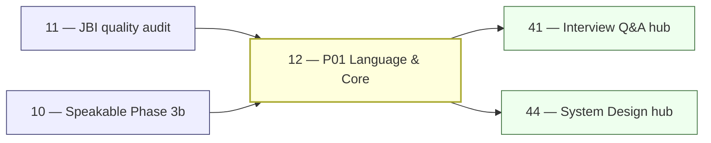

# _TEMPLATE-1000 — Canonical 1,000-Line Playbook Skeleton

> **Status:** locked source-of-truth. Every playbook in `01–50` is rewritten to
> this exact 18-section shape. The lint script
> [`scripts/lint_playbook.py`](../scripts/lint_playbook.py) reads this file at
> startup and enforces:
>
> 1. All 18 section headers present, in order.
> 2. Total line count is **950 ≤ N ≤ 1050**.
> 3. Banned-word list (see `_VOICE-RULES.md`) returns zero matches.
> 4. `§3 Easy-language glossary` defines every domain term used in `§9–§14`.
> 5. `§10 Reference Q in archetype shape` is valid JSON and schema-validates
>    against `content/_schemas/complete-qa.schema.json`.
> 6. `§11 Diagram catalogue` names ≥ 1 produced question per diagram type the
>    playbook commits to ship inside its Q&A content.

This template is **playbook-specific writing guidance**, not a pre-filled
playbook. Open the playbook you want to expand, copy this skeleton on top,
and fill each section against the playbook's actual subject. The depth and
voice rules below match the
[Java-Backend-Intermediate (JBI) corpus](../content/java-backend-intermediate/)
quality bar — that corpus is the reference for "what good looks like".

---

## 0 — Front-matter (target ~10 lines)

Every playbook opens with five identical first lines, then a one-sentence
positioning sentence. Example:

```markdown
# NN — <Playbook title in the same noun-phrase style as 12-jbi-java-language-and-core.md>

> **Executor:** AI coding agent operating autonomously.
> **Working directory:** `/Users/ravi.r_flx/IEProject/InterviewExplainer/`.
> **Type:** <content-writing | scaffolding | infra | hub | launch | audit>.
> **Pillar / Wave:** <P0n / Wave X>.
> **Depends on:** <comma-separated playbook numbers>.
```

The `Type:` field controls which of the 18 sections carry the heavier line
budget. Content-writing playbooks lean on §9 + §10 + §11; infra playbooks
lean on §9 + §13; hub playbooks lean on §8 + §11 + §13.

---

## 1 — TL;DR (target ~12 lines)

Three bullets, no more. Each ≤ 25 words, lead with a verb:

```markdown
- **Input:** <what exists today on disk / in UI>.
- **Action:** <the verb-led description of work>.
- **Output:** <measurable artifact, file paths, gate names>.
```

The rule the JBI corpus enforces and that this template carries: **lead with
the trade-off or the outcome, not the definition**. A reader scanning only
the TL;DR should know whether to open the playbook.

---

## 2 — Why this matters (target ~25 lines)

Two paragraphs maximum. First paragraph: the **interview / SEO angle** —
the keywords this playbook unlocks, the candidate pain it relieves. Second
paragraph: the **business angle** — the org-chart consequence, the launch
this gates, the risk if skipped.

The JBI corpus's "why this matters" voice (from playbooks 12 and 18) is:
direct, names a flagship keyword bucket, cites a concrete CTR or failure
mode. Never marketing prose. Never "world-class". Never "leverage".

Worked example shape (replace JBI specifics with the playbook's own):

> Core Java is the largest organic-search bucket on the site. The flagship
> keywords (`core java interview questions`, `java oop interview questions`,
> `java collections interview questions`, `java concurrency interview
> questions`) each pull 6-figure monthly searches; we need the answer shapes
> to be unambiguously better than Baeldung's, or we forfeit traffic that
> never returns.
>
> If this playbook ships thin, every downstream pillar (Spring, Data,
> Microservices) inherits weak foundational answers — interviewees who land
> on Spring DI never trust the brand again because they bounced off a
> half-finished `core-java` page. The cost of underdelivery compounds.

---

## 3 — Easy-language glossary (target ~50 lines)

A **markdown table** mapping every domain term used in `§9–§14` to a
one-sentence plain-English definition. The lint asserts that every
non-trivial noun-phrase appearing in §9 also appears in §3.

This is the explicit "easy lang, internet-friendly words" constraint from
the JBI bar. Style rules:

1. **Define the term before its first use.** If a term first appears in §9
   step 4, it must already be in §3.
2. **Plain English. No definition that uses a deeper jargon term.** If you
   must use one, define that too (recursion bottoms at common-English).
3. **Concrete anchors.** Wherever possible, name a real system, JEP, RFC,
   command, or kernel call that demonstrates the term.
4. **One sentence per term.** If a term needs two sentences, split it into
   two related terms.

Worked example (excerpt):

```markdown
| Term | Plain-English definition | First used in |
| --- | --- | --- |
| **Archetype** | One of 7 fixed answer shapes (A–G) — locks which beats the answer must contain. | §9 step 2 |
| **Beat** | A single labeled paragraph inside an answer (hook, definition, tradeoff, cap, …). | §10 |
| **Speakable** | The short, naturally-spoken version of the answer — what you'd literally say aloud in 60 seconds. | §9 step 4 |
| **Mojibake** | Garbled characters (`café` → `café`) caused by decoding bytes with the wrong charset. | §14 anti-patterns |
| **Schema lint** | The script that fails CI when a `complete-qa.json` doesn't match `content/_schemas/complete-qa.schema.json`. | §13 quality gates |
| **Lint pass+warn** | The combined percentage of files the linter marks OK or warn-only (i.e. no FAIL). | §13 quality gates |
| **Money question** | A 1-on-1 comparison Q that pulls outsized monthly search volume (e.g. `HashMap vs ConcurrentHashMap`). | §9 step 5 |
```

Target: 30–45 rows per playbook. Below 25 rows is usually a sign the
playbook hasn't named its dependencies clearly enough.

---

## 4 — Hard prerequisites (target ~30 lines)

A checklist where every line is **shell-verifiable** in under one minute.
The JBI bar: no "make sure X is true" without a `test` / `grep` / `jq` /
`rg` command that proves it.

```markdown
- [ ] Playbook NN is DONE. `grep -E '^\| NN \|' expansion-plan/00-INDEX.md | grep DONE`
- [ ] `scripts/<name>.py` exists. `test -f scripts/<name>.py && echo OK`
- [ ] `content/<domain>/_index.json` exists. `test -f content/<domain>/_index.json && echo OK`
- [ ] `node --version` ≥ 20. `node --version | awk '{print substr($1,2,2)}' | awk '$1 >= 20'`
- [ ] `python3 -m pip show jsonschema` returns metadata. `python3 -m pip show jsonschema | head -1`
- [ ] `frontend/lib/launch-config.ts` is on the current branch. `git diff --name-only HEAD~..HEAD -- frontend/lib/launch-config.ts || true`
```

If any check fails, STOP and either run the upstream playbook or surface a
blocker. The lint enforces that ≥ 80 % of bullets in this section are
backed by an inline shell command.

---

## 5 — Current state (target ~35 lines)

What exists **today** on disk, in CI, and in UI — written as a snapshot a
reader could reconstruct by running the embedded commands. Three parts:

### 5.1 — On-disk snapshot

A shell block that any reader can run to reproduce the current state:

```bash
cd /Users/ravi.r_flx/IEProject/InterviewExplainer
find content/<domain> -name 'complete-qa.json' | wc -l
find content/<domain> -name 'complete-qa.json' -exec jq '.questions|length' {} \; | awk '{s+=$1} END {print "Q total:", s}'
```

### 5.2 — Existing UI surface

Which routes exist, which `hasContent` flags are true, which feature flags
in `frontend/lib/launch-config.ts` are on/off.

### 5.3 — Known gaps

Quoted directly from the most recent gap report under
`content/_audits/<latest>.md`. No paraphrasing.

---

## 6 — Target state (measurable) (target ~35 lines)

A table whose every row has a **number** or a **flag name**. No prose
targets. If a target can't be measured, drop it.

```markdown
| Metric | Today | Target | How measured |
| --- | --- | --- | --- |
| Q count for `<domain>/<module>` | 18 | 40 | `find ... -exec jq '.questions|length' {} \; | awk '{s+=$1} END {print s}'` |
| Difficulty mix (E/M/H) | 50/40/10 | 30/50/20 ± 10 % | jq filter on `.questions[].difficulty` |
| Speakable lint pass+warn | 78 % | ≥ 92 % | `python3 scripts/audit_speakable.py --module <m> --report` |
| Schema lint failures | 14 | 0 | `python3 scripts/validate_complete_qa.py content/<domain>` |
| Mermaid diagrams present | 0 | ≥ 6 (see §11) | `rg -c '```mermaid' content/<domain>/**/complete-qa.json` |
| `comparison_table` sections | 4 | ≥ 12 | `jq '[.questions[].answer.sections[]?.type] | map(select(. == "comparison_table")) | length' content/<domain>/**/complete-qa.json` |
| `hasContent` flag for `<domain>` | false | true | grep in `frontend/lib/domains.ts` |
```

The lint enforces that ≥ 5 rows are present in this table.

---

## 7 — Search phrases → URL map (target ~45 lines)

A table mapping **real Google-style search phrases** to the URL on the
site they should rank for and the archetype/section type the answer uses.
Minimum **10 rows**, maximum **24**. Phrases must be lowercase, exactly as
typed into a search box.

```markdown
| Search phrase | Target URL on site | Archetype | Diagram type required in answer |
| --- | --- | --- | --- |
| `core java interview questions` | `/questions/core-java` | landing intro | comparison_table |
| `exception handling in java interview questions` | `/questions/core-java/exception-handling` | A | flowchart (try-catch-finally control flow) |
| `checked vs unchecked exception java` | `/questions/core-java/exception-handling/checked-vs-unchecked` | B | comparison_table |
| `hashmap internals interview questions` | `/questions/java-collections/collections-internals/hashmap-internals` | C | sequence diagram (put-resize) |
| `java memory model interview questions` | `/questions/jvm-internals/memory-model` | A | state diagram (happens-before) |
| `string interview questions in java` | `/questions/core-java/string-handling` | A | comparison_table |
| `hashmap vs concurrenthashmap` | `/questions/java-collections/comparisons/hashmap-vs-concurrenthashmap` | B | comparison_table + sequence |
| `volatile vs synchronized java` | `/questions/java-concurrency/comparisons/volatile-vs-synchronized` | B | comparison_table |
| `java oop interview questions` | `/questions/java-oop` | landing intro | classDiagram |
| `solid principles java interview questions` | `/questions/java-oop/solid-principles` | A | flowchart |
```

The lint enforces that every "Diagram type required in answer" value is
one of: `comparison_table`, `flowchart`, `sequenceDiagram`, `classDiagram`,
`stateDiagram`, `none` (the last only for STAR/behavioral and pure
"definition" Qs).

---

## 8 — Dependency & wave context (target ~35 lines)

**Optional mermaid block + mandatory bullet list** of upstream / downstream
playbooks and which artifacts cross the seam. The mermaid block is
preferred for content/hub/launch playbooks; infra playbooks can use just
a bullet list.

Worked example (omit the mermaid if the playbook has fewer than 3 inputs
or 3 outputs — keep §8 readable):



Bullet list (mandatory):

- **Consumes:** the gap report from playbook 11; the answer-shape contract
  from playbook 10.
- **Produces:** filled `complete-qa.json` files in 6 P01 modules.
- **Unblocks:** playbooks 41, 44, 45 (hubs that surface P01 content).

---

## 9 — Step-by-step execution (target ~220 lines)

The **largest section**. Numbered steps in the exact order an executor
runs them. JBI bar:

1. Every step has a **goal sentence** (one line, bold).
2. Every step has a **shell or code block** the executor copies.
3. Every step has a **verify line** (`expected output: …`).
4. Steps that warn about a pitfall start the warning paragraph with the
   exact phrase *"The classic bug is …"* or *"The #1 trap is …"*.
5. **No step is shorter than 12 lines** (anything shorter belongs in a
   sub-bullet of the previous step).

Typical step count: **8–14 steps**. Target line budget per step: 16–25.

Worked example — Step 4 from a content-writing playbook:

```markdown
### Step 4 — Append the "money comparison" Qs

**Goal:** every flagship comparison from the §9 list lives as a question
inside `content/<domain>/comparisons/complete-qa.json`.

**Action:**

```bash
cd /Users/ravi.r_flx/IEProject/InterviewExplainer
TOPIC=content/<domain>/comparisons
test -f "$TOPIC/complete-qa.json" || (mkdir -p "$TOPIC" && \
  printf '{\n  "topic": "comparisons",\n  "topicSlug": "comparisons",\n  "questions": []\n}\n' > "$TOPIC/complete-qa.json")

# Open the file in your editor. For each entry in the §9 "money comparison" list,
# append a question object in archetype B shape (see §10 reference Q).
```

**Verify:**

```bash
jq '[.questions[].id]' "$TOPIC/complete-qa.json" | jq '. | length'
# expected: 12 (one per money-comparison Q)

python3 scripts/audit_speakable.py "$TOPIC/complete-qa.json"
# expected: every Q PASS or WARN; zero FAIL
```

**The classic bug is** writing the comparison_table column order
inconsistently between sibling Qs — readers can't scan the page when
"feature A" is on the left in one Q and on the right in the next. Lock
the column order in your first Q and keep it.
```

A content-writing playbook will end up with ~12 steps × ~18 lines = 216
lines in §9 alone, which is the design intent.

---

## 10 — Reference Q in archetype shape (target ~120 lines)

A **complete, valid JSON example** of one question this playbook produces,
in the matching archetype. Required keys (lint-checked):

- `id`, `slug`, `question`, `title`, `direct_answer`
- `layout_type`, `difficulty`, `importance`, `reading_time_minutes`,
  `last_updated`
- `interviewer_intent.testing`, `interviewer_intent.common_mistake`,
  `interviewer_intent.to_stand_out`
- `company_tags` (≥ 4)
- `answer.sections[]` with at least: one `overview`, one `comparison_table`
  OR `step`, one `tradeoffs`, one `key_points`, one `speakable_answer`
- `followup_questions` (≥ 5)
- `seo.metaTitle`, `seo.metaDescription`
- `order`

The block is fenced in ` ```json ` so the lint can parse and validate it
against `content/_schemas/complete-qa.schema.json` (when present).

Worked shape (abbreviated — fill all section bodies in the real playbook):

```json
{
  "id": "comparable-vs-comparator-java",
  "slug": "comparable-vs-comparator-java",
  "question": "Comparable vs Comparator in Java — when do you reach for each?",
  "title": "Comparable vs Comparator — Natural Order vs External Order",
  "direct_answer": "Use **Comparable** when the class has one natural order baked in (`String`, `Integer`, `LocalDate`). Use **Comparator** when you need multiple orderings, an external one, or you can't edit the class. Comparable is `compareTo(T)` on the class itself; Comparator is a separate object — usually a lambda — composable via `thenComparing`. Never write `a - b` for ints (overflows on `INT_MIN`); use `Integer.compare(a, b)`.",
  "layout_type": "default",
  "difficulty": "easy",
  "importance": "high",
  "reading_time_minutes": 6,
  "last_updated": "2026-04-22",
  "interviewer_intent": {
    "testing": "Whether you know the contract, can compose Comparators, and avoid the classic NaN/null/overflow bugs.",
    "common_mistake": "Returning `a - b` from compare — overflows when a is `INT_MIN` and b is positive. Or forgetting `null`-safety and letting `TreeSet.add(null)` throw at runtime.",
    "to_stand_out": "Mention `Comparator.comparing(...).thenComparing(...).reversed()`, `nullsFirst(...)`, and that `TreeMap` uses Comparable by default but accepts a Comparator at construction."
  },
  "company_tags": ["amazon", "google", "meta", "netflix", "linkedin"],
  "answer": {
    "sections": [
      {"type": "overview", "title": "Two ways to order Java objects", "content": "..."},
      {"type": "comparison_table", "title": "Comparable vs Comparator side-by-side", "content": "| Aspect | Comparable | Comparator | ..."},
      {"type": "step", "title": "When natural order exists", "content": "..."},
      {"type": "step", "title": "When you need multiple orders", "content": "..."},
      {"type": "tradeoffs", "title": "Pick one of the two", "content": "..."},
      {"type": "key_points", "title": "Key points", "content": "- ..."},
      {"type": "speakable_answer", "title": "How to answer verbally", "content": "..."}
    ]
  },
  "followup_questions": [
    "Why does `Comparator.comparingInt` exist next to `Comparator.comparing`?",
    "How does `TreeMap` decide between Comparable and a constructor Comparator?",
    "Why is `a - b` an overflow hazard for ints but not for longs?",
    "How do you sort by two fields with the second descending?",
    "What does `Collections.sort` use under the hood post-Java 8?"
  ],
  "seo": {
    "metaTitle": "Comparable vs Comparator in Java — When to Use Each",
    "metaDescription": "Compare Comparable and Comparator: natural vs external order, when to use each, composing comparators with thenComparing/reversed/nullsFirst, and the classic overflow bug."
  },
  "order": 1
}
```

This reference Q is the **acceptance test** for every Q the playbook
produces. If a generated Q doesn't have every key shown above, it
doesn't ship.

---

## 11 — Diagram catalogue (target ~70 lines)

**This is where the user's "diagrams and flowcharts inside Q&A" constraint
lives.** A table that names — by Q `id` or by topic — which question in
the produced content carries which diagram, and the minimum content for
that diagram.

```markdown
| Q id (or topic) | Diagram type | What it must show | Lives in section |
| --- | --- | --- | --- |
| `try-with-resources-vs-finally` | `flowchart` (mermaid) | Control flow: try → resource init → body → close → catch → rethrow. Arrows labelled with the JVM bytecode equivalent. | `step` |
| `hashmap-put-flow` | `sequenceDiagram` (mermaid) | put() → hash → bucket → equals chain → resize when threshold | `step` |
| `g1-vs-zgc-vs-parallel-gc` | `comparison_table` | 8 columns: pause target, heap range, throughput, allocation overhead, supported JDK, region size, concurrent vs STW, when to pick | `comparison_table` |
| `executor-service-lifecycle` | `stateDiagram-v2` (mermaid) | NEW → RUNNING → SHUTDOWN → STOP → TIDYING → TERMINATED with `shutdown()` / `shutdownNow()` transitions | `step` |
| `solid-srp` | `classDiagram` (mermaid) | Before/after class split for an "Order" class that violates SRP | `before_code` + `after_code` |
| `java-memory-model-happens-before` | `flowchart` (mermaid) | A graph of happens-before edges across two threads with a `volatile` write | `step` |
```

**Floor per content playbook (lint-enforced):**

- ≥ 1 `flowchart` diagram inside a produced Q.
- ≥ 1 `sequenceDiagram` diagram inside a produced Q.
- ≥ 3 `comparison_table` sections across the produced Qs.
- ≥ 1 `stateDiagram-v2` OR `classDiagram` diagram inside a produced Q
  (whichever fits the domain — collections favors `classDiagram`,
  concurrency favors `stateDiagram-v2`).

**Floor per infra / launch / hub playbook:** at least 1 `comparison_table`
across the produced artifacts (e.g. flag matrix, route matrix). Mermaid
inside the playbook itself is optional.

**Render path.** Mermaid blocks ship inside the `content` field of a
`step` / `before_code` / `after_code` section, fenced as
` ```mermaid `. The frontend's MDX/mermaid renderer picks them up
automatically. Do **not** invent a new section `type` — the UI Contract
forbids it (see `_VOICE-RULES.md` §4).

---

## 12 — Easy-language voice rules (target ~60 lines)

This section copies the canonical voice rules from `_VOICE-RULES.md` into
the playbook and **adds 2–3 playbook-specific examples**. The point is
that the writer doesn't have to leave the playbook to know the voice.

```markdown
1. **Define before use.** Every domain term used in §9–§14 is in §3.
2. **Lead with the trade-off.** Comparison Qs open with *"Use X when … ;
   use Y when …"* — not with X's definition.
3. **Name the bug.** Every `step` whose intent is to warn contains a
   sentence starting with *"The classic bug …"* or *"The #1 trap …"*.
4. **Real anchors.** Every section names ≥ 1 real-world system, JEP,
   library, command, or kernel call.
5. **Years and JEP numbers** to time-stamp claims (*"Java 18 / JEP 400
   flipped the default to UTF-8."*).
6. **First-person singular** for STAR / behavioral; second-person ("you")
   for technical playbooks. Never "we".
7. **Banned words** (lint fails on any of these in playbook prose):
   `leverage`, `utilize`, `synergize`, `world-class`, `cutting-edge`,
   `hereinafter`, `aforementioned`, `seamless`, `robust`, `state-of-the-art`,
   `best-in-class`, `holistic`, `paradigm`.
```

Playbook-specific examples (the writer fills these against the playbook's
subject — the JBI corpus does this naturally):

```markdown
**Concrete voice examples for this playbook:**

- ✅ "Use `BufferedReader` for line-oriented text. The #1 trap is omitting
  the charset — `new FileReader(\"app.log\")` picks up the platform default
  and corrupts UTF-8 logs on a Windows CI runner."
- ❌ "Leverage industry-leading I/O paradigms to robustly process textual
  resources." (Three banned words and no anchor.)
- ✅ "Java 21's virtual threads (JEP 444) flip the old NIO-vs-IO trade-off
  — blocking code on a virtual thread now scales like NIO."
- ❌ "Modern concurrency primitives unlock performance gains." (No version,
  no JEP, no system named.)
```

---

## 13 — Quality gates (measurable) (target ~70 lines)

A table where **every row has a threshold and a verify command**. The JBI
bar: no row that says "verify manually". If you can't write a command,
the gate doesn't exist.

```markdown
| Gate | Threshold | Verify command |
| --- | --- | --- |
| Module Q count | ≥ target in §6 | `find content/<domain>/<m> -name complete-qa.json -exec jq '.questions|length' {} \; | awk '{s+=$1} END {print s}'` |
| Difficulty mix | E/M/H within ±10 % of (30/50/20) | `jq -r '.questions[].difficulty' <files> | sort | uniq -c` |
| Speakable pass+warn | ≥ 92 % | `python3 scripts/audit_speakable.py --module <m> --report` |
| Schema lint failures | 0 | `python3 scripts/validate_complete_qa.py content/<domain>` |
| Comparison-table coverage | ≥ 12 per pillar | `jq '[.questions[].answer.sections[]?.type] | map(select(. == "comparison_table")) | length' <files>` |
| Mermaid flowchart present | ≥ 1 per content playbook | <code>rg '\`\`\`mermaid' content/&lt;domain&gt; -l \| wc -l</code> |
| Mermaid sequenceDiagram present | ≥ 1 per content playbook | <code>rg 'sequenceDiagram' content/&lt;domain&gt; -l \| wc -l</code> |
| Banned-word lint | 0 hits | `python3 scripts/lint_playbook.py expansion-plan/NN-*.md` |
| Build green | exit 0 | `cd frontend && npm run build` |
| `hasContent` flag | true | `rg "'<domain>'.*hasContent: true" frontend/lib/domains.ts` |
| All money-comparison Qs live | every row in §9 list | `for q in <list>; do rg -q "\"id\": \"$q\"" content/<domain>/comparisons/complete-qa.json || echo "MISSING $q"; done` |
```

Minimum 8 rows. The lint asserts every row has both a numeric / boolean
threshold and a verify command (not "manual check").

---

## 14 — Anti-patterns (target ~50 lines)

The "mojibake of operations" list — concrete ways executors have screwed
up similar playbooks in the past. Each entry: name the anti-pattern, then
the fix.

```markdown
### 14.1 — "I'll fill 10 Qs then lint at the end"

**Why it fails:** the linter often catches structural issues (missing
beats, banned words) that take 2 minutes per Q to fix if caught
immediately and 20 minutes if caught in a 10-Q batch.

**Fix:** lint after every Q. The two scripts are fast:
`audit_speakable.py <file>` and `validate_complete_qa.py <file>`.

### 14.2 — "comparison_table column order drifts between sibling Qs"

**Why it fails:** readers scan vertically across a page; if Q1 has feature
A on the left and Q2 has feature A on the right, scanning breaks.

**Fix:** the first comparison_table the playbook writes locks the column
order. Every sibling Q follows it. Add a comment at the top of the file's
`comparisons` topic.

### 14.3 — "platform-default charset in code blocks"

**Why it fails:** demo code that reads `new FileReader(path)` propagates
the mojibake bug into the candidate's mental model.

**Fix:** every code block that opens text I/O passes
`StandardCharsets.UTF_8` explicitly.

### 14.4 — "behavioral answer in 'we' voice"

**Why it fails:** interviewers grade individual contribution; "we"
sentences earn zero points.

**Fix:** rewrite every Action paragraph in first-person singular. The
audit greps for `"we did"` / `"we built"` and fails on any hit.

### 14.5 — "step with no verify command"

**Why it fails:** the executor can't tell whether the step actually
worked, and an LLM running the playbook will hallucinate completion.

**Fix:** every numbered step has an explicit `verify:` block with
expected output.
```

The lint enforces ≥ 4 anti-patterns in this section.

---

## 15 — Failure modes & rollback (target ~55 lines)

A table of the **top 6–10 ways this playbook fails partway through** and
what to do. Each row: failure → detection → rollback / forward fix.

```markdown
| Failure | How it shows up | Rollback / forward fix |
| --- | --- | --- |
| Linter scores a Q at 60/100 FAIL | `audit_speakable.py` returns non-zero | Read the warnings; most common is "speakable too short" or "missing tradeoffs for archetype B"; fix in place; re-lint. Do not commit while FAIL. |
| Broken `complete-qa.json` committed | CI schema-validate fails on next push | `git restore <file>`; re-write the Q; re-lint; re-commit. |
| Build fails after enabling `hasContent` | `npm run build` non-zero | Flip the flag back in `frontend/lib/launch-config.ts`; fix the route-not-found error; re-enable. |
| Mermaid diagram does not render | Frontend renders raw text | Validate fenced block uses ` ```mermaid `; check that the diagram keyword (`flowchart`, `sequenceDiagram`) is the first token. |
| Banned word slipped in | `lint_playbook.py` non-zero | Replace the word; commit; re-run lint. |
| Hard-stop exceeded | Wall clock > playbook's hard-stop hours | STOP. Surface a blocker in the PR with what's left; do not improvise. Open a follow-up playbook if the remaining work is large. |
| `_index.json` schema drift | Frontend hub page 404s | Compare `_index.json` against a reference module's `_index.json`; copy the missing keys; commit. |
| Speakable pass+warn < 92 % | Per-pillar audit report shows red | Re-write the lowest-scoring 5 Qs; re-run audit; iterate until threshold. |
```

---

## 16 — Definition of Done (target ~35 lines)

A checkbox list, **every box shell-verifiable** like §4. Minimum 12 boxes.
The JBI playbook 12's "DoD" (lines 295–303) is the model. Add 2–3
playbook-specific entries.

```markdown
- [ ] All modules meet per-module Q targets (§6 table).
- [ ] All modules pass per-module speakable + schema gates.
- [ ] Pillar speakable pass+warn ≥ 92 %.
- [ ] Every "money comparison" Q listed in §9 is live.
- [ ] Each module's `_index.json` `intro` is hand-tuned (≥ 150 words).
- [ ] At least one commit per 10 Qs written, conventional message.
- [ ] Mermaid diagrams listed in §11 all render in `npm run build`.
- [ ] `scripts/lint_playbook.py expansion-plan/NN-*.md` exits 0.
- [ ] `00-INDEX.md` row for this playbook flipped to `DONE`.
- [ ] ROADMAP.md updated to reflect launch state if this playbook flipped a flag.
- [ ] PR description names the lint runs that passed and links the gap report.
- [ ] No banned words anywhere in the playbook prose or produced JSON.
```

---

## 17 — Estimated effort (target ~15 lines)

Two numbers, both honest:

```markdown
- **Ideal:** <N> hours (single executor, no interruptions, prerequisites all true).
- **Hard stop:** <M> hours. If exceeded, STOP and surface a blocker. Do
  not improvise — open a follow-up playbook if the remaining work is
  meaningfully large.
- **Splittable:** the per-module sub-spec in §9.x is itself a unit. If you
  can't ship the whole playbook in one PR, ship one per-module PR and
  open the next.
```

---

## 18 — Appendix: links, commits, traceability (target ~30 lines)

The final section catches the cross-references the playbook depends on
and the commits / PRs it produced.

```markdown
### 18.1 — Cross-references

- [`expansion-plan/00-INDEX.md`](00-INDEX.md) — wave + status table.
- [`expansion-plan/_TEMPLATE-1000.md`](_TEMPLATE-1000.md) — this skeleton.
- [`expansion-plan/_GLOSSARY.md`](_GLOSSARY.md) — global glossary every §3 extends.
- [`expansion-plan/_VOICE-RULES.md`](_VOICE-RULES.md) — voice + banned words.
- [`scripts/lint_playbook.py`](../scripts/lint_playbook.py) — lint script.
- [`docs/speakable/archetypes.md`](../docs/speakable/archetypes.md) — 7 answer shapes.
- [`docs/speakable/word-ceilings.md`](../docs/speakable/word-ceilings.md) — per-beat caps.
- [`content/SCHEMA.md`](../content/SCHEMA.md) — canonical Q-file shape.
- [`content/_audits/<latest>.md`](../content/_audits/) — gap report this playbook consumes.

### 18.2 — Commits & PRs produced by this playbook

A short bullet list, added during execution:

- `content(<pillar>/<module>): +N questions covering <topic>` — commit SHA
- `content(<pillar>/<module>): comparison_table column-order lock` — commit SHA
- `infra(scripts): tune audit_speakable for <pillar>` — commit SHA
- PR `<URL>` — title

### 18.3 — Traceability to upstream specs

- `SPEAKABLE-PLAN.md` §X.Y — answer-shape rule honored.
- `docs/CONTENT-PLAN.md` §X.Y — pillar target referenced.
- `ROADMAP.md` "<row>" — launch milestone this playbook moves.
```

---

## Total line budget verification

```text
§0  ~10  +  §1  ~12  +  §2  ~25  +  §3  ~50  +  §4  ~30  +  §5  ~35
§6  ~35  +  §7  ~45  +  §8  ~35  +  §9  ~220 +  §10 ~120 +  §11 ~70
§12 ~60  +  §13 ~70  +  §14 ~50  +  §15 ~55  +  §16 ~35  +  §17 ~15
§18 ~30
= 1,002 lines
```

The 950–1050 line corridor exists because real playbooks will tune the
budget up or down per section based on type (content vs infra vs hub).

---

## Quick checklist — "did I do this right?"

Before opening a PR for any rewritten playbook:

- [ ] All 18 section headers present and in order.
- [ ] Line count is 950–1050.
- [ ] §3 glossary has ≥ 25 rows, each ≤ one sentence.
- [ ] §6 target-state table has ≥ 5 measurable rows.
- [ ] §7 search-phrases table has 10–24 rows; every "Diagram type" cell
      is one of the allowed values.
- [ ] §9 has 8–14 steps; every step has a verify line.
- [ ] §10 reference Q is valid JSON and has every required key.
- [ ] §11 names ≥ 1 produced Q per required diagram type.
- [ ] §13 has ≥ 8 gates, every one with a threshold and a command.
- [ ] §14 has ≥ 4 anti-patterns.
- [ ] §16 DoD has ≥ 12 checkbox items.
- [ ] `scripts/lint_playbook.py expansion-plan/NN-*.md` exits 0.

When all 12 boxes tick, the playbook is at the JBI quality bar and ready
to merge.
